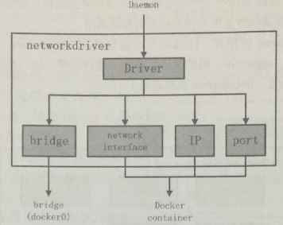

# docker容器技术基础

## 什么是容器

容器是对应用程序及其依赖关系的封装。

容器的优点

- 容器与主机的操作系统共享资源，提高了效率，性能损耗低
- 容器具有可移植性
- 容器是轻量的，可同时运行数十个容器，模拟分布式系统
- 不必花时间在配置和安装上，无需担心系统的改动，以及依赖关系是否满足

容器与虚拟机
 运行在同一主机的3个虚拟机

运行在同一主机的3个容器

区别：
 A.容器只能运行与主机一样的内核
 B.程序库可以共用
 C.容器中执行的进程与主机的进程等价（没有虚拟机管理程序的损耗）
 D.隔离能力，虚拟机更高（将容器运行在虚拟机中）

容器与Docker
 Docker利用现有的Linux容器技术，以不同方式将其封装及扩展（通过提供可移植的镜像及友好的接口），来创建及发布方案。

两部分：

- 负责创建与运行容器的Docker引擎
- 用来发布容器的云服务Docker Hub

## Docker是个什么东西

 Docker是PaaS 提供商 dotCloud 开源的一个基于 LXC 的高级容器引擎，源代码托管在 Github 上, 基于go语言并遵从Apache2.0协议开源。  Docker是通过内核虚拟化技术（namespace以及cgroups等）来提供容器的资源隔离与安全保障。由于Docker通过操作系统层的虚拟化实现隔离，所以Docker容器在运行时，不需要类似虚拟机（ VM）额外的操作系统开销，提高资源利用率。 Docker是一个程序运行、测试、交付的开放平台，Docker被设计为能够使你快速地交付应用。 在Docker中，你可以将你的程序分为不同的基础部分，对于每一个基础部分都可以当做一个应用程序来管理。 Docker能够帮助你快速地测试、快速地编码、快速地交付，并且缩短你从编码到运行应用的周期。  Docker使用轻量级的容器虚拟化平台，并且结合工作流和工具，来帮助你管理、部署你的应用程序。 Docker在其核心，Docker实现了让几乎任何程序都可以在一个安全、隔离的容器中运行。安全和隔离可以使你可以同时在机器上运行多个容器。 Docker容器轻量级的特性，意味着你可以得到更多的硬件性能。  围绕着Docker容器的虚拟化工具和平台，可以在以下几个方面为你提供帮助： 

 1）帮助你把应用程序(包括其余的支持组件)放入到Docker容器中。

 2）分发和转移你的容器至你的团队其它成员来进行进一步的开发和测试。

 3）部署这些应用程序至你的生产环境，不论是本地的数据中心还是云平台。 

**原理**：建立-->传送-->运行

[

## Docker架构

1.总架构

主要模块：
 DockerClient（与Daemon建立通信，发起容器的管理请求）
 DockerDaemon（接收Client请求，处理请求）
 Docker Regisrty（镜像管理）
 Graph（存储镜像）
 Drvier（镜像管理驱动）
 libcontainer（系统内核特性，提供完整、明确的接口给Daemon）
 Docker Container

2.各模块功能及实现
 1）Docker Client
 Docker架构中用户与Docker Daemon建立通信的客户端。
 用户可以使用可执行文件docker作为Docker Client，发起Docker容器的管理请求。

三种方式建立通信：
 tcp://host:port
 unix://path_to_socket
 fd://socketfd

Docker Client发送容器管理请求后，请求由Docker Daemon接收并处理，当Docker Client接收到返回的请求响应并做简单处理后，Docker Client一次完整的生命周期就结束了。

2）Docker Daemon
 常驻在后台的系统进程。

主要作用：
 接收并处理Docker Client发送的请求
 管理所有的Docker容器

Docker Daemon运行时，会在后台启动一个Server，Server负责接收Docker Client发送的请求；接收请求后，Server通过路由与分发调度，找到相应的Handler来处理请求。

三部分组成：
 A.Docker Server
 专门服务于Docker Client，接收并调度分发Client请求。

 Server通过包gorilla/mux创建mux。Router路由器，提供请求的路由功能，每一个路由项由HTTP请求方法（PUT、POST、GET、DELETE)、URL和Handler组成。

每一个Client请求，Server均会创建一个全新的goroutine来服务，在goroutine中，Server首先读取请求内容，然后做请求解析工作，接着匹配相应的路由项，随后调用相应的Handler来处理，最后Handler处理完请求后给Client回复响应。

B.Engine
 核心模块，运行引擎。
 存储着大量容器信息，管理着Docker大部分Job的执行。

handlers对象：
 存储众多特定Job各自的处理方法handler。
 例如：
 {"create":daemon.ContainerCreate,}
 当执行名为"create"的Job时，执行的是daemon.ContainerCreate这个handler。

C.Job
 Engine内部最基本的执行单元，Daemon完成的每一项工作都体现为一个Job。

3）Docker Registry
 存储容器镜像（Docker Image）的仓库。
 Docker Image是容器创建时用来初始化容器rootfs的文件系统内容。

主要作用：

- 搜索镜像
- 下载镜像
- 上传镜像

方式：

- 公有Registry
- 私有Registry

4）Graph
 容器镜像的保管者。

5）Driver
 驱动模块，通过Driver驱动，Docker实现对Docker容器运行环境的定制，定制的维度包括网络、存储、执行方式。

作用：
 将与Docker容器有关的管理从Daemon的所有逻辑中区分开。

实现：
 A.graphdriver
 用于完成容器镜像管理。

初始化前的四种文件系统或类文件系统的驱动在Daemon中注册：
 aufs、btrfs、devmapper用于容器镜像的管理
 vfs用于容器volume的管理

B.networkdriver
 完成Docker容器网络环境的配置。

C.execdriver
 执行驱动，负责创建容器运行时的命名空间，负责容器资源使用的统计与限制，负责容器内部进程的真正运行等。
 Daemon启动过程中加载ExecDriverflag参数在配置文件中默认设为native。

6）libcontainer
 使用Go语言设计的库，不依靠任何依赖，直接访问内核中与容器相关的系统调用。

7）Docker Container
 服务交付的最终体现。

用户对Docker容器的配置：

- 通过指定容器镜像，使得Docker容器可以自定义rootfs等文件系统；
- 通过指定物理资源的配额，使得Docker容器使用受限的资源；
- 通过配置容器网络及其安全策略，使得Docker容器拥有独立且安全的网络环境；
   *通过指定容器的运行命令，使得Docker容器执行指定的任务

**Docker的用途**

 1）快速交付你的应用程序 Docker可以为你的开发过程提供完美的帮助。Docker允许开发者在本地包含了应用程序和服务的容器进行开发，之后可以集成到连续的一体化和部署工作流中。 举个例子，开发者们在本地编写代码并且使用Docker和同事分享其开发栈。当开发者们准备好了之后，他们可以将代码和开发栈推送到测试环境中，在该环境进行一切所需要的测试。从测试环境中，你可以将Docker镜像推送到服务器上进行部署。  2）开发和拓展更加简单 Docker的以容器为基础的平台允许高度可移植的工作。Docker容器可以在开发者机器上运行，也可以在实体或者虚拟机上运行，也可以在云平台上运行。 Docker的可移植、轻量特性同样让动态地管理负载更加简单。你可以用Docker快速地增加应用规模或者关闭应用程序和服务。Docker的快速意味着变动几乎是实时的。  3）达到高密度和更多负载 Docker轻巧快速，它提供了一个可行的、符合成本效益的替代基于虚拟机管理程序的虚拟机。这在高密度的环境下尤其有用。例如，构建你自己的云平台或者PaaS，在中小的部署环境下同样可以获取到更多的资源性能。 

**Docker的主要组成**

 Docker有两个主要的部件： Docker:   开源的容器虚拟化平台。 Docker Hub: 用于分享、管理Docker容器的Docker SaaS平台。 

**Docker的架构 C/S架构**

 Docker使用客户端-服务器(client-server)架构模式。 Docker 客户端会与Docker守护进程进行通信。Docker 守护进程会处理复杂繁重的任务，例如建立、运行、发布你的 Docker 容器。 Docker 客户端和守护进程可以运行在同一个系统上，当然也可以使用Docker客户端去连接一个远程的 Docker 守护进程。 Docker 客户端和守护进程之间通过socket或者RESTful API进行通信。 

1）Docker守护进程

如上图所示，Docker守护进程运行在一台主机上。用户并不直接和守护进程进行交互，而是通过 Docker 客户端间接和其通信。

2）Docker 客户端

Docker 客户端，实际上是 docker 的二进制程序，是主要的用户与 Docker 交互方式。它接收用户指令并且与背后的 Docker 守护进程通信，如此来回往复。

3）Docker 内部

要理解 Docker 内部构建，需要理解以下三种部件：

Docker 镜像 - Docker images

Docker 仓库 - Docker registeries

Docker 容器 - Docker containers

**Docker的组件**

 Docker 镜像 Docker 镜像是Docker容器运行时的只读模板，每一个镜像由一系列的层 (layers) 组成。Docker 使用 UnionFS  来将这些层联合到单独的镜像中。UnionFS  允许独立文件系统中的文件和文件夹(称之为分支)被透明覆盖，形成一个单独连贯的文件系统。正因为有了这些层的存在，Docker  是如此的轻量。当你改变了一个 Docker  镜像，比如升级到某个程序到新的版本，一个新的层会被创建。因此，不用替换整个原先的镜像或者重新建立(在使用虚拟机的时候你可能会这么做)，只是一个新 的层被添加或升级了。现在你不用重新发布整个镜像，只需要升级，层使得分发 Docker 镜像变得简单和快速。  Docker 仓库 Docker 仓库用来保存镜像，可以理解为代码控制中的代码仓库。同样的，Docker 仓库也有公有和私有的概念。公有的 Docker 仓库名字是  Docker Hub。Docker Hub 提供了庞大的镜像集合供使用。这些镜像可以是自己创建，或者在别人的镜像基础上创建。Docker 仓库是 Docker 的分发部分。  Docker 容器 Docker 容器和文件夹很类似，一个Docker容器包含了所有的某个应用运行所需要的环境。每一个 Docker 容器都是从 Docker  镜像创建的。Docker 容器可以运行、开始、停止、移动和删除。每一个 Docker 容器都是独立和安全的应用平台，Docker 容器是  Docker 的运行部分。 

4）libcontainer

Docker 从 0.9 版本开始使用 libcontainer 替代 lxc，libcontainer 和 Linux 系统的交互图如下：

5）命名空间「Namespaces」

 1）pid namespace 不同用户的进程就是通过pid namespace隔离开的，且不同 namespace 中可以有相同 PID。 具有以下特征: 每个namespace中的pid是有自己的pid=1的进程(类似 /sbin/init 进程) 每个 namespace 中的进程只能影响自己的同一个 namespace 或子 namespace 中的进程 因为 /proc 包含正在运行的进程，因此在 container 中的 pseudo-filesystem 的 /proc 目录只能看到自己namespace 中的进程 因为 namespace 允许嵌套，父 namespace 可以影响子 namespace 的进程，所以子 namespace 的进程可以在父namespace中看到，但是具有不同的 pid  

2）mnt namespace 类似 chroot，将一个进程放到一个特定的目录执行。mnt namespace  允许不同namespace的进程看到的文件结构不同，这样每个namespace 中的进程所看到的文件目录就被隔离开了。同 chroot  不同，每个 namespace 中的 container 在 /proc/mounts 的信息只包含所在namespace的mount point。  

3）net namespace 网络隔离是通过 net namespace 实现的， 每个 net namespace 有独立的 network devices, IP addresses, IP routing tables, /proc/net 目录。这样每个 container 的网络就能隔离开来。 docker 默认采用  veth 的方式将 container 中的虚拟网卡同 host 上的一个 docker bridge 连接在一起。  

4）uts namespace UTS ("UNIX Time-sharing System") namespace 允许每个 container 拥有独立的 hostname 和 domain name, 使其在网络上可以被视作一个独立的节点而非 Host 上的一个进程。 

 5）ipc namespace container 中进程交互还是采用 Linux 常见的进程间交互方法 (interprocess communication - IPC),  包括常见的信号量、消息队列和共享内存。然而同 VM 不同，container 的进程间交互实际上还是 host 上具有相同 pid  namespace 中的进程间交互，因此需要在IPC资源申请时加入 namespace 信息 - 每个 IPC 资源有一个唯一的 32bit  ID。  

6）user namespace 每个 container 可以有不同的 user 和 group id, 也就是说可以以 container 内部的用户在 container 内部执行程序而非 Host 上的用户。  有了以上6种namespace从进程、网络、IPC、文件系统、UTS 和用户角度的隔离，一个 container 就可以对外展现出一个独立计算机的能力，并且不同container从OS层面实现了隔离。然而不同  namespace 之间资源还是相互竞争的，仍然需要类似ulimit 来管理每个container所能使用的资源。 

所以最好使用Centos7.X系列的镜像，因为user namespace支持的内核版本是3.8,而Centos6.X系列的镜像的内核版本是2.6.X

6）资源配额「cgroups」

 cgroups 实现了对资源的配额和度量。 cgroups 的使用非常简单，提供类似文件的接口，在 /cgroup 目录下新建一个文件夹即可新建一个 group，在此文件夹中新建  task 文件，并将 pid 写入该文件，即可实现对该进程的资源控制。具体的资源配置选项可以在该文件夹中新建子 subsystem  ，{子系统前缀}.{资源项} 是典型的配置方法， 如 memory.usageinbytes 就定义了该 group 在 subsystem  memory 中的一个内存限制选项。 另外，cgroups 中的 subsystem 可以随意组合，一个 subsystem 可以在不同的 group 中，也可以一个 group 包含多个 subsystem - 也就是说一个 subsystem。  memory 内存相关的限制  cpu 在 cgroup 中，并不能像硬件虚拟化方案一样能够定义 CPU 能力，但是能够定义 CPU 轮转的优先级，因此具有较高 CPU  优先级的进程会更可能得到 CPU 运算。 通过将参数写入 cpu.shares ,即可定义改 cgroup 的 CPU 优先级 -  这里是一个相对权重，而非绝对值  blkio block IO 相关的统计和限制，byte/operation 统计和限制 (IOPS 等)，读写速度限制等，但是这里主要统计的都是同步 IO  devices 设备权限限制 

**Docker的工作原理**

 1）可以建立一个容纳应用程序的容器。 2）可以从Docker镜像创建Docker容器来运行应用程序。 3）可以通过Docker Hub或者自己的Docker仓库分享Docker镜像。 

**Docker镜像是如何工作的？**

 Docker镜像是Docker容器运行时的只读模板，每一个镜像由一系列的层(layers)组成； Docker使用UnionFS(联合文件系统)来将这些层联合到一二镜像中，UnionFS文件系统允许独立文件系统中的文件和文件夹(称之为分支)被透明覆盖，形成一个单独连贯的文件系统。  正因为有了这些层(layers)的存在，Docker才会如此的轻量。当你改变了一个Docker镜像，比如升级到某个程序到新的版本，一个新的层会被创建。因此，不用替换整个原先的镜像或者重新建立(在使用虚拟机的时候你可能会这么做)，只是一个新的层被添加或升级了。所以你不用重新发布整个镜像，只需要升级。层使得分发Docker镜像变得简单和快速。  每个镜像都是从一个基础的镜像开始的，比如ubuntu，一个基础的Ubuntu镜像，或者是Centos，一个基础的Centos镜像。你可以使用你自己的镜像作为新镜像的基础，例如你有一个基础的安装了Nginx的镜像，你可以使用该镜像来建立你的Web应用程序镜像。（Docker通常从Docker Hub获取基础镜像）  Docker镜像从这些基础的镜像创建，通过一种简单、具有描述性的步骤，我们称之为 指令(instructions)。 每一个指令会在镜像中创建一个新的层，指令可以包含这些动作： 1）运行一个命令。 2）增加文件或者文件夹。 3）创建一个环境变量。 5）当运行容器的时候哪些程序会运行。  这些指令存储在Dockerfile文件中。当你需要建立镜像的时候，Docker可以从Dockerfile中读取这些指令并且运行，然后返回一个最终的镜像。 

**Docker仓库是如何工作的？**

 Docker仓库是Docker镜像的存储仓库。可以推送镜像到Docker仓库中,然后在Docker客户端，可以从Docker仓库中搜索镜像。 

**Docker容器是如何工作的？**

 一个Docker容器包含了一个操作系统、用户添加的文件和元数据(meta-data)。每个容器都是从镜像建立的，镜像告诉Docker容器内包含了什么，当容器启动时运行什么程序，还有许多配置数据。 Docker镜像是只读的，当Docker运行一个从镜像建立的容器，它会在镜像顶部添加一个可读写的层，应用程序可以在这里运行。 

**当运行docker容器时发生了什么？**

 使用docker命令时，Docker客户端都告诉Docker守护进程运行一个容器。  docker run -i -t ubuntu /bin/bash 可以来分析这个命令，Docker客户端使用docker命令来运行，run参数表明客户端要运行一个新的容器。 Docker客户端要运行一个容器需要告诉Docker守护进程的最小参数信息是： 1）这个容器从哪个镜像创建，这里是ubuntu，基础的Ubuntu镜像。 2）在容器中要运行的命令，这里是/bin/bash，在容器中运行Bash shell。  那么运行这个命令之后在底层发生了什么呢？ 按照顺序，Docker做了这些事情： 1）拉取ubuntu镜像: Docker检查ubuntu镜像是否存在，如果在本地没有该镜像，Docker会从Docker Hub下载。如果镜像已经存在，Docker会使用它来创建新的容器。 2）创建新的容器: 当Docker有了这个镜像之后，Docker会用它来创建一个新的容器。 3）分配文件系统并且挂载一个可读写的层: 容器会在这个文件系统中创建，并且一个可读写的层被添加到镜像中。 4）分配网络/桥接接口: 创建一个允许容器与本地主机通信的网络接口。 5）设置一个IP地址: 从池中寻找一个可用的IP地址并且服加到容器上。 6）运行你指定的程序: 运行指定的程序。 7）捕获并且提供应用输出: 连接并且记录标准输出、输入和错误让你可以看到你的程序是如何运行的。  由此你就可以拥有一个运行着的Docker容器了！从这里开始你可以管理你的容器，与应用交互，应用完成之后，可以停止或者删除你的容器。 

**Docker的底层技术**

 Docker使用Go语言编写，并且使用了一系列Linux内核提供的性能来实现我们已经看到的这些功能。  命名空间(Namespaces)（这个上面也详细说明了） Docker充分利用了一项称为namespaces的技术来提供隔离的工作空间，我们称之为 container(容器)。当你运行一个容器的时候，Docker为该容器创建了一个命名空间集合。 这样提供了一个隔离层，每一个应用在它们自己的命名空间中运行而且不会访问到命名空间之外。 一些Docker使用到的命名空间有： pid命名空间: 使用在进程隔离(PID: Process ID)。 net命名空间: 使用在管理网络接口(NET: Networking)。 ipc命名空间: 使用在管理进程间通信资源 (IPC: InterProcess Communication)。 mnt命名空间: 使用在管理挂载点 (MNT: Mount)。 uts命名空间: 使用在隔离内核和版本标识 (UTS: Unix Timesharing System)。  群组控制 Docker还使用到了cgroups技术来管理群组。使应用隔离运行的关键是让它们只使用你想要的资源。这样可以确保在机器上运行的容器都是良民(good multi-tenant citizens)。群组控制允许Docker分享或者限制容器使用硬件资源。例如，限制指定的容器的内容使用。  联合文件系统 联合文件系统(UnionFS)是用来操作创建层的，使它们轻巧快速。Docker使用UnionFS提供容器的构造块。Docker可以使用很多种类的UnionFS包括AUFS, btrfs, vfs, and DeviceMapper。  容器格式 Docker连接这些组建到一个包装中，称为一个 container format(容器格式)。默认的容器格式是libcontainer。Docker同样支持传统的Linux容器使用LXC。在未来，Docker也许会支持其它的容器格式，例如与BSD Jails 或 Solaris Zone集成。 

**Docker与VM的区别：**

[

**docker与Openstack的对比**

**Docker与虚拟机比较**

作为一种轻量级的虚拟化方式，Docker在运行应用上跟传统的虚拟机方式相比具有显著优势：

- Docker容器很快，启动和停止可以在秒级实现，这相比传统的虚拟机方式要快得多。
- Docker容器对系统资源需求很少，一台主机上可以同时运行数千个Docker容器。
- Docker通过类似Git的操作来方便用户获取、分发和更新应用镜像，指令简明，学习成本较低。
- Docker通过Dockerfile配置文件来支持灵活的自动化创建和部署机制，提高工作效率。

虚拟机实现了硬件上的虚拟，而Docker则实现了操作系统级别的虚拟。

**Docker用途**：简单配置、代码流水线管理、开发效率、应用隔离、服务器整合、调试能力、多租户、快速部署

参考链接：

https://www.cnblogs.com/kevingrace/p/6547616.html       