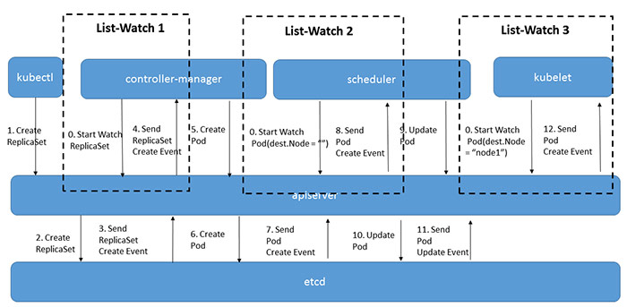

Kubernetes架构图

Kubernetes主要由以下几个核心组件组成：

- etcd键值对数据库,储存K8S集群所有重要信息（持久化）；
- apiserver提供了资源操作的唯一入口，并提供认证、授权、访问控制、API注册和发现等机制；
- controller manager负责维护集群的状态，维持副本期望数目,比如故障检测、自动扩展、滚动更新等；
- scheduler负责资源的调度，按照预定的调度策略将Pod调度到相应的机器上；
- kubelet负责维护容器的生命周期，同时也负责Volume（CVI）和网络（CNI）的管理；
- Container runtime负责镜像管理以及Pod和容器的真正运行（CRI）；
- kube-proxy负责为Service提供cluster内部的服务发现和负载均衡,负责写入、更新与删除规则至 IPTABLES、IPVS 实现服务映射访问的；

除了核心组件，还有一些推荐的Add-ons：

- kube-dns可以为集群中的SVC创建一个域名IP的对应关系解析,负责为整个集群提供DNS服务
- Ingress Controller官方只能实现四层代理，INGRESS 可以实现七层代理
- Heapster提供资源监控
- Dashboard提供GUI
- Federation提供跨可用区的集群
- Fluentd-elasticsearch提供集群日志采集、存储与查询

工作原理描述：

用户通过kubectl或者API server的REST API接口，提交需要运行的docker容器(创建pod请求)；

api server将创建pod的相关请求数据存储到etcd(存储中心)中；

scheduler监听API server，查询还未分配的Node的Pod,然后根据调度策略为这些Pod分配节点；

kube-let则负责在所在的Node节点上接收主节点发来的指令，管理Pod以及Pod中的容器，并定时向master主节点汇报节点资源的使用情况以及容器的情况；

controller-manager 则通过api-service监控整个集群的状态，并确保集群处于预期的工作状态

list watch

