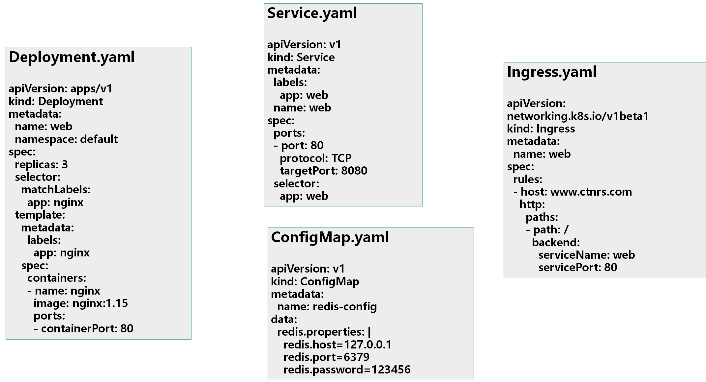
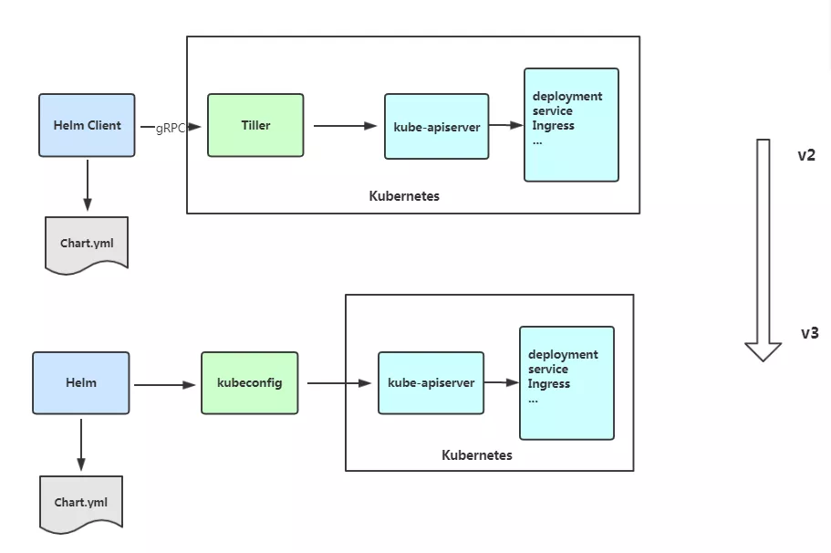
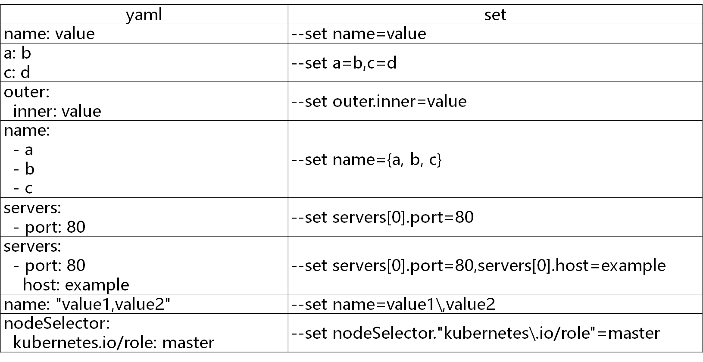

#  Helm应用包管理器

## 1 为什么需要Helm？

K8S上的应用对象，都是由特定的资源描述组成，包括deployment、service等。都保存各自文件中或者集中写到一个配置文件。然后kubectl apply –f 部署。



如果应用只由一个或几个这样的服务组成，上面部署方式足够了。

而对于一个复杂的应用，会有很多类似上面的资源描述文件，例如微服务架构应用，组成应用的服务可能多达十个，几十个。如果有更新或回滚应用的需求，可能要修改和维护所涉及的大量资源文件，而这种组织和管理应用的方式就显得力不从心了。

且由于缺少对发布过的应用版本管理和控制，使Kubernetes上的应用维护和更新等面临诸多的挑战，主要面临以下问题：

1. **如何将这些服务作为一个整体管理**
2. **这些资源文件如何高效复用**
3. **不支持应用级别的版本管理**

## 2 Helm 介绍

Helm是一个Kubernetes的包管理工具，就像Linux下的包管理器，如yum/apt等，可以很方便的将之前打包好的yaml文件部署到kubernetes上。

Helm有两个重要概念：

- **helm：**一个命令行客户端工具，主要用于Kubernetes应用chart的创建、打包、发布和管理。

- **Chart：**应用描述，一系列用于描述 k8s 资源相关文件的集合。
- **Release：**基于Chart的部署实体，一个 chart 被 Helm 运行后将会生成对应的一个 release；将在k8s中创建出真实运行的资源对象。

## 3 Helm v3 变化

**2019年11月13日，** Helm团队发布 `Helm v3 `的第一个稳定版本。

**该版本主要变化如下：**

### 1、 架构变化

**最明显的变化是 Tiller 的删除           (默认读取~/.kube/config 进行k8s 连接)**




### 2、Release名称可以在不同命名空间重用

### 3、支持将 Chart 推送至 Docker 镜像仓库中  

### 4、使用JSONSchema验证chart values  

### 5、其他

1）为了更好地协调其他包管理者的措辞 Helm CLI 个别更名

```ABAP
helm delete-->helm uninstall
helm inspect-->helm show
helm fetch-->helm pull
```

但以上旧的命令当前仍能使用。

2）移除了用于本地临时搭建 `Chart Repository `的 `helm serve` 命令。

3）自动创建名称空间

在不存在的命名空间中创建发行版时，Helm 2创建了命名空间。Helm 3遵循其他Kubernetes对象的行为，如果命名空间不存在则返回错误。

4） 不再需要`requirements.yaml`, 依赖关系是直接在`chart.yaml`中定义。 

## 4 Helm客户端

### 1、部署Helm客户端

Helm客户端下载地址：https://github.com/helm/helm/releases

解压移动到/usr/bin/目录即可。

```ABAP
wget https://get.helm.sh/helm-v3.0.0-linux-amd64.tar.gz
tar zxvf helm-v3.0.0-linux-amd64.tar.gz 
mv linux-amd64/helm /usr/bin/
```

### 2、配置国内Chart仓库

- 微软仓库（http://mirror.azure.cn/kubernetes/charts/）这个仓库强烈推荐，基本上官网有的chart这里都有。
- 阿里云仓库（https://kubernetes.oss-cn-hangzhou.aliyuncs.com/charts  ）
- 官方仓库（https://hub.kubeapps.com/charts/incubator）官方chart仓库，国内有点不好使。

添加存储库：

```ABAP
helm repo add stable http://mirror.azure.cn/kubernetes/charts
helm repo add aliyun https://kubernetes.oss-cn-hangzhou.aliyuncs.com/charts
helm repo add bitnami https://charts.bitnami.com/bitnami
helm repo add aliyuncs https://apphub.aliyuncs.com
helm repo update
```

查看配置的存储库：

```ABAP
helm repo list
helm search repo stable
```

一直在stable存储库中安装charts，你可以配置其他存储库。

删除存储库：

```ABAP
helm repo remove aliyun
```

## 5 Helm基本使用

### 1、Helm 常用命令
```bash
#安装一个 helm 应用
helm install nginx aliyuncs/nginx
helm install nginx .
#卸载一个应用
helm uninstall test
#更新 release 版本
helm upgrade test  .
#查看集群中 helm 应用的详细信息
helm list
#查看集群中 release 的详细信息
helm status nginx
#检索已经发布的 release
helm get manifest test
#查看 release 历史版本，当前版本
helm history  test
#回滚 release 历史版本
helm rollback test  3
#测试 helm chart 剧本是否有错误
helm  lint
#清空、删除 release 历史记录
helm delete --purge test1
#尝试运行 release
helm install --dry-run .
#添加 chart
helm repo add aliyuncs https://apphub.aliyuncs.com1
#查看有哪些chart
helm repo list
#查看 chart 库内可安装应用程序
helm search repo aliyuncs
#创建一个 chart 范例
helm create  test
#打包
helm package .
```

### 2、安装前自定义chart配置选项

上面部署的mysql并没有成功，这是因为并不是所有的chart都能按照默认配置运行成功，可能会需要一些环境依赖，例如PV。

所以我们需要自定义chart配置选项，安装过程中有两种方法可以传递配置数据：

- --values（或-f）：指定带有覆盖的YAML文件。这可以多次指定，最右边的文件优先
- --set：在命令行上指定替代。如果两者都用，--set优先级高

--values使用，先将修改的变量写到一个文件中

```yaml
helm show values stable/mysql

#cat config.yaml 
persistence:
  enabled: true
  storageClass: "managed-nfs-storage"
  accessMode: ReadWriteOnce
  size: 8Gi
mysqlUser: "k8s"
mysqlPassword: "123456"
mysqlDatabase: "k8s"

helm install db -f config.yaml stable/mysql

#kubectl get pods
NAME                                      READY   STATUS    RESTARTS   AGE
db-mysql-57485b68dc-4xjhv                 1/1     Running   0          8m51s
```

以上将创建具有名称的默认MySQL用户k8s，并授予此用户访问新创建的k8s数据库的权限，但将接受该图表的所有其余默认值。

命令行替代变量：

```bash
helm install db --set persistence.storageClass="managed-nfs-storage" stable/mysql
```

也可以把chart包下载下来查看详情：

```bash
helm pull stable/mysql --untar
```

values yaml与set使用：



**该helm install命令可以从多个来源安装：**

- chart存储库
- 本地chart存档（helm install foo-0.1.1.tgz）
- chart目录（helm install path/to/foo）
- 完整的URL（helm install https://example.com/charts/foo-1.2.3.tgz）

### 3、构建一个Helm Chart

先给学员自动生成目录讲解，然后再手动给学员创建目录和各个文件。

```bash
# helm create mychart
Creating mychart
cd mychart
# tree mychart/
├── charts
├── Chart.yaml
├── templates
│   ├── deployment.yaml
│   ├── _helpers.tpl
│   ├── ingress.yaml
│   ├── NOTES.txt
│   └── service.yaml
└── values.yaml
```

- Chart.yaml：用于描述这个 Chart的基本信息，包括名字、描述信息以及版本等。
- values.yaml ：用于存储 templates 目录中模板文件中用到变量的值。
- Templates： 目录里面存放所有yaml模板文件。
- charts：目录里存放这个chart依赖的所有子chart。
- NOTES.txt ：用于介绍Chart帮助信息， helm install 部署后展示给用户。例如：如何使用这个 Chart、列出缺省的设置等。
- _helpers.tpl：放置模板助手的地方，可以在整个 chart 中重复使用

创建Chart后，接下来就是将其部署：

```ABAP
helm install test .
```

也可以打包推送的charts仓库共享别人使用。

```ABAP
helm package .
mychart-0.1.0.tgz
```

### 4、升级、回滚和删除

发布新版本的chart时，或者当您要更改发布的配置时，可以使用该`helm upgrade` 命令。

```bash
helm upgrade --set imageTag=1.17 test .
helm upgrade -f values.yaml test .
```

如果在发布后没有达到预期的效果，则可以使用`helm rollback `回滚到之前的版本。

例如将应用回滚到第一个版本：

```bash
helm rollback test 2
```

卸载发行版，请使用以下`helm uninstall`命令：

```
helm uninstall test
```

查看历史版本配置信息

```
helm get all test
```

## 6 Harbor 管理 Helm Charts

#### 1.安装 harbor 2.0(略)

#### 2 启用 harbor 的 chart repository 服务

默认新版 harbor 不会启用 `chart repository service`，如果需要管理 `helm`，我们需要在安装时添加额外的参数，例如：

```bash
## 默认安装
./install.sh
## 启动 chart repository service 服务
./install.sh --with-chartmuseum
```

等待安装完成即可，安装完成后会有如下类似提示：

```bash
...
✔ ----Harbor has been installed and started successfully.----
...
```

#### 3 添加 harbor helm 仓库

添加基础仓库

```
helm repo add stable https://kubernetes-charts.storage.googleapis.com
helm repo add incubator https://kubernetes-charts-incubator.storage.googleapis.com	
helm repo add bitnami https://charts.bitnami.com/bitnami
helm repo add aliyuncs https://apphub.aliyuncs.com
```

helm repo add命令将 Harbor添加到存储库列表中

```bash
#添加 harbor  helm-charts 仓库地址
helm repo add --ca-file=ca.crt --cert-file=harbor.wzxmt.com.crt --key-file=harbor.wzxmt.com.key --username=admin --password=admin myrepo https://harbor.wzxmt.com/chartrepo
#具体的项目地址
helm repo add --ca-file=ca.crt --cert-file=harbor.wzxmt.com.crt --key-file=harbor.wzxmt.com.key --username=admin --password=admin library https://harbor.wzxmt.com/chartrepo/library
#更新
helm repo update
#安装helm-push 插件
helm plugin install https://github.com/chartmuseum/helm-push
#或者
wget https://github.com/chartmuseum/helm-push/releases/download/v0.9.0/helm-push_0.9.0_linux_amd64.tar.gz
mkdir /root/.local/share/helm/plugins/helm-push -p
tar xf helm-push_0.9.0_linux_amd64.tar.gz -C /root/.local/share/helm/plugins/helm-push
```

#### 4 测试

```bash
#查找项目
helm search repo mysql
helm search hub mysql
#下载一个其它仓储已经有的项目
helm fetch aliyuncs/mysql
#上传到私有仓库
helm push mysql-6.8.0.tgz --ca-file=/opt/cert/ca.crt --cert-file=/opt/cert/harbor.wzxmt.com.crt --key-file=/opt/cert/harbor.wzxmt.com.key --username=admin --password=admin library

Pushing mysql-6.8.0.tgz to library...
Done.
#更新repo
helm repo update
#查找刚刚push mysql
[root@supper ssl]# helm search repo mysql
NAME                                    CHART VERSION   APP VERSION     DESCRIPTION
library/mysql                           6.8.0           8.0.19          Chart to create a Highly available MySQL cluster
```

#### 5 配置连接harbor认证信息

```bash
cat << "EOF" >/root/.config/helm/repositories.yaml
apiVersion: ""
generated: "0001-01-01T00:00:00Z"
repositories:
- caFile: "/opt/cert/ca.crt"
  certFile: "/opt/cert/harbor.wzxmt.com.crt"
  insecure_skip_tls_verify: true
  keyFile: "/opt/cert/harbor.wzxmt.com.key"
  name: library
  password: admin
  url: https://harbor.wzxmt.com/chartrepo/library
  username: admin
EOF
```

## 7 Chart模板

Helm最核心的就是模板，即模板化的K8S manifests文件。

它本质上就是一个Go的template模板。Helm在Go template模板的基础上，还会增加很多东西。如一些自定义的元数据信息、扩展的库以及一些类似于编程形式的工作流，例如条件语句、管道等等。这些东西都会使得我们的模板变得更加丰富。

### 1、模板

有了模板，我们怎么把我们的配置融入进去呢？用的就是这个values文件。这两部分内容其实就是chart的核心功能。

k8s生成yml模板

```bash
kubectl create deployment test --image=nginx -o yaml --dry-run=client >dp.yaml
kubectl expose deployment test --port=80 --target-port=80 --dry-run=client -o yaml >svc.yaml
```

接下来，部署nginx应用，熟悉模板使用，先把templates 目录下面所有文件全部删除掉，这里我们自己来创建模板文件：

```yaml
# rm -rf mychart/templates/*
# vi templates/deployment.yaml
apiVersion: apps/v1
kind: Deployment
metadata:
  name: nginx
spec:
  replicas: 1
  selector:
    matchLabels:
      app: nginx
  template:
    metadata:
      labels:
        app: nginx
    spec:
      containers:
      - image: nginx:1.16
        name: nginx
```

实际上，这已经是一个可安装的Chart包了，通过 `helm install`命令来进行安装：

```
helm install test .
```

这样部署，其实与直接apply没什么两样。

然后使用如下命令可以看到实际的模板被渲染过后的资源文件：

```
helm get manifest test
```

可以看到，这与刚开始写的内容是一样的，包括名字、镜像等，我们希望能在一个地方统一定义这些会经常变换的字段，这就需要用到Chart的模板了。

```yaml
# vi templates/deployment.yaml 
apiVersion: apps/v1
kind: Deployment
metadata:
  name: {{ .Release.Name }}-deployment
spec:
  replicas: 1
  selector:
    matchLabels:
      app: nginx
  template:
    metadata:
      labels:
        app: nginx
    spec:
      containers:
      - image: nginx:1.16
        name: nginx
```

这个deployment就是一个Go template的模板，这里定义的Release模板对象属于Helm内置的一种对象，是从values文件中读取出来的。这样一来，我们可以将需要变化的地方都定义变量。

再执行helm install chart 可以看到现在生成的名称变成了**test-deployment**，证明已经生效了。也可以使用命令helm get manifest查看最终生成的文件内容。

### 2、调试

Helm也提供了`--dry-run --debug`调试参数，帮助你验证模板正确性。在执行`helm install`时候带上这两个参数就可以把对应的values值和渲染的资源清单打印出来，而不会真正的去部署一个release。

比如我们来调试上面创建的 chart 包：

```bash
helm install test2 --dry-run .
```

### 3、内置对象

刚刚我们使用 `{{.Release.Name}}`将 release 的名称插入到模板中。这里的 Release 就是 Helm 的内置对象，下面是一些常用的内置对象：

| Release.Name      | release 名称                    |
| ----------------- | ------------------------------- |
| Release.Name      | release 名字                    |
| Release.Namespace | release 命名空间                |
| Release.Service   | release 服务的名称              |
| Release.Revision  | release 修订版本号，从1开始累加 |

### 4、Values

Values对象是为Chart模板提供值，这个对象的值有4个来源：

- chart 包中的 values.yaml 文件

- 父 chart 包的 values.yaml 文件

- 通过 helm install 或者 helm upgrade 的 `-f`或者 `--values`参数传入的自定义的 yaml 文件

- 通过 `--set` 参数传入的值

chart 的 values.yaml 提供的值可以被用户提供的 values 文件覆盖，而该文件同样可以被 `--set`提供的参数所覆盖。

这里我们来重新编辑 mychart/values.yaml 文件，将默认的值全部清空，然后添加一个副本数：

```yaml
[root@supper nginx]# cat values.yaml
replicas: 3
image: nginx
imageTag: 1.17
label: nginx

[root@supper nginx]# cat templates/dp.yaml
apiVersion: apps/v1
kind: Deployment
metadata:
  name: {{ .Release.Name }}-deployment
  labels:
    app: {{ .Chart.Name }}
    chart: {{ .Release.Name }}
spec:
  replicas: {{ .Values.replicas }}
  selector:
    matchLabels:
      app: {{ .Values.label }}
  template:
    metadata:
      labels:
        app: {{ .Values.label }}
    spec:
      containers:
      - image: {{ .Values.image }}:{{ .Values.imageTag }}
        name: {{ .Release.Name }}
```

查看渲染结果：

```yaml
[root@supper nginx]# helm install --dry-run test .
NAME: test
LAST DEPLOYED: Tue Dec 29 23:08:52 2020
NAMESPACE: default
STATUS: pending-install
REVISION: 1
TEST SUITE: None
HOOKS:
MANIFEST:
---
# Source: nginx/templates/dp.yaml
apiVersion: apps/v1
kind: Deployment
metadata:
  labels:
    app: nginx
    chart: test
  name: test
spec:
  replicas: 3
  selector:
    matchLabels:
      app: nginx
  template:
    metadata:
      labels:
        app: nginx
    spec:
      containers:
      - image: nginx:1.17
        name: test
```

更新应用

```bash
[root@supper nginx]# helm upgrade -f values.yaml --set imageTag=1.14 test .

Release "test" has been upgraded. Happy Helming!
NAME: test
LAST DEPLOYED: Tue Dec 29 23:57:30 2020
NAMESPACE: default
STATUS: deployed
REVISION: 4
TEST SUITE: None
```

### 5、管道与函数

前面讲的模块，其实就是将值传给模板引擎进行渲染，模板引擎还支持对拿到数据进行二次处理。

例如从.Values中读取的值变成字符串，可以使用`quote`函数实现：

```bash
app: {{ quote .Values.label.app }}
渲染效果:
        app: "nginx"
```

quote .Values.label.app 将后面的值作为参数传递给quote函数;模板函数调用语法为：functionName arg1 arg2...

在模板中指定默认值，以防止该值被忽略掉。例如忘记定义，执行helm install 会因为缺少字段无法创建资源，这时就可以定义一个默认值。

```bash
{{ .Values.name | default "nginx" }}
{{ default "nginx" .Values.name }}
```

**其他函数：**

缩进：{{ .Values.resources | indent 12 }}

大写：{{ upper .Values.resources }}

首字母大写：{{ title .Values.resources }}

### 6、流程控制

流程控制是为模板提供了一种能力，满足更复杂的数据逻辑处理。

Helm模板语言提供以下流程控制语句：

- `if/else` 条件块
- `with` 指定范围
- `range` 循环块

#### if

`if/else`块是用于在模板中有条件地包含文本块的方法，条件块的基本结构如下：

```yaml
{{ if PIPELINE }}
  # Do something
{{ else if OTHER PIPELINE }}
  # Do something else
{{ else }}
  # Default case
{{ end }}
```

示例：

```yaml
# cat values.yaml 
devops: k8

# cat templates/deployment.yaml 
...
  template:
    metadata:
      labels:
        app: nginx
        {{ if eq .Values.devops "k8s" }}
        devops: 123
        {{ else }}
        devops: 456
        {{ end }}
```

在上面条件语句使用了`eq`运算符判断是否相等，除此之外，还支持`ne`、 `lt`、 `gt`、 `and`、 `or`等运算符。

通过模板引擎来渲染一下，会得到如下结果：

```yaml
# helm install --dry-run test .
...
      labels:
        app: nginx
        
        devops: 456
       
```

可以看到渲染出来会有多余的空行，这是因为当模板引擎运行时，会将控制指令删除，所有之前占的位置也就空白了，需要使用{{- if ...}} 的方式消除此空行：

```yaml
# cat templates/deploymemt.yaml
...
        env:
        {{- if eq .Values.env.hello "world" }}
          - name: hello
            value: 123
        {{- end }}
```

现在是不是没有多余的空格了，如果使用`-}}`需谨慎，比如上面模板文件中：

```yaml
# cat templates/deploymemt.yaml
...
       env:
        {{- if eq .Values.env.hello "world" -}}
           - hello: true
        {{- end }}
```

这会渲染成：

```yaml
        env:- hello: true
```

因为`-}}`它删除了双方的换行符。

条件判断就是判断条件是否为真，如果值为以下几种情况则为false：

- 一个布尔类型的 `假`

- 一个数字 `零`

- 一个 `空`的字符串

- 一个 `nil`（空或 `null`）

- 一个空的集合（ `map`、 `slice`、 `tuple`、 `dict`、 `array`）

除了上面的这些情况外，其他所有条件都为 `真`。

例如，判断一个空的数组

```yaml
# cat values.yaml 
resources: {}
  # limits:
  #   cpu: 100m
  #   memory: 128Mi
  # requests:
  #   cpu: 100m
  #   memory: 128Mi
```

```yaml
# cat templates/deploymemt.yaml
...
    spec:
      containers:
      - image: nginx:1.16
        name: nginx
        {{- if .Values.resources }}
        resources:
{{ toYaml .Values.resources | indent 10 }}
        {{- end }}
```

例如，判断一个布尔值

```yaml
# cat values.yaml 
service:
  type: ClusterIP
  port: 80

ingress:
  enabled: true 
  host: example.ctnrs.com

# cat templates/ingress.yaml 
{{- if .Values.ingress.enabled -}}
apiVersion: networking.k8s.io/v1beta1
kind: Ingress
metadata:
  name: {{ .Release.Name }}-ingress
spec:
  rules:
  - host: {{ .Values.ingress.host }}
    http:
      paths:
      - path: /
        backend:
          serviceName: {{ .Release.Name }}
          servicePort: {{ .Values.service.port }}
{{ end }}
```

#### with

with ：控制变量作用域。

还记得之前我们的 `{{.Release.xxx}}`或者 `{{.Values.xxx}}`吗？其中的 `.`就是表示对当前范围的引用， `.Values`就是告诉模板在当前范围中查找 `Values`对象的值。而 `with`语句就可以来控制变量的作用域范围，其语法和一个简单的 `if`语句比较类似：

```yaml
{{ with PIPELINE }}
  #  restricted scope
{{ end }}
```

`with`语句可以允许将当前范围 `.`设置为特定的对象，比如我们前面一直使用的 `.Values.label`，我们可以使用 `with`来将 `.`范围指向 `.Values.label`：

```yaml
# cat values.yaml 
...
replicas: 3
label:
  project: ms
  app: nginx

# cat templates/deployment.yaml 
apiVersion: apps/v1
kind: Deployment
metadata:
  name: {{ .Release.Name }}-deployment
spec:
  replicas: 1
  selector:
    matchLabels:
      app: nginx
  template:
    metadata:
      labels:
        app: nginx
    spec:
      {{- with .Values.nodeSelector }}
      nodeSelector:
        team: {{ .team }}
        gpu: {{ .gpu }}
      {{- end }}
      containers:
      - image: nginx:1.16
        name: nginx
```

优化后：

```yaml
      {{- with .Values.nodeSelector }}
      nodeSelector:
        {{- toYaml . | nindent 8 }}
      {{- end }}
```

上面增加了一个{{- with .Values.label }} xxx {{- end }}的一个块，这样的话就可以在当前的块里面直接引用 `.team`和 `.gpu`了。

 **with**是一个循环构造。使用**.Values.nodeSelector中**的值：将其转换为Yaml。 

 toYaml之后的点是循环中**.Values.nodeSelector**的当前值 

#### range

在 Helm 模板语言中，使用 `range`关键字来进行循环操作。

我们在 `values.yaml`文件中添加上一个变量列表：

```yaml
# cat values.yaml 
test:
  - 1
  - 2
  - 3
```

循环打印该列表：

```yaml
apiVersion: v1
kind: ConfigMap
metadata:
  name: {{ .Release.Name }}
data:
  test: |
  {{- range .Values.test }}
    {{ . }}
  {{- end }}
```

循环内部我们使用的是一个 `.`，这是因为当前的作用域就在当前循环内，这个 `.`引用的当前读取的元素。

### 7、变量

接下来学习一个语言中基本的概念：**变量**，在模板中，使用变量的场合不多，但我们将看到如何使用它来简化代码，并更好地利用with和range。

**问题1：获取列表键值**

```yaml
# cat ../values.yaml
env:
  NAME: "gateway"
  JAVA_OPTS: "-Xmx1G"
  
# cat deployment.yaml 
...
		env:
		{{- range $k, $v := .Values.env }}
           - name: {{ $k }}
             value: {{ $v | quote }}
        {{- end }}
```

结果如下：

```yaml
    env:
       - name: JAVA_OPTS
         value: "-Xmx1G"
       - name: NAME
         value: "gateway"
```

上面在 `range`循环中使用 `$key`和 `$value`两个变量来接收后面列表循环的键和值`。`

**问题2：with中不能使用内置对象**

`with`语句块内不能再 `.Release.Name`对象，否则报错。

我们可以将该对象赋值给一个变量可以来解决这个问题：

```yaml
apiVersion: apps/v1
kind: Deployment
metadata:
  name: {{ .Release.Name }}-deployment
spec:
  replicas: {{ .Values.replicas }}
  template:
    metadata:
      labels:
        project: {{ .Values.label.project }}
        app: {{ quote .Values.label.app }}
      {{- with .Values.label }}
        project: {{ .project }}
        app: {{ .app }}
        release: {{ .Release.Name }}
      {{- end }}
```

上面会出错。

```yaml
      {{- $releaseName := .Release.Name -}}
      {{- with .Values.label }}
        project: {{ .project }}
        app: {{ .app }}
        release: {{ $releaseName }}
        # 或者可以使用$符号,引入全局命名空间
        release: {{ $.Release.Name }}
      {{- end }}
```

可以看到在 `with`语句上面增加了一句 `{{-$releaseName:=.Release.Name-}}`，其中 `$releaseName`就是后面的对象的一个引用变量，它的形式就是 `$name`，赋值操作使用 `:=`，这样 `with`语句块内部的 `$releaseName`变量仍然指向的是 `.Release.Name`

### 8、命名模板

命名模板：使用define定义，template引入，在templates目录中默认下划线_开头的文件为公共模板(_helpers.tpl)

```yaml
# cat _helpers.tpl
{{- define "demo.fullname" -}}
{{- .Chart.Name -}}-{{ .Release.Name }}
{{- end -}}

# cat deployment.yaml 
apiVersion: apps/v1
kind: Deployment
metadata:
  name: {{ template "demo.fullname" . }}
...
```

template指令是将一个模板包含在另一个模板中的方法。但是，template函数不能用于Go模板管道。为了解决该问题，增加include功能。

```yaml
# cat _helpers.tpl
{{- define "demo.labels" -}}
app: {{ template "demo.fullname" . }}
chart: "{{ .Chart.Name }}-{{ .Chart.Version }}"
release: "{{ .Release.Name }}"
{{- end -}}

# cat deployment.yaml 
apiVersion: apps/v1
kind: Deployment
metadata:
  name: {{ include "demo.fullname" . }}
  labels:
    {{- include "demo.labels" . | nindent 4 }}
...
```

上面包含一个名为 `demo.labels` 的模板，然后将值 `.` 传递给模板，最后将该模板的输出传递给 `nindent` 函数。

## 7 开发自己的Chart：Java应用为例

1. 先创建模板

   ```bash
   helm create demo
   ```

2. 修改Chart.yaml，Values.yaml，添加常用的变量

3. 在templates目录下创建部署镜像所需要的yaml文件，并变量引用yaml里经常变动的字段

```bash
demo
├── Chart.yaml
├── templates
│   ├── deployment.yaml
│   ├── _helpers.tpl
│   ├── ingress.yaml
│   ├── NOTES.txt
│   └── service.yaml
└── values.yaml
```

Chart.yaml

```yaml
apiVersion: v3
name: demo
description: A Helm chart for Kubernetes
type: application
version: 0.1.0
appVersion: 1.18.14
```

values.yaml

```yaml
replicaCount: 2
image:
  repository: nginx
  pullPolicy: IfNotPresent
  tag: ""
imagePullSecrets: []
podAnnotations: {}
containerPort: 80
service:
  type: ClusterIP
  port: 80
ingress:
  enabled: false
  annotations:
    kubernetes.io/ingress.class: nginx
    kubernetes.io/tls-acme: "true"
    traefik.ingress.kubernetes.io/router.entrypoints: test
  host: "test.wzxmt.com"
  path: /
  tls: {}
   # - secretName: chart-example-tls
   #   hosts:
   #     - chart-example.local
envs:
  JAVA_OPTS: -Xmx1g
readinessProbe:
  enabled: true
  initialDelaySeconds: 60
  periodSeconds: 10
  tcpSocket:
    port: 8888
livenessProbe:
  enabled: true
  initialDelaySeconds: 60
  periodSeconds: 10
  tcpSocket:
    port: 8888
resources:
  limits:
    cpu: 1000m
    memory: 1000Mi
  requests:
    cpu: 100m
    memory: 128Mi
strategy:
  type: RollingUpdate
  rollingUpdate:
    maxUnavailable: 1
    maxSurge: 1
nodeSelector: {}
tolerations: []
affinity: {}
```

_helpers.tpl

```yaml
{{/*
Expand the name of the chart.
*/}}
{{- define "demo.name" -}}
{{- .Chart.Name }}
{{- end }}

{{/*
full name
*/}}
{{- define "demo.fullname" -}}
{{- .Release.Name }}-{{ .Chart.Name }}
{{- end }}

{{/*
Common labels
*/}}
{{- define "demo.labels" -}}
{{ include "demo.selectorLabels" . }}
{{- if .Chart.AppVersion }}
app.kubernetes.io/version: {{ .Chart.AppVersion | quote }}
{{- end }}
app.kubernetes.io/managed-by: {{ .Release.Service }}
{{- end }}

{{/*
Selector labels
*/}}
{{- define "demo.selectorLabels" -}}
app.kubernetes.io/name: {{ include "demo.name" . }}
app.kubernetes.io/instance: {{ .Release.Name }}
{{- end }}
```

deployment.yaml

```yaml
apiVersion: apps/v1
kind: Deployment
metadata:
  name: {{ include "demo.fullname" . }}
  labels:
    {{- include "demo.labels" . | nindent 4 }}
spec:
  replicas: {{ .Values.replicaCount }}
  selector:
    matchLabels:
      {{- include "demo.selectorLabels" . | nindent 6 }}
  template:
    metadata:
    {{- with .Values.podAnnotations }}
      annotations:
        {{- toYaml . | nindent 8 }}
    {{- end }}
      labels:
        {{- include "demo.selectorLabels" . | nindent 8 }}
    spec:
      {{- with .Values.imagePullSecrets }}
      imagePullSecrets:
        {{- toYaml . | nindent 8 }}
      {{- end }}
      containers:
        - name: {{ .Chart.Name }}
          image: "{{ .Values.image.repository }}:{{ .Values.image.tag | default .Chart.AppVersion }}"
          imagePullPolicy: {{ .Values.image.pullPolicy }}
          ports:
            - name: http
              containerPort: {{ .Values.containerPort }}
              protocol: TCP
          env:
          {{- range $key, $value := .Values.envs }}
          - name: {{ $key }}
            value: {{ $value | quote }}
          {{- end }}
          resources:
            {{- toYaml .Values.resources | nindent 12 }}
          readinessProbe:
            {{- if .Values.readinessProbe.enabled }}
            initialDelaySeconds: {{ .Values.readinessProbe.initialDelaySeconds }}
            periodSeconds: {{ .Values.readinessProbe.periodSeconds }}
            tcpSocket:
              port: {{ .Values.readinessProbe.tcpSocket.port }}
            {{- else }}
                {}
            {{- end }}
          livenessProbe:
            {{- if .Values.livenessProbe.enabled }}
            initialDelaySeconds: {{ .Values.livenessProbe.initialDelaySeconds }}
            periodSeconds: {{ .Values.livenessProbe.periodSeconds }}
            tcpSocket:
              port: {{ .Values.livenessProbe.tcpSocket.port }}
            {{- else }}
                {}
            {{- end }}
  strategy:
    {{- toYaml .Values.strategy | nindent 4 }}
      {{- with .Values.nodeSelector }}
      nodeSelector:
        {{- toYaml . | nindent 8 }}
      {{- end }}
      {{- with .Values.affinity }}
      affinity:
        {{- toYaml . | nindent 8 }}
      {{- end }}
      {{- with .Values.tolerations }}
      tolerations:
        {{- toYaml . | nindent 8 }}
      {{- end }}
```

service.yaml

```yaml
apiVersion: v1
kind: Service
metadata:
  name: {{ include "demo.fullname" . }}
  labels:
    {{- include "demo.labels" . | nindent 4 }}
spec:
  type: {{ .Values.service.type }}
  ports:
    - port: {{ .Values.service.port }}
      targetPort: http
      protocol: TCP
      name: http
  selector:
    {{- include "demo.selectorLabels" . | nindent 4 }}
```

ingress.yaml

```yaml
{{- if .Values.ingress.enabled -}}
{{- $fullName := include "demo.fullname" . -}}
{{- $svcPort := .Values.service.port -}}
apiVersion: extensions/v1beta1
kind: Ingress
metadata:
  name: {{ $fullName }}
  labels:
    {{- include "demo.labels" . | nindent 4 }}
  {{- with .Values.ingress.annotations }}
  annotations:
    {{- toYaml . | nindent 4 }}
  {{- end }}
spec:
  {{- if .Values.ingress.tls }}
  tls:
    {{- range .Values.ingress.tls }}
    - hosts:
        {{- range .hosts }}
        - {{ . | quote }}
        {{- end }}
      secretName: {{ .secretName }}
    {{- end }}
  {{- end }}
  rules:
    - host: {{ .Values.ingress.host | quote }}
      http:
        paths:
          - path: {{ .Values.ingress.path }}
            backend:
              serviceName: {{ $fullName }}
              servicePort: {{ $svcPort }}
  {{- end }}
```

NOTES.txt

```yaml
1. Get the application URL by running these commands:
{{- if .Values.ingress.enabled }}
  http{{ if $.Values.ingress.tls }}s{{ end }}://{{ .Values.ingress.host }}
{{- else if contains "NodePort" .Values.service.type }}
  export NODE_PORT=$(kubectl get -n {{ .Release.Namespace }} -o jsonpath="{.spec.ports[0].nodePort}" services {{ include "demo.fullname" . }})
  export NODE_IP=$(kubectl get nodes -n {{ .Release.Namespace }} -o jsonpath="{.items[0].status.addresses[0].address}")
  echo http://$NODE_IP:$NODE_PORT
{{- else if contains "LoadBalancer" .Values.service.type }}
     NOTE: It may take a few minutes for the LoadBalancer IP to be available.
           You can watch the status of by running 'kubectl get -n {{ .Release.Namespace }} svc -w {{ include "demo.fullname" . }}'
  export SERVICE_IP=$(kubectl get svc -n {{ .Release.Namespace }} {{ include "demo.fullname" . }} --template "{{"{{ range (index .status.loadBalancer.ingress 0) }}{{.}}{{ end }}"}}")
  echo http://$SERVICE_IP:{{ .Values.service.port }}
{{- else if contains "ClusterIP" .Values.service.type }}
  export POD_NAME=$(kubectl get pods -n {{ .Release.Namespace }} -l "app.kubernetes.io/name={{ include "demo.name" . }},app.kubernetes.io/instance={{ .Release.Name}}" -o jsonpath="{.items[0].metadata.name}")
  echo "Visit http://127.0.0.1:8080 to use your application"
  kubectl -n {{ .Release.Namespace }} port-forward $POD_NAME 8080:80
{{- end }}
```

打包，并推送至harbor

```bash
helm package .
helm push demo-0.1.0.tgz --ca-file=/opt/cert/ca.crt --cert-file=/opt/cert/harbor.wzxmt.com.crt --key-file=/opt/cert/harbor.wzxmt.com.key --username=admin --password=admin library
```

测试

```bash
helm install test --dry-run library/demo --set ingress.enabled=true --set ingress.host=htest.wzxmt.com --set service.port=8888 --set service.containerPort=8888
```

