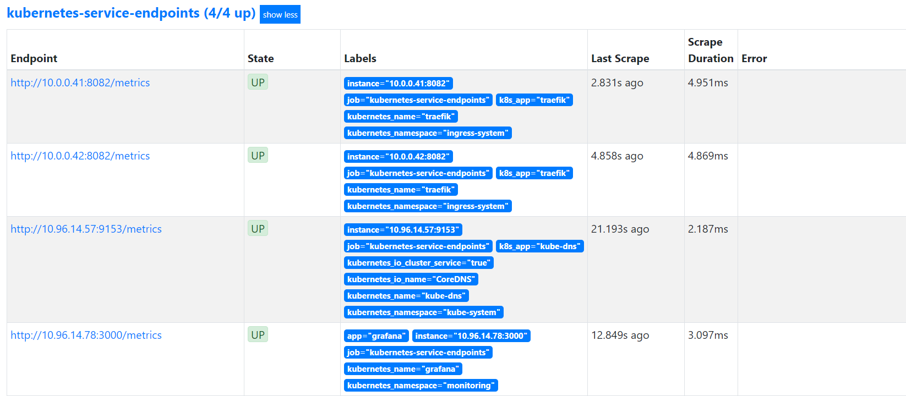
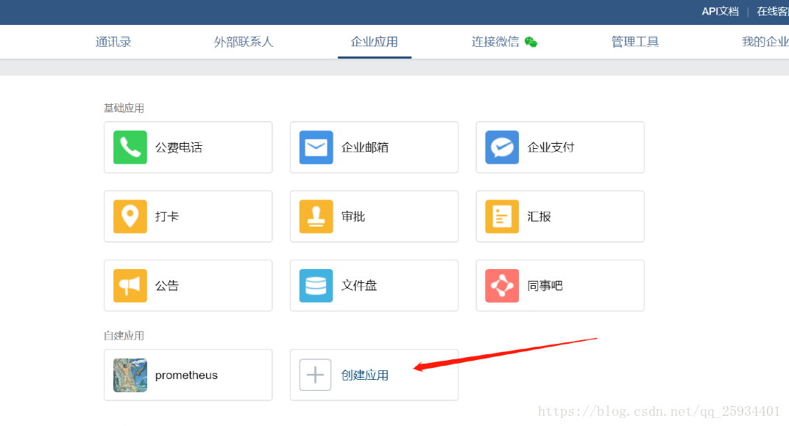
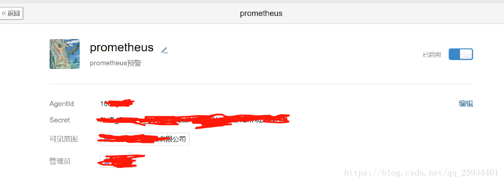
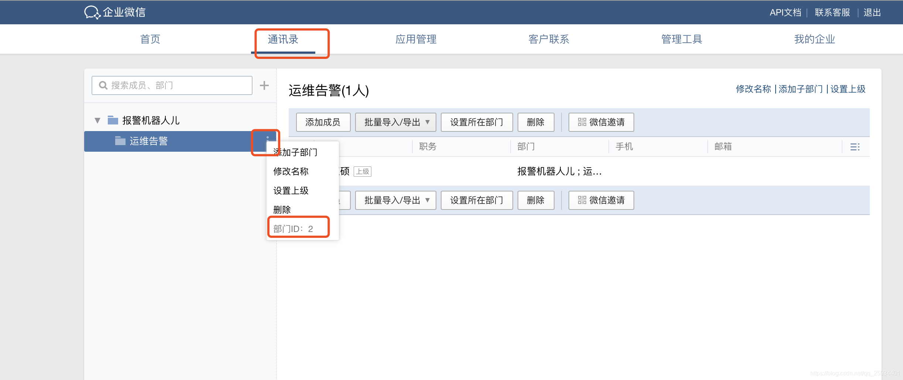
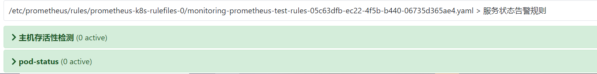

## 项目信息

[kube-prometheus](https://github.com/coreos/kube-prometheus)

该存储库收集了 Kubernetes 清单、[Grafana](http://grafana.com/)仪表板和[Prometheus 规则](https://prometheus.io/docs/prometheus/latest/configuration/recording_rules/)以及文档和脚本，以使用 Prometheus Operator提供实时操作的全景 Kubernetes 集群监控与[Prometheus](https://prometheus.io/)。

## 组件说明

- MetricServer：是kubernetes集群资源使用情况的聚合器，收集数据给kubernetes集群内使用，如kubectl,hpa,scheduler等。
- PrometheusOperator：是一个系统监测和警报工具箱，用来存储监控数据。
- NodeExporter：用于各node的关键度量指标状态数据。
- KubeStateMetrics：收集kubernetes集群内资源对象数据，制定告警规则。
- Prometheus：采用pull方式收集apiserver，scheduler，controller-manager，kubelet组件数据，通过http协议传输。
- Grafana：是可视化数据统计和监控平台。

## 部署kube-prometheus

### 下载kube-prometheus

```bash
git clone https://github.com/coreos/kube-prometheus.git    
cd kube-prometheus/manifests
```

安装CRD

```bash
kubectl create -f setup/
```

### 数据持久化

声明StorageClass 对象

```yaml
cat << 'EOF' >prometheus-storageclass.yaml
apiVersion: storage.k8s.io/v1
kind: StorageClass
metadata:
  name: prometheus-data-db
provisioner: fuseim.pri/ifs
EOF
```

prometheus持久化

```yaml
# prometheus-prometheus.yaml
...
spec:
  retention: 90d #数据持久化时间
  storage:
    volumeClaimTemplate:
      spec:
        storageClassName: prometheus-data-db
        resources:
          requests:
            storage: 10Gi
...
```

grafana持久化

```yaml
cat << 'EOF' >grafana-volume.yaml
kind: PersistentVolumeClaim
apiVersion: v1
metadata:
  name: grafana-set
  namespace: monitoring
spec:
  storageClassName: prometheus-data-db #---指定StorageClass
  accessModes:
    - ReadWriteOnce
  resources:
    requests:
      storage: 5Gi
EOF
```

修改grafana-deployment.yaml

```yaml
#      - emptyDir: {}
#        name: grafana-storage
#添加
      - name: grafana-storage
        persistentVolumeClaim:
          claimName: grafana-set
```

部署kube-prometheus

```bash
kubectl apply -f ./
```

报错解决

```bash
# no matches for kind "PodDisruptionBudget" in version "policy/v1"

sed -ri "s#policy/v1#policy/v1beta1#g" *Budget.yaml
```

查看状态

```bash
kubectl get pod -n monitoring
kubectl top node
```

### ingress暴露服务

```yaml
cat << 'EOF' >prometheus-ingress.yaml 
apiVersion: traefik.containo.us/v1alpha1
kind: IngressRoute
metadata:
  name: grafana
  namespace: monitoring
spec:
  entryPoints:
    - web
  routes:
  - match: Host(`grafana.wzxmt.com`) && PathPrefix(`/`)
    kind: Rule
    services:
    - name: grafana
      port: 3000
---
apiVersion: traefik.containo.us/v1alpha1
kind: IngressRoute
metadata:
  name: prometheus
  namespace: monitoring
spec:
  entryPoints:
    - web
  routes:
  - match: Host(`prometheus.wzxmt.com`) && PathPrefix(`/`)
    kind: Rule
    services:
    - name: prometheus-k8s
      port: 9090
---
apiVersion: traefik.containo.us/v1alpha1
kind: IngressRoute
metadata:
  name: alertmanager
  namespace: monitoring
spec:
  entryPoints:
    - web
  routes:
  - match: Host(`alertmanager.wzxmt.com`) && PathPrefix(`/`)
    kind: Rule
    services:
    - name: alertmanager-main
      port: 9093
EOF
kubectl apply -f prometheus-ingress.yaml 
```

查看IngressRoute

```bash
kubectl get ingressroute -n monitoring
```

### 访问prometheus组件

http://prometheus.wzxmt.com
http://alertmanager.wzxmt.com
http://grafana.wzxmt.com

## 组件监控

### kube-controller-manager

```yaml
cat << 'EOF' >prometheus-kubeControllerManagerService.yaml
apiVersion: v1
kind: Service
metadata:
  namespace: kube-system
  name: kube-controller-manager
  labels:
    k8s-app: kube-controller-manager
spec:
  type: ClusterIP
  ports:
  - name: http-metrics
    port: 10252
    targetPort: 10252
    protocol: TCP
---
apiVersion: v1
kind: Endpoints
metadata:
  labels:
    k8s-app: kube-controller-manager
  name: kube-controller-manager
  namespace: kube-system
subsets:
- addresses:
  - ip: 10.0.0.31
  - ip: 10.0.0.32
  - ip: 10.0.0.33
  ports:
  - name: http-metrics
    port: 10252
    protocol: TCP
---
apiVersion: monitoring.coreos.com/v1
kind: ServiceMonitor
metadata:
  labels:
    k8s-app: kube-controller-manager
  name: kube-controller-manager
  namespace: monitoring
spec:
  endpoints:
  - interval: 30s
    metricRelabelings:
    - action: drop
      regex: etcd_(debugging|disk|request|server).*
      sourceLabels:
      - __name__
    port: http-metrics
  jobLabel: app.kubernetes.io/name
  namespaceSelector:
    matchNames:
    - kube-system
  selector:
    matchLabels:
      k8s-app: kube-controller-manager
EOF
kubectl apply -f prometheus-kubeControllerManagerService.yaml
```

### kube-scheduler

```yaml
cat << 'EOF' >prometheus-kubeSchedulerService.yaml
apiVersion: v1
kind: Service
metadata:
  namespace: kube-system
  name: kube-scheduler
  labels:
    k8s-app: kube-scheduler
spec:
  type: ClusterIP
  ports:
  - name: port
    port: 10251
    protocol: TCP
---
apiVersion: v1
kind: Endpoints
metadata:
  labels:
    k8s-app: kube-scheduler
  name: kube-scheduler
  namespace: kube-system
subsets:
- addresses:
  - ip: 10.0.0.31
  - ip: 10.0.0.32
  - ip: 10.0.0.33
  ports:
  - name: http-metrics
    port: 10251
    protocol: TCP
---
apiVersion: monitoring.coreos.com/v1
kind: ServiceMonitor
metadata:
  labels:
    k8s-app: kube-scheduler
  name: kube-scheduler
  namespace: monitoring
spec:
  endpoints:
  - interval: 30s  # 每30s获取一次信息
    port: http-metrics  # 对应 service 的端口名
  jobLabel: app.kubernetes.io/name
  namespaceSelector:  # 表示去匹配某一命名空间中的service，如果想从所有的namespace中匹配用any: true
    matchNames:
    - kube-system
  selector:  # 匹配的 Service 的 labels，如果使用 mathLabels，则下面的所有标签都匹配时才会匹配该 service，如果使用 matchExpressions，则至少匹配一个标签的 service 都会被选择
    matchLabels:
      k8s-app: kube-scheduler
EOF
kubectl apply -f prometheus-kubeSchedulerService.yaml
```

### coredns

```yaml
cat << 'EOF' >serviceMonitorCoreDNS.yaml
apiVersion: monitoring.coreos.com/v1
kind: ServiceMonitor
metadata:
  labels:
    k8s-app: kube-dns
  name: coredns
  namespace: monitoring
spec:
  endpoints:
  - interval: 30s
    port: metrics
  jobLabel: app.kubernetes.io/name
  namespaceSelector:
    matchNames:
    - kube-system
  selector:
    matchLabels:
      k8s-app: kube-dns
EOF
kubectl apply -f serviceMonitorCoreDNS.yaml
```

## 自定义监控项

在 Kube-Prometheus 中添加一个自定义的监控项。除了 Kubernetes 集群中的一些资源对象、节点以及组件需要监控，有的时候我们可能还需要根据实际的业务需求去添加自定义的监控项（内部与外部）。主要有两种方式，一种是通过ServiceMonitor 对象实现，另一种是通过静态配置实现。

### ServiceMonitor

- **第一步：建立一个 ServiceMonitor 对象，用于 Prometheus 添加监控项；**
- **第二步：为 ServiceMonitor 对象关联 metrics 数据接口的一个 Service 对象；**
- **第三步：确保 Service 对象可以正确获取到 metrics 数据。**

接下来我们就来看看如何添加 Etcd 集群的监控。无论是 Kubernetes 集群外的还是使用 Kubeadm 安装在集群内部的 Etcd 集群，我们这里都将其视作集群外的独立集群，因为对于二者的使用方法没什么特殊之处。

#### EDCT 监控项

添加secret

```bash
kubectl create secret generic etcd-ssl --from-file=ca.pem --from-file=etcd.pem --from-file=etcd-key.pem -n monitoring
```

修改 prometheus-prometheus.yaml 资源文件，并添加内容如下：

```yaml
apiVersion: monitoring.coreos.com/v1
kind: Prometheus
...
  replicas: 2
  secrets:
  - etcd-ssl #  添加secret名称
...
```

更新配置，查看对象

```bash
# 更新资源文件
kubectl apply -f prometheus-prometheus.yaml
# 查看pod状态
kubectl get pod -n monitoring
# 查看证书
kubectl exec -it -n monitoring prometheus-k8s-0 ls /etc/prometheus/secrets/etcd-ssl/
```

创建ServiceMonitor

```yaml
cat << 'EOF' >prometheus-serviceMonitorEtcd.yaml
apiVersion: monitoring.coreos.com/v1
kind: ServiceMonitor
metadata:
  name: etcd
  namespace: monitoring
  labels:
    k8s-app: etcd-k8s
spec:
  jobLabel: k8s-app
  endpoints:
  - port: port
    interval: 30s
    scheme: https
    tlsConfig:
      caFile: /etc/prometheus/secrets/etcd-ssl/ca.pem
      certFile: /etc/prometheus/secrets/etcd-ssl/etcd.pem
      keyFile: /etc/prometheus/secrets/etcd-ssl/etcd-key.pem
      insecureSkipVerify: true
  selector:
    matchLabels:
      k8s-app: etcd
  namespaceSelector:
    matchNames:
    - kube-system
EOF
kubectl apply -f prometheus-serviceMonitorEtcd.yaml
```

定义ETCD Service 对象

```yaml
cat << 'EOF' >prometheus-EtcdServiceEnpoints.yaml
apiVersion: v1
kind: Service
metadata:
  name: etcd
  namespace: kube-system
  labels:
    k8s-app: etcd
spec:
  type: ClusterIP
  clusterIP: None
  ports:
  - name: port
    port: 2379
    protocol: TCP
---
apiVersion: v1
kind: Endpoints
metadata:
  name: etcd
  namespace: kube-system
  labels:
    k8s-app: etcd
subsets:
- addresses:
  - ip: 10.0.0.31
    nodeName: etcd01
  - ip: 10.0.0.32
    nodeName: etcd02
  - ip: 10.0.0.33
    nodeName: etcd03
  ports:
  - name: port
    port: 2379
    protocol: TCP
EOF
kubectl apply -f prometheus-EtcdServiceEnpoints.yaml
```

创建完成后，稍等一会我们可以去Prometheus 里面查看targets，便会出现etcd监控信息：

#### 外部DNS 监控

```yaml
cat << 'EOF' >prometheus-coredns-ServiceEnpoints.yaml
apiVersion: v1
kind: Service
metadata:
  name: kube-dns-01
  namespace: kube-system
  labels:
    k8s-app: kube-dns
spec:
  type: ClusterIP
  ports:
  - name: metrics
    port: 9153
    protocol: TCP
---
apiVersion: v1
kind: Endpoints
metadata:
  name: kube-dns-01
  namespace: kube-system
  labels:
    k8s-app: kube-dns
subsets:
- addresses:
  - ip: 10.0.0.100
  ports:
  - name: metrics
    port: 9153
    protocol: TCP
EOF
kubectl apply -f prometheus-coredns-ServiceEnpoints.yaml
```

#### Traefik 监控

查看Traefik Service标签

```bash
kubectl get svc --show-labels -n ingress-system

NAME      TYPE        CLUSTER-IP   EXTERNAL-IP   PORT(S)                            AGE   LABELS
traefik   ClusterIP   None         <none>        80/TCP,8080/TCP,443/TCP,8082/TCP   43h   k8s-app=traefik
```

修改标签

```bash
kubectl label svc traefik  -n ingress-system k8s-app=traefik-ingress --overwrite
```

配置服务监控资源

```yaml
cat << 'EOF' >prometheus-serviceMonitorTraefik.yaml
apiVersion: monitoring.coreos.com/v1
kind: ServiceMonitor
metadata:
  name: traefik-ingress
  namespace: monitoring
  labels:
    k8s-app: traefik-ingress
spec:
  jobLabel: k8s-app
  endpoints:
  - port: admin              #设置为metrics地址所对应的ports名称
    interval: 30s
  selector:
    matchLabels:
      k8s-app: traefik-ingress
  namespaceSelector:
    matchNames:
    - ingress-system
EOF
kubectl apply -f prometheus-serviceMonitorTraefik.yaml
```

### 静态文件配置

#### 基础配置

```yaml
cat << EOF >prometheus-additional.yaml
- job_name: 'prometheus_service_http_status' #外部服务
  scrape_interval: 5s
  metrics_path: /probe
  params:
    module: [http_2xx]
  static_configs:
    - targets: ['https://www.baidu.com']
      labels:
        service_http: www
    - targets: ['http://10.0.0.20:8888']
      labels:
        service_http: slb-nginx
  relabel_configs:
    - source_labels: [__address__]
      target_label: __param_target
    - source_labels: [__param_target]
      target_label: instance
    - target_label: __address__
      replacement: blackbox-exporter.monitoring:9115

- job_name: '主机存活检测'
  metrics_path: /probe
  params:
    module: [ping]
  static_configs:
    - targets: ['10.0.0.80']
      labels:
        group: '深圳主机网络PING监控'
  relabel_configs:
    - source_labels: [__address__]
      target_label: __param_target
    - source_labels: [__param_target]
      target_label: instance
    - target_label: __address__
      replacement: blackbox-exporter.monitoring:9115
EOF
```

创建Secret 对象

```bash
kubectl create secret generic additional-configs --from-file=prometheus-additional.yaml -n monitoring
```

添加配置：

```yaml
# prometheus-prometheus.yaml添加以下内容

    serviceAccountName: prometheus-k8s
    additionalScrapeConfigs:
      name: additional-configs
      key: prometheus-additional.yaml
```

更新prometheus资源对象：

```bash
kubectl apply -f prometheus-prometheus.yaml
```

隔一小会儿，可以前往 Prometheus 的 Dashboard 中查看配置是否生效：

在 Prometheus Dashboard 的配置页面下面我们可以看到已经有了对应的的配置信息了，但是我们切换到 targets 页面下面却并没有发现对应的监控任务，查看 Prometheus 的 Pod 日志：

```bash
# kubectl logs -f prometheus-k8s-0 prometheus -n monitoring

level=error ts=2020-05-25T14:45:30.780Z caller=klog.go:94 component=k8s_client_runtime func=ErrorDepth msg="/app/discovery/kubernetes/kubernetes.go:262: Failed to list *v1.Service: services is forbidden: User \"system:serviceaccount:monitoring:prometheus-k8s\" cannot list resource \"services\" in API group \"\" at the cluster scope"
```

可以看到有很多错误日志出现，都是`xxx is forbidden`，这说明是 RBAC 权限的问题，通过 prometheus 资源对象的配置可以知道 Prometheus 绑定了一个名为 prometheus-k8s 的 ServiceAccount 对象，而这个对象绑定的是一个名为 prometheus-k8s 的 ClusterRole：

```yaml
#cat prometheus-clusterRole.yaml

apiVersion: rbac.authorization.k8s.io/v1
kind: ClusterRole
metadata:
  name: prometheus-k8s
rules:
- apiGroups:
  - ""
  resources:
  - nodes/metrics
  verbs:
  - get
- nonResourceURLs:
  - /metrics
  verbs:
  - get
```

上面的权限规则中我们可以看到明显没有对Service或者Pod的list权限，添加权限：

```yaml
cat << EOF >prometheus-clusterRole.yaml
apiVersion: rbac.authorization.k8s.io/v1
kind: ClusterRole
metadata:
  name: prometheus-k8s
rules:
- apiGroups:
zhi  - ""
  resources:
  - nodes
  - services
  - endpoints
  - pods
  - nodes/proxy
  verbs:
  - get
  - list
  - watch
- apiGroups:
  - ""
  resources:
  - configmaps
  - nodes/metrics
  verbs:
  - get
- nonResourceURLs:
  - /metrics
  verbs:
  - get
EOF
kubectl apply -f  prometheus-clusterRole.yaml
```

#### 服务自动发现

如果在我们的 Kubernetes 集群中有了很多的Service/Pod，那么我们都需要一个一个的去建立一个对应的 ServiceMonitor 对象来进行监控吗？这样岂不是又变得麻烦起来了？为解决上面的问题，Prometheus Operator 为我们提供了一个额外的抓取配置的来解决这个问题，我们可以通过添加额外的配置来进行服务发现进行自动监控。和前面自定义的方式一样，我们想要在 Prometheus Operator 当中去自动发现并监控具有prometheus.io/scrape=true这个annotations 的 Service

添加自动发现配置，并更新prometheus 资源对象

```yaml
cat<< 'EOF' >prometheus-additional.yaml
- job_name: 'kubernetes-service-endpoints'
  kubernetes_sd_configs:
  - role: endpoints
  relabel_configs:
  - source_labels: [__meta_kubernetes_service_annotation_prometheus_io_scrape]
    action: keep
    regex: true
  - source_labels: [__meta_kubernetes_service_annotation_prometheus_io_scheme]
    action: replace
    target_label: __scheme__
    regex: (https?)
  - source_labels: [__meta_kubernetes_service_annotation_prometheus_io_path]
    action: replace
    target_label: __metrics_path__
    regex: (.+)
  - source_labels: [__address__, __meta_kubernetes_service_annotation_prometheus_io_port]
    action: replace
    target_label: __address__
    regex: ([^:]+)(?::\d+)?;(\d+)
    replacement: $1:$2
  - action: labelmap
    regex: __meta_kubernetes_service_label_(.+)
  - source_labels: [__meta_kubernetes_namespace]
    action: replace
    target_label: kubernetes_namespace
  - source_labels: [__meta_kubernetes_service_name]
    action: replace
    target_label: kubernetes_name
EOF
```

更新配置

```bash
kubectl -n monitoring delete secret additional-configs
kubectl create secret generic additional-configs --from-file=prometheus-additional.yaml -n monitoring
kubectl delete -f prometheus-prometheus.yaml
kubectl apply -f prometheus-prometheus.yaml
```

要想实现自动发现集群中的Service，需要我们在 Service 的`annotation`区域添加`prometheus.io/scrape=true`声明即可。

例：

```yaml
apiVersion: v1
kind: Service
metadata:
  labels:
    app: grafana
  name: grafana
  namespace: monitoring
  annotations:
    prometheus.io/scrape: "true"
    prometheus.io/port: "3000"
spec:
  ports:
  - name: http
    port: 3000
    targetPort: http
  selector:
    app: grafana
```

查看kubernetes-service-endpoints下是否有grafana



后期其他应用，只需在service添加这两行

```yaml
annotations:
  prometheus.io/scrape: "true"
  prometheus.io/port: "9121"
```

## alertmanager

#### 报警处理流程

1、Prometheus Server监控目标主机上暴露的http接口（这里假设接口A），通过上述Promethes配置的'scrape_interval'定义的时间间隔，定期采集目标主机上监控数据。
2、当接口A不可用的时候，Server端会持续的尝试从接口中取数据，直到"scrape_timeout"时间后停止尝试。这时候把接口的状态变为“DOWN”。
3、Prometheus同时根据配置的"evaluation_interval"的时间间隔，定期（默认1min）的对Alert Rule进行评估；当到达评估周期的时候，发现接口A为DOWN，即UP=0为真，激活Alert，进入“PENDING”状态，并记录当前active的时间；
4、当下一个alert rule的评估周期到来的时候，发现UP=0继续为真，然后判断警报Active的时间是否已经超出rule里的‘for’ 持续时间，如果未超出，则进入下一个评估周期；如果时间超出，则alert的状态变为“FIRING”；同时调用Alertmanager接口，发送相关报警数据。
5、AlertManager收到报警数据后，会将警报信息进行分组，然后根据alertmanager配置的“group_wait”时间先进行等待。等wait时间过后再发送报警信息。
6、属于同一个Alert Group的警报，在等待的过程中可能进入新的alert，如果之前的报警已经成功发出，那么间隔“group_interval”的时间间隔后再重新发送报警信息。比如配置的是邮件报警，那么同属一个group的报警信息会汇总在一个邮件里进行发送。
7、如果Alert Group里的警报一直没发生变化并且已经成功发送，等待‘repeat_interval’时间间隔之后再重复发送相同的报警邮件；如果之前的警报没有成功发送，则相当于触发第6条条件，则需要等待group_interval时间间隔后重复发送。
同时最后至于警报信息具体发给谁，满足什么样的条件下指定警报接收人，设置不同报警发送频率，这里有alertmanager的route路由规则进行配置。


#### 配置告警

```yaml
cat<< 'EOF' >alertmanager-secret.yaml
apiVersion: v1
kind: Secret
metadata:
  labels:
    app.kubernetes.io/component: alert-router
    app.kubernetes.io/instance: main
    app.kubernetes.io/name: alertmanager
    app.kubernetes.io/part-of: kube-prometheus
    app.kubernetes.io/version: 0.23.0
  name: alertmanager-main
  namespace: monitoring
stringData:
  alertmanager.yaml: |-
    global:
      resolve_timeout: 5m
    templates:
      - '/etc/alertmanager/config/wechat.tmpl'
    route:
      group_by: ['alertname']
      group_wait: 30s
      group_interval: 5m
      repeat_interval: 60m
      receiver: 'wechat'
    receivers:
    - name: 'wechat'
      wechat_configs:
      - send_resolved: true
        api_url: 'https://qyapi.weixin.qq.com/cgi-bin/'
        corp_id: 'ww34fac7bd8c8ade8d'
        to_party: '2'
        agent_id: '1000004'
        api_secret: '4VU5lzWl3j_YCGvLOvn49sfVpnUvdFAiLgNQSNfOd88'
    inhibit_rules:
      - source_match:
          severity: 'critical'
        target_match:
          severity: 'warning'
        equal: ['alertname', 'dev', 'instance']
  wechat.tmpl: |-
    {{ define "wechat.default.message" }}
    {{- if gt (len .Alerts.Firing) 0 -}}
    {{- range $index, $alert := .Alerts -}}
    {{- if eq $index 0 }}
    ==========异常告警==========
    告警状态: {{ $alert.Labels.status }}
    告警级别: {{ $alert.Labels.severity }}
    告警类型: {{ $alert.Labels.alertname }}
    {{- if gt (len $alert.Labels.instance) 0 }}
    实例信息: {{ $alert.Labels.instance }}
    {{- end }}
    {{- if gt (len $alert.Labels.container) 0 }}
    故障服务: {{ $alert.Labels.container }}
    {{- end }}
    {{- if gt (len $alert.Labels.namespace) 0 }}
    命名空间: {{ $alert.Labels.namespace }}
    {{- end }}
    {{- if gt (len $alert.Labels.node) 0 }}
    节点信息: {{ $alert.Labels.node }}
    {{- end }}
    {{- if gt (len $alert.Labels.pod) 0 }}
    pod名称: {{ $alert.Labels.pod }}
    {{- end }}
    {{- if gt (len $alert.Annotations.value) 0 }}
    触发阀值: {{ $alert.Annotations.value }}
    {{- end }}
    告警详情: {{ $alert.Annotations.message }};{{$alert.Annotations.summary}};{{ $alert.Annotations.description}}
    故障时间: {{ ($alert.StartsAt.Add 28800e9).Format "2006-01-02 15:04:05" }}
    ============END============
    {{- end }}
    {{- end }}
    {{- end }}
    {{- if gt (len .Alerts.Resolved) 0 -}}
    {{- range $index, $alert := .Alerts -}}
    {{- if eq $index 0 }}
    ==========异常恢复==========
    告警状态: {{   .Status }}
    告警级别: {{ $alert.Labels.severity }}
    告警类型: {{ $alert.Labels.alertname }}
    {{- if gt (len $alert.Labels.instance) 0 }}
    实例信息: {{ $alert.Labels.instance }}
    {{- end }}
    {{- if gt (len $alert.Labels.container) 0 }}
    故障服务: {{ $alert.Labels.container }}
    {{- end }}
    {{- if gt (len $alert.Labels.namespace) 0 }}
    命名空间: {{ $alert.Labels.namespace }}
    {{- end }}
    {{- if gt (len $alert.Labels.node) 0 }}
    节点信息: {{ $alert.Labels.node }}
    {{- end }}
    {{- if gt (len $alert.Labels.pod) 0 }}
    pod名称: {{ $alert.Labels.pod }}
    {{- end }}
    {{- if gt (len $alert.Annotations.value) 0 }}
    触发阀值: {{ $alert.Annotations.value }}
    {{- end }}
    告警详情: {{ $alert.Annotations.message }};{{$alert.Annotations.summary}};{{ $alert.Annotations.description}}
    故障时间: {{ ($alert.StartsAt.Add 28800e9).Format "2006-01-02 15:04:05" }}
    恢复时间: {{ ($alert.EndsAt.Add 28800e9).Format "2006-01-02 15:04:05" }}
    ============END============
    {{- end }}
    {{- end }}
    {{- end }}
    {{- end }}  
type: Opaque
EOF
```

step 1: 访问[网站](https://work.weixin.qq.com/) 注册企业微信账号（不需要企业认证）。
step 2: 访问[apps](https://work.weixin.qq.com/wework_admin/loginpage_wx#apps) 创建第三方应用，点击创建应用按钮 -> 填写应用信息：


部门ID：to_party 需要发送的组

可以查看微信告警接口[文档](https://work.weixin.qq.com/api/doc/90000/90135/90236#文本消息)：

参数说明：

corp_id: 企业微信账号唯一 ID， 可以在我的企业中查看。
to_party: 需要发送的组。
agent_id: 第三方企业应用的 ID，可以在自己创建的第三方企业应用详情页面查看。
api_secret: 第三方企业应用的密钥，可以在自己创建的第三方企业应用详情页面查看。

#### 添加告警规则

查看默认规则

```
ll *prometheusRule*
```

添加告警规则

```yaml
cat<< 'EOF' >test-prometheusRule.yaml
apiVersion: monitoring.coreos.com/v1
kind: PrometheusRule
metadata:
  labels:
    app.kubernetes.io/component: controller
    app.kubernetes.io/name: prometheus-operator
    app.kubernetes.io/part-of: kube-prometheus
    app.kubernetes.io/version: 0.52.1
    prometheus: k8s
    role: alert-rules
  name: prometheus-test-rules
  namespace: monitoring
spec:
  groups:
  - name: 服务状态告警规则
    rules:
    - alert: 主机存活性检测
      expr: probe_success{group!=""} == 0
      for: 1m
      labels:
        status: 严重告警
      annotations:
        summary: "{{$labels.instance}} 主机故障！"
        description: "{{$labels.instance}} 主机icmp探测失败，请尽快查看！"
    - alert: Pod_Down
      expr: kube_pod_container_status_running != 1  
      for: 2s
      labels:
        severity: warning
        cluster: k8s
      annotations:
        summary: '{{ $labels.container }} down'
        description: '{{ $labels.pod }} is not running'
EOF
```



## grafana

#### 安装插件

- Kubernetes App

```
grafana-cli plugins install grafana-kubernetes-app
```

- Clock Pannel

```
grafana-cli plugins install grafana-clock-panel
```

- Pie Chart

```
grafana-cli plugins install grafana-piechart-panel
```

- D3 Gauge

```
grafana-cli plugins install briangann-gauge-panel
```

- Discrete

```
grafana-cli plugins install natel-discrete-panel
```

#### 仪表盘

```
13105   Kubernetes for Prometheus Dashboard
8919	Node Exporter for Prometheus Dashboard
9965	Blackbox Exporter 0.14 for Prometheus
11600	Docker Container
10856 	K8 Cluster Detail Dashboard
11543   blackbox
```

