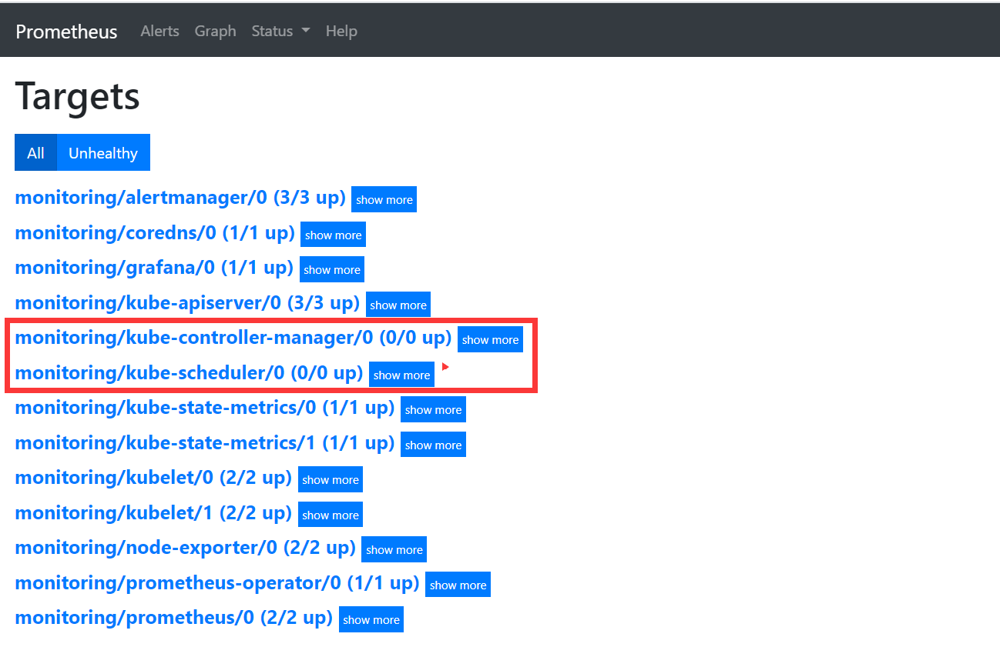
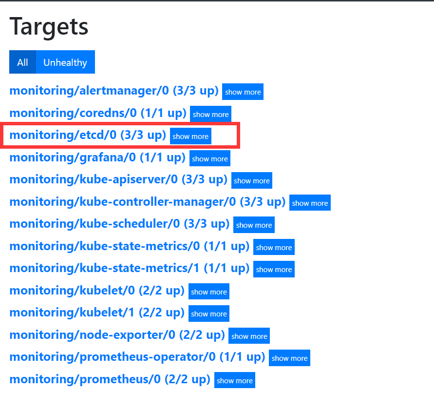

## 相关地址信息

Prometheus github 地址：https://github.com/coreos/kube-prometheus

## 组件说明

- MetricServer：是kubernetes集群资源使用情况的聚合器，收集数据给kubernetes集群内使用，如kubectl,hpa,scheduler等。
- PrometheusOperator：是一个系统监测和警报工具箱，用来存储监控数据。
- NodeExporter：用于各node的关键度量指标状态数据。
- KubeStateMetrics：收集kubernetes集群内资源对象数据，制定告警规则。
- Prometheus：采用pull方式收集apiserver，scheduler，controller-manager，kubelet组件数据，通过http协议传输。
- Grafana：是可视化数据统计和监控平台。

## 构建记录

下载kube-prometheus

```bash
git clone https://github.com/coreos/kube-prometheus.git    
cd /root/kube-prometheus/manifests
```

或者

```bash
wget https://github.com/coreos/kube-prometheus/archive/v0.5.0.tar.gz
tar xf v0.5.0.tar.gz
cd kube-prometheus-0.5.0/manifests/
```

安装CRD

```
kubectl create -f setup/
```

## prometheus配置kubernetes_sd_configs

```yaml
cat << 'EOF' >prometheus-additional.yaml
#自动发现
- job_name: 'kubernetes-service-endpoints'
  kubernetes_sd_configs:
  - role: endpoints
  relabel_configs:
  - source_labels: [__meta_kubernetes_service_annotation_prometheus_io_scrape]
    action: keep
    regex: true
  - source_labels: [__meta_kubernetes_service_annotation_prometheus_io_scheme]
    action: replace
    target_label: __scheme__
    regex: (https?)
  - source_labels: [__meta_kubernetes_service_annotation_prometheus_io_path]
    action: replace
    target_label: __metrics_path__
    regex: (.+)
  - source_labels: [__address__, __meta_kubernetes_service_annotation_prometheus_io_port]
    action: replace
    target_label: __address__
    regex: ([^:]+)(?::\d+)?;(\d+)
    replacement: $1:$2
  - action: labelmap
    regex: __meta_kubernetes_service_label_(.+)
  - source_labels: [__meta_kubernetes_namespace]
    action: replace
    target_label: kubernetes_namespace
  - source_labels: [__meta_kubernetes_service_name]
    action: replace
    target_label: kubernetes_name

- job_name: 'kubernetes-pods'
  kubernetes_sd_configs:
  - role: pod
  relabel_configs:
  - source_labels: [__meta_kubernetes_pod_annotation_prometheus_io_scrape]
    action: keep
    regex: true
  - source_labels: [__meta_kubernetes_pod_annotation_prometheus_io_path]
    action: replace
    target_label: __metrics_path__
    regex: (.+)
  - source_labels: [__address__, __meta_kubernetes_pod_annotation_prometheus_io_port]
    action: replace
    regex: ([^:]+)(?::\d+)?;(\d+)
    replacement: $1:$2
    target_label: __address__
  - action: labelmap
    regex: __meta_kubernetes_pod_label_(.+)
  - source_labels: [__meta_kubernetes_namespace]
    action: replace
    target_label: kubernetes_namespace
  - source_labels: [__meta_kubernetes_pod_name]
    action: replace
    target_label: kubernetes_pod_name

- job_name: 'kubernetes-cadvisor'
  kubernetes_sd_configs:
  - role: node
  relabel_configs:
  - action: labelmap
    regex: __meta_kubernetes_node_label_(.+)
  - source_labels: [__meta_kubernetes_node_name]
    regex: (.+)
    target_label: __address__
    replacement: ${1}.host.com:4194 #需要添加解析

- job_name: 'blackbox_http_pod_probe'
  metrics_path: /probe
  kubernetes_sd_configs:
  - role: pod
  params:
    module: [http_2xx]
  relabel_configs:
  - source_labels: [__meta_kubernetes_pod_annotation_blackbox_scheme]
    action: keep
    regex: http
  - source_labels: [__address__, __meta_kubernetes_pod_annotation_blackbox_port,  __meta_kubernetes_pod_annotation_blackbox_path]
    action: replace
    regex: ([^:]+)(?::\d+)?;(\d+);(.+)
    replacement: $1:$2$3
    target_label: __param_target
  - action: replace
    target_label: __address__
    replacement: blackbox-exporter.monitoring:9115
  - source_labels: [__param_target]
    target_label: instance
  - action: labelmap
    regex: __meta_kubernetes_pod_label_(.+)
  - source_labels: [__meta_kubernetes_namespace]
    action: replace
    target_label: kubernetes_namespace
  - source_labels: [__meta_kubernetes_pod_name]
    action: replace
    target_label: kubernetes_pod_name
    
- job_name: 'blackbox_tcp_pod_probe'
  metrics_path: /probe
  kubernetes_sd_configs:
  - role: pod
  params:
    module: [tcp_connect]
  relabel_configs:
  - source_labels: [__meta_kubernetes_pod_annotation_blackbox_scheme]
    action: keep
    regex: tcp
  - source_labels: [__address__, __meta_kubernetes_pod_annotation_blackbox_port]
    action: replace
    regex: ([^:]+)(?::\d+)?;(\d+)
    replacement: $1:$2
    target_label: __param_target
  - action: replace
    target_label: __address__
    replacement: blackbox-exporter.monitoring:9115
  - source_labels: [__param_target]
    target_label: instance
  - action: labelmap
    regex: __meta_kubernetes_pod_label_(.+)
  - source_labels: [__meta_kubernetes_namespace]
    action: replace
    target_label: kubernetes_namespace
  - source_labels: [__meta_kubernetes_pod_name]
    action: replace
    target_label: kubernetes_pod_name
EOF
```

创建secret对象additional-config

```bash
kubectl create secret generic additional-configs --from-file=prometheus-additional.yaml -n monitoring
```

从权限规则中我们可以看到明显没有对 Service 或者 Pod 的 list 权限，我们只需要添加权限即：

```yaml
cat << 'EOF' >prometheus-clusterRole.yaml
apiVersion: rbac.authorization.k8s.io/v1
kind: ClusterRole
metadata:
  name: prometheus-k8s
rules:
- apiGroups:
  - ""
  resources:
  - nodes
  - services
  - endpoints
  - pods
  - nodes/proxy
  verbs:
  - get
  - list
  - watch
- apiGroups:
  - ""
  resources:
  - configmaps
  - nodes/metrics
  verbs:
  - get
- nonResourceURLs:
  - /metrics
  verbs:
  - get
EOF
kubectl apply -f  prometheus-clusterRole.yaml
```

## Prometheus数据持久化

添加持久化

```yaml
cat<< 'EOF' >prometheus-prometheus.yaml
apiVersion: monitoring.coreos.com/v1
kind: Prometheus
metadata:
  labels:
    prometheus: k8s
  name: k8s
  namespace: monitoring
spec:
  retention: 90d #数据持久化时间
#-----------storage-------
  storage:
    volumeClaimTemplate:
      spec:
        storageClassName: prometheus-data-db
        resources:
          requests:
            storage: 10Gi
#-------------------------
  alerting:
    alertmanagers:
    - name: alertmanager-main
      namespace: monitoring
      port: web
  image: quay.io/prometheus/prometheus:v2.15.2
  nodeSelector:
    kubernetes.io/os: linux
  podMonitorNamespaceSelector: {}
  podMonitorSelector: {}
  replicas: 2
  resources:
    requests:
      memory: 400Mi
  ruleSelector:
    matchLabels:
      prometheus: k8s
      role: alert-rules
  securityContext:
    fsGroup: 2000
    runAsNonRoot: true
    runAsUser: 1000
  serviceAccountName: prometheus-k8s
  additionalScrapeConfigs:                    #配置服务发现功能
    name: additional-configs                  #secret 资源对象名称
    key: prometheus-additional.yaml           #secret 对象中的key
  serviceAccountName: prometheus-k8s
  serviceMonitorNamespaceSelector: {}
  serviceMonitorSelector: {}
  version: v2.15.2
EOF
```

申明StorageClass 对象

```yaml
cat << 'EOF' >prometheus-storageclass.yaml
apiVersion: storage.k8s.io/v1
kind: StorageClass
metadata:
  name: prometheus-data-db
provisioner: fuseim.pri/ifs
EOF
kubectl apply -f prometheus-storageclass.yaml
```

## grafana数据持久化

在nfs主机上创建共享存储

```bash
mkdir /data/nfs-volume/grafana -p
chmod 777 /data/nfs-volume/grafana
```

创建pv与pvc

```yaml
cat << 'EOF' >grafana-volume.yaml
apiVersion: v1
kind: PersistentVolume
metadata:
  name: grafana-set
spec:
  capacity:
    storage: 10Gi
  accessModes:
    -  ReadWriteMany
  persistentVolumeReclaimPolicy: Recycle
  nfs:
    server: 10.0.0.20
    path: /data/nfs-volume/grafana
---
apiVersion: v1
kind: PersistentVolumeClaim
metadata:
  name: grafana-set
  namespace: monitoring
spec:
  accessModes:
  - ReadWriteMany
  resources:
    requests:
      storage: 8Gi
EOF
```

修改grafana-deployment.yaml

```yaml
#      - emptyDir: {}
#        name: grafana-storage
#添加
      - name: grafana-storage
        persistentVolumeClaim:
          claimName: grafana-set
```

部署kube-prometheus

```bash
kubectl apply -f .
```

```bash
[root@m2 ~]# kubectl get pod -n monitoring
NAME                                   READY   STATUS    RESTARTS   AGE
alertmanager-main-0                    2/2     Running   0          18m
alertmanager-main-1                    2/2     Running   0          18m
alertmanager-main-2                    2/2     Running   0          50m
grafana-5c55845445-5wnw4               1/1     Running   0          50m
kube-state-metrics-957fd6c75-4v25p     3/3     Running   0          41m
node-exporter-9hvfl                    2/2     Running   0          17m
node-exporter-v2z49                    2/2     Running   0          17m
node-exporter-zp4qb                    2/2     Running   0          17m
prometheus-adapter-5949969998-57dj6    1/1     Running   0          13m
prometheus-k8s-0                       3/3     Running   1          4m17s
prometheus-k8s-1                       3/3     Running   1          4m35s
prometheus-operator-574fd8ccd9-5vk4x   2/2     Running   0          16m
```

出现上面这种，表示已经部署成功，验证：

```bash
[root@m2 ~]# kubectl top node
NAME   CPU(cores)   CPU%   MEMORY(bytes)   MEMORY%   
n1     64m          3%     927Mi           49%       
n2     74m          3%     722Mi           38%       
n3     65m          3%     945Mi           50%   
```

## traefik暴露prometheus

traefik-grafana

```yaml
cat << 'EOF' >traefik-grafana.yaml 
apiVersion: traefik.containo.us/v1alpha1
kind: IngressRoute
metadata:
  name: grafana
  namespace: monitoring
spec:
  entryPoints:
    - web
  routes:
  - match: Host(`grafana.wzxmt.com`) && PathPrefix(`/`)
    kind: Rule
    services:
    - name: grafana
      port: 3000
EOF
kubectl apply -f traefik-grafana.yaml
```

修改 traefik- prometheus

```yaml
cat << 'EOF' >traefik-prometheus.yaml
apiVersion: traefik.containo.us/v1alpha1
kind: IngressRoute
metadata:
  name: prometheus
  namespace: monitoring
spec:
  entryPoints:
    - web
  routes:
  - match: Host(`prometheus.wzxmt.com`) && PathPrefix(`/`)
    kind: Rule
    services:
    - name: prometheus-k8s
      port: 9090
EOF
kubectl apply -f traefik-prometheus.yaml
```

traefik-alertmanager

```yaml
cat << 'EOF' >traefik-alertmanager.yaml
apiVersion: traefik.containo.us/v1alpha1
kind: IngressRoute
metadata:
  name: alertmanager
  namespace: monitoring
spec:
  entryPoints:
    - web
  routes:
  - match: Host(`alertmanager.wzxmt.com`) && PathPrefix(`/`)
    kind: Rule
    services:
    - name: alertmanager-main
      port: 9093
EOF
kubectl apply -f traefik-alertmanager.yaml
```

查看IngressRoute

```bash
[root@m1 ~]# kubectl get ingressroute -n monitoring
NAME           AGE
alertmanager   3m46s
grafana        4m36s
prometheus     4m12s
```

## 访问prometheus组件

http://prometheus.wzxmt.com
http://alertmanager.wzxmt.com
http://grafana.wzxmt.com

## kube-controller-manager 和 kube-scheduler  targets不正常解决

我们可以看到大部分的配置都是正常的，只有两个没有管理到对应的监控目标，比如 kube-controller-manager 和 kube-scheduler 这两个系统组件



查看kube-controller-manager 和 kube-scheduler 的ServiceMonitor资源的定义，发现系统中根本就没有对应的Service。

prometheus-kubeControllerManagerService

```yaml
cat << 'EOF' >prometheus-kubeControllerManagerService.yaml
apiVersion: v1
kind: Service
metadata:
  namespace: kube-system
  name: kube-controller-manager
  labels:
    k8s-app: kube-controller-manager
spec:
  selector:
    component: kube-controller-manager
  type: ClusterIP
  clusterIP: None
  ports:
  - name: http-metrics
    port: 10252
    targetPort: 10252
    protocol: TCP
---
apiVersion: v1
kind: Endpoints
metadata:
  labels:
    k8s-app: kube-controller-manager
  name: kube-controller-manager
  namespace: kube-system
subsets:
- addresses:
  - ip: 10.0.0.31
  - ip: 10.0.0.32
  - ip: 10.0.0.33
  ports:
  - name: http-metrics
    port: 10252
    protocol: TCP
EOF
```

prometheus-kubeSchedulerService

```yaml
cat << 'EOF' >prometheus-kubeSchedulerService.yaml
apiVersion: v1
kind: Service
metadata:
  namespace: kube-system
  name: kube-scheduler
  labels:
    k8s-app: kube-scheduler
spec:
  type: ClusterIP
  clusterIP: None
  ports:
  - name: port
    port: 10251
    protocol: TCP
---
apiVersion: v1
kind: Endpoints
metadata:
  labels:
    k8s-app: kube-scheduler
  name: kube-scheduler
  namespace: kube-system
subsets:
- addresses:
  - ip: 10.0.0.31
  - ip: 10.0.0.32
  - ip: 10.0.0.33
  ports:
  - name: http-metrics
    port: 10251
    protocol: TCP
EOF
```

部署

```
kubectl apply -f prometheus-kubeControllerManagerService.yaml
kubectl apply -f prometheus-kubeSchedulerService.yaml
```

这时，两个targets下面就会有内容产生了。

## 自定义 Kube-Prometheus 监控项

前面我们讲解了 如何快速部署 Kube-Prometheus 监控系统，下面我们继续介绍如何在 Kube-Prometheus 中添加一个自定义的监控项。除了 Kubernetes 集群中的一些资源对象、节点以及组件需要监控，有的时候我们可能还需要根据实际的业务需求去添加自定义的监控项，添加一个自定义监控的步骤也是非常简单的。

- **第一步：建立一个 ServiceMonitor 对象，用于 Prometheus 添加监控项；**
- **第二步：为 ServiceMonitor 对象关联 metrics 数据接口的一个 Service 对象；**
- **第三步：确保 Service 对象可以正确获取到 metrics 数据。**

接下来我们就来看看如何添加 Etcd 集群的监控。无论是 Kubernetes 集群外的还是使用 Kubeadm 安装在集群内部的 Etcd 集群，我们这里都将其视作集群外的独立集群，因为对于二者的使用方法没什么特殊之处。

## 添加EDCT监控项

添加secret

```bash
cd /etc/kubernetes/pki/
kubectl create secret generic etcd-ssl --from-file=peer-ca.pem --from-file=etcd.pem --from-file=etcd-key.pem -n monitoring
```

修改 prometheus-prometheus.yaml 资源文件，并添加内容如下：

```
apiVersion: monitoring.coreos.com/v1
kind: Prometheus
......
  replicas: 2
  secrets:
  - etcd-ssl#  添加secret名称
......
```

更新配置，查看对象

```
# 更新资源文件
kubectl apply -f prometheus-prometheus.yaml
# 查看pod状态
kubectl get pod -n monitoring
# 查看证书
kubectl exec -it -n monitoring prometheus-k8s-0 ls /etc/prometheus/secrets/etcd-ssl/
```

创建ServiceMonitor

```yaml
cat << 'EOF' >prometheus-serviceMonitorEtcd.yaml
apiVersion: monitoring.coreos.com/v1
kind: ServiceMonitor
metadata:
  name: etcd
  namespace: monitoring
  labels:
    k8s-app: etcd-k8s
spec:
  jobLabel: k8s-app
  endpoints:
  - port: port
    interval: 30s
    scheme: https
    tlsConfig:
      caFile: /etc/prometheus/secrets/etcd-ssl/peer-ca.pem
      certFile: /etc/prometheus/secrets/etcd-ssl/etcd.pem
      keyFile: /etc/prometheus/secrets/etcd-ssl/etcd-key.pem
      insecureSkipVerify: true
  selector:
    matchLabels:
      k8s-app: etcd
  namespaceSelector:
    matchNames:
    - kube-system
EOF
```

创建资源

```
kubectl apply -f prometheus-serviceMonitorEtcd.yaml
kubectl get servicemonitors -n monitoring |grep etcd
```

定义ETCD Service 对象

```yaml
cat << 'EOF' >prometheus-EtcdService.yaml
apiVersion: v1
kind: Service
metadata:
  name: etcd
  namespace: kube-system
  labels:
    k8s-app: etcd
spec:
  type: ClusterIP
  clusterIP: None
  ports:
  - name: port
    port: 2379
    protocol: TCP
EOF
```

定义ETCD Endpoints对象

```yaml
cat << 'EOF' >prometheus-EtcdServiceEnpoints.yaml
apiVersion: v1
kind: Endpoints
metadata:
  name: etcd
  namespace: kube-system
  labels:
    k8s-app: etcd
subsets:
- addresses:
  - ip: 10.0.0.31
    nodeName: etcd01
  - ip: 10.0.0.32
    nodeName: etcd02
  - ip: 10.0.0.33
    nodeName: etcd03
  ports:
  - name: port
    port: 2379
    protocol: TCP
EOF
```

创建资源

```bash
kubectl apply -f prometheus-EtcdService.yaml
kubectl apply -f prometheus-EtcdServiceEnpoints.yaml
```

创建完成后，稍等一会我们可以去Prometheus 里面查看targets，便会出现etcd监控信息：



## 添加Traefik 监控

查看Traefik Service标签

```bash
kubectl get svc --show-labels -n ingress-system

NAME      TYPE        CLUSTER-IP   EXTERNAL-IP   PORT(S)                            AGE   LABELS
traefik   ClusterIP   None         <none>        80/TCP,8080/TCP,443/TCP,8082/TCP   43h   k8s-app=traefik
```

修改标签

```bash
kubectl label svc traefik  -n ingress-system k8s-app=traefik-ingress --overwrite
```

配置服务监控资源

```yaml
cat << 'EOF' >prometheus-serviceMonitorTraefik.yaml
apiVersion: monitoring.coreos.com/v1
kind: ServiceMonitor
metadata:
  name: traefik-ingress
  namespace: monitoring
  labels:
    k8s-app: traefik-ingress
spec:
  jobLabel: k8s-appnag
  endpoints:
  - port: admin              #---设置为metrics地址所对应的ports名称
    interval: 30s
  selector:
    matchLabels:
      k8s-app: traefik-ingress
  namespaceSelector:
    matchNames:
    - ingress-system
EOF
kubectl apply -f prometheus-serviceMonitorTraefik.yaml
```

## 部署blackbox-exporter

ConfigMap

```yaml
cat << 'EOF' >cm.yaml
apiVersion: v1
kind: ConfigMap
metadata:
  labels:
    app: blackbox-exporter
  name: blackbox-exporter
  namespace: monitoring
data:
  blackbox.yml: |-
    modules:
      http_2xx:
        prober: http
        timeout: 2s
        http:
          valid_http_versions: ["HTTP/1.1", "HTTP/2"]
          valid_status_codes: [200,301,302]
          method: GET
          preferred_ip_protocol: "ip4"
      tcp_connect:
        prober: tcp
        timeout: 2s
EOF
```

Deployment

```yaml
cat << 'EOF' >dp.yaml
kind: Deployment
apiVersion: apps/v1
metadata:
  name: blackbox-exporter
  namespace: monitoring
  labels:
    app: blackbox-exporter
    k8s-app: blackbox-exporter
spec:
  replicas: 1
  selector:
    matchLabels:
      app: blackbox-exporter
  template:
    metadata:
      labels:
        app: blackbox-exporter
    spec:
      volumes:
      - name: config
        configMap:
          name: blackbox-exporter
          defaultMode: 420
      containers:
      - name: blackbox-exporter
        image: prom/blackbox-exporter:v0.16.0
        args:
        - --config.file=/etc/blackbox_exporter/blackbox.yml
        - --log.level=debug
        - --web.listen-address=:9115
        ports:
        - name: blackbox-port
          containerPort: 9115
          protocol: TCP
        resources:
          limits:
            cpu: 200m
            memory: 256Mi
          requests:
            cpu: 100m
            memory: 50Mi
        volumeMounts:
        - name: config
          mountPath: /etc/blackbox_exporter
        readinessProbe:
          tcpSocket:
            port: 9115
          initialDelaySeconds: 5
          timeoutSeconds: 5
          periodSeconds: 10
          successThreshold: 1
          failureThreshold: 3
        imagePullPolicy: IfNotPresent
      imagePullSecrets:
      - name: harborlogin
      restartPolicy: Always
EOF
```

Service

```yaml
cat << 'EOF' >svc.yaml
kind: Service
apiVersion: v1
metadata:
  name: blackbox-exporter
  namespace: monitoring
  labels:
    k8s-app: blackbox-exporter
spec:
  selector:
    app: blackbox-exporter
  ports:
    - protocol: TCP
      port: 9115
      name: blackbox
EOF
```

Ingress

```yaml
cat << EOF >ingress.yaml
apiVersion: extensions/v1beta1
kind: Ingress
metadata:  
  name: blackbox-exporter
  namespace: monitoring
  annotations:
    traefik.ingress.kubernetes.io/router.entrypoints: web
spec:  
  rules:    
    - host: blackbox.wzxmt.com     
      http:        
        paths:        
        - path: /          
          backend:            
            serviceName: blackbox-exporter            
            servicePort: 9115
EOF
```

部署

```bash
kubectl apply -f cm.yaml
kubectl apply -f dp.yaml
kubectl apply -f svc.yaml
kubectl apply -f ingress.yaml
```

**注意：在pod控制器上加annotations，并重启pod，监控生效**
配置范例：

```
"annotations": {
  "blackbox_port": "20880",
  "blackbox_scheme": "tcp"
}
```

- blackbox_http_pod_probe

  > 监控http协议服务是否存活

## 部署cadvisor

```
cat << 'EOF' >ds.yaml
apiVersion: apps/v1
kind: DaemonSet
metadata:
  name: cadvisor
  namespace: monitoring
  labels:
    app: cadvisor
spec:
  selector:
    matchLabels:
      name: cadvisor
  template:
    metadata:
      labels:
        name: cadvisor
    spec:
      hostNetwork: true
      tolerations:
      - key: node-role.kubernetes.io/master
        effect: NoSchedule
        key: enabledDiskSchedule
        value: "true"
        effect: NoSchedule
      containers:
      - name: cadvisor
        image: google/cadvisor:v0.33.0
        imagePullPolicy: IfNotPresent
        volumeMounts:
        - name: rootfs
          mountPath: /rootfs
          readOnly: true
        - name: var-run
          mountPath: /var/run
          readOnly: false
        - name: sys
          mountPath: /sys
          readOnly: true
        - name: docker
          mountPath: /var/lib/docker
          readOnly: true
        ports:
          - name: http
            containerPort: 4194
            protocol: TCP
        readinessProbe:
          tcpSocket:
            port: 4194
          initialDelaySeconds: 5
          periodSeconds: 10
        args:
          - --housekeeping_interval=10s
          - --port=4194
      imagePullSecrets:
      - name: harborlogin
      terminationGracePeriodSeconds: 30
      volumes:
      - name: rootfs
        hostPath:
          path: /
      - name: var-run
        hostPath:
          path: /var/run
      - name: sys
        hostPath:
          path: /sys
      - name: docker
        hostPath:
          path: /data/docker
EOF
```

修改运算节点软连接所有运算节点上：

```bash
mount -o remount,rw /sys/fs/cgroup/
ln -s /sys/fs/cgroup/cpu,cpuacct/ /sys/fs/cgroup/cpuacct,cpu
ll /sys/fs/cgroup|grep cpu
```

部署

```bash
kubectl apply -f ds.yaml
```


```
"annotations": {
  "prometheus_io_scrape": "true",
  "prometheus_io_port": "12346",
  "prometheus_io_path": "/"
}
```

## grafana插件

- Kubernetes App

```
grafana-cli plugins install grafana-kubernetes-app
```

- Clock Pannel

```
grafana-cli plugins install grafana-clock-panel
```

- Pie Chart

```
grafana-cli plugins install grafana-piechart-panel
```

- D3 Gauge

```
grafana-cli plugins install briangann-gauge-panel
```

- Discrete

```
grafana-cli plugins install natel-discrete-panel
```


仪表盘： Get this dashboard:

```
8588
10566
11600
10856
11543    blackbox
7587
```

