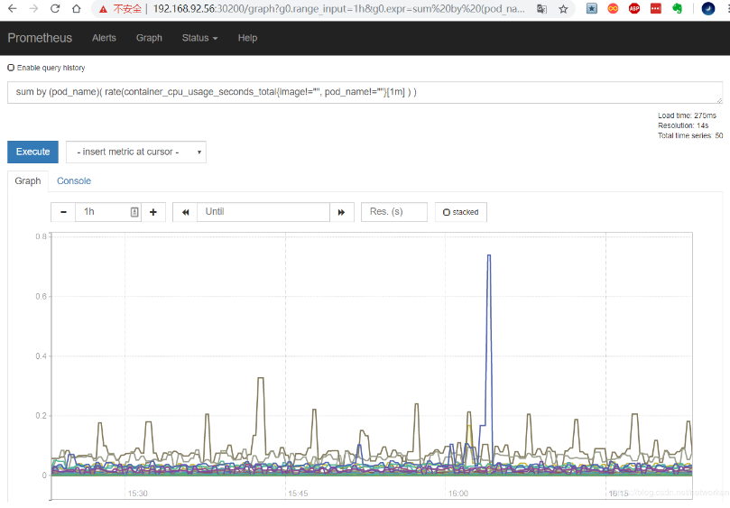
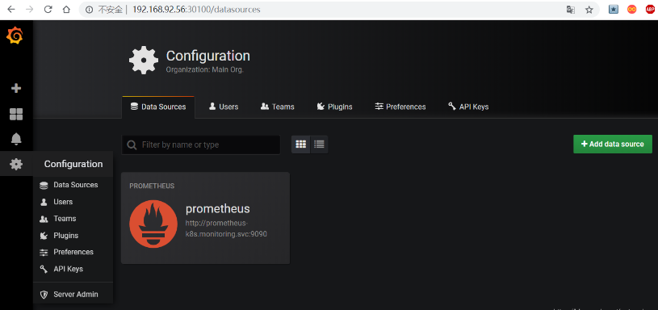
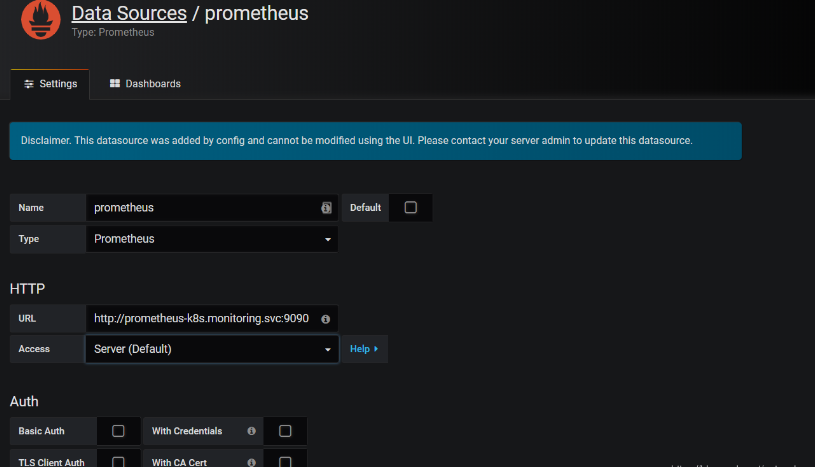

## 相关地址信息

Prometheus github 地址：https://github.com/coreos/kube-prometheus

## 组件说明

- MetricServer：是kubernetes集群资源使用情况的聚合器，收集数据给kubernetes集群内使用，如kubectl,hpa,scheduler等。
- PrometheusOperator：是一个系统监测和警报工具箱，用来存储监控数据。
- NodeExporter：用于各node的关键度量指标状态数据。
- KubeStateMetrics：收集kubernetes集群内资源对象数据，制定告警规则。
- Prometheus：采用pull方式收集apiserver，scheduler，controller-manager，kubelet组件数据，通过http协议传输。
- Grafana：是可视化数据统计和监控平台。

## 构建记录

下载kube-prometheus

```bash
git clone https://github.com/coreos/kube-prometheus.git    
cd /root/kube-prometheus/manifests
```

或者

```
wget https://github.com/coreos/kube-prometheus/archive/v0.5.0.tar.gz
tar xf v0.5.0.tar.gz
cd kube-prometheus-0.5.0/manifests/
```

修改 grafana-service.yaml 文件，使用 nodepode 方式访问 grafana：

```yaml
apiVersion: v1
kind: Service
metadata:  
  name: grafana  
  namespace: monitoring
spec:  
  type: NodePort      #添加内容  
  ports:  
  - name: http    
    port: 3000    
    targetPort: http    
    nodePort: 30100   #添加内容  
  selector:    
    app: grafana
```

修改 prometheus-service.yaml，改为 nodepode

```yaml
apiVersion: v1
kind: Service
metadata:  
  labels:    
  prometheus: k8s
  name: prometheus-k8s  
  namespace: monitoring
spec:  
  type: NodePort  
  ports:  
  - name: web    
    port: 9090    
    targetPort: web    
    nodePort: 30200  
  selector:    
    app: prometheus    
    prometheus: k8s
```

修改 alertmanager-service.yaml，改为 nodepode

```yaml
apiVersion: v1
kind: Service
metadata:  
  labels:    
    alertmanager: main  
  name: alertmanager-main  
  namespace: monitoring
spec:  
  type: NodePort  
  ports:  
  - name: web    
    port: 9093    
    targetPort: web    
    nodePort: 30300  
  selector:    
    alertmanager: main    
    app: alertmanager
```

部署kube-prometheus

```
[root@m1 manifests]# kubectl create -f setup/
[root@m1 manifests]# kubectl apply -f .


```


## Horizontal Pod Autoscaling

Horizontal Pod Autoscaling 可以根据 CPU 利用率自动伸缩一个 Replication Controller、Deployment 或者Replica Set 中的 Pod 数量

```bash
kubectl run php-apache --image=gcr.io/google_containers/hpa-example --requests=cpu=200m --expose--port=80
```

创建 HPA 控制器 - 相关算法的详情请参阅[这篇文档](https://git.k8s.io/community/contributors/design-proposals/horizontal-pod-autoscaler.md#autoscaling-algorithm)

```bash
kubectl autoscale deployment php-apache --cpu-percent=50--min=1--max=10
```

增加负载，查看负载节点数目

```bash
kubectl run -i--tty load-generator --image=busybox /bin/sh
while true; do wget -q -O- http://php-apache.default.svc.cluster.local; done
```

## 资源限制  - Pod

Kubernetes 对资源的限制实际上是通过 cgroup 来控制的，cgroup 是容器的一组用来控制内核如何运行进程的相关属性集合。针对内存、CPU 和各种设备都有对应的 cgroup;默认情况下，Pod 运行没有 CPU 和内存的限额。这意味着系统中的任何 Pod 将能够像执行该 Pod 所在的节点一样，消耗足够多的 CPU 和内存。一般会针对某些应用的 pod 资源进行资源限制，这个资源限制是通过resources 的 requests 和 limits 来实现。

```yaml
  spec:      
    containers:      
    - image: xxxx        
      imagePullPolicy: Always        
      name: auth        
      ports:        
      - containerPort: 8080          
        protocol: TCP        
      resources:          
        limits:    #limits   请求资源的最大值        
          cpu: "4"            
          memory: 2Gi          
        requests:  #requests 分配资源的初始值        
          cpu: 250m            
          memory: 250Mi
```

## 资源限制 - 名称空间

#### 1、计算资源配额

```yaml
apiVersion: v1
kind: ResourceQuota
metadata:  
  name: compute-resources  
  namespace: spark-cluster
spec:  
  hard:    
    pods: "20"    
    requests.cpu: "20"    
    requests.memory: 100Gi    
    limits.cpu: "40"    
    limits.memory: 200Gi
```

#### 2、配置对象数量配额限制

```yaml
apiVersion: v1
kind: ResourceQuota
metadata:  
  name: object-counts  
  namespace: spark-cluster
spec:  
  hard:    
    configmaps: "10"    
    persistentvolumeclaims: "4"    
    replicationcontrollers: "20"    
    secrets: "10"    
    services: "10"    
    services.loadbalancers: "2"
```

#### 3、配置 CPU 和内存 LimitRange

```yaml
apiVersion: v1
kind: LimitRange
metadata:  
  name: mem-limit-range
spec:  
  limits:  
  - default:      
      memory: 50Gi      
      cpu: 5    
    defaultRequest:      
      memory: 1Gi      
      cpu: 1    
      type: Container
```

- default即 limit 的值
- defaultRequest即 request 的值

## 访问 prometheus

prometheus 对应的 nodeport 端口为 30200，访问http://MasterIP:30200


通过访问http://MasterIP:30200/target可以看到 prometheus 已经成功连接上了 k8s 的 apiserver


查看 service-discovery


Prometheus 自己的指标


prometheus 的 WEB 界面上提供了基本的查询 K8S 集群中每个 POD 的 CPU 使用情况，查询条件如下：

```bash
sum by (pod_name)( rate(container_cpu_usage_seconds_total{image!="", pod_name!=""}[1m] ) )
```



上述的查询有出现数据，说明 node-exporter 往 prometheus 中写入数据正常，接下来我们就可以部署grafana 组件，实现更友好的 webui 展示数据了

## 访问 grafana

查看 grafana 服务暴露的端口号：

```bash
kubectl getservice-n monitoring  | grep grafanagrafana         
NodePort    10.107.56.143    <none>        3000:30100/TCP      20h
```

如上可以看到 grafana 的端口号是 30100，浏览器访问http://MasterIP:30100用户名密码默认 admin/admin


修改密码并登陆


添加数据源 grafana 默认已经添加了 Prometheus 数据源，grafana 支持多种时序数据源，每种数据源都有各自的查询编辑器



Prometheus 数据源的相关参数：



Prometheus 数据源的相关参数：目前官方支持了如下几种数据源：

