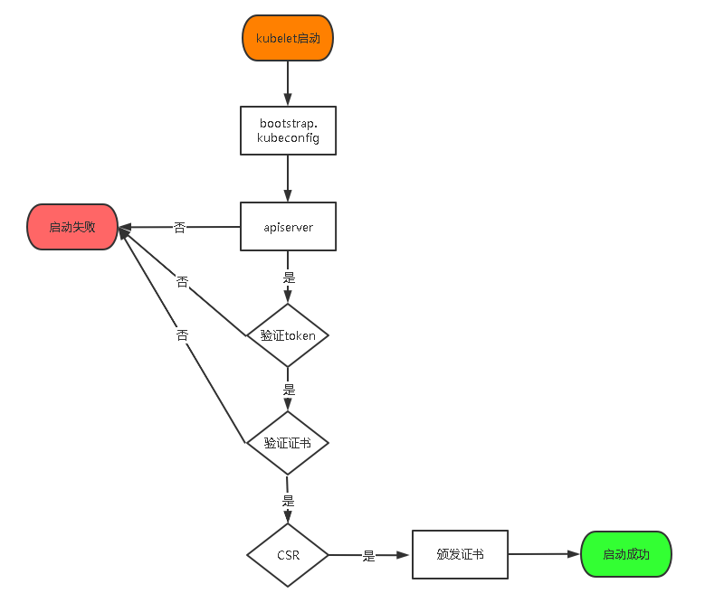

## 1. 系统优化

#### 1 关闭服务

**关闭防火墙**

```bash
firewall-cmd --state
systemctl stop firewalld.service
systemctl disable firewalld.service
```

**关闭selinux**

```bash
setenforce 0
sed -i "s/^SELINUX=enforcing/SELINUX=disabled/g" /etc/selinux/config
```

**关闭swap**

```bash
swapoff -a
sed -i 's/.*swap.*/#&/' /etc/fstab
```

#### 2 更新 yum 源

```bash
cd /etc/yum.repos.d
mv CentOS-Base.repo{,.bak}
mv epel.repo{,.bak}
curl https://mirrors.aliyun.com/repo/Centos-7.repo -o CentOS-Base.repo 
curl https://mirrors.aliyun.com/repo/epel-7.repo -o epel.repo
cd -
```

#### 3 优化文件描述符

```bash
cat << 'EOF' >>/etc/security/limits.conf
*       soft    nofile  655350
*       hard    nofile  655350
*       soft    nproc   655350
*       hard    nproc   655350
*       soft    core    unlimited
*       hard    core    unlimited
EOF
```

#### 4 开启ipvs前置条件

由于ipvs已经加入到了内核的主干，所以为kube-proxy开启ipvs的前提需要加载以下的内核模块：

```bash
cat << 'EOF' >/etc/sysconfig/modules/ipvs.modules
#!/bin/bash
modprobe -- br_netfilter
modprobe -- ip_vs
modprobe -- ip_vs_lc
modprobe -- ip_vs_wlc
modprobe -- ip_vs_rr
modprobe -- ip_vs_wrr
modprobe -- ip_vs_lblc
modprobe -- ip_vs_lblcr
modprobe -- ip_vs_dh
modprobe -- ip_vs_sh
modprobe -- ip_vs_nq
modprobe -- ip_vs_sed
modprobe -- ip_vs_ftp
modprobe -- nf_conntrack_ipv4
EOF
chmod 755 /etc/sysconfig/modules/ipvs.modules
bash /etc/sysconfig/modules/ipvs.modules
lsmod|egrep "ip_vs|nf_conntrack_ipv4|br_netfilter"
```

上面脚本创建了的/etc/sysconfig/modules/ipvs.modules文件，保证在节点重启后能自动加载所需模块。

各个节点上已经安装了ipset软件包与管理工具

```bash
yum install -y ipset ipvsadm
```

如果以上前提条件如果不满足，则即使kube-proxy的配置开启了ipvs模式，也会退回到iptables模式。

#### 5 内核参数优化

```bash
cat << EOF >/etc/sysctl.d/99-sysctl.conf
net.ipv4.tcp_slow_start_after_idle=0
net.core.rmem_max=16777216
fs.inotify.max_user_watches=524288
kernel.softlockup_all_cpu_backtrace=1
kernel.softlockup_panic=1
fs.file-max=2097152
fs.nr_open=2097152
fs.inotify.max_user_instances=8192
fs.inotify.max_queued_events=16384
vm.max_map_count=262144
net.core.netdev_max_backlog=16384
net.ipv4.tcp_wmem=4096 12582912 16777216
net.core.wmem_max=16777216
net.core.somaxconn=32768
net.ipv4.ip_forward=1
net.ipv4.tcp_max_syn_backlog=8096
net.bridge.bridge-nf-call-iptables=1
net.bridge.bridge-nf-call-ip6tables=1
net.bridge.bridge-nf-call-arptables=1
net.ipv4.tcp_rmem=4096 12582912 16777216
vm.swappiness=0
kernel.sysrq=1
net.ipv4.neigh.default.gc_stale_time=120
net.ipv4.conf.all.rp_filter=0
net.ipv4.conf.default.rp_filter=0
net.ipv4.conf.default.arp_announce=2
net.ipv4.conf.lo.arp_announce=2
net.ipv4.conf.all.arp_announce=2
net.ipv4.tcp_max_tw_buckets=5000
net.ipv4.tcp_syncookies=1
net.ipv4.tcp_synack_retries=2
net.ipv6.conf.lo.disable_ipv6=1
net.ipv6.conf.all.disable_ipv6=1
net.ipv6.conf.default.disable_ipv6=1
net.ipv4.ip_local_port_range=1024 65535
net.ipv4.tcp_keepalive_time=600
net.ipv4.tcp_keepalive_probes=10
net.ipv4.tcp_keepalive_intvl=30
net.nf_conntrack_max=25000000
net.netfilter.nf_conntrack_max=25000000
net.netfilter.nf_conntrack_tcp_timeout_established=180
net.netfilter.nf_conntrack_tcp_timeout_time_wait=120
net.netfilter.nf_conntrack_tcp_timeout_close_wait=60
net.netfilter.nf_conntrack_tcp_timeout_fin_wait=12
EOF
```

加载内核

```bash
sysctl -p 
```

#### 6 调整系统时区

```bash
# 设置系统时区为中国/上海
timedatectl set-timezone Asia/Shanghai
# 将当前的 UTC 时间写入硬件时钟timedatectl set-local-rtc 0
# 重启依赖于系统时间的服务systemctl restart rsyslog
systemctl restart crond
```

#### 7 升级系统内核

CentOS 7.x 系统自带的 3.10.x 内核存在一些 Bugs，导致运行的 Docker、Kubernetes 不稳定 

```bash
rpm -Uvh http://www.elrepo.org/elrepo-release-7.0-3.el7.elrepo.noarch.rpm
```

 安装完成后检查 /boot/grub2/grub.cfg 中对应内核 menuentry 中是否包含 initrd16 配置，如果没有，再安装一次！

```bash
yum --enablerepo=elrepo-kernel install -y kernel-lt
```

查看新内核

```bash
cat /boot/grub2/grub.cfg |grep "^menuentry"|awk -F '[()]' 'NR==1{print $2}'
4.4.220-1.el7.elrepo.x86_64
```

设置开机从新内核启动

```bash
grub2-set-default 0
```

查看内核

```bash
uname -r
```

#### 8 关闭 NUMA

备份grub

```bash
cp /etc/default/grub{,.bak}
```

在 GRUB_CMDLINE_LINUX 一行添加 `numa=off` 参数，如下所示：

```bash
GRUB_CMDLINE_LINUX="crashkernel=auto rd.lvm.lv=centos/root rhgb quiet numa=off"
```

加载内核

```bash
grub2-mkconfig -o /boot/grub2/grub.cfg
```

#### 9 安装基础软件

```bash
yum install -y wget bash-completion dos2unix telnet git vim socat jq
```

## 2. 集群基础设置

#### 1 节点信息

| 节点角色 |   IP地址   | Hostname | CPU  | 内存 |                            server                            |
| :------: | :--------: | :------: | :--: | ---- | :----------------------------------------------------------: |
|   k8s    | 10.0.0.180 |   k8s    |  4   | 8G   | etcd  apiserver scheduler controller-manager  kubectl  docker kubelet kube-proxy |

#### 2 网络配置信息

| 网段名称    | IP段信息      |
| ----------- | ------------- |
| node网段    | 10.0.0.0/24   |
| service网段 | 10.96.0.0/24  |
| pod网段     | 172.16.0.0/16 |

#### 3 设置环境变量

```bash
cat << EOF >>/root/.bash_profile
TOKEN_ID="$(openssl rand -hex 3)"
TOKEN_SECRET="$(openssl rand -hex 8)"
ENCRYPTION_KEY="$(head -c 32 /dev/urandom | base64)"
AUTH_EXTRA_GROUPS="system:bootstrappers:default-node-token"

DNS=10.96.0.10
SERVICE_CIDR=10.96.0.0/16
CLUSTER_CIDR=172.16.0.0/16
KUBE_APISERVER="https://$(hostname -i|awk '{print $1}'):6443"
ENDPOINTS="https://$(hostname -i|awk '{print $1}'):2379"
ETCD_ENDPOINTS="etcd-$(hostname)=https://$(hostname -i|awk '{print $1}'):2380"

CNI_DIR=/opt/cni
K8S_DIR=/opt/kubernetes
K8S_CONF=/etc/kubernetes
K8S_SSL=/etc/kubernetes/pki
ETCD_DATA_DIR=/data/etcd/data
LOG_DIR=/data/kubernetes/logs
ALSOLOGTOSTDERR=true
APISERVER_COUNT="3"

# K8S ETCD存储 目录名字
ETCD_PREFIX="/registry"
LOGTOSTDERR=true
MAX_MUTATING_REQUESTS_INFLIGHT="500"
MAX_REQUESTS_INFLIGHT="1500"
NODE_PORT_RANGE="30000-65535"
RUNTIME_CONFIG="api/all=true"
SECURE_PORT="6443"

DEFAULT_NOT_READY_TOLERATION_SECONDS="30"
DEFAULT_UNREACHABLE_TOLERATION_SECONDS="30"
SERVICE_ACCOUNT_ISSUER="https://kubernetes.default.svc.cluster.local"
TLS_CIPHER="TLS_ECDHE_ECDSA_WITH_AES_128_GCM_SHA256,TLS_ECDHE_RSA_WITH_AES_128_GCM_SHA256,TLS_ECDHE_ECDSA_WITH_CHACHA20_POLY1305,TLS_ECDHE_RSA_WITH_AES_256_GCM_SHA384,TLS_ECDHE_RSA_WITH_CHACHA20_POLY1305,TLS_ECDHE_ECDSA_WITH_AES_256_GCM_SHA384,TLS_RSA_WITH_AES_256_GCM_SHA384,TLS_RSA_WITH_AES_128_GCM_SHA256"
#开启插件enable-admission-plugins #AlwaysPullImages 启用istio 不能自动注入需要手动执行注入
ENABLE_ADMISSION_PLUGINS="DefaultStorageClass,DefaultTolerationSeconds,LimitRanger,NamespaceExists,NamespaceLifecycle,NodeRestriction,PodNodeSelector,PersistentVolumeClaimResize,PodTolerationRestriction,ResourceQuota,ServiceAccount,StorageObjectInUseProtection,MutatingAdmissionWebhook,ValidatingAdmissionWebhook"
#禁用插件disable-admission-plugins 
DISABLE_ADMISSION_PLUGINS="ExtendedResourceToleration,ImagePolicyWebhook,LimitPodHardAntiAffinityTopology,NamespaceAutoProvision,Priority,EventRateLimit,PodSecurityPolicy"

EOF
source ~/.bash_profile
```

#### 4 下载集群所需软件

[kubernetes](https://dl.k8s.io/v1.20.0/kubernetes-server-linux-amd64.tar.gz)
[etcd](https://github.com/etcd-io/etcd/releases/download/v3.5.0/etcd-v3.5.0-linux-amd64.tar.gz)
[cni](https://github.com/containernetworking/plugins/releases/download/v0.9.1/cni-plugins-linux-amd64-v0.9.1.tgz)
[flanneld](https://github.com/flannel-io/flannel/releases/download/v0.14.0/flannel-v0.14.0-linux-amd64.tar.gz)

**创建目录**

```bash
mkdir -p  /opt/{kubernetes/bin,cni/bin} /root/.kube  /data/kubernetes/logs /etc/{cni/net.d,kubernetes/{pki,manifests,kubelet-plugins}}
```

**kubernetes解压推送各节点**

```bash
tar -zxvf kubernetes-server-linux-amd64.tar.gz
cd kubernetes/server/bin/
#复制可执行文件到其余master节点
cp kube-apiserver kube-scheduler kube-controller-manager kube-proxy kubelet ${K8S_DIR}/bin
cp kubectl /usr/local/bin
```

**ETC解压推送各节点**

```bash
cd -
tar zxvf etcd-v3.5.0-linux-amd64.tar.gz
cd etcd-v3.5.0-linux-amd64
#复制可执行文件到其余master节点
cp etcd ${K8S_DIR}/bin
cp etcdctl /usr/local/bin
```

**cfssl下载**

```bash
wget https://pkg.cfssl.org/R1.2/cfssl_linux-amd64 -O /usr/local/bin/cfssl
wget https://pkg.cfssl.org/R1.2/cfssljson_linux-amd64 -O /usr/local/bin/cfssljson
chmod +x /usr/local/bin/cfssl*
```

**cni解压推送各节点**

```bash
tar -zxf cni-plugins-linux-amd64-v0.9.1.tgz -C /opt/cni/bin
```

**flanneld解压推送各节点**

```bash
tar xf flannel-v0.14.0-linux-amd64.tar.gz -C ${K8S_DIR}/bin
```

## 3. 安装containerd

#### 1 下载所需二进制文件

```bash
wget https://github.com/kubernetes-sigs/cri-tools/releases/download/v1.22.0/crictl-v1.22.0-linux-amd64.tar.gz

wget https://github.com/containerd/containerd/releases/download/v1.5.5/containerd-1.5.5-linux-amd64.tar.gz

wget https://github.com/opencontainers/runc/releases/download/v1.0.2/runc.amd64 -O /usr/local/bin/runc && chmod +x /usr/local/bin/runc 
```

#### 2 解压

```bash
# containerd 解压
tar -xvf containerd-1.5.5-linux-amd64.tar.gz -C /usr/local
# crict 解压
tar zxvf crictl-v1.22.0-linux-amd64.tar.gz -C /usr/local/bin
```

#### 3 准备配置文件

```
 mkdir /etc/containerd
 containerd config default > /etc/containerd/config.toml
```

修改默认的 pause 镜像为国内的地址，替换 `[plugins."io.containerd.grpc.v1.cri"]` 下面的 `sandbox_image`：

```bash
[plugins."io.containerd.grpc.v1.cri"]
  sandbox_image = "registry.aliyuncs.com/google_containers/pause:3.2"
```

同样再配置下镜像仓库的加速器地址：

```bash
      [plugins."io.containerd.grpc.v1.cri".registry.mirrors]
        [plugins."io.containerd.grpc.v1.cri".registry.mirrors."docker.io"]
          endpoint = ["https://bqr1dr1n.mirror.aliyuncs.com"]
        [plugins."io.containerd.grpc.v1.cri".registry.mirrors."k8s.gcr.io"]
          endpoint = ["https://registry.aliyuncs.com/k8sxio"]
```

修改crictl配置

```yaml
cat << EOF >/etc/crictl.yaml
runtime-endpoint: unix:///run/containerd/containerd.sock
image-endpoint: unix:///run/containerd/containerd.sock
debug: false
pull-image-on-create: false
disable-pull-on-run: false
EOF
```

#### 4 systemctl管理containerd

```bash
cat << EOF >/usr/lib/systemd/system/containerd.service
[Unit]
Description=containerd container runtime
Documentation=https://containerd.io
After=network.target local-fs.target

[Service]
ExecStartPre=-/sbin/modprobe overlay
ExecStart=/usr/local/bin/containerd
Type=notify
Delegate=yes
KillMode=process
Restart=always
RestartSec=5
LimitNPROC=infinity
LimitCORE=infinity
LimitNOFILE=1048576
TasksMax=infinity
OOMScoreAdjust=-999

[Install]
WantedBy=multi-user.target
EOF
```

#### 5 启动服务

```bash
systemctl daemon-reload && systemctl enable --now containerd.service
```

#### 6 查看服务信息

```bash
systemctl status containerd.service
```

#### 7 测试拉取镜像

```bash
crictl pull busybox:1.28
```

## 4. 集群证书生成

#### 1 生成CA私钥和证书

```bash
cd $K8S_SSL
cat >ca-config.json << EOF
{"signing":{"default":{"expiry":"87600h"},"profiles":{"kubernetes":{"usages":["signing","key encipherment","server auth","client auth"],"expiry":"87600h"}}}}
EOF
cat > ca-csr.json << EOF 
{"CN": "kubernetes","key": {"algo": "rsa","size": 2048},"names":[{"C": "CN","ST": "BeiJing","L": "BeiJing","O": "kubernetes","OU": "k8s"}],"ca":{"expiry":"87600h"}}
EOF
cfssl gencert -initca ca-csr.json | cfssljson -bare ca
```

#### 2 生成Kubernetes webhook私钥和证书

```bash
cat >aggregator-csr.json<<EOF
{"CN":"aggregator","key":{"algo":"rsa","size":2048},"names":[{"C":"CN","ST":"BeiJing","L":"BeiJing","O":"kubernetes","OU":"k8s"}]}
EOF
cfssl gencert -ca=ca.pem -ca-key=ca-key.pem -config=ca-config.json -profile=kubernetes aggregator-csr.json | cfssljson -bare aggregator
```

#### 3 生成Kubernetes admin私钥和证书

```bash
cat >admin-csr.json<<EOF
{"CN":"admin","key":{"algo":"rsa","size":2048},"names":[{"C":"CN","ST":"BeiJing","L":"BeiJing","O":"system:masters","OU":"k8s"}]}
EOF
cfssl gencert -ca=ca.pem -ca-key=ca-key.pem -config=ca-config.json -profile=kubernetes admin-csr.json| cfssljson -bare admin
```

#### 4 生成kube-apiserver私钥和证书

```bash
cat >server-csr.json <<EOF 
{"CN":"kubernetes","key":{"algo":"rsa","size":2048},"names":[{"C":"CN","ST":"BeiJing","L":"BeiJing","O":"kubernetes","OU":"k8s"}]}
EOF
cfssl gencert -ca=ca.pem -ca-key=ca-key.pem -config=ca-config.json -hostname=kubernetes,kubernetes.default,kubernetes.default.svc,kubernetes.default.svc.cluster,kubernetes.default.svc.cluster.local,172.16.0.1,10.96.0.1,127.0.0.1,$(hostname -i|awk '{print $1}') -profile=kubernetes server-csr.json|cfssljson -bare server
```

#### 5 生成kube-controller-manager私钥和证书

```bash
cat >controller-manager-csr.json <<EOF 
{"CN":"system:kube-controller-manager","key":{"algo":"rsa","size":2048},"names":[{"C":"CN","ST":"BeiJing","L":"BeiJing","O":"system:kube-controller-manager","OU":"k8s"}]}
EOF
cfssl gencert -ca=ca.pem -ca-key=ca-key.pem -config=ca-config.json -profile=kubernetes controller-manager-csr.json|cfssljson -bare kube-controller-manager
```

#### 6 生成kube-scheduler私钥和证书

```bash
cat >scheduler-csr.json <<EOF 
{"CN":"system:kube-scheduler","key":{"algo":"rsa","size":2048},"names":[{"C":"CN","ST":"BeiJing","L":"BeiJing","O":"system:kube-scheduler","OU":"k8s"}]}
EOF
cfssl gencert -ca=ca.pem -ca-key=ca-key.pem -config=ca-config.json -profile=kubernetes scheduler-csr.json|cfssljson -bare kube-scheduler
```

#### 7 生成kube-proxy 私钥和证书

```bash
cat > kube-proxy-csr.json << EOF
{"CN":"system:kube-proxy","key":{"algo": "rsa","size":2048},"names":[{"C":"CN","L":"BeiJing","ST":"BeiJing","O":"system:kube-proxy","OU":"k8s"}]}
EOF
cfssl gencert -ca=ca.pem -ca-key=ca-key.pem -config=ca-config.json -profile=kubernetes kube-proxy-csr.json | cfssljson -bare kube-proxy
```

#### 8生成etcd私钥和证书

```bash 
cat > etcd-csr.json <<EOF 
{"CN":"etcd","key":{"algo":"rsa","size":2048},"names":[{"C":"CN","ST":"BeiJing","L":"BeiJing","O":"kubernetes","OU":"etcd"}]}
EOF
cfssl gencert -ca=ca.pem -ca-key=ca-key.pem -config=ca-config.json -hostname=127.0.0.1,$(hostname -i|awk '{print $1}') -profile=kubernetes etcd-csr.json|cfssljson -bare etcd
```

#### 9 创建 flanneld 证书和私钥

```bash
cat >flanneld-csr.json <<EOF
{"CN":"flanneld","key":{"algo":"rsa","size":2048},"names":[{"C":"CN","ST":"BeiJing","L":"BeiJing","O":"system","OU":"k8s"}]}
EOF
cfssl gencert -ca=ca.pem -ca-key=ca-key.pem -config=ca-config.json -profile=kubernetes flanneld-csr.json | cfssljson -bare flanneld
```

删除证书请求

```bash
rm -f *.json *csr*
```

## 5. 生成kubeconfig认证文件

#### 1 scheduler-kubeconfig

```bash
cd $K8S_SSL
kubectl config set-cluster kubernetes --certificate-authority=ca.pem --embed-certs=true --server=${KUBE_APISERVER} --kubeconfig=${K8S_CONF}/kube-scheduler.kubeconfig

kubectl config set-credentials system:kube-scheduler --client-certificate=kube-scheduler.pem --client-key=kube-scheduler-key.pem --embed-certs=true --kubeconfig=${K8S_CONF}/kube-scheduler.kubeconfig

kubectl config set-context system:kube-scheduler@kubernetes --cluster=kubernetes --user=system:kube-scheduler --kubeconfig=${K8S_CONF}/kube-scheduler.kubeconfig

kubectl config use-context system:kube-scheduler@kubernetes --kubeconfig=${K8S_CONF}/kube-scheduler.kubeconfig
```

#### 2 controller-manager-kubeconfig

```bash
kubectl config set-cluster kubernetes --certificate-authority=ca.pem --embed-certs=true --server=${KUBE_APISERVER} --kubeconfig=${K8S_CONF}/kube-controller-manager.kubeconfig

kubectl config set-credentials system:kube-controller-manager --client-certificate=kube-controller-manager.pem --client-key=kube-controller-manager-key.pem --embed-certs=true --kubeconfig=${K8S_CONF}/kube-controller-manager.kubeconfig

kubectl config set-context system:kube-controller-manager@kubernetes --cluster=kubernetes --user=system:kube-controller-manager --kubeconfig=${K8S_CONF}/kube-controller-manager.kubeconfig

kubectl config use-context system:kube-controller-manager@kubernetes --kubeconfig=${K8S_CONF}/kube-controller-manager.kubeconfig
```

#### 3 kubelet bootstrapping kubeconfig

```bash
kubectl config set-cluster kubernetes --certificate-authority=ca.pem --embed-certs=true --server=${KUBE_APISERVER} --kubeconfig=${K8S_CONF}/bootstrap-kubelet.kubeconfig

kubectl config set-credentials tls-bootstrap-token-user --token=${TOKEN_ID}.${TOKEN_SECRET} --kubeconfig=${K8S_CONF}/bootstrap-kubelet.kubeconfig

kubectl config set-context default --cluster=kubernetes --user=tls-bootstrap-token-user --kubeconfig=${K8S_CONF}/bootstrap-kubelet.kubeconfig

kubectl config use-context default --kubeconfig=${K8S_CONF}/bootstrap-kubelet.kubeconfig
```

#### 4 proxy-kubeconfig

```bash
kubectl config set-cluster kubernetes --certificate-authority=ca.pem --embed-certs=true --server=${KUBE_APISERVER} --kubeconfig=${K8S_CONF}/kube-proxy.kubeconfig

kubectl config set-credentials kube-proxy --client-certificate=kube-proxy.pem --client-key=kube-proxy-key.pem --embed-certs=true --kubeconfig=${K8S_CONF}/kube-proxy.kubeconfig

kubectl config set-context default --cluster=kubernetes --user=kube-proxy --kubeconfig=${K8S_CONF}/kube-proxy.kubeconfig

kubectl config use-context default --kubeconfig=${K8S_CONF}/kube-proxy.kubeconfig
```

#### 5 admin-kubeconfig

```bash
kubectl config set-cluster kubernetes --certificate-authority=ca.pem --embed-certs=true --server=${KUBE_APISERVER} --kubeconfig=${K8S_CONF}/admin.conf

kubectl config set-credentials admin --client-certificate=admin.pem --client-key=admin-key.pem --embed-certs=true --kubeconfig=${K8S_CONF}/admin.conf

kubectl config set-context admin@kubernetes --cluster=kubernetes --user=admin --kubeconfig=${K8S_CONF}/admin.conf

kubectl config use-context admin@kubernetes --kubeconfig=${K8S_CONF}/admin.conf
```

kube

```bash
cp ${K8S_CONF}/admin.conf /root/.kube/config
```

## 6 etcd部署

#### 1、systemctl管理etcd

```bash
cat << EOF >/usr/lib/systemd/system/etcd.service 
[Unit]
Description=Etcd Server
After=neCNork.target
After=network-online.target
Wants=network-online.target
[Service]
Type=notify
ExecStart=${K8S_DIR}/bin/etcd \\
--advertise-client-urls=https://$(hostname -i|awk '{print $1}'):2379 \\
--auto-compaction-mode=periodic \\
--auto-compaction-retention=1 \\
--cert-file=${K8S_SSL}/etcd.pem \\
--cipher-suites=${TLS_CIPHER} \\
--data-dir=${ETCD_DATA_DIR} \\
--election-timeout=30000 \\
--enable-v2=true \\
--heartbeat-interval=6000 \\
--initial-advertise-peer-urls=https://$(hostname -i|awk '{print $1}'):2380 \\
--initial-cluster=${ETCD_ENDPOINTS} \\
--initial-cluster-state=new \\
--initial-cluster-token=etcd-cluster \\
--key-file=${K8S_SSL}/etcd-key.pem \\
--listen-client-urls=https://$(hostname -i|awk '{print $1}'):2379 \\
--listen-peer-urls=https://$(hostname -i|awk '{print $1}'):2380 \\
--logger=zap \\
--max-request-bytes=33554432 \\
--name=etcd-$(hostname) \\
--peer-cert-file=${K8S_SSL}/etcd.pem \\
--peer-client-cert-auth \\
--peer-key-file=${K8S_SSL}/etcd-key.pem \\
--peer-trusted-ca-file=${K8S_SSL}/ca.pem \\
--quota-backend-bytes=17179869184 \\
--snapshot-count=5000 \\
--trusted-ca-file=${K8S_SSL}/ca.pem
Restart=on-failure
LimitNOFILE=65536
[Install]
WantedBy=multi-user.target
EOF
```

#### 2 启动etcd

```bash
systemctl daemon-reload && systemctl enable --now etcd
```

#### 3 检查etcd集群状态

```bash
etcdctl --cacert=${K8S_SSL}/ca.pem \
--cert=${K8S_SSL}/etcd.pem \
--key=${K8S_SSL}/etcd-key.pem \
--endpoints="${ENDPOINTS}" endpoint health
```

## 7. apiserver集群部署

#### 1 创建审计策略

```yaml
cat << EOF >${K8S_CONF}/audit-policy.yaml
apiVersion: audit.k8s.io/v1
kind: Policy
rules:
  # The following requests were manually identified as high-volume and low-risk, so drop them.
  - level: None
    resources:
      - group: ""
        resources:
          - endpoints
          - services
          - services/status
    users:
      - 'system:kube-proxy'
    verbs:
      - watch

  - level: None
    resources:
      - group: ""
        resources:
          - nodes
          - nodes/status
    userGroups:
      - 'system:nodes'
    verbs:
      - get

  - level: None
    namespaces:
      - kube-system
    resources:
      - group: ""
        resources:
          - endpoints
    users:
      - 'system:kube-controller-manager'
      - 'system:kube-scheduler'
      - 'system:serviceaccount:kube-system:endpoint-controller'
    verbs:
      - get
      - update

  - level: None
    resources:
      - group: ""
        resources:
          - namespaces
          - namespaces/status
          - namespaces/finalize
    users:
      - 'system:apiserver'
    verbs:
      - get

  # Don't log HPA fetching metrics.
  - level: None
    resources:
      - group: metrics.k8s.io
    users:
      - 'system:kube-controller-manager'
    verbs:
      - get
      - list

  # Don't log these read-only URLs.
  - level: None
    nonResourceURLs:
      - '/healthz*'
      - /version
      - '/swagger*'

  # Don't log events requests.
  - level: None
    resources:
      - group: ""
        resources:
          - events

  # node and pod status calls from nodes are high-volume and can be large, don't log responses for expected updates from nodes
  - level: Request
    omitStages:
      - RequestReceived
    resources:
      - group: ""
        resources:
          - nodes/status
          - pods/status
    users:
      - kubelet
      - 'system:node-problem-detector'
      - 'system:serviceaccount:kube-system:node-problem-detector'
    verbs:
      - update
      - patch

  - level: Request
    omitStages:
      - RequestReceived
    resources:
      - group: ""
        resources:
          - nodes/status
          - pods/status
    userGroups:
      - 'system:nodes'
    verbs:
      - update
      - patch

  # deletecollection calls can be large, don't log responses for expected namespace deletions
  - level: Request
    omitStages:
      - RequestReceived
    users:
      - 'system:serviceaccount:kube-system:namespace-controller'
    verbs:
      - deletecollection

  # Secrets, ConfigMaps, and TokenReviews can contain sensitive & binary data,
  # so only log at the Metadata level.
  - level: Metadata
    omitStages:
      - RequestReceived
    resources:
      - group: ""
        resources:
          - secrets
          - configmaps
      - group: authentication.k8s.io
        resources:
          - tokenreviews
  # Get repsonses can be large; skip them.
  - level: Request
    omitStages:
      - RequestReceived
    resources:
      - group: ""
      - group: admissionregistration.k8s.io
      - group: apiextensions.k8s.io
      - group: apiregistration.k8s.io
      - group: apps
      - group: authentication.k8s.io
      - group: authorization.k8s.io
      - group: autoscaling
      - group: batch
      - group: certificates.k8s.io
      - group: extensions
      - group: metrics.k8s.io
      - group: networking.k8s.io
      - group: policy
      - group: rbac.authorization.k8s.io
      - group: scheduling.k8s.io
      - group: settings.k8s.io
      - group: storage.k8s.io
    verbs:
      - get
      - list
      - watch

  # Default level for known APIs
  - level: RequestResponse
    omitStages:
      - RequestReceived
    resources:
      - group: ""
      - group: admissionregistration.k8s.io
      - group: apiextensions.k8s.io
      - group: apiregistration.k8s.io
      - group: apps
      - group: authentication.k8s.io
      - group: authorization.k8s.io
      - group: autoscaling
      - group: batch
      - group: certificates.k8s.io
      - group: extensions
      - group: metrics.k8s.io
      - group: networking.k8s.io
      - group: policy
      - group: rbac.authorization.k8s.io
      - group: scheduling.k8s.io
      - group: settings.k8s.io
      - group: storage.k8s.io
      
  # Default level for all other requests.
  - level: Metadata
    omitStages:
      - RequestReceived
EOF
```

#### 2 创建加密配置文件

```yaml
cat<< EOF >${K8S_CONF}/encryption-config.yaml 
kind: EncryptionConfig
apiVersion: v1
resources:
  - resources:
      - secrets
    providers:
      - aescbc:
          keys:
            - name: key1
              secret: ${ENCRYPTION_KEY}
      - identity: {}
EOF
```

#### 3 systemctl管理apiserver

```bash
cat << EOF >/usr/lib/systemd/system/kube-apiserver.service
[Unit]
Description=Kubernetes API Server
Documentation=https://github.com/kubernetes/kubernetes
After=network.target
[Service]
ExecStart=${K8S_DIR}/bin/kube-apiserver \\
--logtostderr=${LOGTOSTDERR} \\
--bind-address=$(hostname -i|awk '{print $1}') \\
--advertise-address=$(hostname -i|awk '{print $1}') \\
--secure-port=${SECURE_PORT} \\
--service-cluster-ip-range=${SERVICE_CIDR} \\
--service-node-port-range=${NODE_PORT_RANGE} \\
--etcd-cafile=${K8S_SSL}/ca.pem \\
--etcd-certfile=${K8S_SSL}/etcd.pem \\
--etcd-keyfile=${K8S_SSL}/etcd-key.pem \\
--etcd-prefix=${ETCD_PREFIX} \\
--etcd-servers=${ENDPOINTS} \\
--client-ca-file=${K8S_SSL}/ca.pem \\
--tls-cert-file=${K8S_SSL}/server.pem \\
--tls-private-key-file=${K8S_SSL}/server-key.pem \\
--kubelet-client-certificate=${K8S_SSL}/server.pem \\
--kubelet-client-key=${K8S_SSL}/server-key.pem \\
--service-account-key-file=${K8S_SSL}/ca.pem \\
--requestheader-client-ca-file=${K8S_SSL}/ca.pem \\
--proxy-client-cert-file=${K8S_SSL}/aggregator.pem \\
--proxy-client-key-file=${K8S_SSL}/aggregator-key.pem \\
--service-account-issuer=${SERVICE_ACCOUNT_ISSUER} \\
--service-account-signing-key-file=${K8S_SSL}/ca-key.pem \\
--requestheader-allowed-names=aggregator \\
--requestheader-group-headers=X-Remote-Group \\
--requestheader-extra-headers-prefix=X-Remote-Extra- \\
--requestheader-username-headers=X-Remote-User \\
--enable-aggregator-routing=true \\
--anonymous-auth=false \\
--encryption-provider-config=${K8S_CONF}/encryption-config.yaml \\
--enable-admission-plugins=${ENABLE_ADMISSION_PLUGINS} \\
--disable-admission-plugins=${DISABLE_ADMISSION_PLUGINS} \\
--cors-allowed-origins=.* \\
--runtime-config=${RUNTIME_CONFIG} \\
--kubelet-preferred-address-types=InternalIP,ExternalIP,Hostname \\
--authorization-mode=Node,RBAC \\
--allow-privileged=true \\
--apiserver-count=${APISERVER_COUNT} \\
--audit-log-maxage=30  \\
--audit-log-maxbackup=3 \\
--audit-log-maxsize=100 \\
--audit-policy-file=${K8S_CONF}/audit-policy.yaml \\
--default-not-ready-toleration-seconds=${DEFAULT_NOT_READY_TOLERATION_SECONDS} \\
--default-unreachable-toleration-seconds=${DEFAULT_UNREACHABLE_TOLERATION_SECONDS} \\
--audit-log-truncate-enabled \\
--audit-log-path=${LOG_DIR}/api-server-audit.log \\
--profiling \\
--http2-max-streams-per-connection=10000 \\
--event-ttl=1h \\
--enable-bootstrap-token-auth=true \\
--alsologtostderr=${ALSOLOGTOSTDERR} \\
--log-dir=${LOG_DIR} \\
--tls-cipher-suites=${TLS_CIPHER} \\
--endpoint-reconciler-type=lease \\
--max-mutating-requests-inflight=${MAX_MUTATING_REQUESTS_INFLIGHT} \\
--max-requests-inflight=${MAX_REQUESTS_INFLIGHT} \\
--v=2
Restart=on-failure
RestartSec=10s
LimitNOFILE=65535
[Install]
WantedBy=multi-user.target
EOF
```

#### 4 启动服务

```bash
systemctl daemon-reload && systemctl enable --now kube-apiserver
```

#### 5 检查kube-apiserver监听的端口

```bash
ss -lntup|grep 6443
```

#### 6 查看apiserver集群健康状况

```bash
kubectl cluster-info
```

## 7. scheduler 集群部署

#### 1 systemctl管理scheduler

```bash
cat << EOF >/usr/lib/systemd/system/kube-scheduler.service 
[Unit]
Description=Kubernetes Controller Manager
Documentation=https://github.com/kubernetes/kubernetes
After=network.target
[Service]
ExecStart=${K8S_DIR}/bin/kube-scheduler \\
--address=0.0.0.0 \\
--alsologtostderr=true \\
--authentication-kubeconfig=${K8S_CONF}/kube-scheduler.kubeconfig \\
--authorization-kubeconfig=${K8S_CONF}/kube-scheduler.kubeconfig \\
--client-ca-file=${K8S_SSL}/ca.pem \\
--kube-api-burst=100 \\
--kube-api-qps=100 \\
--kubeconfig=${K8S_CONF}/kube-scheduler.kubeconfig \\
--leader-elect=true \\
--log-dir=${LOG_DIR} \\
--logtostderr=false \\
--requestheader-allowed-names=aggregator \\
--requestheader-client-ca-file=${K8S_SSL}/ca.pem \\
--requestheader-extra-headers-prefix=X-Remote-Extra- \\
--requestheader-group-headers=X-Remote-Group \\
--requestheader-username-headers=X-Remote-User \\
--tls-cert-file=${K8S_SSL}/kube-scheduler.pem \\
--tls-cipher-suites=${TLS_CIPHER} \\
--tls-private-key-file=${K8S_SSL}/kube-scheduler-key.pem \\
--v=2
LimitNOFILE=65535
Restart=on-failure
[Install]
WantedBy=multi-user.target
EOF
```

#### 2 启动服务

```bash
systemctl daemon-reload && systemctl enable --now kube-scheduler
```

#### 3 查看服务状态

```bash
systemctl status kube-scheduler.service
```

#### 4 查看metrics指标

```bash
curl -s 127.0.0.1:10251/metrics|tail -5
```

## 8. controller manager 集群部署

#### 1 systemctl管理controller-manager

```bash
cat << EOF >/usr/lib/systemd/system/kube-controller-manager.service 
[Unit]
Description=Kubernetes Controller Manager
Documentation=https://github.com/kubernetes/kubernetes
After=network.target
[Service]
ExecStart=${K8S_DIR}/bin/kube-controller-manager \\
--allocate-node-cidrs=true \\
--alsologtostderr=true \\
--authentication-kubeconfig=${K8S_CONF}/kube-controller-manager.kubeconfig \\
--authorization-kubeconfig=${K8S_CONF}/kube-controller-manager.kubeconfig \\
--client-ca-file=${K8S_SSL}/ca.pem \\
--cluster-cidr=${CLUSTER_CIDR} \\
--cluster-name=kubernetes \\
--cluster-signing-cert-file=${K8S_SSL}/ca.pem \\
--cluster-signing-key-file=${K8S_SSL}/ca-key.pem  \\
--concurrent-deployment-syncs=10 \\
--concurrent-gc-syncs=30 \\
--concurrent-service-syncs=2 \\
--controllers=*,bootstrapsigner,tokencleaner \\
--deployment-controller-sync-period=10s \\
--enable-garbage-collector=true \\
--cluster-signing-duration=876000h0m0s \\
--flex-volume-plugin-dir=${K8S_CONF}/volume \\
--horizontal-pod-autoscaler-sync-period=10s \\
--kube-api-burst=100 \\
--kube-api-qps=100 \\
--kubeconfig=${K8S_CONF}/kube-controller-manager.kubeconfig \\
--leader-elect=true \\
--log-dir=${LOG_DIR} \\
--logtostderr=false \\
--node-cidr-mask-size=24 \\
--node-monitor-grace-period=30s \\
--node-monitor-period=5s \\
--node-startup-grace-period=20s \\
--pod-eviction-timeout=1m0s \\
--profiling \\
--requestheader-allowed-names=aggregator \\
--requestheader-client-ca-file=${K8S_SSL}/ca.pem \\
--requestheader-extra-headers-prefix=X-Remote-Extra- \\
--requestheader-group-headers=X-Remote-Group \\
--requestheader-username-headers=X-Remote-User \\
--root-ca-file=${K8S_SSL}/ca.pem \\
--service-account-private-key-file=${K8S_SSL}/ca-key.pem \\
--service-cluster-ip-range=${SERVICE_CIDR} \\
--terminated-pod-gc-threshold=50 \\
--tls-cert-file=${K8S_SSL}/kube-controller-manager.pem \\
--tls-cipher-suites=${TLS_CIPHER} \\
--tls-private-key-file=${K8S_SSL}/kube-controller-manager-key.pem \\
--use-service-account-credentials=true \\
--v=2
Restart=always
RestartSec=10s
[Install]
WantedBy=multi-user.target
EOF
```

#### 2 启动服务

```bash
systemctl daemon-reload && systemctl enable --now kube-controller-manager
```

#### 3 查看服务状态

```bash
systemctl status kube-controller-manager.service
```

#### 4 查看metrics指标

```bash
curl -s 127.0.0.1:10252/metrics|tail -5
```

#### 5 查看集群状态

```bash
kubectl get cs
```

## 9. TLS bootstrapping认证

每个节点的kubelet都必须使用kube-apiserver的CA的凭证后,才能与kube-apiserver进行沟通,而该过程需要手动针对每台节点单独签署凭证是一件繁琐的事情,且一旦节点增加会延伸出管理不易问题;而TLS bootstrapping目标就是解决该问题,通过让kubelet先使用一个预定低权限使用者连接到kube-apiserver,然后在对kube-apiserver申请凭证签署,当授权Token一致时,Node节点的kubelet凭证将由kube-apiserver动态签署提供。

TLS bootstraping 工作流程：



#### 1 建立TLS bootstrap secret来提供自动签证使用

```bash
cat << EOF >bootstrap-secret.yaml
apiVersion: v1
kind: Secret
metadata:
  name: bootstrap-token-${TOKEN_ID}
  namespace: kube-system
type: bootstrap.kubernetes.io/token
stringData:
  description: "The bootstrap token for k8s."
  token-id: "${TOKEN_ID}"
  token-secret: "${TOKEN_SECRET}"
  expiration: "2029-07-16T00:00:00Z"
  usage-bootstrap-authentication: "true"
  usage-bootstrap-signing: "true"
  auth-extra-groups: "${AUTH_EXTRA_GROUPS}"
EOF
kubectl apply -f  bootstrap-secret.yaml
```

#### 2 将自定义的auth-extra-groups绑定角色system:node-bootstrapper

```bash
kubectl create clusterrolebinding kubelet-bootstrap \
--clusterrole system:node-bootstrapper \
--group ${AUTH_EXTRA_GROUPS}
```

#### 3 将自定义的auth-extra-groups绑定角色,实现自动签署证书请求

```bash
kubectl create clusterrolebinding node-autoapprove-bootstrap \
--clusterrole system:certificates.k8s.io:certificatesigningrequests:nodeclient \
--group ${AUTH_EXTRA_GROUPS}
```

#### 4 将system:node绑定角色,实现自动刷新node节点过期证书

```bash
kubectl create clusterrolebinding node-autoapprove-certificate-rotation \
--clusterrole system:certificates.k8s.io:certificatesigningrequests:selfnodeclient \
--group system:node
```

## 10. kubelet部署

#### 1 系统配置文件

```bash
cat << EOF >/usr/lib/systemd/system/kubelet.service
[Unit]
Description=Kubernetes Kubelet
Documentation=https://github.com/kubernetes/kubernetes
After=containerd.service
Requires=containerd.service
[Service]
ExecStart=${K8S_DIR}/bin/kubelet \\
--alsologtostderr=true \\
--bootstrap-kubeconfig=${K8S_CONF}/bootstrap-kubelet.kubeconfig \\
--cert-dir=${K8S_SSL} \\
--cni-bin-dir=${CNI_DIR}/bin \\
--cni-conf-dir=/etc/cni/net.d \\
--config=${K8S_CONF}/kubelet.yaml \\
--container-runtime=remote \\
--runtime-request-timeout=15m \\
--container-runtime-endpoint=unix:///run/containerd/containerd.sock \\
--image-pull-progress-deadline=30s \\
--kubeconfig=${K8S_CONF}/kubelet.kubeconfig \\
--log-dir=${LOG_DIR} \\
--logtostderr=false \\
--network-plugin=cni \\
--root-dir=${K8S_CONF}/kubelet \\
--runtime-cgroups=/systemd/system.slice \\
--volume-plugin-dir=${K8S_CONF}/kubelet-plugins \\
--v=2 
Restart=always
RestartSec=10s
[Install]
WantedBy=multi-user.target
EOF
```

**config**

```yaml
cat << EOE >${K8S_CONF}/kubelet.yaml
apiVersion: kubelet.config.k8s.io/v1beta1
kind: KubeletConfiguration
staticPodPath: "${K8S_CONF}/manifests"
syncFrequency: 30s
fileCheckFrequency: 20s
httpCheckFrequency: 20s
address: $(hostname -i|awk '{print $1}')
port: 10250
readOnlyPort: 10255
tlsCipherSuites: [${TLS_CIPHER}]
rotateCertificates: true
authentication:
  x509:
    clientCAFile: "${K8S_SSL}/ca.pem"
  webhook:
    enabled: true
    cacheTTL: 2m0s
  anonymous:
    enabled: false
authorization:
  mode: Webhook
  webhook:
    cacheAuthorizedTTL: 5m0s
    cacheUnauthorizedTTL: 30s
registryPullQPS: 5
registryBurst: 10
eventRecordQPS: 15
eventBurst: 30
enableDebuggingHandlers: true
healthzPort: 10248
healthzBindAddress: $(hostname -i|awk '{print $1}')
oomScoreAdj: -999
clusterDomain: cluster.local
clusterDNS:
- ${DNS}
nodeStatusUpdateFrequency: 10s
nodeStatusReportFrequency: 5m0s
nodeLeaseDurationSeconds: 40
imageMinimumGCAge: 2m0s #未使用的镜像在被回收前的最小存留时间，默认为 2m0s
imageGCHighThresholdPercent: 70 #磁盘使用率到达此阈值，kubelet开始回收镜像，默认为 85%
imageGCLowThresholdPercent: 50 #磁盘使用率到达此阈值，kubelet停止回收镜像，默认为 80%
maxPods: 55
maxOpenFiles: 1000000
kubeAPIQPS: 15
kubeAPIBurst: 30
failSwapOn: false
serializeImagePulls: false #逐一拉取镜像
evictionHard: #触发Pod驱逐操作的一组硬性门限
  imagefs.available: 10%
  memory.available: 500Mi
  nodefs.available: 10%
evictionSoft: #设置一组驱逐阈值
  imagefs.available: 15%
  memory.available: 500Mi
  nodefs.available: 15%
evictionSoftGracePeriod: #设置一组驱逐宽限期
  imagefs.available: 2m
  memory.available: 2m
  nodefs.available: 2m
evictionMinimumReclaim: #设置软性驱逐操作需要回收的资源的最小数量
  imagefs.available: 500Mi
  memory.available: 0Mi
  nodefs.available: 500Mi
systemReserved: #系统预留的资源配置
  cpu: 1000m
  ephemeral-storage: 1Gi
  memory: 1024Mi
kubeReserved: #kubernetes系统预留的资源配置
  cpu: 500m
  ephemeral-storage: 1Gi
  memory: 512Mi
systemReservedCgroup: "/systemd/system.slice"
kubeReservedCgroup: "/systemd/system.slice"
kubeletCgroups: "/systemd/system.slice"
enforceNodeAllocatable:
- pods
- kube-reserved
- system-reserved
allowedUnsafeSysctls:
- kernel.msg*
- kernel.shm*
- kernel.sem
- fs.mqueue.*
- net.*
EOE
```

#### 2 启动服务

```bash
systemctl daemon-reload && systemctl enable --now kubelet
```

#### 3 查看服务状态

```bash
systemctl status kubelet.service
```

#### 4 查看metrics指标

```bash
curl -s 127.0.0.1:10255/metrics|tail -5
```

## 11. kube-proxy部署

#### 1  systemctl管理kube-proxy

```bash
cat << EOF >/usr/lib/systemd/system/kube-proxy.service
[Unit]
Description=Kubernetes Kube Proxy
Documentation=https://github.com/kubernetes/kubernetes
After=network.target
[Service]
ExecStart=${K8S_DIR}/bin/kube-proxy \\
--alsologtostderr=true \\
--cluster-cidr=${CLUSTER_CIDR} \\
--healthz-bind-address=$(hostname -i|awk '{print $1}') \\
--metrics-bind-address=$(hostname -i|awk '{print $1}'):10249 \\
--ipvs-min-sync-period=5s \\
--ipvs-scheduler=rr \\
--ipvs-sync-period=5s \\
--kubeconfig=${K8S_CONF}/kube-proxy.kubeconfig \\
--log-dir=${LOG_DIR} \\
--logtostderr=false \\
--masquerade-all=true \\
--proxy-mode=ipvs \\
--v=2
Restart=always
RestartSec=10s
[Install]
WantedBy=multi-user.target
EOF
```

#### 2 启动服务

```bash
systemctl daemon-reload && systemctl enable --now kube-proxy
```

#### 3 查看metrics指标

```bash
curl -s 127.0.0.1:10249/metrics|tail -5
```

#### 4 node节点确认使用IPVS模式

```bash
curl 127.0.0.1:10249/proxyMode
```

#### 5 查看节点状态（Notready）

```bash
kubectl get node
```

## 12 授权

#### 1 匿名用户访问

```bash
kubectl create clusterrolebinding test:anonymous --clusterrole=cluster-admin --user=system:anonymous
```

#### 2  授权kubernetes用户访问

```yaml
cat << EOF >kube-api-rbac.yaml
---
# kube-controller-manager 绑定
apiVersion: rbac.authorization.k8s.io/v1
kind: ClusterRoleBinding
metadata:
  name: controller-node-clusterrolebing
roleRef:
  apiGroup: rbac.authorization.k8s.io
  kind: ClusterRole
  name: system:kube-controller-manager
subjects:
- apiGroup: rbac.authorization.k8s.io
  kind: User
  name: system:kube-controller-manager
---
# 创建kube-scheduler 绑定
apiVersion: rbac.authorization.k8s.io/v1
kind: ClusterRoleBinding
metadata:
  name: scheduler-node-clusterrolebing
roleRef:
  apiGroup: rbac.authorization.k8s.io
  kind: ClusterRole
  name: system:kube-scheduler
subjects:
- apiGroup: rbac.authorization.k8s.io
  kind: User
  name: system:kube-scheduler
---
# 创建kube-controller-manager 到auth-delegator 绑定
apiVersion: rbac.authorization.k8s.io/v1
kind: ClusterRoleBinding
metadata:
  name: controller-manager:system:auth-delegator
roleRef:
  apiGroup: rbac.authorization.k8s.io
  kind: ClusterRole
  name: system:auth-delegator
subjects:
- apiGroup: rbac.authorization.k8s.io
  kind: User
  name: system:kube-controller-manager
---
#授予 kubernetes 证书访问 kubelet API 的权限
apiVersion: rbac.authorization.k8s.io/v1
kind: ClusterRoleBinding
metadata:
  name: kube-system-cluster-admin
roleRef:
  apiGroup: rbac.authorization.k8s.io
  kind: ClusterRole
  name: cluster-admin
subjects:
- apiGroup: rbac.authorization.k8s.io
  kind: User
  name: system:serviceaccount:kube-system:default
---
apiVersion: rbac.authorization.k8s.io/v1
kind: ClusterRoleBinding
metadata:
  name: kubelet-node-clusterbinding
roleRef:
  apiGroup: rbac.authorization.k8s.io
  kind: ClusterRole
  name: system:node
subjects:
- apiGroup: rbac.authorization.k8s.io
  kind: Group
  name: system:nodes
---
apiVersion: rbac.authorization.k8s.io/v1
kind: ClusterRoleBinding
metadata:
  name: kube-apiserver:kubelet-apis
roleRef:
  apiGroup: rbac.authorization.k8s.io
  kind: ClusterRole
  name: system:kubelet-api-admin
subjects:
- apiGroup: rbac.authorization.k8s.io
  kind: User
  name: kubernetes
EOF
kubectl apply -f  kube-api-rbac.yaml
```

#### 3 添加system:nodes权限

```sh
kubectl create clusterrolebinding system-node-role-bound --clusterrole=system:node --group=system:nodes
```

## 13. flanneld网络部署

kubernetes 要求集群内各节点(包括 master 节点)能通过 Pod 网段互联互通。flannel 使用 vxlan 技术为各节点创建一个可以互通的 Pod 网络，使用的端口为 UDP 8472。 第一次启动时，从 etcd 获取配置的 Pod 网段信息，为本节点分配一个未使用的地址段，然后创建flannel.1网络接口。flannel 将分配给自己的 Pod 网段信息写入 /run/flannel/docker 文件，docker 后续使用这个文件中的环境变量设置 docker0 网桥，从而从这个地址段为本节点的所有 Pod 容器分配 IP。

[flanneld](https://github.com/flannel-io/flannel)并不简单，它上连etcd，利用etcd来管理可分配的IP地 址段资源，同时监控etcd中每个Pod的实际地址，并在内存中建立了一 个Pod节点路由表；它下连docker0和物理网络，使用内存中的Pod节点路由表，将docker0发给它的数据包包装起来，利用物理网络的连接将 数据包投递到目标flanneld上，从而完成Pod到Pod之间的直接地址通信。

#### 1 写入集群 Pod 网段信息

```bash
ETCDCTL_API=2  etcdctl \
--ca-file=${K8S_SSL}/ca.pem \
--cert-file=${K8S_SSL}/flanneld.pem \
--key-file=${K8S_SSL}/flanneld-key.pem \
--endpoints="https://$(hostname -i|awk '{print $1}'):2379"  \
set /kubernetes/network/config \
'{"Network" : "172.16.0.0/16","SubnetLen": 24, "Backend": {"Type" : "vxlan"}}'
```

注意：本步骤只需执行一次,flanneld 当前版本 (v0.12.0) 不支持 etcd v3，故使用 etcd v2 API 写入配置 key 和网段数据

#### 2 查看Pod网段信息

```bash
ETCDCTL_API=2 etcdctl \
--ca-file=${K8S_SSL}/ca.pem \
--cert-file=${K8S_SSL}/flanneld.pem \
--key-file=${K8S_SSL}/flanneld-key.pem \
--endpoints="https://$(hostname -i|awk '{print $1}'):2379"  \
get /kubernetes/network/config
```

#### 3 systemctl管理flanneld

```bash
cat << EOF >/usr/lib/systemd/system/flanneld.service
[Unit]
Description=Flanneld overlay address etcd agent
After=network.target
After=network-online.target
Wants=network-online.target
After=etcd.service
Before=containerd.service
[Service]
ExecStartPre=-/usr/bin/mkdir -p /run/flannel
ExecStart=${K8S_DIR}/bin/flanneld \\
  -etcd-cafile=${K8S_SSL}/ca.pem \\
  -etcd-certfile=${K8S_SSL}/flanneld.pem \\
  -etcd-keyfile=${K8S_SSL}/flanneld-key.pem \\
  -etcd-endpoints=${ENDPOINTS} \\
  -etcd-prefix=/kubernetes/network \\
  -ip-masq
ExecStartPost=${K8S_DIR}/bin/mk-docker-opts.sh -k DOCKER_NETWORK_OPTIONS -d /run/flannel/docker
Restart=on-failure
[Install]
WantedBy=multi-user.target
RequiredBy=containerd.service
EOF
```

**cni-config**

```yaml
cat<< 'EOF' >/etc/cni/net.d/10-flannel.conflist
{
  "name": "cbr0",
  "cniVersion": "0.3.1",
  "plugins": [
    {
      "type": "flannel",
      "delegate": {
        "hairpinMode": true,
        "isDefaultGateway": true
      }
    },
    {
      "type": "portmap",
      "capabilities": {
        "portMappings": true
      }
    }
  ]
}
EOF
```

#### 4 自定义主机网段

```bash
mkdir /run/flannel -p
cat << EOF >/run/flannel/subnet.env
FLANNEL_NETWORK=172.16.0.0/16
FLANNEL_SUBNET=172.16.31.1/24
FLANNEL_MTU=1450
FLANNEL_IPMASQ=true
EOF
```

#### 5 启动flanneld服务

```bash
systemctl daemon-reload && systemctl enable --now flanneld.service
```

#### 6 并验证各节点flannel

```bash
ip a s flannel.1|grep -w inet
ping -c 1 `ip a s flannel.1|grep -w inet|awk -F '[/ ]+' '{print $3}'`
```

#### 7 查看已分配的Pod子网段列表

```bash
ETCDCTL_API=2 etcdctl \
--ca-file=${K8S_SSL}/ca.pem \
--cert-file=${K8S_SSL}/flanneld.pem \
--key-file=${K8S_SSL}/flanneld-key.pem \
--endpoints="https://$(hostname -i|awk '{print $1}'):2379"  \
ls /kubernetes/network/subnets
```

#### 8 查看某一Pod 网段对应的节点 IP 和 flannel 接口地址

```bash
ETCDCTL_API=2 etcdctl \
--ca-file=${K8S_SSL}/ca.pem \
--cert-file=${K8S_SSL}/flanneld.pem \
--key-file=${K8S_SSL}/flanneld-key.pem \
--endpoints="https://$(hostname -i|awk '{print $1}'):2379"  \
get /kubernetes/network/subnets/172.16.31.0-24
```

#### 9 查看node状态

```bash
kubectl get node
```

## 14. 部署coredns

#### 1 yaml配置

```yaml
cat << 'EOF' >coredns.yml
apiVersion: v1
kind: ServiceAccount
metadata:
  name: coredns
  namespace: kube-system
---
apiVersion: rbac.authorization.k8s.io/v1
kind: ClusterRole
metadata:
  labels:
    kubernetes.io/bootstrapping: rbac-defaults
  name: system:coredns
rules:
  - apiGroups:
    - ""
    resources:
    - endpoints
    - services
    - pods
    - namespaces
    verbs:
    - list
    - watch
  - apiGroups:
    - discovery.k8s.io
    resources:
    - endpointslices
    verbs:
    - list
    - watch
---
apiVersion: rbac.authorization.k8s.io/v1
kind: ClusterRoleBinding
metadata:
  annotations:
    rbac.authorization.kubernetes.io/autoupdate: "true"
  labels:
    kubernetes.io/bootstrapping: rbac-defaults
  name: system:coredns
roleRef:
  apiGroup: rbac.authorization.k8s.io
  kind: ClusterRole
  name: system:coredns
subjects:
- kind: ServiceAccount
  name: coredns
  namespace: kube-system
---
apiVersion: v1
kind: ConfigMap
metadata:
  name: coredns
  namespace: kube-system
data:
  Corefile: |
    .:53 {
        errors
        health {
          lameduck 5s
        }
        ready
        kubernetes cluster.local in-addr.arpa ip6.arpa {
          fallthrough in-addr.arpa ip6.arpa
        }
        prometheus :9153
        forward . /etc/resolv.conf {
          max_concurrent 1000
        }
        cache 30
        loop
        reload
        loadbalance
    }
---
apiVersion: apps/v1
kind: Deployment
metadata:
  name: coredns
  namespace: kube-system
  labels:
    k8s-app: kube-dns
    kubernetes.io/name: "CoreDNS"
spec:
  strategy:
    type: RollingUpdate
    rollingUpdate:
      maxUnavailable: 1
  selector:
    matchLabels:
      k8s-app: kube-dns
  template:
    metadata:
      labels:
        k8s-app: kube-dns
    spec:
      priorityClassName: system-cluster-critical
      serviceAccountName: coredns
      tolerations:
        - key: "CriticalAddonsOnly"
          operator: "Exists"
      nodeSelector:
        kubernetes.io/os: linux
      affinity:
         podAntiAffinity:
           preferredDuringSchedulingIgnoredDuringExecution:
           - weight: 100
             podAffinityTerm:
               labelSelector:
                 matchExpressions:
                   - key: k8s-app
                     operator: In
                     values: ["kube-dns"]
               topologyKey: kubernetes.io/hostname
      containers:
      - name: coredns
        image: coredns/coredns:1.8.4
        imagePullPolicy: IfNotPresent
        resources:
          limits:
            memory: 170Mi
          requests:
            cpu: 100m
            memory: 70Mi
        args: [ "-conf", "/etc/coredns/Corefile" ]
        volumeMounts:
        - name: config-volume
          mountPath: /etc/coredns
          readOnly: true
        ports:
        - containerPort: 53
          name: dns
          protocol: UDP
        - containerPort: 53
          name: dns-tcp
          protocol: TCP
        - containerPort: 9153
          name: metrics
          protocol: TCP
        securityContext:
          allowPrivilegeEscalation: false
          capabilities:
            add:
            - NET_BIND_SERVICE
            drop:
            - all
          readOnlyRootFilesystem: true
        livenessProbe:
          httpGet:
            path: /health
            port: 8080
            scheme: HTTP
          initialDelaySeconds: 60
          timeoutSeconds: 5
          successThreshold: 1
          failureThreshold: 5
        readinessProbe:
          httpGet:
            path: /ready
            port: 8181
            scheme: HTTP
      dnsPolicy: Default
      volumes:
        - name: config-volume
          configMap:
            name: coredns
            items:
            - key: Corefile
              path: Corefile
---
apiVersion: v1
kind: Service
metadata:
  name: kube-dns
  namespace: kube-system
  annotations:
    prometheus.io/port: "9153"
    prometheus.io/scrape: "true"
  labels:
    k8s-app: kube-dns
    kubernetes.io/cluster-service: "true"
    kubernetes.io/name: "CoreDNS"
spec:
  selector:
    k8s-app: kube-dns
  clusterIP: 10.96.0.10
  ports:
  - name: dns
    port: 53
    protocol: UDP
  - name: dns-tcp
    port: 53
    protocol: TCP
  - name: metrics
    port: 9153
    protocol: TCP
EOF
```

#### 2 部署dns

```bash
kubectl apply -f coredns.yml
```

#### 3 查看状态

```
kubectl get pod,svc,ep -n kube-system
```

#### 4 测试集群DNS是否可用

```bash
kubectl run busybox --rm --image=busybox:1.28 -it
```

进入后执行nslookup kubernetes.default确认解析正常:

```bash
[root@k8s ~]# kubectl run busybox --rm --image=busybox:1.28 -it
If you don't see a command prompt, try pressing enter.
/ # nslookup kubernetes.default
Server:    10.96.0.10
Address 1: 10.96.0.10 kube-dns.kube-system.svc.cluster.local

Name:      kubernetes.default
Address 1: 10.96.0.1 kubernetes.default.svc.cluster.local
```

查看是否通外网

```bash
/ # ping www.baidu.com
PING www.baidu.com (163.177.151.109): 56 data bytes
64 bytes from 163.177.151.109: seq=0 ttl=127 time=11.758 ms
64 bytes from 163.177.151.109: seq=1 ttl=127 time=15.914 ms
```

#### 5 添加外部dns

```yaml
data:
  Corefile: |
    .:53 {
        errors
        health {
          lameduck 5s
        }
        ready
        kubernetes cluster.local in-addr.arpa ip6.arpa {
          fallthrough in-addr.arpa ip6.arpa
        }
        hosts {
        10.0.0.20 mysql.wzxmt.com  #自定义hosts
        10.0.0.20 vip.wzxmt.com
        fallthrough
        }
        prometheus :9153
        forward . /etc/resolv.conf {
          max_concurrent 1000
        }
        cache 30
        loop
        reload
        loadbalance
    }
    wzxmt.com:53 {              #外部dns
    errors
    cache 30
    forward . 10.0.0.20
    }
```

## 15. 测试集群

```yaml
cat<< 'EOF' >test.yaml
apiVersion: apps/v1
kind: Deployment
metadata:
  name: test
spec:
  replicas: 3
  selector:
    matchLabels:
      app: test
  template:
    metadata:
      labels:
        app: test
    spec:
      containers:
      - name: myapp
        image: wangyanglinux/myapp:v2
        imagePullPolicy: IfNotPresent
        ports:
        - name: http
          containerPort: 80
---
apiVersion: v1
kind: Service
metadata:
  name: test
spec:
  type: ClusterIP
  selector:
    app: test
  ports:
  - name: http
    port: 80
    targetPort: 80
EOF
kubectl apply -f test.yaml
```

查看相关信息

```bash
[root@k8s ~]# kubectl get pod,svc,ep
NAME                                READY   STATUS    RESTARTS   AGE
pod/myapp-deploy-5b6f5d558b-67jcn   1/1     Running   0          28s
pod/myapp-deploy-5b6f5d558b-d69rw   1/1     Running   0          28s
pod/myapp-deploy-5b6f5d558b-z8gbh   1/1     Running   0          28s

NAME                 TYPE        CLUSTER-IP    EXTERNAL-IP   PORT(S)   AGE
service/myapp        ClusterIP   10.96.73.60   <none>        80/TCP    28s

NAME                   ENDPOINTS                                         AGE
endpoints/myapp        172.16.180.4:80,172.16.180.5:80,172.16.180.6:80   28s
```

访问应用

```bash
[root@k8s ~]# curl 10.96.73.60
Hello MyApp | Version: v2 | <a href="hostname.html">Pod Name</a>
[root@k8s ~]# curl 172.16.180.4
Hello MyApp | Version: v2 | <a href="hostname.html">Pod Name</a>
```

## 16. 添加node

node主要运行kubelet、kube-proxy与flannel服务

#### 1 系统优化

#### 2  安装containerd

#### 3 创建目录

```bash
for n in n{1..3};do ssh $n "mkdir -p /opt/cni/bin ${K8S_DIR}/{manifests,pki} /etc/cni/net.d/ /data/logs/kubernetes/{kubelet,kube-proxy}";done
```

#### 4 分发node所需软件

```bash
for n in n{1..3};do scp -r /opt/{kubernetes,cni} $n:/opt;done
```

#### 5 分发证书

```shell
for n in n{1..3};do scp ${K8S_SSL}/{flanneld.pem,flanneld-key.pem,ca.pem} root@$n:${K8S_SSL};done
```

#### 6 复制配置文件及启动文件到相应节点

```bash
for n in n{1..3};do scp -r /etc/cni $n:/etc/;done
for n in n{1..3};do scp ${K8S_DIR}/{kube-proxy.kubeconfig,kube-proxy.conf,bootstrap-kubelet.kubeconfig,kubelet-conf.yml} $n:${K8S_DIR};done
for n in n{1..3};do scp ${SYSTEM_SERVICE_DIR}/{kubelet.service,kube-proxy.service,flannel.service} $n:${SYSTEM_SERVICE_DIR};done
```

#### 7 各主机自定义网段

```bash
mkdir /run/flannel -p
cat << EOF >/run/flannel/subnet.env
FLANNEL_NETWORK=172.16.0.0/16
FLANNEL_SUBNET=172.16.$(hostname -i|awk -F'[.]' '{print $NF}').1/24
FLANNEL_MTU=1450
FLANNEL_IPMASQ=true
EOF
```

#### 8 启动服务

```bash
for n in n{1..3};do ssh $n "systemctl enable  flannel.service";done
for n in n{1..3};do ssh $n "systemctl enable  kube-proxy.service";done
for n in n{1..3};do ssh $n "systemctl enable  kubelet.service";done
```

#### 9 查看node

```
kubectl get node
```
