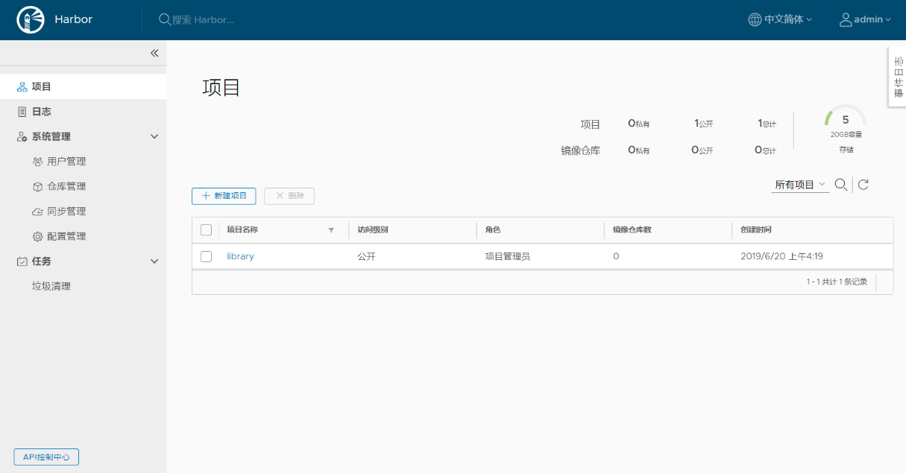
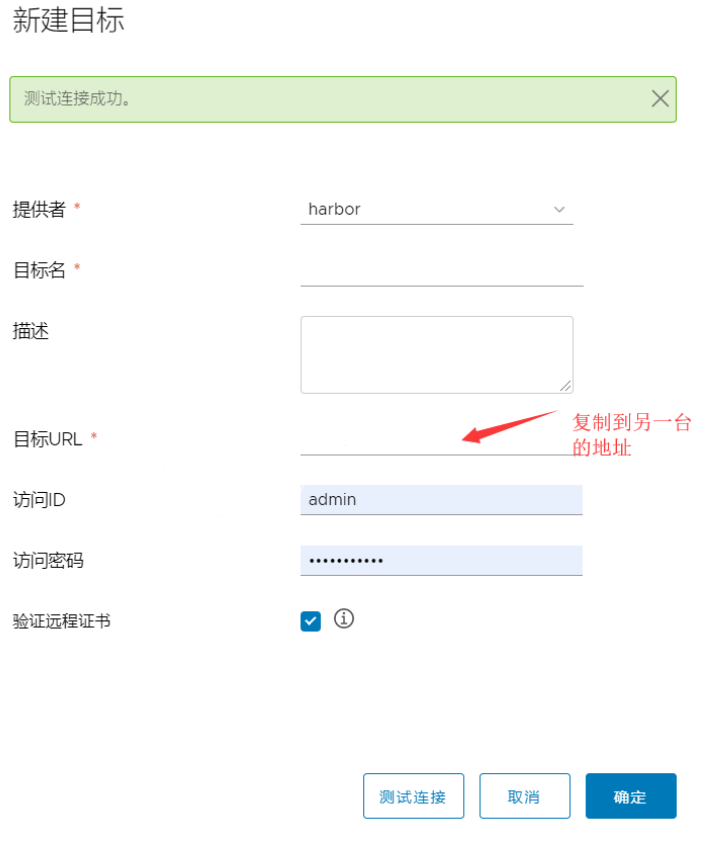
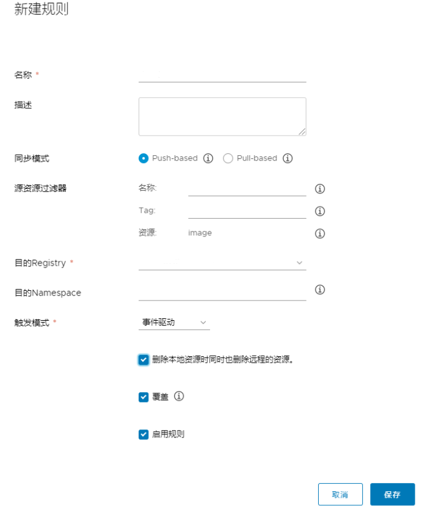

## 1.0 harbor单机部署

#### 1.1 安装 docker-compose 

安装 [docker-compose]( https://github.com/docker/compose/releases )

```bash
wget https://github.com/docker/compose/releases/download/1.25.5/docker-compose-Linux-x86_64
mv docker-compose-Linux-x86_64 /usr/local/bin/docker-compose
chmod +x /usr/local/bin/docker-compose
```

#### 1.2 生成证书

##### 生成证书颁发机构证书

在生产环境中，您应该从CA获得证书。在测试或开发环境中，您可以生成自己的CA。要生成CA证书，请运行以下命令。

创建目录保存证书

```sh
mkdir -p /etc/ssl
cd /etc/ssl
```

1、生成CA证书私钥。

```sh
openssl genrsa -out ca.key 4096
```

2、生成CA证书。

调整`-subj`选项中的值以反映您的组织。如果使用FQDN连接Harbor主机，则必须将其指定为通用名称（`CN`）属性。

```shell
openssl req -x509 -new -nodes -sha512 -days 3650 \
 -subj "/C=CN/ST=Beijing/L=Beijing/O=example/OU=Personal/CN=harbor.wzxmt.com" \
 -key ca.key \
 -out ca.crt
```

如果使用IP地址，需要在执行以上命令前执行以下操作：

```shell
cd /root
openssl rand -writerand .rnd
cd -
```

##### 生成服务器证书

证书通常包含一个`.crt`文件和一个`.key`文件，例如`yourdomain.com.crt`和`yourdomain.com.key`。

1、生成私钥。

```shell
openssl genrsa -out harbor.wzxmt.com.key 4096
```

2、生成证书签名请求（CSR）。

调整`-subj`选项中的值以反映您的组织。如果使用FQDN连接Harbor主机，则必须将其指定为通用名称（`CN`）属性，并在密钥和CSR文件名中使用它。

```shell
openssl req -sha512 -new \
    -subj "/C=CN/ST=Beijing/L=Beijing/O=example/OU=Personal/CN=harbor.wzxmt.com" \
    -key harbor.wzxmt.com.key \
    -out harbor.wzxmt.com.csr
```

3、生成一个x509 v3扩展文件。

无论您使用FQDN还是IP地址连接到Harbor主机，都必须创建此文件，以便可以为您的Harbor主机生成符合主题备用名称（SAN）和x509 v3的证书扩展要求。替换`DNS`条目以反映您的域。

```shell
cat > v3.ext <<-EOF
authorityKeyIdentifier=keyid,issuer
basicConstraints=CA:FALSE
keyUsage = digitalSignature, nonRepudiation, keyEncipherment, dataEncipherment
extendedKeyUsage = serverAuth
subjectAltName = @alt_names

[alt_names]
DNS.1=harbor.wzxmt.com
DNS.2=wzxmt.com
DNS.3=harbor
EOF
```

如果使用ip，需要使用如下方式进行创建：

```shell
cat > v3.ext <<-EOF
authorityKeyIdentifier=keyid,issuer
basicConstraints=CA:FALSE
keyUsage = digitalSignature, nonRepudiation, keyEncipherment, dataEncipherment
extendedKeyUsage = serverAuth
subjectAltName = IP:10.0.0.20
EOF
```

4、使用该`v3.ext`文件为您的Harbor主机生成证书。

将`yourdomain.com`CRS和CRT文件名中的替换为Harbor主机名。

```shell
openssl x509 -req -sha512 -days 3650 \
    -extfile v3.ext \
    -CA ca.crt -CAkey ca.key -CAcreateserial \
    -in harbor.wzxmt.com.csr \
    -out harbor.wzxmt.com.crt
```

##### 提供证书给Harbor和Docker

生成后`ca.crt`，`yourdomain.com.crt`和`yourdomain.com.key`文件，必须将它们提供给harbor和docker，和重新配置harbor使用它们。

1、将服务器证书和密钥复制到Harbor主机上的certficates文件夹中。

```shell
mkdir -p /data/cert
cp harbor.wzxmt.com.crt harbor.wzxmt.com.key ca.crt /data/cert/
```

2、转换`yourdomain.com.crt`为`yourdomain.com.cert`，供Docker使用。
Docker守护程序将`.crt`文件解释为CA证书，并将`.cert`文件解释为客户端证书。

```shell
openssl x509 -inform PEM -in harbor.wzxmt.com.crt -out harbor.wzxmt.com.cert
```

3、将服务器证书，密钥和CA文件复制到Harbor主机上的Docker证书文件夹中。您必须首先创建适当的文件夹。

```shell
mkdir -p /etc/docker/certs.d/harbor.wzxmt.com/
cp harbor.wzxmt.com.cert ca.crt harbor.wzxmt.com.key /etc/docker/certs.d/harbor.wzxmt.com/
```

如果将默认`nginx`端口443映射到其他端口，请创建文件夹`/etc/docker/certs.d/yourdomain.com:port`或`/etc/docker/certs.d/harbor_IP:port`。(省略)

4、重新启动Docker Engine。

```shell
systemctl restart docker
```

以下示例说明了使用自定义证书的配置。

```sh
[root@harbor ~]# yum install -y tree
[root@harbor ~]# tree /etc/docker/certs.d/
/etc/docker/certs.d/
└── harbor.wzxmt.com
    ├── ca.crt                   #<-- Server certificate signed by CA
    ├── harbor.wzxmt.com.cert    #<-- Server key signed by CA
    └── harbor.wzxmt.com.key     #<-- Certificate authority that signed the registry certificate
```

#### 1.3 下载harbor

[habor]( https://github.com/goharbor/harbor/releases/ )有两种安装方式

在线( harbour-online-installer-*)\离线方式(harbour-offline-installer-\*)

```bash
wget https://github.com/goharbor/harbor/releases/download/v2.3.5/harbor-offline-installer-v2.3.5.tgz
tar xvf harbor-offline-installer-v2.3.5.tgz -C /usr/local/src/
ln -s /usr/local/src/harbor /usr/local/harbor
cd /usr/local/harbor
```

复制配置

```
cp harbor.yml.tmpl harbor.yml
```

修改配置

```yaml
# vim harbor.yml
hostname: 0.0.0.0
...
https:
  port: 443
  certificate: /data/cert/harbor.wzxmt.com.crt
  private_key: /data/cert/harbor.wzxmt.com.key
harbor_admin_password: admin
database:
  password: admin
  max_idle_conns: 100
  max_open_conns: 900
...
data_volume: /data/harbor/data
...
metric:
  enabled: true
  port: 9090
  path: /metrics
```

#### 1.4 启动harbor

修改好配置之后,需要加载配置

```bash
./prepare 
```

安装

```bash
./install.sh --with-notary --with-trivy --with-chartmuseum
```

harbor的启动,停止,重启以及删除harbor(只能在harbor目录下操作)

```bash
docker-compose start
docker-compose stop
docker-compose restart
docker-compose down -v
```

成功后,我们可以通过[harbor.wzxmt.com](https://harbor.wzxmt.com)访问我们的镜像仓库

#### 1.5 本地登录镜像仓库报错:

```bash
docker login https://harbor.wzxmt.com
Username: admin
Password: 
Error response from daemon: Get https://harbor.wzxmt.com/v2/: x509: certificate is valid for habor.wzxmt.com, not harbor.wzxmt.com
```

需要配置docker信任仓库地址,在etc/docker/daemon.json添加这两行

```bash
"insecure-registries": ["https://harbor.wzxmt.com"]
```

然后重启docker

```bash
systemctl restart docker
```

这时候本地就能登陆镜像仓库了,这时候会在本地生成/root/.docker/config.json文件,可以将这个文件拷到其他计算机的相同位置下,即可免密拉取,推送镜像.

#### 1.6 推送镜像

```bash
#新建test私有仓库
#下载镜像
docker pull wangyanglinux/myapp:v1
#打标签
docker tag wangyanglinux/myapp:v1 harbor.wzxmt.com/test/myapp:v1
#推送镜像
docker push harbor.wzxmt.com/test/myapp:v1
```

#### 1.7 nginx代理

有时候主机上的80跟443端口被占用，只能使用端口转发来实现

```nginx
cat << EOF >harbor.conf
server {
      listen       443 ssl;
      listen       80;
      server_name  harbor.wzxmt.com;
      if ($scheme = http){ 
	      return 301 https://$server_name$request_uri;
      }
 
      ssl_certificate      /data/cert/harbor.wzxmt.com.crt;
      ssl_certificate_key  /data/cert/harbor.wzxmt.com.key;
      ssl_session_cache    shared:SSL:1m;
      ssl_session_timeout  5m;
      ssl_ciphers  HIGH:!aNULL:!MD5;
      ssl_prefer_server_ciphers  on;

      access_log logs/access-harbor.log;
      error_log  logs/error-harbor.log;

      location / {
        client_max_body_size 10240m; #上传大小限制
        proxy_pass https://10.0.0.80:8443;
        proxy_redirect off;
        proxy_set_header Host $host;
        proxy_set_header X-Real-IP $remote_addr;
        proxy_set_header X-Forwarded-For $proxy_add_x_forwarded_for;
        proxy_next_upstream error timeout invalid_header http_500 http_502 http_503 http_504;
        #add_header Cache-Control no-store;
      }
    }
EOF
```

#### 1.8 使用oss存储

主配置文件中的oss部分参数

```yaml
# 以下参数选项不清楚，可查阅官网说明
storage_service:
  oss:
    accesskeyid: 填写你的具有阿里云oss权限账户的RAM的AccessKey ID
    accesskeysecret: 填写你的具有阿里云oss权限账户的RAM的AccessKey Secret
    region: 地域节点(EndPoint)
    endpoint: Bucket 域名
    bucket: Bucket 名称
    secure: false
```

修改harbor配置

```yaml
# vim harbor.yml
hostname: 0.0.0.0
...
https:
  port: 443
  certificate: /data/cert/harbor.wzxmt.com.crt
  private_key: /data/cert/harbor.wzxmt.com.key
harbor_admin_password: admin
database:
  password: admin
  max_idle_conns: 100
  max_open_conns: 900
...
data_volume: /data/harbor/data
storage_service:
  oss:
    accesskeyid: LTAI4GCqHJUF*
    accesskeysecret: 9aQ0ss8PhT7oecT9N*
    region: oss-accelerate
    endpoint: oss-accelerate.aliyuncs.com
    bucket: *-registry
    secure: false
...
metric:
  enabled: true
  port: 9090
  path: /metrics
```


## 2. harbor高可用集群部署

#### 2.1 安装docker-compose

#### 2.2 下载harbor并解压

```bash
wget https://github.com/goharbor/harbor/releases/download/v2.3.5/harbor-offline-installer-v2.3.5.tgz
tar xvf harbor-offline-installer-v2.3.5.tgz -C /usr/local/src/
ln -s /usr/local/src/harbor /usr/local/harbor
cd /usr/local/harbor
```

#### 2.3生成配置

修改barbor.yml文件,采用hostname设置访问地址，可以使用ip、域名，不可以设置为127.0.0.1、0.0.0.0或localhost

```yaml
cp harbor.yml.tmpl harbor.yml
# vim harbor.yml
hostname: 0.0.0.0
...
https:
  port: 443
  certificate: /data/cert/harbor.wzxmt.com.crt
  private_key: /data/cert/harbor.wzxmt.com.key
harbor_admin_password: admin
database:
  password: admin
  max_idle_conns: 100
  max_open_conns: 900
...
data_volume: /data/harbor/data
...
metric:
  enabled: true
  port: 9090
  path: /metrics
```

初始化并启动habor

```bash
./prepare
./install.sh --with-notary --with-trivy --with-chartmuseum
```

启动成功后,通过浏览器访问[harbor](https://10.0.0.36)成功,表示部署成功!

#### 2.4 harbor节点安装keepalived

```bash
yum install -y keepalived
systemctl enable keepalived.service 
```

#### 2.5 keepalived配置及启动

keepalived配置文件，其余节点修改state为BACKUP，priority小于主节点即可；

```bash
cat<< EOF >/etc/keepalived/keepalived.conf
! Configuration File for keepalived
vrrp_script check_harbor {
        script "/etc/keepalived/check_harbor.sh"
        interval 4
        weight 60  
}
vrrp_instance VI_1 {
    state MASTER  
    interface eth0
    virtual_router_id 51
    priority 150
    advert_int 1
    authentication {
        auth_type PASS
        auth_pass 1111
    }
    track_script {
        check_harbor
    }
    virtual_ipaddress {
        10.0.0.50
    }
}
EOF
```

编写监控脚本

```bash
cat<< 'EOF' >/etc/keepalived/check_harbor.sh
#!/bin/bash
flag=`ss -lntup|awk '{print $5}'|awk -F'[:]' '{print $NF}'|grep -w 443`
if [ -z $flag ];then
    echo "harbor is down,close the keepalived"
    systemctl stop keepalived
fi
EOF
chmod +x /etc/keepalived/check_harbor.sh
```

启动keepalived

```bash
systemctl restart keepalived.service 
```

分别在两台上加入镜像仓库

```bash
"insecure-registries": ["https://harbor.wzxmt.com","https://10.0.0.20","https://10.0.0.21"]
```

重启docker与harbor,此时可以在客户端登录仓库

```bash
docker login https://harbor.wzxmt.com
```

#### 2.6 浏览器登录镜像仓库，开始配置Harbor的复制仓库功能

```bash
https://harbor.wzxmt.com
```

在主[Harbor](10.0.0.36),创建新项目test



在主Harbor的仓库管理->新建目标：



在Harbor的复制管理->新建规则：



在备[harbor](10.0.0.37)也按照主配置,就实现主主复制,经测试推送镜像能够双向复制.