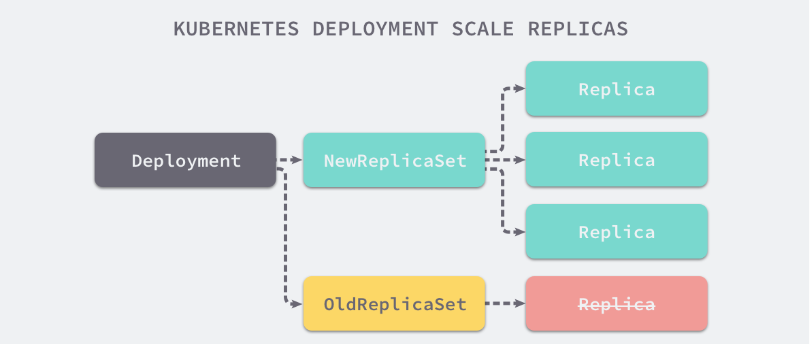

RS 与 RC 与 Deployment 关联

RC （ReplicationController ）主要的作用就是用来确保容器应用的副本数始终保持在用户定义的副本数。即如果有容器异常退出，会自动创建新的Pod来替代；而如果异常多出来的容器也会自动回收

Kubernetes 官方建议使用 RS（ReplicaSet ）替代 RC （ReplicationController ）进行部署，RS 跟 RC 没有本质的不同，只是名字不一样，并且 RS 支持集合式的 selector

```yaml
cat << EOF >rs.yaml
apiVersion: apps/v1
kind: ReplicaSet
metadata:  
  name: frontend
spec:  
  replicas: 3  
  selector:    
    matchLabels:      
      tier: frontend  
  template:    
    metadata:      
      labels:        
        tier: frontend    
    spec:      
      containers:      
      - name: frontend        
        image: wangyanglinux/myapp:v2       
        ports:        
        - containerPort: 80
EOF
kubectl apply -f rs.yaml
```

RS 与 RC 与 Deployment 关联

                

# Deployment

   Deployment 为 Pod 和 ReplicaSet 提供了一个声明式定义(declarative)方法，用来替代以前的ReplicationController 来方便的管理应用。典型的应用场景包括：定义Deployment来创建Pod和ReplicaSet滚动升级和回滚应用扩容和缩容暂停和继续Deployment 

- 定义Deployment来创建Pod和ReplicaSet 
- 滚动升级和回滚应用
- 扩容和缩容
- 暂停和继续Deployment                        

## 1、部署一个应用

```yaml
cat << EOF >nginx-deployment.yaml
apiVersion: apps/v1
kind: Deployment
metadata:  
  name: nginx-deployment
spec:  
  replicas: 3
  selector:    
    matchLabels:      
      app: nginx   
  template:    
    metadata:      
      labels:        
        app: nginx    
    spec:      
      containers:      
      - name: nginx        
        image: wangyanglinux/myapp:v2
        imagePullPolicy: IfNotPresent      
        ports:        
        - containerPort: 80
EOF
kubectl apply -f nginx-deployment.yaml --record
```

--record参数可以记录命令，我们可以很方便的查看每次 revision 的变化

## 2、扩容

```bash
kubectl scale deployment nginx-deployment --replicas 10
```

## 3、Deployment自动扩展

查看pod或者node的内存、cpu，发现查看不到相应信息，因而HPA无法根据资源进行自动扩展，这时候需要安装metrics-server，进行相应采集。

安装metrics-server(略)

部署hpa应用

```yaml
cat << EOF >hpa-cpu.yaml
apiVersion: apps/v1
kind: Deployment
metadata:
  name: hpa-cpu
spec:
  replicas: 1
  selector:
    matchLabels:
      app: hpa-test
  template:
    metadata:
      labels:
        app: hpa-test
    spec:
      containers:
      - name: hpa-test
        image: ninejy/hpacpu:latest
        imagePullPolicy: IfNotPresent
        ports:
        - containerPort: 8080
---
apiVersion: v1
kind: Service
metadata:
  name: hpa-cpu
spec:
  type: ClusterIP
  selector:
    app: hpa-test
  ports:
  - name: http
    port: 80
    targetPort: 8080
EOF
kubectl apply -f hpa-cpu.yaml
```

设置自动扩展

```bash
kubectl autoscale deployment hpa-cpu --max=7 --min=1 --cpu-percent=60
```

查看hpa

```bash
[root@k8s ~]# kubectl get hpa hpa-cpu
NAME      REFERENCE            TARGETS         MINPODS   MAXPODS   REPLICAS   AGE
hpa-cpu   Deployment/hpa-cpu   <unknown>/60%   1         7         1          15s
```

targets为unknown有两种原因

- 查看原始deployment的resource有没有设置cpu的限制如果没有：

- 动态设置

  ```bash
  kubectl set resources Deployment/hpa-cpu --limits=cpu=10m
  ```

- yaml配置

  ```yaml
  cat << 'EPF' >hpa.yaml
  apiVersion: autoscaling/v1
  kind: HorizontalPodAutoscaler
  metadata:
    name: hpa-cpu
  spec:
    maxReplicas: 7
    minReplicas: 1
    scaleTargetRef:
      apiVersion: apps/v1
      kind: Deployment
      name: hpa-cpu
    targetCPUUtilizationPercentage: 60
  EOF
  ```

- 等一段时间再查看

```bash
[root@k8s ~]# kubectl get hpa hpa-cpu
NAME      REFERENCE            TARGETS   MINPODS   MAXPODS   REPLICAS   AGE
hpa-cpu   Deployment/hpa-cpu   0%/60%    1         7         1          4m56s
```

查看结果

```bash
[root@k8s ~]# kubectl top pod hpa-cpu-7b78f68b95-2k84x
NAME                       CPU(cores)   MEMORY(bytes)
hpa-cpu-7b78f68b95-2k84x   0m           1Mi
```

可以进行压力测试，观察REPLICAS变化

```bash
# 开三个 k8s-master01 窗口，分别执行下面三条命令
watch kubectl get pods
watch kubectl top pods
 
ip=$(kubectl get svc | grep hpa-cpu | awk '{print $3}')
for i in `seq 1 100000`; do curl $ip?a=$i; done
```

过一会就会有 pod 数量增加，说明 HPA 生效了。停掉 curl命令，过一会，pod 数量又会恢复到 1 个。

删除HPA

```bash
kubectl delete hpa hpa-cpu
```

## 4、更新镜像也比较简单

```bash
kubectl set image deployment/nginx-deployment nginx=nginx:7-alpine
```

## 5、回滚

```bash
kubectl rollout undo deployment/nginx-deployment
```

更新 Deployment

假如我们现在想要让 nginx pod 使用nginx:7-alpine的镜像来代替原来的nginx:latest的镜像

```bash
kubectl set image deployment/nginx-deployment nginx=nginx:7-alpine
deployment "nginx-deployment" image updated
```

可以使用edit命令来编辑 Deployment

```bash
kubectl edit deployment/nginx-deployment
deployment "nginx-deployment" edited
```

查看 rollout 的状态

```bash
kubectl rollout status deployment/nginx-deployment
Waiting for rollout to finish: 2 out of 3 new replicas have been updated...
deployment "nginx-deployment" successfully rolled out
```

查看历史 RS

```bash
kubectl get rs
NAME                           DESIRED   CURRENT   READY   AGE
nginx-deployment-657d4699fb   5         5         5       6m47s
nginx-deployment-7594ddc956   0         0         0       22m
nginx-deployment-786bd6bf67   0         0         0       24m
```

## Deployment 更新策略

Deployment 可以保证在升级时只有一定数量的 Pod 是 down 的。默认的，它会确保至少有比期望的Pod数量少一个是up状态（最多一个不可用）
Deployment 同时也可以确保只创建出超过期望数量的一定数量的 Pod。默认的，它会确保最多比期望的Pod数量多一个的 Pod 是 up 的（最多1个 surge ,未来的 Kuberentes 版本中，将从1-1变成25%-25%

```bash
kubectl describe deployments
```

## Rollover（多个rollout并行）

假如您创建了一个有5个niginx:1.7.9 replica的 Deployment，但是当还只有3个nginx:1.7.9的 replica 创建出来的时候您就开始更新含有5个nginx:1.9.1 replica 的 Deployment。在这种情况下，Deployment 会立即杀掉已创建的3个nginx:1.7.9的 Pod，并开始创建nginx:1.9.1的 Pod。它不会等到所有的5个nginx:1.7.9的Pod 都创建完成后才开始改变航道

## 回退 Deployment

```bash
kubectl set image deployment/nginx-deployment nginx=wangyanglinux/myapp:v1
kubectl rollout status deployments nginx-deployment
kubectl get pods
kubectl rollout history deployment/nginx-deployment
kubectl rollout undo deployment/nginx-deployment #回滚到上一个版本
kubectl rollout undo deployment/nginx-deployment --to-revision=2 #回退到指定某个历史版本
kubectl rollout pause deployment/nginx-deployment    # 暂停 deployment 的更新
kubectl rollout resume deployments nginx-deployment   # 恢复 deployment 的更新
```

可以用kubectl rollout status命令查看 Deployment 是否完成。如果 rollout 成功完成，kubectl rollout status将返回一个0值的 Exit Code

```bash
kubectl rollout status deployment/nginx-deployment
Waiting for rollout to finish: 2 of 3 updated replicas are available...
deployment "nginx-deployment" successfully rolled out
echo $?
0
```

## 清理 Policy

可以通过设置.spec.revisonHistoryLimit项来指定 deployment 最多保留多少 revision 历史记录。默认的会保留所有的 revision；如果将该项设置为0，Deployment 就不允许回退了

# DaemonSet

DaemonSet 确保全部（或者一些）Node 上运行一个 Pod 的副本。当有 Node 加入集群时，也会为他们新增一个 Pod 。当有 Node 从集群移除时，这些 Pod 也会被回收。删除 DaemonSet 将会删除它创建的所有 Pod

使用 DaemonSet 的一些典型用法：

- 运行集群存储 daemon，例如在每个 Node 上运行glusterd、ceph
- 在每个 Node 上运行日志收集 daemon，例如fluentd、logstash
- 在每个 Node 上运行监控 daemon，例如 Prometheus Node Exporter、collectd、Datadog 代理、New Relic 代理，或 Ganglia gmond

```yaml
cat << EOF > deamonset.yaml
apiVersion: apps/v1
kind: DaemonSet
metadata:  
  name: deamonset-example  
  labels:    
    app: daemonset
spec:  
  selector:    
    matchLabels:      
      name: deamonset-example  
  template:    
    metadata:      
      labels:        
        name: deamonset-example    
    spec:      
      containers:      
      - name: daemonset-example        
        image: nginx:1.14.2
EOF
kubectl apply -f deamonset.yaml
```

# Job

Job 负责批处理任务，即仅执行一次的任务，它保证批处理任务的一个或多个 Pod 成功结束

特殊说明:

- spec.template格式同Pod
- RestartPolicy仅支持Never或OnFailure
- 单个Pod时，默认Pod成功运行后Job即结束
- .spec.completions标志Job结束需要成功运行的Pod个数，默认为1
- .spec.parallelism标志并行运行的Pod的个数，默认为1
- spec.activeDeadlineSeconds标志失败Pod的重试最大时间，超过这个时间不会继续重试

```yaml
cat << EOF >job.yaml
apiVersion: batch/v1
kind: Job
metadata:  
  name: pi
spec:  
  template:    
    metadata:      
      name: pi    
    spec:      
      containers:      
      - name: pi        
        image: docker.io/library/perl:latest
        imagePullPolicy: IfNotPresent
        command: ["perl","-Mbignum=bpi","-wle","print bpi(2000)","sleep 600s"]      
      restartPolicy: Never
EOF
kubectl apply -f job.yaml
```

## CronJob Spec

- spec.template格式同Pod
- RestartPolicy仅支持Never或OnFailure
- 单个Pod时，默认Pod成功运行后Job即结束
- .spec.completions标志Job结束需要成功运行的Pod个数，默认为1
- .spec.parallelism标志并行运行的Pod的个数，默认为1
- spec.activeDeadlineSeconds标志失败Pod的重试最大时间，超过这个时间不会继续重试

# CronJob

Cron Job管理基于时间的 Job，即：

- 在给定时间点只运行一次
- 周期性地在给定时间点运行

使用条件：当前使用的 Kubernetes 集群，版本 >= 1.8（对 CronJob）
典型的用法如下所示：

- 在给定的时间点调度 Job 运行
- 创建周期性运行的 Job，例如：数据库备份、发送邮件

## CronJob Spec

- .spec.schedule：调度，必需字段，指定任务运行周期，格式同 Cron

- .spec.jobTemplate：Job 模板，必需字段，指定需要运行的任务，格式同 Job

- .spec.startingDeadlineSeconds：启动 Job 的期限（秒级别），该字段是可选的。如果因为任何原因而错过了被调度的时间，那么错过执行时间的 Job 将被认为是失败的。如果没有指定，则没有期限

- .spec.concurrencyPolicy：并发策略，该字段也是可选的。它指定了如何处理被 Cron Job 创建的 Job 的并发执行。只允许指定下面策略中的一种：

  * Allow（默认）：允许并发运行 Job

    	Forbid：禁止并发运行，如果前一个还没有完成，则直接跳过下一个
    	
    	Replace：取消当前正在运行的 Job，用一个新的来替换

- .spec.suspend：挂起，该字段也是可选的。如果设置为true，后续所有执行都会被挂起。它对已经开始执行的 Job 不起作用。默认值为false。

- .spec.successfulJobsHistoryLimit和.spec.failedJobsHistoryLimit：历史限制，是可选的字段。它们指定了可以保留多少完成和失败的 Job。默认情况下，它们分别设置为3和1。设置限制的值为0，相关类型的 Job 完成后将不会被保留。

```yaml
cat << EOF >CronJob.yaml
apiVersion: batch/v1beta1
kind: CronJob
metadata:  
  name: hello
spec:  
  schedule: "*/1 * * * *"  
  jobTemplate:    
    spec:      
      template:        
        spec:
          containers:          
          - name: hello            
            image: busybox            
            args:            
            - /bin/sh            
            - -c            
            - date; echo Hello from the Kubernetes cluster          
          restartPolicy: OnFailure
EOF
kubectl apply -f CronJob.yaml
```

```bash
kubectl get cronjob
kubectl get jobs
kubectl logs hello-1588668480
# 注意，删除 cronjob 的时候不会自动删除 job，这些 job 可以用 kubectl delete job 来删除
kubectl delete cronjob hello
```

## CrondJob 本身的一些限制

创建 Job 操作应该是幂等的