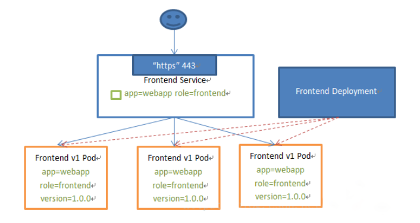
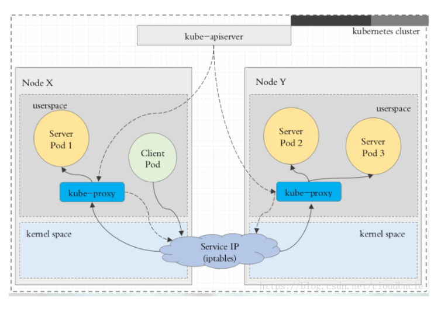
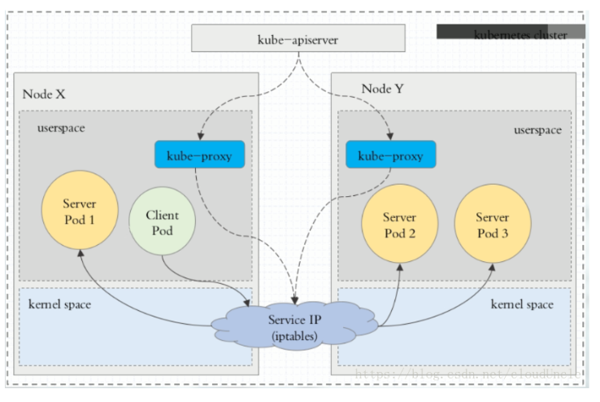
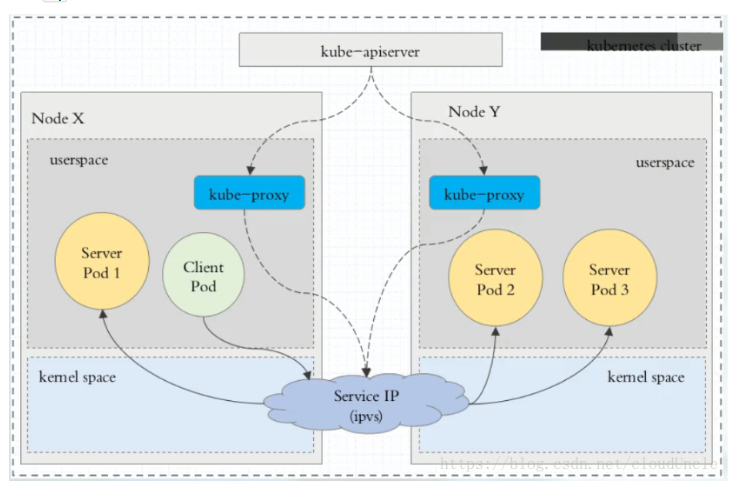
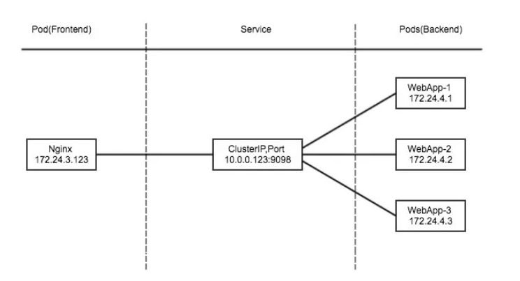

## Service 的概念

Kubernetes Service定义了这样一种抽象：一个Pod的逻辑分组，一种可以访问它们的策略 —— 通常称为微服务。这一组Pod能够被Service访问到，通常是通过Label Selector



Service能够提供负载均衡的能力，但是在使用上有以下限制：

- 只提供 4 层负载均衡能力，而没有 7 层功能，但有时我们可能需要更多的匹配规则来转发请求，这点上 4 层负载均衡是不支持的

## Service 的类型

Service 在 K8s 中有以下四种类型:

- ClusterIp：默认类型，自动分配一个仅 Cluster 内部可以访问的虚拟 IP
- NodePort：在 ClusterIP 基础上为 Service 在每台机器上绑定一个端口，这样就可以通过: NodePort 来访问该服务
- LoadBalancer：在 NodePort 的基础上，借助 cloud provider 创建一个外部负载均衡器，并将请求转发到: NodePort
- ExternalName：把集群外部的服务引入到集群内部来，在集群内部直接使用。没有任何类型代理被创建，这只有 kubernetes 1.7 或更高版本的 kube-dns 才支持


## VIP 和 Service 代理

在 Kubernetes 集群中，每个 Node 运行一个kube-proxy进程。kube-proxy负责为Service实现了一种VIP（虚拟 IP）的形式，而不是ExternalName的形式。在 Kubernetes v1.0 版本，代理完全在 userspace。在Kubernetes v1.1 版本，新增了 iptables 代理，但并不是默认的运行模式。从 Kubernetes v1.2 起，默认就是iptables 代理。在 Kubernetes v1.8.0-beta.0 中，添加了 ipvs 代理；在 Kubernetes 1.14 版本开始默认使用ipvs 代理。

在 Kubernetes v1.0 版本，Service是 “4层” （TCP/UDP over IP）概念。在 Kubernetes v1.1 版本，新增了Ingress API（beta 版），用来表示 “7层”（HTTP）服务

## 代理模式的分类

#### I、userspace 代理模式

#### II、iptables 代理模式!



#### III、ipvs 代理模式

这种模式，kube-proxy 会监视 Kubernetes Service对象和Endpoints，调用netlink接口以相应地创建ipvs 规则并定期与 Kubernetes Service对象和Endpoints对象同步 ipvs 规则，以确保 ipvs 状态与期望一致。访问服务时，流量将被重定向到其中一个后端 Pod与 iptables 类似，ipvs 于 netfilter 的 hook 功能，但使用哈希表作为底层数据结构并在内核空间中工作。这意味着 ipvs 可以更快地重定向流量，并且在同步代理规则时具有更好的性能。此外，ipvs 为负载均衡算法提供了更多选项，例如：

- rr：轮询调度
- lc：最小连接数
- dh：目标哈希
- sh：源哈希
- sed：最短期望延迟
- nq：不排队调度



## ClusterIP

clusterIP 主要在每个 node 节点使用 iptables，将发向 clusterIP 对应端口的数据，转发到 kube-proxy 中。然后 kube-proxy 自己内部实现有负载均衡的方法，并可以查询到这个 service 下对应 pod 的地址和端口，进而把数据转发给对应的 pod 的地址和端口



为了实现图上的功能，主要需要以下几个组件的协同工作：

- apiserver 用户通过kubectl命令向apiserver发送创建service的命令，apiserver接收到请求后将数据存储到etcd中
- kube-proxy kubernetes的每个节点中都有一个叫做kube-porxy的进程，这个进程负责感知service，pod的变化，并将变化的信息写入本地的iptables规则中
- iptables 使用NAT等技术将virtualIP的流量转至endpoint中

示例

```yaml
cat << EOF >myapp-deploy.yaml 
apiVersion: apps/v1
kind: Deployment
metadata:  
  name: myapp-deploy
spec:  
  replicas: 3  
  selector:    
    matchLabels:      
      app: myapp      
      release: stabel  
  template:    
    metadata:      
      labels:        
        app: myapp        
        release: stabel        
        env: test    
    spec:      
      containers:      
      - name: myapp
        image: wangyanglinux/myapp:v2        
        imagePullPolicy: IfNotPresent        
        ports:        
        - name: http          
          containerPort: 80
EOF
kubectl apply -f myapp-deploy.yaml
```

创建 Service 信息

```yaml
cat << EOF >myapp-service.yaml
apiVersion: v1
kind: Service
metadata:  
  name: myapp  
spec:  
  type: ClusterIP  
  selector:    
    app: myapp    
    release: stabel  
  ports:  
  - name: http    
    port: 80    
    targetPort: 80
EOF
kubectl apply -f myapp-service.yaml
```

## Headless Service

有时不需要或不想要负载均衡，以及单独的 Service IP 。遇到这种情况，可以通过指定 ClusterIP(spec.clusterIP) 的值为 “None” 来创建 Headless Service 。这类 Service 并不会分配 Cluster IP， kube-proxy 不会处理它们，而且平台也不会为它们进行负载均衡和路由

```yaml
cat << EOF >myapp-svc-headless.yaml
apiVersion: v1
kind: Service
metadata:  
  name: myapp-headless  
  namespace: default
spec:  
  selector:    
    app: myapp  
  clusterIP: "None"  
  ports:  
  - port: 80    
    targetPort: 80
EOF
kubectl apply -f myapp-svc-headless.yaml
```

安装dig

```bash
yum install -y bind-utils
```

测试

```bash
dig -t A myapp-headless.default.svc.cluster.local. @10.96.0.10
```

## NodePort

nodePort 的原理在于在 node 上开了一个端口，将向该端口的流量导入到 kube-proxy，然后由 kube-proxy 进一步到给对应的 pod

```yaml
cat << EOF >myapp-nodeport.yaml
apiVersion: v1
kind: Service
metadata:  
  name: myapp  
spec:  
  type: NodePort  
  selector:    
    app: myapp    
    release: stabel  
  ports:  
  - name: http    
    port: 80    
    targetPort: 80
    nodePort: 30080 #默认30000-32767
EOF
kubectl apply -f myapp-nodeport.yaml
```

修改默认端口

```bash
- command:
    - kube-apiserver
    - --service-node-port-range=1-65535 #添加的配置
```

查询流程

```bash
iptables -t nat -nvL 
KUBE-NODEPORTS
```

## LoadBalancer

loadBalancer 和 nodePort 其实是同一种方式。区别在于 loadBalancer 比 nodePort 多了一步，就是可以调用cloud provider 去创建 LB 来向节点导流


## ExternalName

这种类型的 Service 通过返回 CNAME 和它的值，可以将服务映射到 externalName 字段的内容( 例如：hub.atguigu.com )。ExternalName Service 是 Service 的特例，它没有 selector，也没有定义任何的端口和Endpoint。相反的，对于运行在集群外部的服务，它通过返回该外部服务的别名这种方式来提供服务

```yaml
cat << EOF >externalname.yaml
apiVersion: v1
kind: Service
metadata:  
  name: my-service-1
spec:  
  type: ExternalName  
  externalName: www.test.com
EOF
kubectl apply -f externalname.yaml
```

当查询主机 my-service.defalut.svc.cluster.local ( SVC_NAME.NAMESPACE.svc.cluster.local )时，集群的DNS 服务将返回一个值 my.database.example.com 的 CNAME 记录。访问这个服务的工作方式和其他的相同，唯一不同的是重定向发生在 DNS 层，而且不会进行代理或转发

```bash
dig -t A my-service-1.default.svc.cluster.local. @10.96.0.10
```

## Service工作原理及实现模式

**Service是由 kube-proxy 组件，加上 iptables 来共同实现的。**

创建service时kube-proxy通过 Service 的 Informer 感知Service 对象的添加。会在宿主机上创建这样一条 iptables 规则；

kube-proxy通过iptables 处理 Service 的过程，其实需要在宿主机上设置相当多的 iptables 规则。而且，kube-proxy 还需要在控制循环里不断地刷新这些规则来确保它们始终是正确的。不难想到，当你的宿主机上有大量 Pod 的时候，成百上千条 iptables 规则不断地被刷新，会大量占用该宿主机的 CPU 资源，甚至会让宿主机“卡”在这个过程中。所以说，**一直以来，基于 iptables 的 Service 实现，都是制约 Kubernetes 项目承载更多量级的 Pod 的主要障碍。**这是就需要 IPVS 模式的 Service，其工作原理当我们创建了前面的 Service 之后，kube-proxy 首先会在宿主机上创建一个虚拟网卡（叫作kube-ipvs0），并为它分配 Service VIP 作为 IP 地址，kube-proxy 就会通过 Linux 的 IPVS 模块，为这个 IP 地址设置 IPVS 虚拟主机，并设置虚拟主机之间使用轮询模式 (rr) 来作为负载均衡策略。

而相比于 iptables，IPVS 在内核中的实现其实也是基于 Netfilter 的 NAT 模式，所以在转发这一层上，理论上 IPVS 并没有显著的性能提升。但是，IPVS 并不需要在宿主机上为每个 Pod 设置 iptables 规则，而是把对这些“规则”的处理放到了内核态，从而极大地降低了维护这些规则的代价。这也正印证了我在前面提到过的，“将重要操作放入内核态”是提高性能的重要手段。

当然，IPVS 模块只负责上述的负载均衡和代理功能。而一个完整的 Service 流程正常工作所需要的包过滤、SNAT 等操作，还是要靠 iptables 来实现。只不过，这些辅助性的 iptables 规则数量有限，也不会随着 Pod 数量的增加而增加。

## Service 与 DNS 的关系

Service 和 Pod 都会被分配对应的 DNS A 记录（从域名解析 IP 的记录）

- ClusterIP 模式的 Service 比如上面的例子，它的 A 记录的格式是..svc.cluster.local。当你访问这条 A 记录的时候，它解析到的就是该 Service 的 VIP 地址。
- 指定了 clusterIP=None 的 Headless Service它的 A 记录的格式也是..svc.cluster.local。但是，当你访问这条 A 记录的时候，它返回的是所有被代理的 Pod 的 IP 地址的集合。当然，如果你的客户端没办法解析这个集合的话，它可能会只会拿到第一个 Pod 的 IP 地址。

