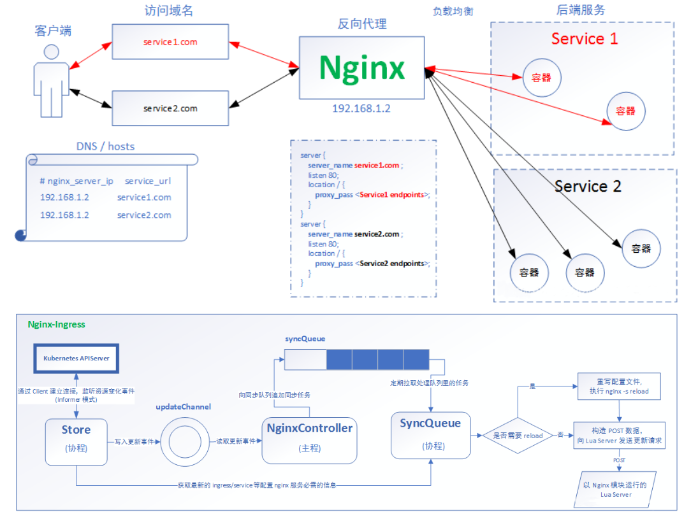

## 资料信息

[Ingress-Nginx github](https://github.com/kubernetes/ingress-nginxIn)

[gress-Nginx 官方网](https://kubernetes.github.io/ingress-nginx/)



## 部署 Ingress-Nginx

```bash
kubectl apply -f https://raw.githubusercontent.com/kubernetes/ingress-nginx/master/deploy/static/provider/baremetal/deploy.yaml
```

## Ingress HTTP 代理访问

示例：

```yaml
cat << EOF >ingress-http.yaml
apiVersion: apps/v1
kind: Deployment
metadata:
  name: nginx-dm
spec:
  replicas: 2
  selector:
    matchLabels:
      name: nginx
  template:
    metadata:
      labels:
        name: nginx
    spec:
      containers:
      - name: nginx
        image: wangyanglinux/myapp:v1
        imagePullPolicy: IfNotPresent
        ports:
          - containerPort: 80
---
apiVersion: v1
kind: Service
metadata:  
  name: nginx-svc
spec:  
  ports:    
    - port: 80      
      targetPort: 80      
      protocol: TCP  
  selector:    
    name: nginx
---
apiVersion: extensions/v1beta1
kind: Ingress
metadata:  
  name: nginx-test
spec:  
  rules:    
    - host: www.test.com      
      http:        
        paths:        
        - path: /          
          backend:            
            serviceName: nginx-svc            
            servicePort: 80
EOF
kubectl apply -f ingress-http.yaml
```

## Ingress  HTTPS 代理访问

创建证书，以及 cert 存储方式

```bash
openssl req -x509 -sha256 -nodes -days 365 -newkey rsa:2048 -keyout tls.key -out tls.crt -subj "/CN=nginxsvc/O=nginxsvc"
kubectl create secret tls tls-secret --key tls.key --cert tls.crt
```

示例：

```yaml
cat << EOF >ingress-https.yaml
apiVersion: extensions/v1beta1
kind: Ingress
metadata:  
  name: nginx-test
spec:  
  tls:    
    - hosts:      
      - test.com      
      secretName: tls-secret  
  rules:    
    - host: test.com      
      http:        
        paths:        
        - path: /          
          backend:            
            serviceName: nginx-svc            
            servicePort: 80
EOF
kubectl apply -f ingress-https.yaml
```

## Nginx 进行 BasicAuth

```bash
yum -y install httpd
htpasswd -c auth test
kubectl create secret generic basic-auth --from-file=auth
```

示例：

```yaml
cat << EOF >ingress-basic.yaml
apiVersion: extensions/v1beta1
kind: Ingress
metadata:  
  name: ingress-with-auth  
  annotations:    
    nginx.ingress.kubernetes.io/auth-type: basic    
    nginx.ingress.kubernetes.io/auth-secret: basic-auth    
    nginx.ingress.kubernetes.io/auth-realm: 'Authentication Required - test'
spec:  
  rules:  
    - host: test02.com    
      http:      
        paths:      
        - path: /        
          backend:          
            serviceName: nginx-svc          
            servicePort: 80
EOF
kubectl apply -f ingress-basic.yaml
```

## Nginx 进行重写

|                      名称                      |                             描述                             |  值  |
| :--------------------------------------------: | :----------------------------------------------------------: | :--: |
|   nginx.ingress.kubernetes.io/rewrite-target   |                   必须重定向流量的目标URI                    |  串  |
|    nginx.ingress.kubernetes.io/ssl-redirect    | 指示位置部分是否仅可访问SSL（当Ingress包含证书时默认为True） | 布尔 |
| nginx.ingress.kubernetes.io/force-ssl-redirect |          即使Ingress未启用TLS，也强制重定向到HTTPS           | 布尔 |
|      nginx.ingress.kubernetes.io/app-root      |  定义Controller必须重定向的应用程序根，如果它在'/'上下文中   |  串  |
|     nginx.ingress.kubernetes.io/use-regex      |          指示Ingress上定义的路径是否使用正则表达式           | 布尔 |

示例：
```yaml
cat << EOF >ingress-rewrite.yaml
apiVersion: extensions/v1beta1
kind: Ingress
metadata:  
  name: nginx-test1  
  annotations:    
    nginx.ingress.kubernetes.io/rewrite-target: https://test01.com:30443
spec:  
  rules:  
  - host: test03.com
    http:
      paths:      
      - path: /        
        backend:          
          serviceName: nginx-svc1         
          servicePort: 80
EOF
kubectl apply -f ingress-rewrite.yaml
```

