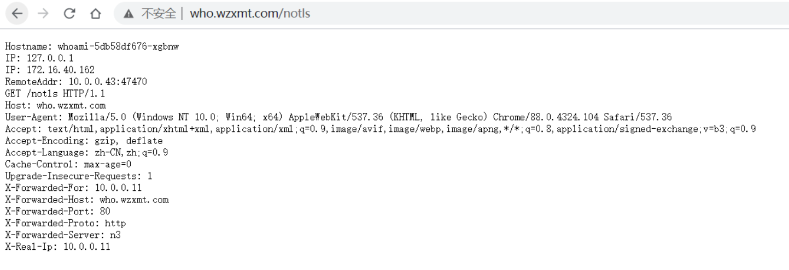
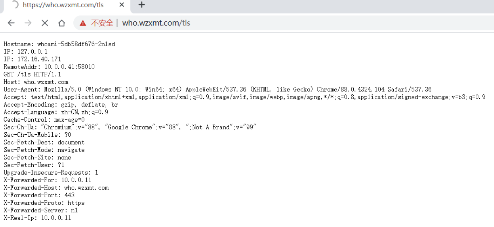
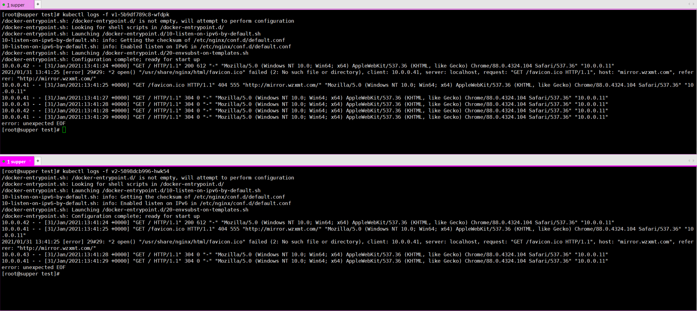

## 简介

一文搞懂 Traefik2.* 的使用

[Traefik](https://links.jianshu.com/go?to=https%3A%2F%2Fgithub.com%2Fcontainous%2Ftraefik) 是一个开源的可以使服务发布变得轻松有趣的边缘路由器。它负责接收你系统的请求，然后使用合适的组件来对这些请求进行处理。

除了众多的功能之外，Traefik 的与众不同之处还在于它会自动发现适合你服务的配置。当 Traefik 在检查你的服务时，会找到服务的相关信息并找到合适的服务来满足对应的请求。

Traefik 兼容所有主流的集群技术，比如 Kubernetes，Docker，Docker Swarm，AWS，Mesos，Marathon，等等；并且可以同时处理多种方式。（甚至可以用于在裸机上运行的比较旧的软件。）


traefik architecture

使用 Traefik，不需要维护或者同步一个独立的配置文件：因为一切都会自动配置，实时操作的（无需重新启动，不会中断连接）。使用 Traefik，你可以花更多的时间在系统的开发和新功能上面，而不是在配置和维护工作状态上面花费大量时间。

## 核心概念

Traefik 是一个边缘路由器，是你整个平台的大门，拦截并路由每个传入的请求：它知道所有的逻辑和规则，这些规则确定哪些服务处理哪些请求；传统的反向代理需要一个配置文件，其中包含路由到你服务的所有可能路由，而 Traefik 会实时检测服务并自动更新路由规则，可以自动服务发现。


**traefik architecture overview**

首先，当启动 Traefik 时，需要定义 `entrypoints`（入口点），然后，根据连接到这些 entrypoints 的**路由**来分析传入的请求，来查看他们是否与一组**规则**相匹配，如果匹配，则路由可能会将请求通过一系列**中间件**转换过后再转发到你的服务上去。在了解 Traefik 之前有几个核心概念我们必须要了解：

- `Providers` 用来自动发现平台上的服务，可以是编排工具、容器引擎或者 key-value 存储等，比如 Docker、Kubernetes、File
- `Entrypoints` 监听传入的流量（端口等…），是网络入口点，它们定义了接收请求的端口（HTTP 或者 TCP）。
- `Routers` 分析请求（host, path, headers, SSL, …），负责将传入请求连接到可以处理这些请求的服务上去。
- `Services` 将请求转发给你的应用（load balancing, …），负责配置如何获取最终将处理传入请求的实际服务。
- `Middlewares` 中间件，用来修改请求或者根据请求来做出一些判断（authentication, rate limiting, headers, ...），中间件被附件到路由上，是一种在请求发送到你的服务之前（或者在服务的响应发送到客户端之前）调整请求的一种方法。

## 部署traefik

创建资源清单目录

```bash
mkdir -p traefik && cd traefik
```

namespace

```yaml
cat<< 'EOF' > 00-init.yaml
apiVersion: v1
kind: Namespace
metadata:
  name: ingress-system
EOF
```

crd

```yaml
cat<< 'EOF' >crd.yaml
apiVersion: apiextensions.k8s.io/v1beta1
kind: CustomResourceDefinition
metadata:
  name: ingressroutes.traefik.containo.us

spec:
  group: traefik.containo.us
  version: v1alpha1
  names:
    kind: IngressRoute
    plural: ingressroutes
    singular: ingressroute
  scope: Namespaced

---
apiVersion: apiextensions.k8s.io/v1beta1
kind: CustomResourceDefinition
metadata:
  name: middlewares.traefik.containo.us

spec:
  group: traefik.containo.us
  version: v1alpha1
  names:
    kind: Middleware
    plural: middlewares
    singular: middleware
  scope: Namespaced

---
apiVersion: apiextensions.k8s.io/v1beta1
kind: CustomResourceDefinition
metadata:
  name: ingressroutetcps.traefik.containo.us

spec:
  group: traefik.containo.us
  version: v1alpha1
  names:
    kind: IngressRouteTCP
    plural: ingressroutetcps
    singular: ingressroutetcp
  scope: Namespaced

---
apiVersion: apiextensions.k8s.io/v1beta1
kind: CustomResourceDefinition
metadata:
  name: ingressrouteudps.traefik.containo.us

spec:
  group: traefik.containo.us
  version: v1alpha1
  names:
    kind: IngressRouteUDP
    plural: ingressrouteudps
    singular: ingressrouteudp
  scope: Namespaced

---
apiVersion: apiextensions.k8s.io/v1beta1
kind: CustomResourceDefinition
metadata:
  name: tlsoptions.traefik.containo.us

spec:
  group: traefik.containo.us
  version: v1alpha1
  names:
    kind: TLSOption
    plural: tlsoptions
    singular: tlsoption
  scope: Namespaced

---
apiVersion: apiextensions.k8s.io/v1beta1
kind: CustomResourceDefinition
metadata:
  name: tlsstores.traefik.containo.us

spec:
  group: traefik.containo.us
  version: v1alpha1
  names:
    kind: TLSStore
    plural: tlsstores
    singular: tlsstore
  scope: Namespaced

---
apiVersion: apiextensions.k8s.io/v1beta1
kind: CustomResourceDefinition
metadata:
  name: traefikservices.traefik.containo.us

spec:
  group: traefik.containo.us
  version: v1alpha1
  names:
    kind: TraefikService
    plural: traefikservices
    singular: traefikservice
  scope: Namespaced

---
apiVersion: apiextensions.k8s.io/v1beta1
kind: CustomResourceDefinition
metadata:
  name: serverstransports.traefik.containo.us

spec:
  group: traefik.containo.us
  version: v1alpha1
  names:
    kind: ServersTransport
    plural: serverstransports
    singular: serverstransport
  scope: Namespaced
EOF
```

rbac 

```yaml
cat<< 'EOF' >rbac.yaml
kind: ClusterRole
apiVersion: rbac.authorization.k8s.io/v1beta1
metadata:
  name: traefik-ingress-controller

rules:
  - apiGroups:
      - ""
    resources:
      - services
      - endpoints
      - secrets
    verbs:
      - get
      - list
      - watch
  - apiGroups:
      - extensions
      - networking.k8s.io
    resources:
      - ingresses
      - ingressclasses
    verbs:
      - get
      - list
      - watch
  - apiGroups:
      - extensions
    resources:
      - ingresses/status
    verbs:
      - update
  - apiGroups:
      - traefik.containo.us
    resources:
      - middlewares
      - ingressroutes
      - traefikservices
      - ingressroutetcps
      - ingressrouteudps
      - tlsoptions
      - tlsstores
      - serverstransports
    verbs:
      - get
      - list
      - watch

---
kind: ClusterRoleBinding
apiVersion: rbac.authorization.k8s.io/v1beta1
metadata:
  name: traefik-ingress-controller
  namespace: ingress-system
roleRef:
  apiGroup: rbac.authorization.k8s.io
  kind: ClusterRole
  name: traefik-ingress-controller
subjects:
  - kind: ServiceAccount
    name: traefik-ingress-controller
    namespace: ingress-system
EOF
```
DaemonSet

```yaml
cat << EOF >ds.yaml
apiVersion: v1
kind: ServiceAccount
metadata:
  name: traefik-ingress-controller
  namespace: ingress-system
---
kind: DaemonSet
apiVersion: apps/v1
metadata:
  namespace: ingress-system
  name: traefik
  labels:
    app.kubernetes.io/name: traefik
    app.kubernetes.io/instance: traefik
spec:
  selector:
    matchLabels:
      app.kubernetes.io/name: traefik
      app.kubernetes.io/instance: traefik
  template:
    metadata:
      labels:
        app.kubernetes.io/name: traefik
        app.kubernetes.io/instance: traefik
    spec:
      volumes:
      - name: date
        hostPath: 
          path: /etc/localtime
          type: ''
      serviceAccountName: traefik-ingress-controller
      terminationGracePeriodSeconds: 60
      hostNetwork: true
      dnsPolicy: ClusterFirstWithHostNet
      containers:
        - name: traefik
          image: traefik:v2.4.0
          readinessProbe:
            httpGet:
              path: /ping
              port: 9000
            failureThreshold: 1
            initialDelaySeconds: 10
            periodSeconds: 10
            successThreshold: 1
            timeoutSeconds: 2
          livenessProbe:
            httpGet:
              path: /ping
              port: 9000
            failureThreshold: 3
            initialDelaySeconds: 10
            periodSeconds: 10
            successThreshold: 1
            timeoutSeconds: 2
          args:
            - --api.insecure=true
            - --api=true
            - --api.dashboard
            - --accesslog
            - --accesslog.filepath=/var/log/traefik-access.log
            - --accessLog.fields.headers.defaultMode=redact
            - --global.checknewversion
            - --global.sendanonymoususage
            - --log
            - --ping
            - --log.level=INFO
            - --entrypoints.web.Address=:80
            - --entrypoints.websecure.Address=:443
            - --entrypoints.redis.Address=:6379
            - --entryPoints.metrics.address=:8090
            - --entryPoints.traefik.address=:9000
            - --serverstransport.insecureskipverify=true
            - --providers.kubernetescrd
            - --providers.kubernetesingress
            - --metrics.prometheus=true
            - --metrics.prometheus.buckets=0.100000,0.300000,1.200000,5.000000
            - --metrics.prometheus.addEntryPointsLabels=true
            - --metrics.prometheus.addServicesLabels=true
            - --metrics.prometheus.entryPoint=metrics
            - --certificatesresolvers.myresolver.acme.tlschallenge=true
            - --certificatesresolvers.myresolver.acme.email=foo@you.com
            - --certificatesresolvers.myresolver.acme.storage=acme.json
            # Please note that this is the staging Let's Encrypt server.
            # Once you get things working, you should remove that whole line altogether.
            #- --certificatesresolvers.myresolver.acme.caserver=https://acme-staging-v02.api.letsencrypt.org/directory
          ports:
            - name: web
              containerPort: 80
              hostPort: 80
            - name: websecure
              containerPort: 443
              hostPort: 443
            - name: redis
              containerPort: 6379
              hostPort: 6379
            - name: admin
              containerPort: 8090
              hostPort: 8090
            - name: traefik
              containerPort: 9000
              hostPort: 9000
          volumeMounts:
          - name: date
            mountPath: /etc/localtime
          securityContext:
            capabilities:
              drop:
              - ALL
              add:
              - NET_BIND_SERVICE
      tolerations:
      - effect: NoSchedule
        key: node-role.kubernetes.io/ingress
        operator: Equal
  updateStrategy:
    type: RollingUpdate
    rollingUpdate:
      maxUnavailable: 1
EOF
```
Service

```yaml
cat << 'EOF' >svc.yaml
apiVersion: v1
kind: Service
metadata:
  labels:
    app.kubernetes.io/name: traefik
    app.kubernetes.io/instance: traefik
  name: traefik
  namespace: ingress-system
spec:
  clusterIP: None
  type: ClusterIP
  ports:
    - protocol: TCP
      name: web
      port: 80
    - protocol: TCP
      name: admin
      port: 8090
    - protocol: TCP
      name: websecure
      port: 443
  selector:
    app.kubernetes.io/name: traefik
    app.kubernetes.io/instance: traefik
EOF
```

ingress

```yaml
cat << 'EOF' >ingress.yaml
apiVersion: traefik.containo.us/v1alpha1
kind: IngressRoute
metadata:
  name: traefik-dashboard
  namespace: ingress-system
  labels:
    app.kubernetes.io/name: traefik
    app.kubernetes.io/instance: traefik
spec:
  entryPoints:
    - web
  routes:
  - match: Host(`traefik.wzxmt.com`)
    kind: Rule
    services:
    - name: api@internal
      kind: TraefikService
EOF
```

部署

```
kubectl apply -f ./
```

查看状态

```
[root@m1 ~]# kubectl get pod -n ingress-system
NAME            READY   STATUS    RESTARTS   AGE
traefik-9mr45   1/1     Running   0          8h
traefik-xzwx8   1/1     Running   0          8h
```

解析域名

```
traefik	60 IN A 10.0.0.50
```

这时候可以通过浏览器访问到traefik-dashboard

```
http://traefik.wzxmt.com
```

## ACME

Traefik 通过扩展 CRD 的方式来扩展 Ingress 的功能，除了默认的用 Secret 的方式可以支持应用的 HTTPS 之外，还支持自动生成 HTTPS 证书。

比如现在我们有一个如下所示的 `whoami` 应用：

```yaml
cat << 'EOF' >test.yaml
kind: Deployment
apiVersion: apps/v1
metadata:
  name: whoami
  labels:
    app: whoami
spec:
  replicas: 2
  selector:
    matchLabels:
      app: whoami
  template:
    metadata:
      labels:
        app: whoami
    spec:
      containers:
        - name: whoami
          image: traefik/whoami
          ports:
            - name: web
              containerPort: 80
---
apiVersion: v1
kind: Service
metadata:
  name: whoami
spec:
  ports:
    - protocol: TCP
      name: web
      port: 80
  selector:
    app: whoami
EOF
kubectl apply -f test.yaml
```

然后定义一个 IngressRoute 对象：

```yaml
cat << 'EOF' >IngressRoute.yaml
apiVersion: traefik.containo.us/v1alpha1
kind: IngressRoute
metadata:
  name: simpleingressroute
spec:
  entryPoints:
    - web
  routes:
  - match: Host(`who.wzxmt.com`) && PathPrefix(`/notls`)
    kind: Rule
    services:
    - name: whoami
      port: 80
EOF
kubectl apply -f IngressRoute.yaml
```

通过 `entryPoints` 指定了我们这个应用的入口点是 `web`，也就是通过 80 端口访问，然后访问的规则就是要匹配 `who.wzxmt.com` 这个域名，并且具有 `/notls` 的路径前缀的请求才会被 `whoami` 这个 Service 所匹配。我们可以直接创建上面的几个资源对象，然后对域名做对应的解析后，就可以访问应用了：



在 `IngressRoute` 对象中我们定义了一些匹配规则，这些规则在 Traefik 中有如下定义方式：


如果我们需要用 HTTPS 来访问我们这个应用的话，就需要监听 `websecure` 这个入口点，也就是通过 443 端口来访问，同样用 HTTPS 访问应用必然就需要证书，这里我们用 `openssl` 来创建一个自签名的证书：

```shell
openssl req -x509 -nodes -days 365 -newkey rsa:2048 -keyout tls.key -out tls.crt -subj "/CN=who.wzxmt.com"
```

然后通过 Secret 对象来引用证书文件：

```shell
# 要注意证书文件名称必须是 tls.crt 和 tls.key
kubectl create secret tls who-tls --cert=tls.crt --key=tls.key

secret/who-tls created
```

这个时候我们就可以创建一个 HTTPS 访问应用的 IngressRoute 对象了：

```yaml
cat << 'EOF' >ingressroutetls.yaml
apiVersion: traefik.containo.us/v1alpha1
kind: IngressRoute
metadata:
  name: ingressroutetls
spec:
  entryPoints:
    - websecure
  routes:
  - match: Host(`who.wzxmt.com`) && PathPrefix(`/tls`)
    kind: Rule
    services:
    - name: whoami
      port: 80
  tls:
    secretName: who-tls
EOF
kubectl apply -f ingressroutetls.yaml
```

创建完成后就可以通过 HTTPS 来访问应用了，由于我们是自签名的证书，所以证书是不受信任的：



除了手动提供证书的方式之外 Traefik 还支持使用 `Let’s Encrypt` 自动生成证书，要使用 `Let’s Encrypt` 来进行自动化 HTTPS，就需要首先开启 `ACME`，开启 `ACME` 需要通过静态配置的方式，也就是说可以通过环境变量、启动参数等方式来提供，我们这里还是直接使用启动参数的形式来开启，在 Traefik 的部署文件中添加如下命令行参数：

```yaml
args:
......
# 使用 dns 验证方式
- --certificatesResolvers.ali.acme.dnsChallenge.provider=alidns
# 邮箱配置
- --certificatesResolvers.ali.acme.email=ych_1024@163.com
# 保存 ACME 证书的位置
- --certificatesResolvers.ali.acme.storage=/etc/acme/acme.json
```

ACME 有多种校验方式 `tlsChallenge`、`httpChallenge` 和 `dnsChallenge` 三种验证方式，之前更常用的是 http 这种验证方式，关于这几种验证方式的使用可以查看文档：[https://www.wzxmt.com/traefik-book/https/acme/](https://links.jianshu.com/go?to=https%3A%2F%2Fwww.wzxmt.com%2Ftraefik-book%2Fhttps%2Facme%2F) 了解他们之间的区别。要使用 tls 校验方式的话需要保证 Traefik 的 443 端口是可达的，dns 校验方式可以生成通配符的证书，只需要配置上 DNS 解析服务商的 API 访问密钥即可校验。我们这里用 DNS 校验的方式来为大家说明如何配置 ACME。

上面我们通过设置 `--certificatesResolvers.ali.acme.dnsChallenge.provider=alidns` 参数来指定指定阿里云的 DNS 校验，要使用阿里云的 DNS 校验我们还需要配置3个环境变量：`ALICLOUD_ACCESS_KEY`、`ALICLOUD_SECRET_KEY`、`ALICLOUD_REGION_ID`，分别对应我们平时开发阿里云应用的时候的密钥，可以登录阿里云后台获取，由于这是比较私密的信息，所以我们用 Secret 对象来创建：

```shell
kubectl -n kube-system create secret generic traefik-alidns-secret \
--from-literal=ALICLOUD_ACCESS_KEY=<aliyun ak> \
--from-literal=ALICLOUD_SECRET_KEY=<aliyun sk> \
--from-literal=ALICLOUD_REGION_ID=cn-beijing
```

创建完成后将这个 Secret 通过环境变量配置到 Traefik 的应用中。还有一个值得注意的是验证通过的证书我们这里存到 `/etc/acme/acme.json` 文件中，我们一定要将这个文件持久化，否则每次 Traefik 重建后就需要重新认证，而 `Let’s Encrypt` 本身校验次数是有限制的。最后我们这里完整的 Traefik 的配置资源清单如下所示：

```yaml
      volumes:
      - name: acme
        hostPath:
          path: /data/k8s/traefik/acme
        . . .
        args:
        . . .
        # 使用 dns 验证方式
        - --certificatesResolvers.ali.acme.dnsChallenge.provider=alidns
        # 邮箱配置
        - --certificatesResolvers.ali.acme.email=ych_1024@163.com
        # 保存 ACME 证书的位置
        - --certificatesResolvers.ali.acme.storage=/etc/acme/acme.json
        # 下面是用于测试的ca服务，如果https证书生成成功了，则移除下面参数
        # - --certificatesresolvers.ali.acme.caserver=https://acme-staging-v02.api.letsencrypt.org/directory
        envFrom:
        - secretRef:
            name: traefik-alidns-secret
            # ALICLOUD_ACCESS_KEY
            # ALICLOUD_SECRET_KEY
            # ALICLOUD_REGION_ID
```

直接更新 Traefik 应用即可。更新完成后现在我们来修改上面我们的 `whoami` 应用：

```yaml
cat << 'EOF' >ingressroutetls.yaml
apiVersion: traefik.containo.us/v1alpha1
kind: IngressRoute
metadata:
  name: ingressroutetls
spec:
  entryPoints:
    - websecure
  routes:
  - match: Host(`who.wzxmt.com`) && PathPrefix(`/tls`)
    kind: Rule
    services:
    - name: whoami
      port: 80
  tls:
    certResolver: myresolver
    #有证书使用以下配置
    #certResolver: ali
    #domains:
    #- main: "*.wzxmt.com"
EOF
kubectl apply -f ingressroutetls.yaml
```

其他的都不变，只需要将 tls 部分改成我们定义的 `ali` 这个证书解析器，如果我们想要生成一个通配符的域名证书的话可以定义 `domains` 参数来指定，然后更新 IngressRoute 对象，这个时候我们再去用 HTTPS 访问我们的应用（当然需要将域名在阿里云 DNS 上做解析）：


我们可以看到访问应用已经是受浏览器信任的证书了，查看证书我们还可以发现该证书是一个通配符的证书。

## 中间件

中间件是 Traefik2.0 中一个非常有特色的功能，我们可以根据自己的各种需求去选择不同的中间件来满足服务，Traefik 官方已经内置了许多不同功能的中间件，其中一些可以修改请求，头信息，一些负责重定向，一些添加身份验证等等，而且中间件还可以通过链式组合的方式来适用各种情况。


traefik middleware overview

同样比如上面我们定义的 whoami 这个应用，我们可以通过 `https://who.wzxmt.com/tls` 来访问到应用，但是如果我们用 `http` 来访问的话呢就不行了，就会404了，因为我们根本就没有简单80端口这个入口点，所以要想通过 `http` 来访问应用的话自然我们需要监听下 `web` 这个入口点：

```yaml
cat << 'EOF' >ingressroutetls-http.yaml
apiVersion: traefik.containo.us/v1alpha1
kind: IngressRoute
metadata:
  name: ingressroutetls-http
spec:
  entryPoints:
    - web
  routes:
  - match: Host(`who.wzxmt.com`) && PathPrefix(`/tls`)
    kind: Rule
    services:
    - name: whoami
      port: 80
EOF
kubectl apply -f ingressroutetls-http.yaml
```

注意这里我们创建的 IngressRoute 的 entryPoints 是 `web`，然后创建这个对象，这个时候我们就可以通过 http 访问到这个应用了。

但是我们如果只希望用户通过 https 来访问应用的话呢？按照以前的知识，我们是不是可以让 http 强制跳转到 https 服务去，对的，在 Traefik 中也是可以配置强制跳转的，只是这个功能现在是通过中间件来提供的了。如下所示，我们使用 `redirectScheme` 中间件来创建提供强制跳转服务：

```yaml
cat << 'EOF' >redirect-https.yaml
apiVersion: traefik.containo.us/v1alpha1
kind: Middleware
metadata:
  name: redirect-https
spec:
  redirectScheme:
    scheme: https
EOF
kubectl apply -f redirect-https.yaml
```

然后将这个中间件附加到 http 的服务上面去，因为 https 的不需要跳转：

```yaml
cat << 'EOF' >ingressroutetls-http.yaml
apiVersion: traefik.containo.us/v1alpha1
kind: IngressRoute
metadata:
  name: ingressroutetls-http
spec:
  entryPoints:
    - web
  routes:
  - match: Host(`who.wzxmt.com`) && PathPrefix(`/tls`)
    kind: Rule
    services:
    - name: whoami
      port: 80
    middlewares: 
    - name: redirect-https
EOF
kubectl apply -f ingressroutetls-http.yaml
```

这个时候我们再去访问 http 服务可以发现就会自动跳转到 https 去了。关于更多中间件的用法可以查看文档 [Traefik Docs](https://links.jianshu.com/go?to=https%3A%2F%2Fwww.wzxmt.com%2Ftraefik-book%2Fmiddlewares%2Foverview%2F)。

## 灰度发布

Traefik2.0 的一个更强大的功能就是灰度发布，灰度发布我们有时候也会称为金丝雀发布（Canary），主要就是让一部分测试的服务也参与到线上去，经过测试观察看是否符号上线要求。


canary deployment

比如现在我们有两个名为 `appv1` 和 `appv2` 的服务，我们希望通过 Traefik 来控制我们的流量，将 3⁄4 的流量路由到 appv1，1/4 的流量路由到 appv2 去，这个时候就可以利用 Traefik2.0 中提供的**带权重的轮询（WRR）**来实现该功能，首先在 Kubernetes 集群中部署上面的两个服务。为了对比结果我们这里提供的两个服务一个是 whoami，一个是 nginx，方便测试。

appv1 服务的资源清单如下所示：

```yaml
cat << 'EOF' >appv1.yaml
apiVersion: apps/v1
kind: Deployment
metadata:
  name: appv1
spec:
  selector:
    matchLabels:
      app: appv1
  template:
    metadata:
      labels:
        use: test
        app: appv1
    spec:
      containers:
      - name: whoami
        image: containous/whoami
        ports:
        - containerPort: 80
          name: portv1
---
apiVersion: v1
kind: Service
metadata:
  name: appv1
spec:
  selector:
    app: appv1
  ports:
  - name: http
    port: 80
    targetPort: portv1
EOF
kubectl apply -f appv1.yaml
```

appv2 服务的资源清单如下所示：

```yaml
cat << 'EOF' >appv2.yaml
apiVersion: apps/v1
kind: Deployment
metadata:
  name: appv2
spec:
  selector:
    matchLabels:
      app: appv2
  template:
    metadata:
      labels:
        use: test
        app: appv2
    spec:
      containers:
      - name: nginx
        image: nginx
        ports:
        - containerPort: 80
          name: portv2
---
apiVersion: v1
kind: Service
metadata:
  name: appv2
spec:
  selector:
    app: appv2
  ports:
  - name: http
    port: 80
    targetPort: portv2
EOF
kubectl apply -f appv2.yaml
```

直接创建上面两个服务：

```shell
kubectl apply -f appv1.yaml -f appv2.yaml
# 通过下面的命令可以查看服务是否运行成功
kubectl get pods -l use=test
NAME                     READY   STATUS    RESTARTS   AGE
appv1-5687594d7-xtr68    1/1     Running   0          43s
appv2-7d87c56fdf-hn7mn   1/1     Running   0          35s
```

在 Traefik2中新增了一个 `TraefikService` 的 CRD 资源，我们可以直接利用这个对象来配置 WRR，之前的版本需要通过 File Provider，比较麻烦，新建一个描述 WRR 的资源清单：(wrr.yaml)

```yaml
cat << 'EOF' >TraefikService.yaml
apiVersion: traefik.containo.us/v1alpha1
kind: TraefikService
metadata:
  name: app-wrr
spec:
  weighted:
    services:
      - name: appv1
        weight: 3  # 定义权重
        port: 80
        kind: Service  # 可选，默认就是 Service
      - name: appv2
        weight: 1
        port: 80
EOF
kubectl apply -f TraefikService.yaml
```

然后为我们的灰度发布的服务创建一个 IngressRoute 资源对象：(ingressroute.yaml)

```yaml
cat << 'EOF' >wrringressroute.yaml
apiVersion: traefik.containo.us/v1alpha1
kind: IngressRoute
metadata:
  name: wrringressroute
  namespace: default
spec:
  entryPoints:
    - web
  routes:
  - match: Host(`wrr.wzxmt.com`)
    kind: Rule
    services:
    - name: app-wrr
      kind: TraefikService
EOF
kubectl apply -f wrringressroute.yaml
```

不过需要注意的是现在我们配置的 Service 不再是直接的 Kubernetes 对象了，而是上面我们定义的 TraefikService 对象，直接创建上面的两个资源对象，这个时候我们对域名 `wrr.wzxmt.com` 做上解析，去浏览器中连续访问 4 次，我们可以观察到 appv1 这应用会收到 3 次请求，而 appv2 这个应用只收到 1 次请求，符合上面我们的 `3:1` 的权重配置。

## 流量复制

除了灰度发布之外，Traefik 2.0 还引入了流量镜像服务，是一种可以将流入流量复制并同时将其发送给其他服务的方法，镜像服务可以获得给定百分比的请求同时也会忽略这部分请求的响应。


通过 `TraefikService` 资源对象来进行配置了，现在我们部署两个 whoami 的服务，资源清单文件如下所示：

```yaml
cat << 'EOF' >web-test.yaml
apiVersion: v1
kind: Service
metadata:
  name: v1
  labels:
    app: v1
    web: test
spec:
  ports:
    - protocol: TCP
      name: web
      port: 80
  selector:
    app: v1
    web: test
---
kind: Deployment
apiVersion: apps/v1
metadata:
  name: v1
  labels:
    app: v1
    web: test
spec:
  selector:
    matchLabels:
      app: v1
      web: test
  template:
    metadata:
      labels:
        app: v1
        web: test
    spec:
      containers:
        - name: v1
          image: nginx
          ports:
            - name: web
              containerPort: 80
---
apiVersion: v1
kind: Service
metadata:
  name: v2
  labels:
    app: v2
    web: test
spec:
  ports:
    - protocol: TCP
      name: web
      port: 80
  selector:
    app: v2
    web: test
---
kind: Deployment
apiVersion: apps/v1
metadata:
  name: v2
  labels:
    app: v2
    web: test
spec:
  selector:
    matchLabels:
      app: v2
  template:
    metadata:
      labels:
        app: v2
        web: test
    spec:
      containers:
        - name: v2
          image: nginx
          ports:
            - name: web
              containerPort: 80
EOF
kubectl apply -f web-test.yaml
```

直接创建上面的资源对象：

```shell
[root@supper test]# kubectl get pod -l web=test
NAME                  READY   STATUS    RESTARTS   AGE
v1-5b9df789c8-wfdpk   1/1     Running   0          11s
v2-5898dcb996-hwk54   1/1     Running   0          11s

[root@supper test]# kubectl get svc -l web=test
NAME   TYPE        CLUSTER-IP     EXTERNAL-IP   PORT(S)   AGE
v1     ClusterIP   10.96.220.9    <none>        80/TCP    118s
v2     ClusterIP   10.96.225.15   <none>        80/TCP    118s
```

现在我们创建一个 IngressRoute 对象，将服务 v1 的流量复制 50% 到服务 v2，如下资源对象所示：(mirror-ingress-route.yaml)

```yaml
cat << 'EOF' >mirror-ingress-route.yaml
apiVersion: traefik.containo.us/v1alpha1
kind: TraefikService
metadata:
  name: app-mirror
spec:
  mirroring:
    name: v1 # 发送 100% 的请求到 K8S 的 Service "v1"
    port: 80
    mirrors:
    - name: v2 # 然后复制 50% 的请求到 v2
      percent: 50
      port: 80
---
apiVersion: traefik.containo.us/v1alpha1
kind: IngressRoute
metadata:
  name: mirror-ingress-route
  namespace: default
spec:
  entryPoints:
  - web
  routes:   
  - match: Host(`mirror.wzxmt.com`)
    kind: Rule
    services:
    - name: app-mirror
      kind: TraefikService # 使用声明的 TraefikService 服务，而不是 K8S 的 Service
EOF
kubectl apply -f mirror-ingress-route.yaml
```

然后直接创建这个资源对象即可：

```shell
[root@supper test]# kubectl apply -f mirror-ingress-route.yaml 
ingressroute.traefik.containo.us/mirror-ingress-route created
traefikservice.traefik.containo.us/mirroring-example created
```

这个时候我们在浏览器中去连续访问4次 `mirror.wzxmt.com` 可以发现有一半的请求也出现在了 `v2` 这个服务中：



## TCP

另外 Traefik2 已经支持了 TCP 服务的，下面我们以 mongo 为例来了解下 Traefik 是如何支持 TCP 服务得。

### 简单 TCP 服务

首先部署一个普通的 mongo 服务，资源清单文件如下所示：

```yaml
cat << 'EOF' >mongo.yaml
apiVersion: apps/v1
kind: Deployment
metadata:
  name: mongo-traefik
  labels:
    app: mongo-traefik
spec:
  selector:
    matchLabels:
      app: mongo-traefik
  template:
    metadata:
      labels:
        app: mongo-traefik
    spec:
      containers:
      - name: mongo
        image: mongo:4.0
        ports:
        - containerPort: 27017
---
apiVersion: v1
kind: Service
metadata:
  name: mongo-traefik
spec:
  selector:
    app: mongo-traefik
  ports:
  - port: 27017
EOF
kubectl apply -f mongo.yaml
```

直接创建 mongo 应用：

```shell
[root@supper test]# kubectl apply -f mongo.yaml
deployment.apps/mongo-traefik created
service/mongo-traefik created
```

创建成功后就可以来为 mongo 服务配置一个路由了。由于 Traefik 中使用 TCP 路由配置需要 `SNI`，而 `SNI` 又是依赖 `TLS` 的，所以我们需要配置证书才行，如果没有证书的话，我们可以使用通配符 `*` 进行配置，我们这里创建一个 `IngressRouteTCP` 类型的 CRD 对象（前面我们就已经安装了对应的 CRD 资源）：

```yaml
cat << 'EOF' >mongo-ingressroute-tcp.yaml
apiVersion: traefik.containo.us/v1alpha1
kind: IngressRouteTCP
metadata:
  name: mongo-traefik-tcp
spec:
  entryPoints:
    - mongo
  routes:
  - match: HostSNI(`*`)
    services:
    - name: mongo-traefik
      port: 27017
EOF
kubectl apply -f mongo-ingressroute-tcp.yaml
```

要注意的是这里的 `entryPoints` 部分，是根据我们启动的 Traefik 的静态配置中的 entryPoints 来决定的，我们当然可以使用前面我们定义得 80 和 443 这两个入口点，但是也可以可以自己添加一个用于 mongo 服务的专门入口点：

```yaml
......
  ports:
  - name: mongo
    hostPort: 27017
    containerPort: 27017
    ......
  args:
  - --entryPoints.mongo.address=:27017
  ......
```

这里给入口点添加 `hostPort` 是为了能够通过节点的端口访问到服务，关于 entryPoints 入口点的更多信息，可以查看文档 [entrypoints](https://links.jianshu.com/go?to=https%3A%2F%2Fwww.wzxmt.com%2Ftraefik-book%2Frouting%2Fentrypoints%2F) 了解更多信息。

然后更新 Traefik 后我们就可以直接创建上面的资源对象：

```shell
[root@supper test]# kubectl apply -f mongo-ingressroute-tcp.yaml
ingressroutetcp.traefik.containo.us/mongo-traefik-tcp created
```

创建完成后，同样我们可以去 Traefik 的 Dashboard 页面上查看是否生效：


然后我们配置一个域名 `mongo.wzxmt.com` 解析到 Traefik 所在的节点，然后通过 27017 端口来连接 mongo 服务：

```shell
docker run --rm -it mongo:4.0 mongo mongo.wzxmt.com:27017
MongoDB shell version v4.0.22
connecting to: mongodb://mongo.wzxmt.com:27017/test?gssapiServiceName=mongodb
Implicit session: session { "id" : UUID("f823dfbf-9fd1-4374-ac23-608848cbb77b") }
......
> show dbs;
admin   0.000GB
config  0.000GB
local   0.000GB
```

到这里我们就完成了将 mongo（TCP）服务暴露给外部用户了。

### 带 TLS 证书的 TCP

上面我们部署的 mongo 是一个普通的服务，然后用 Traefik 代理的，但是有时候为了安全 mongo 服务本身还会使用 TLS 证书的形式提供服务：

安装go

```bash
yum install -y go
```

下载minica并编译

```bash
git clone https://github.com/jsha/minica.git
cd minica
go build
mv minica /usr/bin/
```

生成 mongo tls 证书的脚本文件

```shell
mkdir -p mogo-tls && cd mogo-tls
cat << 'EOF' >generate-certificates.sh
#!/bin/bash
# From https://medium.com/@rajanmaharjan/secure-your-mongodb-connections-ssl-tls-92e2addb3c89
set -eu -o pipefail
DOMAINS="${1}"
CERTS_DIR="${2}"
[ -d "${CERTS_DIR}" ]
CURRENT_DIR="$(cd "$(dirname "${0}")" && pwd -P)"
GENERATION_DIRNAME="$(echo "${DOMAINS}" | cut -d, -f1)"
rm -rf "${CERTS_DIR}/${GENERATION_DIRNAME:?}" "${CERTS_DIR}/certs"
echo "== Checking Requirements..."
command -v go >/dev/null 2>&1 || echo "Golang is required"
command -v minica >/dev/null 2>&1 || go get github.com/jsha/minica >/dev/null
echo "== Generating Certificates for the following domains: ${DOMAINS}..."
cd "${CERTS_DIR}"
minica --ca-cert "${CURRENT_DIR}/minica.pem" --ca-key="${CURRENT_DIR}/minica-key.pem" --domains="${DOMAINS}"
mv "${GENERATION_DIRNAME}" "certs"
cat certs/key.pem certs/cert.pem > certs/mongo.pem
EOF
```

生成证书

```bash
bash generate-certificates.sh mongo.wzxmt.com .
== Checking Requirements...
== Generating Certificates for the following domains: mongo.wzxmt.com...
```

生成secret

```shell
[root@supper mogo-tls]# kubectl create secret tls traefik-mongo-certs --cert=certs/cert.pem --key=certs/key.pem
secret/traefik-mongo-certs created
```

然后重新更新 `IngressRouteTCP` 对象，增加 TLS 配置：

```yaml
cat << 'EOF' >mongo-ingressroute-tcp-tls.yaml
apiVersion: traefik.containo.us/v1alpha1
kind: IngressRouteTCP
metadata:
  name: mongo-traefik-tcp
spec:
  entryPoints:
    - mongo
  routes:
  - match: HostSNI(`mongo.wzxmt.com`)
    services:
    - name: mongo-traefik
      port: 27017
  tls: 
    secretName: traefik-mongo-certs
EOF
kubectl apply -f mongo-ingressroute-tcp-tls.yaml
```

同样更新后，现在我们直接去访问应用就会被 hang 住，因为我们没有提供证书：

```shell
[root@supper test]# docker run --rm -it mongo:4.0 mongo --host mongo.wzxmt.com --port 27017
MongoDB shell version v4.0.22
connecting to: mongodb://mongo.wzxmt.com:27017/?gssapiServiceName=mongodb
2021-01-31T16:23:16.104+0000 I NETWORK  [js] recv(): message msgLen 1347703880 is invalid. Min 16 Max: 48000000
2021-01-31T16:23:16.104+0000 I NETWORK  [js] DBClientConnection failed to receive message from mongo.wzxmt.com:27017 - ProtocolError: recv(): message msgLen 1347703880 is invalid. Min 16 Max: 48000000
2021-01-31T16:23:16.104+0000 E QUERY    [js] Error: network error while attempting to run command 'isMaster' on host 'mongo.wzxmt.com:27017'  :
connect@src/mongo/shell/mongo.js:356:17
@(connect):2:6
exception: connect failed
```

这个时候我们可以带上证书来进行连接：

```shell
[root@supper test]# docker run --rm -it -v /root/test/mogo-tls/:/tmp/ mongo:4.0 /bin/bash
root@51c130ba6f54:/# mongo --host mongo.wzxmt.com --port 27017 --ssl --sslCAFile=/tmp/minica.pem --sslPEMKeyFile=/tmp/certs/mongo.pem
MongoDB shell version v4.0.22
connecting to: mongodb://mongo.wzxmt.com:27017/?gssapiServiceName=mongodb
Implicit session: session { "id" : UUID("1ca75cf4-2838-40ac-aa79-3c93a909051b") }
MongoDB server version: 4.0.22
. . . 
---
> show dbs;
admin   0.000GB
config  0.000GB
local   0.000GB
```

可以看到现在就可以连接成功了，这样就完成了一个使用 TLS 证书代理 TCP 服务的功能，这个时候如果我们使用其他的域名去进行连接就会报错了，因为现在我们指定的是特定的 HostSNI：

```shell
root@51c130ba6f54:/# mongo --host mongo --port 27017 --ssl --sslCAFile=/tmp/minica.pem --sslPEMKeyFile=/tmp/certs/mongo.pem
MongoDB shell version v4.0.22
connecting to: mongodb://mongo:27017/?gssapiServiceName=mongodb
2021-01-31T16:34:22.852+0000 E QUERY    [js] Error: couldn't connect to server mongo:27017, connection attempt failed: HostNotFound: Could not find address for mongo:27017: SocketException: Host not found (authoritative) :
connect@src/mongo/shell/mongo.js:356:17
@(connect):2:6
exception: connect failed
```

当然我们也可以使用 `ACME` 来为我们提供一个合法的证书，这样在连接的使用就不需要指定证书了，如下所示：

```yaml
cat << 'EOF' >mongo-traefik-tcp.yaml
apiVersion: traefik.containo.us/v1alpha1
kind: IngressRouteTCP
metadata:
  name: mongo-traefik-tcp
spec:
  entryPoints:
    - mongo
  routes:
  - match: HostSNI(`mongo.wzxmt.com`)
    services:
    - name: mongo-traefik
      port: 27017
  tls:
    certResolver: ali
    domains:
    - main: "*.wzxmt.com"
EOF
kubectl apply -f mongo-traefik-tcp.yaml
```

这样当我们连接的时候就只需要如下的命令即可：

```shell
mongo --host mongo.wzxmt.com --port 27017 --ssl
```

## UDP

Traefik2X版本开始就已经提供了对 UDP 的支持，所以我们可以用于诸如 DNS 解析的服务提供负载。

首先部署一个如下所示的 UDP 服务：

```yaml
cat << 'EOF' > test-udp.yaml
apiVersion: v1
kind: Service
metadata:
  name: whoamiudp
spec:
  ports:
  - protocol: UDP
    name: udp
    port: 8080
  selector:
    app: whoamiudp
---
kind: Deployment
apiVersion: apps/v1
metadata:
  name: whoamiudp
  labels:
    app: whoamiudp
spec:
  replicas: 2
  selector:
    matchLabels:
      app: whoamiudp
  template:
    metadata:
      labels:
        app: whoamiudp
    spec:
      containers:
        - name: whoamiudp
          image: containous/whoamiudp
          ports:
            - name: udp
              containerPort: 8080
EOF
kubectl apply -f test-udp.yaml
```

要注意的是这里的 

直接部署上面的应用，部署完成后我们需要在 Traefik 中定义一个 UDP 的 entryPoint 入口点，修改我们部署 Traefik 的 `entryPoints` ，增加 UDP 协议的入口点：

```yaml
...
  ports:
  - name: udpep
    hostPort: 18080
    containerPort: 18080
    protocol: UDP
    ......
  args:
  - --entryPoints.udpep.address=:18080
...
```

我们这里定义了一个名为 udpep 的入口点，但是 protocol 协议是 UDP（此外 TCP 和 UDP 共用同一个端口也是可以的，但是协议一定要声明为不一样），然后重新更新 Traefik. 

UDP 的入口点增加成功后，接下来我们可以创建一个 `IngressRouteUDP` 类型的资源对象，用来代理 UDP 请求：

```yaml
cat << 'EOF' > ingressrouteudp.yaml
apiVersion: traefik.containo.us/v1alpha1
kind: IngressRouteUDP
metadata:
  name: whoamiudp
spec:
  entryPoints:
  - udpep
  routes:
  - services:
    - name: whoamiudp
      port: 8080
EOF
kubectl apply -f ingressrouteudp.yaml
```

查看ingressrouteudp

```bash
[root@supper test]# kubectl get ingressrouteudp
NAME        AGE
whoamiudp   19s
```

创建成功后我们首先在集群上通过 Service 来访问上面的 UDP 应用：

```bash
[root@supper test]# kubectl get svc whoamiudp
NAME        TYPE        CLUSTER-IP    EXTERNAL-IP   PORT(S)    AGE
whoamiudp   ClusterIP   10.96.5.219   <none>        8080/UDP   21m

[root@supper test]# echo "WHO" | socat - udp4-datagram:10.96.5.219:8080
Hostname: whoamiudp-69485d4699-gp54w
IP: 127.0.0.1
IP: 172.16.98.45

[root@supper test]# echo "othermessage" | socat - udp4-datagram:10.96.5.219:8080
Received: othermessage
```

我们这个应用当我们输入 `WHO` 的时候，就会打印出访问的 Pod 的 Hostname 这些信息，如果不是则打印接收到字符串。现在我们通过 Traefik 经转发 的VIP（10.0.0.50）与 18080 端口来访问 UDP 应用进行测试：

```bash
[root@supper test]# echo "othermessage" | socat - udp4-datagram:10.0.0.50:18080
Received: othermessage

[root@supper test]# echo "WHO" | socat - udp4-datagram:10.0.0.50:18080
Hostname: whoamiudp-69485d4699-gp54w
IP: 127.0.0.1
IP: 172.16.98.45
```

我们可以看到测试成功了，证明我就用 Traefik 来代理 UDP 应用成功了。如果是需要代理多个udp端口需要添加多个端口，不可用域名区分。除此之外 Traefik 还有很多功能，特别是强大的中间件和自定义插件的功能，为我们提供了不断扩展其功能的能力，我们完成可以根据自己的需求进行二次开发。

## 暴露服务

**创建自签证书**

```bash
openssl req -x509 -sha256 -nodes -days 365 -newkey rsa:2048 -keyout wzxmt.com.key -out wzxmt.com.crt -subj "/CN=wzxmt.com"
```

#### IngressRoute方式为服务添加路由

创建secret

```bash
kubectl create secret tls traefik-damxs --key wzxmt.com.key --cert wzxmt.com.crt
```

示例1：

```yaml
cat << 'EOF' >traefik-https.yaml
apiVersion: apps/v1
kind: Deployment
metadata:
  name: nginx-https
spec:
  replicas: 2
  selector:
    matchLabels:
      name: nginx
  template:
    metadata:
      labels:
        name: nginx
    spec:
      containers:
      - name: nginx
        image: wangyanglinux/myapp:v2
        imagePullPolicy: IfNotPresent
        ports:
          - containerPort: 80
---
apiVersion: v1
kind: Service
metadata:  
  name: nginx-https
spec:  
  ports:    
    - port: 80      
      targetPort: 80      
      protocol: TCP  
  selector:    
    name: nginx
---
apiVersion: traefik.containo.us/v1alpha1
kind: IngressRoute
metadata:
  name: nginx-https
spec:
  entryPoints:
    - websecure
  routes:
  - match: Host(`home.wzxmt.com`) && PathPrefix(`/`)
    kind: Rule
    services:
    - name: nginx-https
      port: 80
  tls:
    secretName:   traefik-damxs
EOF
kubectl apply -f traefik-https.yaml
```

示例2：

```yaml
cat << 'EOF' >traefik-http.yaml
apiVersion: apps/v1
kind: Deployment
metadata:
  name: nginx-http
spec:
  replicas: 2
  selector:
    matchLabels:
      name: nginx
  template:
    metadata:
      labels:
        name: nginx
    spec:
      containers:
      - name: nginx
        image: wangyanglinux/myapp:v2
        imagePullPolicy: IfNotPresent
        ports:
          - containerPort: 80
---
apiVersion: v1
kind: Service
metadata:  
  name: test-http
spec:  
  ports:    
    - port: 80      
      targetPort: 80      
      protocol: TCP  
  selector:    
    name: nginx
---
apiVersion: traefik.containo.us/v1alpha1
kind: IngressRoute
metadata:
  name: test-http
spec:
  entryPoints:
    - web
  routes:
  - match: Host(`http.wzxmt.com`) && PathPrefix(`/`)
    kind: Rule
    services:
    - name: test-http
      port: 80
EOF
kubectl apply -f traefik-http.yaml
```

注意，采用https访问服务有两种方式,如果Service端口是443，traefik会去检测后端容器是否是https服务，因此后端是http服务，service不能使用443端口

- traefik（https）------ Service(http)
- traefik（https）------ Service(https)

#### ingress方式为服务添加路由

[Kubernetes入口控制器](https://docs.traefik.io/v2.2/routing/providers/kubernetes-ingress/)策略

示例1：

```yaml
cat << EOF >ingress-traefik-http.yaml
apiVersion: apps/v1
kind: Deployment
metadata:
  name: nginx-dm
spec:
  replicas: 2
  selector:
    matchLabels:
      name: nginx
  template:
    metadata:
      labels:
        name: nginx
    spec:
      containers:
      - name: nginx
        image: wangyanglinux/myapp:v1
        imagePullPolicy: IfNotPresent
        ports:
          - containerPort: 80
---
apiVersion: v1
kind: Service
metadata:  
  name: nginx-dm
spec:  
  ports:    
    - port: 80      
      targetPort: 80      
      protocol: TCP  
  selector:    
    name: nginx
---
apiVersion: extensions/v1beta1
kind: Ingress
metadata:  
  name: nginx-test
  annotations:
    traefik.ingress.kubernetes.io/router.entrypoints: web
spec:  
  rules:    
    - host: www.test.com      
      http:        
        paths:        
        - path: /          
          backend:            
            serviceName: nginx-dm            
            servicePort: 80
EOF
kubectl apply -f ingress-traefik-http.yaml
```

示例2：

创建secret

```bash
kubectl create secret tls tls-test-dxm  --key wzxmt.com.key --cert wzxmt.com.crt
```

```yaml
cat << EOF >ingress-traefik-https.yaml
apiVersion: apps/v1
kind: Deployment
metadata:
  name: nginx-dxm
spec:
  replicas: 2
  selector:
    matchLabels:
      name: nginx
  template:
    metadata:
      labels:
        name: nginx
    spec:
      containers:
      - name: nginx
        image: wangyanglinux/myapp:v3
        imagePullPolicy: IfNotPresent
        ports:
          - containerPort: 80
---
apiVersion: v1
kind: Service
metadata:  
  name: nginx-dxm
spec:  
  ports:    
    - port: 80      
      targetPort: 80      
      protocol: TCP  
  selector:    
    name: nginx
---
apiVersion: extensions/v1beta1
kind: Ingress
metadata:  
  name: nginx-test
  annotations:
    traefik.ingress.kubernetes.io/router.entrypoints: websecure
    traefik.ingress.kubernetes.io/router.tls: "true"
    traefik.ingress.kubernetes.io/router.tls.certresolver: tls-test-dxm
spec:  
  rules:    
    - host: dxm.wzxmt.com      
      http:        
        paths:        
        - path: /          
          backend:            
            serviceName: nginx-dxm            
            servicePort: 80
EOF
kubectl apply -f ingress-traefik-https.yaml
```

