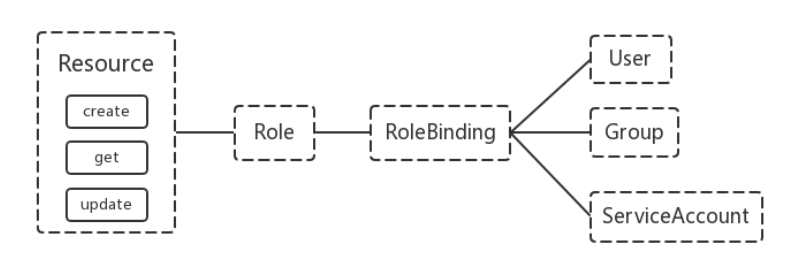

## 机制说明

Kubernetes 作为一个分布式集群的管理工具，保证集群的安全性是其一个重要的任务。API Server 是集群内部各个组件通信的中介，也是外部控制的入口。所以 Kubernetes 的安全机制基本就是围绕保护 API Server 来设计的。Kubernetes 使用了认证（Authentication）、鉴权（Authorization）、准入控制（AdmissionControl）三步来保证API Server的安全


## Authentication

HTTP Token 认证：通过一个 Token 来识别合法用户

- HTTP Token 的认证是用一个很长的特殊编码方式的并且难以被模仿的字符串 - Token 来表达客户的一种方式。Token 是一个很长的很复杂的字符串，每一个 Token 对应一个用户名存储在 API Server 能访问的文件中。当客户端发起 API 调用请求时，需要在 

HTTP Header 里放入 TokenHTTP Base 认证：通过用户名+密码的方式认证

- 用户名+：+密码用 BASE64 算法进行编码后的字符串放在 HTTP Request 中的 HeatherAuthorization 域里发送给服务端，服务端收到后进行编码，获取用户名及密码

最严格的 HTTPS 证书认证：基于 CA 根证书签名的客户端身份认证方式

### 1、HTTPS 证书认证:


### 2、需要认证的节点


两种类型

- Kubenetes 组件对 API Server 的访问：kubectl、Controller Manager、Scheduler、kubelet、kube-proxy
- Kubernetes 管理的 Pod 对容器的访问：Pod（dashborad 也是以 Pod 形式运行）

安全性说明

- Controller Manager、Scheduler 与 API Server 在同一台机器，所以直接使用 API Server 的非安全端口访问，--insecure-bind-address=127.0.0.1
- kubectl、kubelet、kube-proxy 访问 API Server 就都需要证书进行 HTTPS 双向认证

证书颁发

- 手动签发：通过 k8s 集群的跟 ca 进行签发 HTTPS 证书
- 自动签发：kubelet 首次访问 API Server 时，使用 token 做认证，通过后，Controller Manager 会为kubelet 生成一个证书，以后的访问都是用证书做认证了

### 3、kubeconfig

kubeconfig 文件包含集群参数（CA证书、API Server地址），客户端参数（上面生成的证书和私钥），集群context 信息（集群名称、用户名）。Kubenetes 组件通过启动时指定不同的 kubeconfig 文件可以切换到不同的集群

### 4、ServiceAccount

Pod中的容器访问API Server。因为Pod的创建、销毁是动态的，所以要为它手动生成证书就不可行了。Kubenetes使用了Service Account解决Pod 访问API Server的认证问题

### 5、Secret 与 SA 的关系

Kubernetes 设计了一种资源对象叫做 Secret，分为两类，一种是用于 ServiceAccount 的 service-account-token，另一种是用于保存用户自定义保密信息的 Opaque。ServiceAccount 中用到包含三个部分：

- token、ca.crt、namespacetoken是使用 API Server 私钥签名的 JWT。用于访问API Server时，Server端认证
- ca.crt，根证书。用于Client端验证API Server发送的证书
- namespace, 标识这个service-account-token的作用域名空间

```bash
kubectl get secret -A
kubectl describe secret default-token-g2fdj -n sso
```

默认情况下，每个 namespace 都会有一个 ServiceAccount，如果 Pod 在创建时没有指定 ServiceAccount，就会使用 Pod 所属的 namespace 的 ServiceAccount


## Authorization

上面认证过程，只是确认通信的双方都确认了对方是可信的，可以相互通信。而鉴权是确定请求方有哪些资源的权限。API Server 目前支持以下几种授权策略（通过 API Server 的启动参数 “--authorization-mode” 设置）

- AlwaysDeny：表示拒绝所有的请求，一般用于测试
- AlwaysAllow：允许接收所有请求，如果集群不需要授权流程，则可以采用该策略
- ABAC（Attribute-Based Access Control）：基于属性的访问控制，表示使用用户配置的授权规则对用户请求进行匹配和控制
- Webbook：通过调用外部 REST 服务对用户进行授权
- RBAC（Role-Based Access Control）：基于角色的访问控制，现行默认规则

### RBAC 授权模式

RBAC是基于角色的访问控制 (Role-Based Access Control) 在RBAC中，权限与角色相关联。Kubernetes 基于角色的访问控制使用rbac.authorization.k8s.io API组来实现权限控制，RBAC允许管理员通过Kubernetes API动态的配置权限策略。如果需要开启RBAC授权需要在apiserver组件中指定--authorization-mode=Node,RBAC;在 Kubernetes 1.5 中引入，现行版本成为默认标准。相对其它访问控制方式，拥有以下优势：

- 对集群中的资源和非资源均拥有完整的覆盖
- 整个 RBAC 完全由几个 API 对象完成，同其它 API 对象一样，
- 可以用 kubectl 或 API 进行操作可以在运行时进行调整，无需重启 API Server

**RBAC 的 API 资源对象说明**

RBAC 引入了 4 个新的顶级资源对象：Role、ClusterRole、RoleBinding、ClusterRoleBinding，4 种对象类型均可以通过 kubectl 与 API 操作



需要注意的是 Kubenetes 并不会提供用户管理，那么 User、Group、ServiceAccount 指定的用户又是从哪里来的呢？ Kubenetes 组件（kubectl、kube-proxy）或是其他自定义的用户在向 CA 申请证书时，需要提供一个证书请求文件

```yaml
{
  "CN": "admin",
  "hosts": [],
  "key": {
    "algo": "rsa",
    "size": 2048  
    },
  "names": [    
    {
      "C": "CN",
      "ST": "HangZhou",
      "L": "XS",
      "O": "system:masters",
      "OU": "System"    
     }  
   ]
}
```

API Server会把客户端证书的CN字段作为User，把names.O字段作为Groupkubelet 使用 TLS Bootstaping 认证时，API Server 可以使用 Bootstrap Tokens 或者 Token authenticationfile 验证=token，无论哪一种，Kubenetes 都会为 token 绑定一个默认的 User 和 GroupPod使用，ServiceAccount 认证时，service-account-token 中的 JWT 会保存 User 信息有了用户信息，再创建一对角色/角色绑定(集群角色/集群角色绑定)资源对象，就可以完成权限绑定了

**这里我们需要明确三个RBAC最基本的概念**

- Role: 角色，它定义了一组规则，定义了一组对Kubernetes API对象的操作权限
- Subject: 被作用者，既可以是”人”，也可以是机器，当然也可以是我们Kubernetes中定义的用户(ServiceAccount主要负责kubernetes内置用户)
- RoleBinding: 定义了”被作用者”和”角色”的绑定关系

**RBAC API对象**

Kubernetes有一个很基本的特性就是它的所有资源都是模型化的API对象，允许执行CRUD(Create、Read、Update、Delete)操作。资源如下

- Pods
- ConfigMaps
- Deployments
- Nodes
- Secrets
- Namespaces

资源对象可能存在的操作有如下

- create
- get
- delete
- list
- update
- edit
- watch
- exec

这些资源和API Group进行关联，比如Pods属于Core API Group，而Deployment属于apps API Group，要在kubernetes中进行RBAC授权

### Role and ClusterRole

在 RBAC API 中，Role 表示一组规则权限，权限只会增加(累加权限)，不存在一个资源一开始就有很多权限而通过RBAC 对其进行减少的操作；Role 可以定义在一个 namespace 中，如果想要跨 namespace 则可以创建ClusterRole

```yaml
kind: Role
apiVersion: rbac.authorization.k8s.io/v1beta1
metadata:  
  namespace: default  
  name: pod-reader
rules:
- apiGroups: [""] # "" indicates the core API group  
  resources: ["pods"]  
  verbs: ["get", "watch", "list"]
```

ClusterRole 具有与 Role 相同的权限角色控制能力，不同的是 ClusterRole 是集群级别的，ClusterRole 可以用于:

- 集群级别的资源控制( 例如 node 访问权限 )
- 非资源型 endpoints( 例如/healthz访问 )
- 所有命名空间资源控制(例如 pods )

```yaml
kind: ClusterRole
apiVersion: rbac.authorization.k8s.io/v1beta1
metadata:
# "namespace" omitted since ClusterRoles are not namespaced  
  name: secret-reader
rules:
- apiGroups: [""]  
  resources: ["secrets"]  
  verbs: ["get","watch","list"]
```

类似的，Role对象的rules字段也可以进一步细化，可以只针对某一个具体权限对象进行设置;

```
rules:
- apiGroups: [""]
  resources: ["configmaps"]
  resourceNames: ["my-config"]
  verbs: ["get"]
```

上面的例子表示，这条规则的”被作用者”，只对my-config的configmap对象有权限进行get操作;

在Kubernetes中已经内置了很多个位系统保留的ClusterRole，它们的名字都是以system:开头。一般来说，这些内置的ClusterRole，是绑定给Kubernetes系统组件对应的ServiceAccount使用

```bash
[root@m1 ~]# kubectl get clusterroles
NAME                                                       CREATED AT
admin                                                     2020-05-04T04:03:39Z
cluster-admin                                             2020-05-04T04:03:39Z
edit                                                      2020-05-04T04:03:39Z
...
view                                                      2020-05-04T04:03:39Z
```

此外，Kubernetes还提供了四个预先定义好的ClusterRole来提供用户直接使用

- cluster-admin
- admin
- edit
- view

其中cluster-admin角色，对应的是整个Kubernetes项目中最高权限(verbs=*)

```bash
[root@abcdocker sa-test]# kubectl describe clusterrole cluster-admin -n kube-system
Name:         cluster-admin
Labels:       kubernetes.io/bootstrapping=rbac-defaults
Annotations:  rbac.authorization.kubernetes.io/autoupdate: true
PolicyRule:
  Resources  Non-Resource URLs  Resource Names  Verbs
  ---------  -----------------  --------------  -----
  *.*        []                 []              [*]
             [*]                []              [*]
```

### RoleBinding and ClusterRoleBinding

RoloBinding 可以将角色中定义的权限授予用户或用户组，RoleBinding 包含一组权限列表(subjects)，权限列表中包含有不同形式的待授予权限资源类型(users, groups, or service accounts)；RoloBinding 同样包含对被Bind 的 Role 引用；RoleBinding 适用于某个命名空间内授权，而 ClusterRoleBinding 适用于集群范围内的授权将 default 命名空间的pod-reader Role 授予 jane 用户，此后 jane 用户在 default 命名空间中将具有pod-reader的权限

```yaml
kind: RoleBinding
apiVersion: rbac.authorization.k8s.io/v1beta1
metadata:  
  name: read-pods  
  namespace: default
subjects:
- kind: User  
  name: jane  
  apiGroup: rbac.authorization.k8s.io
roleRef:  
  kind: Role  
  name: pod-reader  
  apiGroup: rbac.authorization.k8s.io
```

RoleBinding 同样可以引用 ClusterRole 来对当前 namespace 内用户、用户组或 ServiceAccount 进行授权，这种操作允许集群管理员在整个集群内定义一些通用的 ClusterRole，然后在不同的 namespace 中使用RoleBinding 来引用

例如，以下 RoleBinding 引用了一个 ClusterRole，这个 ClusterRole 具有整个集群内对 secrets 的访问权限；但是其授权用户dave只2能访问 development 空间中的 secrets(因为 RoleBinding 定义在 development 命名空间)

```yaml
# This role binding allows "dave" to read secrets in the "development" namespace.
kind: RoleBinding
apiVersion: rbac.authorization.k8s.io/v1beta1
metadata:
  name: read-secrets  
  namespace: development # This only grants permissions within the "development" namespace.
subjects:
  - kind: User  
    name: dave  
    apiGroup: rbac.authorization.k8s.io
roleRef:  
  kind: ClusterRole  
  name: secret-reader  
  apiGroup: rbac.authorization.k8s.io
```

使用 ClusterRoleBinding 可以对整个集群中的所有命名空间资源权限进行授权；以下 ClusterRoleBinding 样例展示了授权 manager 组内所有用户在全部命名空间中对 secrets 进行访问

```yaml
# This cluster role binding allows anyone in the "manager" group to read secrets in anynamespace.kind: ClusterRoleBindingapiVersion: rbac.authorization.k8s.io/v1beta1metadata:    name: read-secrets-globalsubjects:- kind: Group    name: manager    apiGroup: rbac.authorization.k8s.ioroleRef:    kind: ClusterRole    name: secret-reader    apiGroup: rbac.authorization.k8s.io
```

### Resources

Kubernetes 集群内一些资源一般以其名称字符串来表示，这些字符串一般会在 API 的 URL 地址中出现；同时某些资源也会包含子资源，例如 logs 资源就属于 pods 的子资源，API 中 URL 样例如下

```bash
GET /api/v1/namespaces/{namespace}/pods/{name}/log
```

如果要在 RBAC 授权模型中控制这些子资源的访问权限，可以通过 / 分隔符来实现，以下是一个定义 pods 资资源logs 访问权限的 Role 定义样例

```yaml
kind: RoleapiVersion: rbac.authorization.k8s.io/v1beta1metadata:    namespace: default    name: pod-and-pod-logs-readerrules:- apiGroups: [""]    resources: ["pods/log"]    verbs: ["get","list"]
```

### Subjects

RoleBinding 和 ClusterRoleBinding 可以将 Role 绑定到 Subjects；Subjects 可以是 groups、users 或者service accounts;Subjects 中 Users 使用字符串表示，它可以是一个普通的名字字符串，如 “alice”；也可以是 email 格式的邮箱地址，如 “test@163.com”；甚至是一组字符串形式的数字 ID 。但是 Users 的前缀 system: 是系统保留的，集群管理员应该确保普通用户不会使用这个前缀格式;Groups 书写格式与 Users 相同，都为一个字符串，并且没有特定的格式要求；同样 system: 前缀为系统保留


### 常见角色示例

**（1）允许读取核心API组的Pod资源**

```text
rules:- apiGroups: [""]  resources: ["pods"]  verbs: ["get","list","watch"]
```

**（2）允许读写extensions和apps两个API组中的deployment资源**

```text
rules:- apiGroups: ["extensions","apps"]  resources: ["deployments"]  verbs: ["get","list","watch","create","update","patch","delete"]
```

**（3）允许读取Pod以及读写job信息**

```text
rules:- apiGroups: [""]  resources: ["pods"]  verbs: ["get","list","watch"]、- apiVersion: ["batch","extensions"]  resources: ["jobs"]  verbs: ["get","list","watch","create","update","patch","delete"]
```

**（4）允许读取一个名为my-config的ConfigMap（必须绑定到一个RoleBinding来限制到一个Namespace下的ConfigMap）：**

```text
rules:- apiGroups: [""]  resources: ["configmap"]  resourceNames: ["my-configmap"]  verbs: ["get"]
```

**（5）读取核心组的Node资源（Node属于集群级的资源，所以必须存在于ClusterRole中，并使用ClusterRoleBinding进行绑定）：**

```text
rules:- apiGroups: [""]  resources: ["nodes"]  verbs: ["get","list","watch"]
```

**（6）允许对非资源端点“/healthz”及其所有子路径进行GET和POST操作（必须使用ClusterRole和ClusterRoleBinding）：**

```text
rules:- nonResourceURLs: ["/healthz","/healthz/*"]  verbs: ["get","post"]
```

### **常见的角色绑定示例**

**（1）用户名alice**

```text
subjects:- kind: User  name: alice  apiGroup: rbac.authorization.k8s.io
```

**（2）组名alice**

```text
subjects:- kind: Group  name: alice  apiGroup: rbac.authorization.k8s.io
```

**（3）kube-system命名空间中默认Service Account**

```text
subjects:- kind: ServiceAccount  name: default  namespace: kube-system
```

**（4）qa命名空间中的所有Service Account：**

```text
subjects:- kind: Group  name: systeml:serviceaccounts:qa  apiGroup: rbac.authorization.k8s.io
```

**（5）所有Service Account**

```text
subjects:- kind: Group  name: system:serviceaccounts  apiGroup: rbac.authorization.k8s.io
```

**（6）所有认证用户**

```text
subjects:- kind: Group  name: system:authenticated  apiGroup: rbac.authorization.k8s.io
```

**（7）所有未认证用户**

```text
subjects:- kind: Group  name: system:unauthenticated  apiGroup: rbac.authorization.k8s.io
```

**（8）全部用户**

```text
subjects:- kind: Group  name: system:authenticated  apiGroup: rbac.authorization.k8s.io- kind: Group  name: system:unauthenticated  apiGroup: rbac.authorization.k8s.io
```


### **对Service Account的授权管理**

Service Account也是一种账号，是给运行在Pod里的进程提供了必要的身份证明。需要在Pod定义中指明引用的Service Account，这样就可以对Pod的进行赋权操作。例如：pod内可获取rbac命名空间的所有Pod资源，pod-reader-sc的Service Account是绑定了名为pod-read的Role

```text
apiVersion: v1kind: Podmetadata:  name: nginx  namespace: rbacspec:  serviceAccountName: pod-reader-sc  containers:  - name: nginx    image: nginx    imagePullPolicy: IfNotPresent    ports:    - containerPort: 80
```

默认的RBAC策略为控制平台组件、节点和控制器授予有限范围的权限，但是除kube-system外的Service Account是没有任何权限的。

**（1）为一个应用专属的Service Account赋权**

此应用需要在Pod的spec中指定一个serviceAccountName，用于API、Application Manifest、kubectl create serviceaccount等创建Service Account的命令。

例如为my-namespace中的my-sa Service Account授予只读权限

```text
kubectl create rolebinding my-sa-view --clusterrole=view --serviceaccount=my-namespace:my-sa --namespace=my-namespace
```

**（2）为一个命名空间中名为default的Service Account授权**

如果一个应用没有指定 serviceAccountName，则会使用名为default的Service Account。注意，赋予Service Account “default”的权限会让所有没有指定serviceAccountName的Pod都具有这些权限

例如，在my-namespace命名空间中为Service Account“default”授予只读权限：

```text
kubectl create rolebinding default-view --clusterrole=view --serviceaccount=my-namespace:default --namespace=my-namespace
```

另外，许多系统级Add-Ons都需要在kube-system命名空间中运行，要让这些Add-Ons能够使用超级用户权限，则可以把cluster-admin权限赋予kube-system命名空间中名为default的Service Account，这一操 作意味着kube-system命名空间包含了通向API超级用户的捷径。

```text
kubectl create clusterrolebinding add-ons-add-admin --clusterrole=cluster-admin --serviceaccount=kube-system:default
```

**（3）为命名空间中所有Service Account都授予一个角色**

如果希望在一个命名空间中，任何Service Account应用都具有一个角色，则可以为这一命名空间的Service Account群组进行授权

```text
kubectl create rolebinding serviceaccounts-view --clusterrole=view --group=system:serviceaccounts:my-namespace --namespace=my-namespace
```

**（4）为集群范围内所有Service Account都授予一个低权限角色**

如果不想为每个命名空间管理授权，则可以把一个集群级别的角色赋给所有Service Account。

```text
kubectl create clusterrolebinding serviceaccounts-view --clusterrole=view --group=system:serviceaccounts
```

**（5）为所有Service Account授予超级用户权限**

```text
kubectl create clusterrolebinding serviceaccounts-view --clusterrole=cluster-admin --group=system:serviceaccounts
```


### **使用kubectl命令行工具创建资源对象**

**（1）在命名空间rbac中为用户es授权admin ClusterRole：**

```text
kubectl create rolebinding bob-admin-binding --clusterrole=admin --user=es --namespace=rbac
```

**（2）在命名空间rbac中为名为myapp的Service Account授予view ClusterRole：**

```text
kubctl create rolebinding myapp-role-binding --clusterrole=view --serviceaccount=acme:myapp --namespace=rbac
```

**（3）在全集群范围内为用户root授予cluster-admin ClusterRole：**

```text
kubectl create clusterrolebinding cluster-binding --clusterrole=cluster-admin --user=root
```

**（4）在全集群范围内为名为myapp的Service Account授予view ClusterRole：**

```text
kubectl create clusterrolebinding service-account-binding --clusterrole=view --serviceaccount=acme:myapp
```


### 实践：创建一个用户只能管理 dev 空间

下载证书生成工具

```bash
wget https://pkg.cfssl.org/R1.2/cfssl_linux-amd64 -O /usr/local/bin/cfsslwget https://pkg.cfssl.org/R1.2/cfssljson_linux-amd64 -O /usr/local/bin/cfssljsonchmod +x /usr/local/bin/cfssl /usr/local/bin/cfssljson
```

生成ca证书

```bash
cd /etc/kubernetes/pkicat >ca-config.json << EOF{"signing":{"default":{"expiry":"87600h"},"profiles":{"kubernetes":{"usages":["signing","key encipherment","server auth","client auth"],"expiry":"87600h"}}}}EOF
```

颁发证书

```bash
cat > devuser-csr.json <<EOF {"CN":"devuser","key":{"algo":"rsa","size":2048},"names":[{"C":"CN","ST":"BeiJing","L":"BeiJing","O":"System","OU":"k8s"}]}EOFcfssl gencert -ca=ca.pem -ca-key=ca-key.pem -config=ca-config.json -profile=kubernetes devuser-csr.json|cfssljson -bare devuser
```

创建namespace 

```
kubectl create namespace dev
```

设置集群参数

```bash
export KUBE_APISERVER="https://10.0.0.150:8443"kubectl config set-cluster kubernetes --certificate-authority=ca.pem --embed-certs=true --server=${KUBE_APISERVER} --kubeconfig=../devuser.kubeconfig
```

设置客户端认证参数

```bash
kubectl config set-credentials devuser --client-certificate=devuser.pem --client-key=devuser-key.pem --embed-certs=true --kubeconfig=../devuser.kubeconfig
```

设置上下文参数

```bash
kubectl config set-context kubernetes --cluster=kubernetes --user=devuser --namespace=dev --kubeconfig=../devuser.kubeconfig
```

 设置默认上下文

```bash
kubectl config use-context kubernetes --kubeconfig=../devuser.kubeconfig
```

配置kebectl连接配置

```bash
mkdir -p /home/dev/.kubecp devuser.kubeconfig /home/dev/.kube/configchown dev. /home/dev/.kube/config
```

Role

```yaml
cat << EOF >dev-Role.yamlkind: RoleapiVersion: rbac.authorization.k8s.io/v1beta1metadata:     name: dev-reader  namespace: devrules:- apiGroups: [""] # "" indicates the core API group    resources: ["pods"]    verbs: ["get", "watch", "list","create"]EOFkubectl apply -f dev-Role.yaml
```

RoleBinding

```yaml
cat << EOF >dev-RoleBinding.yamlkind: RoleBindingapiVersion: rbac.authorization.k8s.io/v1beta1metadata:    name: dev-RoleBind    namespace: devsubjects:- kind: User    name: devuser    apiGroup: rbac.authorization.k8s.ioroleRef:    kind: Role    name: dev-reader    apiGroup: rbac.authorization.k8s.ioEOFkubectl apply -f dev-RoleBinding.yaml
```

测试

```yaml
cat << EOF >test.yamlapiVersion: v1kind: Podmetadata:    name: myapp-pod  namespace: dev  labels:        app: myappspec:    containers:    - name: myapptest        image: wangyanglinux/myapp:v1    imagePullPolicy: IfNotPresentEOFkubectl apply -f test.yaml
```

```bash
[dev@m1 ~]$ kubectl get pod -n devNAME        READY   STATUS    RESTARTS   AGEmyapp-pod   1/1     Running   0          3s
```


## AdmissionControl

准入控制是API Server的插件集合，通过添加不同的插件，实现额外的准入控制规则。甚至于API Server的一些主要的功能都需要通过 Admission Controllers 实现，比如 ServiceAccount官方文档上有一份针对不同版本的准入控制器推荐列表，其中最新的 1.14 的推荐列表是：

```
NamespaceLifecycle,LimitRanger,ServiceAccount,DefaultStorageClass,DefaultTolerationSeconds,MutatingAdmissionWebhook,ValidatingAdmissionWebhook,ResourceQuota
```

列举几个插件的功能：

- NamespaceLifecycle：防止在不存在的 namespace 上创建对象，防止删除系统预置 namespace，删除namespace 时，连带删除它的所有资源对象。
- LimitRanger：确保请求的资源不会超过资源所在 Namespace 的 LimitRange 的限制。
- ServiceAccount：实现了自动化添加 ServiceAccount。
- ResourceQuota：确保请求的资源不会超过资源的 ResourceQuota 限制。

