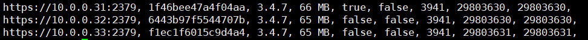

ETCD是一个高可用的分布式Key/Value存储系统。它使用Raft算法，通过选举来保持集群内各节点状态的一致性。虽然ETCD具有高可用的特点，但是也无法避免多个节点宕机，甚至全部宕机的情况发生。如何快速的恢复集群，就变得格外重要。本文将介绍在日常工作中，遇到的ETCD集群常见问题的处理方法。

# etcd数据备份与恢复验证

## 一、单机

说明：执行etcd备份数据的恢复的机器必须和原先etcd所在机器一致

### 1、单机备份

```bash
etcdctl --cacert=/etc/kubernetes/pki/peer-ca.pem \
--cert=/etc/kubernetes/pki/etcd.pem \
--key=/etc/kubernetes/pki/etcd-key.pem \
--endpoints="https://10.0.0.31:2379" \
snapshot save snapshot.db
```

### 2、单机数据恢复

停止etcd服务

```bash
systemctl stop etcd
```

使用ETCDCTL API 3

```bash
export ETCDCTL_API=3
```

恢复数据

```bash
etcdctl  snapshot restore snapshot.db \
--name=etcd01 \
--data-dir=/data/etcd/data \
--initial-advertise-peer-urls=https://10.0.0.31:2380 \
--initial-cluster etcd01=https://10.0.0.31:2380 \
--initial-cluster-token=etcd-cluster \
--cacert=/etc/kubernetes/ssl/peer-ca.pem \
--cert=/etc/etcd/ssl/etcd.pem \
--key=/etc/etcd/ssl/etcd-key.pem
```

启动服务

```bash
systemctl start etcd
```

## 二、集群

### 1、模拟写入数据到Etcd集群

使用API 3写入数据库

```bash
etcdctl --cacert=/etc/kubernetes/pki/peer-ca.pem \
--cert=/etc/kubernetes/pki/etcd.pem \
--key=/etc/kubernetes/pki/etcd-key.pem \
--endpoints="https://10.0.0.31:2379,https://10.0.0.32:2379,https://10.0.0.33:2379" \
put /name/1 test
```

读取数据

```bash
etcdctl --cacert=/etc/kubernetes/pki/peer-ca.pem \
--cert=/etc/kubernetes/pki/etcd.pem \
--key=/etc/kubernetes/pki/etcd-key.pem \
--endpoints="https://10.0.0.31:2379,https://10.0.0.32:2379,https://10.0.0.33:2379" \
get  /name/1
```

使用API 2写入数据库

```bash
ETCDCTL_API=2 etcdctl --ca-file /etc/kubernetes/pki/peer-ca.pem \
--cert-file /etc/kubernetes/pki/etcd.pem \
--key-file /etc/kubernetes/pki/etcd-key.pem \
--endpoints="https://10.0.0.31:2379,https://10.0.0.32:2379,https://10.0.0.33:2379" \
set /name1 test01
```

读取API 2写入数据

```bash
ETCDCTL_API=2 etcdctl --ca-file /etc/kubernetes/pki/peer-ca.pem \
--cert-file /etc/kubernetes/pki/etcd.pem \
--key-file /etc/kubernetes/pki/etcd-key.pem \
--endpoints="https://10.0.0.31:2379,https://10.0.0.32:2379,https://10.0.0.33:2379" \
get /name1
```

### 2、备份etcd数据

```bash
etcdctl --cacert=/etc/kubernetes/pki/peer-ca.pem \
--cert=/etc/kubernetes/pki/etcd.pem \
--key=/etc/kubernetes/pki/etcd-key.pem \
--endpoints="https://10.0.0.31:2379" \
snapshot save mysnapshot.db
```

### 3、停止etcd集群

查看状态

```bash
etcdctl --cacert=/etc/kubernetes/pki/peer-ca.pem \
--cert=/etc/kubernetes/pki/etcd.pem \
--key=/etc/kubernetes/pki/etcd-key.pem \
--endpoints="https://10.0.0.31:2379,https://10.0.0.32:2379,https://10.0.0.33:2379" \
endpoint status
```

停止方法：分别在3台etcd的宿主机上执行以下命令停止etcd服务

```bash
systemctl stop etcd
```

停掉Leader 10.0.0.33， 查看集群状况，重新选举出了leader，集群可正常使用

```bash
etcdctl --cacert=/etc/kubernetes/pki/peer-ca.pem \
--cert=/etc/kubernetes/pki/etcd.pem \
--key=/etc/kubernetes/pki/etcd-key.pem \
--endpoints="https://10.0.0.31:2379,https://10.0.0.32:2379,https://10.0.0.33:2379" \
endpoint status --write-out=table

Failed to get the status of endpoint https://10.0.0.33:2379 (context deadline exceeded)
+------------------------+------------------+---------+---------+-----------+------------+-----------+------------+
|        ENDPOINT        |        ID        | VERSION | DB SIZE | IS LEADER | IS LEARNER | RAFT TERM | RAFT INDEX | 
+------------------------+------------------+---------+---------+-----------+------------+-----------+------------+
| https://10.0.0.31:2379 | 1f46bee47a4f04aa |   3.4.7 |   66 MB |      true |      false |      3941 |   29854802 |         
| https://10.0.0.32:2379 | 6443b97f5544707b |   3.4.7 |   65 MB |     false |      false |      3941 |   29854802 |           
+------------------------+------------------+---------+---------+-----------+------------+-----------+------------+
```

停掉10.0.0.32，查看集群状况，集群已经无法正常使用，说明3节点的Etcd容错为1

```bash
etcdctl --cacert=/etc/kubernetes/pki/peer-ca.pem \
--cert=/etc/kubernetes/pki/etcd.pem \
--key=/etc/kubernetes/pki/etcd-key.pem \
--endpoints="https://10.0.0.31:2379,https://10.0.0.32:2379,https://10.0.0.33:2379" \
endpoint status --write-out=table

Failed to get the status of endpoint https://10.0.0.32:2379 (context deadline exceeded)
Failed to get the status of endpoint https://10.0.0.33:2379 (context deadline exceeded)
+------------------------+------------------+---------+---------+-----------+------------+-----------+------------+
|        ENDPOINT        |        ID        | VERSION | DB SIZE | IS LEADER | IS LEARNER | RAFT TERM | RAFT INDEX | 
+------------------------+------------------+---------+---------+-----------+------------+-----------+------------+
| https://10.0.0.31:2379 | 1f46bee47a4f04aa |   3.4.7 |   66 MB |     false |      false |      3941 |   29854802 |         
+------------------------+------------------+---------+---------+-----------+------------+-----------+------------+
```

删除etcd数据，方法：登录etcd所在主机执行：(注意：危险操作，请谨慎操作，确保在有数据备份并且确定Etcd集群无法正常工作后操作)

```bash
rm -rf /data/etcd/data
```

### 4、使用备份数据进行恢复

将etcd数据文件分发给etcd主机，方便恢复数据

恢复10.0.0.31节点数据

```bash
etcdctl  snapshot restore mysnapshot.db \
--name=etcd01 \
--data-dir=/data/etcd/data \
--initial-advertise-peer-urls=https://10.0.0.31:2380 \
--initial-cluster etcd01=https://10.0.0.31:2380,etcd02=https://10.0.0.32:2380,etcd03=https://10.0.0.33:2380 \
--initial-cluster-token=etcd-cluster
```

恢复10.0.0.32节点数据

```bash
etcdctl  snapshot restore mysnapshot.db \
--name=etcd02 \
--data-dir=/data/etcd/data \
--initial-advertise-peer-urls=https://10.0.0.32:2380 \
--initial-cluster etcd01=https://10.0.0.31:2380,etcd02=https://10.0.0.32:2380,etcd03=https://10.0.0.33:2380 \
--initial-cluster-token=etcd-cluster
```

恢复10.0.0.33节点数据

```bash
etcdctl  snapshot restore mysnapshot.db \
--name=etcd03 \
--data-dir=/data/etcd/data \
--initial-advertise-peer-urls=https://10.0.0.33:2380 \
--initial-cluster etcd01=https://10.0.0.31:2380,etcd02=https://10.0.0.32:2380,etcd03=https://10.0.0.33:2380 \
--initial-cluster-token=etcd-cluster
```

### 5、启动Etcd服务

分别在etcd所在主机执行如下命令：

```bash
systemctl start etcd
```

### 6、验证数据完整性

查看API 2写入数据

```bash
ETCDCTL_API=2 etcdctl --ca-file /etc/kubernetes/pki/peer-ca.pem \
--cert-file /etc/kubernetes/pki/etcd.pem \
--key-file /etc/kubernetes/pki/etcd-key.pem \
--endpoints="https://10.0.0.31:2379,https://10.0.0.32:2379,https://10.0.0.33:2379" \
get /name1
```

查看API 3写入数据

```bash
etcdctl --cacert=/etc/kubernetes/pki/peer-ca.pem \
--cert=/etc/kubernetes/pki/etcd.pem \
--key=/etc/kubernetes/pki/etcd-key.pem \
--endpoints="https://10.0.0.31:2379,https://10.0.0.32:2379,https://10.0.0.33:2379" \
get  /name/1
```

经过验证，使用ETCDCTL_API=2 存放的数据会丢失，使用ETCDCTL_API=3存放的数据能正常恢复,etcd v2 和 v3 的数据不能混合存放

**若使用 v3 备份数据时存在 v2 的数据则不影响恢复
若使用 v2 备份数据时存在 v3 的数据则恢复失败**

### 7、 API 2 备份与恢复方法

etcd的数据默认会存放在我们的命令工作目录中，我们发现数据所在的目录，会被分为两个文件夹中：

- snap: 存放快照数据,etcd防止WAL文件过多而设置的快照，存储etcd数据状态。
- wal: 存放预写式日志,最大的作用是记录了整个数据变化的全部历程。在etcd中，所有数据的修改在提交前，都要先写入到WAL中。

```bash
#备份 
ETCDCTL_API=2 etcdctl backup --data-dir /data/etcd/data --backup-dir etcd_backup
#恢复
# ETCDCTL_API=2 etcd -data-dir=etcd_backup -force-new-cluster
```

恢复时会覆盖 snapshot 的元数据(member ID 和 cluster ID)，所以需要启动一个新的集群

#  三、ETCD常见问题

由于ETCD集群需要选举产生leader，所以集群节点数目需要为奇数来保证正常进行选举。而集群节点的数量并不是越多越好，过多的节点会导致集群同步的时间变长，使得leader写入的效率降低。我们线上的ETCD集群由三个节点组成(即宕机一台，集群可正常工作)，并开启了认证。以下是日常运维工作中，遇到问题的处理过程。

## 1、集群一个节点宕机的恢复步骤

一个节点宕机，并不会影响整个集群的正常工作。此时可通过以下几步恢复集群：

### 1）在正常节点上查看集群状态并摘除异常节点

```
etcdctl --cacert=/etc/kubernetes/pki/peer-ca.pem \
--cert=/etc/kubernetes/pki/etcd.pem \
--key=/etc/kubernetes/pki/etcd-key.pem \
--endpoints="https://10.0.0.31:2379,https://10.0.0.32:2379,https://10.0.0.33:2379" endpoint status
```



### 2）摘除异常节点

```
etcdctl --cacert=/etc/kubernetes/pki/peer-ca.pem \
--cert=/etc/kubernetes/pki/etcd.pem \
--key=/etc/kubernetes/pki/etcd-key.pem \
member remove f1ec1f6015c9d4a4
```

### 3）重新部署服务后，将节点重新加入集群

- 由于ETCD集群证书依赖于服务器IP，为避免重新制作证书，需要保持节点IP不变。在部署好节点上服务后，先不要启动。

- 删除新增成员的旧数据目录，更改相关配置需将原etcd服务的旧数据目录删除，否则etcd会无法正常启动。将节点重新加入集群（name要与配置文件的--name一致）

  ```
  etcdctl --cacert=/etc/kubernetes/pki/peer-ca.pem \
  --cert=/etc/kubernetes/pki/etcd.pem \
  --key=/etc/kubernetes/pki/etcd-key.pem \
  --endpoints="https://10.0.0.31:2379,https://10.0.0.32:2379,https://10.0.0.33:2379" \
  member add etcd03 --peer-urls=https://10.0.0.33:2380
  ```

  此时查看集群状态，新加入的节点状态为unstarted

- 新增节点是加入已有集群，所以需要修改配置

  ```bash
  --initial-cluster-state=existing
  ```

- 启动服务 检测集群是否正常

  ```bash
  systemctl daemon-reload
  systemctl restart etcd.service
  ```

查看集群状态，若三台都正常，集群恢复。

## 2、集群超过半数节点宕机的恢复步骤

此时集群处于无法正常工作的状态，需要尽快恢复。若机器宕机重启，IP保持不变，则证书无需重新生成；若IP更换，则还需重新生成证书。集群恢复需要使用ETCD的备份数据(使用etcdctl snapshot save命令备份)，或者从ETCD数据目录复制snap/db文件。以下是恢复步骤：

### 1）将备份数据恢复至集群

- 集群部署完成后，先不启动ETCD服务，并将原有ETCD数据目录删除依次在三台节点上执行恢复数据的命令

  ```bash
  etcdctl  snapshot restore mysnapshot.db \
  --name=etcd01 \
  --data-dir=/data/etcd/data \
  --initial-advertise-peer-urls=https://10.0.0.31:2380 \
  --initial-cluster etcd01=https://10.0.0.31:2380,etcd02=https://10.0.0.32:2380,etcd03=https://10.0.0.33:2380 \
  --initial-cluster-token=etcd-cluster
  ```

### 2）启动ETCD服务，检查集群状态

```bash
systemctl start etcd
```

## 3、 database space exceeded报错恢复步骤

从报错的字面意思来看，是超出数据库空间导致。查看集群此时各节点的状态，发现DB SIZE为2.1GB。ETCD官方文档说明(https://etcd.io/docs/v3.3.12/dev-guide/limit/)提到ETCD默认的存储大小是2GB。超出后，集群无法进行写入。以下为恢复步骤：

### 1）备份数据

```bash
etcdctl --cacert=/etc/kubernetes/pki/peer-ca.pem \
--cert=/etc/kubernetes/pki/etcd.pem \
--key=/etc/kubernetes/pki/etcd-key.pem \
--endpoints="https://10.0.0.31:2379" \
snapshot save mysnapshot.db
```

### 2）获取reversion

```bash
etcdctl --write-out="json" --cacert=/etc/kubernetes/pki/peer-ca.pem \
--cert=/etc/kubernetes/pki/etcd.pem \
--key=/etc/kubernetes/pki/etcd-key.pem \
--endpoints="https://10.0.0.31:2379,https://10.0.0.32:2379,https://10.0.0.33:2379" \
endpoint status |grep -o '"revision":[0-9]*'
```

### 3）compact

```bash
etcdctl --cacert=/etc/kubernetes/pki/peer-ca.pem \
--cert=/etc/kubernetes/pki/etcd.pem \
--key=/etc/kubernetes/pki/etcd-key.pem \
--endpoints="https://10.0.0.31:2379,https://10.0.0.32:2379,https://10.0.0.33:2379" \
compact $revision
```

### 4）defrag

```bash
etcdctl --cacert=/etc/kubernetes/pki/peer-ca.pem \
--cert=/etc/kubernetes/pki/etcd.pem \
--key=/etc/kubernetes/pki/etcd-key.pem \
--endpoints="https://10.0.0.31:2379,https://10.0.0.32:2379,https://10.0.0.33:2379" \
defrag
```

### 5）删除报警(必需****删除，否则集群仍然无法使用)

```bash
etcdctl --write-out="json" --cacert=/etc/kubernetes/pki/peer-ca.pem \
--cert=/etc/kubernetes/pki/etcd.pem \
--key=/etc/kubernetes/pki/etcd-key.pem \
--endpoints="https://10.0.0.31:2379,https://10.0.0.32:2379,https://10.0.0.33:2379" \
alarm disarm
```

以上就是对ETCD集群日常维护的总结，为了使服务更加稳定的运行，建议定时备份和压缩数据，并增加集群监控(与Prometheus配合使用)。