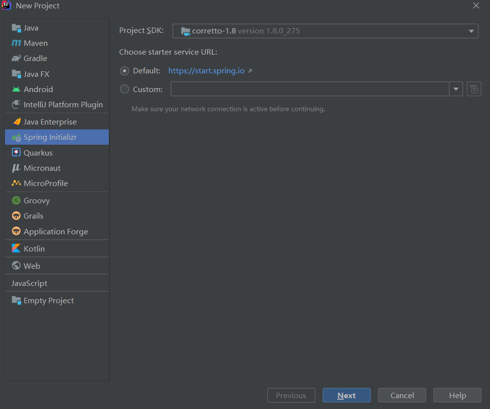
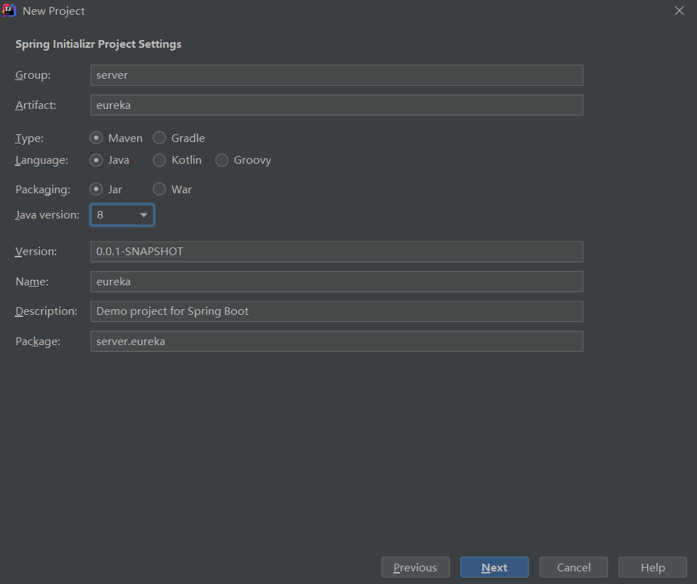
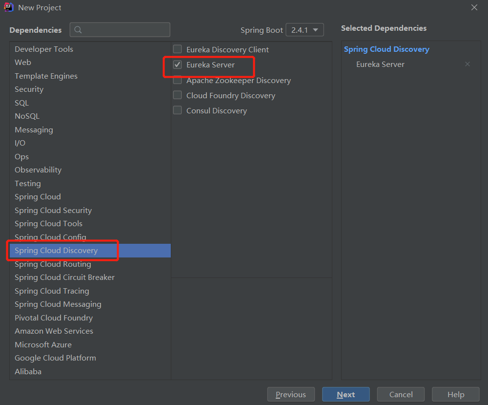
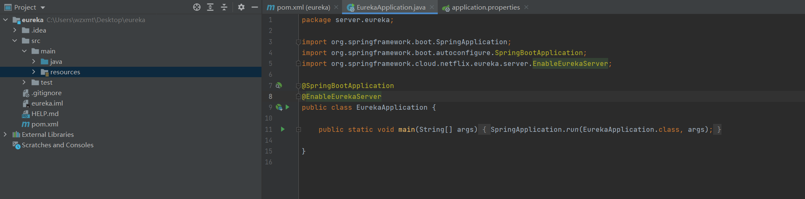
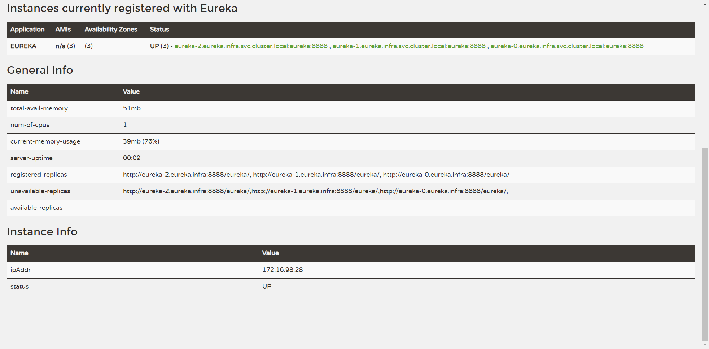

## 一、简介

​    Eureka 是 Netflix 开发的服务发现框架，本身是一个基于 REST 的服务。Eureka 包含 `Eureka Server` 和 `Eureka Client` 两个组件，Eureka Server 提供服务注册服务，Eureka Client 会将信息注册到 Eureka Server，然后各个 Eureka Client 间就能通过 Eureka Server 获取已经注册服务实例的节点位置信息和状态等信息。

​    SpringCloud 是一套非常火爆的微服务架构，它很多组件都需要 `Eureka Server` 充作注册中心来完成服务间负载均衡和维护服务列表信息等功能。Docker 是一个开源的应用容器引擎，让开发者可以打包他们的应用以及依赖包到一个可移植的镜像中，然后发布到任何流行的 Linux或Windows 机器上，也可以实现虚拟化。现在我们很多服务都是以 `Docker` 镜像方式运行在各个服务器上，并且依赖 `Kubernetes` 来对服务镜像进行编排，接下来要部署的 Eureka Server 也是要用 `StaetfulSet` 方式部署到 `Kubernetes` 中运行。

​    现阶段实际往 `Kubernetes` 中迁移的项目大多数都是之前未使用 Kubernetes 的项目，由于 `Kubernetes` 自己有一套服务发现、负载均衡机制（ETCD、CoreDNS、Service），所以觉得用 `Eureka` 来当注册中心就不能和 `Kubernetes` 的 `Service` 配合起来，也就不能使用过 `Kubernetes` 提供的负载能力，使之带来了开发的不便。当然，之前的老项目很多是基于 SpringCloud + 物理机部署方式部署的，迁移的原则就是减少重构开发量，故而对于一些老项目迁移到 `Kubernetes` 中的话，还是需要部署 `Eureka` 来避免大规模改动代码。

## 二、创建 Eureka Server 项目

引入 SpringBoot 做基础框架，引入 SprigCloud Eureka 依赖来实现 Eureka Server 功能。

### 1、新建工程

选择Spring Initializr,默认地址，或者修改为http://start.spring.io



### 2、配置工程信息



### 3 选择EurekaServer



加载完成，删除mvn文件和包,共3处


### 4 添加注解@EnableEurekaServer

启动类就是项目生成的第一个class文件,在该类名上加注解@EnableEurekaServer 就表明这个服务就是注册中心了…接下里去操作其他的步骤…当然注册中心服务也是靠这个类来启动,通过@EnableEurekaServer注解启动一个服务注册中心提供给其他应用进行对话



```java
package eurekaservice.eureka;

import org.springframework.boot.SpringApplication;
import org.springframework.boot.autoconfigure.SpringBootApplication;
import org.springframework.cloud.netflix.eureka.server.EnableEurekaServer; //增加这一行

@SpringBootApplication
@EnableEurekaServer //增加这一行

public class EurekaApplication {

    public static void main(String[] args) {
        SpringApplication.run(EurekaApplication.class, args);
    }
}
```

### 5、pom.xml

增加web 模块与actuator模块

```java
<?xml version="1.0" encoding="UTF-8"?>
<project xmlns="http://maven.apache.org/POM/4.0.0" xmlns:xsi="http://www.w3.org/2001/XMLSchema-instance"
         xsi:schemaLocation="http://maven.apache.org/POM/4.0.0 https://maven.apache.org/xsd/maven-4.0.0.xsd">
    <modelVersion>4.0.0</modelVersion>
    <parent>
        <groupId>org.springframework.boot</groupId>
        <artifactId>spring-boot-starter-parent</artifactId>
        <version>2.4.1</version>
        <relativePath/> <!-- lookup parent from repository -->
    </parent>
    <groupId>server</groupId>
    <artifactId>eureka</artifactId>
    <version>0.0.1-SNAPSHOT</version>
    <name>eureka</name>
    <description>Demo project for Spring Boot</description>

    <properties>
        <java.version>1.8</java.version>
        <spring-cloud.version>2020.0.0</spring-cloud.version>
    </properties>

    <dependencies>
        <dependency>
            <groupId>org.springframework.cloud</groupId>
            <artifactId>spring-cloud-starter-netflix-eureka-server</artifactId>
        </dependency>

        <!--web 模块 -->
        <dependency>
            <groupId>org.springframework.boot</groupId>
            <artifactId>spring-boot-starter-web</artifactId>
        </dependency>

        <!--actuator-->
        <dependency>
            <groupId>org.springframework.boot</groupId>
            <artifactId>spring-boot-starter-actuator</artifactId>
        </dependency>

        <dependency>
            <groupId>org.springframework.boot</groupId>
            <artifactId>spring-boot-starter-test</artifactId>
            <scope>test</scope>
        </dependency>
    </dependencies>

    <dependencyManagement>
        <dependencies>
            <dependency>
                <groupId>org.springframework.cloud</groupId>
                <artifactId>spring-cloud-dependencies</artifactId>
                <version>${spring-cloud.version}</version>
                <type>pom</type>
                <scope>import</scope>
            </dependency>
        </dependencies>
    </dependencyManagement>

    <build>
        <plugins>
            <!--maven-resources-plugin-->
            <plugin>
                <groupId>org.apache.maven.plugins</groupId>
                <artifactId>maven-resources-plugin</artifactId>
                <version>2.4.3</version>
            </plugin>
            <!---->
            
            <plugin>
                <groupId>org.springframework.boot</groupId>
                <artifactId>spring-boot-maven-plugin</artifactId>
            </plugin>
        </plugins>
    </build>

    <repositories>
        <repository>
            <id>spring-milestones</id>
            <name>Spring Milestones</name>
            <url>https://repo.spring.io/milestone</url>
        </repository>
    </repositories>

</project>
```

### 5、修改配置

默认设置下，该服务注册中心也会将自己作为客户端来尝试注册它自己，所以我们需要禁用它的客户端注册行为，只需要在application.properties中问增加如下配置：

```java
#注册中心名
spring.application.name=eureka-server
#服务注册中心端口号
server.port=8888
#程序的监控数据端口，这里主要用其中的/actuator/health 端口进行健康检查
management.server.port=9999
#程序的监控数据方式
management.endpoints.web.exposure.include=*
#触发自我保护机制的阀值配置信息时间
eureka.server.renewal-percent-threshold=0.9
#关闭保护机
eureka.server.enable-self-preservation=false
#扫描失效服务的间隔时间
eureka.server.eviction-interval-timer-in-ms=40000
#服务注册中心实例的主机名
eureka.instance.hostname=localhost
#是否向服务注册中心注册自己
eureka.instance.prefer-ip-address=false
#false表示不向注册中心注册自己
eureka.client.register-with-eureka=true
#false表示自己端就是注册中心，我的职责就是维护服务实例，并不需要去检索服务
eureka.client.fetch-registry=true
#服务注册中心的配置内容，指定服务注册中心的位置
eureka.client.serviceUrl.defaultZone=http://eureka-0.eureka.infra.svc.cluster.local:${server.port}/eureka,http://eureka-1.eureka.infra.svc.cluster.local:${server.port}/eureka,http://eureka-2.eureka.infra.svc.cluster.local:${server.port}/eureka
```

## 三、构建 Eureka Docker 镜像

### 1、执行 Maven 编译

执行 Maven(3.10) 命令将项目编译成一个可执行 JAR。

```bash
mvn clean package -Dmaven.test.skip=true
```

### 2、准备 Dockerfile

创建构建 Docker 镜像需要的 Dockerfile 文件，将 Maven 编译的 JAR 复制到镜像内部，然后设置三个变量，分别是：

- JVM_OPTS:  设置一些必要的 JVM 启动参数。
- JAVA_OPTS：Java JVM 启动参数变量，这里需要在这里加一个时区参数。
- APP_OPTS：Spring 容器启动参数变量，方便后续操作时能通过此变量配置 Spring 参数。

**Dockerfile**

```bash
cat << 'EOF' >Dockerfile
FROM openjdk:8-jdk-alpine
LABEL maintainer www.wzxmt.com
ENV JVM_OPTS="-Xss256k -XX:MaxRAMPercentage=80.0 -Dfile.encoding=UTF8 -Duser.timezone=GMT+08 -Djava.security.egd=file:/dev/./urandom"
ENV JAVA_OPTS=""
ENV APP_OPTS=""
COPY ./target/eureka-0.0.1-SNAPSHOT.jar ./
ENTRYPOINT [ "sh", "-c", "java $JVM_OPTS $JAVA_OPTS -jar /eureka-0.0.1-SNAPSHOT.jar $APP_OPTS" ]
EOF
```

### 3、构建 Docker 镜像

执行 Docker Build 命令构建 Docker 镜像。

```bash
docker build . -t harbor.wzxmt.com/infra/eureka:latest
docker push harbor.wzxmt.com/infra/eureka:latest
```

## 四、Kubernetes 部署 Eureka Server

### 1、创建 Eureka 的 Kubernetes 部署文件

**eureka.yaml**

```yaml
cat<< 'EOF' >eureka.yaml
apiVersion: v1
kind: Service
metadata:
  name: eureka
  namespace: infra 
  labels:
    app: eureka
spec:
  clusterIP: None
  ports:
    - name: server
      port: 8888
    - name: management
      port: 9999
  selector:
    app: eureka
---
apiVersion: apps/v1
kind: StatefulSet
metadata:
  name: eureka
  namespace: infra 
  labels:
    app: eureka
spec:
  serviceName: eureka
  replicas: 3
  podManagementPolicy: Parallel     #Pod启停顺序管理
  selector:
    matchLabels:
      app: eureka
  template:
    metadata:
      labels:
        app: eureka
    spec:
      imagePullSecrets:
      - name: harborlogin
      terminationGracePeriodSeconds: 10    #当删除Pod时，等待时间
      containers:
        - name: eureka
          image: harbor.wzxmt.com/infra/eureka:latest
          ports:
            - name: server
              containerPort: 8888
            - name: management
              containerPort: 9999
          env:
            - name: APP_NAME
              value: "eureka"
            - name: POD_NAME
              valueFrom:
                fieldRef:
                  fieldPath: metadata.name
            - name: APP_OPTS
              value: "
                     --spring.application.name=${APP_NAME}
                     --eureka.instance.hostname=${POD_NAME}.${APP_NAME}
                     --server.port=8888
                     --management.server.port=9999
                     --management.endpoints.web.exposure.include=*
                     --eureka.server.renewal-percent-threshold=0.9
                     --eureka.server.enable-self-preservation=false
                     --eureka.server.eviction-interval-timer-in-ms=40000
                     --eureka.instance.prefer-ip-address=false
                     --eureka.client.register-with-eureka=true
                     --eureka.client.fetch-registry=true
                     --eureka.client.serviceUrl.defaultZone=http://eureka-0.eureka.infra:${server.port}/eureka,http://eureka-1.eureka.infra:${server.port}/eureka,http://eureka-2.eureka.infra:${server.port}/eureka
                     "
          resources:
            limits:
              cpu: 1
              memory: 1Gi
            requests:
              cpu: 0.25
              memory: 256Mi
          readinessProbe:
            initialDelaySeconds: 20
            periodSeconds: 5
            timeoutSeconds: 10
            failureThreshold: 5
            httpGet:
              path: /actuator/health
              port: 9999
          livenessProbe:
            initialDelaySeconds: 60
            periodSeconds: 5
            timeoutSeconds: 5
            failureThreshold: 3
            httpGet:
              path: /actuator/health
              port: 9999
EOF
```

**env 参数说明：**

- **APP_NAME：** 和服务名称一致，将服务名称传入容器环境中。
- **POD_NAME：** Pod名称，将 Pod 名称传入容器环境中。
- **APP_OPTS：** Dockerfile 中定义的变量，用于设置 Spring 启动参数，这里主要设置此值与 `APP_NAME` 和 `POD_NAME` 两值配合使用。

**其它参数说明：**

- **resources：** 对 Pod 使用计算资源的限制，最好两个值设置成一致，Kubernetes 中会对 Pod 设置 QoS 等级，跟这两个值的设置挂钩，limits 与 request 值一致时 Qos 等级最高，当资源不足时候 QoS 等级低的最先被杀死，等级高的一般不会受太大影响。

- **readinessProbe：** 就绪探针，Pod 启动时只有就绪探针探测成功后才对外提供访问，用它可用避免 Pod 启动而内部程序没有启动的情况下就允许外部流量流入这种情况。

- **livenessProbe：** 存活探针，定期检测 Docker 内部程序是否存活。

- **spec.podManagementPolicy:**

  pod的启动顺序策略

  - **OrderedReady：** 顺序启停 Pod，默认设置。
- **Parallel：** 并行启停 Pod，而不遵循一个 Pod 启动后再启动另一个这种规则。

### 2、部署 Eureka 到 Kubernetes

创建应用到指定的 Namespace 中。

```bash
kubectl apply -f eureka.yaml
```

## 五、创建 Kubernetes 集群外部访问

创建一个类型为Ingress，供 Kubernetes 集群外部访问 Eureka UI 界面，方便观察服务注册情况。

### 1、创建 Service 部署文件

```yaml
cat << 'EOF' >eureka-ingress.yaml
apiVersion: traefik.containo.us/v1alpha1
kind: IngressRoute
metadata:
  name: eureka
  namespace: infra
spec:
  entryPoints:
    - web
  routes:
  - match: Host(`eureka.wzxmt.com`) && PathPrefix(`/`)
    kind: Rule
    services:
    - name: eureka
      port: 8888
EOF
```

### 2、创建 Service

创建应用到指定的 Namespace 中。

```bash
kubectl apply -f eureka-ingress.yaml
```

### 3、访问 Eureka UI

访问 [eureka.wzxmt.com](http://eureka.wzxmt.com) 地址，查看 Eureka UI 界面。

