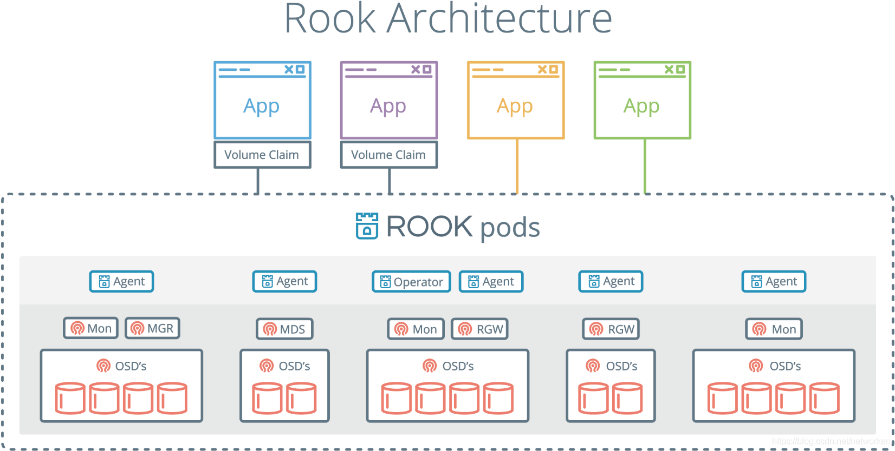
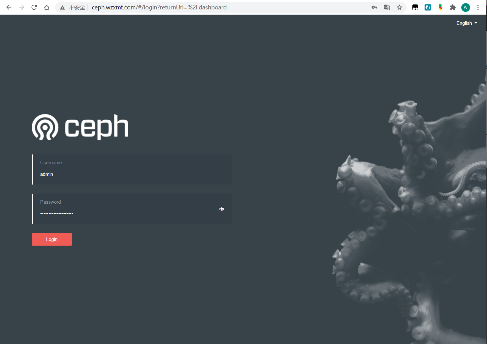
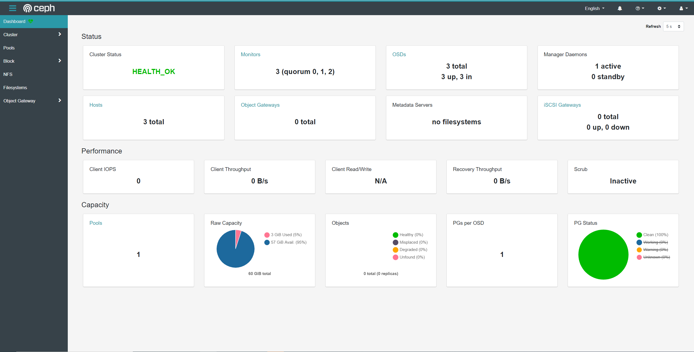
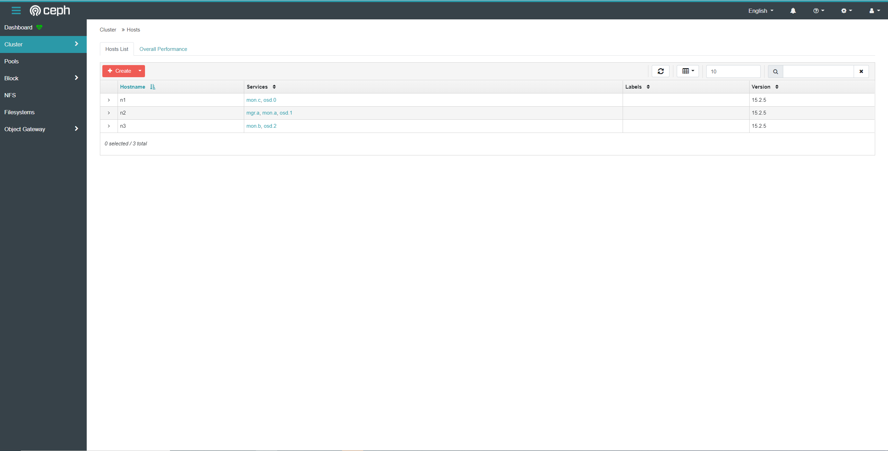
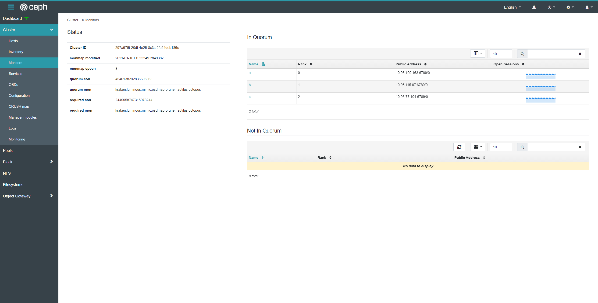
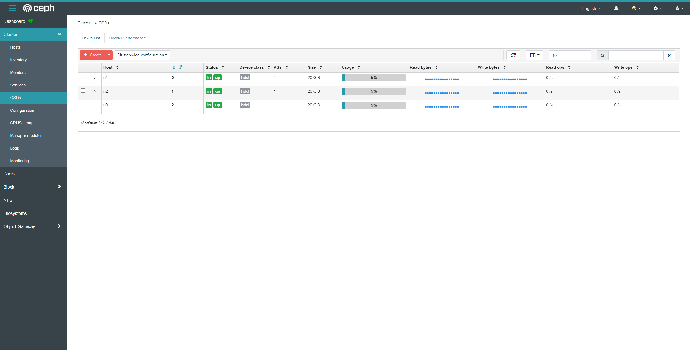
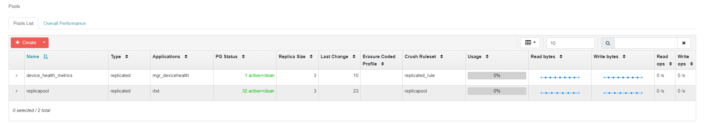

## rook简介

Rook官网：[https://rook.io](https://rook.io/)
**容器的持久化存储**
容器的持久化存储是保存容器存储状态的重要手段，存储插件会在容器里挂载一个基于网络或者其他机制的远程数据卷，使得在容器里创建的文件，实际上是保存在远程存储服务器上，或者以分布式的方式保存在多个节点上，而与当前宿主机没有任何绑定关系。这样，无论你在其他哪个宿主机上启动新的容器，都可以请求挂载指定的持久化存储卷，从而访问到数据卷里保存的内容。
由于 Kubernetes 本身的松耦合设计，绝大多数存储项目，比如 Ceph、GlusterFS、NFS 等，都可以为 Kubernetes 提供持久化存储能力。
**Ceph分布式存储系统**
Ceph是一种高度可扩展的分布式存储解决方案，提供对象、文件和块存储。在每个存储节点上，您将找到Ceph存储对象的文件系统和Ceph OSD（对象存储守护程序）进程。在Ceph集群上，您还可以找到Ceph MON（监控）守护程序，它们确保Ceph集群保持高可用性。
**Rook**
Rook 是一个开源的cloud-native storage编排, 提供平台和框架；为各种存储解决方案提供平台、框架和支持，以便与云原生环境本地集成。
Rook 将存储软件转变为自我管理、自我扩展和自我修复的存储服务，它通过自动化部署、引导、配置、置备、扩展、升级、迁移、灾难恢复、监控和资源管理来实现此目的。
Rook 使用底层云本机容器管理、调度和编排平台提供的工具来实现它自身的功能。
Rook 目前支持Ceph、NFS、Minio Object Store和CockroachDB。

Rook使用Kubernetes原语使Ceph存储系统能够在Kubernetes上运行。下图说明了Ceph Rook如何与Kubernetes集成：

随着Rook在Kubernetes集群中运行，Kubernetes应用程序可以挂载由Rook管理的块设备和文件系统，或者可以使用S3 / Swift API提供对象存储。Rook oprerator自动配置存储组件并监控群集，以确保存储处于可用和健康状态。
Rook oprerator是一个简单的容器，具有引导和监视存储集群所需的全部功能。oprerator将启动并监控ceph monitor pods和OSDs的守护进程，它提供基本的RADOS存储。oprerator通过初始化运行服务所需的pod和其他组件来管理池，对象存储（S3 / Swift）和文件系统的CRD。
oprerator将监视存储后台驻留程序以确保群集正常运行。Ceph mons将在必要时启动或故障转移，并在群集增长或缩小时进行其他调整。oprerator还将监视api服务请求的所需状态更改并应用更改。
Rook oprerator还创建了Rook agent。这些agent是在每个Kubernetes节点上部署的pod。每个agent都配置一个Flexvolume插件，该插件与Kubernetes的volume controller集成在一起。处理节点上所需的所有存储操作，例如附加网络存储设备，安装卷和格式化文件系统。

该rook容器包括所有必需的Ceph守护进程和工具来管理和存储所有数据 - 数据路径没有变化。 rook并没有试图与Ceph保持完全的忠诚度。 许多Ceph概念（如placement groups和crush maps）都是隐藏的，因此您无需担心它们。 相反，Rook为管理员创建了一个简化的用户体验，包括物理资源，池，卷，文件系统和buckets。 同时，可以在需要时使用Ceph工具应用高级配置。
Rook在golang中实现。Ceph在C ++中实现，其中数据路径被高度优化。我们相信这种组合可以提供两全其美的效果。

### Rook组件

Rook的主要组件有三个，功能如下：

1. Rook Operator

2. - Rook与Kubernetes交互的组件
   - 整个Rook集群只有一个

3. Agent or Driver

   已经被淘汰的驱动方式，在安装之前，请确保k8s集群版本是否支持CSI，如果不支持，或者不想用CSI，选择flex.

   默认全部节点安装，你可以通过 node affinity 去指定节点

4. - Ceph CSI Driver
   - Flex Driver

5. Device discovery

   发现新设备是否作为存储，可以在配置文件`ROOK_ENABLE_DISCOVERY_DAEMON`设置 enable 开启。

## 部署环境准备

**官方参考：**
root项目地址：https://github.com/rook/rook
rook官方参考文档：https://rook.io/docs/rook/v1.5/quickstart.html

**kubernetes集群准备**
集群节点信息：略

在集群中至少有三个节点可用，满足ceph高可用要求，这里已配置master节点使其支持运行pod。

**rook使用存储方式**
rook默认使用所有节点的所有资源，rook operator自动在所有节点上启动OSD设备，Rook会用如下标准监控并发现可用设备：

- 设备没有分区
- 设备没有格式化的文件系统

Rook不会使用不满足以上标准的设备。另外也可以通过修改配置文件，指定哪些节点或者设备会被使用。
**添加新磁盘**
这里在所有节点添加1块50GB的新磁盘：/dev/sdb，作为OSD盘，提供存储空间，添加完成后扫描磁盘，确保主机能够正常识别到：

```shell
#扫描 SCSI总线并添加 SCSI 设备
for host in $(ls /sys/class/scsi_host) ; do echo "- - -" > /sys/class/scsi_host/$host/scan; done

#重新扫描 SCSI 总线
for scsi_device in $(ls /sys/class/scsi_device/); do echo 1 > /sys/class/scsi_device/$scsi_device/device/rescan; done

#查看已添加的磁盘，能够看到sdb说明添加成功
lsblk
```

节点升级内核（内核要求大于4.17）

```bash
#检查内核
uname -sr
#添加内核ELRepo
rpm -Uvh http://www.elrepo.org/elrepo-release-7.0-3.el7.elrepo.noarch.rpm
#安装最新版内核
yum --enablerepo=elrepo-kernel install  kernel-ml* --skip-broken -y
#修改默认内核
sed -ri "s#(^GRUB_DEFAULT=)(.*)#\10#g" /etc/default/grub
#加载配置
grub2-mkconfig -o /boot/grub2/grub.cfg
#重启
reboot
```

加载ceph内核

```bash
cat<< 'EOF' > /etc/sysconfig/modules/rbd.modules
#!/bin/bash
modprobe rbd
EOF
chmod 755 /etc/sysconfig/modules/rbd.modules
bash /etc/sysconfig/modules/rbd.modules
lsmod | grep rbd
```

## 部署Rook Operator

#### 克隆rook github仓库到本地

```shell
git clone --single-branch --branch v1.5.1 https://github.com/rook/rook.git
cd rook/cluster/examples/kubernetes/ceph
```

#### 安装公共部分

```shell
kubectl create -f crds.yaml -f common.yaml
```

#### 配置operator

operator的配置在ceph安装后不能修改，否则rook会删除集群并重建

```yaml
cp operator.yaml{,.bak}
#修改csi镜像为私有仓，加速部署时间
  ROOK_CSI_CEPH_IMAGE: "harbor.wzxmt.com/infra/cephcsi:v3.1.2"
  ROOK_CSI_REGISTRAR_IMAGE: "harbor.wzxmt.com/infra/csi-node-driver-registrar:v2.0.1"
  ROOK_CSI_RESIZER_IMAGE: "harbor.wzxmt.com/infra/csi-resizer:v1.0.0"
  ROOK_CSI_PROVISIONER_IMAGE: "harbor.wzxmt.com/infra/csi-provisioner:v2.0.0"
  ROOK_CSI_SNAPSHOTTER_IMAGE: "harbor.wzxmt.com/infra/csi-snapshotter:v3.0.0"
  ROOK_CSI_ATTACHER_IMAGE: "harbor.wzxmt.com/infra/csi-attacher:v3.0.0"
#plugin和provisioner分开
  CSI_PROVISIONER_NODE_AFFINITY: "app.rook.role=csi-provisioner"
  CSI_PLUGIN_NODE_AFFINITY: "app.rook.plugin=csi"
# 修改rook镜像，加速部署时间
        image: harbor.wzxmt.com/infra/rook/ceph:v1.5.1
# 指定节点做存储
        - name: DISCOVER_AGENT_NODE_AFFINITY
          value: "app.role=storage"
# 开启设备自动发现
        - name: ROOK_ENABLE_DISCOVERY_DAEMON
          value: "true"
#如果k8s master设置了污点，需要添加这一行，详细见 https://www.cnblogs.com/lswweb/p/13860186.html
  CSI_PLUGIN_TOLERATIONS: |
    - effect: NoSchedule
      key: node-role.kubernetes.io/master
      operator: Exists
```

拉取镜像，并推送至私有仓库

```bash
cat << 'EOF' >ceph_get_images.sh
#!/bin/bash
## 使用如下脚本下载国内镜像，并修改tag为harbor的tag
set -e
cephcsi_version=v3.1.2
node_driver_registrar_version=v2.0.1
attacher_version=v3.0.0
provisioner_version=v2.0.0
snapshotter_version=v3.0.0
resizer_version=v1.0.0

HARBOR_URL=harbor.wzxmt.com/infra
ALIYUN_URL=registry.aliyuncs.com/it00021hot

images=(cephcsi:${cephcsi_version}
csi-node-driver-registrar:${node_driver_registrar_version}
csi-attacher:${attacher_version}
csi-provisioner:${provisioner_version}
csi-snapshotter:${snapshotter_version}
csi-resizer:${resizer_version})

for imageName in ${images[@]} ; do
  docker pull $ALIYUN_URL/$imageName
  docker tag  $ALIYUN_URL/$imageName $HARBOR_URL/$imageName 
  docker push $HARBOR_URL/$imageName
  docker rmi $HARBOR_URL/$imageName $ALIYUN_URL/$imageName
done
docker pull ceph/ceph:v15.2.5
docker tag ceph/ceph:v15.2.5 harbor.wzxmt.com/infra/ceph/ceph:v15.2.5
docker pull rook/ceph:v1.5.1
docker tag rook/ceph:v1.5.1 harbor.wzxmt.com/infra/rook/ceph:v1.5.1 
docker push harbor.wzxmt.com/infra/ceph/ceph:v15.2.5
docker push harbor.wzxmt.com/infra/rook/ceph:v1.5.1
docker rmi rook/ceph:v1.5.1 harbor.wzxmt.com/infra/rook/ceph:v1.5.1 ceph/ceph:v15.2.5 harbor.wzxmt.com/infra/ceph/ceph:v15.2.5
EOF
sh ceph_get_images.sh
```

各节点拉取镜像

```bash
cat << 'EOF' >ceph_getharbor_images.sh
#!/bin/bash
## 使用如下脚本下载国内镜像，并修改tag为harbor的tag
set -e
cephcsi_version=v3.1.2
node_driver_registrar_version=v2.0.1
attacher_version=v3.0.0
provisioner_version=v2.0.0
snapshotter_version=v3.0.0
resizer_version=v1.0.0

HARBOR_URL=harbor.wzxmt.com/infra

images=(
cephcsi:${cephcsi_version}
csi-node-driver-registrar:${node_driver_registrar_version}
csi-attacher:${attacher_version}
csi-provisioner:${provisioner_version}
csi-snapshotter:${snapshotter_version}
csi-resizer:${resizer_version})
for imageName in ${images[@]} ; do
  docker pull $HARBOR_URL/$imageName 
done
docker pull harbor.wzxmt.com/infra/ceph/ceph:v15.2.5
docker pull harbor.wzxmt.com/infra/rook/ceph:v1.5.1
EOF
sh ceph_getharbor_images.sh
```

安装operator

```shell
kubectl apply -f operator.yaml
```

### 部署ceph集群

修改yaml文件：

```yaml
cp cluster.yaml{,.bak}
cat << EOF >cluster.yaml
apiVersion: ceph.rook.io/v1
kind: CephCluster
metadata:
# 命名空间的名字，同一个命名空间只支持一个集群
  name: rook-ceph
  namespace: rook-ceph
spec:
# ceph版本说明
# v13 is mimic, v14 is nautilus, and v15 is octopus.
  cephVersion:
#修改ceph镜像，加速部署时间
    image: harbor.wzxmt.com/infra/ceph/ceph:v15.2.5
# 是否允许不支持的ceph版本
    allowUnsupported: false
#指定rook数据在节点的保存路径
  dataDirHostPath: /data/rook
# 升级时如果检查失败是否继续
  skipUpgradeChecks: false
# 从1.5开始，mon的数量必须是奇数
  mon:
    count: 3
# 是否允许在单个节点上部署多个mon pod
    allowMultiplePerNode: false
  mgr:
    modules:
    - name: pg_autoscaler
      enabled: true
# 开启dashboard，禁用ssl，指定端口是7000，你可以默认https配置。我是为了ingress配置省事。
  dashboard:
    enabled: true
    port: 7000
    ssl: false
# 开启prometheusRule
  monitoring:
    enabled: true
# 部署PrometheusRule的命名空间，默认此CR所在命名空间
    rulesNamespace: rook-ceph
# 开启网络为host模式，解决无法使用cephfs pvc的bug
  network:
    provider: host
# 开启crash collector，每个运行了Ceph守护进程的节点上创建crash collector pod
  crashCollector:
    disable: false
# 设置node亲缘性，指定节点安装对应组件
  placement:
    mon:
      nodeAffinity:
        requiredDuringSchedulingIgnoredDuringExecution:
          nodeSelectorTerms:
          - matchExpressions:
            - key: ceph-mon
              operator: In
              values:
              - enabled
    osd:
      nodeAffinity:
        requiredDuringSchedulingIgnoredDuringExecution:
          nodeSelectorTerms:
          - matchExpressions:
            - key: ceph-osd
              operator: In
              values:
              - enabled
    mgr:
      nodeAffinity:
        requiredDuringSchedulingIgnoredDuringExecution:
          nodeSelectorTerms:
          - matchExpressions:
            - key: ceph-mgr
              operator: In
              values:
              - enabled 
# 存储的设置，默认都是true，意思是会把集群所有node的设备清空初始化。
  storage: # cluster level storage configuration and selection
    useAllNodes: false     #关闭使用所有Node
    useAllDevices: false   #关闭使用所有设备
    nodes:
    - name: "n1"  #指定存储节点主机(k8s node name)
      devices:
      - name: "sdb"  #指定磁盘为sdb
    - name: "n2"
      devices:
      - name: "sdb"
    - name: "n3"
      devices:
      - name: "sdb"
EOF
```

节点添加label

```bash
for n in n{1..3};do kubectl label nodes $n ceph-mgr=enabled;done
for n in n{1..3};do kubectl label nodes $n ceph-osd=enabled;done
for n in n{1..3};do kubectl label nodes $n ceph-mon=enabled;done
for n in n{1..3};do kubectl label nodes $n app.rook.role=csi-provisioner;done
for n in n{1..3};do ssh $n "mkdir -p /var/lib/kubelet/{pods,plugins_registry}";done
```

创建Ceph集群

```shell
kubectl apply -f cluster.yaml 
```

Ceph集群部署成功后，可以查看到的pods如下，其中osd数量取决于你的节点数量：

```shell
[root@supper ceph]# kubectl get pod -n rook-ceph
NAME                                            READY   STATUS      RESTARTS   AGE
csi-cephfsplugin-provisioner-85d6b465fb-bd8wv   6/6     Running     0          2m31s
csi-cephfsplugin-provisioner-85d6b465fb-xpwjw   6/6     Running     0          2m31s
csi-rbdplugin-provisioner-564ffb8599-chrbh      6/6     Running     0          2m32s
csi-rbdplugin-provisioner-564ffb8599-snjzc      6/6     Running     0          2m32s
rook-ceph-crashcollector-n1-649774595c-ddcml    1/1     Running     0          81s
rook-ceph-crashcollector-n2-775dcc5d64-nt4sl    1/1     Running     0          2m18s
rook-ceph-crashcollector-n3-76dbb4646c-2n6l4    1/1     Running     0          111s
rook-ceph-mgr-a-7f4954df64-vmlxh                1/1     Running     0          94s
rook-ceph-mon-a-5d698b5548-cm5bt                1/1     Running     0          2m27s
rook-ceph-mon-b-f9c98bb79-b7f6f                 1/1     Running     0          2m18s
rook-ceph-mon-c-6d44cfb4bb-gk2zn                1/1     Running     0          2m7s
rook-ceph-operator-6d675bf648-rx2sz             1/1     Running     0          2m59s
rook-ceph-osd-0-54d7455c77-m44fn                1/1     Running     0          82s
rook-ceph-osd-1-8575fd89fb-sqw58                1/1     Running     0          81s
rook-ceph-osd-2-6ff9f958b8-26zjq                1/1     Running     0          80s
rook-ceph-osd-prepare-n1-mfl28                  0/1     Completed   0          93s
rook-ceph-osd-prepare-n2-q768n                  0/1     Completed   0          93s
rook-ceph-osd-prepare-n3-5sln9                  0/1     Completed   0          92s
```

**删除Ceph集群**
如果要删除已创建的Ceph集群，可执行下面命令：

```shell
kubectl delete -f cluster.yaml
```

删除Ceph集群后，在之前部署Ceph组件节点的/var/lib/rook/目录，会遗留下Ceph集群的配置信息。
若之后再部署新的Ceph集群，先把之前Ceph集群的这些信息删除，不然启动monitor会失败；

```shell
# cat clean-rook-dir.sh
hosts=(
  n1
  n2
  n3
)
for host in ${hosts[@]} ; do
  ssh $host "rm -rf /data/rook/*"
done
```

## 配置ceph dashboard

在cluster.yaml文件中默认已经启用了ceph dashboard，查看dashboard的service：

```shell
[root@supper ceph]# kubectl get service -n rook-ceph
NAME                       TYPE        CLUSTER-IP      EXTERNAL-IP   PORT(S)             AGE
csi-cephfsplugin-metrics   ClusterIP   10.96.148.204   <none>        8080/TCP,8081/TCP   3m6s
csi-rbdplugin-metrics      ClusterIP   10.96.144.241   <none>        8080/TCP,8081/TCP   3m7s
rook-ceph-mgr              ClusterIP   10.96.14.144    <none>        9283/TCP            2m10s
rook-ceph-mgr-dashboard    ClusterIP   10.96.135.70    <none>        7000/TCP            2m10s
```

使用ingress的方式来暴露以便集群外部访问。

```shell
cat << 'EOF' >ceph-ingress.yaml
apiVersion: traefik.containo.us/v1alpha1
kind: IngressRoute
metadata:
  name: traefik-ceph-dashboard
  namespace: rook-ceph
spec:
  entryPoints:
    - web
  routes:
  - match: Host(`ceph.wzxmt.com`)
    kind: Rule
    services:
    - name: rook-ceph-mgr-dashboard
      namespace: rook-ceph
      port: 7000
EOF
kubectl apply -f ceph-ingress.yaml
```

解析域名

```bash
ceph	60 IN A 10.0.0.50
```

登录信息
连接到仪表板后，您将需要登录以安全访问。Rook 在运行Rook Ceph集群的名称空间中创建一个默认用户， admin并生成一个称为的秘密rook-ceph-dashboard-admin-password。要检索生成的密码，可以运行以下命令：

```shell
kubectl -n rook-ceph get secret rook-ceph-dashboard-password -o jsonpath="{['data']['password']}" | base64 --decode && echo
```

找到username和password字段

```bash
user：admin
passwd：-(3Y8BV'_@P7'f7l20yH
```

浏览器访问
[http://ceph.wzxmt.com/#/](http://ceph.wzxmt.com/#/)

登录后界面如下：

查看hosts状态：
运行了1个mgr、3个mon和3个osd

查看monitors状态：

查看OSD状态
3个osd状态正常，每个容量20GB.


## 部署Ceph toolbox

默认启动的Ceph集群，是开启Ceph认证的，这样你登陆Ceph组件所在的Pod里，是没法去获取集群状态，以及执行CLI命令，这时需要部署Ceph toolbox，命令如下：

```shell
kubectl apply -f toolbox.yaml
```

然后可以登陆该pod后，执行Ceph CLI命令：

```shell
POD=`kubectl -n rook-ceph get pods | grep ceph-tools|awk '{print $1}'`
kubectl -n rook-ceph exec -it $POD bash
```

查看ceph集群状态

```shell
[root@rook-ceph-tools-79d8b97bdc-dttd7 /]# ceph status
  cluster:
    id:     333cd408-3a00-4ca0-be4a-bea261cf0bf1
    health: HEALTH_OK

  services:
    mon: 3 daemons, quorum a,b,c (age 6m)
    mgr: a(active, since 5m)
    osd: 3 osds: 3 up (since 5m), 3 in (since 5m)

  data:
    pools:   1 pools, 1 pgs
    objects: 0 objects, 0 B
    usage:   3.0 GiB used, 57 GiB / 60 GiB avail
    pgs:     1 active+clean

```

查看ceph配置文件

```shell
[root@rook-ceph-tools-79d8b97bdc-dttd7 /]# ls -l /etc/ceph/
total 8
-rw-r--r-- 1 root root 109 Jan 18 15:12 ceph.conf
-rw-r--r-- 1 root root  62 Jan 18 15:12 keyring

[root@rook-ceph-tools-79d8b97bdc-dttd7 /]# cat /etc/ceph/ceph.conf
[global]
mon_host = 10.0.0.41:6789,10.0.0.42:6789,10.0.0.43:6789

[client.admin]
keyring = /etc/ceph/keyring

[root@rook-ceph-tools-79d8b97bdc-dttd7 /]# cat /etc/ceph/keyring
[client.admin]
key = AQA0pAVg5udsBRAA/3PT/sTgTeiFoC0pZIJ6hQ==
```

## rook提供RBD服务

rook可以提供以下3类型的存储：

- Block Storage：目前最稳定；
- FileSystem：需要部署MDS，有内核要求；
- Object：部署RGW；

在提供（Provisioning）块存储之前，需要先创建StorageClass和存储池。K8S需要这两类资源，才能和Rook交互，进而分配持久卷（PV）。
在kubernetes集群里，要提供rbd块设备服务，需要有如下步骤：

1. 创建rbd-provisioner pod
2. 创建rbd对应的storageclass
3. 创建pvc，使用rbd对应的storageclass
4. 创建pod使用rbd pvc

通过rook创建Ceph Cluster之后，rook自身提供了rbd-provisioner服务，所以我们不需要再部署其provisioner。

创建pool

```yaml
cat << 'EOF' >cepg-rbd-pool.yaml
apiVersion: ceph.rook.io/v1
kind: CephBlockPool
metadata:
  name: replicapool
  namespace: rook-ceph
spec:
  failureDomain: host
  replicated:
    size: 3
    requireSafeReplicaSize: true
EOF
kubectl apply -f cepg-rbd-pool.yaml
```

定义一个StorageClass

```yaml
cat << 'EOF' >ceph-rdb-storage.yaml 
apiVersion: storage.k8s.io/v1
kind: StorageClass
metadata:
   name: rook-ceph-block
provisioner: rook-ceph.rbd.csi.ceph.com
parameters:
    clusterID: rook-ceph
    pool: replicapool
    imageFormat: "2"
    imageFeatures: layering
    csi.storage.k8s.io/provisioner-secret-name: rook-csi-rbd-provisioner
    csi.storage.k8s.io/provisioner-secret-namespace: rook-ceph
    csi.storage.k8s.io/controller-expand-secret-name: rook-csi-rbd-provisioner
    csi.storage.k8s.io/controller-expand-secret-namespace: rook-ceph
    csi.storage.k8s.io/node-stage-secret-name: rook-csi-rbd-node
    csi.storage.k8s.io/node-stage-secret-namespace: rook-ceph
    csi.storage.k8s.io/fstype: ext4
allowVolumeExpansion: true
reclaimPolicy: Delete
EOF
kubectl apply -f ceph-rdb-storage.yaml
```

查看创建的storageclass:

```shell
[root@supper test]# kubectl get storageclass
NAME                  PROVISIONER                  RECLAIMPOLICY   VOLUMEBINDINGMODE   ALLOWVOLUMEEXPANSION 
rook-ceph-block       rook-ceph.rbd.csi.ceph.com   Delete          Immediate           true                 
```

登录ceph dashboard查看创建的存储池：

demo示例

```yaml
cat << 'EOF' >rbd-test.yaml
kind: StatefulSet
apiVersion: apps/v1
metadata:
  name: storageclass-rbd-test
  namespace: default
  labels:
    app: storageclass-rbd-test
spec:
  replicas: 2
  serviceName: storageclass-rbd-test
  selector:
    matchLabels:
      app: storageclass-rbd-test
  template:
    metadata:
      labels:
        app: storageclass-rbd-test
    spec:
      restartPolicy: Always
      containers:
        - name: storageclass-rbd-test
          imagePullPolicy: IfNotPresent
          volumeMounts:
            - name: data
              mountPath: /data
          image: 'centos:7'
          args:
            - 'sh'
            - '-c'
            - 'sleep 3600'
  volumeClaimTemplates:
    - metadata:
        name: data
      spec:
        accessModes:
          - ReadWriteOnce
        resources:
          requests:
            storage: 1Gi
        storageClassName: rook-ceph-block
EOF
kubectl apply -f rbd-test.yaml
```


## 部署文件系统CephFS

创建CephFS

CephFS的CSI驱动使用Quotas来强制应用PVC声明的大小，仅仅4.17+内核才能支持CephFS quotas。如果内核不支持，而且你需要配额管理，配置Operator环境变量 **CSI_FORCE_CEPHFS_KERNEL_CLIENT: false**来启用FUSE客户端。使用FUSE客户端时，升级Ceph集群时应用Pod会断开mount，需要重启才能再次使用PV。

```yaml
cat << 'EOF' >cephfs.yaml
apiVersion: ceph.rook.io/v1
kind: CephFilesystem
metadata:
  name: myfs
  namespace: rook-ceph
spec:
  # The metadata pool spec. Must use replication.
  metadataPool:
    replicated:
      size: 3
      requireSafeReplicaSize: true
    parameters:
      # Inline compression mode for the data pool
      # Further reference: https://docs.ceph.com/docs/nautilus/rados/configuration/bluestore-config-ref/#inline-compression
      compression_mode: none
        # gives a hint (%) to Ceph in terms of expected consumption of the total cluster capacity of a given pool
      # for more info: https://docs.ceph.com/docs/master/rados/operations/placement-groups/#specifying-expected-pool-size
      #target_size_ratio: ".5"
  # The list of data pool specs. Can use replication or erasure coding.
  dataPools:
    - failureDomain: host
      replicated:
        size: 3
        # Disallow setting pool with replica 1, this could lead to data loss without recovery.
        # Make sure you're *ABSOLUTELY CERTAIN* that is what you want
        requireSafeReplicaSize: true
      parameters:
        # Inline compression mode for the data pool
        # Further reference: https://docs.ceph.com/docs/nautilus/rados/configuration/bluestore-config-ref/#inline-compression
        compression_mode: none
          # gives a hint (%) to Ceph in terms of expected consumption of the total cluster capacity of a given pool
        # for more info: https://docs.ceph.com/docs/master/rados/operations/placement-groups/#specifying-expected-pool-size
        #target_size_ratio: ".5"
  # Whether to preserve filesystem after CephFilesystem CRD deletion
  preserveFilesystemOnDelete: true
  # The metadata service (mds) configuration
  metadataServer:
    # The number of active MDS instances
    activeCount: 1
    # Whether each active MDS instance will have an active standby with a warm metadata cache for faster failover.
    # If false, standbys will be available, but will not have a warm cache.
    activeStandby: true
    # The affinity rules to apply to the mds deployment
    placement:
      nodeAffinity:
        requiredDuringSchedulingIgnoredDuringExecution:
          nodeSelectorTerms:
          - matchExpressions:
            - key: app.storage
              operator: In
              values:
              - rook-ceph
          topologyKey: kubernetes.io/hostname
    # A key/value list of annotations
    annotations:
    #  key: value
    # A key/value list of labels
    labels:
    #  key: value
    resources:
    # The requests and limits set here, allow the filesystem MDS Pod(s) to use half of one CPU core and 1 gigabyte of memory
    #  limits:
    #    cpu: "500m"
    #    memory: "1024Mi"
    #  requests:
    #    cpu: "500m"
    #    memory: "1024Mi"
    # priorityClassName: my-priority-class
EOF
kubectl apply -f cephfs.yaml
```

打标签

```
for n in n{1..3};do kubectl label nodes $n app.storage=rook-ceph;done
```

### 创建StorageClass

```yaml
cat << 'EOF' >cephfs-StorageClass.yaml
apiVersion: storage.k8s.io/v1
kind: StorageClass
metadata:
  name: rook-cephfs
provisioner: rook-ceph.cephfs.csi.ceph.com
parameters:
  # clusterID is the namespace where operator is deployed.
  clusterID: rook-ceph

  # CephFS filesystem name into which the volume shall be created
  fsName: myfs

  # Ceph pool into which the volume shall be created
  # Required for provisionVolume: "true"
  pool: myfs-data0

  # Root path of an existing CephFS volume
  # Required for provisionVolume: "false"
  # rootPath: /absolute/path

  # The secrets contain Ceph admin credentials. These are generated automatically by the operator
  # in the same namespace as the cluster.
  csi.storage.k8s.io/provisioner-secret-name: rook-csi-cephfs-provisioner
  csi.storage.k8s.io/provisioner-secret-namespace: rook-ceph
  csi.storage.k8s.io/controller-expand-secret-name: rook-csi-cephfs-provisioner
  csi.storage.k8s.io/controller-expand-secret-namespace: rook-ceph
  csi.storage.k8s.io/node-stage-secret-name: rook-csi-cephfs-node
  csi.storage.k8s.io/node-stage-secret-namespace: rook-ceph

  # (optional) The driver can use either ceph-fuse (fuse) or ceph kernel client (kernel)
  # If omitted, default volume mounter will be used - this is determined by probing for ceph-fuse
  # or by setting the default mounter explicitly via --volumemounter command-line argument.
  #使用kernel client
  mounter: kernel
reclaimPolicy: Delete
allowVolumeExpansion: true
mountOptions:
  # uncomment the following line for debugging
  #- debug
EOF
kubectl apply -f cephfs-StorageClass.yaml
```

创建pvc

```yaml
cat << 'EOF' >cephfs-pvc.yaml
apiVersion: v1
kind: PersistentVolumeClaim
metadata:
  name: cephfs-demo-pvc
spec:
  accessModes:
  - ReadWriteMany
  resources:
    requests:
      storage: 1Gi
  storageClassName: rook-cephfs
EOF
kubectl apply -f cephfs-pvc.yaml
```

test

```yaml
cat << 'EOF' >cephfs-test.yaml
apiVersion: apps/v1
kind: Deployment
metadata:
  name: csicephfs-demo-pod
  labels:
    test-cephfs: "true"
spec:
  replicas: 1
  selector:
    matchLabels:
      test-cephfs: "true"
  template:
    metadata:
      labels:
        test-cephfs: "true"
    spec:
      containers:
      - name: web-server
        image: wangyanglinux/myapp:v2
        imagePullPolicy: Always
        volumeMounts:
        - name: mypvc
          mountPath: /usr/share/nginx/html
      volumes:
      - name: mypvc
        persistentVolumeClaim:
          claimName: cephfs-demo-pvc
          readOnly: false
EOF
kubectl apply -f cephfs-test.yaml
```

