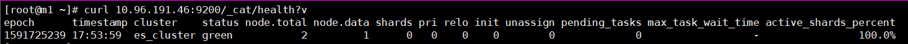

## 前言

Kubernetes官方提供了EFK的日志收集解决方案，但是这种方案并不适合所有的业务场景，它本身就有一些局限性，例如：

- 所有日志都必须是out前台输出，真实业务场景中无法保证所有日志都在前台输出
- 只能有一个日志输出文件，而真实业务场景中往往有多个日志输出文件
- Fluentd并不是常用的日志收集工具，我们更习惯用logstash
- 我们已经有自己的ELK集群且有专人维护，没有必要再在kubernetes上做一个日志收集服务

基于以上几个原因，我们决定使用自己的ELK集群。

###  Kubernetes集群中的日志收集解决方案

| **编号** | **方案**                                                     | **优点**                                                     | **缺点**                                                   |
| :------- | :----------------------------------------------------------- | :----------------------------------------------------------- | :--------------------------------------------------------- |
| **1**    | 每个app的镜像中都集成日志收集组件                            | 部署方便，kubernetes的yaml文件无须特别配置，可以为每个app自定义日志收集配置 | 强耦合，不方便应用和日志收集组件升级和维护且会导致镜像过大 |
| **2**    | 单独创建一个日志收集组件跟app的容器一起运行在同一个pod中     | 低耦合，扩展性强，方便维护和升级                             | 需要对kubernetes的yaml文件进行单独配置，略显繁琐           |
| **3**    | 将所有的Pod的日志都挂载到宿主机上，每台主机上单独起一个日志收集Pod | 完全解耦，性能最高，管理起来最方便                           | 需要统一日志收集规则，目录和输出方式                       |

logstash是一个数据处理引擎，处理filebeat发送的日志；即支持从各种数据源收集数据，并对数据进行过滤、分析等操作；
Elasticsearch用于做数据存储，分布式的搜索引擎；用于全文搜索；
Kibana，可视化平台；能够搜索、展示存储在Elasticsearch数据库中索引数据，同时，可以很方便地以图表、表格、地图形式展示。

## 交付es集群

### 拉取镜像

```bash
docker pull elasticsearch:7.7.1
docker tag elasticsearch:7.7.1 harbor.wzxmt.com/infra/elasticsearch:7.7.1
docker push harbor.wzxmt.com/infra/elasticsearch:7.7.1
```

### 创建名称空间

```bash
kubectl create ns es
```

### 授权harbor仓库访问

```bash
kubectl create secret docker-registry harborlogin \
--namespace=es  \
--docker-server=https://harbor.wzxmt.com \
--docker-username=admin \
--docker-password=admin
```

### 创建资源清单

```bash
mkdir /data/software/yaml/es -p
cd /data/software/yaml/es
```

RBAC授权

```yaml
cat<< 'EOF' > rbac.yaml
apiVersion: v1
kind: ServiceAccount
metadata:
  labels:
    elastic-app: elasticsearch
  name: es-admin
  namespace: es
---
apiVersion: rbac.authorization.k8s.io/v1
kind: ClusterRoleBinding
metadata:
  name: elasticsearch-admin
  labels:
    elastic-app: elasticsearch
roleRef:
  apiGroup: rbac.authorization.k8s.io
  kind: ClusterRole
  name: cluster-admin
subjects:
  - kind: ServiceAccount
    name: elasticsearch-admin
    namespace: es
EOF
```

StatefulSet(包含master与node)

```yaml
cat<< 'EOF' >es-dp.yaml
kind: StatefulSet
apiVersion: apps/v1
metadata:
  labels:
    app: elasticsearch
    role: master
  name: elasticsearch-master
  namespace: es
spec:
  volumeClaimTemplates:
  - metadata:
      name: es-master-storage
    spec:
      accessModes: 
      - ReadWriteOnce
      storageClassName: es-master
      resources:
        requests:
          storage: 10Gi
  replicas: 2
  serviceName: elasticsearch-master
  selector:
    matchLabels:
      app: elasticsearch
      role: master
  template:
    metadata:
      labels:
        app: elasticsearch
        role: master
    spec:
      restartPolicy: Always
      serviceAccountName: es-admin
      securityContext:
        fsGroup: 1000
      imagePullSecrets:
      - name: harborlogin
      containers:
        - name: elasticsearch-master
          image: harbor.wzxmt.com/infra/elasticsearch:7.7.1
          imagePullPolicy: IfNotPresent
          securityContext:
            privileged: true
          ports:
            - containerPort: 9200
              protocol: TCP
            - containerPort: 9200
              protocol: TCP
          volumeMounts:
          - name: es-master-storage
            mountPath: /usr/share/elasticsearch/data
          env:
            - name: cluster.name
              value: "es_cluster"
            - name: node.master
              value: "true"
            - name: node.data
              value: "false"
            - name: discovery.seed_hosts 
              value: "elasticsearch" 
            - name: cluster.initial_master_nodes 
              value: "elasticsearch-master-0,elasticsearch-master-1" 
            - name: node.ingest
              value: "false"
            - name: ES_JAVA_OPTS
              value: "-Xms1g -Xmx1g" 
---
kind: StatefulSet
apiVersion: apps/v1
metadata:
  labels:
    app: elasticsearch
    role: data
  name: elasticsearch-data
  namespace: es
spec:
  volumeClaimTemplates:
  - metadata:
      name: es-data-storage
    spec:
      accessModes: 
      - ReadWriteOnce
      storageClassName: es-data
      resources:
        requests:
          storage: 10Gi
  replicas: 2
  serviceName: elasticsearch-data
  selector:
    matchLabels:
      app: elasticsearch
      role: data
  template:
    metadata:
      labels:
        app: elasticsearch
        role: data
    spec:
      restartPolicy: Always
      serviceAccountName: es-admin
      securityContext:
        fsGroup: 1000
      imagePullSecrets:
      - name: harborlogin
      containers:
        - name: elasticsearch-data
          image: harbor.wzxmt.com/infra/elasticsearch:7.7.1
          imagePullPolicy: IfNotPresent
          securityContext:
            privileged: true
          ports:
            - containerPort: 9200
              protocol: TCP
            - containerPort: 9300
              protocol: TCP
          volumeMounts:
          - name: es-data-storage
            mountPath: /usr/share/elasticsearch/data
          env:
            - name: cluster.name
              value: "es_cluster"
            - name: node.master
              value: "false"
            - name: node.data
              value: "true"
            - name: discovery.seed_hosts
              value: "elasticsearch" 
            - name: cluster.initial_master_nodes 
              value: "elasticsearch-master-0,elasticsearch-master-1" 
            - name: node.ingest
              value: "false"
            - name: ES_JAVA_OPTS
              value: "-Xms1g -Xmx1g" 
EOF
```

SVC

```yaml
cat<< 'EOF' >svc.yaml
kind: Service
apiVersion: v1
metadata:
 labels:
   app: elasticsearch
 name: elasticsearch
 namespace: es
spec:
 ports:
   - port: 9300
     name: inner
   - port: 9200
     name: outer
 selector:
   app: elasticsearch
   role: master
---
apiVersion: v1
kind: Service
metadata:
 name: elasticsearch-data-service
 namespace: es
 labels:
   app: elasticsearch
   role: data
spec:
 ports:
   - port: 9200
     name: outer
   - port: 9300
     name: inner
 clusterIP: None
 selector:
   app: elasticsearch
   role: data
EOF
```

StorageClass

```yaml
cat<< 'EOF' >sc.yaml
apiVersion: storage.k8s.io/v1
kind: StorageClass
metadata:
  name: es-data
  namespace: es
provisioner: fuseim.pri/ifs
---
apiVersion: storage.k8s.io/v1
kind: StorageClass
metadata:
  name: es-master
  namespace: es
provisioner: fuseim.pri/ifs
EOF
```

### 节点优化（必须，要不然集群起不来）

添加下面四行内容：

```bash
cat<< 'EOF' >>/etc/security/limits.conf
* soft nofile 65536
* hard nofile 131072
* soft nproc 2048
* hard nproc 4096
EOF
```

打开文件vim /etc/sysctl.conf，添加下面一行内容：

```
echo "vm.max_map_count=262144" >>/etc/sysctl.conf
```

加载sysctl配置，执行命令：sysctl -p

### 部署：

```bash
kubectl apply -f ./
```

### 查看es的service的IP：

```bash
[root@m1 ~]# kubectl -n es get svc
NAME                         TYPE        CLUSTER-IP     EXTERNAL-IP   PORT(S)             AGE
elasticsearch-data-service   ClusterIP   None           <none>        9200/TCP,9300/TCP   24m
elasticsearch-discovery      ClusterIP   10.96.191.46   <none>        9300/TCP,9200/TCP   24m
```

### 查看集群master信息：

```bash
[root@m1 ~]# curl 10.96.191.46:9200/_cat/master?v
id                     host         ip           node
DolNio2RQKiZPARz9wH_Gw 10.96.31.232 10.96.31.232 elasticsearch-master-0
```

### 查看集群健康信息：

```bash
curl 10.96.191.46:9200/_cat/health?v
```




到此，es集群搭建成功！

## logstash交付

### 下载镜像并推送harbor仓库

```bash
docker pull logstash:7.7.1
dockers tag logstash:7.7.1 harbor.wzxmt.com/infra/logstash:7.7.1
```

### 编写资源清单

```
mkdir /data/software/yaml/logstash -p
cd /data/software/yaml/logstash
```

 ConfigMap

```yaml
cat << 'EOF' >cm.yaml
apiVersion: v1
kind: ConfigMap
metadata:
  name: logstash-config-ConfigMap
  namespace: es
data:
  pipelines.yml: |
     - pipeline.id: test
       path.config: "/usr/share/logstash/pipeline/logstash-test.conf"
  logstash.yml: |
     http.host: "0.0.0.0"
     xpack.monitoring.elasticsearch.hosts: [ "http://elasticsearch:9200" ]
     xpack.monitoring.enabled: true
EOF
```

Deployment

```yaml
cat << 'EOF' >dp.yaml
kind: Deployment
apiVersion: apps/v1
metadata:
  labels:
   es-app: logstash
  name: logstash
  namespace: es
spec:
  replicas: 1
  revisionHistoryLimit: 10
  selector:
    matchLabels:
     es-app: logstash
  template:
    metadata:
      labels:
       es-app: logstash
    spec:
      imagePullSecrets:
      - name: harborlogin
      containers:
        - name: logstash
          image: harbor.wzxmt.com/infra/logstash:7.7.1
          volumeMounts:
            - mountPath: /usr/share/logstash/pipeline
              name: logstash-conf-volume
            - mountPath: /usr/share/logstash/config/pipelines.yml
              name: logstash-config-volume
              subPath: pipelines.yml
            - mountPath: /usr/share/logstash/config/logstash.yml
              name: logstash-config-volume
              subPath: logstash.yml
          ports:
            - containerPort: 8080
              protocol: TCP
          securityContext:
            privileged: true
      volumes:
        - name: logstash-conf-volume
          persistentVolumeClaim:
            claimName: logstash-conf-pvc
        - name: logstash-config-volume
          configMap:
            name: logstash-config-ConfigMap
EOF
```

Service

```yaml
cat << 'EOF' >svc.yaml
kind: Service
apiVersion: v1
metadata:
  labels:
    es-app: logstash
  name: logstash
  namespace: es
spec:
  selector:
    es-app: logstash
  ports:
    - port: 8080
EOF
```

volumes

```yaml
cat << 'EOF' >volumes.yaml
apiVersion: v1
kind: PersistentVolume
metadata:
  name: nfs-pv
  namespace: es
spec:
  storageClassName: nfs
  nfs:
    path: /data/nfs-volume/logstash
    server: 10.0.0.20
  persistentVolumeReclaimPolicy: Recycle
  accessModes:
  - ReadWriteMany
  capacity:
    storage: 1Gi
---
apiVersion: v1
kind: PersistentVolumeClaim
metadata:
  name: logstash-conf-pvc
  namespace: es
spec:
  accessModes:
  - ReadWriteMany
  storageClassName: nfs
  resources:
    requests:
      storage: 1Gi
EOF
```

### nfs主机上添加logstash配置文件

```json
cat << 'EOF' >/data/nfs-volume/logstash/logstash-test.conf
input {
  kafka {
    bootstrap_servers => "kafka.wzxmt.com:9092"
    client_id => "test"
    consumer_threads => 4
    group_id => "k8s_test"
    topics_pattern => "k8s-fb-test-.*"
  }
}

filter {
  json {
    source => "message"
  }
}

output {
  elasticsearch {
    hosts => ["elasticsearch:9200"]
    index => "k8s_test-%{+YYYY.MM.dd}"
   }
#　  stdout {       
#　　　codec => rubydebug    
#   }
}
EOF
```

### 部署

```bash
kubectl apply -f ./
```

## kibana交付

### 拉取镜像

```bash
docker pull kibana:7.7.1
docker tag kibana:7.7.1 harbor.wzxmt.com/infra/kibana:7.7.1
docker push harbor.wzxmt.com/infra/kibana:7.7.1
```

### 资源清单

```bash
mkdir /data/software/yaml/kibana -p
cd /data/software/yaml/kibana
```

ConfigMap

```yaml
cat << 'EOF' >cm.yaml
apiVersion: v1
kind: ConfigMap
metadata:
  name: kibana-conf
  namesppace: es
data:
  kibana.yml: |
    server.name: kibana
    server.host: "0"
    i18n.locale: "zh-CN"
    elasticsearch.hosts: [ "http://elasticsearch:9200" ]
    elasticsearch.requestTimeout: 600000
    monitoring.ui.container.elasticsearch.enabled: true
EOF
```

Deployment

```yaml
cat << 'EOF' >dp.yaml
kind: Deployment
apiVersion: apps/v1
metadata:
  name: kibana
  namespace: es
spec:
  replicas: 1
  revisionHistoryLimit: 10
  selector:
    matchLabels:
      es-app: kibana
  template:
    metadata:
      labels:
        es-app: kibana
    spec:
      imagePullSecrets:
      - name: harborlogin
      containers:
        - name: kibana
          image: harbor.wzxmt.com/infra/kibana:7.7.1
          ports:
            - containerPort: 5601
              protocol: TCP
          volumeMounts:
            - mountPath: /usr/share/kibana/config
              name: kibana-conf-volume
      volumes:
        - name: kibana-conf-volume
          configMap:
            name: kibana-conf
EOF
```

Service

```yaml
cat << 'EOF' >svc.yaml
kind: Service
apiVersion: v1
metadata:
  name: kibana
  namespace: es
spec:
  selector:
   es-app: kibana
  ports:
    - port: 5601
      targetPort: 5601
EOF
```

Ingress

```yaml
cat << 'EOF' >ingress.yaml
apiVersion: extensions/v1beta1
kind: Ingress
metadata:
  name: kibana
  namespace: es
  annotations:
    traefik.ingress.kubernetes.io/router.entrypoints: web
spec:
  rules:
    - host: kibana.wzxmt.com
      http:
        paths:
        - path: /
          backend:
            serviceName: kibana
            servicePort: 5601
EOF
```

### 部署

```bash
kubectl apply -f ./
```

### dns添加域名解析

```bash
kibana	60 IN A 10.0.0.50
```

访问[http://kibana.wzxmt.com](http://kibana.wzxmt.com)

到此elk集群通过k8s搭建完成

## [部署zookeeper](https://www.cnblogs.com/wzxmt/p/11031480.html)

[官网](hhttps://zookeeper.apache.org/)
[官方github地址](https://github.com/apache/zookeeper)
[下载地址](https://github.com/apache/zookeeper/archive/release-3.5.5.tar.gz)：

```
wget http://archive.apache.org/dist/zookeeper/zookeeper-3.5.5/apache-zookeeper-3.5.5-bin.tar.gz
```

### 安装

```
tar xf apache-zookeeper-3.5.5-bin.tar.gz
-C /usr/local/src/ ln -s /usr/local/src/apache-zookeeper-3.5.5-bin /usr/local/zookeeper
```

###  配置

在主目录下创建data和logs两个目录用于存储数据和日志：

```
mkdir  -p /data/zookeeper/{data,logs}
```

在conf目录下新建zoo.cfg文件，写入以下内容保存：

```bash
cat << 'EOF' >/usr/local/zookeeper/conf/zoo.cfg
tickTime=2000
dataDir=/data/zookeeper/data
dataLogDir=/data/zookeeper/logs
clientPort=2181
EOF
```

### 添加环境变量：

```
echo -e 'export ZOOKEEPER_HOME=/usr/local/zookeeper\nexport PATH=$ZOOKEEPER_HOME/bin:$PATH' >>/etc/profile
source /etc/profile
```

### 启动和停止

进入bin目录，启动、停止、重启（start、stop、restart和status）分和查看当前节点状态（包括集群中是何角色）别执行：

```
zkServer.sh start
```

### DNS解析

```bash
zk-test	60 IN A 10.0.0.11
```

## [部署kafka](https://www.cnblogs.com/wzxmt/p/11032133.html)

[官网](https://kafka.apache.org/)
[官方github地址](https://github.com/apache/kafka)
[下载地址](https://archive.apache.org/dist/kafka/2.2.1/kafka_2.11-2.2.1.tgz)：

### 安装

```bash
wget https://mirrors.tuna.tsinghua.edu.cn/apache/kafka/2.5.0/kafka_2.12-2.5.0.tgz
tar xf kafka_2.12-2.5.0.tgz -C /opt
ln -s /opt/kafka_2.12-2.5.0 /opt/kafka
```

### 配置

```bash
cat << 'EOF' >/opt/kafka/config/server.properties
broker.id=0 
port=9092
log.dirs=/data/kafka/logs
zookeeper.connect=zk-test.wzxmt.com:2181
log.flush.interval.messages=10000
log.flush.interval.ms=1000
delete.topic.enable=true
host.name=10.0.0.12
EOF
```

### 启动

```bash
cd /opt/kafka
bin/kafka-server-start.sh -daemon config/server.properties
netstat -luntp|grep 9092
```

### DNS解析

```bash
kafka	60 IN A 10.0.0.12
```

## 部署kafka-manager

新版kafka-manager已经更名为MCMAK [官方github地址](https://github.com/yahoo/kafka-manager)
运维主机上：

#### 下载MCMAK

```
mkdir /data/dockerfile/kafka-manager
cd /data/dockerfile/kafka-manager
wget https://github.com/yahoo/CMAK/releases/download/3.0.0.4/cmak-3.0.0.4.zip
unzip cmak-3.0.0.4.zip
rm -f cmak-3.0.0.4/bin/*.bat
```

#### 准备Dockerfile

```bash
cat << 'EOF' >Dockerfile
FROM openjdk:11.0-jre
ENV ZK_HOSTS=localhost:2181 \
    CMAK_VERSION=3.0.0.4
ADD cmak-${CMAK_VERSION}/ /opt/cmak
WORKDIR /opt/cmak
EXPOSE 9000
ENTRYPOINT ["bin/cmak"]
EOF
```

#### 制作镜像

```bash
docker build . -t harbor.wzxmt.com/infra/cmak:v3.0.0.4
docker push harbor.wzxmt.com/infra/cmak:v3.0.0.4
```

### 准备资源配置清单

Deployment

```yaml
mkdir -p /data/software/kafka-manager/yaml
cd /data/software/kafka-manager/yaml
cat<< 'EOF' >dp.yaml
kind: Deployment
apiVersion: apps/v1
metadata:
  name: kafka-manager
  namespace: infra
  labels: 
    name: kafka-manager
spec:
  replicas: 1
  selector:
    matchLabels: 
      name: kafka-manager
  template:
    metadata:
      labels: 
        app: kafka-manager
        name: kafka-manager
    spec:
      containers:
      - name: kafka-manager
        image: harbor.wzxmt.com/infra/cmak:v3.0.0.4
        ports:
        - containerPort: 9000
          protocol: TCP
        env:
        - name: ZK_HOSTS
          value: zk-test.wzxmt.com:2181
        - name: APPLICATION_SECRET
          value: letmein
        imagePullPolicy: IfNotPresent
      imagePullSecrets:
      - name: harborlogin
      restartPolicy: Always
      terminationGracePeriodSeconds: 30
      securityContext: 
        runAsUser: 0
      schedulerName: default-scheduler
  strategy:
    type: RollingUpdate
    rollingUpdate: 
      maxUnavailable: 1
      maxSurge: 1
  revisionHistoryLimit: 7
  progressDeadlineSeconds: 600
EOF
```

Service

```yaml
cat<< 'EOF' >svc.yaml
kind: Service
apiVersion: v1
metadata: 
  name: kafka-manager
  namespace: infra
spec:
  ports:
  - protocol: TCP
    port: 9000
    targetPort: 9000
  selector: 
    app: kafka-manager
  clusterIP: None
  type: ClusterIP
  sessionAffinity: None
EOF
```

Ingress

```yaml
cat<< 'EOF' >ingress.yaml
kind: Ingress
apiVersion: extensions/v1beta1
metadata: 
  name: kafka-manager
  namespace: infra
  annotations:
    traefik.ingress.kubernetes.io/router.entrypoints: web
spec:
  rules:
  - host: km.wzxmt.com
    http:
      paths:
      - path: /
        backend: 
          serviceName: kafka-manager
          servicePort: 9000
EOF
```

### 应用资源配置清单

任意一台运算节点上：

```bash
kubectl apply -f ./
```

### 解析域名

```bash
km	60 IN A 10.0.0.50
```

### 浏览器访问

[http://km.wzxmt.com](http://km.wzxmt.com)