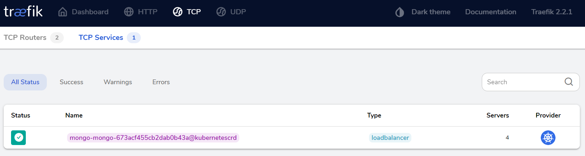

# [Kubernetes部署高可用MongoDB集群](https://www.cnblogs.com/evenchen/p/11936706.html)

在Kubernetes中，部署MongoDB主要用到的是`mongo-db-sidecar`。
[Docker Hub](https://hub.docker.com/r/cvallance/mongo-k8s-sidecar/)

### 1. 架构

Mongodb的集群搭建方式主要有三种，主从模式，Replica set模式，sharding模式, 三种模式各有优劣，适用于不同的场合，属Replica set应用最为广泛，主从模式现在用的较少，sharding模式最为完备，但配置维护较为复杂。
`mongo-db-sidecar`使用的是Replica set模式，Mongodb的Replica Set即副本集方式主要有两个目的，一个是数据冗余做故障恢复使用，当发生硬件故障或者其它原因造成的宕机时，可以使用副本进行恢复。另一个是做读写分离，读的请求分流到副本上，减轻主（Primary）的读压力。
二进制部署MongoDB集群无需其他服务，直接在主节点执行类似以下的命令即可创建集群:

```bash
cfg={ _id:"testdb", members:[ {_id:0,host:'10.0.0.31:27017',priority:2}, {_id:1,host:'10.0.0.32:27017',priority:1}, {_id:2,host:'10.0.0.33:27019',arbiterOnly:true}] };
rs.initiate(cfg)
```

------

### 2. 部署

```bash
mkdir mongo && cd mongo
```

#### 2.1 Namespace

```bash
kubectl create ns mongo
```

2.2 禁用巨页

因为 MongoDB 是建议关闭掉 Transparent Hugepage 的，否则可能导致性能下降，内存锁，甚至系统重启等问题，当然最好的还是只调整 MongoDB 的 Pod 所在的节点：

```yaml
cat << 'EOF' >hostvm-ds.yaml
apiVersion: apps/v1
kind: DaemonSet
metadata:
  name: hostvm-configurer
  namespace: mongo
  labels:
    app: startup-script
spec:
  selector:
    matchLabels:
      app: startup-script
  template:
    metadata:
      labels:
        app: startup-script
    spec:
      hostPID: true
      containers:
      - name: hostvm-configurer
        image: cnych/startup-script:v1
        securityContext:
          privileged: true
        env:
        - name: STARTUP_SCRIPT
          value: |
            #! /bin/bash
            set -o errexit
            set -o pipefail
            set -o nounset
            
            # Disable hugepages
            echo 'never' > /sys/kernel/mm/transparent_hugepage/enabled
            echo 'never' > /sys/kernel/mm/transparent_hugepage/defrag
EOF
kubectl apply -f hostvm-ds.yaml
```

#### 2.2 StorageClass

这里需要提前部署好NFS或者其他可提供SC的存储集群。

```yaml
cat << 'EOF' >mongo-clutser-sc.yaml
apiVersion: storage.k8s.io/v1
kind: StorageClass
metadata:
  name: mongodb-data
provisioner: fuseim.pri/ifs
EOF
```

#### 2.3 RBAC

```yaml
cat << 'EOF' >rbac.yaml
apiVersion: v1
kind: ServiceAccount
metadata:
  name: mongo
  namespace: mongo
---
apiVersion: rbac.authorization.k8s.io/v1beta1
kind: ClusterRoleBinding
metadata:
  name: mongo
subjects:
  - kind: ServiceAccount
    name: mongo
    namespace: mongo
roleRef:
  kind: ClusterRole
  name: cluster-admin
  apiGroup: rbac.authorization.k8s.io
EOF
```

#### 2.3 Headless Service

```yaml
cat << 'EOF' >svc.yaml
apiVersion: v1
kind: Service
metadata:
  name: mongo
  namespace: mongo
  labels:
    name: mongo
spec:
  ports:
  - port: 27017
    targetPort: 27017
  clusterIP: None
  selector:
    role: mongo
EOF
```

#### 2.4 Statefulset

```yaml
cat << 'EOF' >sfs.yaml
apiVersion: apps/v1
kind: StatefulSet
metadata:
  name: mongo
  namespace: mongo
spec:
  serviceName: mongo
  replicas: 3
  selector:
    matchLabels:
      role: mongo
      environment: staging
  template:
    metadata:
      labels:
        role: mongo
        environment: staging
        replicaset: MainRepSet
    spec:
      affinity:
        podAntiAffinity:  # 添加 Pod 反亲和性，将副本打散在不同的节点
          preferredDuringSchedulingIgnoredDuringExecution:  # 软策略
          - weight: 100
            podAffinityTerm:
              labelSelector:
                matchExpressions:
                - key: replicaset
                  operator: In
                  values:
                  - MainRepSet
              topologyKey: kubernetes.io/hostname
      terminationGracePeriodSeconds: 10
      serviceAccountName: mongo
      containers:
        - name: mongo
          image: mongo:4.0
          command:
            - mongod
            - "--wiredTigerCacheSizeGB"
            - "0.25"
            - "--bind_ip"
            - "0.0.0.0"
            - "--replSet"
            - MainRepSet
            - "--smallfiles"
            - "--noprealloc"
          ports:
            - containerPort: 27017
          volumeMounts:
            - name: mongo-data-storage
              mountPath: /data/db
          resources:
            requests:
              cpu: 1
              memory: 2Gi
        - name: mongo-sidecar
          image: cvallance/mongo-k8s-sidecar
          env:
            - name: MONGO_SIDECAR_POD_LABELS
              value: "role=mongo,environment=staging"
            - name: KUBE_NAMESPACE
              value: "mongo"
            - name: KUBERNETES_MONGO_SERVICE_NAME
              value: "mongo"
  volumeClaimTemplates:
  - metadata:
      name: mongo-data-storage
    spec:
      accessModes: ["ReadWriteOnce"]
      storageClassName: mongodb-data
      resources:
        requests:
          storage: 10Gi
EOF
```

这里我们给 Mongo 的 Pod 添加了一个 sidecar 容器，主要用于副本集的配置，该 sidecar 会每5s检查一次新成员。通过几个环境变量配置指定了 Pod 的标签、命名空间和 Service。

为了保证应用的稳定性，我们通过 podAntiAffinity 指定了 Pod 的反亲和性，这样可以保证不会有两个副本出现在同一个节点上。

应用资源清单

```
kubectl apply -f ./
```

#### 2.5 查看状态

```bash
[root@manage mongo]# kubectl get all -n mongo
NAME                          READY   STATUS    RESTARTS   AGE
pod/hostvm-configurer-77dtn   1/1     Running   0          20m
pod/hostvm-configurer-lp4xn   1/1     Running   0          23m
pod/mongo-0                   2/2     Running   0          14m
pod/mongo-1                   2/2     Running   0          12m
pod/mongo-2                   2/2     Running   0          8m39s

NAME            TYPE        CLUSTER-IP   EXTERNAL-IP   PORT(S)     AGE
service/mongo   ClusterIP   None         <none>        27017/TCP   14m

NAME                               DESIRED   CURRENT   READY   UP-TO-DATE   AVAILABLE   NODE SELECTOR   AGE
daemonset.apps/hostvm-configurer   2         2         2       2            2           <none>          27m

NAME                     READY   AGE
statefulset.apps/mongo   3/3     14m
```

查看集群状态，发现状态已经正常，集群创建成功：

```yaml
kubectl exec -it mongo-0 -n mongo -- mongo
MainRepSet:PRIMARY> rs.status()
{
	"set" : "MainRepSet",
	"date" : ISODate("2020-08-09T13:35:47.232Z"),
	"myState" : 1,
	"term" : NumberLong(1),
	"syncingTo" : "",
	"syncSourceHost" : "",
	"syncSourceId" : -1,
	"heartbeatIntervalMillis" : NumberLong(2000),
	"optimes" : {
		"lastCommittedOpTime" : {
			"ts" : Timestamp(1596980141, 1),
			"t" : NumberLong(1)
		},
		"readConcernMajorityOpTime" : {
			"ts" : Timestamp(1596980141, 1),
			"t" : NumberLong(1)
		},
		"appliedOpTime" : {
			"ts" : Timestamp(1596980141, 1),
			"t" : NumberLong(1)
		},
		"durableOpTime" : {
			"ts" : Timestamp(1596980141, 1),
			"t" : NumberLong(1)
		}
	},
	"lastStableCheckpointTimestamp" : Timestamp(1596980131, 1),
	"electionCandidateMetrics" : {
		"lastElectionReason" : "electionTimeout",
		"lastElectionDate" : ISODate("2020-08-09T13:22:31.343Z"),
		"electionTerm" : NumberLong(1),
		"lastCommittedOpTimeAtElection" : {
			"ts" : Timestamp(0, 0),
			"t" : NumberLong(-1)
		},
		"lastSeenOpTimeAtElection" : {
			"ts" : Timestamp(1596979351, 1),
			"t" : NumberLong(-1)
		},
		"numVotesNeeded" : 1,
		"priorityAtElection" : 1,
		"electionTimeoutMillis" : NumberLong(10000),
		"newTermStartDate" : ISODate("2020-08-09T13:22:31.345Z"),
		"wMajorityWriteAvailabilityDate" : ISODate("2020-08-09T13:22:31.376Z")
	},
	"members" : [
		{
			"_id" : 0,
			"name" : "mongo-0.mongo.mongo.svc.cluster.local:27017",
			"health" : 1,
			"state" : 1,
			"stateStr" : "PRIMARY",
			"uptime" : 873,
			"optime" : {
				"ts" : Timestamp(1596980141, 1),
				"t" : NumberLong(1)
			},
			"optimeDate" : ISODate("2020-08-09T13:35:41Z"),
			"syncingTo" : "",
			"syncSourceHost" : "",
			"syncSourceId" : -1,
			"infoMessage" : "",
			"electionTime" : Timestamp(1596979351, 2),
			"electionDate" : ISODate("2020-08-09T13:22:31Z"),
			"configVersion" : 4,
			"self" : true,
			"lastHeartbeatMessage" : ""
		},
		{
			"_id" : 1,
			"name" : "mongo-1.mongo.mongo.svc.cluster.local:27017",
			"health" : 1,
			"state" : 2,
			"stateStr" : "SECONDARY",
			"uptime" : 584,
			"optime" : {
				"ts" : Timestamp(1596980141, 1),
				"t" : NumberLong(1)
			},
			"optimeDurable" : {
				"ts" : Timestamp(1596980141, 1),
				"t" : NumberLong(1)
			},
			"optimeDate" : ISODate("2020-08-09T13:35:41Z"),
			"optimeDurableDate" : ISODate("2020-08-09T13:35:41Z"),
			"lastHeartbeat" : ISODate("2020-08-09T13:35:47.175Z"),
			"lastHeartbeatRecv" : ISODate("2020-08-09T13:35:47.171Z"),
			"pingMs" : NumberLong(0),
			"lastHeartbeatMessage" : "",
			"syncingTo" : "mongo-0.mongo.mongo.svc.cluster.local:27017",
			"syncSourceHost" : "mongo-0.mongo.mongo.svc.cluster.local:27017",
			"syncSourceId" : 0,
			"infoMessage" : "",
			"configVersion" : 4
		},
		{
			"_id" : 2,
			"name" : "mongo-2.mongo.mongo.svc.cluster.local:27017",
			"health" : 1,
			"state" : 2,
			"stateStr" : "SECONDARY",
			"uptime" : 564,
			"optime" : {
				"ts" : Timestamp(1596980141, 1),
				"t" : NumberLong(1)
			},
			"optimeDurable" : {
				"ts" : Timestamp(1596980141, 1),
				"t" : NumberLong(1)
			},
			"optimeDate" : ISODate("2020-08-09T13:35:41Z"),
			"optimeDurableDate" : ISODate("2020-08-09T13:35:41Z"),
			"lastHeartbeat" : ISODate("2020-08-09T13:35:47.012Z"),
			"lastHeartbeatRecv" : ISODate("2020-08-09T13:35:46.677Z"),
			"pingMs" : NumberLong(0),
			"lastHeartbeatMessage" : "",
			"syncingTo" : "mongo-0.mongo.mongo.svc.cluster.local:27017",
			"syncSourceHost" : "mongo-0.mongo.mongo.svc.cluster.local:27017",
			"syncSourceId" : 0,
			"infoMessage" : "",
			"configVersion" : 4
		}
	],
	"ok" : 1,
	"operationTime" : Timestamp(1596980141, 1),
	"$clusterTime" : {
		"clusterTime" : Timestamp(1596980141, 1),
		"signature" : {
			"hash" : BinData(0,"AAAAAAAAAAAAAAAAAAAAAAAAAAA="),
			"keyId" : NumberLong(0)
		}
	}
}          
```

#### 2.6 扩容

如果需要对mongo扩容，只需要调整statefulset的replicas即可：

```
kubectl scale statefulset mongo --replicas=4 -n mongo
```

------

### 3. 使用/内访问

mongo cluster访问默认连接为：

```
mongodb://mongo1,mongo2,mongo3:27017/dbname_?
```

在kubernetes中最常用的FQDN连接服务的连接为：

```
#appName.$HeadlessServiceName.$Namespace.svc.cluster.local
```

因为我们采用statefulset部署的pod，所以命名均有规则，所以实际上如果连接4副本的mongodb cluster，上面的默认连接该为（默认为namespace之外）：

```
mongodb://mongo-0.mongo.mongo.svc.cluster.local:27017,mongo-1.mongo.mongo.svc.cluster.local:27017,mongo-2.mongo.mongo.svc.cluster.local:27017,mongo-3.mongo.mongo.svc.cluster.local:27017/?replicaSet=rs0
```

### 4.外部访问

集群外部访问 mongo，可以为这些 Pod 部署一些内部的负载均衡器，或者使用 nginx-ingress、traefik 这些 Ingress 控制器来创建 Ingress 暴露出去。

#### 41 Traefik v2.2 版本支持tcp，采用Traefik暴露 mongo 服务

```bash
cat << 'EOF' >ingressroute-tcp.yaml
apiVersion: traefik.containo.us/v1alpha1
kind: IngressRouteTCP
metadata:
  name: mongo
  namespace: mongo
spec:
  entryPoints:
    - mongo
  routes:
  - match: HostSNI(`*`)
    services:
    - name: mongo
      port: 27017
EOF
```

由于 Traefik 暴露 TCP 服务需要 SNI 的支持，我们这里没有指定特定的域名，所以需要通过一个专门的入口点 mongo 来暴露，需要在 Traefik 中声明并开启这个入口点，类似于下面的这样静态配置：

```yaml
......
- name: mongo
  containerPort: 27017
  hostPort: 27017
args:
- --entryPoints.mongo.Address=:27017
......
```

#### 4.2创建IngressRouteTCP 对象即可：

```yaml
kubectl apply -f ingressroute-tcp.yaml
```



#### 4.3、添加DNS解析

```bash
mongo	60 IN A 10.0.0.50
```

4.4 添加slb上添加tcp转发(nginx.conf)

```bash
......
stream {
......
    upstream socket_proxy_mongo {
        hash $remote_addr consistent;
        server 10.0.0.41:27017 max_fails=3 fail_timeout=10s;
        server 10.0.0.42:27017 max_fails=3 fail_timeout=10s;
        server 10.0.0.43:27017 max_fails=3 fail_timeout=10s;
    }
    server {
       listen 27017;
       proxy_connect_timeout 1s;
       proxy_timeout 3s;
       proxy_pass socket_proxy_mongo;
    }
}
```

#### 4.4、模拟外部访问

```bash
docker run --rm -it mongo:4.0 /bin/bash

root@c6809cff4cff:/# mongo mongo.wzxmt.com:27017
MongoDB shell version v4.0.19
connecting to: mongodb://mongo.wzxmt.com:27017/test?gssapiServiceName=mongodb
Implicit session: session { "id" : UUID("8dddfa78-7bb3-411a-b919-35aad0809e66") }
MongoDB server version: 4.0.19
Welcome to the MongoDB shell.
......
MainRepSet:SECONDARY> 
```

#### 4.5 带 TLS 证书的 TCP

上面我们部署的 mongo 是一个普通的服务，然后用 Traefik 代理的，但是有时候为了安全 mongo 服务本身还会使用 TLS 证书的形式提供服务：

安装go

```bash
yum install -y go
```

下载minica并编译

```bash
git clone https://github.com/jsha/minica.git
cd minica
go build
mv minica /usr/bin/
```

生成 mongo tls 证书的脚本文件

```shell
mkdir -p mogo-tls && cd mogo-tls
cat << 'EOF' >generate-certificates.sh
#!/bin/bash
# From https://medium.com/@rajanmaharjan/secure-your-mongodb-connections-ssl-tls-92e2addb3c89
set -eu -o pipefail
DOMAINS="${1}"
CERTS_DIR="${2}"
[ -d "${CERTS_DIR}" ]
CURRENT_DIR="$(cd "$(dirname "${0}")" && pwd -P)"
GENERATION_DIRNAME="$(echo "${DOMAINS}" | cut -d, -f1)"
rm -rf "${CERTS_DIR}/${GENERATION_DIRNAME:?}" "${CERTS_DIR}/certs"
echo "== Checking Requirements..."
command -v go >/dev/null 2>&1 || echo "Golang is required"
command -v minica >/dev/null 2>&1 || go get github.com/jsha/minica >/dev/null
echo "== Generating Certificates for the following domains: ${DOMAINS}..."
cd "${CERTS_DIR}"
minica --ca-cert "${CURRENT_DIR}/minica.pem" --ca-key="${CURRENT_DIR}/minica-key.pem" --domains="${DOMAINS}"
mv "${GENERATION_DIRNAME}" "certs"
cat certs/key.pem certs/cert.pem > certs/mongo.pem
EOF
```

生成证书

```bash
bash generate-certificates.sh mongo.wzxmt.com .
== Checking Requirements...
== Generating Certificates for the following domains: mongo.wzxmt.com...
```

生成secret

```shell
[root@supper mogo-tls]# kubectl -n mongo create secret tls traefik-mongo-certs --cert=certs/cert.pem --key=certs/key.pem
secret/traefik-mongo-certs created
```

然后重新更新 `IngressRouteTCP` 对象，增加 TLS 配置：

```yaml
cat << 'EOF' >mongo-ingressroute-tcp-tls.yaml
apiVersion: traefik.containo.us/v1alpha1
kind: IngressRouteTCP
metadata:
  name: mongo-traefik-tcp
  namespace: mongo
spec:
  entryPoints:
    - mongo
  routes:
  - match: HostSNI(`mongo.wzxmt.com`)
    services:
    - name: mongo
      port: 27017
  tls: 
    secretName: traefik-mongo-certs
EOF
kubectl apply -f mongo-ingressroute-tcp-tls.yaml
```

带上证书来进行连接：

```shell
[root@supper test]# docker run --rm -it -v /root/test/mogo-tls/:/tmp/ mongo:4.0 /bin/bash
root@879ef3caec5d:/# mongo --host mongo.wzxmt.com --port 27017 --ssl --sslCAFile=/tmp/minica.pem --sslPEMKeyFile=/tmp/certs/mongo.pem
MongoDB shell version v4.0.22
connecting to: mongodb://mongo.wzxmt.com:27017/?gssapiServiceName=mongodb
Implicit session: session { "id" : UUID("b6e6fd52-f31a-4a6e-8ad0-45cf109afa87") }
MongoDB server version: 4.0.22
Server has startup warnings:
...
MainRepSet:PRIMARY>
```


