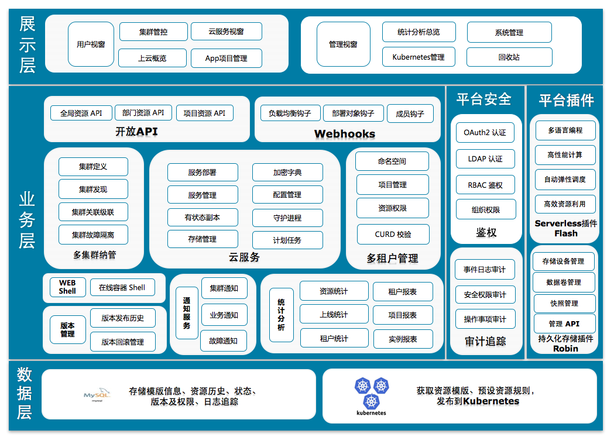

## 简介

​        [Wayne](https://github.com/Qihoo360/wayne.git) 是一个通用的、基于 Web 的 Kubernetes 多集群管理平台。通过可视化 Kubernetes 对象模板编辑的方式，降低业务接入成本， 拥有完整的权限管理系统，适应多租户场景，是一款适合企业级集群使用的发布平台。

​         Wayne已大规模服务于360搜索，承载了内部绝大部分业务，稳定管理了近千个业务，上万个容器，运行了两年多时间，经受住了生产的考验。

## Features

- 基于 RBAC（Role based access control）的权限管理：用户通过角色与部门和项目关联，拥有部门角色允许操作部门资源，拥有项目角色允许操作项目资源，更加适合多租户场景。
- 简化 Kubernetes 对象创建：提供基础 Kubernetes 对象配置文件添加方式，同时支持高级模式直接编辑 Json/Yaml文件创建 Kubernetes 对象。
- LDAP/OAuth 2.0/DB 多种登录模式支持：集成企业级 LDAP 登录及 DB 登录模式，同时还可以实现 OAuth2 登录。
- 支持多集群、多租户：可以同时管理多个 Kubernetes 集群，并针对性添加特定配置，更方便的多集群、多租户管理。
- 提供完整审计模块：每次操作都会有完整的审计功能，追踪用于操作历史，同时支持用户自定义 webhook。
- 提供基于 APIKey 的开放接口调用：用户可自主申请相关 APIKey 并管理自己的部门和项目，运维人员也可以申请全局 APIKey 进行特定资源的全局管理。
- 保留完整的发布历史：用户可以便捷的找到任何一次历史发布，并可轻松进行回滚，以及基于特定历史版本更新 Kubernetes 资源。
- 具备完善的资源报表：用户可以轻松获取各项目的资源使用占比和历史上线频次（天级）以及其他基础数据的报表和图表。
- 提供基于严密权限校验的 Web shell：用户可以通过 Web shell 的形式进入发布的 Pod 进行操作，自带完整的权限校验。
- 提供站内通知系统：方便管理员推送集群、业务通知和故障处理报告等。

## 架构图

整体采用前后端分离的方案，其中前端采用 Angular 框架进行数据交互和展示，使用Ace编辑器进行 Kubernetes 资源模版编辑。后端采用 Beego 框架做数据接口处理，使用 Client-go 与 Kubernetes 进行交互，数据使用 MySQL 存储。



## 组件

- Web UI: 提供完整的业务开发和平台运维功能体验。
- Worker: 扩展一系列基于消息队列的功能，例如 Audit 和 Webhooks 等审计组件。

## k8s部署

创建名称空间

```bash
kubectl create ns wayne
```

mysql

```yaml
cat << 'EOF' >mysql.yaml
apiVersion: apps/v1
kind: Deployment
metadata:
  name: mysql-wayne
  namespace: wayne
  labels:
    app: mysql-wayne
spec:
  replicas: 1
  selector:
    matchLabels:
      app: mysql-wayne
  template:
    metadata:
      labels:
        app: mysql-wayne
    spec:
      containers:
      - name: mysql
        image: 'mysql:5.6.41'
        env:
        - name: MYSQL_ROOT_PASSWORD
          value: root
        resources:
          limits:
            cpu: '1'
            memory: 2Gi
          requests:
            cpu: '1'
            memory: 2Gi
---
apiVersion: v1
kind: Service
metadata:
  labels:
    app: mysql-wayne
  name: mysql-wayne
  namespace: wayne
spec:
  ports:
  - port: 3306
    protocol: TCP
    targetPort: 3306
  selector:
    app: mysql-wayne
EOF
```

backend

```yaml
cat<< 'EOF' >wayne-backend.yaml
apiVersion: v1
kind: ConfigMap
metadata:
  labels:
    app: wayne-backend
  name: wayne-backend
  namespace: wayne
data:
  app.conf: |-
    appname = wayne
    httpport = 8080
    runmode = prod
    autorender = false
    copyrequestbody = true
    EnableDocs = true
    EnableAdmin = true
    StaticDir = public:static

    # Custom config
    ShowSql = false

    ## if enable username and password login
    EnableDBLogin = true

    # token, generate jwt token
    RsaPrivateKey = "./apikey/rsa-private.pem"
    RsaPublicKey = "./apikey/rsa-public.pem"

    # token end time. second
    TokenLifeTime=86400

    # kubernetes labels config
    AppLabelKey= wayne-app
    NamespaceLabelKey = wayne-ns
    PodAnnotationControllerKindLabelKey = wayne.cloud/controller-kind

    # database configuration:
    ## mysql
    DBName = "wayne"
    DBTns = "tcp(mysql-wayne:3306)"
    DBUser = "root"
    DBPasswd = "root"
    DBConnTTL = 30

    # web shell auth
    appKey = "860af247a91a19b2368d6425797921c6"

    # Set demo namespace and group id
    DemoGroupId = "1"
    DemoNamespaceId = "1"

    # Sentry
    LogLevel = "4"
    SentryEnable = false
    SentryDSN = ""
    SentryLogLevel = "4"

    # Robin
    EnableRobin = false

    # api-keys
    EnableApiKeys = true

    # Bus
    BusEnable = false

    # Webhook
    EnableWebhook = true
    WebhookClientTimeout = 10
    WebhookClientWindowSize = 16
---
apiVersion: apps/v1
kind: Deployment
metadata:
  labels:
    app: wayne-backend
  name: wayne-backend
  namespace: wayne
spec:
  replicas: 1
  selector:
    matchLabels:
      app: wayne-backend
  template:
    metadata:
      labels:
        app: wayne-backend
    spec:
      volumes:
      - name: config
        configMap:
          name: wayne-backend
      containers:
      - name: wayne
        image: '360cloud/wayne-backend:v1.8.6'
        command:
        - /opt/wayne/backend
        - apiserver
        env:
        - name: GOPATH  # app.conf runmode = dev must set GOPATH
          value: /go
        resources:
          limits:
            cpu: '0.5'
            memory: 1Gi
          requests:
            cpu: '0.5'
            memory: 1Gi
        volumeMounts:
        - name: config
          mountPath: /opt/wayne/conf/
        readinessProbe:
          httpGet:
            path: healthz
            port: 8080
          timeoutSeconds: 1
          periodSeconds: 10
          failureThreshold: 3
        imagePullPolicy: Always
---
apiVersion: v1
kind: Service
metadata:
  labels:
    app: wayne-backend
  name: wayne-backend
  namespace: wayne
spec:
  ports:
  - port: 8080
    protocol: TCP
    targetPort: 8080
  selector:
    app: wayne-backend
EOF
```

frontend

```yaml
cat<< 'EOF' >wayne-frontend.yaml
apiVersion: v1
kind: ConfigMap
metadata:
  labels:
    app: wayne-frontend
  name: wayne-frontend
  namespace: wayne
data:
  config.js: |-
    window.CONFIG = {
      URL: 'http://wayne-backend.wzxmt.com',
      RAVEN: false,
      RAVEN_DSN: 'RAVEN_DSN'
    };
---
apiVersion: apps/v1
kind: Deployment
metadata:
  labels:
    app: wayne-frontend
  name: wayne-frontend
  namespace: wayne
spec:
  replicas: 1
  selector:
    matchLabels:
      app: wayne-frontend
  template:
    metadata:
      labels:
        app: wayne-frontend
    spec:
      volumes:
      - name: config
        configMap:
          name: wayne-frontend
          items:
          - key: config.js
            path: config.js
      containers:
      - name: wayne
        image: '360cloud/wayne-frontend:latest'
        resources:
          limits:
            cpu: '0.5'
            memory: 1Gi
          requests:
            cpu: '0.5'
            memory: 1Gi
        volumeMounts:
        - name: config
          mountPath: /usr/local/openresty/nginx/html/config.js
          subPath: config.js
        imagePullPolicy: Always
---
apiVersion: v1
kind: Service
metadata:
  labels:
    app: wayne-frontend
  name: wayne-frontend
  namespace: wayne
spec:
  ports:
  - port: 80
    protocol: TCP
    targetPort: 80
  selector:
    app: wayne-frontend
EOF
```

ingress

```yaml
cat<< 'EOF' >wayne-ingress.yaml
apiVersion: traefik.containo.us/v1alpha1
kind: IngressRoute
metadata:
  name: wayne-frontend
  namespace: wayne
spec:
  entryPoints:
    - web
  routes:
  - match: Host(`wayne.wzxmt.com`) && PathPrefix(`/`)
    kind: Rule
    services:
    - name: wayne-frontend
      port: 80
---
apiVersion: traefik.containo.us/v1alpha1
kind: IngressRoute
metadata:
  name: wayne-backend
  namespace: wayne
spec:
  entryPoints:
    - web
  routes:
  - match: Host(`wayne-backend.wzxmt.com`) && PathPrefix(`/`)
    kind: Rule
    services:
    - name: wayne-backend
      port: 8080
EOF
```

部署

```
kubectl apply -f ./
```

