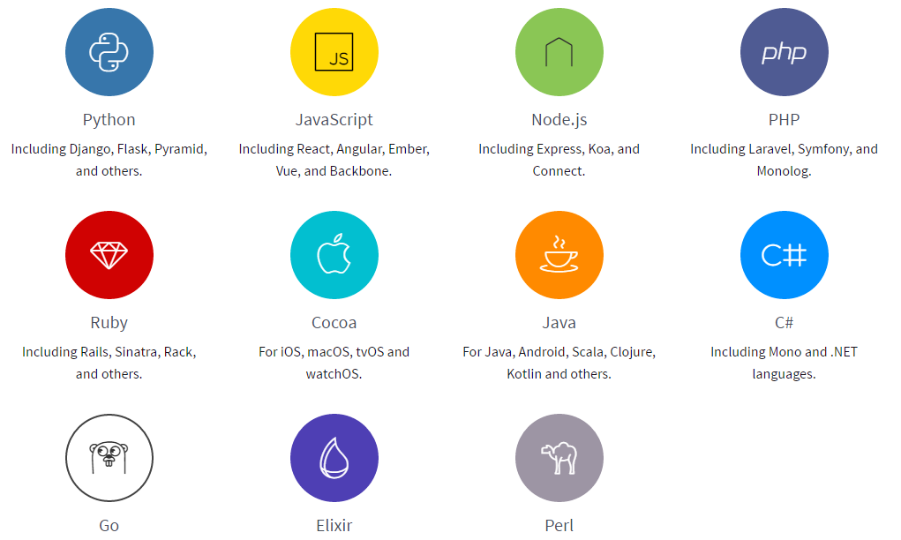
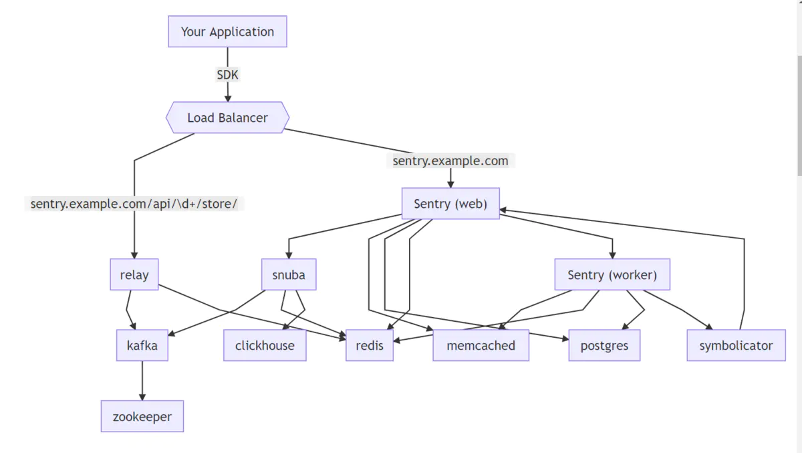
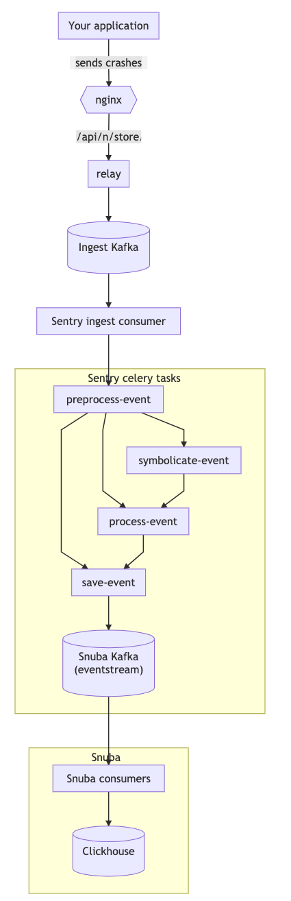
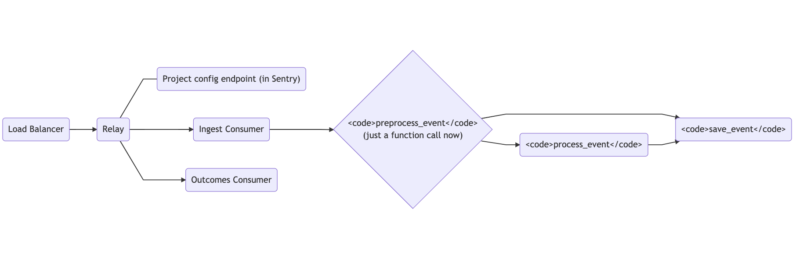

# 1、sentry 简介

sentry 是一个开源的实时错误监控的项目，它支持很多端的配置，包括 web 前端、服务器端、移动端及其游戏端。支持各种语言，例如 python、oc、java、node、javascript 等。也可以应用到各种不同的框架上面，如前端框架中的vue 、angular 、react 等最流行的前端框架。提供了github、slack、trello 的常见的开发工具的集成。可以自己安装并且搭建 sentry 应用。

**支持的语言：**

# 2、sentry架构

**边线表示 Sentry 服务依赖关系图**



如何保存事件



通过 Relay 的事件路径

1、Loadbalancer（负载均衡器）负责路由转发，错误上报转发到 /api/\d+/store ，其他项目、成员、错误管理功能由 Sentry Web 负责。这一层承担数据入口、展示的作用
 2、Relay 负责消息中继转发，并把数据先汇集到 Kafka；Snuba 负责接收 SentryWeb 的请求，进行数据的聚合、搜索；Sentry Worker 则是一个队列服务，主要负责数据的存储。
 3、Kafka 作为消息队列，ClickHouse 负责接近实时的数据分析，Redis（主要） 和 Memcached 负责项目配置、错误基础信息的存储和统计。Postgres 承担基础数据持久化（主要是项目、用户权限管理等）Symbolicator 主要用于错误信息格式化。
 4、Zookeeper是Kafka用于节点信息同步-，如果我们设置了多个 ClickHouse 节点，也可以用它来保存主从同步信息或者做分布式表。

# 3、搭建sentry服务

### 部署local-path

```yaml
cat << 'EOF' >local-path.yaml
apiVersion: v1
kind: Namespace
metadata:
  name: local-path-storage
---
apiVersion: v1
kind: ServiceAccount
metadata:
  name: local-path-provisioner-service-account
  namespace: local-path-storage
---
apiVersion: rbac.authorization.k8s.io/v1
kind: ClusterRole
metadata:
  name: local-path-provisioner-role
rules:
  - apiGroups: [ "" ]
    resources: [ "nodes", "persistentvolumeclaims", "configmaps" ]
    verbs: [ "get", "list", "watch" ]
  - apiGroups: [ "" ]
    resources: [ "endpoints", "persistentvolumes", "pods" ]
    verbs: [ "*" ]
  - apiGroups: [ "" ]
    resources: [ "events" ]
    verbs: [ "create", "patch" ]
  - apiGroups: [ "storage.k8s.io" ]
    resources: [ "storageclasses" ]
    verbs: [ "get", "list", "watch" ]
---
apiVersion: rbac.authorization.k8s.io/v1
kind: ClusterRoleBinding
metadata:
  name: local-path-provisioner-bind
roleRef:
  apiGroup: rbac.authorization.k8s.io
  kind: ClusterRole
  name: local-path-provisioner-role
subjects:
  - kind: ServiceAccount
    name: local-path-provisioner-service-account
    namespace: local-path-storage
---
kind: ConfigMap
apiVersion: v1
metadata:
  name: local-path-config
  namespace: local-path-storage
data:
  config.json: |-
    {
            "nodePathMap":[
            {
                    "node":"DEFAULT_PATH_FOR_NON_LISTED_NODES",
                    "paths":["/data/local-path-data"]
            }
            ]
    }
  setup: |-
    #!/bin/sh
    while getopts "m:s:p:" opt
    do
        case $opt in
            p)
            absolutePath=$OPTARG
            ;;
            s)
            sizeInBytes=$OPTARG
            ;;
            m)
            volMode=$OPTARG
            ;;
        esac
    done
    mkdir -m 0777 -p ${absolutePath}
  teardown: |-
    #!/bin/sh
    while getopts "m:s:p:" opt
    do
        case $opt in
            p)
            absolutePath=$OPTARG
            ;;
            s)
            sizeInBytes=$OPTARG
            ;;
            m)
            volMode=$OPTARG
            ;;
        esac
    done
    rm -rf ${absolutePath}
  helperPod.yaml: |-
    apiVersion: v1
    kind: Pod
    metadata:
      name: helper-pod
    spec:
      containers:
      - name: helper-pod
        image: busybox
        imagePullPolicy: IfNotPresent
---
apiVersion: apps/v1
kind: Deployment
metadata:
  name: local-path-provisioner
  namespace: local-path-storage
spec:
  replicas: 1
  selector:
    matchLabels:
      app: local-path-provisioner
  template:
    metadata:
      labels:
        app: local-path-provisioner
    spec:
      serviceAccountName: local-path-provisioner-service-account
      containers:
        - name: local-path-provisioner
          image: rancher/local-path-provisioner:v0.0.19
          imagePullPolicy: IfNotPresent
          command:
            - local-path-provisioner
            - --debug
            - start
            - --config
            - /etc/config/config.json
          volumeMounts:
            - name: config-volume
              mountPath: /etc/config/
          env:
            - name: POD_NAMESPACE
              valueFrom:
                fieldRef:
                  fieldPath: metadata.namespace
      volumes:
        - name: config-volume
          configMap:
            name: local-path-config
---
apiVersion: storage.k8s.io/v1
kind: StorageClass
metadata:
  name: sentry-local-path
provisioner: rancher.io/local-path
volumeBindingMode: WaitForFirstConsumer
reclaimPolicy: Delete
EOF
kubectl apply -f local-path.yaml
```

### 部署sentry

添加repo

```bash
helm repo add sentry https://sentry-kubernetes.github.io/charts
helm repo update
helm search repo sentry
```

nodeport

```bash
helm -n sentry install sentry sentry/sentry --version 12.0.0 \
--set nginx.service.type=NodePort,nginx.service.nodePorts.http=8000 \
--set user.email=develop@bridge5.asia,user.password=Bridge5Sentry \
--set mail.host=smtp.exmail.qq.com,mail.port=465,mail.username=develop@bridge5.asia,mail.password=bridge5 \
--set filestore.filesystem.persistence.storageClass=sentry-local-path \
--set redis.master.persistence.storageClass=sentry-local-path \
--set redis.replica.persistence.storageClass=sentry-local-path \
--set postgresql.persistence.storageClass=sentry-local-path \
--set kafka.persistence.storageClass=sentry-local-path \
--set kafka.zookeeper.persistence.storageClass=sentry-local-path \
--set rabbitmq.persistence.storageClass=sentry-local-path \
--set clickhouse.clickhouse.persistentVolumeClaim.dataPersistentVolume.storageClassName=sentry-local-path \
--set rabbitmq.ulimitNofiles=20480 \
--wait
```

ingress负载

```bash
helm -n sentry install sentry sentry/sentry --version 12.0.0 \
--set ingress.enabled=true,ingress.hostname=alpha-sentry.bridge5.asia,service.type=ClusterIP \
--set user.email=develop@bridge5.asia,user.password=Bridge5Sentry \
--set mail.host=smtp.exmail.qq.com,mail.port=465,mail.username=develop@bridge5.asia,mail.password=ltz \
--set filestore.filesystem.persistence.storageClass=sentry-local-path \
--set redis.master.persistence.storageClass=sentry-local-path \
--set redis.replica.persistence.storageClass=sentry-local-path \
--set postgresql.persistence.storageClass=sentry-local-path \
--set kafka.persistence.storageClass=sentry-local-path \
--set kafka.zookeeper.persistence.storageClass=sentry-local-path \
--set rabbitmq.persistence.storageClass=sentry-local-path \
--set clickhouse.clickhouse.persistentVolumeClaim.dataPersistentVolume.storageClassName=sentry-local-path \
--set rabbitmq.ulimitNofiles=20480 \
--wait 
```

等待初始化完成，即可开启监控之旅，使用nodeport方式，需要nginx代理转发到80或者443上，要不然服务会调用异常。

# 4、官方Sentry服务

如果要使用官方的Sentry服务，我们只需去它的[官网](https://sentry.io/welcome/)注册就行，一般是配合企业用户使用的付费模式。


# 5、创建项目

登陆后我们会进入我们的监控项目的界面，如：　点击右上角的 add new project ，我们可以创建一个新的项目


这里可以选择项目的配置，语言以及框架，选择自己的项目类型

输入项目名称，点击 create project 。确定创建新项目。


 点击红框框的，创建一个简单的日志。　

错误信息页面，可以自行到官网上面去了解更多信息。

# 6、前端部署，注入监控代码 

获取项目的链接：　

在项目的首页点击 install 会进入当前图示页面

我们复制 sentry DSN 到我们前端配置中 

引用 sentry ，注入配置到我们的应用中：　 

 这里是以 react 为例，我们在 react 的根组建的 componentDidCatch 上面捕获错误，并且上传到我们监控系统中。这里的我们用 sentry DSN 配置我们的 sentry 并且初始化 sentry 项目。 到这里我们基本，已经完成了我们的前端错误监控日志系统了。

## sentry 操作界面介绍

项目操作页面：


1、项目的查看选项

　　Issue ： 问题列表

　　overview ： 概况纵览

　　userfeedback ： 用户反馈

　　Resleases ： 版本列表信息

　　setting ： 项目设置

2、问题筛选


　　包括 ： 指派自己的 、 标记列表 、需要分类的 、 今天的 、 未处理的


 　设置为 解决 、 忽略 、 合并 、标记 、实时监控 

## sentry 的api介绍和使用

### 1、javascript SDK 引用与配置

现在有两种方法引用 sentry SDK :

#### 直接引用：

最快的方法就是通过 script 标签引用我们的 sdk 

```
<script src="https://browser.sentry-cdn.com/4.4.1/bundle.min.js" crossorigin="anonymous"></script>
```

然后就是配置了。

```
Sentry.init({ dsn: 'https://<key>@sentry.io/<project>' });
```

#### npm 包引用：

首先是用添加包 @sentry/browser@4.4.1

```
yarn add @sentry/browser@4.4.1
```

引用到项目中，并且配置

```
import * as Sentry from '@sentry/browser';
Sentry.init({ dsn: 'https://<key>@sentry.io/<project>' });
```

### 2、捕获事件

#### 主动捕获错误或者异常

sentry 常见的是错误捕获，可以根据平台的不同来捕获错误，并且可以传递不同的错误信息。

```
try {
    aFunctionThatMightFail();
} catch (err) {
    Sentry.captureException(err);
}<br>Sentry.captureException(new Error('test'))
```

#### 捕获消息

另一种常见操作是捕获裸信息。消息只是应该发送给Sentry的一些文本信息。　　　　

```
Sentry.captureMessage('Something went wrong');
```

### 3、初始化配置

sentry SDK 可以通过很多方式进行配置。

主要配置初始化配置的函数为 init() 方法，通过向 init() 方法传递参数对象;　

```
Sentry.init({
  dsn: 'https://<key>@sentry.io/<project>',
  maxBreadcrumbs: 50,
  debug: true,
})
```

常用参数：

DSN ：项目的地址，用于收集错误信息的 sentry 分配的地址

debug ：是否开启 debug 模式，开启debug，就会把信息打印到控制台上面

release ： 代码的版本号

release 版本号，可以确定当前的错误/异常属于哪一个发布的版本,可以应用到 sourcemaps 来映射源码

environment : 环境名称

sampleRate : 是否开启随机发送事件给 sentry ，1为100%，0.1 为 10%几率发送事件

attachStacktrace ： 是否开启堆栈跟踪，开启后跟着消息一起收集

beforeSend : 发送前操作

### 4、sentry 的api

captureException(exception) : 捕获一个 js 异常，传入一个 exception 对象或者类对象。

captureMessage(message,level) : 捕获一条信息，传入信息内容和信息级别

captureEvent(sentryEvent) : 捕获一个事件，sentryEvent 是手动创建的，自定义的

addBreadcrumb(Breadcrumb) ： 添加一个面包屑，以供接下里的捕获

configureScope((scope)=>{}) : 设置 context 信息到 scope 上面

withScope((scope)=>{}) : 设置一个零时的 scope 信息到 context 上面

### 5、context 上下文信息

上下文信息包括 ：user 、 tags 、 level 、fingerprint 、 extra data

这些信息我们可以通过在 scope 上面设置来定义。

其中可以通过两种方法得到 scope 。

```
// 将 scope 配置到 context 上面
Sentry.configureScope((scope) => { }); <br>
// 创建一个零时到 scope ，配置到 context 上面
Sentry.withScope((scope) => { });
```

### User

```
scope.setUser({
       id:'1',
       username:'xiao',
       ip_address:'127.0.0.1',
       email: 'test.doe@example.com' ,
     });
```

通过 setUser 来设置 User 信息。

其中 user 可以设置的信息包括 id 、 username 、 ip_address 、email

### Tags

tags 是给事件定义不同的键/值对，可以在查找的时候更容易。

后台查找的时候，查找选项会多出来一个选项，就是通过 tags 来设置的。

```
scope.setTag("page_local", "de-at");
```

通过 setTag 来设置了一个page_local 的标签。

后台会多一个 page_local 选项。包括 de-at

### level

通过这个来设置事件的严重性。

包括：fatal 、error 、 warning 、 info 、 debug 。( fatal : 严重，error 错误，error 为默认 )

```
scope.setLevel('warning');
```

通过 setLevel 来设置。

### Fingerprint 

指纹，通过指纹把信息分到不同的组中 　

### Extra Data

传入额外的信息。并不会创建索引(也就是不可以提供来检索)。

```
scope.setExtra("character_name", "Mighty Fighter");
```

通过 setExtra 来设置。

### 6、Breadcurumbs 面包屑　　

面包屑用于记录一系列当行为，当下一次发生错误事件上传当时候会随着一起上报。

浏览器 javascript sdk 将自动记录所有当位置更改。

```
Sentry.addBreadcrumb({
  category: 'auth',
  message: 'Authenticated user ' + user.email,
  level: 'info'
});
```

我们可以通过 addBreadcrumb 来添加一次行为记录。

### 7、user Feedback

用户反馈，sentry 提供了一个客户反馈当窗口。

当错误发生当时候，可以弹出窗口收集一些信息，例如：

用户名

用户当邮件地址

发生的问题的描述等。

```
Sentry.showReportDialog();
```

通过 showReportDialog 来实现框架的弹出。

## sentry实现预警并且邮件提醒

邮件预警和邮件提醒是在生产环境中不可缺少的一部分，只有有效的提醒来能让我们最快的解决问题。

在项目中选择 setting --> alerts 进入邮件预警设置页面。


这里都是基本的邮件规则。

在 tabs 中的 rule 可以自定规则。


 　规则设置：


An event is seen ： 一个事件发生的时候

An issue is first seen ： 第一个发生错误的时候

An issue changes state from resolved to unresolved ：问题从解决到未解决的时候

An event's tags match {key} {match} {value} ： 匹配到 tags 的键值对的时候发送

An issue is seen more than {value} times in {interval} ：在固定时间内出现次数匹配的时候

An issue is seen by more than {value} users in {interval} ：在固定时间内出现用户的次数匹配的时候

An event's {attribute} value {match} {value} ： 匹配到某一个事件的时候

An event's level is {match} {level} ： 事件级别匹配的时候

## sentry 生产的 sourcemap 配置 

### 介绍

现在开发很多时候，我们的代码都会利用构建工具对代码合并、压缩、混淆等。在产生这些生产代码的时候，为了利于我们开发调试、bug修复会产生一个 sourcemap 。sourecmap 的主要作用就是将我们的打包的代码前后最了一个关联。这里，sentry 对生产的 sourcemap 有很好的处理，它可以很快的让我们确定代码的错误位置。

### 准备工作 

首先我们需要添加 sentry 的命令行的管理工具 sentry-cli

```
npm i -g @sentry/cli<br>``// 上面的不行就用下面的``npm install -g @sentry/cli --unsafe-perm　
```

### 获取认证的 token 

选择API后就可以生成token，记得勾选 project:write 权限。


这里的 token 是用于登陆的。　

### 登陆

```
sentry-cli --url myserver login
```

回车后输入上一步获得的 token 即可

### 创建版本 

```
sentry-cli releases -o 组织 -p 项目 ``new` `release@1.1.0
```

-o : 组织，可以在我们的 Organization Settings 中找到

-p : 项目名称 ， 可以在 projuct 中找到

release@1.1.0 : 发布的版本号，可以自定义，这个后需要在应用配置的时候传入

配置 release 到应用　　　

```
Sentry.init({`` ``dsn: ``'http://18ac34902da74aa29a4328879a58fb0d@localhost:9000/2'``,`` ``release: ``'release@1.1.0'``,``});
```

### 上传 sourcemap 文件

```
sentry-cli releases -o 组织 -p 项目 files release@1.1.0 upload-sourcemaps jspath文件所在目录 --url-prefix 线上资源URI
```

-o , -p : 和上文一样

jspath : js 文件的位置

uri : js 文件相对于域名的位置

**特殊说明 url-prefix**

这里是必须传的，不传找不到 map 文件，例如：你的 js 线上的地址为 ：https://test.com/static/js/test.js这个时候 url-prefix 应该为 ： '~/static/js/'

## 配置文件

配置文件，在命令行操作的时候，sentry 支持配置文件。

配置文件默认文命令的目录。

配置文件 .sentryclirc

```
[auth]
token=1a59c94sdfsdfs33b5588b27bd3628c98ff2837c054b4503be089ad623620527
 
[defaults]
url=http://localhost:9000
project=react-test
org=test
```

配置之后就不需要在输入项目名称和地址了。

## 总结步骤：

#### 1、注册账号 、创建项目 

直接登陆 sentry 官网，注册账号，并且创建一个项目

#### 2、在项目中配置 sentry 

```
Sentry.init({
  dsn: 'http://18ac34902da74aa29a4328879a58fb0d@localhost:9000/2',
  release: RELEASE_VERSION,
});
```

#### 3、打包时候上传sourcemap文件

#### 4、配置邮件预警