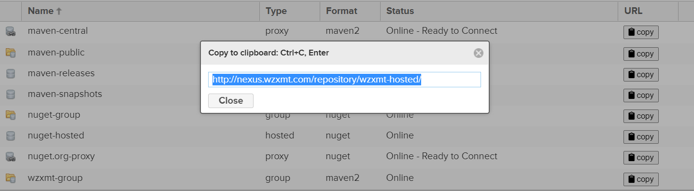

## 一、nexus3是什么？

nexus3是一个统一的仓库系统，可以作为nuget、docker、maven、npm等的仓库，可以使用一个平台管理。

## 二、部署nexus3

拉取镜像

```bash
docker pull sonatype/nexus3
docker tag sonatype/nexus3 harbor.wzxmt.com/infra/nexus3:latest
docker push harbor.wzxmt.com/infra/nexus3:latest
```

创建目录

```bash
mkdir nexus3 /data/nfs-volume/nexus-data && cd nexus3
```

pv

```yaml
cat << EOF >pv.yaml 
apiVersion: v1
kind: PersistentVolume
metadata:
  name: nexus-data-pv
spec:
  capacity:
    storage: 20Gi
  volumeMode: Filesystem
  accessModes:
    - ReadWriteMany
  persistentVolumeReclaimPolicy: Retain
  storageClassName: nfs
  nfs:
    path: /data/nfs-volume/nexus-data
    server: 10.0.0.20
EOF
```

pvc

```yaml
cat << 'EOF' >pvc.yaml
apiVersion: v1
kind: PersistentVolumeClaim
metadata:
  name: nexus-data-pvc
  namespace: infra
spec:
  accessModes:
    - ReadWriteMany
  volumeMode: Filesystem
  resources:
    requests:
      storage: 20Gi
  storageClassName: nfs
EOF
```

dp

```yaml
cat << 'EOF' >dp.yaml
apiVersion: apps/v1
kind: Deployment
metadata:
  name: nexus
  namespace: infra
  labels:
    app: nexus
spec:
  strategy:
    type: RollingUpdate
    rollingUpdate: 
      maxUnavailable: 1
      maxSurge: 1
  replicas: 1
  selector:
    matchLabels:
      app: nexus
  template:
    metadata:
      labels:
        app: nexus
    spec:
      containers:
      - name: nexus
        imagePullPolicy: IfNotPresent
        image: harbor.wzxmt.com/infra/nexus3:latest
        ports:
        -  containerPort: 8081
        -  containerPort: 8082
        resources:
          limits:
            cpu: 1000m
            memory: 2Gi
          requests:
            cpu: 500m
            memory: 512Mi
        volumeMounts:
        - name: nexus-data
          mountPath: /nexus-data
        - name: date
          mountPath: /etc/localtime
        securityContext:
          runAsUser: 0     #设置以ROOT用户运行容器
          privileged: true #拥有特权
      volumes:
        - name: date
          hostPath:
            path: /etc/localtime
            type: ''
        - name: nexus-data
          persistentVolumeClaim:
            claimName: nexus-data-pvc
      imagePullSecrets:
      - name: harborlogin
EOF
```

Service

```yaml
cat << 'EOF' >svc.yaml
apiVersion: v1
kind: Service
metadata:
  name: nexus-svc
  namespace: infra
spec:
  selector:
    app: nexus
  type: ClusterIP
  ports:
    - name: nexus
      protocol: TCP
      port: 8081
      targetPort: 8081
    - name: docker
      protocol: TCP
      port: 8082
      targetPort: 8082
EOF
```

ingress

```yaml
cat << 'EOF' >ingress.yaml
apiVersion: traefik.containo.us/v1alpha1
kind: IngressRoute
metadata:
  name: nexus-web
  namespace: infra
spec:
  entryPoints:
    - web
  routes:
  - match: Host(`nexus.wzxmt.com`) && PathPrefix(`/`)
    kind: Rule
    services:
    - name: nexus-svc
      port: 8081
---
apiVersion: traefik.containo.us/v1alpha1
kind: IngressRoute
metadata:
  name: nexus-docker
  namespace: infra
spec:
  entryPoints:
    - web
  routes:
  - match: Host(`docker.wzxmt.com`) && PathPrefix(`/`)
    kind: Rule
    services:
    - name: nexus-svc
      port: 8082
EOF
```

部署

```
kubectl apply -f ./
```

访问http://nexus.wzxmt.com


登录
点击右上角 Sign in，输入用户名admin，密码登录进入

初始密码需从配置文件中查看。

```
cat /data/nfs-volume/nexus-data/admin.password
e2200911-b814-4c61-86b0-fe6e8766b1fb
```

登录成功后，会提示修改密码，完成后进入如下界面，至此Nexus安装成功。

## 三、配置mvn私服

### 1、基本概念


本地仓库（hosted），通常会部署自己的构件到这一类型的仓库。比如公司的第二方库。
代理仓库（proxy），用来代理远程的公共仓库，如maven中央仓库。
仓库组（group），合并多个hosted/proxy仓库，当项目在多个repository使用资源时就不需要多次引用了，只需要引用一个group即可。

### 2、设定文件存储目录


### 3、创建代理仓库


创建页面出来之后，页面上有三个信息必填的：
阿里云远程仓库地址：
http://maven.aliyun.com/nexus/content/groups/public/


### 4、创建本地仓库


### 5、创建仓库组


注意：需要将hosted【本地仓库】的顺序放在proxy【代理仓库】之前，因为一个group【组仓库】中可以涵括这些本地仓库和代理仓库。而一整个的group是作为一个public，一个接口给别人使用的。所以当查找jar包的时候，如果代理仓库在前面，那就是先从远程去查找jar，而不是先从本地仓库去查找是否有jar。

至此，我们私服的配置已经完成，看下整体效果

### 6、设置所有人都可访问

### 7、让Maven项目使用私服

（1）修改Maven配置文件
在Maven配置文件setting.xml中添加仓库组接口地址

配置文件修改内容如下：

```xml
  <!--配置Maven本地仓库的地址为自定义的地址-->
  <localRepository>C:\apache-maven-3.6.1\repository</localRepository>
  -------------------------------------------------------------------
  <!--Nexus服务器-->
  <!--手动上传第三方jar到Nexus，repositoryId会用到这里的id属性-->
  <servers>
    <server>
        <id>wzxmtnexus</id>
        <!--Nexus登录用户名-->
        <username>admin</username>
        <!--Nexus登录密码-->
        <password>xxxxxxx</password>
    </server>
  </servers>
  -------------------------------------------------------------------
  <!--组仓库的url地址  id和name自定义，mirrorOf的值设置为central，写死-->
  <mirrors>
    <mirror>
        <id>wzxmtnexus</id>
        <name>wzxmt Nexus</name>
        <url>http://nexus.wzxmt.com/repository/wzxmt-group/</url>
        <mirrorOf>central</mirrorOf>
    </mirror>
  </mirrors>
```

（2）Maven项目不需要修改

Maven项目中pom.xml文件不需要改变，以前怎么用，现在还怎么用。

（3）测试私服


添加一个原本本地仓库中没有下载过的jar包，pom.xml文件中添加如下依赖

```xml
<dependency>
    <groupId>org.apache.commons</groupId>
    <artifactId>commons-csv</artifactId>
    <version>1.8</version>
</dependency>
```

然后保存pom.xml文件之后，刷新Maven项目

点开查看：


点开查看：

```
find /data/nfs-volume/nexus-data/blobs/mvn-store/ -name '*85c94914-5f7e-4f60-8beb-0edfcc11b371*'
```

可以看出Nexus是将下载下来的所有文件都转化成了byte文件。
至此，Maven私服搭建，以及使用Maven项目使用私服已经全部连通。

### 8、用命令上传第三方jar包

（1）Maven配置文件修改
Maven配置文件setting.xml修改内容如下（前面已经说过）

```xml
  <!--Nexus服务器-->
  <!--手动上传第三方jar到Nexus，repositoryId会用到这里的id属性-->
  <servers>
    <server>
        <id>mkznexus</id>
        <!--Nexus登录用户名-->
        <username>admin</username>
        <!--Nexus登录密码-->
        <password>xxxxxxx</password>
    </server>
  </servers>
```

（2）Maven命令

```
mvn deploy:deploy-file -DgroupId=com.ibm.db2 -DartifactId=db2jcc -Dversion=2.0.1 -Dpackaging=jar -Dfile=F:\jar\db2\db2jcc.jar -Durl=http://nexus.wzxmt.com/repository/wzxmt-hosted/ -DrepositoryId=wzxmtnexus
```

命令解释：

```
-DgroupId=com.ibm.db2　　　　 　　　　　　　　　　#自定义
-DartifactId=db2jcc　　　 　　　　　　　　　　　　#自定义
-Dversion=2.0.1　　　　　　 　　　　　　　　　　　#自定义  三个自定义，构成pom.xml文件中的坐标
-Dpackaging=jar　　　　　　　　　　　　　　　　　　#上传的类型是jar类型
-Dfile=F:\jar\db2\db2jcc.jar　　　　　　　　　　　#jar的本地磁盘位置
-Durl=http://nexus.wzxmt.com/repository/wzxmt-hosted/　　　#hosted资源库的地址，下图中
-DrepositoryId=mkznexus　　　　　　　　　　　　　　　　#setting.xml文件中配置的ID，对应1中的ID
```

上传完成，在Nexus中查看一下：


上传成功！

（3）在项目引用

### 9、Maven项目自动上传jar

（1）修改pom.xml文件，增加如下内容

```
<distributionManagement>
    <repository>
        <!--Maven的setting.xml文件中配置的ID-->
        <id>mkznexus</id>
        <name>Mkz Nexus</name>
        <!--Nexus本地仓库地址-->
        <url>http://nexus.wzxmt.com/repository/wzxmt-hosted/</url>
    </repository>
</distributionManagement>
```

（2）导入第三方jar的命令

```
mvn install:install-file -Dfile=D:\jar\transaction-springcloud-4.2.0-SNAPSHOT.jar -DgroupId=com.codingapi -DartifactId=transaction-springcloud -Dversion=4.2.0-SNAPSHOT -Dpackaging=jar
```

（3）导入第三方pom文件的命令

```
mvn install:install-file -Dfile=D:\jar\tx-lcn-4.2.0-SNAPSHOT.pom -DgroupId=com.codi
```

## 四、配置docker私服

跟mvn私服类似

### 1、创建blob存储

登陆之后，先创建一个用于存储镜像的空间。


然后保存。

### 2、创建一个hosted类型的docker仓库


Hosted类型仓库用作我们的私有仓库，替代harbor的功能。


开发环境，我们运行重复发布，因此Delpoyment policy 我们选择Allow redeploy。

### 3、创建一个proxy类型的docker仓库

proxy类型仓库，可以帮助我们访问不能直接到达的网络，如另一个私有仓库，或者国外的公共仓库，如官方的dockerhub镜像库。Remote Storage: docker hub的proxy，这里填写: [https://registry-1.docker.io](http://www.eryajf.net/go?url=https://registry-1.docker.io) 这个是官方默认的一个链接


### 4、创建一个group类型的docker仓库

group类型的docker仓库，是一个聚合类型的仓库。它可以将前面我们创建的3个仓库聚合成一个URL对外提供服务，可以屏蔽后端的差异性，实现类似透明代理的功能。
最终效果


到这儿，nexus在docker这一块是部署已经完成了

