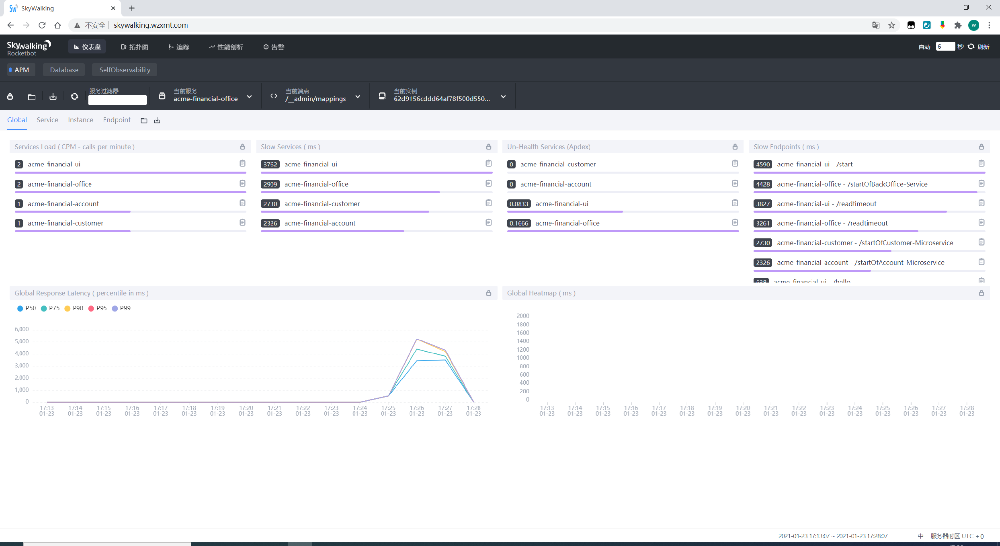
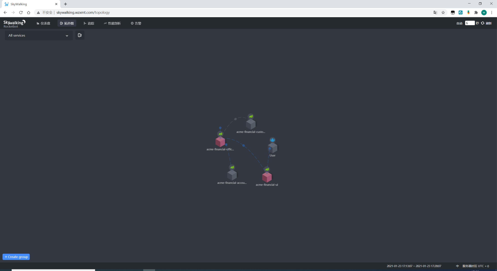
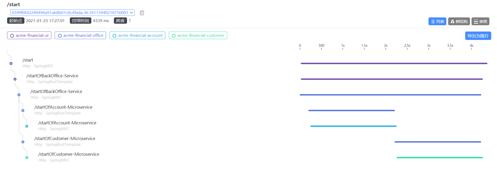
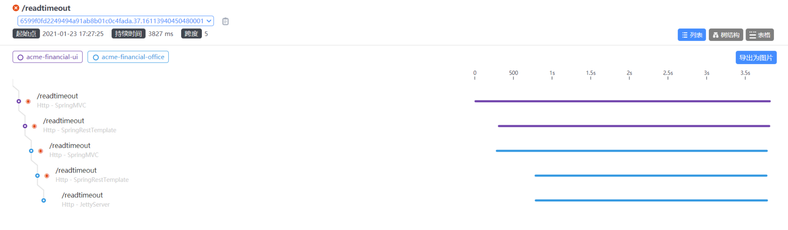

# kubernetes部署skywalking集群和JAVA服务的接入

# 1 概述：

## 1.1 环境

版本信息如下：
a、操作系统：centos 7.6
a、skywalking版本：v8.0.1
c、kubernetes版本：v1.18.14
d、es版本：6.4.3
e、helm版本： helm3

## 1.2 skywalking概述

### 1.2.1 skywalking是什么

SkyWalking是一个开源的APM系统，为云原生分布式系统提供监控、链路追踪、诊断能力，支持集成多种编程语言的应用（java、php、go、lua等），也能和服务网格进行集成。除了支持代码侵入方式的集成，一个主要亮点也支持零代码入侵的集成（零代码侵入是和具体的编程语言相关的），是利用java agent的特性在jvm级别修改了运行时的程序，因此程序员在代码编辑期间不需要修改业务代码也能达到埋点的效果。后端存储支持es、mysql、tidb等多种数据库。
架构图如下：


### 1.2.1 skywalking的java代理的使用

1）方式1：命令行方式

```bash
java -javaagent:/agent/skywalking-agent.jar \
-Dskywalking.agent.service_name=app \
-Dskywalking.collector.backend_service=localhost:11800 \
-jar myapp.jar
```

2）方式2：环境变量方式

```bash
export SW_AGENT_COLLECTOR_BACKEND_SERVICES=10.0.0.1:11800
export SW_AGENT_NAME=demo
export JAVA_OPTS=-javaagent:/agent/skywalking-agent.jar

java $JAVA_OPTS -jar myapp.jar
```

# 2 部署前置条件：

k8s集群部署（略）

# 3 部署方式：

## 3.1 helm

#### 创建名称空间

```bash
kubectl create ns skywalking
```

#### 1 下载skywalking包

```bash
git clone https://github.com/apache/skywalking-kubernetes
cd skywalking-kubernetes/chart
helm repo add elastic https://helm.elastic.co
helm dep up skywalking
```

#### 2 部署SkyWalking 8.1.0 & Elasticsearch 7.5.1

```bash
helm install skywalking skywalking -n skywalking \
  --set oap.image.tag=8.1.0-es7 \
  --set oap.storageType=elasticsearch7 \
  --set ui.image.tag=8.1.0 \
  --set elasticsearch.imageTag=7.5.1
```

#### 3 trafik暴露服务

```yaml
cat << 'EOF' >skywalking-ingress.yaml
apiVersion: traefik.containo.us/v1alpha1
kind: IngressRoute
metadata:
  name: traefik-skywalking-dashboard
  namespace: skywalking
spec:
  entryPoints:
    - web
  routes:
  - match: Host(`skywalking.wzxmt.com`)
    kind: Rule
    services:
    - name: skywalking-ui
      namespace: skywalking
      port: 80
EOF
kubectl apply -f skywalking-ingress.yaml
```

#### 4 访问：[skywalking.wzxmt.com](http://skywalking.wzxmt.com)

## 3.2 deploy部署

###  1 部署es集群

拉取镜像并推送至私有仓库

```bash
docker pull apache/skywalking-oap-server:8.1.0-es7
docker pull apache/skywalking-ui:8.1.0
docker pull docker.elastic.co/elasticsearch/elasticsearch:7.5.1
docker tag apache/skywalking-oap-server:8.1.0-es7 harbor.wzxmt.com/infra/skywalking-oap-server:8.1.0-es7
docker tag apache/skywalking-ui:8.1.0 harbor.wzxmt.com/infra/skywalking-ui:8.1.0
docker tag docker.elastic.co/elasticsearch/elasticsearch:7.5.1 harbor.wzxmt.com/infra/elasticsearch:7.5.1
docker push harbor.wzxmt.com/infra/skywalking-oap-server:8.1.0-es7
docker push harbor.wzxmt.com/infra/skywalking-ui:8.1.0
docker push harbor.wzxmt.com/infra/elasticsearch:7.5.1
```

创建docker-registry

```bash
kubectl create namespace es
kubectl create secret docker-registry harborlogin \
--namespace=es  \
--docker-server=https://harbor.wzxmt.com \
--docker-username=admin \
--docker-password=admin
```

StorageClass

```yaml
cat<< 'EOF' >sc.yaml
apiVersion: storage.k8s.io/v1
kind: StorageClass
metadata:
  name: es-data-storage
  namespace: es
provisioner: fuseim.pri/ifs
EOF
```

rbac

```yaml
cat<< 'EOF' > rbac.yaml
apiVersion: v1
kind: ServiceAccount
metadata:
  labels:
    app: "elasticsearch-master"
  name: elasticsearch-admin
  namespace: es
---
apiVersion: rbac.authorization.k8s.io/v1
kind: ClusterRoleBinding
metadata:
  name: elasticsearch-admin
  labels:
    app: "elasticsearch-master"
roleRef:
  apiGroup: rbac.authorization.k8s.io
  kind: ClusterRole
  name: cluster-admin
subjects:
  - kind: ServiceAccount
    name: elasticsearch-admin
    namespace: es
EOF
```

PodDisruptionBudget

```yaml
cat<< 'EOF' > elasticsearch-poddisruptionbudget.yaml
apiVersion: policy/v1beta1
kind: PodDisruptionBudget
metadata:
  name: "elasticsearch-master-pdb"
  namespace: es
spec:
  maxUnavailable: 1
  selector:
    matchLabels:
      app: "elasticsearch-master"
EOF
```

StatefulSet

```yaml
cat<< 'EOF' >statefulset.yaml
apiVersion: apps/v1
kind: StatefulSet
metadata:
  name: elasticsearch-master
  namespace: es
  labels:
    app: "elasticsearch-master"
  annotations:
    esMajorVersion: "7"
spec:
  serviceName: elasticsearch-master-headless
  selector:
    matchLabels:
      app: "elasticsearch-master"
  replicas: 3
  podManagementPolicy: Parallel
  updateStrategy:
    type: RollingUpdate
  template:
    metadata:
      name: "elasticsearch-master"
      labels:
        app: "elasticsearch-master"
    spec:
      imagePullSecrets:
      - name: harborlogin
      serviceAccountName: elasticsearch-admin
      securityContext:
        fsGroup: 1000
        runAsUser: 1000
      affinity:
        podAntiAffinity:
          requiredDuringSchedulingIgnoredDuringExecution:
          - labelSelector:
              matchExpressions:
              - key: app
                operator: In
                values:
                - "elasticsearch-master"
            topologyKey: kubernetes.io/hostname
      terminationGracePeriodSeconds: 120
      volumes:
      initContainers:
      - name: configure-sysctl
        securityContext:
          runAsUser: 0
          privileged: true
        image: harbor.wzxmt.com/infra/elasticsearch:7.5.1
        imagePullPolicy: "IfNotPresent"
        command: ["sysctl", "-w", "vm.max_map_count=262144"]
      containers:
      - name: "elasticsearch"
        securityContext:
          capabilities:
            drop:
            - ALL
          runAsNonRoot: true
          runAsUser: 1000
        image: harbor.wzxmt.com/infra/elasticsearch:7.5.1
        imagePullPolicy: "IfNotPresent"
        readinessProbe:
          failureThreshold: 3
          initialDelaySeconds: 10
          periodSeconds: 10
          successThreshold: 3
          timeoutSeconds: 5
          exec:
            command:
              - sh
              - -c
              - |
                #!/usr/bin/env bash -e
                # If the node is starting up wait for the cluster to be ready (request params: 'wait_for_status=green&timeout=1s' )
                # Once it has started only check that the node itself is responding
                START_FILE=/tmp/.es_start_file

                http () {
                    local path="${1}"
                    if [ -n "${ELASTIC_USERNAME}" ] && [ -n "${ELASTIC_PASSWORD}" ]; then
                      BASIC_AUTH="-u ${ELASTIC_USERNAME}:${ELASTIC_PASSWORD}"
                    else
                      BASIC_AUTH=''
                    fi
                    curl -XGET -s -k --fail ${BASIC_AUTH} http://127.0.0.1:9200${path}
                }

                if [ -f "${START_FILE}" ]; then
                    echo 'Elasticsearch is already running, lets check the node is healthy and there are master nodes available'
                    http "/_cluster/health?timeout=0s"
                else
                    echo 'Waiting for elasticsearch cluster to become cluster to be ready (request params: "wait_for_status=green&timeout=1s" )'
                    if http "/_cluster/health?wait_for_status=green&timeout=1s" ; then
                        touch ${START_FILE}
                        exit 0
                    else
                        echo 'Cluster is not yet ready (request params: "wait_for_status=green&timeout=1s" )'
                        exit 1
                    fi
                fi
        ports:
        - name: http
          containerPort: 9200
        - name: transport
          containerPort: 9300
        resources:
          limits:
            cpu: 1000m
            memory: 2Gi
          requests:
            cpu: 100m
            memory: 2Gi
        env:
          - name: node.name
            valueFrom:
              fieldRef:
                fieldPath: metadata.name
          - name: cluster.initial_master_nodes
            value: "elasticsearch-master-0,elasticsearch-master-1,elasticsearch-master-2,"
          - name: discovery.seed_hosts
            value: "elasticsearch-master-headless"
          - name: cluster.name
            value: "elasticsearch"
          - name: network.host
            value: "0.0.0.0"
          - name: ES_JAVA_OPTS
            value: "-Xmx1g -Xms1g"
          - name: node.data
            value: "true"
          - name: node.ingest
            value: "true"
          - name: node.master
            value: "true"
        volumeMounts: 
        - name: es-data-storage
          mountPath: /usr/share/elasticsearch/data
  volumeClaimTemplates:
  - metadata:
      name: es-data-storage
      namespace: es
    spec:
      accessModes: 
      - ReadWriteOnce
      storageClassName: es-data-storage
      resources:
        requests:
          storage: 10Gi
EOF
```

svc

```yaml
cat<< 'EOF' > service.yaml
kind: Service
apiVersion: v1
metadata:
  name: elasticsearch-master
  namespace: es
  labels:
    app: "elasticsearch-master"
spec:
  type: ClusterIP
  selector:
    app: "elasticsearch-master"
  ports:
  - name: http
    protocol: TCP
    port: 9200
  - name: transport
    protocol: TCP
    port: 9300
---
kind: Service
apiVersion: v1
metadata:
  name: elasticsearch-master-headless
  namespace: es
  labels:
    app: "elasticsearch-master"
  annotations:
    service.alpha.kubernetes.io/tolerate-unready-endpoints: "true"
spec:
  clusterIP: None # This is needed for statefulset hostnames like elasticsearch-0 to resolve
  # Create endpoints also if the related pod isn't ready
  publishNotReadyAddresses: true
  selector:
    app: "elasticsearch-master"
  ports:
  - name: http
    port: 9200
  - name: transport
    port: 9300
EOF
```

部署es

```
kubectl apply -f ./
```

测试集群健康

```yaml
cat<< 'EOF' > test-elasticsearch-health.yaml
apiVersion: v1
kind: Pod
metadata:
  name: "skywalking-bnqep-test"
  namespace: es
spec:
  containers:
  - name: "skywalking-zpnfv-test"
    image: harbor.wzxmt.com/infra/elasticsearch:7.5.1
    command:
      - "sh"
      - "-c"
      - |
        #!/usr/bin/env bash -e
        curl -XGET --fail 'elasticsearch-master:9200/_cluster/health?wait_for_status=green&timeout=1s'
  restartPolicy: Never
MANIFEST:
EOF
kubectl apply -f test-elasticsearch-health.yaml
```

看到以下，表示集群正常

```bash
[root@supper ~]# kubectl logs skywalking-bnqep-test -n es
  % Total    % Received % Xferd  Average Speed   Time    Time     Time  Current
                                 Dload  Upload   Total   Spent    Left  Speed
100   389  100   389    0     0  38133      0 --:--:-- --:--:-- --:--:-- 38900
{"cluster_name":"elasticsearch","status":"green","timed_out":false,"number_of_nodes":3,"number_of_data_nodes":3,"active_primary_shards":0,"active_shards":0,"relocating_shards":0,"initializing_shards":0,"unassigned_shards":0,"delayed_unassigned_shards":0,"number_of_pending_tasks":0,"number_of_in_flight_fetch":0,"task_max_waiting_in_queue_millis":0,"active_shards_percent_as_number":100.0}
```

### 2 部署skywalking集群

创建docker-registry

```bash
kubectl create namespace skywalking
kubectl create secret docker-registry harborlogin \
--namespace=skywalking  \
--docker-server=https://harbor.wzxmt.com \
--docker-username=admin \
--docker-password=admin
```

#### 准备oap资源清单

rbac

```yaml
cat << 'EOF' >oap-rbac.yaml
#serviceaccount
apiVersion: v1
kind: ServiceAccount
metadata:
  labels:
    app: skywalking
    component: "oap" 
  name: skywalking-oap
  namespace: skywalking
---
#oap-role
kind: Role
apiVersion: rbac.authorization.k8s.io/v1
metadata:
  name: skywalking
  namespace: skywalking
  labels:
    app: skywalking
rules:
  - apiGroups: [""]
    resources: ["pods","configmaps"]
    verbs: ["get", "watch", "list"]
---
#oap-rolebinding
apiVersion: rbac.authorization.k8s.io/v1
kind: RoleBinding
metadata:
  name: skywalking
  namespace: skywalking
  labels:
    app: skywalking
roleRef:
  apiGroup: rbac.authorization.k8s.io
  kind: Role
  name: skywalking
subjects:
  - kind: ServiceAccount
    name: skywalking-oap
    namespace: skywalking
EOF
```

deployment

```yaml
cat << 'EOF' >oap-deployment.yaml
apiVersion: apps/v1
kind: Deployment
metadata:
  labels:
    app: skywalking
    component: "oap"
  name: skywalking-oap
  namespace: skywalking
spec:
  replicas: 2
  selector:
    matchLabels:
      app: skywalking
      component: "oap"
  template:
    metadata:
      labels:
        app: skywalking
        component: "oap"
    spec:
      serviceAccountName: skywalking-oap
      affinity:
        podAntiAffinity:
          preferredDuringSchedulingIgnoredDuringExecution:
          - weight: 1
            podAffinityTerm:
              topologyKey: kubernetes.io/hostname
              labelSelector:
                matchLabels:
                  app: "skywalking"    
                  component: "oap"
      initContainers:
      - name: wait-for-elasticsearch
        image: busybox:1.30
        imagePullPolicy: IfNotPresent
        command: ['sh', '-c', 'for i in $(seq 1 60); do nc -z -w3 elasticsearch-master.es 9200 && exit 0 || sleep 5; done; exit 1']
      containers:
      - name: oap
        image: harbor.wzxmt.com/infra/skywalking-oap-server:8.1.0-es7
        imagePullPolicy: IfNotPresent
        livenessProbe:
          tcpSocket:
            port: 12800
          initialDelaySeconds: 15
          periodSeconds: 20
        readinessProbe:
          tcpSocket:
            port: 12800
          initialDelaySeconds: 15
          periodSeconds: 20
        ports:
        - containerPort: 11800
          name: grpc
        - containerPort: 12800
          name: rest
        env:
        - name: JAVA_OPTS
          value: "-Dmode=no-init -Xmx2g -Xms2g"
        - name: SW_CLUSTER
          value: kubernetes
        - name: SW_CLUSTER_K8S_NAMESPACE
          value: "skywalking"
        - name: SW_CLUSTER_K8S_LABEL
          value: "app=skywalking,component=oap"
        - name: SKYWALKING_COLLECTOR_UID
          valueFrom:
            fieldRef:
              fieldPath: metadata.uid
        - name: SW_STORAGE
          value: elasticsearch7
        - name: SW_STORAGE_ES_CLUSTER_NODES
          value: "elasticsearch-master.es:9200"
        volumeMounts:
      volumes:
      imagePullSecrets:
      - name: harborlogin
EOF
```

svc

```yaml
cat << 'EOF' >oap-svc.yaml
apiVersion: v1
kind: Service
metadata:
  name: skywalking-oap
  namespace: skywalking
  labels:
    app: skywalking
    component: "oap"
spec:
  type: ClusterIP
  ports:
  - port: 12800
    name: rest
  - port: 11800
    name: grpc
  selector:
    app: skywalking
    component: "oap"
EOF
```

#### 部署oap

```
kubectl apply -f ./
```

#### 准备ui资源清单

```yaml
cat << 'EOF' >ui-deployment.yaml
apiVersion: apps/v1
kind: Deployment
metadata:
  name: skywalking-ui
  namespace: skywalking
  labels:
    app: skywalking
    component: "ui"
spec:
  replicas: 1
  selector:
    matchLabels:
      app: skywalking
      component: "ui"
  template:
    metadata:
      labels:
        app: skywalking
        component: "ui"  
    spec:
      imagePullSecrets:
      - name: harborlogin
      containers:
      - name: ui
        image: harbor.wzxmt.com/infra/skywalking-ui:8.1.0
        imagePullPolicy: IfNotPresent
        ports:
        - containerPort: 8080
          name: page
        env:
        - name: SW_OAP_ADDRESS
          value: skywalking-oap:12800
EOF
```

svc

```yaml
cat << 'EOF' >ui-svc.yaml
apiVersion: v1
kind: Service
metadata:
  labels:
    app: skywalking
    component: "ui"
  name: skywalking-ui
  namespace: skywalking
spec:
  type: ClusterIP
  ports:
    - port: 80
      targetPort: 8080
      protocol: TCP
  selector:
    app: skywalking
    component: "ui"
EOF
```

ingress

```yaml
cat << 'EOF' >skywalking-ingress.yaml
apiVersion: traefik.containo.us/v1alpha1
kind: IngressRoute
metadata:
  name: traefik-skywalking-dashboard
  namespace: skywalking
spec:
  entryPoints:
    - web
  routes:
  - match: Host(`skywalking.wzxmt.com`)
    kind: Rule
    services:
    - name: skywalking-ui
      namespace: skywalking
      port: 80
EOF
```

#### 部署ui

```
kubectl apply -f ./
```

#### 初始化es

```yaml
cat << 'EOF' >es-init.job.yaml
apiVersion: batch/v1
kind: Job
metadata:
  name: "skywalking-es-init"
  namespace: skywalking
  labels:
    app: skywalking
    component: "skywalking-job" 
spec:
  template:
    metadata:
      name: "skywalking-es-init"
      labels:
        app: skywalking
        component: "skywalking-job"  
    spec:
      restartPolicy: Never
      imagePullSecrets:
      - name: harborlogin
      initContainers:
      - name: wait-for-elasticsearch
        image: busybox:1.30
        imagePullPolicy: IfNotPresent
        command: ['sh', '-c', 'for i in $(seq 1 60); do nc -z -w3 elasticsearch-master.es 9200 && exit 0 || sleep 5; done; exit 1']
      containers:
      - name: oap
        image: harbor.wzxmt.com/infra/skywalking-oap-server:8.1.0-es7
        imagePullPolicy: IfNotPresent
        env:
        - name: JAVA_OPTS
          value: "-Xmx2g -Xms2g -Dmode=init"
        - name: SW_STORAGE
          value: elasticsearch7
        - name: SW_STORAGE_ES_CLUSTER_NODES
          value: "elasticsearch-master.es:9200"
EOF
kubectl apply -f es-init.job.yaml
```

### 3 访问web:

[http://skywalking.wzxmt.com](http://skywalking.wzxmt.com)

### 4 制作skywalking agent的init容器

下载skywalking-apm

```bash
mkdir skywalking-apm && cd skywalking-apm
wget https://archive.apache.org/dist/skywalking/8.1.0/apache-skywalking-apm-8.1.0.tar.gz
tar xf apache-skywalking-apm-8.1.0.tar.gz
```

编写Dockerfile：如下：

```bash
cat << 'EOF' >Dockerfile
FROM busybox:latest
ENV LANG=C.UTF-8
RUN set -eux && mkdir -p /opt/skywalking/agent/
ADD apache-skywalking-apm-bin/agent/ /opt/skywalking/agent/
WORKDIR /
EOF
```

执行docker build命令制作镜像，并推送至仓库。

```bash
docker build -t harbor.wzxmt.com/infra/skywalking-agent:8.1.0 .
docker push harbor.wzxmt.com/infra/skywalking-agent:8.1.0
```

### 4 部署springboot微服务

根据实际情况修改环境变量

```
SW_AGENT_COLLECTOR_BACKEND_SERVICES
```

创建docker-registry

```bash
kubectl create namespace test
kubectl create secret docker-registry harborlogin \
--namespace=test  \
--docker-server=https://harbor.wzxmt.com \
--docker-username=admin \
--docker-password=admin
```

下载测试镜像并推送到私有仓库

```bash
cat << 'EOF' >get_test_images.sh
#!/bin/bash
set -e
HARBOR_URL=harbor.wzxmt.com/infra
ALIYUN_URL=registry.cn-shenzhen.aliyuncs.com/gzlj/acme-financial
images=(customer:v0.1
account:v0.1
office:v0.1
ui:v0.1)
for imageName in ${images[@]} ; do
  docker pull $ALIYUN_URL-$imageName
  docker tag  $ALIYUN_URL-$imageName $HARBOR_URL/$imageName
  docker push $HARBOR_URL/$imageName
  docker rmi $HARBOR_URL/$imageName $ALIYUN_URL-$imageName
done
sh get_test_images.sh
```

#### 4.1 UI服务

```yaml
cat << 'EOF' >ui.yaml
apiVersion: apps/v1
kind: Deployment
metadata:
  labels:
    app: acme-financial-ui
  name: acme-financial-ui
  namespace: test
spec:
  replicas: 1
  selector:
    matchLabels:
      app: acme-financial-ui
  template:
    metadata:
      labels:
        app: acme-financial-ui
    spec:
      imagePullSecrets:
      - name: harborlogin
      initContainers:
      - image: harbor.wzxmt.com/infra/skywalking-agent:8.1.0
        name: skywalking-sidecar
        command: ["sh"]
        args: [
                "-c",
                "mkdir -p /opt/sw/agent && cp -rf /opt/skywalking/agent/* /opt/sw/agent/"
        ]
        volumeMounts:
        - name: sw-agent
          mountPath: /opt/sw/agent
      containers:
      - env:
        - name: JAVA_OPTS # 镜像中没有JAVA_OPTS这个ENV实际上这个地方不会生效
          value: "-javaagent:/opt/sw/agent/skywalking-agent.jar"
        - name: SW_AGENT_NAME
          value: "acme-financial-ui"
        - name: SW_AGENT_COLLECTOR_BACKEND_SERVICES
          value: "skywalking-oap.skywalking:11800"
        image: harbor.wzxmt.com/infra/ui:v0.1
        imagePullPolicy: Always
        name: ui
        ports:
        - containerPort: 8081
          protocol: TCP
        volumeMounts:
        - name: sw-agent
          mountPath: /opt/sw/agent      
      volumes: 
      - name: sw-agent
        emptyDir: {}

---
apiVersion: v1
kind: Service
metadata:
  labels:
    app: acme-financial-ui
  name: acme-financial-ui
  namespace: test
spec:
  ports:
  - name: http
    port: 8081
    protocol: TCP
    targetPort: 8081
  selector:
    app: acme-financial-ui
  sessionAffinity: None
  type: ClusterIP
---
apiVersion: traefik.containo.us/v1alpha1
kind: IngressRoute
metadata:
  name: traefik-test-dashboard
  namespace: test
spec:
  entryPoints:
    - web
  routes:
  - match: Host(`test.wzxmt.com`)
    kind: Rule
    services:
    - name: acme-financial-ui
      namespace: test
      port: 8081
EOF
```

#### 4.2 office服务

```yaml
cat << 'EOF' >office.yaml
apiVersion: apps/v1
kind: Deployment
metadata:
  labels:
    app: acme-financial-back-office
  name: acme-financial-back-office
  namespace: test
spec:
  replicas: 1
  selector:
    matchLabels:
      app: acme-financial-back-office
  template:
    metadata:
      labels:
        app: acme-financial-back-office
    spec:
      imagePullSecrets:
      - name: harborlogin
      initContainers:
      - image: harbor.wzxmt.com/infra/skywalking-agent:8.1.0
        name: skywalking-sidecar
        command: ["sh"]
        args: [
                "-c",
                "mkdir -p /opt/sw/agent && cp -rf /opt/skywalking/agent/* /opt/sw/agent/"
        ]
        volumeMounts:
        - name: sw-agent
          mountPath: /opt/sw/agent
      containers:
      - env:
        - name: JAVA_OPTS
          value: "-javaagent:/opt/sw/agent/skywalking-agent.jar"
        - name: SW_AGENT_NAME
          value: "acme-financial-office"
        - name: SW_AGENT_COLLECTOR_BACKEND_SERVICES
          value: "skywalking-oap.skywalking:11800"
        image: harbor.wzxmt.com/infra/office:v0.1
        imagePullPolicy: Always
        name: office
        ports:
        - containerPort: 8082
          protocol: TCP
        volumeMounts:
        - name: sw-agent
          mountPath: /opt/sw/agent      
      volumes: 
      - name: sw-agent
        emptyDir: {}
---
apiVersion: v1
kind: Service
metadata:
  labels:
    app: acme-financial-back-office
  name: acme-financial-back-office
  namespace: test
spec:
  ports:
  - name: http
    port: 8082
    protocol: TCP
    targetPort: 8082
  selector:
    app: acme-financial-back-office
  sessionAffinity: None
  type: ClusterIP
EOF
```

#### 4.3 account服务

```yaml
cat<< 'EOF' >account.yaml
apiVersion: apps/v1
kind: Deployment
metadata:
  labels:
    app: acme-financial-account
  name: acme-financial-account
  namespace: test
spec:
  replicas: 1
  revisionHistoryLimit: 10
  selector:
    matchLabels:
      app: acme-financial-account
  template:
    metadata:
      labels:
        app: acme-financial-account
    spec:
      imagePullSecrets:
      - name: harborlogin
      initContainers:
      - image: harbor.wzxmt.com/infra/skywalking-agent:8.1.0
        name: skywalking-sidecar
        command: ["sh"]
        args: [
                "-c",
                "mkdir -p /opt/sw/agent && cp -rf /opt/skywalking/agent/* /opt/sw/agent/"
        ]
        volumeMounts:
        - name: sw-agent
          mountPath: /opt/sw/agent
      containers:
      - env:
        - name: JAVA_OPTS
          value: "-javaagent:/opt/sw/agent/skywalking-agent.jar"
        - name: SW_AGENT_NAME
          value: "acme-financial-account"
        - name: SW_AGENT_COLLECTOR_BACKEND_SERVICES
          value: "skywalking-oap.skywalking:11800"
        image: harbor.wzxmt.com/infra/account:v0.1
        imagePullPolicy: Always
        name: account
        ports:
        - containerPort: 8083
          protocol: TCP
        volumeMounts:
        - name: sw-agent
          mountPath: /opt/sw/agent      
      volumes: 
      - name: sw-agent
        emptyDir: {}
---

apiVersion: v1
kind: Service
metadata:
  labels:
    app: acme-financial-account
  name: acme-financial-account
  namespace: test
spec:
  ports:
  - name: http
    port: 8083
    protocol: TCP
    targetPort: 8083
  selector:
    app: acme-financial-account
  sessionAffinity: None
  type: ClusterIP
EOF
```

#### 4.4 customer服务

```yaml
cat<< 'EOF' >customer.yaml
apiVersion: apps/v1
kind: Deployment
metadata:
  labels:
    app: acme-financial-customer
  name: acme-financial-customer
  namespace: test
spec:
  replicas: 1
  selector:
    matchLabels:
      app: acme-financial-customer
  template:
    metadata:
      labels:
        app: acme-financial-customer
    spec:
      imagePullSecrets:
      - name: harborlogin
      initContainers:
      - image: harbor.wzxmt.com/infra/skywalking-agent:8.1.0
        name: skywalking-sidecar
        command: ["sh"]
        args: [
                "-c",
                "mkdir -p /opt/sw/agent && cp -rf /opt/skywalking/agent/* /opt/sw/agent/"
        ]
        volumeMounts:
        - name: sw-agent
          mountPath: /opt/sw/agent
      containers:
      - env:
        - name: JAVA_OPTS
          value: "-javaagent:/opt/sw/agent/skywalking-agent.jar"
        - name: SW_AGENT_NAME
          value: "acme-financial-customer"
        - name: SW_AGENT_COLLECTOR_BACKEND_SERVICES
          value: "skywalking-oap.skywalking:11800"
        image: harbor.wzxmt.com/infra/customer:v0.1
        imagePullPolicy: Always
        name: customer
        ports:
        - containerPort: 8084
          protocol: TCP
        volumeMounts:
        - name: sw-agent
          mountPath: /opt/sw/agent      
      volumes: 
      - name: sw-agent
        emptyDir: {}
---
apiVersion: v1
kind: Service
metadata:
  labels:
    app: acme-financial-customer
  name: acme-financial-customer
  namespace: test
spec:
  ports:
  - name: http
    port: 8084
    protocol: TCP
    targetPort: 8084
  selector:
    app: acme-financial-customer
  sessionAffinity: None
  type: ClusterIP
EOF
```

#### 4.5 业务微服务部署结果

部署业务服务成功

```bash
[root@supper s-test]# kubectl -n test get pod,svc
NAME                                           READY   STATUS    RESTARTS   
pod/acme-financial-account-6fb7bbfbc4-nxqwg    1/1     Running   0          
pod/acme-financial-customer-6488985d6c-h26wb   1/1     Running   0          
pod/acme-financial-office-76579467fc-mtbln     1/1     Running   0          
pod/acme-financial-ui-77794686cd-x6lpm         1/1     Running   0          

NAME                                 TYPE        CLUSTER-IP     EXTERNAL-IP   PORT(S)   
service/acme-financial-account       ClusterIP   10.96.167.72   <none>        8083/TCP   
service/acme-financial-back-office   ClusterIP   10.96.230.86   <none>        8082/TCP   
service/acme-financial-customer      ClusterIP   10.96.97.4     <none>        8084/TCP   
service/acme-financial-ui            ClusterIP   10.96.88.0     <none>        8081/TCP   
```

# 5 访问springboot业务微服务并查看skywalking

## 5.1 访问UI服务的三个接口

通过http://test.wzxmt.com/访问UI服务的三个接口：/hello、/start、/readtimeout。

## 5.2 访问skywalking的UI界面

打开skywalking的界面（192.168.39.33:16622），即可看见链路追踪相关的数据。



