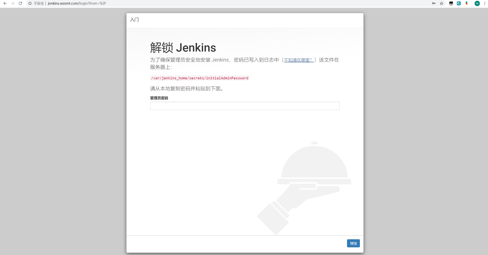
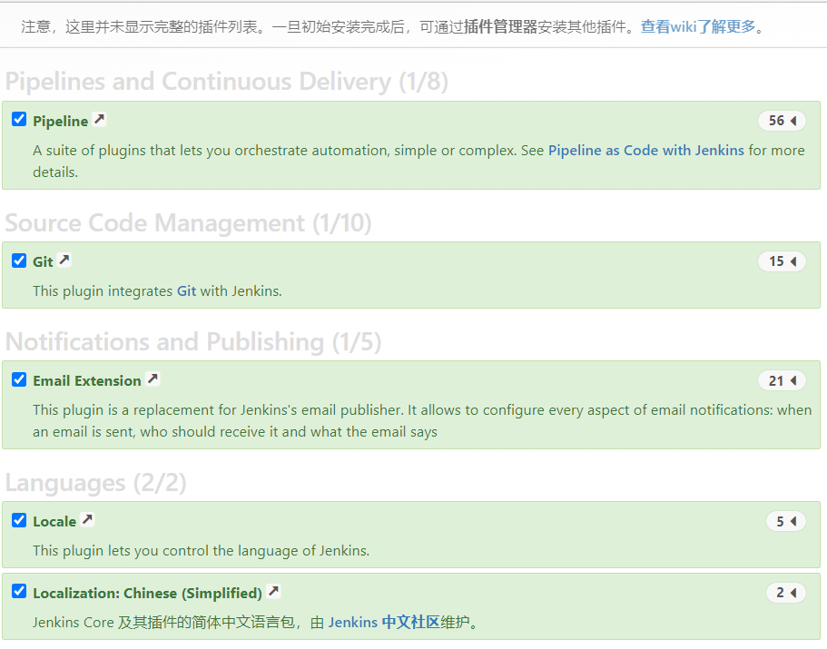
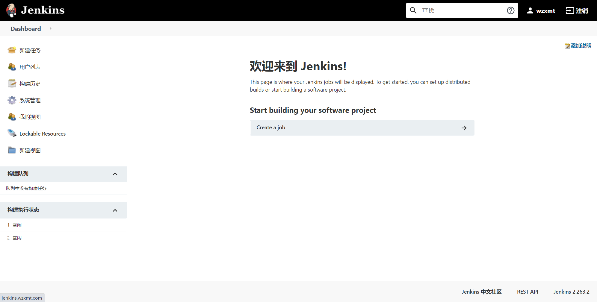
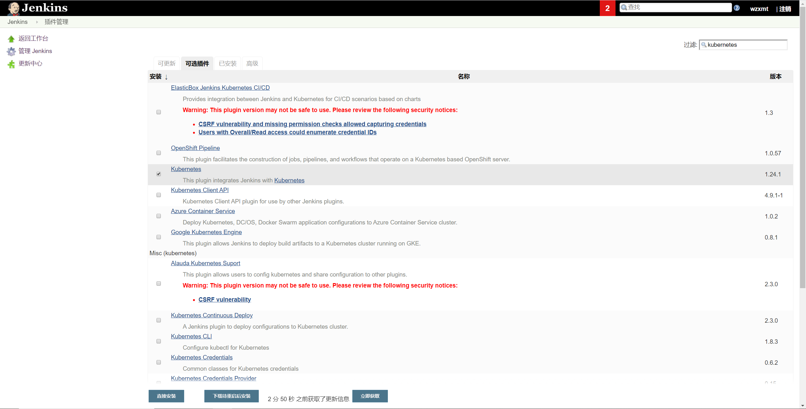
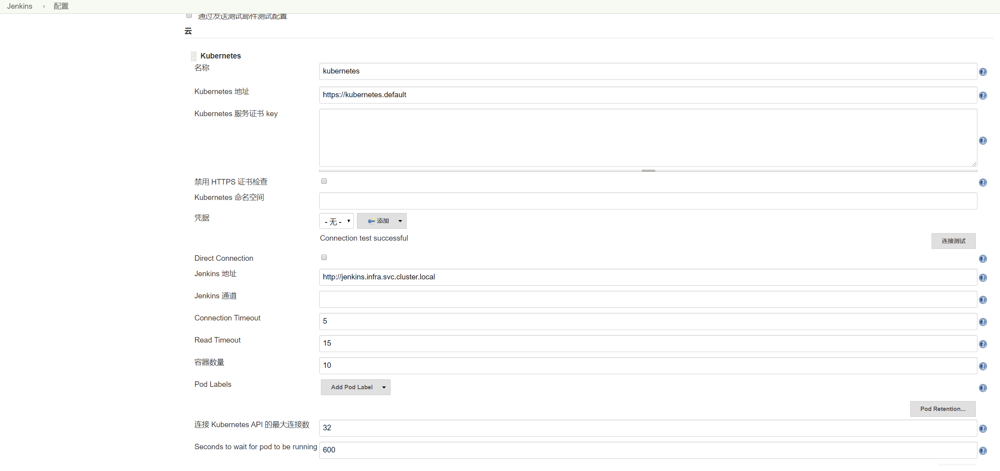
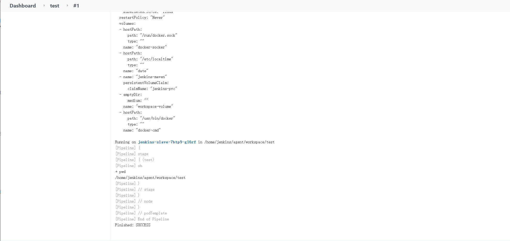
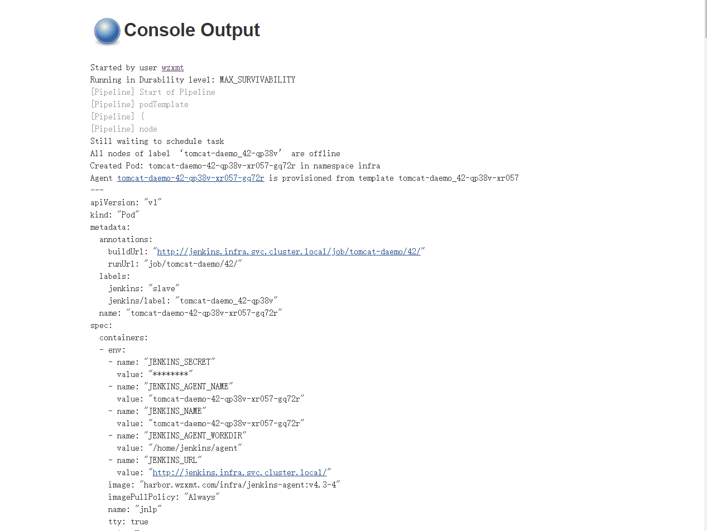

# 简介

我们知道持续构建与发布是我们日常工作中必不可少的一个步骤，目前大多公司都采用 Jenkins 集群来搭建符合需求的 CI/CD 流程，然而传统的 Jenkins Slave 一主多从方式会存在一些痛点，比如：

- 主 Master 发生单点故障时，整个流程都不可用了
- 每个 Slave 的配置环境不一样，来完成不同语言的编译打包等操作，但是这些差异化的配置导致管理起来非常不方便，维护起来也是比较费劲
- 资源分配不均衡，有的 Slave 要运行的 job 出现排队等待，而有的 Slave 处于空闲状态
- 资源有浪费，每台 Slave 可能是物理机或者虚拟机，当 Slave 处于空闲状态时，也不会完全释放掉资源。

正因为上面的这些种种痛点，我们渴望一种更高效更可靠的方式来完成这个 CI/CD 流程，而 Docker 虚拟化容器技术能很好的解决这个痛点，又特别是在 Kubernetes 集群环境下面能够更好来解决上面的问题，下图是基于 Kubernetes 搭建 Jenkins 集群的简单示意图：

从图上可以看到 Jenkins Master 和 Jenkins Slave 以 Pod 形式运行在 Kubernetes 集群的 Node 上，Master 运行在其中一个节点，并且将其配置数据存储到一个 Volume 上去，Slave 运行在各个节点上，并且它不是一直处于运行状态，它会按照需求动态的创建并自动删除。

这种方式的工作流程大致为：当 Jenkins Master 接受到 Build 请求时，会根据配置的 Label 动态创建一个运行在 Pod 中的 Jenkins Slave 并注册到 Master 上，当运行完 Job 后，这个 Slave 会被注销并且这个 Pod 也会自动删除，恢复到最初状态。

那么我们使用这种方式带来了哪些好处呢？

- **服务高可用**，当 Jenkins Master 出现故障时，Kubernetes 会自动创建一个新的 Jenkins Master 容器，并且将 Volume 分配给新创建的容器，保证数据不丢失，从而达到集群服务高可用。
- **动态伸缩**，合理使用资源，每次运行 Job 时，会自动创建一个 Jenkins Slave，Job 完成后，Slave 自动注销并删除容器，资源自动释放，而且 Kubernetes 会根据每个资源的使用情况，动态分配 Slave 到空闲的节点上创建，降低出现因某节点资源利用率高，还排队等待在该节点的情况。
- **扩展性好**，当 Kubernetes 集群的资源严重不足而导致 Job 排队等待时，可以很容易的添加一个 Kubernetes Node 到集群中，从而实现扩展。

是不是以前我们面临的种种问题在 Kubernetes 集群环境下面是不是都没有了啊？看上去非常完美。

## 部署jenkins-master

#### 获取镜像

> [jenkins官网](https://jenkins.io/download/)
> [jenkins镜像](https://hub.docker.com/r/jenkins/jenkins)

下载官网上的稳定版

```bash
docker pull jenkins/jenkins:lts
docker tag jenkins/jenkins:lts harbor.wzxmt.com/infra/jenkins:latest
docker push harbor.wzxmt.com/infra/jenkins:latest
```

nfs(10.0.0.20)上创建共享资源路径

```bash
mkdir -p /data/nfs-volume/jenkins
```

#### 准备资源配置清单

RBAC

```yaml
cat << 'EOF' >rbac.yaml
apiVersion: v1
kind: ServiceAccount
metadata:
  name: jenkins
  namespace: infra
---
kind: ClusterRole
apiVersion: rbac.authorization.k8s.io/v1beta1
metadata:
  name: jenkins
  namespace: infra
rules:
  - apiGroups: ["extensions", "apps"]
    resources: ["deployments"]
    verbs: ["create", "delete", "get", "list", "watch", "patch", "update"]
  - apiGroups: [""]
    resources: ["services"]
    verbs: ["create", "delete", "get", "list", "watch", "patch", "update"]
  - apiGroups: [""]
    resources: ["pods"]
    verbs: ["create","delete","get","list","patch","update","watch"]
  - apiGroups: [""]
    resources: ["pods/exec"]
    verbs: ["create","delete","get","list","patch","update","watch"]
  - apiGroups: [""]
    resources: ["pods/log"]
    verbs: ["get","list","watch"]
  - apiGroups: [""]
    resources: ["secrets"]
    verbs: ["get"]
---
apiVersion: rbac.authorization.k8s.io/v1beta1
kind: ClusterRoleBinding
metadata:
  name: jenkins
  namespace: infra
roleRef:
  apiGroup: rbac.authorization.k8s.io
  kind: ClusterRole
  name: jenkins
subjects:
  - kind: ServiceAccount
    name: jenkins
    namespace: infra
EOF
```

PVC

```yaml
cat << 'EOF' >pvc.yaml
apiVersion: v1
kind: PersistentVolume
metadata:
  name: jenkins-pv
spec:
  capacity:
    storage: 20Gi
  accessModes:
  - ReadWriteMany
  persistentVolumeReclaimPolicy: Delete
  nfs:
    server: 10.0.0.20
    path: /data/nfs-volume/jenkins
---
kind: PersistentVolumeClaim
apiVersion: v1
metadata:
  name: jenkins-pvc
  namespace: infra
spec:
  accessModes:
    - ReadWriteMany
  resources:
    requests:
      storage: 20Gi
EOF
```

deployment

```yaml
cat << EOF >deployment.yaml
kind: Deployment
apiVersion: apps/v1
metadata:
  name: jenkins
  namespace: infra
  labels: 
    name: jenkins
spec:
  replicas: 1
  selector:
    matchLabels: 
      name: jenkins
  template:
    metadata:
      labels: 
        app: jenkins 
        name: jenkins
    spec:
      serviceAccountName: jenkins
      containers:
      - name: jenkins
        image: harbor.wzxmt.com/infra/jenkins:latest
        ports:
        - containerPort: 8080
          protocol: TCP
        - containerPort: 50000
          protocol: TCP
        env:
        - name: JAVA_OPTS
          value: -XshowSettings:vm -Dhudson.slaves.NodeProvisioner.initialDelay=0 -Dhudson.slaves.NodeProvisioner.MARGIN=50 -Dhudson.slaves.NodeProvisioner.MARGIN0=0.85 -Duser.timezone=Asia/Shanghai
        resources:
          limits: 
            cpu: 500m
            memory: 1Gi
          requests: 
            cpu: 500m
            memory: 1Gi
        terminationMessagePath: /dev/termination-log
        terminationMessagePolicy: File
        imagePullPolicy: IfNotPresent
        securityContext:
          runAsUser: 0     #设置以ROOT用户运行容器
          privileged: true #拥有特权
        volumeMounts:
        - name: jenkins-home
          subPath: jenkins-home
          mountPath: /var/jenkins_home
      securityContext:
        fsGroup: 1000
      volumes:
      - name: jenkins-home
        persistentVolumeClaim:
          claimName: jenkins-pvc
      imagePullSecrets:
      - name: harborlogin
      restartPolicy: Always
      terminationGracePeriodSeconds: 30
      securityContext: 
        runAsUser: 0
      schedulerName: default-scheduler
  strategy:
    type: RollingUpdate
    rollingUpdate: 
      maxUnavailable: 1
      maxSurge: 1
  revisionHistoryLimit: 7
  progressDeadlineSeconds: 600
EOF
```

svc

```yaml
cat << EOF >svc.yaml
kind: Service
apiVersion: v1
metadata: 
  name: jenkins
  namespace: infra
spec:
  ports:
  - name: web
    port: 80
    targetPort: 8080
  - name: agent 
    port: 50000
    targetPort: 50000  
  selector:
    app: jenkins
  type: ClusterIP
  sessionAffinity: None
EOF
```

ingress

```yaml
cat << EOF >ingress.yaml
apiVersion: extensions/v1beta1
kind: Ingress
metadata:  
  name: jenkins
  namespace: infra
  annotations:
    traefik.ingress.kubernetes.io/router.entrypoints: web
spec:  
  rules:    
    - host: jenkins.wzxmt.com      
      http:        
        paths:        
        - path: /          
          backend:            
            serviceName: jenkins            
            servicePort: 80
EOF
```

**创建docker-registry**

```bash
kubectl create namespace infra
kubectl create secret docker-registry harborlogin \
--namespace=infra  \
--docker-server=https://harbor.wzxmt.com \
--docker-username=admin \
--docker-password=admin
```

#### 应用资源清单

```bash
kubectl apply -f ./
```

#### 解析域名

```
jenkins	60 IN A 10.0.0.50
```

#### 浏览器访问

[http://jenkins.wzxmt.com](http://jenkins.wzxmt.com/)

#### 优化jenkins插件下载速度

在管理机上

```bash
WORK_DIR=/data/nfs-volume/jenkins/jenkins-home
sed -i.bak 's#http://updates.jenkins-ci.org/download#https://mirrors.tuna.tsinghua.edu.cn/jenkins#g;s#http://www.google.com#https://www.baidu.com#g' ${WORK_DIR}/updates/default.json
```

从新在运算节点部署jenkins

```bash
kubectl delete -f  deployment.yaml
kubectl apply -f  deployment.yaml
```

#### 页面配置jenkins

等到服务启动成功后，我们就可以通过[http://jenkins.wzxmt.com](http://jenkins.wzxmt.com/)访问 jenkins 服务了，可以根据提示信息进行安装配置即可：初始化的密码我们可以在 jenkins 的容器的日志中进行查看，也可以直接在 nfs 的共享数据目录中查看：

```shell
cat ${WORK_DIR}/secrets/initialAdminPassword
```

然后选择安装基础的插件即可。   

安装完成后添加管理员帐号即可进入到 jenkins 主界面：



### 调整安全选项

- Manage Jenkins
  - Configure Global Security
    - Allow anonymous read access（钩上）

- Manage Jenkins
  - 防止跨站点请求伪造(取消钩)

#### 配置

接下来我们就需要来配置 Jenkins，让他能够动态的生成 Slave 的 Pod。

**第1步.** 我们需要安装**kubernetes plugin (新版本就叫 Kubernetes)**， 点击 Manage Jenkins -> Manage Plugins -> Available -> Kubernetes plugin 勾选安装即可。



**第2步.** 安装完毕后，点击 Manage Jenkins —> Configure System —> (拖到最下方)Add a new cloud —> 选择 Kubernetes，然后填写 Kubernetes 和 Jenkins 配置信息。

## 添加扩展插件

- Git Parameter 可以实现动态的从git中获取所有分支
- Config File Provider 主要可以将kubeconfig配置文件存放在jenkins里，让这个pipeline引用这个配置文件
- Extended Choice Parameter 进行对选择框插件进行扩展，可以多选，扩展参数构建，而且部署微服务还需要多选
- Blue Ocean 一个可视化、可编辑的流水线插件

## 添加凭据


点击jenkins

add 添加凭据

填写harbor的用户名和密码，密码Harbor12345
描述随便写,

再添加第二个

git的用户名和密码


将这个id放到pipeline中

将生成的密钥认证放到pipeline中

现在去添加kubeconfig的文件


将这个ID放到我们k8s-auth的pipeline中，这个配置文件是k8s连接kubeconfig的ID，cat /root/.kube/config 这个文件下将文件拷贝到jenkins中


最后进行测试发布在pipeline的配置指定发布的服务进行发布
查看pod的状态

## 部署jenkins

#### jenkins dockerfile结构

```bash
├── Dockerfile（见下面）
├── repositories.yaml（helm chart认证文件）
├── helm（helm包管理器）
├── cert.tar.gz (harbor 的ca证书及私钥)
└── apache-maven-3.6.3-bin.tar.gz（maven工具）
```

#### 下载maven修改配置

```bash
wget https://mirrors.bfsu.edu.cn/apache/maven/maven-3/3.6.3/binaries/apache-maven-3.6.3-bin.tar.gz
tar xf apache-maven-3.6.3-bin.tar.gz
mv apache-maven-3.6.3 maven-3.6.3
rm -f apache-maven-3.6.3-bin.tar.gz
#修改maven-3.6.3/conf/settings.xml
...
    </mirror>
    <!--阿里云仓库-->  
    <mirror>
      <id>mirrorId</id>
      <mirrorOf>repositoryId</mirrorOf>
      <name>Nexus aliyun</name>
      <url>http://maven.aliyun.com/nexus/content/groups/public/</url>
    </mirror>
	<!--中央仓库1-->  
    <mirror>
      <id>repo1</id>
      <mirrorOf>central</mirrorOf>
      <name>Human Readable Name for this.Mirror.</name>
      <url>http://repo1.maven.org/maven2/</url>
    </mirror>
	<!--中央仓库2-->  
    <mirror>
      <id>repo2</id>
      <mirrorOf>central</mirrorOf>
      <name>Human Readable Name for this.Mirror.</name>
      <url>http://repo2.maven.org/maven2/</url>
    </mirror>
  </mirrors>
...
tar zcvf maven-3.6.3.tar.gz maven-3.6.3
rm -rf apache-maven-3.6.3-bin.tar.gz maven-3.6.3
```

#### 下载helm

```bash
wget https://get.helm.sh/helm-v3.4.2-linux-amd64.tar.gz
tar xf helm-v3.4.2-linux-amd64.tar.gz
mv linux-amd64/helm ./
rm -fr helm-v3.4.2-linux-amd64.tar.gz linux-amd64
```

#### 关闭helm cahrt认证

```yaml
cat << "EOF" >repositories.yaml
apiVersion: ""
generated: "0001-01-01T00:00:00Z"
repositories:
- caFile: "/opt/cert/ca.crt"
  certFile: "/opt/cert/harbor.wzxmt.com.crt"
  insecure_skip_tls_verify: false
  keyFile: "/opt/cert/harbor.wzxmt.com.key"
  name: library
  password: admin
  url: https://harbor.wzxmt.com/chartrepo/library
  username: admin
EOF
```

#### 编写dockerfile

```bash
cat << 'EOF' >Dockerfile
FROM jenkins/inbound-agent:latest
USER root
ADD * /opt/
RUN chown -R root. /opt/* && rm -f /opt/Dockerfile && \
mv /opt/helm /usr/bin/ && mv /opt/kubectl /usr/bin/ && \
mkdir -p /root/.config/helm && mv /opt/repositories.yaml /root/.config/helm
ENTRYPOINT ["jenkins-agent"]
EOF
```

#### 构建镜像

```bash
docker build . -t harbor.wzxmt.com/infra/jenkins:latest
docker push harbor.wzxmt.com/infra/jenkins:latest
```

## 测试jenkins

构建一次，测试jenkins连通性

```yaml
pipeline {
  agent {
    kubernetes {
    yaml """
apiVersion: v1
kind: Pod
metadata:
  name: jenkins
  namespace: infra
spec:
  nodeName: n2
  containers:
  - name: jnlp
    image: harbor.wzxmt.com/infra/jenkins:latest
    tty: true
    imagePullPolicy: Always
    volumeMounts:
      - name: docker-cmd
        mountPath: /usr/bin/docker
      - name: docker-socker
        mountPath: /run/docker.sock
      - name: date
        mountPath: /etc/localtime
      - name: jenkins-maven
        subPath: maven-cache
        mountPath: /root/.m2
  restartPolicy: Never
  imagePullSecrets:
    - name: harborlogin
  volumes:
    - name: date
      hostPath:
        path: /etc/localtime
        type: ''
    - name: docker-cmd
      hostPath:
        path: /usr/bin/docker
        type: ''
    - name: docker-socker
      hostPath:
        path: /run/docker.sock
        type: ''
    - name: jenkins-maven
      persistentVolumeClaim:
        claimName: jenkins-pvc
"""
   }
} 
stages {
      stage('test') { 
        steps {
          sh "pwd"
        }
     }
  }
}
```

出现success，表示jenkins slave搭建成功

## 发布dubbo-demo-service

- create new jobs

- Enter an item name

  > dubbo-demo-service

- Pipeline -> OK


Pipeline Script

```yaml
#!/usr/bin/env groovy
def harbor_registry_auth = "68c13df1-8979-42a2-9bfc-eecb8491212d"
pipeline {
  agent {
    kubernetes {
    yaml """
apiVersion: v1
kind: Pod
metadata:
  name: jenkins
  namespace: infra
spec:
  nodeName: n2
  containers:
  - name: jnlp
    image: harbor.wzxmt.com/infra/jenkins:latest
    tty: true
    imagePullPolicy: Always
    volumeMounts:
      - name: docker-cmd
        mountPath: /usr/bin/docker
      - name: docker-socker
        mountPath: /run/docker.sock
      - name: date
        mountPath: /etc/localtime
      - name: jenkins-maven
        subPath: maven-cache
        mountPath: /root/.m2
  restartPolicy: Never
  imagePullSecrets:
    - name: harborlogin
  volumes:
    - name: date
      hostPath:
        path: /etc/localtime
        type: ''
    - name: docker-cmd
      hostPath:
        path: /usr/bin/docker
        type: ''
    - name: docker-socker
      hostPath:
        path: /run/docker.sock
        type: ''
    - name: jenkins-maven
      persistentVolumeClaim:
        claimName: jenkins-pvc
"""
   }
} 
parameters {
  string defaultValue: 'dubbo-demo-service', description: 'project name. e.g: dubbo-demo-service', name: 'app_name', trim: true
  string defaultValue: 'app/dubbo-demo-service', description: 'project docker image name. e.g: app/dubbo-demo-service', name: 'image_name', trim: true
  string defaultValue: 'https://github.com/wzxmt/dubbo-demo-service.git', description: 'project git repository. e.g: https://github.com/wzxmt/dubbo-demo-service.git', name: 'git_repo', trim: true
  string defaultValue: 'apollo', description: 'git commit id of the project.', name: 'git_ver', trim: true
  string defaultValue: '', description: 'project docker image tag, date_timestamp recommended. e.g: 200102_0001', name: 'add_tag', trim: true
  string defaultValue: '/opt', description: 'project maven directory. e.g: ./', name: 'mvn_dir', trim: true
  string defaultValue: './dubbo-server/target', description: 'the relative path of target file such as .jar or .war package. e.g: ./dubbo-server/target', name: 'target_dir', trim: true
  string defaultValue: 'mvn clean package -Dmaven.test.skip=true', description: 'maven command. e.g: mvn clean package -e -q -Dmaven.test.skip=true', name: 'mvn_cmd', trim: true
  string defaultValue: '/opt', description: '', name: 'mvn_dir', trim: true
  choice choices: ['base/jre8:8u112', 'base/jre7:7u112'], description: 'different base images.', name: 'base_image'
  choice choices: ['maven-3.6.3', 'maven-3.6.2', 'maven-3.6.1'], description: 'different maven edition.', name: 'maven'
}
stages {
      stage('pull') { //get project code from repo 
        steps {
          sh "git clone ${params.git_repo} ${params.app_name}/${env.BUILD_NUMBER} && cd ${params.app_name}/${env.BUILD_NUMBER} && git checkout ${params.git_ver}"
        }
      }
      stage('build') { //exec mvn cmd
        steps {
          sh "cd ${params.app_name}/${env.BUILD_NUMBER} && ${params.mvn_dir}/${params.maven}/bin/${params.mvn_cmd}"
        }
      }
      stage('package') { //move jar file into project_dir
        steps {
          sh "cd ${params.app_name}/${env.BUILD_NUMBER} && cd ${params.target_dir} && mkdir project_dir && mv *.jar ./project_dir"
        }
      }
      stage('image') { //build image and push to registry
        steps {
          writeFile file: "${params.app_name}/${env.BUILD_NUMBER}/Dockerfile", text: """FROM harbor.wzxmt.com/${params.base_image}
ADD ${params.target_dir}/project_dir /opt/project_dir"""
          withCredentials([usernamePassword(credentialsId: "${harbor_registry_auth}", passwordVariable: 'password', usernameVariable: 'username')]) {
          sh """
          echo "\${password}" | docker login --username admin --password-stdin ${registry} && \
          cd ${params.app_name}/${env.BUILD_NUMBER} && \
          docker build -t harbor.wzxmt.com/${params.image_name}:${params.git_ver}_${params.add_tag} . && \
          docker push harbor.wzxmt.com/${params.image_name}:${params.git_ver}_${params.add_tag}
          """
         }
       }
     }
   }
}
```

## 发布dubbo-demo-consumer

- create new jobs

- Enter an item name

  > dubbo-demo-consumer


Pipeline Script

```yaml
pipeline {
  agent {
    kubernetes {
      yaml """
apiVersion: v1
kind: Pod
metadata:
  name: jenkins
  namespace: infra
spec:
  nodeName: n2
  containers:
  - name: jnlp
    image: harbor.wzxmt.com/infra/jenkins:latest
    tty: true
    imagePullPolicy: Always
    volumeMounts:
      - name: docker-cmd
        mountPath: /usr/bin/docker
      - name: docker-socker
        mountPath: /run/docker.sock
      - name: date
        mountPath: /etc/localtime
      - name: jenkins-maven
        subPath: maven-cache
        mountPath: /root/.m2
  restartPolicy: Never
  imagePullSecrets:
    - name: harborlogin
  volumes:
    - name: date
      hostPath:
        path: /etc/localtime
        type: ''
    - name: docker-cmd
      hostPath:
        path: /usr/bin/docker
        type: ''
    - name: docker-socker
      hostPath:
        path: /run/docker.sock
        type: ''
    - name: jenkins-maven
      persistentVolumeClaim:
        claimName: jenkins-pvc
"""
   }
} 
parameters {
  string defaultValue: 'dubbo-demo-consumer', description: 'project name. e.g: dubbo-demo-service', name: 'app_name', trim: true
  string defaultValue: 'app/dubbo-demo-consumer', description: 'project docker image name. e.g: app/dubbo-demo-consumer', name: 'image_name', trim: true
  string defaultValue: 'https://github.com/wzxmt/dubbo-demo-web.git', description: 'project git repository. e.g: https://github.com/wzxmt/dubbo-demo-web.git', name: 'git_repo', trim: true
  string defaultValue: 'apollo', description: 'git commit id of the project.', name: 'git_ver', trim: true
  string defaultValue: '', description: 'project docker image tag, date_timestamp recommended. e.g: 200102_0001', name: 'add_tag', trim: true
  string defaultValue: '/opt', description: 'project maven directory. e.g: ./', name: 'mvn_dir', trim: true
  string defaultValue: './dubbo-client/target', description: 'the relative path of target file such as .jar or .war package. e.g: ./dubbo-client/target', name: 'target_dir', trim: true
  string defaultValue: 'mvn clean package -Dmaven.test.skip=true', description: 'maven command. e.g: mvn clean package -e -q -Dmaven.test.skip=true', name: 'mvn_cmd', trim: true
  string defaultValue: '/opt', description: '', name: 'mvn_dir', trim: true
  choice choices: ['base/jre8:8u112', 'base/jre7:7u112'], description: 'different base images.', name: 'base_image'
  choice choices: ['maven-3.6.3', 'maven-3.6.2', 'maven-3.6.1'], description: 'different maven edition.', name: 'maven'
}
    stages {
    stage('pull') { //get project code from repo 
      steps {
        sh "git clone ${params.git_repo} ${params.app_name}/${env.BUILD_NUMBER} && cd ${params.app_name}/${env.BUILD_NUMBER} && git checkout ${params.git_ver}"
        }
    }
    stage('build') { //exec mvn cmd
      steps {
        sh "cd ${params.app_name}/${env.BUILD_NUMBER} && ${params.mvn_dir}/${params.maven}/bin/${params.mvn_cmd}"
      }
    }
    stage('unzip') { //unzip  target/*.war -c target/project_dir
      steps {
        sh "cd ${params.app_name}/${env.BUILD_NUMBER} && cd ${params.target_dir} && mkdir project_dir && unzip *.war -d ./project_dir"
      }
    }
    stage('image') { //build image and push to registry
      steps {
        writeFile file: "${params.app_name}/${env.BUILD_NUMBER}/Dockerfile", text: """FROM harbor.wzxmt.com/${params.base_image}
ADD ${params.target_dir}/project_dir /opt/tomcat/webapps/${params.root_url}"""
        sh "cd  ${params.app_name}/${env.BUILD_NUMBER} && \
        docker build -t harbor.wzxmt.com/${params.image_name}:${params.git_ver}_${params.add_tag} . && \
        docker push harbor.wzxmt.com/${params.image_name}:${params.git_ver}_${params.add_tag}"
      }
    }
  }
}
```

## 发布tomcat

### 配置New job

- 使用admin登录

- New Item

- create new jobs

- Enter an item name

  > tomcat-demo

- Pipeline -> OK


### Pipeline Script

```yaml
pipeline {
  agent {
    kubernetes {
    yaml """
apiVersion: v1
kind: Pod
metadata:
  name: jenkins
  namespace: infra
spec:
  nodeName: n2
  containers:
  - name: jnlp
    image: harbor.wzxmt.com/infra/jenkins:latest
    tty: true
    imagePullPolicy: Always
    volumeMounts:
      - name: docker-cmd
        mountPath: /usr/bin/docker
      - name: docker-socker
        mountPath: /run/docker.sock
      - name: date
        mountPath: /etc/localtime
      - name: jenkins-maven
        subPath: maven-cache
        mountPath: /root/.m2
  restartPolicy: Never
  imagePullSecrets:
    - name: harborlogin
  volumes:
    - name: date
      hostPath:
        path: /etc/localtime
        type: ''
    - name: docker-cmd
      hostPath:
        path: /usr/bin/docker
        type: ''
    - name: docker-socker
      hostPath:
        path: /run/docker.sock
        type: ''
    - name: jenkins-maven
      persistentVolumeClaim:
        claimName: jenkins-pvc
"""
   }
} 
parameters {
  string defaultValue: 'dubbo-demo-web', description: 'project name. e.g: dubbo-demo-service', name: 'app_name', trim: true
  string defaultValue: 'app/dubbo-demo-web', description: 'project docker image name. e.g: app/dubbo-demo-service', name: 'image_name', trim: true
  string defaultValue: 'https://gitee.com/wzxmt/dubbo-demo-web.git', description: 'project git repository. e.g: https://gitee.com/wzxmt/dubbo-demo-web.git', name: 'git_repo', trim: true
  string defaultValue: 'apollo', description: 'git commit id of the project.', name: 'git_ver', trim: true
  string defaultValue: '', description: 'project docker image tag, date_timestamp recommended. e.g: 200102_0001', name: 'add_tag', trim: true
  string defaultValue: '/opt', description: 'project maven directory. e.g: ./', name: 'mvn_dir', trim: true
  string defaultValue: './dubbo-client/target', description: 'the relative path of target file such as .jar or .war package. e.g: ./dubbo-client/target', name: 'target_dir', trim: true
  string defaultValue: 'mvn clean package -Dmaven.test.skip=true', description: 'maven command. e.g: mvn clean package -e -q -Dmaven.test.skip=true', name: 'mvn_cmd', trim: true
  string defaultValue: '/opt', description: '', name: 'mvn_dir', trim: true
  choice choices: ['base/tomcat:v8.5.40', 'base/tomcat:v9.0.17', 'base/tomcat:v7.0.94'], description: 'project base image list in harbor.wzxmt.com.', name: 'base_image'
  choice choices: ['maven-3.6.3', 'maven-3.6.2', 'maven-3.6.1'], description: 'different maven edition.', name: 'maven'
  string defaultValue: 'ROOT', description: 'webapp dir.', name: 'webapp_DIR', trim: true
}
stages {
      stage('pull') { //get project code from repo 
        steps {
          sh "git clone ${params.git_repo} ${params.app_name}/${env.BUILD_NUMBER} && cd ${params.app_name}/${env.BUILD_NUMBER} && git checkout ${params.git_ver}"
        }
      }
      stage('build') { //exec mvn cmd
        steps {
          sh "cd ${params.app_name}/${env.BUILD_NUMBER} && ${params.mvn_dir}/${params.maven}/bin/${params.mvn_cmd}"
        }
      }
      stage('package') { //move jar file into project_dir
        steps {
          sh "cd ${params.app_name}/${env.BUILD_NUMBER} && cd ${params.target_dir} && mkdir project_dir && mv *.jar ./project_dir"
        }
      }
      stage('image') { //build image and push to registry
        steps {
          writeFile file: "${params.app_name}/${env.BUILD_NUMBER}/Dockerfile", text: """FROM harbor.wzxmt.com/${params.base_image}
ADD ${params.target_dir}/project_dir /opt/project_dir"""
          sh "cd  ${params.app_name}/${env.BUILD_NUMBER} && docker build -t harbor.wzxmt.com/${params.image_name}:${params.git_ver}_${params.add_tag} . && docker push harbor.wzxmt.com/${params.image_name}:${params.git_ver}_${params.add_tag}"
        }
      }
   }
}
```

依次填入/选择：

### 开始构建



dubbo-demo-service

```yaml
cat << 'EOF' >dubbo-demo-service.yaml
kind: Deployment
apiVersion: apps/v1
metadata:
  name: dubbo-demo-service
  namespace: test
  labels: 
    name: dubbo-demo-service
spec:
  replicas: 1
  selector:
    matchLabels: 
      name: dubbo-demo-service
  template:
    metadata:
      labels: 
        app: dubbo-demo-service
        name: dubbo-demo-service
    spec:
      containers:
      - name: dubbo-demo-service
        image: harbor.wzxmt.com/app/dubbo-demo-service:apollo_20201206_0001
        ports:
        - containerPort: 20880
          protocol: TCP
        env:
        - name: C_OPTS
          value: -Denv=fat -Dapollo.meta=http://config-test.wzxmt.com
        - name: JAR_BALL
          value: dubbo-server.jar
        imagePullPolicy: Always
      imagePullSecrets:
      - name: harborlogin
      restartPolicy: Always
      terminationGracePeriodSeconds: 30
      securityContext: 
        runAsUser: 0
      schedulerName: default-scheduler
  strategy:
    type: RollingUpdate
    rollingUpdate: 
      maxUnavailable: 1
      maxSurge: 1
  revisionHistoryLimit: 7
  progressDeadlineSeconds: 600
EOF
```

dubbo-demo-consumer

```yaml
cat << 'EOF' >dubbo-demo-consumer.yaml
kind: Deployment
apiVersion: apps/v1
metadata:
  name: dubbo-demo-consumer
  namespace: test
  labels: 
    name: dubbo-demo-consumer
spec:
  replicas: 1
  selector:
    matchLabels: 
      name: dubbo-demo-consumer
  template:
    metadata:
      labels: 
        app: dubbo-demo-consumer
        name: dubbo-demo-consumer
    spec:
      containers:
      - name: dubbo-demo-consumer
        image: harbor.wzxmt.com/app/dubbo-demo-consumer:apollo_20201206_0001
        ports:
        - containerPort: 20880
          protocol: TCP
        - containerPort: 8080
          protocol: TCP
        env:
        - name: C_OPTS
          value: -Denv=fat -Dapollo.meta=http://config-test.wzxmt.com
        - name: JAR_BALL
          value: dubbo-client.jar
        imagePullPolicy: Always
      imagePullSecrets:
      - name: harborlogin
      restartPolicy: Always
      terminationGracePeriodSeconds: 30
      securityContext: 
        runAsUser: 0
      schedulerName: default-scheduler
  strategy:
    type: RollingUpdate
    rollingUpdate: 
      maxUnavailable: 1
      maxSurge: 1
  revisionHistoryLimit: 7
  progressDeadlineSeconds: 600
---
kind: Service
apiVersion: v1
metadata: 
  name: dubbo-demo-consumer
  namespace: test
spec:
  ports:
  - protocol: TCP
    port: 8080
    targetPort: 8080
  selector: 
    app: dubbo-demo-consumer
  clusterIP: None
  type: ClusterIP
  sessionAffinity: None
---
apiVersion: traefik.containo.us/v1alpha1
kind: IngressRoute
metadata:
  name: dubbo-demo-consumer
  namespace: test
spec:
  entryPoints:
    - web
  routes:
  - match: Host(`demo-test.wzxmt.com`) && PathPrefix(`/`)
    kind: Rule
    services:
    - name: dubbo-demo-consumer
      port: 8080
EOF
```

http://demo-test.wzxmt.com/hello?name=wangdao