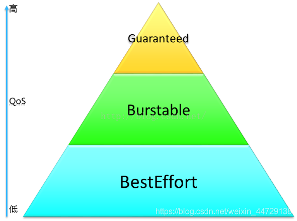
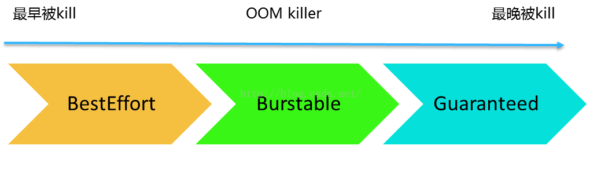
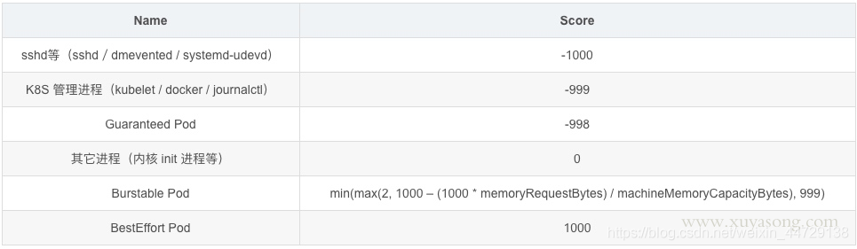

## 背景

K8S 的节点上的资源会被 pod 和系统进程所使用，如果默认什么都不配置，那么节点上的全部资源都是可以分配给pod使用的，系统进程本身没有保障，这样做会存在以下问题：

- 集群雪崩：如果节点上调度了大量pod，且pod没有合理的limit限制，节点资源将被耗尽，sshd、kubelet等进程OOM，节点变成 not ready状态，pod重新继续调度到其他节点，新节点也被打挂，引起集群雪崩。

- 系统进程异常：就算 pod 设置了limit，但如果机器遇到资源不足，系统进程如 docker 没有资源保障，会频繁 OOM，或者进程 hang 住无响应，虽然能运行，但容器会反复出问题

## 节点资源主要分为两类：

- 可压缩资源：如CPU，即使cpu 超配，也可以划分时间片运行，只是运行变慢，进程不会挂。
- 不可压缩资源：Memory/Storage，内存不同于CPU，系统内存不足时，会触发 OOM杀死进程，按照oom score 来确定先kill谁，oom_score_adj值越高，被kill 的优先级越高。

## QoS简介

在kubernetes中，每个POD都有个QoS标记，通过这个Qos标记来对POD进行服务质量管理。QoS的英文全称为"Quality of Service",中文名为"服务质量"，它取决于用户对服务质量的预期，也就是期望的服务质量。对于POD来说，服务质量体现在两个指标上，一个指标是CPU，另一个指标是内存。在实际运行过程中，当NODE节点上内存资源紧张的时候，kubernetes根据POD具有的不同QoS标记，采取不同的处理策略。
在Kubernetes中，POD的QoS服务质量一共有三个级别，如下图所示：

这三个QoS级别介绍，可以看下面表格：

|  QoS级别   |                           QoS介绍                            |
| :--------: | :----------------------------------------------------------: |
| BestEffort | POD中的所有容器都没有指定CPU和内存的requests和limits，那么这个POD的QoS就是BestEffort级别。 |
| Burstable  | POD中只要有一个容器，这个容器requests和limits的设置同其他容器设置的不一致，那么这个POD的QoS就是Burstable级别 。 |
| Guaranteed | POD中所有容器都必须统一设置了limits，并且设置参数都一致，如果有一个容器要设置requests，那么所有容器都要设置，并设置参数同limits一致，那么这个POD的QoS就是Guaranteed级别 。 |

QoS级别决定了kubernetes处理这些POD的方式，我们以内存资源为例：

1、当NODE节点上内存资源不够的时候，QoS级别是BestEffort的POD会最先被kill掉；当NODE节点上内存资源充足的时候，QoS级别是BestEffort的POD可以使用NODE节点上剩余的所有内存资源。

2、当NODE节点上内存资源不够的时候，如果QoS级别是BestEffort的POD已经都被kill掉了，那么会查找QoS级别是Burstable的POD，并且这些POD使用的内存已经超出了requests设置的内存值，这些被找到的POD会被kill掉；当NODE节点上内存资源充足的时候，QoS级别是Burstable的POD会按照requests和limits的设置来使用。

3、当NODE节点上内存资源不够的时候，如果QoS级别是BestEffort和Burstable的POD都已经被kill掉了，那么会查找QoS级别是Guaranteed的POD，并且这些POD使用的内存已经超出了limits设置的内存值，这些被找到的POD会被kill掉；当NODE节点上内存资源充足的时候，QoS级别是Burstable的POD会按照requests和limits的设置来使用。

从容器的角度出发，为了限制容器使用的CPU和内存，是通过cgroup来实现的，目前kubernetes的QoS只能管理CPU和内存，所以kubernetes现在也是通过对cgroup的配置来实现QoS管理的。

## oom 分数

对于kubernetes来说，通过cgroup就可以给POD设置QoS级别，当资源不够使用时，先kill优先级低的POD，在实际使用时，是通过OOM（Out of Memory）分数值来实现的，OOM分数值从0到1000。OOM分数值是根据OOM_ADJ参数计算出来的，对于Guaranteed级别的POD，OOM_ADJ参数设置成了-998，对于BestEffort级别的POD，OOM_ADJ参数设置成了1000，对于Burstable级别的POD，OOM_ADJ参数取值从2到999，对于kube保留的资源，比如kubelet，OOM_ADJ参数设置成了-999。OOM_ADJ参数设置的越大，通过OOM_ADJ参数计算出来的OOM分数越高，OOM分数越高，这个POD的优先级就越低，在出现资源竞争的时候，就越早被kill掉，对于OOM_ADJ参数是-999的代表kubernetes永远不会因为OOM而被kill掉。如下图所示：

在Kubernetes中，POD的QoS服务质量一共有三个级别，如下图所示：

在Kubernetes中，常用服务的OOM分值：

