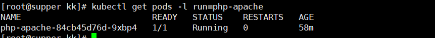

## HPA简介

HPA全称是Horizontal Pod Autoscaler，翻译成中文是POD水平自动伸缩，以下都会用HPA代替Horizontal Pod Autoscaler，HPA可以基于CPU利用率对replication controller、deployment和replicaset中的pod数量进行自动扩缩容（除了CPU利用率也可以基于其他应程序提供的度量指标custom metrics进行自动扩缩容）。pod自动缩放不适用于无法缩放的对象，比如DaemonSets。HPA由Kubernetes API资源和控制器实现。资源决定了控制器的行为。控制器会周期性的获取平均CPU利用率，并与目标值相比较后来调整replication controller或deployment中的副本数量。

## 一、HPA工作原理


HPA的实现是一个控制循环，由controller manager的–horizontal-pod-autoscaler-sync-period参数指定周期（默认值为15秒）。每个周期内，controller manager根据每个HorizontalPodAutoscaler定义中指定的指标查询资源利用率。controller manager可以从resource metrics API（pod 资源指标）和custom metrics API（自定义指标）获取指标。

1）对于每个pod的资源指标（如CPU），控制器从资源指标API中获取每一个 HorizontalPodAutoscaler指定的pod的指标，然后，如果设置了目标使用率，控制器获取每个pod中的容器资源使用情况，并计算资源使用率。如果使用原始值，将直接使用原始数据（不再计算百分比）。然后，控制器根据平均的资源使用率或原始值计算出缩放的比例，进而计算出目标副本数。需要注意的是，如果pod某些容器不支持资源采集，那么控制器将不会使用该pod的CPU使用率

2）如果 pod 使用自定义指标，控制器机制与资源指标类似，区别在于自定义指标只使用原始值，而不是使用率。

3）如果pod 使用对象指标和外部指标（每个指标描述一个对象信息）。这个指标将直接跟据目标设定值相比较，并生成一个上面提到的缩放比例。在autoscaling/v2beta2版本API中，这个指标也可以根据pod数量平分后再计算。通常情况下，控制器将从一系列的聚合API（metrics.k8s.io、custom.metrics.k8s.io和external.metrics.k8s.io）中获取指标数据。metrics.k8s.io API通常由 metrics-server（需要额外启动）提供。

## 二、metrics server

metrics-server是一个集群范围内的资源数据集和工具，同样的，metrics-server也只是显示数据，并不提供数据存储服务，主要关注的是资源度量API的实现，比如CPU、文件描述符、内存、请求延时等指标，metric-server收集数据给k8s集群内使用，如kubectl,hpa,scheduler等.

1、部署metrics server（略）

2、测试kubectl top命令

```
kubectl top node
```


## 三、HPA API对象

HPA的API有三个版本

autoscaling/v1：只支持基于CPU指标的缩放；

autoscaling/v2beta1：支持Resource Metrics（资源指标，如pod的CPU）和Custom Metrics（自定义指标）的缩放；

autoscaling/v2beta2：支持Resource Metrics（资源指标，如pod的CPU）和Custom Metrics（自定义指标）和ExternalMetrics（额外指标）的缩放。

## 四、使用kubectl操作HPA

与其他API资源类似，kubectl也支持Pod自动伸缩。我们可以通过kubectl create命令创建一个自动伸缩对象，通过kubectl get hpa命令来获取所有自动伸缩对象，通过kubectl describe hpa命令来查看自动伸缩对象的详细信息。最后，可以使用kubectl delete hpa命令删除对象。此外，还有个简便的命令kubectl autoscale来创建自动伸缩对象。

```
kubectl autoscale deployment nginx --min=1 --max=5 --cpu-percent=80
```

将会为名为nginx的deployment创建一个自动伸缩对象，对象目标的CPU使用率为80%，副本数量配置为1到5之间。

## 五、多指标支持

在Kubernetes1.6+中支持基于多个指标进行缩放。你可以使用autoscaling/v2beta2 API来为HPA指定多个指标。HPA会跟据每个指标计算，并生成一个缩放建议。

## 六、自定义指标支持

自Kubernetes1.6起，HPA支持使用自定义指标。你可以使用autoscaling/v2beta2 API为HPA指定用户自定义指标。Kubernetes会通过用户自定义指标API来获取相应的指标。

## 七、测试HPA的autoscaling/v1版-基于CPU的自动扩缩容

用Deployment创建一个php-apache服务，然后利用HPA进行自动扩缩容。步骤如下：

1.通过deployment创建pod，在k8s的master节点操作
1）创建并运行一个php-apache服务

```dockerfile
cat << EOF >Dockerfile
FROM php:5-apache
COPY index.php /var/www/html/index.php
RUN chmod a+rx index.php
EOF
```

该文件定义了一个 index.php 页面来执行一些 CPU 密集型计算：

```php
cat << 'EOF' >index.php
<?php
  $x = 0.0001;
  for ($i = 0; $i <= 1000000; $i++) {
    $x += sqrt($x);
  }
  echo "OK!";
?>
EOF
```

2）制作镜像

```
docker build -t harbor.wzxmt.com/infra/php-apache:latest .
docker push harbor.wzxmt.com/infra/php-apache:latest
```

3）创建docker-registry

```
kubectl create secret docker-registry harborlogin \
--namespace=default  \
--docker-server=https://harbor.wzxmt.com \
--docker-username=admin \
--docker-password=admin
```

4）通过deployment部署一个php-apache服务

```yaml
cat << EOF >php-apache.yaml
apiVersion: apps/v1
kind: Deployment
metadata:
  name: php-apache
spec:
  selector:
    matchLabels:
      run: php-apache
  replicas: 1
  template:
    metadata:
      labels:
        run: php-apache
    spec:
      imagePullSecrets:
      - name: harborlogin
      containers:
      - name: php-apache
        image: harbor.wzxmt.com/infra/php-apache:latest
        ports:
        - containerPort: 80
        resources:
          limits:
            cpu: 500m
          requests:
            cpu: 200m
---
apiVersion: v1
kind: Service
metadata:
  name: php-apache
  labels:
    run: php-apache
spec:
  ports:
  - port: 80
  selector:
    run: php-apache
EOF
```

5）部署服务并验证php是否部署成功

```
kubectl apply -f php-apache.yaml
kubectl get pods
```

显示如下，说明php服务部署成功了


2.创建HPA
php-apache服务正在运行，使用kubectl autoscale创建自动缩放器，实现对php-apache这个deployment创建的pod自动扩缩容，下面的命令将会创建一个HPA，HPA将会根据CPU，内存等资源指标增加或减少副本数，创建一个可以实现如下目的的hpa：

- 让副本数维持在1-10个之间（这里副本数指的是通过deployment部署的pod的副本数）
- 将所有Pod的平均CPU使用率维持在50％（通过kubectlrun运行的每个pod如果是200毫核，这意味着平均CPU利用率为100毫核

1）给上面php-apache这个deployment创建HPA

```
kubectl autoscale deployment php-apache --cpu-percent=50 --min=1 --max=10
```

2）验证HPA是否创建成功

```
kubectl get hpa
```


3.压测php-apache服务，只是针对CPU做压测增加负载
现在，我们将看到 Autoscaler 如何对增加负载作出反应。 我们将启动一个容器，并通过一个循环向 php-apache 服务器发送无限的查询请求 （请在另一个终端中运行以下命令）：

```shell
kubectl run -it generator --rm --image=busybox -- /bin/sh -c "while sleep 0.01; do wget -q -O- http://php-apache; done"
```

一分钟时间左右之后，通过以下命令，我们可以看到 CPU 负载升高了：

```shell
kubectl get hpa
NAME         REFERENCE                     TARGET      MINPODS   MAXPODS   REPLICAS   AGE
php-apache   Deployment/php-apache/scale   305% / 50%  1         10        1          3m
```

这时，由于请求增多，CPU 利用率已经升至请求值的 305%。 可以看到，Deployment 的副本数量已经增长到了 7：

```shell
kubectl get deployment php-apache
NAME         READY   UP-TO-DATE   AVAILABLE   AGE
php-apache   7/7      7           7           19m
```

> **说明：** 有时最终副本的数量可能需要几分钟才能稳定下来。由于环境的差异， 不同环境中最终的副本数量可能与本示例中的数量不同。注意：可能需要几分钟来稳定副本数。由于不以任何方式控制负载量，因此最终副本数可能会与此示例不同。

4.停止对php-apache服务压测，HPA会自动对php-apache这个deployment创建的pod做缩容（几分钟后）

```
kubectl get hpa
kubectl get deployment php-apache
```


通过上面可以看到，CPU利用率下降到0，因此HPA自动将副本数缩减到1。

**注意：**自动缩放副本可能需要几分钟。

## 八、测试HPA autoscaling/v2beta1版本-基于内存的自动扩缩容

1.创建一个nginx的pod

```yaml
cat << EOF >mem-demo-nginx.yaml
apiVersion: apps/v1
kind: Deployment
metadata:
  name: nginx-hpa
spec:
  selector:
    matchLabels:
      app: nginx
  replicas: 1
  template:
    metadata:
      labels:
        app: nginx
    spec:
      containers:
      - name: nginx
        image: nginx:1.9.1
        ports:
        - containerPort: 80
          name: http
          protocol: TCP
        resources:
          requests:
            cpu: 0.01
            memory: 25Mi
          limits:
            cpu: 0.05
            memory: 60Mi
        securityContext:
          privileged: true
EOF
kubectl apply -f mem-demo-nginx.yaml
```

2.验证nginx是否运行

```
kubectl get pods -l app=nginx
```

**注意：**nginx的pod里需要有如下字段，否则hpa会采集不到内存指标

```
 resources:
    requests:
      cpu: 50m
      memory: 50Mi
    limits:
       cpu: 60
       memory: 60Mi
```

3.创建一个hpa

```yaml
cat << EOF >m-hpa-nginx.yaml
apiVersion: autoscaling/v2beta1
kind: HorizontalPodAutoscaler
metadata:
  name: nginx-hpa
  labels:
    app: nginx
spec:
  scaleTargetRef:
    apiVersion: apps/v1
    kind: Deployment
    name: nginx-hpa
  minReplicas: 1
  maxReplicas: 5
  metrics:
  - type: Resource
    resource:
      name: memory
      targetAverageUtilization: 60
EOF
kubectl apply -f m-hpa-nginx.yaml
```

查看hpa信息

```
kubectl get hpa -l app=nginx
```


4.压测nginx的内存，hpa会对pod自动扩缩容

```bash
POD=`kubectl get pod -l app=nginx|awk 'NR>1{print $1}'`
kubectl exec -it $POD -- /bin/bash
mkdir /tmp/memory  
mount -t tmpfs -o size=40M tmpfs /tmp/memory  
dd if=/dev/zero of=/tmp/memory/block 
```


打开新的终端：

```
kubectl get hpa -l app=nginx
```


上面的targets列可看到181%/60%，200%表示当前cpu使用率，60%表示所有pod的cpu使用率维持在60%，现在cpu使用率达到181%，所以pod增加到4个

```
kubectl get pods -l app=nginx
```

显示如下：


5.取消对nginx内存的压测，hpa会对pod自动缩容

5.取消对nginx内存的压测，hpa会对pod自动缩容

```bash
kubectl exec -it $POD -- rm -rf /tmp/memory/block
```

显示如下,可看到内存使用率已经降到5%:

```bash
[root@supper ~]# kubectl get hpa -l app=nginx
NAME        REFERENCE              TARGETS   MINPODS   MAXPODS   REPLICAS   AGE
nginx-hpa   Deployment/nginx-hpa   14%/60%   1         5         1          19m
```


显示如下，deployment的pod又恢复到1个了：

```bash
[root@supper ~]# kubectl get pods -l app=nginx
NAME                         READY   STATUS    RESTARTS   AGE
nginx-hpa-867c9bdb56-6blhj   1/1     Running   0          6m51s
```

## 九、基于多项指标和自定义指标的自动缩放

可以通过使用autoscaling/v2beta2 API版本来介绍在自动缩放php-apache这个deployment时使用的其他度量指标（metrics）。

获取autoscaling/v2beta2 API版本HPA的yaml文件
kubectl get hpa.v2beta2.autoscaling -o yaml > /tmp/hpa-v2.yaml
在编辑器打开文件/tmp/hpa-v2.yaml，删除掉一些不需要要的字段，可看到如下yaml

```
apiVersion: autoscaling/v2beta2
kind: HorizontalPodAutoscaler
metadata:
  name: php-apache
  namespace: default
spec:
  scaleTargetRef:
    apiVersion: apps/v1
    kind: Deployment
    name: php-apache
  minReplicas: 1
  maxReplicas: 10
  metrics:
  - type: Resource
    resource:
      name: cpu
      target:
        type: Utilization
        averageUtilization: 50
status:
  observedGeneration: 1
  lastScaleTime: <some-time>
  currentReplicas: 1
  desiredReplicas: 1
  currentMetrics:
  - type: Resource
    resource:
      name: cpu
      current:
        averageUtilization: 0
        averageValue: 0
```

targetCPUUtilizationPercentage字段由metrics所取代，CPU利用率这个度量指标是一个resource metric(资源度量指标)，因为它表示容器上指定资源的百分比。 除CPU外，你还可以指定其他资源度量指标。默认情况下，目前唯一支持的其他资源度量指标为内存。只要metrics.k8s.io API存在，这些资源度量指标就是可用的，并且他们不会在不同的Kubernetes集群中改变名称。你还可以指定资源度量指标使用绝对数值，而不是百分比，你需要将target类型AverageUtilization替换成AverageValue，同时将target.averageUtilization替换成target.averageValue并设定相应的值。还有两种其他类型的度量指标，他们被认为是custom metrics（自定义度量指标）： 即Pod度量指标和对象度量指标（pod metrics and object metrics）。这些度量指标可能具有特定于集群的名称，并且需要更高级的集群监控设置。第一种可选的度量指标类型是Pod度量指标。这些指标从某一方面描述了Pod，在不同Pod之间进行平均，并通过与一个目标值比对来确定副本的数量。它们的工作方式与资源度量指标非常相像，差别是它们仅支持target类型为AverageValue。

Pod 度量指标通过如下代码块定义

```
type: Pods
pods:
  metric:
    name: packets-per-second
  target:
    type: AverageValue
    averageValue: 1k
```


第二种可选的度量指标类型是对象度量指标。相对于描述Pod，这些度量指标用于描述一个在相同名字空间(namespace)中的其他对象。请注意这些度量指标用于描述这些对象，并非从对象中获取。对象度量指标支持的target类型包括Value和AverageValue。如果是Value类型，target值将直接与API返回的度量指标比较，而AverageValue类型，API返回的度量指标将按照Pod数量拆分，然后再与target值比较。下面的YAML文件展示了一个表示requests-per-second的度量指标。

```
type: Object
object:
  metric:
    name: requests-per-second
  describedObject:
    apiVersion: networking.k8s.io/v1beta1
    kind: Ingress
    name: main-route
  target:
    type: Value
    value: 2k
```

如果你指定了多个上述类型的度量指标，HorizontalPodAutoscaler将会依次考量各个指标。HorizontalPodAutoscaler将会计算每一个指标所提议的副本数量，然后最终选择一个最高值。比如，如果你的监控系统能够提供网络流量数据，你可以通过kubectl edit命令将上述Horizontal Pod Autoscaler的定义更改为：

```
apiVersion: autoscaling/v2beta1
kind: HorizontalPodAutoscaler
metadata:
  name: php-apache
  namespace: default
spec:
  scaleTargetRef:
    apiVersion: apps/v1
    kind: Deployment
    name: php-apache
  minReplicas: 1
  maxReplicas: 10
  metrics:
  - type: Resource
    resource:
      name: cpu
      target:
        type: AverageUtilization
        averageUtilization: 50
  - type: Pods
    pods:
      metric:
        name: packets-per-second
      targetAverageValue: 1k
  - type: Object
    object:
      metric:
        name: requests-per-second
      describedObject:
        apiVersion: networking.k8s.io/v1beta1
        kind: Ingress
        name: main-route
      target:
        kind: Value
        value: 10k
status:
  observedGeneration: 1
  lastScaleTime: <some-time>
  currentReplicas: 1
  desiredReplicas: 1
  currentMetrics:
  - type: Resource
    resource:
      name: cpu
    current:
      averageUtilization: 0
      averageValue: 0
  - type: Object
    object:
      metric:
        name: requests-per-second
      describedObject:
        apiVersion: networking.k8s.io/v1beta1
        kind: Ingress
        name: main-route
      current:
        value: 10k
```

然后，你的HorizontalPodAutoscaler将会尝试确保每个Pod的CPU利用率在50%以内，每秒能够服务1000个数据包请求，并确保所有在Ingress后的Pod每秒能够服务的请求总数达到10000个。

## 十、在更多指定指标下的自动伸缩

许多度量管道允许你通过名称或附加的_labels_来描述度量指标。对于所有非资源类型度量指标(pod、object和后面将介绍的external)，可以额外指定一个标签选择器。例如，如果你希望收集包含verb标签的http_requests度量指标， 你可以在GET请求中指定需要的度量指标，如下所示：

```
type:Object
object:
  metric:
    name:`http_requests`
    selector:`verb=GET`
```

这个选择器使用与Kubernetes标签选择器相同的语法。如果名称和标签选择器匹配到多个系列，监测管道会决定如何将多个系列合并成单个值。选择器是附加的，它不会选择目标以外的对象（类型为Pods的目标和类型为Object的目标）。

## 十一、基于kubernetes对象以外的度量指标自动扩缩容

运行在Kubernetes上的应用程序可能需要基于与Kubernetes集群中的任何对象没有明显关系的度量指标进行自动伸缩，例如那些描述不在Kubernetes任何namespaces服务的度量指标。使用外部的度量指标，需要了解你使用的监控系统，相关的设置与使用自定义指标类似。 External metrics可以使用你的监控系统的任何指标来自动伸缩你的集群。你只需要在metric块中提供name和selector，同时将类型由Object改为External。如果metricSelector匹配到多个度量指标，HorizontalPodAutoscaler将会把它们加和。 External metrics同时支持Value和AverageValue类型，这与Object类型的度量指标相同。例如，如果你的应用程序处理主机上的消息队列， 为了让每30个任务有1个worker，你可以将下面的内容添加到 HorizontalPodAutoscaler 的配置中。

还是推荐custom metric而不是external metrics，因为这便于让系统管理员加固custom metrics API。而external metrics API可以允许访问所有的度量指标，当暴露这些服务时，系统管理员需要仔细考虑这个问题。

```
-type:External
external:
metric:
name:queue_messages_ready
selector:“queue=worker_tasks”
target:
type:AverageValue
averageValue:30
```

还是推荐custom metric而不是external metrics，因为这便于让系统管理员加固custom metrics API。而external metrics API可以允许访问所有的度量指标，当暴露这些服务时，系统管理员需要仔细考虑这个问题。

