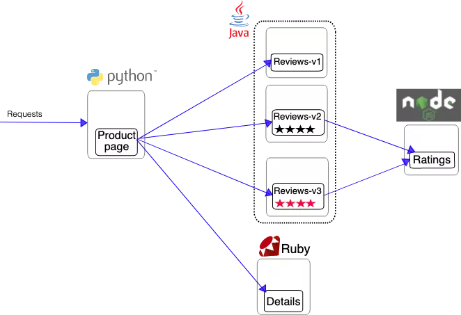

## 使用 Istio 实现非侵入流量治理


现在最火的后端架构无疑是`微服务`了，微服务将之前的单体应用拆分成了许多独立的服务应用，每个微服务都是独立的，好处自然很多，但是随着应用的越来越大，微服务暴露出来的问题也就随之而来了，微服务越来越多，管理越来越麻烦，特别是要你部署一套新环境的时候，你就能体会到这种痛苦了，随之而来的**服务发现**、**负载均衡**、**Trace跟踪**、**流量管理**、**安全认证**等等问题。如果从头到尾完成过一套微服务框架的话，你就会知道这里面涉及到的东西真的非常多。当然随着微服务的不断发展，微服务的生态也不断完善，最近新一代的微服务开发就悄然兴起了，那就是服务网格/Service Mesh。

## 什么是Service Mesh？

`Service Mesh` 是一个非常新的名词，最早是2016年由开发 `Linkerd` 的 Buoyant 公司提出的，伴随着 Linkerd 的传入， Service Mesh 的概念也慢慢进入国内技术社区，现在主流的叫法都叫：`服务网格`。

> 服务网格是一个用于处理服务间通信的基础设施层，它负责为构建复杂的云原生应用传递可靠的网络请求。在实践中，服务网格通常实现为一组和应用程序部署在一起的轻量级的网络代理，但对应用程序来说是透明的。

要理解网格的概念，就得从服务的部署模型说起：

**单个服务调用，表现为sidecar**

Service Mesh 的部署模型，先看单个的，对于一个简单请求，作为请求发起者的客户端应用实例，会首先用简单方式将请求发送到本地的 Service Mesh 实例。这是两个独立进程，他们之间是远程调用。

Service Mesh 会完成完整的服务间调用流程，如服务发现负载均衡，最后将请求发送给目标服务，这表现为 Sidecar 方式。

**部署多个服务，表现为通讯层**

多个服务调用的情况，在这个图上我们可以看到 Service Mesh 在所有的服务的下面，这一层被称之为服务间通讯专用基础设施层。Service Mesh 会接管整个网络，把所有的请求在服务之间做转发。在这种情况下，我们会看到上面的服务不再负责传递请求的具体逻辑，只负责完成业务处理。服务间通讯的环节就从应用里面剥离出来，呈现出一个抽象层。

**有大量服务，表现为网络**


如果有大量的服务，就会表现出来网格，图中左边绿色方格是应用，右边蓝色的方框是 Service Mesh，蓝色之间的线条是表示服务之间的调用关系。Sidecar 之间的连接就会形成一个网络，这个就是服务网格名字的由来，这个时候代理体现出来的就和前面的 Sidecar 不一样了，形成网状。

首先第一个，服务网格是抽象的，实际上是抽象出了一个基础设施层，在应用之外。其次，功能是实现请求的可靠传递。部署上体现为轻量级的网络代理。最后一个关键词是，对应用程序透明。


大家注意看，上面的图中，网络在这种情况下，可能不是特别明显。但是如果把左边的应用程序去掉，现在只呈现出来 Service Mesh 和他们之间的调用，这个时候关系就会特别清晰，就是一个完整的网络。这是 Service Mesh 定义当中一个非常重要的关键点，和 Sidecar 不相同的地方：不再将代理视为单独的组件，而是强调由这些代理连接而形成的网络。在 Service Mesh 里面非常强调代理连接组成的网络，而不像 Sidecar 那样看待个体。

现在我们基本上把 Service Mesh 的定义介绍清楚了，大家应该可以大概了解什么是 Service Mesh 了。现在实现 Service Mesh 的开源方案有很多，比如 Linkerd、Istio 等，当然目前最流行最火热的还是要数Istio了，记下来我们就来开始讲解Istio的使用。

## 什么是[Istio](https://preliminary.istio.io/latest/zh/docs/setup/install/)？

Istio 解决了开发人员和运维在分布式或微服务架构方面面临的挑战，无论是从头开始构建还是将现有应用程序迁移到云原生环境下，Istio 都可以提供帮助。

通过在部署的每个应用程序中添加代理 sidecar，Istio 允许您将应用程序感知流量管理、令人难以置信的可观察性和强大的安全功能编程到您的网络中。

Istio

Istio 是一个开源服务网格，它透明地分层到现有的分布式应用程序上。Istio 强大的特性提供了一种统一和更有效的方式来保护、连接和监视服务。Istio 是实现负载平衡、服务到服务身份验证和监视的路径——只需要很少或不需要更改服务代码。它强大的控制平面带来了重要的特点，包括：

- 使用 TLS 加密、强身份认证和授权的集群内服务到服务的安全通信
- 自动负载均衡的HTTP、gRPC、WebSocket和TCP流量
- 通过丰富的路由规则、重试、故障转移和故障注入对流量行为进行细粒度控制
- 一个可插入的策略层和配置 API，支持访问控制、速率限制和配额
- 对集群内的所有流量(包括集群入口和出口)进行自动度量、日志和跟踪

Istio 是为可扩展性而设计的，可以处理不同范围的部署需求。Istio 的控制平面运行在 Kubernetes 上，您可以将部署在该集群中的应用程序添加到您的网格中，将网格扩展到其他集群，甚至连接 VM 或运行在 Kubernetes 之外的其他端点。

## 架构

Istio 有两个组成部分：**数据平面**和**控制平面**。

数据平面由一组智能代理（Envoy）组成，被部署为 Sidecar。这些代理负责协调和控制微服务之间的所有网络通信。它们还收集和报告所有网格流量的遥测数据。

服务网格使用代理拦截所有的网络流量，允许根据您设置的配置提供广泛的应用程序感知功能。代理与您在集群中启动的每个服务一起部署，或者与运行在虚拟机上的服务一起运行。

控制平面管理并配置代理来进行流量路由。

在使用 Istio 之前服务与服务之间通信如下图所示：

使用 Istio 之前

使用 Istio 之后服务与服务之间通信则通过 Envoy 代理进行：

使用 Istio 之后

下图则是 Istio 每个平面的不同组件的架构：


### Envoy

Istio 默认使用 Envoy 代理的扩展版本，Envoy 是用 C++ 开发的高性能代理，用于协调服务网格中所有服务的入站和出站流量。Envoy 代理是唯一与数据平面流量交互的 Istio 组件。

Envoy 代理被部署为服务的 Sidecar，在逻辑上为服务增加了 Envoy 的许多内置特性，例如：

- 动态服务发现
- 负载均衡
- TLS 校验
- HTTP/2 与 gRPC 代理
- 熔断器
- 健康检查
- 基于百分比流量分割的分阶段发布
- 故障注入
- 丰富的指标

这种 Sidecar 部署允许 Istio 可以执行策略决策，并提取丰富的遥测数据，接着将这些数据发送到监视系统以提供有关整个网格行为的信息。

Sidecar 代理模型还允许你向现有的应用添加 Istio 功能，而不需要重新设计架构或重写代码。

由 Envoy 代理启用的一些 Istio 的功能和任务包括：

- 流量控制功能：通过丰富的 HTTP、gRPC、WebSocket 和 TCP 流量路由规则来执行细粒度的流量控制。
- 网络弹性特性：重试设置、故障转移、熔断器和故障注入。
- 安全性和身份认证特性：执行安全性策略，并强制实行通过配置 API 定义的访问控制和速率限制。
- 基于 WebAssembly 的可插拔扩展模型，允许通过自定义策略执行和生成网格流量的遥测。

### Istiod

组件 Istiod 提供服务发现、配置和证书管理。

Istiod 将控制流量行为的高级路由规则转换为 Envoy 特定的配置，并在运行时将其传播给 Sidecar。Pilot 提取了特定平台的服务发现机制，并将其配置为一种标准格式，任何符合 Envoy API 的 Sidecar 都可以使用。

Istio 可以支持发现多种环境，如 Kubernetes 或 VM。

你可以使用 Istio 流量管理 API 让 Istiod 重新构造 Envoy 的配置，以便对服务网格中的流量进行更精细的控制。

Istiod 通过内置的身份和凭证管理进行安全管理，你可以使用 Istio 来升级服务网格中未加密的流量，可以使用 Istio 的授权功能控制谁可以访问你的服务。

Istiod 充当证书授权（CA），并生成证书以允许在数据平面中进行安全的 mTLS 通信。

## 安装配置

### Kubernetes集群中安装Istio

```bash
curl -L https://istio.io/downloadIstio | ISTIO_VERSION=1.10.3 sh -
```

如果安装失败，可以用手动方式进行安装，在 GitHub Release 页面获取对应系统的下载地址：

```bash
wget https://github.com/istio/istio/releases/download/1.10.3/istio-1.10.3-linux-amd64.tar.gz
tar -xzf istio-1.10.3-linux-amd64.tar.gz
cd cd istio-1.10.3
```

其中 `samples/` 目录下面是一些示例应用程序，`bin/` 目录下面的 `istioctl` 是 Istio 的 CLI 工具：

```bash
cp bin/istioctl /usr/local/bin/istioctl
istioctl version
```

安装 istio 的工具和文件准备好过后，直接执行如下所示的安装命令即可，这里我们采用的是 `demo` 配置组合的形式，这是因为它包含了一组专为测试准备的功能集合，另外还有用于生产或性能测试的配置组合。

```bash
istioctl install --set profile=demo -y
```

安装完成后我们可以查看 istio-system 命名空间下面的 Pod 运行状态：

```bash
kubectl get pods -n istio-system
```

如果都是 Running 状态证明 istio 就已经安装成功了。

### ingressgateway类型修改

istio-ingressgateway默认负载均衡模式是 LoadBalancer

```bash
kubectl get svc -n istio-system|grep istio-ingressgateway
```

nodePort类型修改

```bash
kubectl -n istio-system patch svc istio-ingressgateway -p '{"spec":{"type": "NodePort"}}'
```

ClusterIP类型修改(删除nodePort与type字段)

```bash
kubectl -n istio-system edit svc istio-ingressgateway 
```

### 注入Envoy Sidecar代理

自动注入：在每个namespace 添加`isito-injection=enabled` 的label标签，在部署应用的时候，可以自动注入 Envoy Sidecar 代理

```bash
kubectl label namespace default istio-injection=enabled
```

手动注入：

```
kubectl apply -f <(istioctl kube-inject -f samples/bookinfo/platform/kube/bookinfo.yaml)
```

### 卸载

```bash
istioctl manifest generate --set profile=demo | kubectl delete -f -
```

### 仪表盘

上面我们是安装的 Istio 的核心组件，此外 Istio 还和一些遥测应用做了集成，遥测能帮助我们了解服务网格的结构、展示网络的拓扑结构、分析网格的健康状态等，对于分布式微服务应用也是非常重要的。

部署 Kiali、Prometheus、Grafana 以及 Jaeger：

```bash
kubectl apply -f samples/addons
```

上面几个组件部署完成后我们就可以查看前面 Bookinfo 示例应用的遥测信息了

```yaml
cat << 'EOF' >istio-dashbor-ingress.yaml
apiVersion: traefik.containo.us/v1alpha1
kind: IngressRoute
metadata:
  name: istio-kiali
  namespace: istio-system
spec:
  entryPoints:
    - web
  routes:
  - match: Host(`kiali.wzxmt.com`) && PathPrefix(`/`)
    kind: Rule
    services:
    - name: kiali
      port: 20001
---
apiVersion: traefik.containo.us/v1alpha1
kind: IngressRoute
metadata:
  name: istio-grafana
  namespace: istio-system
spec:
  entryPoints:
    - web
  routes:
  - match: Host(`grafana.wzxmt.com`) && PathPrefix(`/`)
    kind: Rule
    services:
    - name: grafana
      port: 3000
EOF
kubectl apply -f istio-dashbor-ingress.yaml
```

访问http://kiali.wzxmt.com，在左侧的导航菜单，选择 Graph ，然后在 Namespace 下拉列表中，选择 default 。Kiali 仪表板展示了网格的概览、以及 Bookinfo 示例应用的各个服务之间的关系。它还提供过滤器来可视化流量的流动。


访问http://grafana.wzxmt.com可以看到相应的istio监控信息 。


至此，整个 Istio 和 Bookinfo 示例应用就安装并验证成功了，现在就可以使用这一应用来体验 Istio 的特性了，其中包括了流量的路由、错误注入、速率限制等特性。

## 部署示例应用

然后我们可以来安装官方提供的一个非常经典的 Bookinfo 应用示例，这个示例部署了一个用于演示多种 Istio 特性的应用，该应用由四个单独的微服务构成，这个应用模仿在线书店的一个分类，显示一本书的信息。页面上会显示一本书的描述、书籍的 ISBN、页数等信息，以及关于这本书的一些评论。

Bookinfo 应用分为四个单独的微服务：

- `productpage`：这个微服务会调用 `details` 和 `reviews` 两个微服务，用来生成页面。
- `details`：这个微服务中包含了书籍的信息。
- `reviews`：这个微服务中包含了书籍相关的评论，它还会调用 `ratings` 微服务。
- `ratings`：这个微服务中包含了由书籍评价组成的评级信息。

`reviews` 微服务有 3 个版本：

- v1 版本不会调用 ratings 服务。
- v2 版本会调用 ratings 服务，并使用 1 到 5 个黑色星形图标来显示评分信息。
- v3 版本会调用 ratings 服务，并使用 1 到 5 个红色星形图标来显示评分信息。

下图可以用来说明我们这个示例应用的整体架构：



Bookinfo 应用中的几个微服务是由不同的语言编写而成的，这些服务对 Istio 并无依赖，但是构成了一个有代表性的服务网格的例子：它由多个服务、多个语言构成，并且 reviews 服务具有多个版本。

我们要在 Istio 中运行这个应用，不需要对应用本身做任何改变，只要简单的在 Istio 环境中对服务进行配置和运行，也就是把 Envoy sidecar 注入到每个服务之中。最终的部署结果将如下图所示：


所有的微服务都和 Envoy sidecar 集成在一起，被集成服务所有的出入流量都被 sidecar 所劫持，这样就为外部控制准备了所需的 Hook，然后就可以利用 Istio 控制平面为应用提供服务路由、遥测数据收集以及策略实施等功能。

进入上面的 Istio 安装目录，执行如下命令：

```bash
kubectl apply -f samples/bookinfo/platform/kube/bookinfo.yaml
```

> 如果在安装过程中禁用了 Sidecar 自动注入功能而选择手动注入 Sidecar，请在部署应用之前可以使用 `istioctl kube-inject` 命令来注入 sidecar 容器。

```bash
kubectl apply -f <(istioctl kube-inject -f samples/bookinfo/platform/kube/bookinfo.yaml)
```

这里我们部署的 `bookinfo.yaml` 资源清单文件就是普通的 Kubernetes 的 Deployment 和 Service 的 yaml 文件，使用 `istioctl kube-inject` 或者配置自动注入后会在这个文件的基础上向其中的 Deployment 追加一个镜像为 `docker.io/istio/proxyv2:1.10.3` 的 sidecar 容器，上面的命令会启动全部的四个服务，其中也包括了 reviews 服务的三个版本（v1、v2 以及 v3）。

过一会儿就可以看到如下 service 和 pod 启动:

```bash
kubectl get pods,svc
```

现在应用的服务都部署成功并启动了，如果我们需要在集群外部访问，就需要添加一个 istio gateway，gateway 相当于 k8s 的 ingress controller 和 ingress，它为 HTTP/TCP 流量配置负载均衡，通常在服务网格边缘作为应用的 ingress 流量管理。

创建Ingress gateway:

```bash
kubectl apply -f samples/bookinfo/networking/bookinfo-gateway.yaml
```

验证 gateway 是否创建成功:

```bash
kubectl get gateway
```

ingress暴露服务

```yaml
cat << 'EOF' >istio-http-ingress.yaml
apiVersion: traefik.containo.us/v1alpha1
kind: IngressRoute
metadata:
  name: istio-http
  namespace: istio-system
spec:
  entryPoints:
    - web
  routes:
  - match: Host(`test.wzxmt.com`) && PathPrefix(`/`)
    kind: Rule
    services:
    - name: istio-ingressgateway
      port: 80
EOF
kubectl apply -f istio-http-ingress.yaml
```

这样我们就可以通过http://test.wzxmt.com/productpage从集群外部访问 Bookinfo 应用了：


刷新页面可以看到 Book Reviews 发生了改变（红色、黑色的星形或者没有显示），因为每次请求会被路由到到了不同的 Reviews 服务版本去。

目前搭建 Bookinfo 应用我们只用到了下面两个资源文件：

```bash
samples/bookinfo/platform/kube/bookinfo.yaml
samples/bookinfo/networking/bookinfo-gateway.yaml
```

前者就是通常的 Kubernetes 定义的 Deployment 和 Service 的资源清单文件，只是在部署时使用 `istioctl kube-inject`（或者通过对命名空间打上自动注入的标签）对这个文件定义的 Pod 注入了 sidecar 代理，后者定义了这个应用的外部访问入口 gateway，以及应用内部 productpage 服务的 `VirtualService` 规则，而其他内部服务的访问规则还没有被定义。

现在访问应用界面并刷新，会看到 Reviews 有时不会显示评分，有时候会显示不同样式的评分，这是因为后面有3个不同的 Reviews 服务版本，而没有配置该服务的路由规则的情况下，该服务的几个实例会被随机访问到，有的版本服务会进一步调用 Ratings 服务，有的不会。

这里我们会了解 Istio 中两个非常重要的流量管理的资源对象：

- `VirtualService`（虚拟服务）：用来在 Istio 中定义路由规则，控制流量路由到服务上的各种行为。
- `DestinationRule`（目标规则）：虚拟服务视定义将流量如何路由到指定目标地址，然后使用目标规则来配置该目标的流量，在评估虚拟服务路由规则之后，目标规则将应用于流量的`真实`目标地址。

## VirtualService

虚拟服务（VirtualService）和目标规则（Destination Rule）是 Istio 流量路由功能的关键对象，**虚拟服务配置如何在 Istio 内将请求路由到服务**，每个虚拟服务包含一组**路由规则**，Istio 会按定义的顺序来评估它们，Istio 将每个指定的请求匹配到虚拟服务指定的实际目标地址。在网格中可以有多个虚拟服务，也可以没有。

使用虚拟服务，你可以为一个或多个主机名指定流量行为，在虚拟服务中使用路由规则，告诉 Envoy 如何发送虚拟服务的流量到合适的目标，路由目标地址可以是同一服务的不同版本，也可以是完全不同的服务。

一个典型的使用场景是将流量发送到指定服务的不同版本。客户端会将虚拟服务视为一个单一实体，将请求发送至虚拟服务主机，然后 Envoy 根据虚拟服务规则把流量路由到不同的版本。比如把 `20% 的流量路由到新版本` 或 `将这些用户的请求路由到版本 2`，可以创建一个金丝雀发布，然后逐步增加发送到新版本服务的流量百分比。流量路由完全独立于实例部署，所以实现新版本服务的实例可以根据流量的负载来伸缩，完全不影响流量路由。相比之下，Kubernetes 则只支持基于实例缩放的流量分发，这会更复杂。

如下所示我们定义一个虚拟服务，根据请求是否来自某个特定用户，把它们路由到服务的不同版本去。

```yaml
apiVersion: networking.istio.io/v1alpha3
kind: VirtualService
metadata:
  name: reviews
spec:
  hosts: # 列出VirtualService的hosts，可以是IP、DNS名称、FQDN或*
  - reviews
  http: # 在下面配置VirtualService的路由规则，指定符合哪些规则的流量打到哪些Destination，支持HTTP/1.1，HTTP2，及gRPC等协议
  - match: # 指定具体的匹配规则
    - headers:
        end-user:
          exact: jason
    route:
    - destination: # 指定满足规则后将流量打到哪个具体的Destination
        host: reviews
        subset: v2
  - route:  # 流量规则按从上到下的优先级去匹配，若不满足上述规则时，进入该默认规则
    - destination:
        host: reviews
        subset: v3
```

我们使用 `hosts` 字段列举虚拟服务的主机——即用户指定的目标或是路由规则设定的目标，这是客户端向服务发送请求时使用的一个或多个地址。

```yaml
hosts:
- reviews
```

虚拟服务主机名可以是 IP 地址、DNS 名称，比如 Kubernetes Service 的短名称，隐式或显式地指向一个完全限定域名（FQDN）。也可以使用通配符（“*”）前缀，创建一组匹配所有服务的路由规则。虚拟服务的 hosts 字段实际上不必是 Istio 服务注册的一部分，它只是虚拟的目标地址，这样可以为没有路由到网格内部的虚拟主机建模。

然后接着就是路由规则的定义，这里通过 `http` 字段来定义虚拟服务的路由规则，用来描述匹配条件和路由行为，它们把 HTTP/1.1、HTTP2 和 gRPC 等流量发送到 hosts 字段指定的目标，一条路由规则包含了指定的请求要流向哪个目标地址，可以有0个或多个匹配条件。

比如上面示例中的第一个路由规则有一个条件，所以使用 `match` 字段开始定义，我们希望该路由应用于来自 `jason` 用户的所有请求，所以使用 headers、end-user 和 exact 字段来匹配合适的请求。

```yaml
- match:
  - headers:
    end-user:
      exact: jason
```

然后后面的 route 部分的 `destination` 字段指定了符合该条件的流量的实际目标地址，与虚拟服务的 hosts 不同，destination 的 host 必须是存在于 Istio 服务注册中心的实际目标地址，否则 Envoy 不知道该将请求发送到哪里。可以是一个有代理的服务网格，或者是一个通过服务入口被添加进来的非网格服务。本示例运行在 Kubernetes 环境中，host 名为一个 Kubernetes 服务名：

```yaml
route:
- destination:
    host: reviews  # Kubernetes Service 短名称
    subset: v2
```

此外 destination 下面还指定了 Kubernetes 服务的子集，将符合此规则条件的请求转入其中，比如这里我们使用的子集名称是 `v2`，我们会在目标规则中看到如何定义服务子集。

路由规则是按从上到下的顺序选择的，虚拟服务中定义的**第一条规则有最高优先级**。比如上面我们定义的虚拟服务中，不满足第一个路由规则的流量均会流向一个默认的目标，第二条规则没有配置 match 条件，直接将流量导向 v3 子集。

```yaml
- route:
  - destination:
      host: reviews
      subset: v3
```

一般建议提供一个默认的**无条件**或**基于权重的规则**作为每一个虚拟服务的最后一条规则，从而确保流经虚拟服务的流量至少能够匹配到一条路由规则。

## DestinationRule

与虚拟服务一样，DestinationRule（目标规则）也是 Istio 流量路由功能的关键部分，我们可以将虚拟服务看成将流量如何路由到指定目标地址，然后使用目标规则来配置该目标的流量。在评估虚拟服务路由规则之后，目标规则将应用于流量的“真实”目标地址。

可以使用目标规则来指定命名的服务子集，例如按版本为所有指定服务的实例分组，然后可以在虚拟服务的路由规则中使用这些服务子集来控制到服务不同实例的流量。目标规则还允许你在调用整个目的服务或特定服务子集时定制 Envoy 的流量策略，比如负载均衡模型、TLS 安全模式或熔断器设置。

默认情况下，Istio 使用轮询的负载均衡策略，实例池中的每个实例依次获取请求。Istio 同时支持如下的负载均衡模型，可以在 `DestinationRule` 中为流向某个特定服务或服务子集的流量指定这些模型。

- `随机`：请求以随机的方式转到池中的实例。
- `权重`：请求根据指定的百分比转到实例。
- `最少请求`：请求被转到最少被访问的实例。

比如在下面的示例中，目标规则为 `my-svc` 目标服务配置了 3 个具有不同负载均衡策略的子集：

```yaml
apiVersion: networking.istio.io/v1alpha3
kind: DestinationRule
metadata:
  name: my-destination-rule
spec:
  host: my-svc
  trafficPolicy:
    loadBalancer:
      simple: RANDOM  # 随机的策略
  subsets:
  - name: v1
    labels:
      version: v1
  - name: v2
    labels:
      version: v2
    trafficPolicy:
      loadBalancer:
        simple: ROUND_ROBIN  # 轮询
  - name: v3
    labels:
      version: v3
```

每个子集都是基于一个或多个 labels 定义的，在 Kubernetes 中它是附加到 Pod 这种对象上的键/值对。除了定义子集之外，目标规则对于所有子集都有默认的流量策略，而对于具体的子集，则可以使用特定于子集的策略来覆盖它。上面的示例定义在 `subsets` 上的默认策略，为 v1 和 v3 子集设置了一个简单的随机负载均衡器，在 v2 策略中，指定了一个轮询负载均衡器。

在对虚拟服务和目标规则有了初步了解后，接下来我们就来对 Bookinfo 服务的访问规则进行修改。

## 不同服务版本访问规则

对 Reviews 服务添加一条路由规则，启用 `samples/bookinfo/networking/virtual-service-reviews-v3.yaml` 定义的 VirtualService 规则，内容如下：

```yaml
apiVersion: networking.istio.io/v1alpha3
kind: VirtualService
metadata:
  name: reviews
spec:
  hosts:
  - reviews
  http:
  - route:
    - destination:
        host: reviews
        subset: v3
```

这样，所有访问 reviews 服务的流量就会被引导到 reviews 服务对应的 subset 为 v3 的 Pod 中。启用这条规则：

```bash
kubectl apply -f  samples/bookinfo/networking/virtual-service-reviews-v3.yaml
```

然后查看所有的路由规则：

```bash
[root@k8s ~]# kubectl get virtualservices
NAME       GATEWAYS             HOSTS       AGE
bookinfo   [bookinfo-gateway]   [*]         158d
reviews                         [reviews]   20s
```

我们可以看到 reviews 的 `VirtualService` 已经创建成功了，此时我们去刷新应用的页面，发现访问 Reviews 失败了：


这是因为我们还没有创建 `DestinationRule` 对象，DestinationRule 对象是 VirtualService 路由生效后，配置应用与请求的策略集，用来将 VirtualService 中指定的 `subset` 与对应的 Pod 关联起来。

在 `samples/bookinfo/networking/destination-rule-all.yaml` 文件中有定义所有该应用中要用到的所有 DestinationRule 资源对象，其中有一段就是对 Reviews 相关的 DestinationRule 的定义:

```yaml
---
apiVersion: networking.istio.io/v1alpha3
kind: DestinationRule
metadata:
  name: reviews
spec:
  host: reviews
  subsets:
  - name: v1
    labels:
      version: v1
  - name: v2
    labels:
      version: v2
  - name: v3
    labels:
      version: v3  # 匹配version=v3标签的Pod
```

我们可以看到 DestinationRule 中定义了 `subsets` 集合，其中 labels 就和我们之前 Service 的 `labelselector` 一样是去匹配 Pod 的 labels 标签的，比如我们这里 subsets 中就包含一个名为 v3 的 subset，而这个 subset 匹配的就是具有 `version=v3` 这个 label 标签的 Pod 集合，前面我们创建的 Bookinfo 中也有这个标签的 Pod:

```bash
[root@k8s ~]# kubectl get pods -l version=v3
NAME                          READY   STATUS    RESTARTS   AGE
reviews-v3-84779c7bbc-bsld9   2/2     Running   2          47h
```

这样我们就通过 DestinationRule 将 VirtualService 与 Service 不同的版本关联起来了。现在我们直接创建 DestinationRule 资源：

```bash
kubectl apply -f samples/bookinfo/networking/destination-rule-all.yaml
```

创建完成后，我们就可以查看目前我们网格中的 DestinationRules:

```
[root@k8s ~]# kubectl get destinationrule
NAME          HOST          AGE
details       details       30s
productpage   productpage   30s
ratings       ratings       30s
reviews       reviews       30s
```

此时再访问应用就成功了，多次刷新页面发现 Reviews 始终都展示的是 v3 版本（带红色星的）的 Ratings 了，说明我们VirtualService 的配置成功了。


## 基于权重的服务访问规则

刚刚我们演示的基于不同服务版本的服务网格的控制，接下来我们来演示下基于权重的服务访问规则的使用。

首先移除刚刚创建的 VirtualService 对象，排除对环境的影响：

```bash
kubectl delete virtualservice reviews
```

现在我们再去访问 Bookinfo 应用又回到最初随机访问 Reviews 的情况了。现在我们查看文件 `samples/bookinfo/networking/virtual-service-reviews-80-20.yaml` 的定义：

```yaml
apiVersion: networking.istio.io/v1alpha3
kind: VirtualService
metadata:
  name: reviews
spec:
  hosts:
    - reviews
  http:
  - route:
    - destination:
        host: reviews
        subset: v1
      weight: 80
    - destination:
        host: reviews
        subset: v2
      weight: 20
```

这个规则定义了 80% 的对 Reviews 的流量会落入到 v1（没有 Ratings）这个 subset，20% 会落入 v2（带黑色 Ratings）子集，然后我们创建这个资源对象：

```bash
kubectl apply -f samples/bookinfo/networking/virtual-service-reviews-80-20.yaml
```

我们查看当前网格中的 VirtualService 对象，可以看到已经有 reviews 了，证明已经创建成功了，由于上面我们已经将应用中所有的 DestinationRules 都已经创建过了，所以现在我们直接访问应用就可以了，我们多次刷新，可以发现没有出现 Ratings 的次数与出现黑色星 Ratings 的比例大概在`4:1`左右，并且没有红色星的 Ratings 的情况出现，说明我们配置的基于权重的 VirtualService 访问规则配置生效了。

## 基于请求内容的服务访问规则

除了上面基于服务版本和服务权重的方式控制服务访问之外，我们还可以基于请求内容来进行访问控制。

同样，将上面创建的 VirtualService 对象删除：

```bash
kubectl delete virtualservice reviews
```

查看文件 `samples/bookinfo/networking/virtual-service-reviews-jason-v2-v3.yaml` 的定义：

```yaml
apiVersion: networking.istio.io/v1alpha3
kind: VirtualService
metadata:
  name: reviews
spec:
  hosts:
  - reviews
  http:
  - match:
    - headers:
        end-user:
          exact: jason
    route:
    - destination:
        host: reviews
        subset: v2
  - route:
    - destination:
        host: reviews
        subset: v3
```

这个 VirtualService 对象定义了对 reviews 服务访问的 `match` 规则，意思是如果当前请求的 header 中包含 `jason` 这个用户信息，则只会访问到 v2 的 reviews 这个服务版本，即都带黑星的样式，如果不包含该用户信息，则都直接将流量转发给 v3 这个 reviews 的服务。

我们先不启用这个 VirtualService，先去访问下 Bookinfo 这个应用。


右上角有登录按钮，在没有登录的情况下刷新页面，reviews 服务是被随机访问的，可以看到有带星不带星的样式，点击登录，在弹窗中 `User Name` 输入jason，Password 为空，登录：


再刷新页面，可以看到跟未登录前的访问规则一样，也是随机的。现在我们来创建上面的 VirtualService 这个对象:

```bash
kubectl apply -f samples/bookinfo/networking/virtual-service-reviews-jason-v2-v3.yaml
```

此时再回去刷新页面，发现一直都是黑星的 Reviews 版本(v2)被访问到了，注销退出后再访问，此时又一直是红星的版本(v3)被访问了。

说明我们基于 `headers->end-user->exact:jason` 的控制规则生效了。在 productpage 服务调用 reviews 服务时，登录的情况下会在 header 中带上用户信息，通过 `exact` 规则匹配到相关信息后，流量被引向了上面配置的 v2 版本中。

这里要说明一下 match 的匹配规则：

```
All conditions inside a single match block have AND semantics, while the list of match blocks have OR semantics. The rule is matched if any one of the match blocks succeed.
```

意思是一个 `match` 块里的条件是需要同时满足才算匹配成功的，如下面是 url 前缀和端口都必须都满足才算成功：

```
- match:
    - uri:
        prefix: "/wpcatalog"
      port: 443
```

多个 match 块之间是只要有一个 match 匹配成功了，就会被路由到它指定的服务版本去，而忽略其他的。我们的示例中在登录的条件下，满足第一个 match，所以服务一直会访问到 v2 版本。退出登录后，没有 match 规则满足匹配，所以就走最后一个 route 规则，即 v3 版本。

## 故障注入

是一种评估系统可靠性的有效方法，例如异常处理、故障恢复等。只有当系统的所有服务都经过故障测试且具备容错能力时，整个应用才健壮可靠。故障注入从方法上来说有编译期故障注入和运行期故障注入，前者要通过修改代码来模拟故障，后者在运行阶段触发故障。Istio 的故障注入就是在网格中对特定的应用层协议进行故障注入，这样，基于 Istio 的故障注入就可以模拟出应用的故障场景了。

### 延迟故障注入

为了测试微服务应用程序 Bookinfo 的弹性，我们将为用户 jason 在 `reviews:v2` 和 `ratings` 服务之间注入一个 7 秒的延迟，这个测试将会发现一个故意引入 Bookinfo 应用程序中的 bug。首先移除之前创建的 VirtualService:

```bash
kubectl delete virtualservice reviews
```

为了能够让请求稳定，这里我们对 Reviews 服务配置请求路由，对应的资源清单文件 `samples/bookinfo/networking/virtual-service-reviews-test-v2.yaml`：

```yaml
apiVersion: networking.istio.io/v1alpha3
kind: VirtualService
metadata:
  name: reviews
spec:
  hosts:
    - reviews
  http:
  - match:
    - headers:
        end-user:
          exact: jason
    route:
    - destination:
        host: reviews
        subset: v2
  - route:
    - destination:
        host: reviews
        subset: v1
```

上面的配置应用过后 jason 用户会被路由到 `reviews:v2` 版本服务，其他用户路由到 `reviews:v1` 版本服务。创建故障注入规则以延迟来自测试用户 jason 的流量，对应的资源清单为 `samples/bookinfo/networking/virtual-service-ratings-test-delay.yaml`：

```yaml
apiVersion: networking.istio.io/v1alpha3
kind: VirtualService
metadata:
  name: ratings
spec:
  hosts:
  - ratings
  http:
  - match:
    - headers:
        end-user:
          exact: jason
    fault:
      delay:
        percentage:
          value: 100.0
        fixedDelay: 7s
    route:
    - destination:
        host: ratings
        subset: v1
  - route:
    - destination:
        host: ratings
        subset: v1
```

这个 VirtualService 定义了一个在 jason 登录的情况下，访问 ratings 服务的 100% 的 7s 访问延迟。前面我们知道，Bookinfo 这个示例 productpage 服务调用 reviews，reviews 的不同版本会对 ratings 进行不同的调用，其中 reviews-v1 不调用 ratings，reviews-v2 和 reviews-v3 会调用 ratings，并做不同样式的渲染。注意 `reviews:v2` 服务对 `ratings` 服务的调用具有 10 秒的硬编码连接超时。因此，尽管引入了 7 秒的延迟，我们仍然期望端到端的流程是没有任何错误的。

了解这一点后，我们现在来创建上面的 VirtualService 资源对象：

```bash
kubectl apply -f samples/bookinfo/networking/virtual-service-reviews-test-v2.yaml
kubectl apply -f samples/bookinfo/networking/virtual-service-ratings-test-delay.yaml
```

通过浏览器打开 Bookinfo 应用，使用用户 `jason` 登录到 `/productpage` 页面。我们期望的是 Bookinfo 主页在大约 7 秒钟加载完成并且没有错误，但是 Reviews 部分显示了一个错误消息：`Sorry, product reviews are currently unavailable for this book.`


而且我们可以看到页面加载实际上用了大约6s，按照预期，我们引入的 7s 延迟不会影响到 reviews 服务，因为 reviews 和 ratings 服务间的超时被硬编码为 10 秒，但实际上在 productpage 和 reviews 服务之间也有一个 3s 的硬编码的超时，再加 1 次重试，一共 6s，所以 productpage 对 reviews 的调用在 6s 后提前超时并抛出错误了。

这种类型的错误在不同的团队独立开发不同的微服务的企业应用程序中是可能会出现的，Istio 的故障注入规则可以帮助我们识别此类异常，而不会影响最终用户。

> 请注意，此次故障注入限制为仅影响用户 jason，如果你以任何其他用户身份登录，则不会遇到任何延迟。

我们可以增加 productpage 与 reviews 服务之间的超时或降低 reviews 与 ratings 的超时来解决这个问题，在 reviews 服务的 v3 版本中已经修复了这个问题，`reviews:v3` 服务已将 reviews 与 ratings 的超时时间从 10s 降低为 2.5s，因此它可以兼容（小于）下游的 productpage 的请求。

如果我们将上面 Reviews 的流量转移到 `reviews:v3` 服务，然后可以尝试修改延迟规则为任何低于 2.5s 的数值，例如 2s，然后可以确认端到端的流程没有任何错误。

通过这种超时故障注入，可以帮助我们方便地发现服务间相互访问中存在的潜在问题。

### 中断访问故障注入

测试微服务弹性的另一种方法是引入 HTTP abort 故障，接下来我们将给 ratings 微服务为测试用户 jason 引入一个 HTTP abort。在这种情况下，我们希望页面能够立即加载，同时显示 `Ratings service is currently unavailable` 这样的消息。

这里我们需要使用到的资源清单文件为 `samples/bookinfo/networking/virtual-service-ratings-test-abort.yaml`：

```yaml
apiVersion: networking.istio.io/v1alpha3
kind: VirtualService
metadata:
  name: ratings
spec:
  hosts:
  - ratings
  http:
  - match:
    - headers:
        end-user:
          exact: jason
    fault:
      abort:
        percentage:
          value: 100.0
        httpStatus: 500
    route:
    - destination:
        host: ratings
        subset: v1
  - route:
    - destination:
        host: ratings
        subset: v1
```

上面这个 VirtualService 资源对象配置了在 jason 登录时，reviews 对 ratings 访问时 100% 的返回一个500错误响应。然后创建这个资源对象：

```bash
kubectl apply -f samples/bookinfo/networking/virtual-service-ratings-test-abort.yaml
```

现在我们回到 BookInfo 应用，登录 jason，刷新页面，有时候可以很快就看到 Rating 服务不可用的提示信息：


如果注销用户 jason，我们将看到 `/productpage` 为除 jason 以外的其他用户调用了 `reviews:v1`（完全不调用 ratings），因此，不会看到任何错误消息，不会显示星标的图形。

