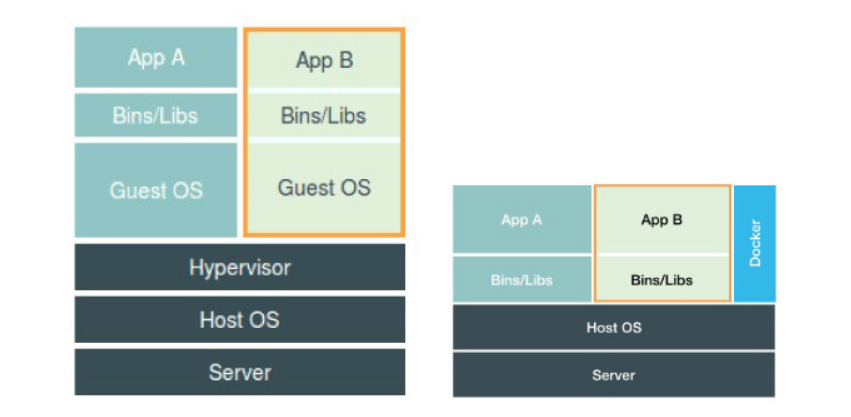
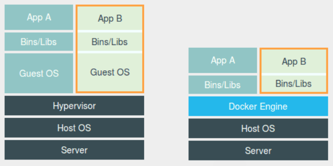
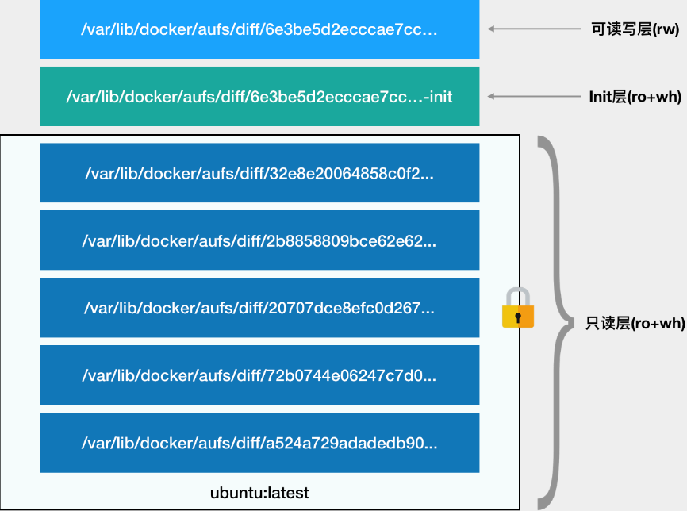

## Docker基础

### 容器是怎么隔离的

**进程**：一些数据加上代码本身的二进制文件，放在磁盘上，就是我们平常所说的一个“程序”，也叫代码的可执行镜像（executable image）。

**程序运起来后的计算机执行环境的总和，就是：进程。**

> “程序”运行起来，就从磁盘上的二进制文件，变成了计算机内存中的数据、寄存器里的值、堆栈中的指令、被打开的文件，以及各种设备的状态信息的一个集合。

静态的表现是程序，动态的表现是进程，**容器技术的核心功能，就是通过约束和修改进程的动态表现，从而为其创造出一个“边界”。**

**Cgroups 技术**是用来制造约束的主要手段，而**Namespace 技术**则是用来修改进程视图的主要方法。

> **Cgroups ：**其名称源自**控制组群**（control groups）的简写，是[Linux内核](https://baike.baidu.com/item/Linux%E5%86%85%E6%A0%B8)的一个功能，用来限制、控制与分离一个[进程组](https://baike.baidu.com/item/%E8%BF%9B%E7%A8%8B%E7%BB%84)的[资源](https://baike.baidu.com/item/%E8%B5%84%E6%BA%90)（如CPU、内存、磁盘输入输出等）。

在Linux启动一个容器

~~~
$ docker run -it busybox /bin/sh
/ #
~~~

> **docker run：**启动容器
>
> **-it：**分配一个文本输入/输入环境，也就是TTY，这样就可以和容器交互

~~~
/ # ps
PID  USER   TIME COMMAND
  1 root   0:00 /bin/sh
  10 root   0:00 ps
~~~

> **注释：**执行ps指令，我们在Docker 里最开始执行的 /bin/sh，就是这个容器内部的第 1 号进程（PID=1），而这个容器里一共只有两个进程在运行。这就意味着，前面执行的 /bin/sh，以及我们刚刚执行的 ps，已经被 Docker 隔离在了一个跟宿主机完全不同的世界当中。

**这种技术，就是 Linux 里面的 Namespace 机制**。

在 Linux 系统中创建线程的系统调用是 clone()，创建一个新进程时，就可以在参数中指定 CLONE_NEWPID 参数，比如：

~~~
int pid = clone(main_function, stack_size, CLONE_NEWPID | SIGCHLD, NULL); 
~~~

这时，新创建的这个进程将会“看到”一个全新的进程空间，在这个进程空间里，它的 PID 是 1。之所以说“看到”，是因为这只是一个“障眼法”，在宿主机真实的进程空间里，这个进程的 PID 还是真实的数值，比如 100。

**除了 PID Namespace，Linux 操作系统还提供了 Mount、UTS、IPC、Network 和 User 这些 Namespace，另外，Linux 在 4.6 版本，5.6 版本，分别加入了 cgroups 和 Time 两种隔离类型用来对各种不同的进程上下文进行“障眼法”操作。**

> **IPC：**隔离System V IPC和POSIX消息队列。
> **Network：**隔离网络资源。
> **Mount：**隔离文件系统挂载点。每个容器能看到不同的文件系统层次结构。
> **PID：**隔离进程ID。
> **UTS：**隔离主机名和域名。
> **User：**隔离用户ID和组ID。
> **Control group (cgroup) Namespace:** 隔离 Cgroups 根目录 (4.6版本加入)
> **Time Namespace:** 隔离系统时间 (5.6版本加入)

**这，就是 Linux 容器最基本的实现原理，容器，其实就是一种特殊的进程。**

### unshare命令实现隔离

通过`unshare`命令，可以快速建立一些隔离的例子，我们拿最简单直观的`pid namespace`来看一下它的效果。

众所周知，Linux 进程号为`1`的，叫做`systemd`进程。但在 Docker 中，我们通过执行`ps`命令，却只能看到非常少的进程列表。

执行下面的命令，进入隔离环境，并将 bash 作为根进程：

- 

```
unshare --pid --fork --mount-proc /bin/bash
```

效果如图所示。可以看到，我们的 bash，已经成为了1号进程，而宿主机和其他隔离环境的进程信息，在这里是不可见的。


先在隔离环境中，执行`sleep 1000`。再开一个终端，在宿主机上执行pstree，我们将会看到这个隔离环境的进行信息。


接下来，在宿主机上，把 sleep 对应进程的命名空间信息，和宿主机的命名空间信息作一下对比。可以看到，它们的`pid namespace`，对应的数值是不同的。


下面给出其他 namespace 的实验性命令，你可以实际操作一下。

```
unshare --mount --fork /bin/bash
```

创建`mount namespace`，并在每个不同的环境中，使用不同的挂载目录。

```
unshare --uts --fork /bin/bash
```

uts 可以用来隔离主机名称，允许每个 namespace 拥有一个独立的主机名，你可以通过`hostname`命令进行修改。

```
unshare --ipc --fork /bin/bash
```

IPC Namespace 主要是用来隔离进程间通信的。Linux 的进程间通信，有管道、信号、报文、共享内存、信号量、套接口等方式。使用了 IPC 命名空间，意味着跨 Namespace 的这些通信方式将全部失效！不过，这也正是我们所希望的到的。

```
unshare --user -r /bin/bash
```

用户命名空间，就非常好理解了。我们可以在一个 Namespace 中建立 xjjdog 账号，也可以在另外一个 Namespace 中建立 xjjdog 账号，而且它们是相互不影响的。

```
unshare --net --fork /bin/bash
```

`net namespace`，这个就非常有用了。它可以用来隔离网络设备、IP 地址和端口等信息。

### 关于namespace

namespace的API包括clone()、setns()以及unshare()，还有/proc下的部分文件。为了确定隔离的到底是哪种namespace，在使用这些API时，通常需要指定以下六个常数的一个或多个，通过|（位或）操作来实现。这六个参数分别是CLONE_NEWIPC、CLONE_NEWNS、CLONE_NEWNET、CLONE_NEWPID、CLONE_NEWUSER和CLONE_NEWUTS。

- 通过clone()创建新进程的同时创建namespace

~~~
int clone(int (*child_func)(void *), void *child_stack, int flags, void *arg);

参数child_func传入子进程运行的程序主函数。
参数child_stack传入子进程使用的栈空间
参数flags表示使用哪些CLONE_*标志位
参数args则可用于传入用户参数

clone()实际上是传统UNIX系统调用fork()的一种更通用的实现方式，它可以通过flags来控制使用多
少功能。一共有二十多种CLONE_*的flag（标志位）参数用来控制clone进程的方方面面（如是否与父
进程共享虚拟内存等等）。
~~~

- 通过setns()加入一个已经存在的namespace

~~~
在进程都结束的情况下，也可以通过挂载的形式把namespace保留下来，保留namespace的目的自然是
为以后有进程加入做准备。通过setns()系统调用，你的进程从原先的namespace加入我们准备好的新
namespace，使用方法如下:

int setns(int fd, int nstype)
参数fd表示我们要加入的namespace的文件描述符。上文已经提到，它是一个指向/proc/[pid]/ns目录
的文件描述符，可以通过直接打开该目录下的链接或者打开一个挂载了该目录下链接的文件得到。

参数nstype让调用者可以去检查fd指向的namespace类型是否符合我们实际的要求。如果填0表示不检查。
复制代码
~~~

- 通过unshare()在原先进程上进行namespace隔离

~~~
后要提的系统调用是unshare()，它跟clone()很像，不同的是，unshare()运行在原先的进程上，
不需要启动一个新进程，使用方法如下:

int unshare(int flags);
调用unshare()的主要作用就是不启动一个新进程就可以起到隔离的效果，相当于跳出原先的
namespace进行操作。这样，你就可以在原进程进行一些需要隔离的操作。Linux中自带的
unshare命令，就是通过unshare()系统调用实现的。
~~~

如下Docker源码，呈现了namespace的创建过程。


### 虚拟机和容器的对比图



> **Hypervisor：**是虚拟机最主要的部分。它通过硬件虚拟化功能，模拟出了运行一个操作系统需要的各种硬件，比如 CPU、内存、I/O 设备等等。然后，它在这些虚拟的硬件上安装了一个新的操作系统，即 Guest OS。

有种对比图是这样的



但是这样并不严谨，Docker Engine不像 Hypervisor 那样对应用进程的隔离环境负责，也不会创建任何实体的“容器”，真正对隔离环境负责的是宿主机操作系统本身。

用户运行在容器里的应用进程，跟宿主机上的其他进程一样，都由宿主机操作系统统一管理，只不过这些被隔离的进程拥有额外设置过的 Namespace 参数。而 Docker 项目在这里扮演的角色，更多的是旁路式的辅助和管理工作。

这样的架构也解释了为什么 Docker 项目比虚拟机更受欢迎的原因。

> 虚拟机里面必须运行一个完整的 Guest OS 才能执行用户的应用进程。这就不可避免地带来了额外的资源消耗和占用。一般情况下虚拟机自己就需要占用 100~200 MB 内存。


### 深入理解容器镜像

**挂载在容器根目录上、用来为容器进程提供隔离后执行环境的文件系统，就是所谓的“容器镜像”。它还有一个更为专业的名字，叫作：rootfs（根文件系统）。**

一个最常见的 rootfs，或者说容器镜像，会包括如下所示的一些目录和文件：

~~~
$ ls /
bin dev etc home lib lib64 mnt opt proc root run sbin sys tmp usr var
~~~

对 Docker 项目来说，它最核心的原理实际上就是为待创建的用户进程：

1. 启用 Linux Namespace 配置；
2. 设置指定的 Cgroups 参数；
3. 切换进程的根目录（Change Root）。

这样，一个完整的容器就诞生了。当然内核还是共享宿主机操作系统的内核。正是由于 rootfs 的存在，容器才有了一个被反复宣传至今的**重要特性：一致性**。

这种深入到操作系统级别的运行环境一致性，打通了应用在本地开发和远端执行环境之间难以逾越的鸿沟。

**问题：**那么开发一个应用，或者升级一下现有的应用，都要重复制作一次 rootfs 吗？我在rootfs装了python环境，部署了python应用，我的其它同事想发布python应用时，当然希望用到我的python环境，而不是他也需要部署一遍。

而docker镜像的设计中，引入了层（layer）的概念，也就是说，用户制作镜像的每一步操作，都会生成一个层，也就是一个增量 rootfs。docker使用的rootfs往往由多个“层”组成：

~~~
$ docker image inspect ubuntu:latest
...
     "RootFS": {
      "Type": "layers",
      "Layers": [
        "sha256:f49017d4d5ce9c0f544c...",
        "sha256:8f2b771487e9d6354080...",
        "sha256:ccd4d61916aaa2159429...",
        "sha256:c01d74f99de40e097c73...",
        "sha256:268a067217b5fe78e000..."
      ]
    }
~~~

> 上面的镜像实际由五个层组成。这五个层就是五个增量 rootfs，每一层都是 Ubuntu 操作系统文件与目录的一部分；

而在使用镜像时，Docker 会把这些增量联合挂载在一个统一的挂载点上。这个挂载点就是 /var/lib/docker/aufs/mnt/，这个目录下面就是一个完整的Ubuntu 操作系统

~~~
$ ls /var/lib/docker/aufs/mnt/6e3be5d2ecccae7cc0fcfa2a2f5c89dc21ee30e166be823ceaeba15dce645b3e
bin boot dev etc home lib lib64 media mnt opt proc root run sbin srv sys tmp usr var
~~~

这五个层的信息记录在 AuFS 的系统目录 /sys/fs/aufs 下面，查看挂载信息找到这个目录对应的 AuFS 的内部 ID（也叫：si）：

~~~
$ cat /proc/mounts| grep aufs
none /var/lib/docker/aufs/mnt/6e3be5d2ecccae7cc0fc... aufs rw,relatime,si=972c6d361e6b32ba,dio,dirperm1 0 0
~~~

通过ID在 /sys/fs/aufs 下查看被联合挂载在一起的各个层的信息：

~~~
$ cat /sys/fs/aufs/si_972c6d361e6b32ba/br[0-9]*
/var/lib/docker/aufs/diff/6e3be5d2ecccae7cc...=rw
/var/lib/docker/aufs/diff/6e3be5d2ecccae7cc...-init=ro+wh
/var/lib/docker/aufs/diff/32e8e20064858c0f2...=ro+wh
/var/lib/docker/aufs/diff/2b8858809bce62e62...=ro+wh
/var/lib/docker/aufs/diff/20707dce8efc0d267...=ro+wh
/var/lib/docker/aufs/diff/72b0744e06247c7d0...=ro+wh
/var/lib/docker/aufs/diff/a524a729adadedb90...=ro+wh
~~~

> 镜像的层都放置在 /var/lib/docker/aufs/diff 目录下，然后被联合挂载在 /var/lib/docker/aufs/mnt 里面。

从这个结构可以看出，这个容器的rootfs由下图的三个部分组成：



我们可以通过docker commit和push指令，保存被修改过的可读写层，并上传到Docker Hub上，供其它人增强使用；且原先的只读层里的内容不会有任何改变；这就解决了刚刚的问题。

