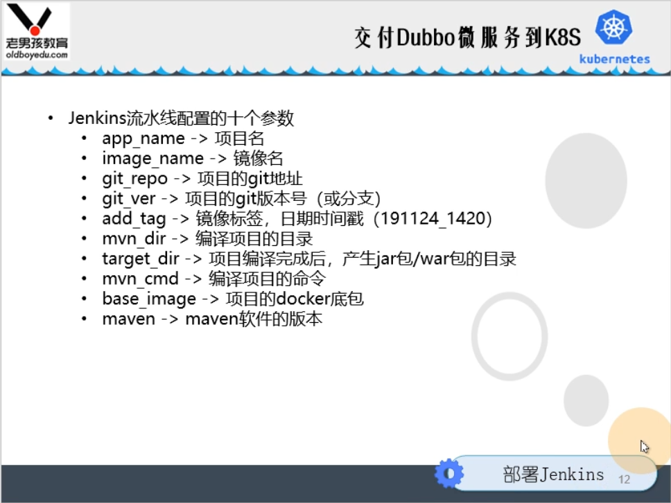
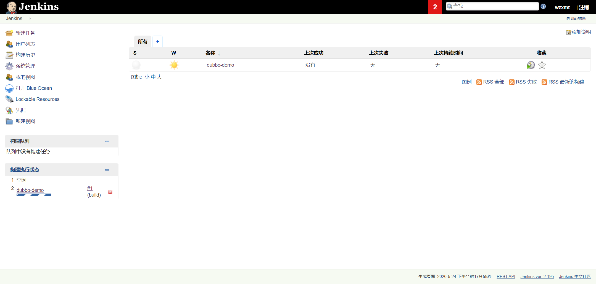
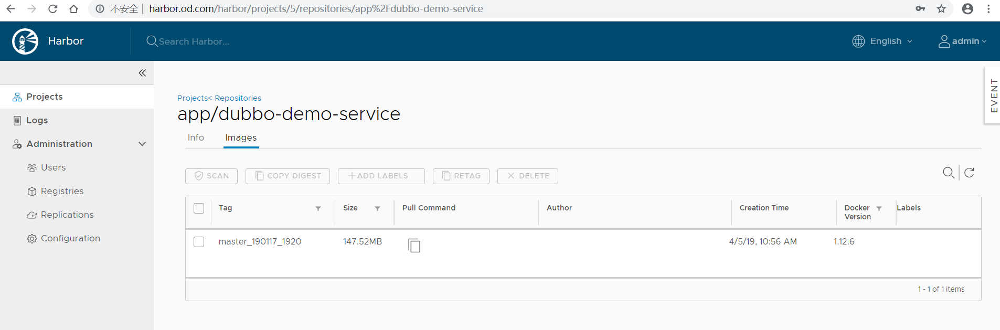
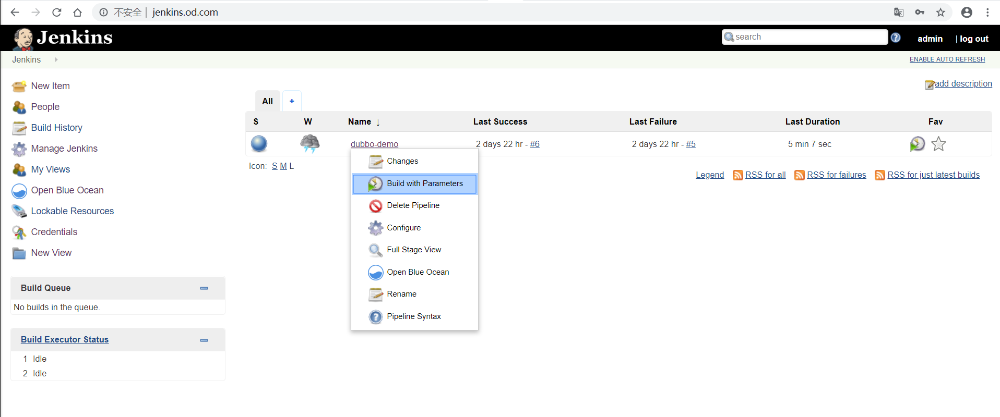
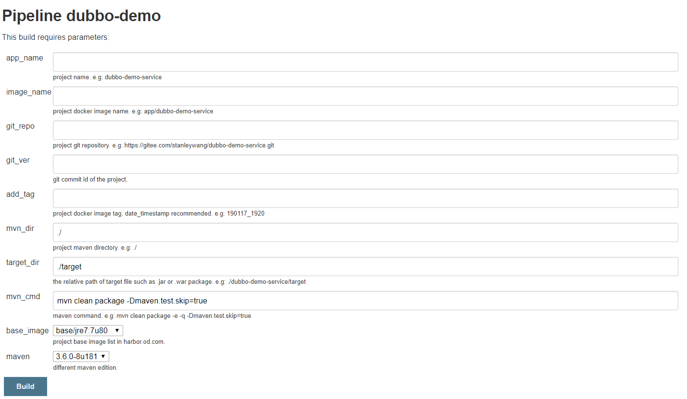
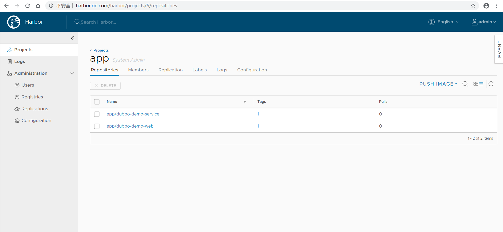

实战交付一套dubbo微服务到kubernetes集群

------

# 基础架构

| 主机名 | 角色                          | ip        |
| :----- | :---------------------------- | :-------- |
| m1     | master节点1，zk1              | 10.0.0.31 |
| m2     | master节点2，zk2              | 10.0.0.32 |
| m3     | master节点3，zk3              | 10.0.0.33 |
| manege | 管理节点，jenkins、docker仓库 | 10.0.0.20 |
| slb01  | slb                           | 10.0.0.11 |
| slb02  | slb                           | 10.0.0.12 |
| n1     | node节点01                    | 10.0.0.41 |
| n2     | node节点02                    | 10.0.0.42 |

# 部署zookeeper

## 安装jdk1.8（3台zk角色主机）

> jdk下载地址
> [jdk1.6](https://www.oracle.com/technetwork/java/javase/downloads/java-archive-downloads-javase6-419409.html)
> [jdk1.7](https://www.oracle.com/technetwork/java/javase/downloads/java-archive-downloads-javase7-521261.html)
> [jdk1.8](https://www.oracle.com/technetwork/java/javase/downloads/jdk8-downloads-2133151.html)

```bash
mkdir -p /opt/java
tar xf /opt/src/jdk-8u251-linux-x64.tar.gz -C /opt/java
ln -s /opt/java/jdk1.8.0_251 /opt/java/jdk
cat << 'EOF' >>/etc/profile
export JAVA_HOME=/opt/java/jdk
export PATH=$JAVA_HOME/bin:$JAVA_HOME/jre/bin:$PATH
export CLASSPATH=.:$JAVA_HOME/lib:$JAVA_HOME/jre/lib:$JAVA_HOME/lib/tools.jar
EOF
```

加载环境变量，验证版本

```bash
source /etc/profile
java -version
```

## 安装zookeeper（3台zk角色主机）

> zk下载地址
> [zookeeper](https://archive.apache.org/dist/zookeeper/)

### 解压、配置

```bash
mkdir -p /opt/zookeeper
tar xf /opt/src/apache-zookeeper-3.5.8-bin.tar.gz -C /opt/zookeeper
ln -s /opt/zookeeper/apache-zookeeper-3.5.8-bin /opt/zookeeper/zookeeper
mkdir -p /data/zookeeper/{data,logs}
cat << EOF >zoo.cfg
tickTime=2000
initLimit=10
syncLimit=5
clientPort=2181
dataDir=/data/zookeeper/data
dataLogDir=/data/zookeeper/logs
server.1=zk1.wzxmt.com:2888:3888
server.2=zk2.wzxmt.com:2888:3888
server.3=zk3.wzxmt.com:2888:3888
EOF
```

**注意：**各节点zk配置相同。

**zookeeper myid各节点一定要不一样**

m1上：

```
echo '1' > /data/zookeeper/data/myid
```

m2上：

```
echo '2' > /data/zookeeper/data/myid
```

m3上：

```
echo '3' > /data/zookeeper/data/myid
```

### 做dns解析

manege

```bash
zk1	60 IN A 10.0.0.31
zk2	60 IN A 10.0.0.32
zk3	60 IN A 10.0.0.33
```

### 依次启动

```bash
/opt/zookeeper/zookeeper/bin/zkServer.sh start
```

查看状态

```bash
[root@m1 src]# /opt/zookeeper/zookeeper/bin/zkServer.sh status
Mode: follower
[root@m2 src]# /opt/zookeeper/zookeeper/bin/zkServer.sh status
Mode: leader
[root@m3 src]# /opt/zookeeper/zookeeper/bin/zkServer.sh status
Mode: follower
```

# 部署jenkins

## jenkins部署及基础配置（略）

## 配置New job

- create new jobs

- Enter an item name

  > dubbo-demo

- Pipeline -> OK

- Discard wzxmt builds

  > Days to keep builds : 3
  > Max # of builds to keep : 30

- This project is parameterized

1. Add Parameter -> String Parameter

   > Name : app_name
   > Default Value :
   > Description : project name. e.g: dubbo-demo-service

2. Add Parameter -> String Parameter

   > Name : image_name
   > Default Value :
   > Description : project docker image name. e.g: app/dubbo-demo-service

3. Add Parameter -> String Parameter

   > Name : git_repo
   > Default Value :
   > Description : project git repository. e.g: https://github.com/wzxmt/dubbo-demo-service.git

4. Add Parameter -> String Parameter

   > Name : git_ver
   > Default Value :
   > Description : git commit id of the project.

5. Add Parameter -> String Parameter

   > Name : add_tag
   > Default Value :
   > Description : project docker image tag, date_timestamp recommended. e.g: 190117_1920

6. Add Parameter -> String Parameter

   > Name : mvn_dir
   > Default Value : ./
   > Description : project maven directory. e.g: ./

7. Add Parameter -> String Parameter

   > Name : target_dir
   > Default Value : ./target
   > Description : the relative path of target file such as .jar or .war package. e.g: ./dubbo-server/target

8. Add Parameter -> String Parameter

   > Name : mvn_cmd
   > Default Value : mvn clean package -Dmaven.test.skip=true
   > Description : maven command. e.g: mvn clean package -e -q -Dmaven.test.skip=true

9. Add Parameter -> Choice Parameter

   > Name : base_image
   > Default Value :
   >
   > - base/jre7:7u80
   > - base/jre8:8u112
   >   Description : project base image list in harbor.od.com.

10. Add Parameter -> Choice Parameter

    > Name : maven
    > Default Value :
    >
    > - 3.6.0-8u181
    > - 3.2.5-6u025
    > - 2.2.1-6u025
    >   Description : different maven edition.



## Pipeline Script

```yaml
pipeline {
  agent any 
    stages {
      stage('pull') { //get project code from repo 
        steps {
          sh "git clone ${params.git_repo} ${params.app_name}/${env.BUILD_NUMBER} && cd ${params.app_name}/${env.BUILD_NUMBER} && git checkout ${params.git_ver}"
        }
      }
      stage('build') { //exec mvn cmd
        steps {
          sh "cd ${params.app_name}/${env.BUILD_NUMBER}  && /var/jenkins_home/maven-${params.maven}/bin/${params.mvn_cmd}"
        }
      }
      stage('package') { //move jar file into project_dir
        steps {
          sh "cd ${params.app_name}/${env.BUILD_NUMBER} && cd ${params.target_dir} && mkdir project_dir && mv *.jar ./project_dir"
        }
      }
      stage('image') { //build image and push to registry
        steps {
          writeFile file: "${params.app_name}/${env.BUILD_NUMBER}/Dockerfile", text: """FROM harbor.wzxmt.com/${params.base_image}
ADD ${params.target_dir}/project_dir /opt/project_dir"""
          sh "cd  ${params.app_name}/${env.BUILD_NUMBER} && docker build -t harbor.wzxmt.com/${params.image_name}:${params.git_ver}_${params.add_tag} . && docker push harbor.wzxmt.com/${params.image_name}:${params.git_ver}_${params.add_tag} && docker rmi harbor.wzxmt.com/${params.image_name}:${params.git_ver}_${params.add_tag}"
        }
      }
   }
}
```

## 制作dubbo微服务的底包镜像

运维主机上

1. 自定义Dockerfile

```bash
mkdir -p /data/software/dockerfile/jre8
cd /data/software/dockerfile/jre8
cat << EOF >Dockerfile
FROM stanleyws/jre8:8u112
RUN /bin/cp /usr/share/zoneinfo/Asia/Shanghai /etc/localtime &&\
    echo 'Asia/Shanghai' >/etc/timezone
ADD config.yml /opt/prom/config.yml
ADD jmx_javaagent-0.3.1.jar /opt/prom/
WORKDIR /opt/project_dir
ADD entrypoint.sh /entrypoint.sh
CMD ["/entrypoint.sh"]
EOF
```

config.yml

```bash
cat << 'EOF' >config.yml
---
rules:
  - pattern: '.*'
EOF
```

jmx_javaagent-0.3.1.jar

```bash
wget https://repo1.maven.org/maven2/io/prometheus/jmx/jmx_prometheus_javaagent/0.3.1/jmx_prometheus_javaagent-0.3.1.jar -O jmx_javaagent-0.3.1.jar
```

entrypoint.sh

```bash
cat << 'EOF' >entrypoint.sh
#!/bin/sh
M_OPTS="-Duser.timezone=Asia/Shanghai -javaagent:/opt/prom/jmx_javaagent-0.3.1.jar=$(hostname -i):${M_PORT:-"12346"}:/opt/prom/config.yml"
C_OPTS=${C_OPTS}
JAR_BALL=${JAR_BALL}
exec java -jar ${M_OPTS} ${C_OPTS} ${JAR_BALL}
EOF
chmod +x entrypoint.sh
```

制作dubbo服务docker底包

```bash
docker build . -t harbor.wzxmt.com/base/jre8:8u112
docker push harbor.wzxmt.com/base/jre8:8u112
```

**注意：**jre7底包制作类似，这里略

# 交付dubbo微服务至kubernetes集群

## dubbo服务提供者（dubbo-demo-service）

### 通过jenkins进行一次CI

打开jenkins页面，使用admin登录，准备构建`dubbo-demo`项目


点`Build with Parameters`


依次填入/选择：

- app_name

  > dubbo-demo-service

- image_name

  > app/dubbo-demo-service

- git_repo

  > https://github.com/wzxmt/dubbo-demo-service.git

- git_ver

  > master

- add_tag

  > 200525_0100

- mvn_dir

  > /

- target_dir

  > ./dubbo-server/target

- mvn_cmd

  > mvn clean package -Dmaven.test.skip=true

- base_image

  > base/jre8:8u112

- maven

  > 3.6.0-8u181

点击`Build`进行构建，等待构建完成。

test $? -eq 0 && 成功，进行下一步 || 失败，排错直到成功

### 检查harbor仓库内镜像



### 准备k8s资源配置清单

运维主机上，准备资源配置清单：

```yaml
mkdir dubbo-demo-service -p && cd dubbo-demo-service
cat << 'EOF' >deployment.yaml
kind: Deployment
apiVersion: apps/v1
metadata:
  name: dubbo-demo-service
  namespace: app
  labels: 
    name: dubbo-demo-service
spec:
  replicas: 1
  selector:
    matchLabels: 
      name: dubbo-demo-service
  template:
    metadata:
      labels: 
        app: dubbo-demo-service
        name: dubbo-demo-service
    spec:
      containers:
      - name: dubbo-demo-service
        image: harbor.wzxmt.com/app/dubbo-demo-service:master_200526_2355
        ports:
        - containerPort: 20880
          protocol: TCP
        env:
        - name: JAR_BALL
          value: dubbo-server.jar
        imagePullPolicy: IfNotPresent
      imagePullSecrets:
      - name: harborlogin
      restartPolicy: Always
      terminationGracePeriodSeconds: 30
      securityContext: 
        runAsUser: 0
      schedulerName: default-scheduler
  strategy:
    type: RollingUpdate
    rollingUpdate: 
      maxUnavailable: 1
      maxSurge: 1
  revisionHistoryLimit: 7
  progressDeadlineSeconds: 600
EOF
```

### 应用资源配置清单

在任意一台k8s运算节点执行：

```bash
kubectl create ns app
kubectl create secret docker-registry harborlogin \
--namespace=app  \
--docker-server=https://harbor.wzxmt.com \
--docker-username=admin \
--docker-password=admin

kubectl apply -f deployment.yaml
```

### 检查docker运行情况及zk里的信息

```bash
/opt/zookeeper/zookeeper/bin/zkCli.sh 
#打开另外一个zookeeper
/opt/zookeeper/bin/zkCli.sh -server localhost
[zk: localhost(CONNECTED) 0] ls /dubbo
[com.od.dubbotest.api.HelloService]
```

## dubbo-monitor工具

[dubbo-monitor源码包](https://github.com/alibaba/dubbo/archive/dubbo-2.6.0.zip)

#### 下载源码

```bash
wget https://github.com/alibaba/dubbo/archive/dubbo-2.6.0.zip
unzip dubbo-2.6.0.zip && cd dubbo-dubbo-2.6.0/dubbo-simple/dubbo-monitor-simple
```

安装依赖，编译dubbo-monitor

```bash
yum -y install java-1.8.0-openjdk maven
mvn clean install
```

编译成功后的目标文件为：target/dubbo-monitor-simple-2.6.0-assembly.tar.gz

解压

```bash
mkdir -p /root/dockerfile/dubbo-monitor
tar xf target/dubbo-monitor-simple-2.6.0-assembly.tar.gz
mv dubbo-monitor-simple-2.6.0 /root/dockerfile/dubbo-monitor/dubbo-monitor-simple
cd /root/dockerfile/dubbo-monitor
```

#### 制作镜像

1. 准备环境

   修改启动初始化内存

   ```bash
   chmod +x dubbo-monitor-simple/bin/*
   sed -i "s#128m#16m#g;s#256m#32m#g;s#1g#128m#g;s#2g#256m#g" dubbo-monitor-simple/bin/start.sh
   sed -i '69,$d' dubbo-monitor-simple/bin/start.sh
   echo 'exec java $JAVA_OPTS $JAVA_MEM_OPTS $JAVA_DEBUG_OPTS $JAVA_JMX_OPTS -classpath $CONF_DIR:$LIB_JARS com.alibaba.dubbo.container.Main &> $STDOUT_FILE' >>dubbo-monitor-simple/bin/start.sh
   ```
   
2. 准备Dockerfile

   ```bash
   \cp /usr/share/zoneinfo/Asia/Shanghai ./
   cat << EOF >Dockerfile
   FROM jeromefromcn/docker-alpine-java-bash
   MAINTAINER Jerome Jiang
   WORKDIR /dubbo-monitor-simple
   ADD Shanghai /etc/localtime
   COPY dubbo-monitor-simple/ /dubbo-monitor-simple/
   CMD bin/start.sh
   EOF
   ```

3. build镜像

   ```bash
   docker build . -t harbor.wzxmt.com/infra/dubbo-monitor:latest
   docker push harbor.wzxmt.com/infra/dubbo-monitor:latest
   ```

### 解析域名

```bash
dubbo-monitor IN A 60 10.0.0.50
```

### 准备k8s资源配置清单

```
mkdir dubbo-monitor -p
cd dubbo-monitor
```

ConfigMap

```yaml
cat << 'EOF' >cm.yaml
apiVersion: v1
kind: ConfigMap
metadata:
  name: cm-monitor
  namespace: infra
data:
  dubbo.properties: |
    dubbo.container=log4j,spring,registry,jetty
    dubbo.application.name=monitor
    dubbo.application.owner=wzxmt
    dubbo.registry.address=zookeeper://zk-0.zk-hs.infra.svc.cluster.local:2181?backup=zk1.wzxmt.com:3181,zk1.wzxmt.com:4181
    dubbo.protocol.port=20880
    dubbo.jetty.port=8080
    dubbo.jetty.directory=/dubbo-monitor-simple/monitor
    dubbo.charts.directory=/dubbo-monitor-simple/charts
    dubbo.statistics.directory=/dubbo-monitor-simple/monitor/statistics
    dubbo.log4j.file=logs/dubbo-monitor-simple.log
    dubbo.log4j.level=WARN
EOF
```

deployment

```yaml
cat << EOF >dp.yaml
kind: Deployment
apiVersion: apps/v1
metadata:
  name: dubbo-monitor
  namespace: infra
  labels:
    name: dubbo-monitor
spec:
  replicas: 1
  selector:
    matchLabels:
      name: dubbo-monitor
  template:
    metadata:
      labels:
        app: dubbo-monitor
        name: dubbo-monitor
    spec:
      containers:
      - name: dubbo-monitor
        image: harbor.wzxmt.com/infra/dubbo-monitor:latest
        ports:
        - containerPort: 8080
          protocol: TCP
        - containerPort: 20880
          protocol: TCP
        imagePullPolicy: IfNotPresent
        volumeMounts:
        - mountPath: /dubbo-monitor-simple/conf
          name: dubbo-monitor-cm
      volumes:
      - name: dubbo-monitor-cm
        configMap:
          name: cm-monitor
      imagePullSecrets:
      - name: harborlogin
      restartPolicy: Always
      terminationGracePeriodSeconds: 30
      securityContext:
        runAsUser: 0
      schedulerName: default-scheduler
  strategy:
    type: RollingUpdate
    rollingUpdate:
      maxUnavailable: 1
      maxSurge: 1
  revisionHistoryLimit: 7
  progressDeadlineSeconds: 600
EOF
```

Service

```yaml
cat << EOF >svc.yaml
kind: Service
apiVersion: v1
metadata: 
  name: dubbo-monitor
  namespace: infra
spec:
  ports:
  - protocol: TCP
    port: 8080
    targetPort: 8080
  selector: 
    app: dubbo-monitor
  type: ClusterIP
  sessionAffinity: None
EOF
```

ingress

```yaml
cat << EOF >ingress.yaml
apiVersion: extensions/v1beta1
kind: Ingress
metadata:  
  name: dubbo-monitor
  namespace: infra
  annotations:
    traefik.ingress.kubernetes.io/router.entrypoints: web
spec:  
  rules:    
    - host: dubbo-monitor.wzxmt.com     
      http:        
        paths:        
        - path: /          
          backend:            
            serviceName: dubbo-monitor            
            servicePort: 8080
EOF
```

### 应用资源配置清单

在任意一台k8s运算节点执行：

```bash
kubectl apply -f ./
```

### 浏览器访问

http://dubbo-monitor.wzxmt.com

## dubbo服务消费者（dubbo-demo-consumer）

### 通过jenkins进行一次CI

打开jenkins页面，使用admin登录，准备构建`dubbo-demo`项目


点`Build with Parameters`


依次填入/选择：

- app_name

  > dubbo-demo-consumer

- image_name

  > app/dubbo-demo-consumer

- git_repo

  > https://github.com/wzxmt/dubbo-demo-web.git

- git_ver

  > master

- add_tag

  > 200527_2150

- mvn_dir

  > ./

- target_dir

  > ./dubbo-client/target

- mvn_cmd

  > mvn clean package -Dmaven.test.skip=true

- base_image

  > base/jre8:8u112

- maven

  > 3.6.0-8u181

点击`Build`进行构建，等待构建完成。

test $? -eq 0 && 成功，进行下一步 || 失败，排错直到成功

### 检查harbor仓库内镜像



### 解析域名

```bash
demo IN A 60 10.0.0.50
```

### 准备k8s资源配置清单

运维主机准备资源配置清单

deployment

```yaml
mkdir -p dubbo-demo-consumer && cd dubbo-demo-consumer
cat << EOF >dp.yaml
kind: Deployment
apiVersion: apps/v1
metadata:
  name: dubbo-demo-consumer
  namespace: app
  labels: 
    name: dubbo-demo-consumer
spec:
  replicas: 1
  selector:
    matchLabels: 
      name: dubbo-demo-consumer
  template:
    metadata:
      labels: 
        app: dubbo-demo-consumer
        name: dubbo-demo-consumer
    spec:
      containers:
      - name: dubbo-demo-consumer
        image: harbor.wzxmt.com/app/dubbo-demo-consumer:master_200527_2150
        ports:
        - containerPort: 8080
          protocol: TCP
        - containerPort: 20880
          protocol: TCP
        env:
        - name: JAR_BALL
          value: dubbo-client.jar
        imagePullPolicy: IfNotPresent
      imagePullSecrets:
      - name: harborlogin
      restartPolicy: Always
      terminationGracePeriodSeconds: 30
      securityContext: 
        runAsUser: 0
      schedulerName: default-scheduler
  strategy:
    type: RollingUpdate
    rollingUpdate: 
      maxUnavailable: 1
      maxSurge: 1
  revisionHistoryLimit: 7
  progressDeadlineSeconds: 600
EOF
```

Service

```yaml
cat << EOF >svc.yaml
kind: Service
apiVersion: v1
metadata: 
  name: dubbo-demo-consumer
  namespace: app
spec:
  ports:
  - protocol: TCP
    port: 8080
    targetPort: 8080
  selector: 
    app: dubbo-demo-consumer
  clusterIP: None
  type: ClusterIP
  sessionAffinity: None
EOF
```

ingress

```yaml
cat << EOF >ingress.yaml
apiVersion: extensions/v1beta1
kind: Ingress
metadata:  
  name: dubbo-demo-consumer
  namespace: app
  annotations:
    traefik.ingress.kubernetes.io/router.entrypoints: web
spec:  
  rules:    
    - host: demo.wzxmt.com      
      http:        
        paths:        
        - path: /          
          backend:            
            serviceName: dubbo-demo-consumer            
            servicePort: 8080
EOF
```

### 应用资源配置清单

```bash
kubectl apply -f ./
```

### 检查dubbo-monitor

http://dubbo-monitor.wzxmt.com

### 浏览器访问

http://demo.wzxmt.com/hello?name=wangdao

# 实战维护dubbo微服务集群

## 更新（rolling update）

- 修改代码提git（发版）

- 使用jenkins进行CI

- 修改并应用k8s资源配置清单

  > 或者在k8s的dashboard上直接操作

## 扩容（scaling）

- k8s的dashboard上直接操作