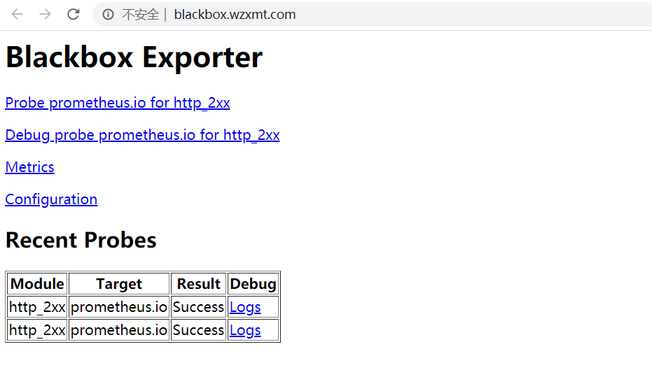
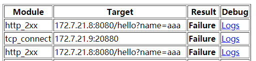

## 部署kube-state-metrics

[kube-state-metricsgithub 项目地址](https://github.com/kubernetes/kube-state-metrics)

kube-state-metrics 是一个简单的服务，它侦听 Kubernetes API 服务器并生成有关对象状态的指标

创建名称空间

```bash
kubectl create ns monitoring
```

创建create

```bash
kubectl create secret docker-registry harborlogin \
--namespace=monitoring  \
--docker-server=https://harbor.wzxmt.com \
--docker-username=admin \
--docker-password=admin
```

准备kube-state-metrics镜像

[kube-state-metrics官方quay.io地址](https://quay.io/repository/coreos/kube-state-metrics?tab=info)

```bash
docker pull quay.io/coreos/kube-state-metrics:v1.9.8
docker tag quay.io/coreos/kube-state-metrics:v1.9.8 harbor.wzxmt.com/k8s/kube-state-metrics:v1.9.8
docker push harbor.wzxmt.com/k8s/kube-state-metrics:v1.9.8
```

准备资源配置清单

```bash
mkdir prometheus -p && cd prometheus
mkdir -p kube-state-metrics && cd  kube-state-metrics
```

RBAC

```yaml
cat << 'EOF' >rbac.yaml
apiVersion: v1
kind: ServiceAccount
metadata:
  labels:
    app.kubernetes.io/name: kube-state-metrics
    app.kubernetes.io/version: 1.9.8
  name: kube-state-metrics
  namespace: monitoring
---
apiVersion: rbac.authorization.k8s.io/v1
kind: ClusterRole
metadata:
  labels:
    app.kubernetes.io/name: kube-state-metrics
    app.kubernetes.io/version: 1.9.8
  name: kube-state-metrics
rules:
- apiGroups:
  - ""
  resources:
  - configmaps
  - secrets
  - nodes
  - pods
  - services
  - resourcequotas
  - replicationcontrollers
  - limitranges
  - persistentvolumeclaims
  - persistentvolumes
  - namespaces
  - endpoints
  verbs:
  - list
  - watch
- apiGroups:
  - extensions
  resources:
  - daemonsets
  - deployments
  - replicasets
  - ingresses
  verbs:
  - list
  - watch
- apiGroups:
  - apps
  resources:
  - statefulsets
  - daemonsets
  - deployments
  - replicasets
  verbs:
  - list
  - watch
- apiGroups:
  - batch
  resources:
  - cronjobs
  - jobs
  verbs:
  - list
  - watch
- apiGroups:
  - autoscaling
  resources:
  - horizontalpodautoscalers
  verbs:
  - list
  - watch
- apiGroups:
  - authentication.k8s.io
  resources:
  - tokenreviews
  verbs:
  - create
- apiGroups:
  - authorization.k8s.io
  resources:
  - subjectaccessreviews
  verbs:
  - create
- apiGroups:
  - policy
  resources:
  - poddisruptionbudgets
  verbs:
  - list
  - watch
- apiGroups:
  - certificates.k8s.io
  resources:
  - certificatesigningrequests
  verbs:
  - list
  - watch
- apiGroups:
  - storage.k8s.io
  resources:
  - storageclasses
  - volumeattachments
  verbs:
  - list
  - watch
- apiGroups:
  - admissionregistration.k8s.io
  resources:
  - mutatingwebhookconfigurations
  - validatingwebhookconfigurations
  verbs:
  - list
  - watch
- apiGroups:
  - networking.k8s.io
  resources:
  - networkpolicies
  verbs:
  - list
  - watch
- apiGroups:
  - coordination.k8s.io
  resources:
  - leases
  verbs:
  - list
  - watch
---
apiVersion: rbac.authorization.k8s.io/v1
kind: ClusterRoleBinding
metadata:
  labels:
    app.kubernetes.io/name: kube-state-metrics
    app.kubernetes.io/version: 1.9.8
  name: kube-state-metrics
roleRef:
  apiGroup: rbac.authorization.k8s.io
  kind: ClusterRole
  name: kube-state-metrics
subjects:
- kind: ServiceAccount
  name: kube-state-metrics
  namespace: monitoring
EOF
```

Deployment

```yaml
cat << 'EOF' >dp.yaml
apiVersion: apps/v1
kind: Deployment
metadata:
  annotations:
    deployment.kubernetes.io/revision: "2"
  labels:
    app.kubernetes.io/name: kube-state-metrics
    app.kubernetes.io/version: 1.9.8
  name: kube-state-metrics
  namespace: monitoring
spec:
  selector:
    matchLabels:
      app.kubernetes.io/name: kube-state-metrics
      app.kubernetes.io/version: 1.9.8
  strategy:
    rollingUpdate:
      maxSurge: 25%
      maxUnavailable: 25%
    type: RollingUpdate
  template:
    metadata:
      creationTimestamp: null
      labels:
        app.kubernetes.io/name: kube-state-metrics
        app.kubernetes.io/version: 1.9.8
    spec:
      containers:
      - image: harbor.wzxmt.com/k8s/kube-state-metrics:v1.9.8
        name: kube-state-metrics
        ports:
        - containerPort: 8080
          name: http-metrics
          protocol: TCP
        readinessProbe:
          failureThreshold: 3
          httpGet:
            path: /healthz
            port: 8080
            scheme: HTTP
          initialDelaySeconds: 5
          periodSeconds: 10
          successThreshold: 1
          timeoutSeconds: 5
        imagePullPolicy: IfNotPresent
      imagePullSecrets:
      - name: harborlogin
      restartPolicy: Always
      serviceAccount: kube-state-metrics
      serviceAccountName: kube-state-metrics
EOF
```

Service

```yaml
cat << 'EOF' >svc.yaml
apiVersion: v1
kind: Service
metadata:
  name: kube-state-metrics
  namespace: monitoring
  labels:
    app.kubernetes.io/name: kube-state-metrics
    app.kubernetes.io/version: 1.9.8
spec:
  ports:
  - port: 8080
    protocol: TCP
    name: kube-state-metrics
  selector:
    app.kubernetes.io/name: kube-state-metrics
    app.kubernetes.io/version: 1.9.8
  type: ClusterIP
EOF
```

Ingress

```yaml
cat << 'EOF' >ingress.yaml
apiVersion: traefik.containo.us/v1alpha1
kind: IngressRoute
metadata:
  name: kube-state-metrics
  namespace: monitoring
spec:
  entryPoints:
  - web
  routes:
  - match: Host(`kubestate.wzxmt.com`) && PathPrefix(`/`)
    kind: Rule
    services:
    - name: kube-state-metrics
      port: 8080
EOF
```

部署

```
kubectl apply -f ./
```

http://kubestate.wzxmt.com/metrics

## 部署node-exporter

[node-exporter官方dockerhub地址](https://hub.docker.com/r/prom/node-exporter)
[node-expoerer官方github地址](https://github.com/prometheus/node_exporter)

```bash
docker pull quay.io/prometheus/node-exporter:v1.1.2
docker tag quay.io/prometheus/node-exporter:v1.1.2 harbor.wzxmt.com/k8s/node-exporter:v1.1.2
docker push harbor.wzxmt.com/k8s/node-exporter:v1.1.2
```

### docker部署

```bash
docker run -d --rm --name node-exporter \
-v "/proc:/host/proc" \
-v "/sys:/host/sys" \
-v "/:/rootfs" \
--net=host \
harbor.wzxmt.com/k8s/node-exporter:v1.1.2 \
--path.procfs /host/proc \
--path.sysfs /host/sys \
--collector.filesystem.ignored-mount-points '^/(dev|proc|sys|var/lib/docker/.+|var/lib/kubelet/pods/.+)($|/)' \
--collector.netclass.ignored-devices '^(veth.*)$' \
--collector.netdev.device-exclude '^(veth.*)$'
```

创建目录

```bash
mkdir -p node-exporter && cd node-exporter
```

### k8s容器部署

```yaml
cat<< 'EOF' >ds.yaml
kind: DaemonSet
apiVersion: apps/v1
metadata:
  name: node-exporter
  namespace: monitoring
  labels:
    daemon: "node-exporter"
    prometheus: "true"
spec:
  updateStrategy:
    rollingUpdate:
      maxUnavailable: 10%
    type: RollingUpdate
  selector:
    matchLabels:
      daemon: "node-exporter"
      prometheus: "true"
  template:
    metadata:
      labels:
        daemon: "node-exporter"
        prometheus: "true"
    spec:
      tolerations:
      - key: node-role.kubernetes.io/master
        operator: Exists
        effect: NoSchedule
      containers:
      - name: node-exporter
        image: harbor.wzxmt.com/k8s/node-exporter:v1.1.2
        args:
        - --path.procfs=/host/proc
        - --path.sysfs=/host/sys
        - --path.rootfs=/rootfs
        - --no-collector.wifi
        - --no-collector.hwmon
        - --collector.filesystem.ignored-mount-points=^/(dev|proc|sys|var/lib/docker/.+|var/lib/kubelet/pods/.+)($|/)
        - --collector.netclass.ignored-devices=^(veth.*)$
        - --collector.netdev.device-exclude=^(veth.*)$
        securityContext:
          runAsUser: 0     #设置以ROOT用户运行容器
          privileged: true #拥有特权
        ports:
        - name: node-exporter
          hostPort: 9100
          containerPort: 9100
          protocol: TCP
        resources:
          limits:
            cpu: 150m
            memory: 150Mi
          requests:
            cpu: 50m
            memory: 50Mi
        volumeMounts:
        - name: proc
          mountPath: /host/proc
        - name: sys
          mountPath: /host/sys
        - name: root
          mountPath: /rootfs
      volumes:
      - name: proc
        hostPath:
          path: /proc
      - name: sys
        hostPath:
          path: /sys
      - name: root
        hostPath:
          path: /
      imagePullSecrets:
      - name: harborlogin
      restartPolicy: Always
      hostNetwork: true
EOF
```

部署

```bash
kubectl apply -f ./
```

## 部署cadvisor

[cadvisor官方dockerhub地址](https://hub.docker.com/r/google/cadvisor)
[cadvisor官方github地址](https://github.com/google/cadvisor)

```bash
docker pull google/cadvisor:v0.33.0
docker tag google/cadvisor:v0.33.0 harbor.wzxmt.com/k8s/cadvisor:v0.33.0
docker push harbor.wzxmt.com/k8s/cadvisor:v0.33.0
```

### docker部署

```bash
#注意docker存储的位置
docker run --rm --name=cadvisor -d \
   -v /:/rootfs:ro \
   -v /var/run:/var/run:ro \
   -v /sys:/sys:ro \
   -v /data/docker/:/var/lib/docker:ro \
   -v /dev/disk/:/dev/disk:ro \
   -v /cgroup:/cgroup:ro \
   --privileged=true \
   --publish=4194:8080 \
   harbor.wzxmt.com/k8s/cadvisor:v0.33.0
```

### k8s部署

```bash
mkdir -p cadvisor && cd cadvisor
```

DaemonSet

```yaml
cat << 'EOF' >ds.yaml
apiVersion: apps/v1
kind: DaemonSet
metadata:
  name: cadvisor
  namespace: monitoring
  labels:
    app: cadvisor
spec:
  selector:
    matchLabels:
      name: cadvisor
  template:
    metadata:
      labels:
        name: cadvisor
    spec:
      hostNetwork: true
      tolerations:
      - key: node-role.kubernetes.io/master
        operator: Exists
        effect: NoSchedule
      containers:
      - name: cadvisor
        image: harbor.wzxmt.com/k8s/cadvisor:v0.33.0
        imagePullPolicy: IfNotPresent
        securityContext:
          runAsUser: 0     #设置以ROOT用户运行容器
          privileged: true #拥有特权
        volumeMounts:
        - name: rootfs
          mountPath: /rootfs
          readOnly: true
        - name: var-run
          mountPath: /var/run
          readOnly: false
        - name: sys
          mountPath: /sys
          readOnly: true
        - name: docker
          mountPath: /var/lib/docker
          readOnly: true
        ports:
          - name: http
            containerPort: 4194
            protocol: TCP
        resources:
          limits:
            cpu: 200m
            memory: 200Mi
          requests:
            cpu: 50m
            memory: 50Mi
        readinessProbe:
          tcpSocket:
            port: 4194
          initialDelaySeconds: 5
          periodSeconds: 10
        args:
          - --housekeeping_interval=10s
          - --port=4194
      imagePullSecrets:
      - name: harborlogin
      terminationGracePeriodSeconds: 30
      volumes:
      - name: rootfs
        hostPath:
          path: /
      - name: var-run
        hostPath:
          path: /var/run
      - name: sys
        hostPath:
          path: /sys
      - name: docker
        hostPath:
          path: /data/docker
EOF
```

修改运算节点软连接,所有运算节点上：

```bash
mount -o remount,rw /sys/fs/cgroup/
ln -s /sys/fs/cgroup/cpu,cpuacct/ /sys/fs/cgroup/cpuacct,cpu
ll /sys/fs/cgroup|grep cpu
```

部署

```bash
kubectl apply -f ds.yaml
```

## 部署blackbox-exporter

[blackbox-exporter官方github地址](https://github.com/prometheus/blackbox_exporter)

镜像私有

```bash
docker pull prom/blackbox-exporter:v0.19.0
docker tag prom/blackbox-exporter:v0.19.0 harbor.wzxmt.com/k8s/blackbox-exporter:v0.19.0
docker push harbor.wzxmt.com/k8s/blackbox-exporter:v0.19.0
```

创建目录

```bash
mkdir -p blackbox-exporter && cd blackbox-exporter
```

ConfigMap

```yaml
cat << 'EOF' >cm.yaml
apiVersion: v1
kind: ConfigMap
metadata:
  labels:
    app: blackbox-exporter
  name: blackbox-exporter
  namespace: monitoring
data:
  blackbox.yml: |-
    modules:
      http_2xx: # http 监测模块
        prober: http
        timeout: 2s
        http:
          valid_http_versions: ["HTTP/1.1", "HTTP/2"]
          valid_status_codes: [200,301,302]
          method: GET
          preferred_ip_protocol: "ip4"
      http_post_2xx: # http post 监测模块
        prober: http
        http:
          method: POST
      tcp_connect:
        prober: tcp
        timeout: 2s
      ping: # icmp 检测模块
        prober: icmp
        timeout: 5s
        icmp:
          preferred_ip_protocol: "ip4"
EOF
```

Deployment

```yaml
cat << 'EOF' >dp.yaml
kind: Deployment
apiVersion: apps/v1
metadata:
  name: blackbox-exporter
  namespace: monitoring
  labels:
    app: blackbox-exporter
spec:
  replicas: 1
  selector:
    matchLabels:
      app: blackbox-exporter
  template:
    metadata:
      labels:
        app: blackbox-exporter
    spec:
      volumes:
      - name: config
        configMap:
          name: blackbox-exporter
          defaultMode: 420
      containers:
      - name: blackbox-exporter
        image: harbor.wzxmt.com/k8s/blackbox-exporter:v0.19.0
        args:
        - --config.file=/etc/blackbox_exporter/blackbox.yml
        - --log.level=debug
        - --web.listen-address=:9115
        ports:
        - name: blackbox-port
          containerPort: 9115
          protocol: TCP
        resources:
          limits:
            cpu: 200m
            memory: 200Mi
          requests:
            cpu: 50m
            memory: 50Mi
        volumeMounts:
        - name: config
          mountPath: /etc/blackbox_exporter
        readinessProbe:
          tcpSocket:
            port: 9115
          initialDelaySeconds: 5
          timeoutSeconds: 5
          periodSeconds: 10
          successThreshold: 1
          failureThreshold: 3
        imagePullPolicy: IfNotPresent
      imagePullSecrets:
      - name: harborlogin
      restartPolicy: Always
EOF
```

Service

```yaml
cat << 'EOF' >svc.yaml
kind: Service
apiVersion: v1
metadata:
  name: blackbox-exporter
  namespace: monitoring
  labels:
    app: blackbox-exporter
spec:
  selector:
    app: blackbox-exporter
  ports:
    - protocol: TCP
      port: 9115
      name: http
EOF
```

Ingress

```yaml
cat << 'EOF' >ingress.yaml
apiVersion: traefik.containo.us/v1alpha1
kind: IngressRoute
metadata:
  name: blackbox-exporter
  namespace: monitoring
spec:
  entryPoints:
    - web
  routes:
  - match: HostRegexp(`blackbox.wzxmt.com`)
    kind: Rule
    services:
    - name: blackbox-exporter
      port: 9115
EOF
```

解析域名

```
blackbox	60 IN A 10.0.0.50
```

部署

```bash
kubectl apply -f ./
```

访问

[http://blackbox.wzxmt.com](http://blackbox.wzxmt.com/)



## 部署prometheus

[prometheus官方dockerhub地址](https://hub.docker.com/r/prom/prometheus)
[prometheus官方github地址](https://github.com/prometheus/prometheus)

```bash
docker pull prom/prometheus:v2.22.2
docker tag prom/prometheus:v2.22.2 harbor.wzxmt.com/k8s/prometheus:v2.22.2
docker push harbor.wzxmt.com/k8s/prometheus:v2.22.2
```

创建目录

```bash
mkdir -p prometheus && cd prometheus
```

RBAC

```yaml
cat << 'EOF' >rbac.yaml
apiVersion: v1
kind: ServiceAccount
metadata:
  labels:
    app: prometheus
  name: prometheus
  namespace: monitoring
---
apiVersion: rbac.authorization.k8s.io/v1
kind: ClusterRole
metadata:
  labels:
    app: prometheus
  name: prometheus
rules:
- apiGroups:
  - ""
  resources:
  - nodes
  - nodes/metrics
  - services
  - endpoints
  - pods
  verbs:
  - get
  - list
  - watch
- apiGroups:
  - ""
  resources:
  - configmaps
  verbs:
  - get
- nonResourceURLs:
  - /metrics
  verbs:
  - get
---
apiVersion: rbac.authorization.k8s.io/v1
kind: ClusterRoleBinding
metadata:
  labels:
    app: prometheus
  name: prometheus
roleRef:
  apiGroup: rbac.authorization.k8s.io
  kind: ClusterRole
  name: prometheus
subjects:
- kind: ServiceAccount
  name: prometheus
  namespace: monitoring
EOF
```

Deployment

```yaml
cat << 'EOF' >dp.yaml
apiVersion: apps/v1
kind: Deployment
metadata:
  labels:
    app: prometheus
  name: prometheus
  namespace: monitoring
spec:
  progressDeadlineSeconds: 600
  replicas: 1
  revisionHistoryLimit: 7
  selector:
    matchLabels:
      app: prometheus
  strategy:
    rollingUpdate:
      maxSurge: 1
      maxUnavailable: 1
    type: RollingUpdate
  template:
    metadata:
      labels:
        app: prometheus
    spec:
      nodeName: n2
      containers:
      - image: harbor.wzxmt.com/k8s/prometheus:v2.22.2
        args:
        - --config.file=/data/etc/prometheus.yml
        - --storage.tsdb.path=/data/etc/prometheus-db
        - --storage.tsdb.retention=200h
        - --web.enable-lifecycle
        - --web.console.libraries=/data/etc/console_libraries
        - --web.console.templates=/data/etc/consoles
        command:
        - /bin/prometheus
        name: prometheus
        ports:
        - containerPort: 9090
          protocol: TCP
        resources:
          limits:
            cpu: 1024m
            memory: 1024Mi
          requests:
            cpu: 100m
            memory: 100Mi
        volumeMounts:
        - mountPath: /data
          name: prometheus-data
        - name: date
          mountPath: /etc/localtime
        imagePullPolicy: IfNotPresent
      imagePullSecrets:
      - name: harborlogin
      securityContext:
        runAsUser: 0
      dnsPolicy: ClusterFirst
      restartPolicy: Always
      serviceAccount: prometheus
      serviceAccountName: prometheus
      volumes:
      - name: prometheus-data
        hostPath:          
          type: Directory
          path: /data/prometheus/prometheus
      - name: date
        hostPath:
          path: /etc/localtime
          type: ''
EOF
```

Service

```yaml
cat << 'EOF' >svc.yaml
apiVersion: v1
kind: Service
metadata:
  name: prometheus
  namespace: monitoring
  labels:
    app: prometheus
spec:
  ports:
  - port: 9090
    protocol: TCP
    name: prometheus
  selector:
    app: prometheus
  type: ClusterIP
EOF
```

Ingress

```yaml
cat << 'EOF' >ingress.yaml
apiVersion: traefik.containo.us/v1alpha1
kind: IngressRoute
metadata:
  name: prometheus
  namespace: monitoring
spec:
  entryPoints:
  - web
  routes:
  - match: Host(`prometheus.wzxmt.com`) && PathPrefix(`/`)
    kind: Rule
    services:
    - name: prometheus
      port: 9090
EOF
```

准备prometheus的配置文件

- 拷贝ETCD证书ca.pem、etcd.pem、etcd-key.pem到/data/prometheus/prometheus/etc

```bash
mkdir -p /data/prometheus/{prometheus/{etc/rules,prom-db},alertmanager,grafana}
```

- 准备配置文件

```yaml
cat << 'EOF' >/data/prometheus/prometheus/etc/prometheus.yml
global:
  scrape_interval:     15s
  evaluation_interval: 15s
alerting:
  alertmanagers:
    - static_configs:
        - targets: ["alertmanager:9093"]
rule_files:
- "/data/etc/rules/*.yml"
scrape_configs:
- job_name: 'kubernetes-etcd'
  tls_config:
    ca_file: /data/etc/ca.pem
    cert_file: /data/etc/etcd.pem
    key_file: /data/etc/etcd-key.pem
  scheme: https
  static_configs:
  - targets:
    - '10.0.0.31:2379'
    - '10.0.0.32:2379'
    - '10.0.0.33:2379'

- job_name: 'kubernetes-apiservers'
  kubernetes_sd_configs:
  - role: endpoints
  scheme: https
  tls_config:
    ca_file: /var/run/secrets/kubernetes.io/serviceaccount/ca.crt
  bearer_token_file: /var/run/secrets/kubernetes.io/serviceaccount/token
  relabel_configs:
  - source_labels: [__meta_kubernetes_namespace, __meta_kubernetes_service_name, __meta_kubernetes_endpoint_port_name]
    action: keep
    regex: default;kubernetes;https
    
- job_name: 'kube-state-metrics'
  scheme: http
  bearer_token_file: /var/run/secrets/kubernetes.io/serviceaccount/token
  metrics_path: /metrics
  tls_config:
    insecure_skip_verify: true
  kubernetes_sd_configs:
    - api_server: https://10.0.0.150:8443
      role: pod
      tls_config:
        insecure_skip_verify: true
      bearer_token_file: /var/run/secrets/kubernetes.io/serviceaccount/token
  relabel_configs:
  - source_labels: [__meta_kubernetes_pod_name]
    action: replace
    target_label: pod
  - action: labelmap
    regex: __meta_kubernetes_pod_label_(.+)
  - source_labels: [__meta_kubernetes_pod_ip]
    regex: (.+)
    target_label: __address__
    replacement: ${1}:8080
  - source_labels:  ["__meta_kubernetes_pod_container_name"]
    regex: "^kube-state-metrics.*"
    action: keep 
    
- job_name: 'kubernetes-pods'
  kubernetes_sd_configs:
  - role: pod
  relabel_configs:
  - source_labels: [__meta_kubernetes_pod_annotation_prometheus_io_scrape]
    action: keep
    regex: true
  - source_labels: [__meta_kubernetes_pod_annotation_prometheus_io_path]
    action: replace
    target_label: __metrics_path__
    regex: (.+)
  - source_labels: [__address__, __meta_kubernetes_pod_annotation_prometheus_io_port]
    action: replace
    regex: ([^:]+)(?::\d+)?;(\d+)
    replacement: $1:$2
    target_label: __address__
  - action: labelmap
    regex: __meta_kubernetes_pod_label_(.+)
  - source_labels: [__meta_kubernetes_namespace]
    action: replace
    target_label: kubernetes_namespace
  - source_labels: [__meta_kubernetes_pod_name]
    action: replace
    target_label: kubernetes_pod_name

- job_name: 'kubernetes-kubelet'
  kubernetes_sd_configs:
  - role: node
  relabel_configs:
  - action: labelmap
    regex: __meta_kubernetes_node_label_(.+)
  - source_labels: [__meta_kubernetes_node_name]
    regex: (.+)
    target_label: __address__
    replacement: ${1}:10255

- job_name: 'kubernetes-cadvisor'
  kubernetes_sd_configs:
  - role: node
  relabel_configs:
  - action: labelmap
    regex: __meta_kubernetes_node_label_(.+)
  - source_labels: [__meta_kubernetes_node_name]
    regex: (.+)
    target_label: __address__
    replacement: ${1}:4194 #添加解析.wzxmt.com
  static_configs: #k8s集群外部配置
    - targets: ['10.0.0.20:4194']
      labels:
        instance: manage

- job_name: 'kubernetes-node-export'
  kubernetes_sd_configs:
  - role: node
  relabel_configs:
  - action: labelmap
    regex: __meta_kubernetes_node_label_(.+)
  - source_labels: [__meta_kubernetes_node_name]
    regex: (.+)
    target_label: __address__
    replacement: ${1}:9100 #添加dns解析.wzxmt.com
  static_configs: #k8s集群外部配置
    - targets: ['10.0.0.20:9100']
      labels:
        instance: manage

- job_name: 'blackbox_http_pod_probe'
  metrics_path: /probe
  kubernetes_sd_configs:
  - role: pod
  params:
    module: [http_2xx]
  relabel_configs:
  - source_labels: [__meta_kubernetes_pod_annotation_blackbox_scheme]
    action: keep
    regex: http
  - source_labels: [__address__, __meta_kubernetes_pod_annotation_blackbox_port,  __meta_kubernetes_pod_annotation_blackbox_path]
    action: replace
    regex: ([^:]+)(?::\d+)?;(\d+);(.+)
    replacement: $1:$2$3
    target_label: __param_target
  - action: replace
    target_label: __address__
    replacement: blackbox-exporter.monitoring:9115
  - source_labels: [__param_target]
    target_label: instance
  - action: labelmap
    regex: __meta_kubernetes_pod_label_(.+)
  - source_labels: [__meta_kubernetes_namespace]
    action: replace
    target_label: kubernetes_namespace
  - source_labels: [__meta_kubernetes_pod_name]
    action: replace
    target_label: kubernetes_pod_name

- job_name: 'blackbox_tcp_pod_probe'
  metrics_path: /probe
  kubernetes_sd_configs:
  - role: pod
  params:
    module: [tcp_connect]
  relabel_configs:
  - source_labels: [__meta_kubernetes_pod_annotation_blackbox_scheme]
    action: keep
    regex: tcp
  - source_labels: [__address__, __meta_kubernetes_pod_annotation_blackbox_port]
    action: replace
    regex: ([^:]+)(?::\d+)?;(\d+)
    replacement: $1:$2
    target_label: __param_target
  - action: replace
    target_label: __address__
    replacement: blackbox-exporter.monitoring:9115
  - source_labels: [__param_target]
    target_label: instance
  - action: labelmap
    regex: __meta_kubernetes_pod_label_(.+)
  - source_labels: [__meta_kubernetes_namespace]
    action: replace
    target_label: kubernetes_namespace
  - source_labels: [__meta_kubernetes_pod_name]
    action: replace
    target_label: kubernetes_pod_name

- job_name: 'traefik'
  kubernetes_sd_configs:
  - role: pod
  relabel_configs:
  - source_labels: [__meta_kubernetes_pod_annotation_prometheus_io_scheme]
    action: keep
    regex: traefik
  - source_labels: [__meta_kubernetes_pod_annotation_prometheus_io_path]
    action: replace
    target_label: __metrics_path__
    regex: (.+)
  - source_labels: [__address__, __meta_kubernetes_pod_annotation_prometheus_io_port]
    action: replace
    regex: ([^:]+)(?::\d+)?;(\d+)
    replacement: $1:$2
    target_label: __address__
  - action: labelmap
    regex: __meta_kubernetes_pod_label_(.+)
  - source_labels: [__meta_kubernetes_namespace]
    action: replace
    target_label: kubernetes_namespace
  - source_labels: [__meta_kubernetes_pod_name]
    action: replace
    target_label: kubernetes_pod_name
    
- job_name: 'prometheus_service_tcp_status' #外部服务
  metrics_path: /probe
  params:
    module: [tcp_connect]
  static_configs:
    - targets: ['10.0.0.20:80']
      labels:
        service: harbor
    - targets: ['10.0.0.11:80']
      labels:
        service: slb-nginx
  file_sd_configs:
    - refresh_interval: 10s
      files:
      - "/data/etc/tcp_status.yml"
  relabel_configs:
    - source_labels: [__address__]
      target_label: __param_target
    - source_labels: [__param_target]
      target_label: instance
    - target_label: __address__
      replacement: blackbox-exporter.monitoring:9115

- job_name: 'prometheus_service_http_status' #外部服务
  scrape_interval: 5s
  metrics_path: /probe
  params:
    module: [http_2xx]
  static_configs:
    - targets: ['https://www.baidu.com']
      labels:
        service_http: www
    - targets: ['http://10.0.0.20:8888']
      labels:
        service_http: slb-nginx
  relabel_configs:
    - source_labels: [__address__]
      target_label: __param_target
    - source_labels: [__param_target]
      target_label: instance
    - target_label: __address__
      replacement: blackbox-exporter.monitoring:9115

- job_name: '主机存活检测'
  metrics_path: /probe
  params:
    module: [ping]
  static_configs:
    - targets: ['10.0.0.20','10.0.0.11','10.0.0.31','10.0.0.32','10.0.0.33','10.0.0.41','10.0.0.42','10.0.0.43']
      labels:
        group: '深圳主机网络PING监控'
  relabel_configs:
    - source_labels: [__address__]
      target_label: __param_target
    - source_labels: [__param_target]
      target_label: instance
    - target_label: __address__
      replacement: blackbox-exporter.monitoring:9115
EOF
```

file

```yaml
cat << 'EOF' >/data/prometheus/prometheus/etc/tcp_status.yml
- targets: ['10.0.0.150:8443']
  labels:
    service: kubernetes
- targets: ['10.0.0.50:443']
  labels:
    service: slb-nginx
EOF
```

部署

```bash
kubectl apply -f ./
```

解析域名

```
prometheus	60 IN A 10.0.0.50
```

访问

[http://prometheus.wzxmt.com](http://prometheus.wzxmt.com/)

### etcd

> 监控etcd服务

| key                    | value |
| :--------------------- | :---- |
| etcd_server_has_leader | 1     |
| etcd_http_failed_total | 1     |
| …                      | …     |

### kubernetes-apiserver

> 监控apiserver服务

### kubernetes-kubelet

> 监控kubelet服务

### kubernetes-kube-state

监控基本信息

- node-exporter

  > 监控Node节点信息

- kube-state-metrics

  > 监控pod信息

### traefik

> 监控traefik-ingress-controller

| key                                                          | value |
| :----------------------------------------------------------- | :---- |
| traefik_entrypoint_requests_total{code=”200”,entrypoint=”http”,method=”PUT”,protocol=”http”} | 138   |
| traefik_entrypoint_requests_total{code=”200”,entrypoint=”http”,method=”GET”,protocol=”http”} | 285   |
| traefik_entrypoint_open_connections{entrypoint=”http”,method=”PUT”,protocol=”http”} | 1     |
| …                                                            | …     |

**注意：在traefik的pod控制器上template下添加annotations，并重启pod，监控生效**
配置范例：

```
"annotations": {
  "prometheus_io_scheme": "traefik",
  "prometheus_io_path": "/metrics",
  "prometheus_io_port": "8080"
}
```

### blackbox

监控服务是否存活

- blackbox_tcp_pod_porbe

  > 监控tcp协议服务是否存活

| key                           | value       |
| :---------------------------- | :---------- |
| probe_success                 | 1           |
| probe_ip_protocol             | 4           |
| probe_failed_due_to_regex     | 0           |
| probe_duration_seconds        | 0.000597546 |
| probe_dns_lookup_time_seconds | 0.00010898  |

**注意：在pod控制器上template下添加annotations，并重启pod，监控生效**
配置范例：

复制

```
"annotations": {
  "blackbox_port": "20880",
  "blackbox_scheme": "tcp"
}
```

- blackbox_http_pod_probe

  > 监控http协议服务是否存活

| key                                             | value           |
| :---------------------------------------------- | :-------------- |
| probe_success                                   | 1               |
| probe_ip_protocol                               | 4               |
| probe_http_version                              | 1.1             |
| probe_http_status_code                          | 200             |
| probe_http_ssl                                  | 0               |
| probe_http_redirects                            | 1               |
| probe_http_last_modified_timestamp_seconds      | 1.553861888e+09 |
| probe_http_duration_seconds{phase=”transfer”}   | 0.000238343     |
| probe_http_duration_seconds{phase=”tls”}        | 0               |
| probe_http_duration_seconds{phase=”resolve”}    | 5.4095e-05      |
| probe_http_duration_seconds{phase=”processing”} | 0.000966104     |
| probe_http_duration_seconds{phase=”connect”}    | 0.000520821     |
| probe_http_content_length                       | 716             |
| probe_failed_due_to_regex                       | 0               |
| probe_duration_seconds                          | 0.00272609      |
| probe_dns_lookup_time_seconds                   | 5.4095e-05      |

**注意：在pod控制器上template下添加annotations，并重启pod，监控生效**
配置范例：

```
"annotations": {
  "blackbox_path": "/",
  "blackbox_port": "8080",
  "blackbox_scheme": "http"
}
```

### kubernetes-pods

> 监控JVM信息

| key                                                          | value           |
| :----------------------------------------------------------- | :-------------- |
| jvm_info{version=”1.7.0_80-b15”,vendor=”Oracle Corporation”,runtime=”Java(TM) SE Runtime Environment”,} | 1.0             |
| jmx_config_reload_success_total                              | 0.0             |
| process_resident_memory_bytes                                | 4.693897216E9   |
| process_virtual_memory_bytes                                 | 1.2138840064E10 |
| process_max_fds                                              | 65536.0         |
| process_open_fds                                             | 123.0           |
| process_start_time_seconds                                   | 1.54331073249E9 |
| process_cpu_seconds_total                                    | 196465.74       |
| jvm_buffer_pool_used_buffers{pool=”mapped”,}                 | 0.0             |
| jvm_buffer_pool_used_buffers{pool=”direct”,}                 | 150.0           |
| jvm_buffer_pool_capacity_bytes{pool=”mapped”,}               | 0.0             |
| jvm_buffer_pool_capacity_bytes{pool=”direct”,}               | 6216688.0       |
| jvm_buffer_pool_used_bytes{pool=”mapped”,}                   | 0.0             |
| jvm_buffer_pool_used_bytes{pool=”direct”,}                   | 6216688.0       |
| jvm_gc_collection_seconds_sum{gc=”PS MarkSweep”,}            | 1.867           |
| …                                                            | …               |

**注意：在pod控制器上template下添加annotations，并重启pod，监控生效**
配置范例：

```
"annotations": {
  "prometheus_io_scrape": "true",
  "prometheus_io_port": "12346",
  "prometheus_io_path": "/"
}
```

**修改traefik服务接入prometheus监控**

`dashboard`上：
kube-system名称空间->daemonset->traefik-ingress-controller->spec->template->metadata下，添加

```
"annotations": {
  "prometheus_io_scheme": "traefik",
  "prometheus_io_path": "/metrics",
  "prometheus_io_port": "8080"
}
```

删除pod，重启traefik，观察监控

继续添加blackbox监控配置项

```
"annotations": {
  "prometheus_io_scheme": "traefik",
  "prometheus_io_path": "/metrics",
  "prometheus_io_port": "8080",
  "blackbox_path": "/",
  "blackbox_port": "8080",
  "blackbox_scheme": "http"
}
```

**修改dubbo-service服务接入prometheus监控**

dashboard上：
app名称空间->deployment->dubbo-demo-service->spec->template=>metadata下，添加

```
"annotations": {
  "prometheus_io_scrape": "true",
  "prometheus_io_path": "/",
  "prometheus_io_port": "12346",
  "blackbox_port": "20880",
  "blackbox_scheme": "tcp"
}
```

删除pod，重启traefik，观察监控

**修改dubbo-consumer服务接入prometheus监控**

app名称空间->deployment->dubbo-demo-consumer->spec->template->metadata下，添加

```
"annotations": {
  "prometheus_io_scrape": "true",
  "prometheus_io_path": "/",
  "prometheus_io_port": "12346",
  "blackbox_path": "/hello",
  "blackbox_port": "8080",
  "blackbox_scheme": "http"
}
```

删除pod，重启traefik，观察监控

## 部署Grafana

[grafana官方dockerhub地址](https://hub.docker.com/r/grafana/grafana)
[grafana官方github地址](https://github.com/grafana/grafana)
[grafana官网](https://grafana.com/)

```bash
docker pull grafana/grafana:7.5.5
docker tag grafana/grafana:7.5.5 harbor.wzxmt.com/k8s/grafana:7.5.5
docker push harbor.wzxmt.com/k8s/grafana:7.5.5
```

创建目录

```bash
mkdir -p grafana && cd grafana
```

Deployment

```yaml
cat << 'EOF' >dp.yaml
apiVersion: apps/v1
kind: Deployment
metadata:
  labels:
    app: grafana
  name: grafana
  namespace: monitoring
spec:
  progressDeadlineSeconds: 600
  replicas: 1
  revisionHistoryLimit: 7
  selector:
    matchLabels:
      app: grafana
  strategy:
    rollingUpdate:
      maxSurge: 1
      maxUnavailable: 1
    type: RollingUpdate
  template:
    metadata:
      labels:
        app: grafana
    spec:
      nodeName: n2
      containers:
      - image: harbor.wzxmt.com/k8s/grafana:7.5.5
        imagePullPolicy: IfNotPresent
        name: grafana
        ports:
        - containerPort: 3000
          protocol: TCP
        resources:
          limits:
            cpu: 200m
            memory: 200Mi
          requests:
            cpu: 50m
            memory: 50Mi
        volumeMounts:
        - mountPath: /var/lib/grafana
          name: grafana-data
      imagePullSecrets:
      - name: harborlogin
      restartPolicy: Always
      securityContext:
        runAsUser: 0
      volumes:
      - name: grafana-data
        hostPath:
          path: /data/prometheus/grafana
          type: Directory
EOF
```

Service

```yaml
cat << 'EOF' >svc.yaml
apiVersion: v1
kind: Service
metadata:
  name: grafana
  namespace: monitoring
  labels:
    app: grafana
spec:
  ports:
  - port: 3000
    protocol: TCP
  selector:
    app: grafana
  type: ClusterIP
EOF
```

Ingress

```yaml
cat << 'EOF' >ingress.yaml
apiVersion: traefik.containo.us/v1alpha1
kind: IngressRoute
metadata:
  name: grafana
  namespace: monitoring
spec:
  entryPoints:
  - web
  routes:
  - match: Host(`grafana.wzxmt.com`) && PathPrefix(`/`)
    kind: Rule
    services:
    - name: grafana
      port: 3000
EOF
```

部署

```
kubectl apply -f ./
```

解析域名

```
grafana	60 IN A 10.0.0.50
```

访问

[http://grafana.wzxmt.com](http://grafana.wzxmt.com/)

- 用户名：admin
- 密 码：admin

登录后需要修改管理员密码


### 配置grafana页面

### 外观

Configuration -> Preferences

- UI Theme

  > Light

- Home Dashboard

  > Default

- Timezone

  > Local browser time

save

### 插件

Configuration -> Plugins

- Kubernetes App

安装方法一：

```
grafana-cli plugins install grafana-kubernetes-app
```

安装方法二：
[下载地址](https://grafana.com/api/plugins/grafana-kubernetes-app/versions/1.0.1/download)

- Clock Pannel

安装方法一：

```
grafana-cli plugins install grafana-clock-panel
```

安装方法二：
[下载地址](https://grafana.com/api/plugins/grafana-clock-panel/versions/1.0.2/download)

- Pie Chart

安装方法一：

```
grafana-cli plugins install grafana-piechart-panel
```

安装方法二：
[下载地址](https://grafana.com/api/plugins/grafana-piechart-panel/versions/1.3.6/download)

- D3 Gauge

安装方法一：

```
grafana-cli plugins install briangann-gauge-panel
```

安装方法二：
[下载地址](https://grafana.com/api/plugins/briangann-gauge-panel/versions/0.0.6/download)

- Discrete

安装方法一：

```
grafana-cli plugins install natel-discrete-panel
```

安装方法二：
[下载地址](https://grafana.com/api/plugins/natel-discrete-panel/versions/0.0.9/download)

- 重启grafana的pod
- 依次enable插件

### 配置grafana数据源

Configuration -> Data Sources
选择prometheus

- HTTP

| key    | value                                                       |
| :----- | :---------------------------------------------------------- |
| URL    | [http://prometheus.wzxmt.com](http://prometheus.wzxmt.com/) |
| Access | Server(Default)                                             |

- Save & Test


### 配置Kubernetes集群Dashboard

kubernetes -> +New Cluster

- Add a new cluster

| key  | value |
| :--- | :---- |
| Name | myk8s |

- HTTP

| key    | value                                               |
| :----- | :-------------------------------------------------- |
| URL    | [https://10.0.0.150:7443](https://10.0.0.150:8443/) |
| Access | Server(Default)                                     |

- Auth

| key             | value |
| :-------------- | :---- |
| TLS Client Auth | 勾选  |
| With Ca Cert    | 勾选  |

将ca.pem、client.pem和client-key.pem粘贴至文本框内

- Prometheus Read

| key        | value      |
| :--------- | :--------- |
| Datasource | Prometheus |

- Save

**注意：**

- K8S Container中，所有Pannel的

  > pod_name -> container_label_io_kubernetes_pod_name


### 配置自定义dashboard

根据Prometheus数据源里的数据，配置如下dashboard：

- etcd dashboard
- traefik dashboard
- generic dashboard
- JMX dashboard
- blackbox dashboard

## 部署alertmanager

[alertmanager官方github地址](https://github.com/alertmanager/alert_manager)
[alertmanager官网](https://prometheus.io)

```bash
docker pull prom/alertmanager:v0.20.0
docker tag prom/alertmanager:v0.20.0 harbor.wzxmt.com/k8s/alertmanager:v0.20.0
docker push harbor.wzxmt.com/k8s/alertmanager:v0.20.0
```

资源配置清单：

```bash
mkdir -p alertmanager && cd alertmanager
```

Deployment

```yaml
cat << EOF >dp.yaml
apiVersion: apps/v1
kind: Deployment
metadata:
  name: alertmanager
  namespace: monitoring
  labels:
        app: alertmanager
spec:
  replicas: 1
  selector:
    matchLabels:
      app: alertmanager
  template:
    metadata:
      labels:
        app: alertmanager
    spec:
      nodeName: n2
      containers:
      - name: alertmanager
        image: harbor.wzxmt.com/k8s/alertmanager:v0.20.0
        args:
          - "--config.file=/etc/alertmanager/config.yml"
          - "--storage.path=/etc/alertmanager/data"
        ports:
        - name: alertmanager
          containerPort: 9093
        resources:
          limits:
            cpu: 150m
            memory: 150Mi
          requests:
            cpu: 50m
            memory: 50Mi
        volumeMounts:
        - name: alertmanager-data
          mountPath: /etc/alertmanager
      volumes:
      - name: alertmanager-data
        hostPath:
          path: /data/prometheus/alertmanager     
          type: Directory
      imagePullSecrets:
      - name: harborlogin
      securityContext:
        runAsUser: 0
EOF
```

Service

```yaml
cat << EOF >svc.yaml
apiVersion: v1
kind: Service
metadata:
  name: alertmanager
  namespace: monitoring
  labels:
        app: alertmanager
spec:
  selector: 
    app: alertmanager
  ports:
    - port: 9093
      targetPort: 9093
EOF
```

Ingress

```yaml
cat << 'EOF' >ingress.yaml
apiVersion: traefik.containo.us/v1alpha1
kind: IngressRoute
metadata:
  name: alertmanager
  namespace: monitoring
spec:
  entryPoints:
  - web
  routes:
  - match: Host(`alertmanager.wzxmt.com`) && PathPrefix(`/`)
    kind: Rule
    services:
    - name: alertmanager
      port: 9093
EOF
```

部署

```bash
kubectl apply -f ./
```

解析域名

```
alertmanager	60 IN A 10.0.0.50
```

访问

http://alertmanager.wzxmt.com

配置文件

```yaml
cat << 'EOF' >/data/prometheus/alertmanager/config.yml
global:
  resolve_timeout: 5m # 在没有报警的情况下声明为已解决的时间
  # 配置邮件发送信息
  smtp_smarthost: 'smtp.qq.com:25'
  smtp_from: '2847182882@qq.com'
  smtp_auth_username: '2847182882@qq.com'
  smtp_auth_password: 'smsprvohacphdgfe'
  smtp_require_tls: false

templates:
  - '/etc/alertmanager/*.tmpl'

route:
  group_by: ['alertname']
  group_wait: 30s     # 当第一个报警发送后，等待'group_interval'时间来发送新的一组报警信息。
  group_interval: 5m  # 如果一个报警信息已经发送成功了，等待'repeat_interval'时间来重新发送他们
  repeat_interval: 5m # 重复报警的间隔时间
  receiver: default   # 默认的receiver：如果一个报警没有被一个route匹配，则发送给默认的接收器

  routes:
  - receiver: 'ops_notify'
    group_wait: 10s
    match_re:
      alertname: '实例存活告警|磁盘使用率告警'
      
  - receiver: 'info_notify'
    group_wait: 10s
    match_re:
      alertname: '内存使用率告警|CPU使用率告警'

receivers:
- name: 'default'
  email_configs:
  - to: '1451343603@qq.com'
    send_resolved: true
    
- name: 'ops_notify'
  wechat_configs:
  - send_resolved: true
    api_url: 'https://qyapi.weixin.qq.com/cgi-bin/'
    corp_id: 'ww34fac7bd8c8ade8d'
    to_party: '1'         # 企业微信中创建的接收告警的部门【告警机器人】的部门ID
    agent_id: '1000002'     # 企业微信中创建的应用的ID
    api_secret: 'c2fdJBsAlrb2IkJAb53cGurd-RRAm-0XUYjepoVpEF4'  # 企业微信中，应用的Secret
    
- name: 'info_notify'
  webhook_configs:
  - url: 'http://prometheus-webhook-dingtalk:8060/dingtalk/webhook/send'
    send_resolved: true

inhibit_rules:            #告警收敛
  - source_match:
      severity: 'critical'
    target_match:
      severity: 'warning'
    equal: ['alertname', 'dev', 'instance']
EOF
```

企业微信告警模板

```yaml
cat << 'EOF' >/data/prometheus/alertmanager/wechat.tmpl
{{ define "wechat.default.message" }}
{{- if gt (len .Alerts.Firing) 0 -}}
{{- range $index, $alert := .Alerts -}}
{{- if eq $index 0 }}
========= 监控报警 =========
告警状态：{{   .Status }}
告警级别：{{ .Labels.severity }}
告警类型：{{ $alert.Labels.alertname }}
故障主机: {{ $alert.Labels.instance }}
告警主题: {{ $alert.Annotations.summary }}
告警详情: {{ $alert.Annotations.message }}{{ $alert.Annotations.description}};
触发阀值：{{ .Annotations.value }}
故障时间: {{ ($alert.StartsAt.Add 28800e9).Format "2006-01-02 15:04:05" }}
========= = end =  =========
{{- end }}
{{- end }}
{{- end }}
{{- if gt (len .Alerts.Resolved) 0 -}}
{{- range $index, $alert := .Alerts -}}
{{- if eq $index 0 }}
========= 异常恢复 =========
告警类型：{{ .Labels.alertname }}
告警状态：{{   .Status }}
告警主题: {{ $alert.Annotations.summary }}
告警详情: {{ $alert.Annotations.message }}{{ $alert.Annotations.description}};
故障时间: {{ ($alert.StartsAt.Add 28800e9).Format "2006-01-02 15:04:05" }}
恢复时间: {{ ($alert.EndsAt.Add 28800e9).Format "2006-01-02 15:04:05" }}
{{- if gt (len $alert.Labels.instance) 0 }}
实例信息: {{ $alert.Labels.instance }}
{{- end }}
========= = end =  =========
{{- end }}
{{- end }}
{{- end }}
{{- end }}
EOF
```

基础报警规则

### probe_status

```yaml
cat << 'EOF' >/data/prometheus/prometheus/etc/rules/probe_status.yml
groups:
- name: 站点状态-监控告警
  rules:
  - alert: 主机存活性检测
    expr: probe_success{group!=""} == 0
    for: 1m
    labels:
      status: 严重告警
    annotations:
      summary: "{{$labels.instance}} 主机已宕机，请尽快查看！"
      description: "{{$labels.instance}} 主机已宕机，请尽快查看！"

  - alert: 服务存活性检测[tcp]
    expr: probe_success{service!=""} == 0
    for: 1m
    labels:
      status: 严重告警
    annotations:
      summary: "{{$labels.instance}} 服务已不能正常访问，请查看！"
      description: "{{$labels.instance}} 服务已不能正常访问，请查看！" 
 
  - alert: 服务存活性检测[http]
    expr: probe_success{service_http!=""} == 0
    for: 1m
    labels:
      status: 严重告警
    annotations:
      summary: "{{$labels.instance}} 服务已不能正常访问，请查看！"
      description: "{{$labels.instance}} 服务已不能正常访问，请查看！"

  - alert: BlackboxSlowRequests
    expr: probe_http_duration_seconds > 2 
    for: 5m
    labels:
      severity: warning
    annotations:
      summary: "慢请求 (instance {{ $labels.instance }})"
      description: "太多的请求，已超过2s (current value: {{ $value }})"
EOF
```

### node_status

```yaml
cat << 'EOF' >/data/prometheus/prometheus/etc/rules/node_status.yml
groups:
- name: 内存告警规则
  rules:
  - alert: "内存使用率告警"
    expr: (node_memory_MemTotal_bytes - node_memory_MemAvailable_bytes) / node_memory_MemTotal_bytes * 100 > 80
    for: 1m
    labels:
      severity: warning
    annotations:
      summary: "服务器: {{ $labels.instance }} 内存报警"
      description: "{{ $labels.instance }} 内存资源利用率大于80%！(当前值: {{ $value }}%)"
      value: "{{ $value }}"

- name: CPU报警规则
  rules:
  - alert: CPU使用率告警
    expr: 100 - (avg by (instance)(irate(node_cpu_seconds_total{mode="idle"}[5m]) )) * 100 > 80
    for: 1m
    labels:
      severity: warning
    annotations:
      summary: "服务器: {{ $labels.instance }} CPU报警"
      description: "服务器: CPU使用超过80%！(当前值: {{ $value }}%)"
      value: "{{ $value }}"

- name: 磁盘报警规则
  rules:
  - alert: 磁盘使用率告警
    expr: (node_filesystem_size_bytes - node_filesystem_avail_bytes) / node_filesystem_size_bytes * 100 > 80
    for: 1m
    labels:
      severity: warning
    annotations:
      summary: "服务器: {{ $labels.instance }} 磁盘报警"
      description: "服务器:{{ $labels.instance }},磁盘设备: 使用超过80%！(挂载点: {{ $labels.mountpoint }} 当前值: {{ $value }}%)"
      value: "{{ $value }}"

  - alert: 主机网络出速率(MiB/s)
    expr: sum by (instance) (irate(node_network_receive_bytes_total[5m])) / 1024 / 1024 > 100
    for: 5m
    labels:
      severity: warning
    annotations:
      summary: "异常的网络吞吐量: (instance {{ $labels.instance }})"
      description: "主机网络接口可能接收了太多数据 (> 100 MB/s) (current value: {{ $value }})"
 
  - alert: 主机网络入速率(MiB/s)
    expr: sum by (instance) (irate(node_network_transmit_bytes_total[5m])) / 1024 / 1024 > 100
    for: 5m
    labels:
      severity: warning
    annotations:
      summary: "异常的网络吞吐量: (instance {{ $labels.instance }})"
      description: "主机网络接口可能发送了太多数据 (> 100 MB/s) (current value: {{ $value }})"

  - alert: 磁盘的读速率
    expr: sum by (instance) (irate(node_disk_read_bytes_total[5m])) / 1024 / 1024 > 50
    for: 5m
    labels:
      severity: warning
    annotations:
      summary: "异常的磁盘读取率： (instance {{ $labels.instance }})"
      description: "磁盘可能正在读取太多数据 (> 50 MB/s) (current value: {{ $value }})"

  - alert: 磁盘的写速率
    expr: sum by (instance) (irate(node_disk_written_bytes_total[5m])) / 1024 / 1024 > 50
    for: 5m
    labels:
      severity: warning
    annotations:
      summary: "异常的磁盘写入速率： (instance {{ $labels.instance }})"
      description: "磁盘可能正在写入太多数据 (> 50 MB/s) (current value: {{ $value }})"

  - alert: 异常磁盘读取延迟
    expr: rate(node_disk_read_time_seconds_total[5m]) / rate(node_disk_reads_completed_total[5m]) > 100
    for: 5m
    labels:
      severity: warning
    annotations:
      summary: "异常的磁盘读取延迟 (instance {{ $labels.instance }})"
      description: "磁盘延迟越来越大 (read operations > 100ms) (current value: {{ $value }})"

  - alert: 异常磁盘写入延迟
    expr: rate(node_disk_write_time_seconds_total[5m]) / rate(node_disk_writes_completed_total[5m]) > 100
    for: 5m
    labels:
      severity: warning
    annotations:
      summary: "异常的磁盘写入延迟 (instance {{ $labels.instance }})"
      description: "磁盘延迟越来越大 (write operations > 100ms) (current value: {{ $value }})"
EOF
```

### containers

```yaml
cat << 'EOF' >/data/prometheus/prometheus/etc/rules/containers_status.yml
groups:
- name:  Docker containers monitoring
  rules: 
  - alert: ContainerKilled
    expr: time() - container_last_seen > 60
    for: 5m
    labels:
      severity: warning
    annotations:
      summary: "Container killed (instance {{ $labels.instance }})"
      description: "A container has disappeared\n  VALUE = {{ $value }}\n  LABELS: {{ $labels }}"
  - alert: ContainerCpuUsage
    expr: (sum(rate(container_cpu_usage_seconds_total[3m])) BY (instance, name) * 100) > 80
    for: 5m
    labels:
      severity: warning
    annotations:
      summary: "Container CPU usage (instance {{ $labels.instance }})"
      description: "Container CPU usage is above 80%\n  VALUE = {{ $value }}\n  LABELS: {{ $labels }}"
  - alert: ContainerMemoryUsage
    expr: (sum(container_memory_usage_bytes) BY (instance, name) / sum(container_spec_memory_limit_bytes) BY (instance, name) * 100) > 80
    for: 5m
    labels:
      severity: warning
    annotations:
      summary: "Container Memory usage (instance {{ $labels.instance }})"
      description: "Container Memory usage is above 80%\n  VALUE = {{ $value }}\n  LABELS: {{ $labels }}"
  - alert: ContainerVolumeUsage
    expr: (1 - (sum(container_fs_inodes_free) BY (instance) / sum(container_fs_inodes_total) BY (instance)) * 100) > 80
    for: 5m
    labels:
      severity: warning
    annotations:
      summary: "Container Volume usage (instance {{ $labels.instance }})"
      description: "Container Volume usage is above 80%\n  VALUE = {{ $value }}\n  LABELS: {{ $labels }}"
  - alert: ContainerVolumeIoUsage
    expr: (sum(container_fs_io_current) BY (instance, name) * 100) > 80
    for: 5m
    labels:
      severity: warning
    annotations:
      summary: "Container Volume IO usage (instance {{ $labels.instance }})"
      description: "Container Volume IO usage is above 80%\n  VALUE = {{ $value }}\n  LABELS: {{ $labels }}"
  - alert: ContainerHighThrottleRate
    expr: rate(container_cpu_cfs_throttled_seconds_total[3m]) > 1
    for: 5m
    labels:
      severity: warning
    annotations:
      summary: "Container high throttle rate (instance {{ $labels.instance }})"
      description: "Container is being throttled\n  VALUE = {{ $value }}\n  LABELS: {{ $labels }}"
EOF
```

### consul

```yaml
cat << 'EOF' >/data/prometheus/prometheus/etc/rules/Consul_status.yml
groups:
  - alert: ConsulServiceHealthcheckFailed
    expr: consul_catalog_service_node_healthy == 0
    for: 5m
    labels:
      severity: critical
    annotations:
      summary: "Consul service healthcheck failed (instance {{ $labels.instance }})"
      description: "Service: `{{ $labels.service_name }}` Healthcheck: `{{ $labels.service_id }}`\n  VALUE = {{ $value }}\n  LABELS: {{ $labels }}"
  - alert: ConsulMissingMasterNode
    expr: consul_raft_peers < 3
    for: 5m
    labels:
      severity: critical
    annotations:
      summary: "Consul missing master node (instance {{ $labels.instance }})"
      description: "Numbers of consul raft peers should be 3, in order to preserve quorum.\n  VALUE = {{ $value }}\n  LABELS: {{ $labels }}"
  - alert: ConsulAgentUnhealthy
    expr: consul_health_node_status{status="critical"} == 1
    for: 5m
    labels:
      severity: critical
    annotations:
      summary: "Consul agent unhealthy (instance {{ $labels.instance }})"
      description: "A Consul agent is down\n  VALUE = {{ $value }}\n  LABELS: {{ $labels }}"
EOF
```

在prometheus.yml中添加配置：

```yaml
#  vim /data/prometheus/prometheus/etc/prometheus.yml
....
alerting:
  alertmanagers:
    - static_configs:
        - targets: ["alertmanager:9093"]
rule_files:
- "/data/etc/rules/*.yml"
```

重载配置：

```
# curl -X POST http://prometheus.wzxmt.com/-/reload
```


 

 以上这些就是我们的告警规则

测试告警：

把app命名空间里的dubbo-demo-service给停掉：


 

 看下blackbox里的信息：



 

看下alert：


 

 红色的时候就开会发邮件告警：


 

 已经收到告警了，后续上生产，还会更新如何添加微信、钉钉、短信告警


 如果需要自己定制告警规则和告警内容，需要研究一下promql，自己修改配置文件。

## 配置钉钉告警

https://github.com/timonwong/prometheus-webhook-dingtalk

制作镜像

```bash
docker pull timonwong/prometheus-webhook-dingtalk:master
docker tag timonwong/prometheus-webhook-dingtalk:master harbor.wzxmt.com/k8s/prometheus-webhook-dingtalk:latest
docker push harbor.wzxmt.com/k8s/prometheus-webhook-dingtalk:latest
```

资源配置清单：

```bash
mkdir -p prometheus-webhook-dingtalk && cd prometheus-webhook-dingtalk
```

钉钉机器人的webhook: https://oapi.dingtalk.com/robot/send?access_token=xxx

Deployment

```yaml
cat << 'EOF' >dp.yaml
apiVersion: apps/v1
kind: Deployment
metadata:
  labels:
    app: prometheus-webhook-dingtalk
  name: prometheus-webhook-dingtalk
  namespace: monitoring
spec:
  replicas: 1
  selector:
    matchLabels:
      app: prometheus-webhook-dingtalk
  template:
    metadata:
      labels:
        app: prometheus-webhook-dingtalk
    spec:
      nodeName: n2
      containers:
      - image: harbor.wzxmt.com/k8s/prometheus-webhook-dingtalk:latest
        args:
        - "--ding.profile=webhook=https://oapi.dingtalk.com/robot/send?access_token=c2fdJBsAlrb2IkJAb53cGurd-RRAm-0XUYjepoVpEF4"
        name: prometheus-webhook-dingtalk
        ports:
        - containerPort: 8060
          protocol: TCP
        imagePullPolicy: IfNotPresent
      imagePullSecrets:
      - name: harborlogin
      restartPolicy: Always
EOF
```

Service

```yaml
cat << 'EOF' >svc.yaml
apiVersion: v1
kind: Service
metadata:
  name: prometheus-webhook-dingtalk
  namespace: monitoring
  labels:
    app: prometheus-webhook-dingtalk
spec:
  ports:
  - port: 8060
    protocol: TCP
    name: prometheus
  selector:
    app: prometheus
  type: ClusterIP
EOF
```

Ingress

```yaml
cat << 'EOF' >ingress.yaml
apiVersion: traefik.containo.us/v1alpha1
kind: IngressRoute
metadata:
  name: dingtalk
  namespace: monitoring
spec:
  entryPoints:
  - web
  routes:
  - match: Host(`dingtalk.wzxmt.com`) && PathPrefix(`/`)
    kind: Rule
    services:
    - name: prometheus-webhook-dingtalk
      port: 8060
EOF
```

部署

```bash
kubectl apply -f ./
```

测试

```bash
curl http://dingtalk.wzxmt.com/dingtalk/webhook1/send   -H 'Content-Type: application/json'    -d '{"msgtype": "text","text": {"content": "监控告警"}}'
```

配置企业微信告警

## 实现WeChat 告警

step 1: 访问[网站](https://work.weixin.qq.com/) 注册企业微信账号（不需要企业认证）。
step 2: 访问[apps](https://work.weixin.qq.com/wework_admin/loginpage_wx#apps) 创建第三方应用，点击创建应用按钮 -> 填写应用信息：


部门ID：to_party 需要发送的组

可以查看微信告警接口[文档](https://work.weixin.qq.com/api/doc/90000/90135/90236#文本消息)：

参数说明：

corp_id: 企业微信账号唯一 ID， 可以在我的企业中查看。
to_party: 需要发送的组。
agent_id: 第三方企业应用的 ID，可以在自己创建的第三方企业应用详情页面查看。
api_secret: 第三方企业应用的密钥，可以在自己创建的第三方企业应用详情页面查看。

alertmanger 配置：

```yaml
cat << 'EOF' >/data/prometheus/alertmanager/config.yml
global:
  resolve_timeout: 30s
  wechat_api_corp_id: 'ww34fac7bd8c8ade8d'
  wechat_api_url: 'https://qyapi.weixin.qq.com/cgi-bin/'
  wechat_api_secret: 'c2fdJBsAlrb2IkJAb53cGurd-RRAm-0XUYjepoVpEF4'

templates:
  - '/etc/alertmanager/wechat.tmpl'

route:
  receiver: 'wechat'
  group_by: ['env','instance','type','group','job','alertname']
  group_wait: 10s
  group_interval: 10s
  repeat_interval: 5m

receivers:
- name: 'wechat'
  wechat_configs:
  - send_resolved: true
    corp_id: 'ww34fac7bd8c8ade8d'
    to_party: '1'
    api_url: 'https://qyapi.weixin.qq.com/cgi-bin/'
    agent_id: '1000002'
    api_secret: 'c2fdJBsAlrb2IkJAb53cGurd-RRAm-0XUYjepoVpEF4'
EOF
```

