------

# 改造dubbo-demo-web项目为Tomcat启动项目

[Tomcat官网](http://tomcat.apache.org/)

## 准备Tomcat的镜像底包

### 准备tomcat二进制包

运维主机上：
[Tomcat8下载链接](https://archive.apache.org/dist/tomcat/tomcat-8/v8.5.40/bin/apache-tomcat-8.5.40.tar.gz)

```bash
mkdir -p tomcat 
tar xf apache-tomcat-8.5.40.tar.gz -C tomcat
cd tomcat
rm -fr apache-tomcat-8.5.40/webapps/*
mkdir -p apache-tomcat-8.5.40/webapps/ROOT
```

### 简单配置tomcat

1. 关闭AJP端口

```bash
vim apache-tomcat-8.5.40/conf/server.xml
<!-- <Connector port="8009" protocol="AJP/1.3" redirectPort="8443" /> -->
```

1. 配置日志

- 删除3manager，4host-manager的handlers

```bash
vim apache-tomcat-8.5.40/conf/logging.properties
handlers = 1catalina.org.apache.juli.AsyncFileHandler, 2localhost.org.apache.juli.AsyncFileHandler,java.util.logging.ConsoleHandler
```

- 日志级别改为INFO

```bash
vim apache-tomcat-8.5.40/conf/logging.properties
1catalina.org.apache.juli.AsyncFileHandler.level = INFO
2localhost.org.apache.juli.AsyncFileHandler.level = INFO
java.util.logging.ConsoleHandler.level = INFO
```

- 注释掉所有关于3manager，4host-manager日志的配置

```bash
vim apache-tomcat-8.5.40/conf/logging.properties
#3manager.org.apache.juli.AsyncFileHandler.level = FINE
#3manager.org.apache.juli.AsyncFileHandler.directory = ${catalina.base}/logs
#3manager.org.apache.juli.AsyncFileHandler.prefix = manager.
#3manager.org.apache.juli.AsyncFileHandler.encoding = UTF-8

#4host-manager.org.apache.juli.AsyncFileHandler.level = FINE
#4host-manager.org.apache.juli.AsyncFileHandler.directory = ${catalina.base}/logs
#4host-manager.org.apache.juli.AsyncFileHandler.prefix = host-manager.
#4host-manager.org.apache.juli.AsyncFileHandler.encoding = UTF-8
```

### 准备Dockerfile

```bash
cat << 'EOF' >Dockerfile
From stanleyws/jre8:8u112
RUN /bin/cp /usr/share/zoneinfo/Asia/Shanghai /etc/localtime &&\ 
    echo 'Asia/Shanghai' >/etc/timezone
ENV CATALINA_HOME /opt/tomcat
ENV LANG zh_CN.UTF-8
ADD apache-tomcat-8.5.40/ /opt/tomcat
ADD config.yml /opt/prom/config.yml
ADD jmx_javaagent-0.3.1.jar /opt/prom/jmx_javaagent-0.3.1.jar
WORKDIR /opt/tomcat
ADD entrypoint.sh /entrypoint.sh
CMD ["/entrypoint.sh"]
EOF
```

config.yml

```bash
cat << 'EOF' >config.yml
---
rules:
  - pattern: '.*'
EOF
```

jmx_javaagent-0.3.1.jar

```bash
wget https://repo1.maven.org/maven2/io/prometheus/jmx/jmx_prometheus_javaagent/0.3.1/jmx_prometheus_javaagent-0.3.1.jar -O jmx_javaagent-0.3.1.jar
```

entrypoint.sh (不要忘了给执行权限)

```bash
cat << 'EOF' >entrypoint.sh
#!/bin/bash
M_OPTS="-Duser.timezone=Asia/Shanghai -javaagent:/opt/prom/jmx_javaagent-0.3.1.jar=$(hostname -i):${M_PORT:-"12346"}:/opt/prom/config.yml"
C_OPTS=${C_OPTS}
MIN_HEAP=${MIN_HEAP:-"128m"}
MAX_HEAP=${MAX_HEAP:-"128m"}
JAVA_OPTS=${JAVA_OPTS:-"-Xmn384m -Xss256k -Duser.timezone=GMT+08  -XX:+DisableExplicitGC -XX:+UseConcMarkSweepGC -XX:+UseParNewGC -XX:+CMSParallelRemarkEnabled -XX:+UseCMSCompactAtFullCollection -XX:CMSFullGCsBeforeCompaction=0 -XX:+CMSClassUnloadingEnabled -XX:LargePageSizeInBytes=128m -XX:+UseFastAccessorMethods -XX:+UseCMSInitiatingOccupancyOnly -XX:CMSInitiatingOccupancyFraction=80 -XX:SoftRefLRUPolicyMSPerMB=0 -XX:+PrintClassHistogram  -Dfile.encoding=UTF8 -Dsun.jnu.encoding=UTF8"}
CATALINA_OPTS="${CATALINA_OPTS}"
JAVA_OPTS="${M_OPTS} ${C_OPTS} -Xms${MIN_HEAP} -Xmx${MAX_HEAP} ${JAVA_OPTS}"
sed -i "2c JAVA_OPTS=\"${JAVA_OPTS}\"" /opt/tomcat/bin/catalina.sh
sed -i "3c CATALINA_OPTS=\"${CATALINA_OPTS}\"" /opt/tomcat/bin/catalina.sh
/opt/tomcat/bin/catalina.sh run
EOF
chmod +x entrypoint.sh
```

### 制作镜像并推送

```bash
docker build . -t harbor.wzxmt.com/base/tomcat:v8.5.40
docker push harbor.wzxmt.com/base/tomcat:v8.5.40
```

## 改造dubbo-demo-web项目

### 修改dubbo-client/pom.xml

```xml
/d/workspace/dubbo-demo-web/dubbo-client/pom.xml
<packaging>war</packaging>

<dependency>
  <groupId>org.springframework.boot</groupId>
  <artifactId>spring-boot-starter-web</artifactId>
  <exclusions>
    <exclusion>
      <groupId>org.springframework.boot</groupId>
      <artifactId>spring-boot-starter-tomcat</artifactId>
    </exclusion>
  </exclusions>
</dependency>

<dependency>
  <groupId>org.apache.tomcat</groupId> 
  <artifactId>tomcat-servlet-api</artifactId>
  <version>8.0.36</version>
  <scope>provided</scope>
</dependency>
```

### 修改Application.java

```java
/d/workspace/dubbo-demo-web/dubbo-client/src/main/java/com/od/dubbotest/Application.java
import org.springframework.boot.autoconfigure.EnableAutoConfiguration;
import org.springframework.boot.autoconfigure.jdbc.DataSourceAutoConfiguration;
import org.springframework.context.annotation.ImportResource;

@ImportResource(value={"classpath*:spring-config.xml"})
@EnableAutoConfiguration(exclude={DataSourceAutoConfiguration.class})
```

### 创建ServletInitializer.java

```java
/d/workspace/dubbo-demo-web/dubbo-client/src/main/java/com/od/dubbotest/ServletInitializer.java
package com.od.dubbotest;

import org.springframework.boot.SpringApplication;
import org.springframework.boot.builder.SpringApplicationBuilder;
import org.springframework.boot.context.web.SpringBootServletInitializer;
import com.od.dubbotest.Application;

public class ServletInitializer extends SpringBootServletInitializer {

    @Override
    protected SpringApplicationBuilder configure(SpringApplicationBuilder builder) {
        return builder.sources(Application.class);
    }
}
```

## 新建Jenkins的pipeline

### 配置New job

- 使用admin登录

- New Item

- create new jobs

- Enter an item name

  > tomcat-demo

- Pipeline -> OK

- Discard old builds

  > Days to keep builds : 3
  > Max # of builds to keep : 30

- This project is parameterized

1. Add Parameter -> String Parameter

   > Name : app_name
   > Default Value :
   > Description : project name. e.g: dubbo-demo-web

2. Add Parameter -> String Parameter

   > Name : image_name
   > Default Value :
   > Description : project docker image name. e.g: app/dubbo-demo-web

3. Add Parameter -> String Parameter

   > Name : git_repo
   > Default Value :
   > Description : project git repository. e.g: [git@gitee.com](https://gitee.com/wzxmt/dubbo-demo-web.git)

4. Add Parameter -> String Parameter

   > Name : git_ver
   > Default Value : tomcat
   > Description : git commit id of the project.

5. Add Parameter -> String Parameter

   > Name : add_tag
   > Default Value :
   > Description : project docker image tag, date_timestamp recommended. e.g: 200607_0930

6. Add Parameter -> String Parameter

   > Name : mvn_dir
   > Default Value : ./
   > Description : project maven directory. e.g: ./

7. Add Parameter -> String Parameter

   > Name : target_dir
   > Default Value : ./dubbo-client/target
   > Description : the relative path of target file such as .jar or .war package. e.g: ./dubbo-client/target

8. Add Parameter -> String Parameter

   > Name : mvn_cmd
   > Default Value : mvn clean package -Dmaven.test.skip=true
   > Description : maven command. e.g: mvn clean package -e -q -Dmaven.test.skip=true

9. Add Parameter -> Choice Parameter

   > Name : base_image
   > Default Value :
   >
   > - k/tomcat:v7.0.94
   > - base/tomcat:v8.5.55
   > - base/tomcat:v9.0.17
   >   Description : project base image list in harbor.wzxmt.com.

10. Add Parameter -> Choice Parameter

    > Name : maven
    > Default Value :
    >
    > - 3.6.3-8u222
    > - 3.2.5-6u025
    > - 2.2.1-6u025
    >   Description : different maven edition.

11. Add Parameter -> String Parameter

    > Name : root_url
    > Default Value : ROOT
    > Description : webapp dir.

### Pipeline Script

```bash
pipeline {
  agent any 
    stages {
    stage('pull') { //get project code from repo 
      steps {
        sh "git clone ${params.git_repo} ${params.app_name}/${env.BUILD_NUMBER} && cd ${params.app_name}/${env.BUILD_NUMBER} && git checkout ${params.git_ver}"
        }
    }
    stage('build') { //exec mvn cmd
      steps {
        sh "cd ${params.app_name}/${env.BUILD_NUMBER}  && /var/jenkins_home/maven-${params.maven}/bin/${params.mvn_cmd}"
      }
    }
    stage('unzip') { //unzip  target/*.war -c target/project_dir
      steps {
        sh "cd ${params.app_name}/${env.BUILD_NUMBER} && cd ${params.target_dir} && mkdir project_dir && unzip *.war -d ./project_dir"
      }
    }
    stage('image') { //build image and push to registry
      steps {
        writeFile file: "${params.app_name}/${env.BUILD_NUMBER}/Dockerfile", text: """FROM harbor.wzxmt.com/${params.base_image}
ADD ${params.target_dir}/project_dir /opt/tomcat/webapps/${params.root_url}"""
        sh "cd  ${params.app_name}/${env.BUILD_NUMBER} && \
        docker build -t harbor.wzxmt.com/${params.image_name}:${params.git_ver}_${params.add_tag} . && \
        docker push harbor.wzxmt.com/${params.image_name}:${params.git_ver}_${params.add_tag} && \
        docker rmi harbor.wzxmt.com/${params.image_name}:${params.git_ver}_${params.add_tag}"
      }
    }
  }
}
```

## 构建应用镜像

使用Jenkins进行CI，并查看harbor仓库
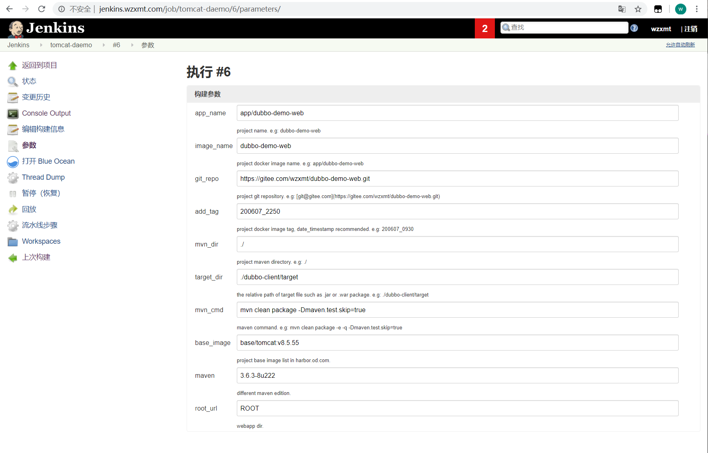

依次填入/选择：

- app_name

  > dubbo-demo-web

- image_name

  > app/dubbo-demo-web

- git_repo

  > https://gitee.com/wzxmt/dubbo-demo-web.git

- git_ver

  > tomcat

- add_tag

  > 200608_2350

- mvn_dir

  > ./

- target_dir

  > ./dubbo-client/target

- mvn_cmd

  > mvn clean package -Dmaven.test.skip=true

- base_image

  > base/tomcat:v8.5.55

- maven

  > 3.6.3-8u222

- root_url
  
  >ROOT

## 准备k8s的资源配置清单

不再需要单独准备资源配置清单

## 应用资源配置清单

k8s的dashboard上直接修改image的值为jenkins打包出来的镜像
文档里的例子是：`harbor.wzxmt.com/app/dubbo-demo-web:tomcat_200608_2250`

## 浏览器访问

[http://demo-test.wzxmt.com?hello=wangdao](http://demo-test.wzxmt.com/?hello=wzxmt)

## 检查tomcat运行情况

任意一台运算节点主机上：

```
#kubectl get pods -n app
NAME                                                    READY     STATUS    RESTARTS   AGE
dubbo-demo-consumer-v025-htfx8                          2/2       Running   0          1h
# kubectl exec -ti dubbo-demo-consumer-v025-htfx8 -n app ls -lsr logs
total 16
-rw-r----- 1 root root 7435 Jan 19 19:26 catalina.2019-01-19.log
-rw-r----- 1 root root  629 Jan 19 19:26 localhost.2019-01-19.log
-rw-r----- 1 root root  249 Jan 15 19:27 localhost_access_log.2019-01-19.txt
```

# 使用Prometheus和Grafana监控kubernetes集群

## 部署kube-state-metrics

#### 创建名称空间

```bash
kubectl create ns monitoring
```

#### 创建create

```bash
kubectl create secret docker-registry harborlogin \
--namespace=monitoring  \
--docker-server=https://harbor.wzxmt.com \
--docker-username=admin \
--docker-password=admin
```

### 准备kube-state-metrics镜像

[kube-state-metrics官方quay.io地址](https://quay.io/repository/coreos/kube-state-metrics?tab=info)

```bash
docker pull quay.io/coreos/kube-state-metrics:v1.9.5
docker tag quay.io/coreos/kube-state-metrics:v1.9.5 harbor.wzxmt.com/k8s/kube-state-metrics:v1.9.5
docker push harbor.wzxmt.com/k8s/kube-state-metrics:v1.9.5
```

### 准备资源配置清单

RBAC

```yaml
mkdir -p kube-state-metrics/
cd  kube-state-metrics/
cat << 'EOF' >rbac.yaml
apiVersion: v1
kind: ServiceAccount
metadata:
  labels:
    app.kubernetes.io/name: kube-state-metrics
    app.kubernetes.io/version: 1.9.5
  name: kube-state-metrics
  namespace: monitoring
---
apiVersion: rbac.authorization.k8s.io/v1
kind: ClusterRole
metadata:
  labels:
    app.kubernetes.io/name: kube-state-metrics
    app.kubernetes.io/version: 1.9.5
  name: kube-state-metrics
rules:
- apiGroups:
  - ""
  resources:
  - configmaps
  - secrets
  - nodes
  - pods
  - services
  - resourcequotas
  - replicationcontrollers
  - limitranges
  - persistentvolumeclaims
  - persistentvolumes
  - namespaces
  - endpoints
  verbs:
  - list
  - watch
- apiGroups:
  - extensions
  resources:
  - daemonsets
  - deployments
  - replicasets
  - ingresses
  verbs:
  - list
  - watch
- apiGroups:
  - apps
  resources:
  - statefulsets
  - daemonsets
  - deployments
  - replicasets
  verbs:
  - list
  - watch
- apiGroups:
  - batch
  resources:
  - cronjobs
  - jobs
  verbs:
  - list
  - watch
- apiGroups:
  - autoscaling
  resources:
  - horizontalpodautoscalers
  verbs:
  - list
  - watch
- apiGroups:
  - authentication.k8s.io
  resources:
  - tokenreviews
  verbs:
  - create
- apiGroups:
  - authorization.k8s.io
  resources:
  - subjectaccessreviews
  verbs:
  - create
- apiGroups:
  - policy
  resources:
  - poddisruptionbudgets
  verbs:
  - list
  - watch
- apiGroups:
  - certificates.k8s.io
  resources:
  - certificatesigningrequests
  verbs:
  - list
  - watch
- apiGroups:
  - storage.k8s.io
  resources:
  - storageclasses
  - volumeattachments
  verbs:
  - list
  - watch
- apiGroups:
  - admissionregistration.k8s.io
  resources:
  - mutatingwebhookconfigurations
  - validatingwebhookconfigurations
  verbs:
  - list
  - watch
- apiGroups:
  - networking.k8s.io
  resources:
  - networkpolicies
  verbs:
  - list
  - watch
- apiGroups:
  - coordination.k8s.io
  resources:
  - leases
  verbs:
  - list
  - watch
---
apiVersion: rbac.authorization.k8s.io/v1
kind: ClusterRoleBinding
metadata:
  labels:
    app.kubernetes.io/name: kube-state-metrics
    app.kubernetes.io/version: 1.9.5
  name: kube-state-metrics
roleRef:
  apiGroup: rbac.authorization.k8s.io
  kind: ClusterRole
  name: kube-state-metrics
subjects:
- kind: ServiceAccount
  name: kube-state-metrics
  namespace: monitoring
EOF
```

Deployment

```yaml
cat << 'EOF' >dp.yaml
apiVersion: apps/v1
kind: Deployment
metadata:
  annotations:
    deployment.kubernetes.io/revision: "2"
  labels:
    grafanak8sapp: "true"
    app: kube-state-metrics
  name: kube-state-metrics
  namespace: monitoring
spec:
  selector:
    matchLabels:
      grafanak8sapp: "true"
      app: kube-state-metrics
  strategy:
    rollingUpdate:
      maxSurge: 25%
      maxUnavailable: 25%
    type: RollingUpdate
  template:
    metadata:
      creationTimestamp: null
      labels:
        grafanak8sapp: "true"
        app: kube-state-metrics
    spec:
      containers:
      - image: harbor.wzxmt.com/k8s/kube-state-metrics:v1.9.5
        name: kube-state-metrics
        ports:
        - containerPort: 8080
          name: http-metrics
          protocol: TCP
        readinessProbe:
          failureThreshold: 3
          httpGet:
            path: /healthz
            port: 8080
            scheme: HTTP
          initialDelaySeconds: 5
          periodSeconds: 10
          successThreshold: 1
          timeoutSeconds: 5
        imagePullPolicy: IfNotPresent
      imagePullSecrets:
      - name: harborlogin
      restartPolicy: Always
      serviceAccount: kube-state-metrics
      serviceAccountName: kube-state-metrics
EOF
```

### 应用资源配置清单

```
kubectl apply -f kube-state-metrics/*
```

## 部署node-exporter

[node-exporter官方dockerhub地址](https://hub.docker.com/r/prom/node-exporter)
[node-expoerer官方github地址](https://github.com/prometheus/node_exporter)

```bash
docker pull quay.io/prometheus/node-exporter:v0.18.1
docker tag quay.io/prometheus/node-exporter:v0.18.1 harbor.wzxmt.com/k8s/node-exporter:v0.18.1
docker push harbor.wzxmt.com/k8s/node-exporter:v0.18.1
```

### 准备资源配置清单

```yaml
mkdir -p node-exporter
cd node-exporter
cat<< 'EOF' >ds.yaml
kind: DaemonSet
apiVersion: apps/v1
metadata:
  name: node-exporter
  namespace: monitoring
  labels:
    daemon: "node-exporter"
    grafanak8sapp: "true"
spec:
  selector:
    matchLabels:
      daemon: "node-exporter"
      grafanak8sapp: "true"
  template:
    metadata:
      name: node-exporter
      labels:
        daemon: "node-exporter"
        grafanak8sapp: "true"
    spec:
      volumes:
      - name: proc
        hostPath: 
          path: /proc
          type: ""
      - name: sys
        hostPath:
          path: /sys
          type: ""
      containers:
      - name: node-exporter
        image: harbor.wzxmt.com/k8s/node-exporter:v0.18.1
        args:
        - --path.procfs=/host_proc
        - --path.sysfs=/host_sys
        ports:
        - name: node-exporter
          hostPort: 9100
          containerPort: 9100
          protocol: TCP
        volumeMounts:
        - name: sys
          readOnly: true
          mountPath: /host_sys
        - name: proc
          readOnly: true
          mountPath: /host_proc
      imagePullSecrets:
      - name: harborlogin
      restartPolicy: Always
      hostNetwork: true
EOF
```

### 应用资源配置清单

任意运算节点上：

```bash
kubectl apply -f node-exporter/ds.yaml
```

## 部署cadvisor

[cadvisor官方dockerhub地址](https://hub.docker.com/r/google/cadvisor)
[cadvisor官方github地址](https://github.com/google/cadvisor)

```bash
docker pull google/cadvisor:v0.33.0
docker tag google/cadvisor:v0.33.0 harbor.wzxmt.com/k8s/cadvisor:v0.33.0
docker push harbor.wzxmt.com/k8s/cadvisor:v0.33.0
```

### 准备资源配置清单

DaemonSet

```yaml
mkdir -p cadvisor
cd cadvisor
cat << 'EOF' >ds.yaml
apiVersion: apps/v1
kind: DaemonSet
metadata:
  name: cadvisor
  namespace: monitoring
  labels:
    app: cadvisor
spec:
  selector:
    matchLabels:
      name: cadvisor
  template:
    metadata:
      labels:
        name: cadvisor
    spec:
      hostNetwork: true
      tolerations:
      - key: node-role.kubernetes.io/master
        effect: NoSchedule
        key: enabledDiskSchedule
        value: "true"
        effect: NoSchedule
      containers:
      - name: cadvisor
        image: harbor.wzxmt.com/k8s/cadvisor:v0.33.0
        imagePullPolicy: IfNotPresent
        volumeMounts:
        - name: rootfs
          mountPath: /rootfs
          readOnly: true
        - name: var-run
          mountPath: /var/run
          readOnly: false
        - name: sys
          mountPath: /sys
          readOnly: true
        - name: docker
          mountPath: /var/lib/docker
          readOnly: true
        ports:
          - name: http
            containerPort: 4194
            protocol: TCP
        readinessProbe:
          tcpSocket:
            port: 4194
          initialDelaySeconds: 5
          periodSeconds: 10
        args:
          - --housekeeping_interval=10s
          - --port=4194
      imagePullSecrets:
      - name: harborlogin
      terminationGracePeriodSeconds: 30
      volumes:
      - name: rootfs
        hostPath:
          path: /
      - name: var-run
        hostPath:
          path: /var/run
      - name: sys
        hostPath:
          path: /sys
      - name: docker
        hostPath:
          path: /data/docker
EOF
```

### 修改运算节点软连接

所有运算节点上：

```bash
mount -o remount,rw /sys/fs/cgroup/
ln -s /sys/fs/cgroup/cpu,cpuacct/ /sys/fs/cgroup/cpuacct,cpu
ll /sys/fs/cgroup|grep cpu
```

### 应用资源配置清单

任意运算节点上：

```bash
kubectl apply -f cadvisor/ds.yaml
netstat -luntp|grep 4194
```

## 部署blackbox-exporter

[blackbox-exporter官方dockerhub地址](https://hub.docker.com/r/prom/blackbox-exporter)
[blackbox-exporter官方github地址](https://github.com/prometheus/blackbox_exporter)

```bash
docker pull prom/blackbox-exporter:v0.16.0
docker tag prom/blackbox-exporter:v0.16.0 harbor.wzxmt.com/k8s/blackbox-exporter:v0.16.0
docker push harbor.wzxmt.com/k8s/blackbox-exporter:v0.16.0
```

### 准备资源配置清单

ConfigMap

```yaml
mkdir -p blackbox-exporter
cd blackbox-exporter
cat << 'EOF' >cm.yaml
apiVersion: v1
kind: ConfigMap
metadata:
  labels:
    app: blackbox-exporter
  name: blackbox-exporter
  namespace: monitoring
data:
  blackbox.yml: |-
    modules:
      http_2xx:
        prober: http
        timeout: 2s
        http:
          valid_http_versions: ["HTTP/1.1", "HTTP/2"]
          valid_status_codes: [200,301,302]
          method: GET
          preferred_ip_protocol: "ip4"
      tcp_connect:
        prober: tcp
        timeout: 2s
EOF
```

Deployment

```yaml
cat << 'EOF' >dp.yaml
kind: Deployment
apiVersion: apps/v1
metadata:
  name: blackbox-exporter
  namespace: monitoring
  labels:
    app: blackbox-exporter
    k8s-app: blackbox-exporter
spec:
  replicas: 1
  selector:
    matchLabels:
      app: blackbox-exporter
  template:
    metadata:
      labels:
        app: blackbox-exporter
    spec:
      volumes:
      - name: config
        configMap:
          name: blackbox-exporter
          defaultMode: 420
      containers:
      - name: blackbox-exporter
        image: harbor.wzxmt.com/k8s/blackbox-exporter:v0.16.0
        args:
        - --config.file=/etc/blackbox_exporter/blackbox.yml
        - --log.level=debug
        - --web.listen-address=:9115
        ports:
        - name: blackbox-port
          containerPort: 9115
          protocol: TCP
        resources:
          limits:
            cpu: 200m
            memory: 256Mi
          requests:
            cpu: 100m
            memory: 50Mi
        volumeMounts:
        - name: config
          mountPath: /etc/blackbox_exporter
        readinessProbe:
          tcpSocket:
            port: 9115
          initialDelaySeconds: 5
          timeoutSeconds: 5
          periodSeconds: 10
          successThreshold: 1
          failureThreshold: 3
        imagePullPolicy: IfNotPresent
      imagePullSecrets:
      - name: harborlogin
      restartPolicy: Always
EOF
```

Service

```yaml
cat << 'EOF' >svc.yaml
kind: Service
apiVersion: v1
metadata:
  name: blackbox-exporter
  namespace: monitoring
spec:
  selector:
    app: blackbox-exporter
  ports:
    - protocol: TCP
      port: 9115
      name: http
EOF
```

Ingress

```yaml
cat << EOF >ingress.yaml
apiVersion: extensions/v1beta1
kind: Ingress
metadata:  
  name: blackbox-exporter
  namespace: monitoring
  annotations:
    traefik.ingress.kubernetes.io/router.entrypoints: web
spec:  
  rules:    
    - host: blackbox.wzxmt.com     
      http:        
        paths:        
        - path: /          
          backend:            
            serviceName: blackbox-exporter            
            servicePort: 9115
EOF
```

### 解析域名

```
blackbox	60 IN A 10.0.0.50
```

### 应用资源配置清单

任意运算节点上：

```bash
kubectl apply -f blackbox-exporter/*
```

### 浏览器访问

[http://blackbox.wzxmt.com](http://blackbox.wzxmt.com/)

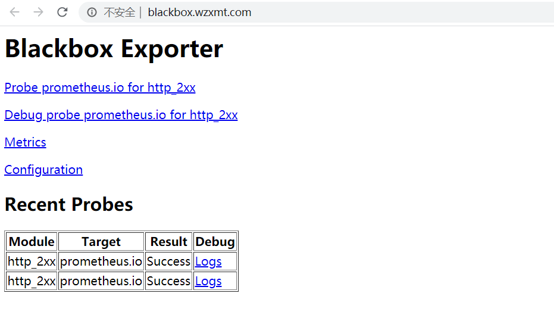

## 部署prometheus

[prometheus官方dockerhub地址](https://hub.docker.com/r/prom/prometheus)
[prometheus官方github地址](https://github.com/prometheus/prometheus)

```bash
docker pull prom/prometheus:v2.17.0
docker tag prom/prometheus:v2.17.0 harbor.wzxmt.com/k8s/prometheus:v2.17.0
docker push harbor.wzxmt.com/k8s/prometheus:v2.17.0
```

### 准备资源配置清单

#### 运维主机上：

```bash
mkdir -p prometheus && cd prometheus
mkdir -p /data/nfs-volume/prometheus/etc
```

#### 配置清单:

RBAC

```yaml
cat << 'EOF' >rbac.yaml
apiVersion: v1
kind: ServiceAccount
metadata:
  labels:
    addonmanager.kubernetes.io/mode: Reconcile
    kubernetes.io/cluster-service: "true"
  name: prometheus
  namespace: monitoring
---
apiVersion: rbac.authorization.k8s.io/v1
kind: ClusterRole
metadata:
  labels:
    addonmanager.kubernetes.io/mode: Reconcile
    kubernetes.io/cluster-service: "true"
  name: prometheus
rules:
- apiGroups:
  - ""
  resources:
  - nodes
  - nodes/metrics
  - services
  - endpoints
  - pods
  verbs:
  - get
  - list
  - watch
- apiGroups:
  - ""
  resources:
  - configmaps
  verbs:
  - get
- nonResourceURLs:
  - /metrics
  verbs:
  - get
---
apiVersion: rbac.authorization.k8s.io/v1
kind: ClusterRoleBinding
metadata:
  labels:
    addonmanager.kubernetes.io/mode: Reconcile
    kubernetes.io/cluster-service: "true"
  name: prometheus
roleRef:
  apiGroup: rbac.authorization.k8s.io
  kind: ClusterRole
  name: prometheus
subjects:
- kind: ServiceAccount
  name: prometheus
  namespace: monitoring
EOF
```

Deployment

```yaml
cat << 'EOF' >dp.yaml
apiVersion: apps/v1
kind: Deployment
metadata:
  labels:
    name: prometheus
  name: prometheus
  namespace: monitoring
spec:
  progressDeadlineSeconds: 600
  replicas: 1
  revisionHistoryLimit: 7
  selector:
    matchLabels:
      app: prometheus
  strategy:
    rollingUpdate:
      maxSurge: 1
      maxUnavailable: 1
    type: RollingUpdate
  template:
    metadata:
      labels:
        app: prometheus
    spec:
      containers:
      - image: harbor.wzxmt.com/k8s/prometheus:v2.17.0
        args:
        - --config.file=/data/etc/prometheus.yml
        - --storage.tsdb.path=/data/prom-db
        - --storage.tsdb.retention=72h
        command:
        - /bin/prometheus
        name: prometheus
        ports:
        - containerPort: 9090
          protocol: TCP
        resources:
          limits:
            cpu: 500m
            memory: 2500Mi
          requests:
            cpu: 100m
            memory: 100Mi
        volumeMounts:
        - mountPath: /data
          name: data
        imagePullPolicy: IfNotPresent
      imagePullSecrets:
      - name: harborlogin
      securityContext:
        runAsUser: 0
      dnsPolicy: ClusterFirst
      restartPolicy: Always
      serviceAccount: prometheus
      serviceAccountName: prometheus
      volumes:
      - name: data
        nfs:
          server: 10.0.0.20
          path: /data/nfs-volume/prometheus
EOF
```

Service

```yaml
cat << 'EOF' >svc.yaml
apiVersion: v1
kind: Service
metadata:
  name: prometheus
  namespace: monitoring
spec:
  ports:
  - port: 9090
    protocol: TCP
    name: prometheus
  selector:
    app: prometheus
  type: ClusterIP
EOF
```

Ingress

```yaml
cat << 'EOF' >ingress.yaml
apiVersion: extensions/v1beta1
kind: Ingress
metadata:  
  name: prometheus
  namespace: monitoring
  annotations:
    traefik.ingress.kubernetes.io/router.entrypoints: web
spec:  
  rules:    
    - host: prometheus.wzxmt.com     
      http:        
        paths:        
        - path: /          
          backend:            
            serviceName: prometheus            
            servicePort: 9090
EOF
```

### 准备prometheus的配置文件

运算节点上：

- 拷贝ETCD证书

```
mkdir -p /data/nfs-volume/prometheus/{etc,prom-db}
cd /data/nfs-volume/prometheus/etc
scp root@10.0.0.31:/etc/kubernetes/pki/peer-ca.pem .
scp root@10.0.0.31:/etc/kubernetes/pki/etcd.pem .
scp root@10.0.0.31:/etc/kubernetes/pki/etcd-key.pem .
```

- 准备配置

```yaml
cat << 'EOF' >prometheus.yml
global:
  scrape_interval:     15s
  evaluation_interval: 15s
scrape_configs:
- job_name: 'etcd'
  tls_config:
    ca_file: /data/etc/peer-ca.pem
    cert_file: /data/etc/etcd.pem
    key_file: /data/etc/etcd-key.pem
  scheme: https
  static_configs:
  - targets:
    - '10.0.0.31:2379'
    - '10.0.0.32:2379'
    - '10.0.0.33:2379'

- job_name: 'kubernetes-apiservers'
  kubernetes_sd_configs:
  - role: endpoints
  scheme: https
  tls_config:
    ca_file: /var/run/secrets/kubernetes.io/serviceaccount/ca.crt
  bearer_token_file: /var/run/secrets/kubernetes.io/serviceaccount/token
  relabel_configs:
  - source_labels: [__meta_kubernetes_namespace, __meta_kubernetes_service_name, __meta_kubernetes_endpoint_port_name]
    action: keep
    regex: default;kubernetes;https

- job_name: 'kubernetes-pods'
  kubernetes_sd_configs:
  - role: pod
  relabel_configs:
  - source_labels: [__meta_kubernetes_pod_annotation_prometheus_io_scrape]
    action: keep
    regex: true
  - source_labels: [__meta_kubernetes_pod_annotation_prometheus_io_path]
    action: replace
    target_label: __metrics_path__
    regex: (.+)
  - source_labels: [__address__, __meta_kubernetes_pod_annotation_prometheus_io_port]
    action: replace
    regex: ([^:]+)(?::\d+)?;(\d+)
    replacement: $1:$2
    target_label: __address__
  - action: labelmap
    regex: __meta_kubernetes_pod_label_(.+)
  - source_labels: [__meta_kubernetes_namespace]
    action: replace
    target_label: kubernetes_namespace
  - source_labels: [__meta_kubernetes_pod_name]
    action: replace
    target_label: kubernetes_pod_name

- job_name: 'kubernetes-kubelet'
  kubernetes_sd_configs:
  - role: node
  relabel_configs:
  - action: labelmap
    regex: __meta_kubernetes_node_label_(.+)
  - source_labels: [__meta_kubernetes_node_name]
    regex: (.+)
    target_label: __address__
    replacement: ${1}:10255

- job_name: 'kubernetes-cadvisor'
  kubernetes_sd_configs:
  - role: node
  relabel_configs:
  - action: labelmap
    regex: __meta_kubernetes_node_label_(.+)
  - source_labels: [__meta_kubernetes_node_name]
    regex: (.+)
    target_label: __address__
    replacement: ${1}.wzxmt.com:4194 #添加解析.wzxmt.com

- job_name: 'kubernetes-kube-state'
  kubernetes_sd_configs:
  - role: pod
  relabel_configs:
  - action: labelmap
    regex: __meta_kubernetes_pod_label_(.+)
  - source_labels: [__meta_kubernetes_namespace]
    action: replace
    target_label: kubernetes_namespace
  - source_labels: [__meta_kubernetes_pod_name]
    action: replace
    target_label: kubernetes_pod_name
  - source_labels: [__meta_kubernetes_pod_label_grafanak8sapp]
    regex: .*true.*
    action: keep
  - source_labels: ['__meta_kubernetes_pod_label_daemon', '__meta_kubernetes_pod_node_name']
    regex: 'node-exporter;(.*)'
    action: replace
    target_label: nodename

- job_name: 'blackbox_http_pod_probe'
  metrics_path: /probe
  kubernetes_sd_configs:
  - role: pod
  params:
    module: [http_2xx]
  relabel_configs:
  - source_labels: [__meta_kubernetes_pod_annotation_blackbox_scheme]
    action: keep
    regex: http
  - source_labels: [__address__, __meta_kubernetes_pod_annotation_blackbox_port,  __meta_kubernetes_pod_annotation_blackbox_path]
    action: replace
    regex: ([^:]+)(?::\d+)?;(\d+);(.+)
    replacement: $1:$2$3
    target_label: __param_target
  - action: replace
    target_label: __address__
    replacement: blackbox-exporter.kube-system:9115
  - source_labels: [__param_target]
    target_label: instance
  - action: labelmap
    regex: __meta_kubernetes_pod_label_(.+)
  - source_labels: [__meta_kubernetes_namespace]
    action: replace
    target_label: kubernetes_namespace
  - source_labels: [__meta_kubernetes_pod_name]
    action: replace
    target_label: kubernetes_pod_name

- job_name: 'blackbox_tcp_pod_probe'
  metrics_path: /probe
  kubernetes_sd_configs:
  - role: pod
  params:
    module: [tcp_connect]
  relabel_configs:
  - source_labels: [__meta_kubernetes_pod_annotation_blackbox_scheme]
    action: keep
    regex: tcp
  - source_labels: [__address__, __meta_kubernetes_pod_annotation_blackbox_port]
    action: replace
    regex: ([^:]+)(?::\d+)?;(\d+)
    replacement: $1:$2
    target_label: __param_target
  - action: replace
    target_label: __address__
    replacement: blackbox-exporter.kube-system:9115
  - source_labels: [__param_target]
    target_label: instance
  - action: labelmap
    regex: __meta_kubernetes_pod_label_(.+)
  - source_labels: [__meta_kubernetes_namespace]
    action: replace
    target_label: kubernetes_namespace
  - source_labels: [__meta_kubernetes_pod_name]
    action: replace
    target_label: kubernetes_pod_name

- job_name: 'traefik'
  kubernetes_sd_configs:
  - role: pod
  relabel_configs:
  - source_labels: [__meta_kubernetes_pod_annotation_prometheus_io_scheme]
    action: keep
    regex: traefik
  - source_labels: [__meta_kubernetes_pod_annotation_prometheus_io_path]
    action: replace
    target_label: __metrics_path__
    regex: (.+)
  - source_labels: [__address__, __meta_kubernetes_pod_annotation_prometheus_io_port]
    action: replace
    regex: ([^:]+)(?::\d+)?;(\d+)
    replacement: $1:$2
    target_label: __address__
  - action: labelmap
    regex: __meta_kubernetes_pod_label_(.+)
  - source_labels: [__meta_kubernetes_namespace]
    action: replace
    target_label: kubernetes_namespace
  - source_labels: [__meta_kubernetes_pod_name]
    action: replace
    target_label: kubernetes_pod_name
EOF
```

### 应用资源配置清单

```bash
kubectl apply -f prometheus/*
```

### 解析域名

```
prometheus	60 IN A 10.0.0.50
```

### 浏览器访问

[http://prometheus.wzxmt.com](http://prometheus.wzxmt.com/)

### Prometheus监控内容

Targets（jobs）

#### etcd

> 监控etcd服务

| key                    | value |
| :--------------------- | :---- |
| etcd_server_has_leader | 1     |
| etcd_http_failed_total | 1     |
| …                      | …     |

#### kubernetes-apiserver

> 监控apiserver服务

#### kubernetes-kubelet

> 监控kubelet服务

#### kubernetes-kube-state

监控基本信息

- node-exporter

  > 监控Node节点信息

- kube-state-metrics

  > 监控pod信息

#### traefik

> 监控traefik-ingress-controller

| key                                                          | value |
| :----------------------------------------------------------- | :---- |
| traefik_entrypoint_requests_total{code=”200”,entrypoint=”http”,method=”PUT”,protocol=”http”} | 138   |
| traefik_entrypoint_requests_total{code=”200”,entrypoint=”http”,method=”GET”,protocol=”http”} | 285   |
| traefik_entrypoint_open_connections{entrypoint=”http”,method=”PUT”,protocol=”http”} | 1     |
| …                                                            | …     |

**注意：在traefik的pod控制器上加annotations，并重启pod，监控生效**
配置范例：

```
"annotations": {
  "prometheus_io_scheme": "traefik",
  "prometheus_io_path": "/metrics",
  "prometheus_io_port": "8080"
}
```

#### blackbox*

监控服务是否存活

- blackbox_tcp_pod_porbe

  > 监控tcp协议服务是否存活

| key                           | value       |
| :---------------------------- | :---------- |
| probe_success                 | 1           |
| probe_ip_protocol             | 4           |
| probe_failed_due_to_regex     | 0           |
| probe_duration_seconds        | 0.000597546 |
| probe_dns_lookup_time_seconds | 0.00010898  |

**注意：在pod控制器上加annotations，并重启pod，监控生效**
配置范例：

复制

```
"annotations": {
  "blackbox_port": "20880",
  "blackbox_scheme": "tcp"
}
```

- blackbox_http_pod_probe

  > 监控http协议服务是否存活

| key                                             | value           |
| :---------------------------------------------- | :-------------- |
| probe_success                                   | 1               |
| probe_ip_protocol                               | 4               |
| probe_http_version                              | 1.1             |
| probe_http_status_code                          | 200             |
| probe_http_ssl                                  | 0               |
| probe_http_redirects                            | 1               |
| probe_http_last_modified_timestamp_seconds      | 1.553861888e+09 |
| probe_http_duration_seconds{phase=”transfer”}   | 0.000238343     |
| probe_http_duration_seconds{phase=”tls”}        | 0               |
| probe_http_duration_seconds{phase=”resolve”}    | 5.4095e-05      |
| probe_http_duration_seconds{phase=”processing”} | 0.000966104     |
| probe_http_duration_seconds{phase=”connect”}    | 0.000520821     |
| probe_http_content_length                       | 716             |
| probe_failed_due_to_regex                       | 0               |
| probe_duration_seconds                          | 0.00272609      |
| probe_dns_lookup_time_seconds                   | 5.4095e-05      |

**注意：在pod控制器上加annotations，并重启pod，监控生效**
配置范例：

```
"annotations": {
  "blackbox_path": "/",
  "blackbox_port": "8080",
  "blackbox_scheme": "http"
}
```

#### kubernetes-pods*

> 监控JVM信息

| key                                                          | value           |
| :----------------------------------------------------------- | :-------------- |
| jvm_info{version=”1.7.0_80-b15”,vendor=”Oracle Corporation”,runtime=”Java(TM) SE Runtime Environment”,} | 1.0             |
| jmx_config_reload_success_total                              | 0.0             |
| process_resident_memory_bytes                                | 4.693897216E9   |
| process_virtual_memory_bytes                                 | 1.2138840064E10 |
| process_max_fds                                              | 65536.0         |
| process_open_fds                                             | 123.0           |
| process_start_time_seconds                                   | 1.54331073249E9 |
| process_cpu_seconds_total                                    | 196465.74       |
| jvm_buffer_pool_used_buffers{pool=”mapped”,}                 | 0.0             |
| jvm_buffer_pool_used_buffers{pool=”direct”,}                 | 150.0           |
| jvm_buffer_pool_capacity_bytes{pool=”mapped”,}               | 0.0             |
| jvm_buffer_pool_capacity_bytes{pool=”direct”,}               | 6216688.0       |
| jvm_buffer_pool_used_bytes{pool=”mapped”,}                   | 0.0             |
| jvm_buffer_pool_used_bytes{pool=”direct”,}                   | 6216688.0       |
| jvm_gc_collection_seconds_sum{gc=”PS MarkSweep”,}            | 1.867           |
| …                                                            | …               |

**注意：在pod控制器上加annotations，并重启pod，监控生效**
配置范例：

```
"annotations": {
  "prometheus_io_scrape": "true",
  "prometheus_io_port": "12346",
  "prometheus_io_path": "/"
}
```

### 修改traefik服务接入prometheus监控

`dashboard`上：
kube-system名称空间->daemonset->traefik-ingress-controller->spec->template->metadata下，添加

```
"annotations": {
  "prometheus_io_scheme": "traefik",
  "prometheus_io_path": "/metrics",
  "prometheus_io_port": "8080"
}
```

删除pod，重启traefik，观察监控

继续添加blackbox监控配置项

```
"annotations": {
  "prometheus_io_scheme": "traefik",
  "prometheus_io_path": "/metrics",
  "prometheus_io_port": "8080",
  "blackbox_path": "/",
  "blackbox_port": "8080",
  "blackbox_scheme": "http"
}
```

### 修改dubbo-service服务接入prometheus监控

`dashboard`上：
app名称空间->deployment->dubbo-demo-service->spec->template=>metadata下，添加

```
"annotations": {
  "prometheus_io_scrape": "true",
  "prometheus_io_path": "/",
  "prometheus_io_port": "12346",
  "blackbox_port": "20880",
  "blackbox_scheme": "tcp"
}
```

删除pod，重启traefik，观察监控

### 修改dubbo-consumer服务接入prometheus监控

app名称空间->deployment->dubbo-demo-consumer->spec->template->metadata下，添加

```
"annotations": {
  "prometheus_io_scrape": "true",
  "prometheus_io_path": "/",
  "prometheus_io_port": "12346",
  "blackbox_path": "/hello",
  "blackbox_port": "8080",
  "blackbox_scheme": "http"
}
```

删除pod，重启traefik，观察监控

## 部署Grafana

[grafana官方dockerhub地址](https://hub.docker.com/r/grafana/grafana)
[grafana官方github地址](https://github.com/grafana/grafana)
[grafana官网](https://grafana.com/)

```bash
docker pull grafana/grafana:7.0.3
docker tag grafana/grafana:7.0.3 harbor.wzxmt.com/k8s/grafana:7.0.3
docker push harbor.wzxmt.com/k8s/grafana:7.0.3
```

### 准备资源配置清单

Deployment

```yaml
mkdir -p grafana
cd grafana
cat << 'EOF' >dp.yaml
apiVersion: apps/v1
kind: Deployment
metadata:
  labels:
    app: grafana
    name: grafana
  name: grafana
  namespace: monitoring
spec:
  progressDeadlineSeconds: 600
  replicas: 1
  revisionHistoryLimit: 7
  selector:
    matchLabels:
      name: grafana
  strategy:
    rollingUpdate:
      maxSurge: 1
      maxUnavailable: 1
    type: RollingUpdate
  template:
    metadata:
      labels:
        app: grafana
        name: grafana
    spec:
      containers:
      - image: harbor.wzxmt.com/k8s/grafana:7.0.3
        imagePullPolicy: IfNotPresent
        name: grafana
        ports:
        - containerPort: 3000
          protocol: TCP
        volumeMounts:
        - mountPath: /var/lib/grafana
          name: data
      imagePullSecrets:
      - name: harborlogin
      restartPolicy: Always
      securityContext:
        runAsUser: 0
      volumes:
      - nfs:
          server: 10.0.0.20
          path: /data/nfs-volume/grafana
        name: data
EOF
```

Service

```yaml
cat << 'EOF' >svc.yaml
apiVersion: v1
kind: Service
metadata:
  name: grafana
  namespace: monitoring
spec:
  ports:
  - port: 3000
    protocol: TCP
  selector:
    app: grafana
  type: ClusterIP
EOF
```

Ingress

```yaml
cat << 'EOF' >ingress.yaml
apiVersion: extensions/v1beta1
kind: Ingress
metadata:
  name: grafana
  namespace: monitoring
  annotations:
    traefik.ingress.kubernetes.io/router.entrypoints: web
spec:
  rules:
  - host: grafana.wzxmt.com
    http:
      paths:
      - path: /
        backend:
          serviceName: grafana
          servicePort: 3000
EOF
```

### 应用资源配置清单

任意运算节点上：

```
kubectl apply -f grafana/*
```

### 解析域名

```
grafana	60 IN A 10.0.0.50
```

### 浏览器访问

[http://grafana.wzxmt.com](http://grafana.wzxmt.com/)

- 用户名：admin
- 密 码：admin

登录后需要修改管理员密码
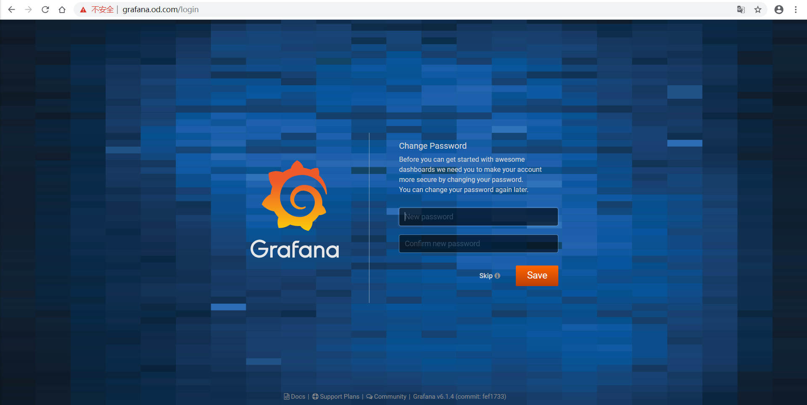

### 配置grafana页面

#### 外观

Configuration -> Preferences

- UI Theme

  > Light

- Home Dashboard

  > Default

- Timezone

  > Local browser time

save

#### 插件

Configuration -> Plugins

- Kubernetes App

安装方法一：

```
grafana-cli plugins install grafana-kubernetes-app
```

安装方法二：
[下载地址](https://grafana.com/api/plugins/grafana-kubernetes-app/versions/1.0.1/download)

- Clock Pannel

安装方法一：

```
grafana-cli plugins install grafana-clock-panel
```

安装方法二：
[下载地址](https://grafana.com/api/plugins/grafana-clock-panel/versions/1.0.2/download)

- Pie Chart

安装方法一：

```
grafana-cli plugins install grafana-piechart-panel
```

安装方法二：
[下载地址](https://grafana.com/api/plugins/grafana-piechart-panel/versions/1.3.6/download)

- D3 Gauge

安装方法一：

```
grafana-cli plugins install briangann-gauge-panel
```

安装方法二：
[下载地址](https://grafana.com/api/plugins/briangann-gauge-panel/versions/0.0.6/download)

- Discrete

安装方法一：

```
grafana-cli plugins install natel-discrete-panel
```

安装方法二：
[下载地址](https://grafana.com/api/plugins/natel-discrete-panel/versions/0.0.9/download)

- 重启grafana的pod
- 依次enable插件

### 配置grafana数据源

Configuration -> Data Sources
选择prometheus

- HTTP

| key    | value                                                       |
| :----- | :---------------------------------------------------------- |
| URL    | [http://prometheus.wzxmt.com](http://prometheus.wzxmt.com/) |
| Access | Server(Default)                                             |

- Save & Test

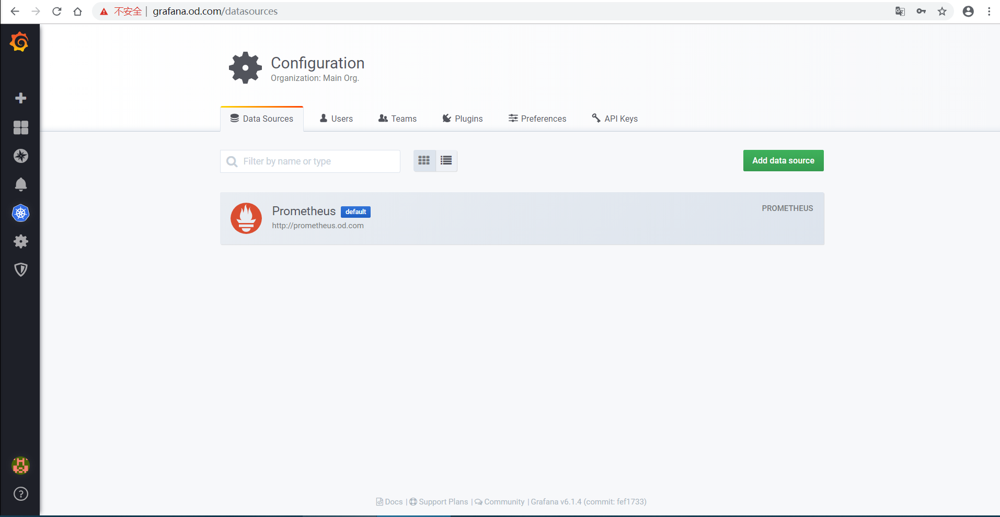

### 配置Kubernetes集群Dashboard

kubernetes -> +New Cluster

- Add a new cluster

| key  | value |
| :--- | :---- |
| Name | myk8s |

- HTTP

| key    | value                                               |
| :----- | :-------------------------------------------------- |
| URL    | [https://10.0.0.150:7443](https://10.0.0.150:8443/) |
| Access | Server(Default)                                     |

- Auth

| key             | value |
| :-------------- | :---- |
| TLS Client Auth | 勾选  |
| With Ca Cert    | 勾选  |

将ca.pem、client.pem和client-key.pem粘贴至文本框内

- Prometheus Read

| key        | value      |
| :--------- | :--------- |
| Datasource | Prometheus |

- Save

**注意：**

- K8S Container中，所有Pannel的

  > pod_name -> container_label_io_kubernetes_pod_name


### 配置自定义dashboard

根据Prometheus数据源里的数据，配置如下dashboard：

- etcd dashboard
- traefik dashboard
- generic dashboard
- JMX dashboard
- blackbox dashboard

## 部署alertmanager

[alertmanager官方github地址](https://github.com/alertmanager/alert_manager)
[alertmanager官网](https://prometheus.io)

```bash
docker pull docker.io/prom/alertmanager:v0.14.0
docker tag 30594e96cbe8 harbor.wzxmt.com/infra/alertmanager:v0.14.0
docker push harbor.wzxmt.com/infra/alertmanager:v0.14.0
```

资源配置清单：

```
mkdir -p alertmanager
cd alertmanager
```

ConfigMap

```yaml
cat << EOF >cm.yaml
apiVersion: v1
kind: ConfigMap
metadata:
  name: alertmanager-config
  namespace: infra
data:
  config.yml: |-
    global:
      # 在没有报警的情况下声明为已解决的时间
      resolve_timeout: 5m
      # 配置邮件发送信息
      smtp_smarthost: 'smtp.163.com:25'
      smtp_from: 'xxx@163.com'
      smtp_auth_username: 'xxx@163.com'
      smtp_auth_password: 'xxxxxx'
      smtp_require_tls: false
    # 所有报警信息进入后的根路由，用来设置报警的分发策略
    route:
      # 这里的标签列表是接收到报警信息后的重新分组标签，例如，接收到的报警信息里面有许多具有 cluster=A 和 alertname=LatncyHigh 这样的标签的报警信息将会批量被聚合到一个分组里面
      group_by: ['alertname', 'cluster']
      # 当一个新的报警分组被创建后，需要等待至少group_wait时间来初始化通知，这种方式可以确保您能有足够的时间为同一分组来获取多个警报，然后一起触发这个报警信息。
      group_wait: 30s

      # 当第一个报警发送后，等待'group_interval'时间来发送新的一组报警信息。
      group_interval: 5m

      # 如果一个报警信息已经发送成功了，等待'repeat_interval'时间来重新发送他们
      repeat_interval: 5m

      # 默认的receiver：如果一个报警没有被一个route匹配，则发送给默认的接收器
      receiver: default

    receivers:
    - name: 'default'
      email_configs:
      - to: 'xxxx@qq.com'
        send_resolved: true
EO
```

Deployment

```yaml
cat << EOF >dp.yaml
apiVersion: extensions/v1beta1
kind: Deployment
metadata:
  name: alertmanager
  namespace: infra
spec:
  replicas: 1
  selector:
    matchLabels:
      app: alertmanager
  template:
    metadata:
      labels:
        app: alertmanager
    spec:
      containers:
      - name: alertmanager
        image: harbor.wzxmt.com/infra/alertmanager:v0.14.0
        args:
          - "--config.file=/etc/alertmanager/config.yml"
          - "--storage.path=/alertmanager"
        ports:
        - name: alertmanager
          containerPort: 9093
        volumeMounts:
        - name: alertmanager-cm
          mountPath: /etc/alertmanager
      volumes:
      - name: alertmanager-cm
        configMap:
          name: alertmanager-config
      imagePullSecrets:
      - name: harborlogin
EOF
```

Service

```
cat << EOF >svc.yaml
apiVersion: v1
kind: Service
metadata:
  name: alertmanager
  namespace: infra
spec:
  selector: 
    app: alertmanager
  ports:
    - port: 80
      targetPort: 9093
EOF
```

基础报警规则(nfs)：

```bash
cat << 'EOF' >/data/nfs-volume/prometheus/etc/rules.yml
groups:
- name: hostStatsAlert
  rules:
  - alert: hostCpuUsageAlert
    expr: sum(avg without (cpu)(irate(node_cpu{mode!='idle'}[5m]))) by (instance) > 0.85
    for: 5m
    labels:
      severity: warning
    annotations:
      summary: "{{ $labels.instance }} CPU usage above 85% (current value: {{ $value }}%)"
  - alert: hostMemUsageAlert
    expr: (node_memory_MemTotal - node_memory_MemAvailable)/node_memory_MemTotal > 0.85
    for: 5m
    labels:
      severity: warning
    annotations:
      summary: "{{ $labels.instance }} MEM usage above 85% (current value: {{ $value }}%)"
  - alert: OutOfInodes
    expr: node_filesystem_free{fstype="overlay",mountpoint ="/"} / node_filesystem_size{fstype="overlay",mountpoint ="/"} * 100 < 10
    for: 5m
    labels:
      severity: warning
    annotations:
      summary: "Out of inodes (instance {{ $labels.instance }})"
      description: "Disk is almost running out of available inodes (< 10% left) (current value: {{ $value }})"
  - alert: OutOfDiskSpace
    expr: node_filesystem_free{fstype="overlay",mountpoint ="/rootfs"} / node_filesystem_size{fstype="overlay",mountpoint ="/rootfs"} * 100 < 10
    for: 5m
    labels:
      severity: warning
    annotations:
      summary: "Out of disk space (instance {{ $labels.instance }})"
      description: "Disk is almost full (< 10% left) (current value: {{ $value }})"
  - alert: UnusualNetworkThroughputIn
    expr: sum by (instance) (irate(node_network_receive_bytes[2m])) / 1024 / 1024 > 100
    for: 5m
    labels:
      severity: warning
    annotations:
      summary: "Unusual network throughput in (instance {{ $labels.instance }})"
      description: "Host network interfaces are probably receiving too much data (> 100 MB/s) (current value: {{ $value }})"
  - alert: UnusualNetworkThroughputOut
    expr: sum by (instance) (irate(node_network_transmit_bytes[2m])) / 1024 / 1024 > 100
    for: 5m
    labels:
      severity: warning
    annotations:
      summary: "Unusual network throughput out (instance {{ $labels.instance }})"
      description: "Host network interfaces are probably sending too much data (> 100 MB/s) (current value: {{ $value }})"
  - alert: UnusualDiskReadRate
    expr: sum by (instance) (irate(node_disk_bytes_read[2m])) / 1024 / 1024 > 50
    for: 5m
    labels:
      severity: warning
    annotations:
      summary: "Unusual disk read rate (instance {{ $labels.instance }})"
      description: "Disk is probably reading too much data (> 50 MB/s) (current value: {{ $value }})"
  - alert: UnusualDiskWriteRate
    expr: sum by (instance) (irate(node_disk_bytes_written[2m])) / 1024 / 1024 > 50
    for: 5m
    labels:
      severity: warning
    annotations:
      summary: "Unusual disk write rate (instance {{ $labels.instance }})"
      description: "Disk is probably writing too much data (> 50 MB/s) (current value: {{ $value }})"
  - alert: UnusualDiskReadLatency
    expr: rate(node_disk_read_time_ms[1m]) / rate(node_disk_reads_completed[1m]) > 100
    for: 5m
    labels:
      severity: warning
    annotations:
      summary: "Unusual disk read latency (instance {{ $labels.instance }})"
      description: "Disk latency is growing (read operations > 100ms) (current value: {{ $value }})"
  - alert: UnusualDiskWriteLatency
    expr: rate(node_disk_write_time_ms[1m]) / rate(node_disk_writes_completedl[1m]) > 100
    for: 5m
    labels:
      severity: warning
    annotations:
      summary: "Unusual disk write latency (instance {{ $labels.instance }})"
      description: "Disk latency is growing (write operations > 100ms) (current value: {{ $value }})"
- name: http_status
  rules:
  - alert: ProbeFailed
    expr: probe_success == 0
    for: 1m
    labels:
      severity: error
    annotations:
      summary: "Probe failed (instance {{ $labels.instance }})"
      description: "Probe failed (current value: {{ $value }})"
  - alert: StatusCode
    expr: probe_http_status_code <= 199 OR probe_http_status_code >= 400
    for: 1m
    labels:
      severity: error
    annotations:
      summary: "Status Code (instance {{ $labels.instance }})"
      description: "HTTP status code is not 200-399 (current value: {{ $value }})"
  - alert: SslCertificateWillExpireSoon
    expr: probe_ssl_earliest_cert_expiry - time() < 86400 * 30
    for: 5m
    labels:
      severity: warning
    annotations:
      summary: "SSL certificate will expire soon (instance {{ $labels.instance }})"
      description: "SSL certificate expires in 30 days (current value: {{ $value }})"
  - alert: SslCertificateHasExpired
    expr: probe_ssl_earliest_cert_expiry - time()  <= 0
    for: 5m
    labels:
      severity: error
    annotations:
      summary: "SSL certificate has expired (instance {{ $labels.instance }})"
      description: "SSL certificate has expired already (current value: {{ $value }})"
  - alert: BlackboxSlowPing
    expr: probe_icmp_duration_seconds > 2
    for: 5m
    labels:
      severity: warning
    annotations:
      summary: "Blackbox slow ping (instance {{ $labels.instance }})"
      description: "Blackbox ping took more than 2s (current value: {{ $value }})"
  - alert: BlackboxSlowRequests
    expr: probe_http_duration_seconds > 2 
    for: 5m
    labels:
      severity: warning
    annotations:
      summary: "Blackbox slow requests (instance {{ $labels.instance }})"
      description: "Blackbox request took more than 2s (current value: {{ $value }})"
  - alert: PodCpuUsagePercent
    expr: sum(sum(label_replace(irate(container_cpu_usage_seconds_total[1m]),"pod","$1","container_label_io_kubernetes_pod_name", "(.*)"))by(pod) / on(pod) group_right kube_pod_container_resource_limits_cpu_cores *100 )by(container,namespace,node,pod,severity) > 80
    for: 5m
    labels:
      severity: warning
    annotations:
      summary: "Pod cpu usage percent has exceeded 80% (current value: {{ $value }}%)"
EOF
```

在prometheus.yml中添加配置：

```
# vi prometheus.yml
....
alerting:
  alertmanagers:
    - static_configs:
        - targets: ["alertmanager"]
rule_files:
 - "/data/etc/rules.yml"
```

重载配置：

```
# curl -X POST http://prometheus.wzxmt.com/-/reload
```

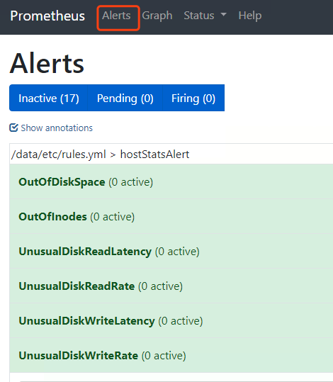

 

 以上这些就是我们的告警规则

测试告警：

把app命名空间里的dubbo-demo-service给停掉：


 

 看下blackbox里的信息：

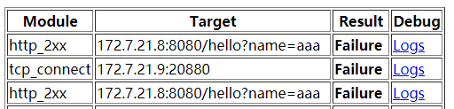

 

看下alert：

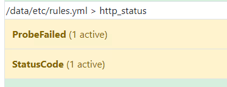

 

 红色的时候就开会发邮件告警：

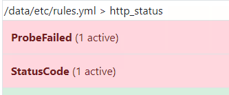

 

 已经收到告警了，后续上生产，还会更新如何添加微信、钉钉、短信告警

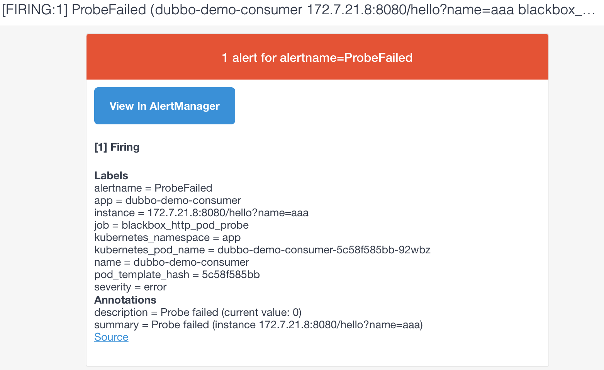

 如果需要自己定制告警规则和告警内容，需要研究一下promql，自己修改配置文件。

# 使用ELK Stack收集kubernetes集群内的应用日志

> Kubernetes 中对容器日志的处理方式,都叫做 cluster-level-logging，即这个日志处理系统，与容器、Pod 以及 Node 的生命周期都是完全无关的。这种设计当然是为了保证，无论是容器挂了、Pod 被删除，甚至节点宕机的时候，应用的日志依然可以被正常获取到。

**第一种，在 Node 上部署 logging agent，将日志文件转发到后端存储里保存起来**，架构图如下

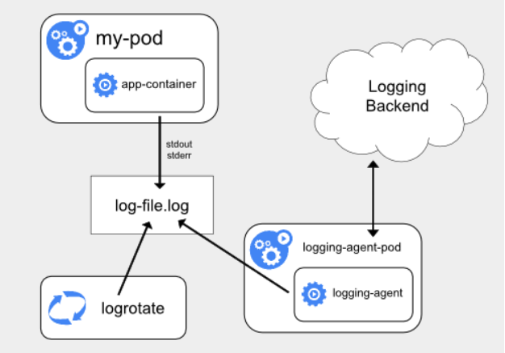

这里的核心在于 logging agent ，它一般都会以 DaemonSet 的方式运行在节点上，然后将宿主机上的容器日志目录挂载进去，最后由 logging-agent 把日志转发出去。

**优势**：在 Node 上部署 logging agent，在于一个节点只需要部署一个 agent，并且不会对应用和 Pod 有任何侵入性。

**不足**：要求应用输出的日志，都必须是直接输出到容器的 stdout 和 stderr 里。即如果每秒日志量很大时，直接输出到容器的stdout和stderr,很容易就把系统日志配额用满，因为对系统默认日志工具是针对单服务(例如docker)而不是进程进行限额的，最终导致的结果就是日志被吞掉。解决办法一个是增加配额，一个是给容器挂上存储，将日志输出到存储上

> **stdout 和 stderr**stdout是标准输出，stderr是错误输出

**第二种，就是对这种特殊情况的一个处理，即当容器的日志只能输出到某些文件里的时候，我们可以通过一个 sidecar 容器把这些日志文件重新输出到 sidecar 的 stdout 和 stderr 上，这样就能够继续使用第一种方案了。**架构图如下

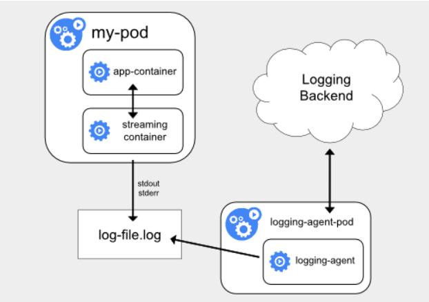

**不足**：宿主机上实际上会存在两份相同的日志文件一份是应用自己写入的；另一份则是 sidecar 的 stdout 和 stderr 对应的 JSON 文件。这对磁盘是很大的浪费，除非万不得已或者应用容器完全不可能被修改，否则不要使用这个方案

**第三种方案，就是通过一个 sidecar 容器，直接把应用的日志文件发送到远程存储里面去**，架构图如下

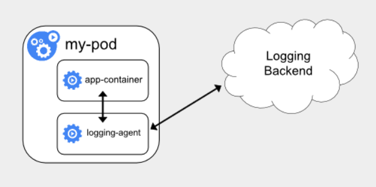

**优势**：直接把日志输出到固定的文件里而不是 stdout，logging-agent 可以使用 fluentd，后端存储可以是 ElasticSearch。部署简单，对宿主机友好。

**不足**：这个 sidecar 容器很可能会消耗较多的资源，甚至拖垮应用容器。并且，由于日志还是没有输出到 stdout 上，所以你通过 kubectl logs 是看不到任何日志输出的。

最后，无论是哪种方案，都必须要及时将这些日志文件从宿主机上清理掉，或者给日志目录专门挂载一些容量巨大的远程盘。否则，一旦主磁盘分区被打满，整个系统就可能会陷入奔溃状态。

## 部署ElasticSearch

[官网](https://www.elastic.co/)
[官方github地址](https://github.com/elastic/elasticsearch)
[下载地址](https://artifacts.elastic.co/downloads/elasticsearch/elasticsearch-7.7.1-linux-x86_64.tar.gz)

### 安装依赖与软件

```bash
yum install java -y
tar xf elasticsearch-7.7.1-linux-x86_64.tar.gz -C /usr/local/src
ln -s /usr/local/src/elasticsearch-7.7.1 /usr/local/elasticsearch
cd /usr/local/elasticsearch
```

### 配置

#### elasticsearch.yml

```bash
cp config/elasticsearch.yml{,.bak}
cat << 'EOF' >config/elasticsearch.yml
path.data: /data/elasticsearch/data #数据
path.logs: /data/elasticsearch/logs #日志
cluster.name: elasticsearch # 集群中的名称
node.name: es # 该节点名称，与前面配置hosts保持一致
node.master: true # 意思是该节点是否可选举为主节点
node.data: true # 表示这不是数据节点
network.host: 0.0.0.0 # 监听全部ip，在实际环境中应为一个安全的ip
http.port: 9200 # es服务的端口号
cluster.initial_master_nodes: es
EOF
```

#### jvm.options

```bash
vi config/jvm.options
-Xms512m
-Xmx512m
```

#### 创建普通用户

```bash
groupadd es
useradd es -g es
mkdir -p /data/elasticsearch/{data,logs}
chown -R es. /data/elasticsearch/
chown -R es. /usr/local/elasticsearch/
```

#### 文件描述符

```bash
cat << 'EOF' >>/etc/security/limits.conf
es hard nofile 65536
es soft fsize unlimited
es hard memlock unlimited
es soft memlock unlimited
EOF
```

#### 调整内核参数

```bash
echo "vm.max_map_count=262144" >> /etc/sysctl.conf
sysctl -p
```

### 启动

```bash
su - es
cd /usr/local/elasticsearch/bin/
./elasticsearch -d
```

### 调整ES日志模板

```bash
curl -XPUT 'http://127.0.0.1:9200/_template/k8s' -H 'content-Type:application/json' -d '{
  "template" : "k8s*",
  "index_patterns": ["k8s*"],  
  "settings": {
    "number_of_shards": 5,
    "number_of_replicas": 0
  }
}'
```

## 部署kafka

[官网](http://kafka.apache.org/)
[官方github地址](https://github.com/apache/kafka)
[下载地址](https://archive.apache.org/dist/kafka/2.2.1/kafka_2.11-2.2.1.tgz)：

### 安装

```bash
wget https://mirrors.tuna.tsinghua.edu.cn/apache/kafka/2.5.0/kafka_2.12-2.5.0.tgz
tar xf kafka_2.12-2.5.0.tgz -C /opt
ln -s /opt/kafka_2.12-2.5.0 /opt/kafka
```

### 配置

```bash
cat << 'EOF' >/opt/kafka/config/server.properties
broker.id=0 
port=9092
log.dirs=/data/kafka/logs
zookeeper.connect=zk-test.wzxmt.com:2181
log.flush.interval.messages=10000
log.flush.interval.ms=1000
delete.topic.enable=true
EOF
```

### 启动

```bash
cd /opt/kafka
bin/kafka-server-start.sh -daemon config/server.properties
netstat -luntp|grep 9092
```

### DNS解析

```bash
kafka	60 IN A 10.0.0.12
```

## 部署kafka-manager

新版kafka-manager已经更名为MCMAK [官方github地址](https://github.com/yahoo/kafka-manager)
运维主机上：

#### 下载MCMAK

```
mkdir kafka-manager
cd kafka-manager
wget https://github.com/yahoo/CMAK/releases/download/3.0.0.4/cmak-3.0.0.4.zip
unzip cmak-3.0.0.4.zip
rm -f cmak-3.0.0.4/bin/*.bat
```

#### 准备Dockerfile

```bash
cat << 'EOF' >Dockerfile
FROM openjdk:11.0-jre
ENV ZK_HOSTS=localhost:2181 \
    CMAK_VERSION=3.0.0.4
ADD cmak-${CMAK_VERSION}/ /opt/cmak
WORKDIR /opt/cmak
EXPOSE 9000
ENTRYPOINT ["bin/cmak"]
EOF
```

#### 制作镜像

```bash
docker build . -t harbor.wzxmt.com/infra/cmak:v3.0.0.4
docker push harbor.wzxmt.com/infra/cmak:v3.0.0.4
```

### 准备资源配置清单

Deployment

```yaml
mkdir -p /data/software/kafka-manager/yaml
cd /data/software/kafka-manager/yaml
cat<< 'EOF' >dp.yaml
kind: Deployment
apiVersion: apps/v1
metadata:
  name: kafka-manager
  namespace: infra
  labels: 
    name: kafka-manager
spec:
  replicas: 1
  selector:
    matchLabels: 
      name: kafka-manager
  template:
    metadata:
      labels: 
        app: kafka-manager
        name: kafka-manager
    spec:
      containers:
      - name: kafka-manager
        image: harbor.wzxmt.com/infra/cmak:v3.0.0.4
        ports:
        - containerPort: 9000
          protocol: TCP
        env:
        - name: ZK_HOSTS
          value: zk-test.wzxmt.com:2181
        - name: APPLICATION_SECRET
          value: letmein
        imagePullPolicy: IfNotPresent
      imagePullSecrets:
      - name: harborlogin
      restartPolicy: Always
      terminationGracePeriodSeconds: 30
      securityContext: 
        runAsUser: 0
      schedulerName: default-scheduler
  strategy:
    type: RollingUpdate
    rollingUpdate: 
      maxUnavailable: 1
      maxSurge: 1
  revisionHistoryLimit: 7
  progressDeadlineSeconds: 600
EOF
```

Service

```yaml
cat<< 'EOF' >svc.yaml
kind: Service
apiVersion: v1
metadata: 
  name: kafka-manager
  namespace: infra
spec:
  ports:
  - protocol: TCP
    port: 9000
    targetPort: 9000
  selector: 
    app: kafka-manager
  clusterIP: None
  type: ClusterIP
  sessionAffinity: None
EOF
```

Ingress

```yaml
cat<< 'EOF' >ingress.yaml
kind: Ingress
apiVersion: extensions/v1beta1
metadata: 
  name: kafka-manager
  namespace: infra
  annotations:
    traefik.ingress.kubernetes.io/router.entrypoints: web
spec:
  rules:
  - host: km.wzxmt.com
    http:
      paths:
      - path: /
        backend: 
          serviceName: kafka-manager
          servicePort: 9000
EOF
```

### 应用资源配置清单


```bash
kubectl apply -f kafka-manager/dp.yaml
kubectl apply -f kafka-manager/svc.yaml
kubectl apply -f kafka-manager/ingress.yaml
```

### 解析域名

```bash
km	60 IN A 10.0.0.50
```

### 浏览器访问

[http://km.wzxmt.com](http://km.wzxmt.com/)

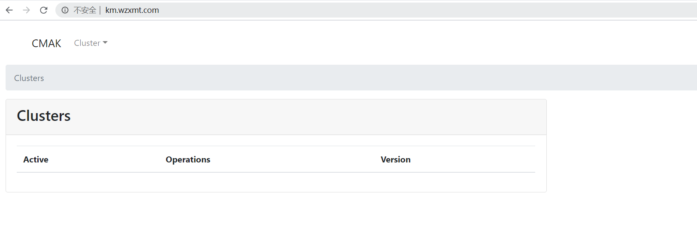

## 部署filebeat

[官方下载地址](https://www.elastic.co/downloads/beats/filebeat)
运维主机上：

### 制作docker镜像

#### 准备Dockerfile

Dockerfile

```bash
mkdir -p filebeat
cd filebeat
cat << 'EOF' >Dockerfile
FROM debian:jessie
ENV FILEBEAT_VERSION=7.7.1 \
    FILEBEAT_SHA1=bf155ccbf439b65d3a8cb316b048d1fa390eec9d35ef8d86c3da97a7fde4672f239574a89b82cca80e1b2e4a9640f9bf7a22b054c2ce883a38554d7fe8d52087

RUN set -x && \
  apt-get update && \
  apt-get install -y wget && \
  wget https://artifacts.elastic.co/downloads/beats/filebeat/filebeat-${FILEBEAT_VERSION}-linux-x86_64.tar.gz -O /opt/filebeat.tar.gz && \
  cd /opt && \
  echo "${FILEBEAT_SHA1}  filebeat.tar.gz" | sha512sum -c - && \
  tar xzvf filebeat.tar.gz && \
  cd filebeat-* && \
  cp filebeat /bin && \
  cd /opt && \
  rm -rf filebeat* && \
  apt-get purge -y wget && \
  apt-get autoremove -y && \
  apt-get clean && rm -rf /var/lib/apt/lists/* /tmp/* /var/tmp/*

COPY docker-entrypoint.sh /
ENTRYPOINT ["/docker-entrypoint.sh"]
EOF
```

docker-entrypoint.sh

```bash
cat << 'EOF' >docker-entrypoint.sh
#!/bin/bash
ENV=${ENV:-"test"}
PROJ_NAME=${PROJ_NAME:-"no-define"}
MULTILINE=${MULTILINE:-"^\d{2}"}
cat > /etc/filebeat.yaml << AOF
filebeat.inputs:
- type: log
  fields_under_root: true
  fields:
    topic: logm-${PROJ_NAME}
  paths:
    - /logm/*.log
    - /logm/**/*.log
  scan_frequency: 120s
  max_bytes: 10485760
  multiline.pattern: '$MULTILINE'
  multiline.negate: true
  multiline.match: after
  multiline.max_lines: 100
- type: log
  fields_under_root: true
  fields:
    topic: logu-${PROJ_NAME}
  paths:
    - /logu/*.log
    - /logu/**/*.log
output.kafka:
  hosts: ["kafka.wzxmt.com:9092"]
  topic: k8s-fb-$ENV-%{[topic]}
  version: 2.0.0
  required_acks: 0
  max_message_bytes: 10485760
AOF
set -xe
# If user don't provide any command
# Run filebeat
if [[ "$1" == "" ]]; then
     exec filebeat  -c /etc/filebeat.yaml 
else
     # Else allow the user to run arbitrarily commands like bash
    exec "$@"
fi
EOF
chmod +x docker-entrypoint.sh
```

#### 制作镜像

```bash
docker build . -t harbor.wzxmt.com/infra/filebeat:v7.7.1
docker push harbor.wzxmt.com/infra/filebeat:v7.7.1
```

### 修改资源配置清单

**使用dubbo-demo-consumer的Tomcat版镜像**

```yaml
cat<< 'EOF' >t/dubbo-demo-consumer/dp-f.yaml
kind: Deployment
apiVersion: apps/v1
metadata:
  name: dubbo-demo-consumer
  namespace: test
  labels: 
    name: dubbo-demo-consumer
spec:
  replicas: 1
  selector:
    matchLabels: 
      name: dubbo-demo-consumer
  template:
    metadata:
      labels: 
        app: dubbo-demo-consumer
        name: dubbo-demo-consumer
    spec:
      containers:
      - name: dubbo-demo-consumer
        image: harbor.wzxmt.com/app/dubbo-demo-web:tomcat_020609_0140
        ports:
        - containerPort: 8080
          protocol: TCP
        env:
        - name: C_OPTS
          value: -Denv=fat -Dapollo.meta=http://apollo-configservice:8080
        imagePullPolicy: IfNotPresent
        volumeMounts:
        - mountPath: /opt/tomcat/logs
          name: logm
      - name: filebeat
        image: harbor.wzxmt.com/infra/filebeat:v7.7.1
        env:
        - name: ENV
          value: test
        - name: PROJ_NAME
          value: dubbo-demo-web
        imagePullPolicy: IfNotPresent
        volumeMounts:
        - mountPath: /logm
          name: logm
      volumes:
      - emptyDir: {}
        name: logm
      imagePullSecrets:
      - name: harborlogin
      restartPolicy: Always
      terminationGracePeriodSeconds: 30
      securityContext: 
        runAsUser: 0
      schedulerName: default-scheduler
  strategy:
    type: RollingUpdate
    rollingUpdate: 
      maxUnavailable: 1
      maxSurge: 1
  revisionHistoryLimit: 7
  progressDeadlineSeconds: 600
EOF
```

### 浏览器访问[http://km.wzxmt.com](http://km.wzxmt.com/)

看到kafaka-manager里，topic打进来，即为成功。

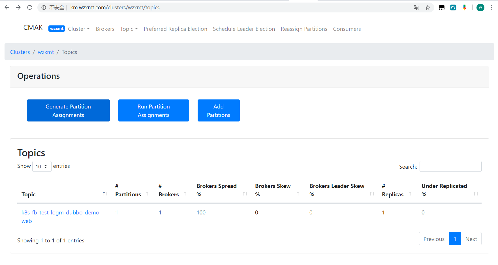

### 验证数据

```
cd /opt/kafka/bin
./kafka-console-consumer.sh --bootstrap-server 10.9.6.200:9092 --topic k8s-fb-test-logm-dubbo-demo-web --from-beginning
```

## 部署logstash

### 准备docker镜像

- 下载官方镜像

```
docker pull logstash:6.7.2
docker tag 857d9a1f8221 harbor.wzxmt.com/public/logstash:v6.7.2
docker push harbor.wzxmt.com/public/logstash:v6.7.2
cd logstash
```

- 自定义Dockerfile


```
cat << EOF >Dockerfile
From harbor.wzxmt.com/public/logstash:v6.7.2
ADD logstash.yml /usr/share/logstash/config
EOF
```

logstash.yml

```
cat << EOF >logstash.yml
http.host: "0.0.0.0"
path.config: /etc/logstash
xpack.monitoring.enabled: false
EOF
```

- 创建自定义镜像

```
docker build . -t harbor.wzxmt.com/infra/logstash:v6.7.2
docker push harbor.wzxmt.com/infra/logstash:v6.7.2
```

### 启动docker镜像

- 创建配置

```
cat << 'EOF' >/etc/logstash/logstash-test.conf
input {
  kafka {
    bootstrap_servers => "10.4.7.11:9092"
    client_id => "10.4.7.200"
    consumer_threads => 4
    group_id => "k8s_test"
    topics_pattern => "k8s-fb-test-.*"
  }
}

filter {
  json {
    source => "message"
  }
}

output {
  elasticsearch {
    hosts => ["10.4.7.12:9200"]
    index => "k8s-test-%{+YYYY.MM}"
  }
}
EOF
```

- 启动logstash镜像

```
docker run -d --name logstash-test -v /etc/logstash:/etc/logstash 
docker ps -a|grep logstash
```

- 验证ElasticSearch里的索引

```
curl http://172.17.0.12:9200/_cat/indices?v
```

## 部署Kibana

运维主机上：

### 准备docker镜像

[kibana官方镜像下载地址](https://hub.docker.com/_/kibana?tab=tags)

```
docker pull kibana:5.6.16
docker tag 62079cf74c23 harbor.wzxmt.com/infra/kibana:v5.6.16
docker push harbor.wzxmt.com/infra/kibana:v5.6.16
```

### 解析域名

```
kibana	60 IN A 10.4.7.10
```

### 准备资源配置清单

Deployment

```
cd /data/software/yamlkibana
cat << 'EOF' >dp.yaml
kind: Deployment
apiVersion: extensions/v1beta1
metadata:
  name: kibana
  namespace: infra
  labels: 
    name: kibana
spec:
  replicas: 1
  selector:
    matchLabels: 
      name: kibana
  template:
    metadata:
      labels: 
        app: kibana
        name: kibana
    spec:
      containers:
      - name: kibana
        image: harbor.wzxmt.com/infra/kibana:v5.6.16
        ports:
        - containerPort: 5601
          protocol: TCP
        env:
        - name: ELASTICSEARCH_URL
          value: http://172.17.0.12:9200
        imagePullPolicy: IfNotPresent
      imagePullSecrets:
      - name: harborlogin
      restartPolicy: Always
      terminationGracePeriodSeconds: 30
      securityContext: 
        runAsUser: 0
      schedulerName: default-scheduler
  strategy:
    type: RollingUpdate
    rollingUpdate: 
      maxUnavailable: 1
      maxSurge: 1
  revisionHistoryLimit: 7
  progressDeadlineSeconds: 600
  EOF
```

Service

```yaml
cat << 'EOF' >svc.yaml
kind: Service
apiVersion: v1
metadata: 
  name: kibana
  namespace: infra
spec:
  ports:
  - protocol: TCP
    port: 5601
    targetPort: 5601
  selector: 
    app: kibana
  clusterIP: None
  type: ClusterIP
  sessionAffinity: None
EOF
```

ingress

```yaml
cat << 'EOF' >ingress.yaml
kind: Ingress
apiVersion: extensions/v1beta1
metadata: 
  name: kibana
  namespace: infra
  annotations:
    traefik.ingress.kubernetes.io/router.entrypoints: web
spec:
  rules:
  - host: kibana.wzxmt.com
    http:
      paths:
      - path: /
        backend: 
          serviceName: kibana
          servicePort: 5601
EOF
```

### 应用资源配置清单

```
kubectl apply -f ./
```

### 浏览器访问

[http://kibana.wzxmt.com](http://kibana.wzxmt.com/)
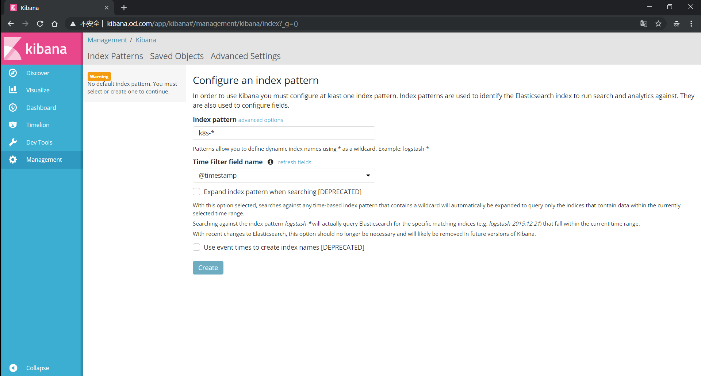

## kibana的使用

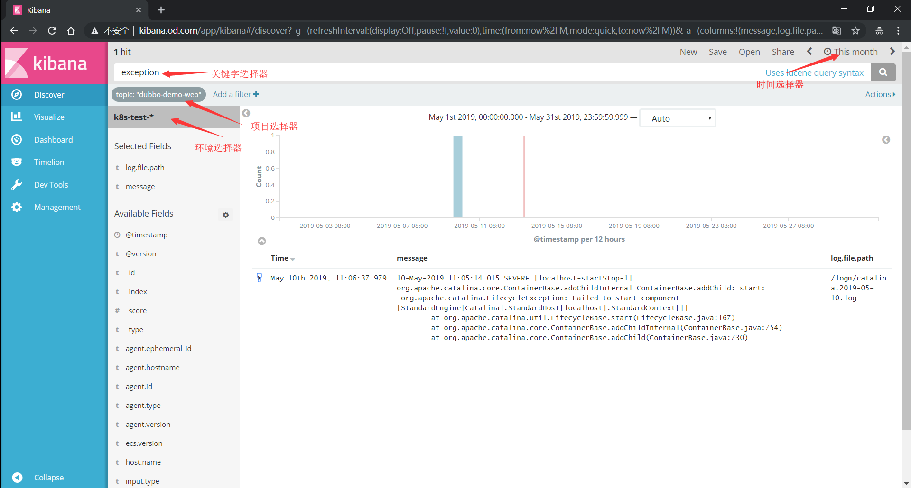

### 选择区域

- @timestamp

  > 对应日志的时间戳

- log.file.path

  > 对应日志文件名

- message

  > 对应日志内容

### 时间选择器

- 选择日志时间

  > 快速时间
  > 绝对时间
  > 相对时间

### 环境选择器

- 选择对应环境的日志

  > k8s-test-*
  > k8s-prod-*

### 项目选择器

- 对应filebeat的PROJ_NAME值

- Add a fillter

- topic is ${PROJ_NAME}

  > dubbo-demo-service
  > dubbo-demo-web

### 关键字选择器

- exception
- error
