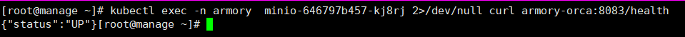

自动化运维平台spinaker部署与应用

> 从本章节开始，很多事情我不再截图而是一笔带过，以便你更好的动手操作，不过，一笔带过的地方我一定不会留大坑，这个你可以完全放心

#### 关于IaaS、PaaS、SaaS


> K8S不是传统意义上的Paas平台，而很多互联网公司都需要的是Paas平台，而不是单纯的K8S，K8S及其周边生态（如logstash、Prometheus等）才是Paas平台，才是公司需要的

#### 获得PaaS能力的几个必要条件：

- 统一应有的运行时环境（docker）
- 有IaaS能力（K8S）
- 有可靠的中间件集群、数据库集群（DBA的主要工作）
- 有分布式存储集群（存储工程师的主要工作）
- 有适配的监控、日志系统（Prometheus、ELK）
- 有完善的CI、CD系统（Jenkins、Spinnaker）

> 阿里云、腾讯云等厂商都提供了K8S为底的服务，即你买了集群就给你配备了K8S，但我们不能完全依赖于厂商，而被钳制，同时我们也需要不断的学习以备更好的理解和使用，公司越大时越需要自己创建而不是依赖于厂商。

#### spinnaker简介

> **WHAT**：通过灵活和可配置 Pipelines，实现可重复的自动化部署；提供所有环境的全局视图，可随时查看应用程序在其部署 Pipeline 的状态；易于配置、维护和扩展；等等；

主要功能

- 集群管理：主要用于管理云资源，即主要是IaaS的资源
- 部落管理：负责将Jenkins流水线创建的镜像，部署到K8S集群中去，让服务真正运行起来。
- 架构：[官网地址](https://www.spinnaker.io/reference/architecture/)


> Deck：点点点页面
>
> Gate：网关
>
> Igor：用来和Jenkins通信
>
> Echo：信息通讯组件
>
> Orca：任务编排引擎
>
> Clouddriver：云计算基础设施
>
> Front50：管理持久化数据
>
> 其中我们用到redis、minio
>
> 部署顺序：Minio-->Redis-->Clouddriver-->Front50-->Orca-->Echo-->Igor-->Gate-->Deck-->Nginx(是静态页面所以需要)
>
> 部署Spinnaker的Amory发行版

### 部署对象式存储minio

#### 创建镜像仓库与准备镜像

```bash
docker pull minio/minio:latest
docker tag minio/minio:latest harbor.wzxmt.com/armory/minio:latest
docker push harbor.wzxmt.com/armory/minio:latest
```

#### 创建名称空间

```bash
kubectl create ns armory
```

#### 创建docker-registry认证

```bash
kubectl create secret docker-registry harbor \
--namespace=armory  \
--docker-server=http://harbor.wzxmt.com \
--docker-username=admin \
--docker-password=admin
```

#### 资源清单

```bash
mkdir -p /data/software/yaml/armory/minio
cd /data/software/yaml/armory/minio/
```

Deployment

```yaml
cat << 'EOF' >dp.yaml
kind: Deployment
apiVersion: apps/v1
kind: Deployment
metadata:
  labels:
    name: minio
  name: minio
  namespace: armory
spec:
  progressDeadlineSeconds: 600
  replicas: 1
  revisionHistoryLimit: 7
  selector:
    matchLabels:
      name: minio
  template:
    metadata:
      labels:
        app: minio
        name: minio
    spec:
      containers:
      - name: minio
        image: harbor.wzxmt.com/armory/minio:latest
        imagePullPolicy: IfNotPresent
        ports:
        - containerPort: 9000
          protocol: TCP
        args:
        - server
        - /data
        env:
        - name: MINIO_ACCESS_KEY
          value: admin
        - name: MINIO_SECRET_KEY
          value: admin123
        readinessProbe:
          failureThreshold: 3
          httpGet:
            path: /minio/health/ready
            port: 9000
            scheme: HTTP
          initialDelaySeconds: 10
          periodSeconds: 10
          successThreshold: 1
          timeoutSeconds: 5
        volumeMounts:
        - mountPath: /data
          name: data
      imagePullSecrets:
      - name: harbor
      volumes:
      - nfs:
          server: nfs.wzxmt.com
          path: /data/nfs-volume/minio
        name: data
EOF
```

Service

```yaml
cat << 'EOF' >svc.yaml
apiVersion: v1
kind: Service
metadata:
  name: minio
  namespace: armory
spec:
  ports:
  - port: 80
    protocol: TCP
    targetPort: 9000
  selector:
    app: minio
EOF
```

Ingress

```yaml
cat << 'EOF' >ingress.yaml
kind: Ingress
apiVersion: extensions/v1beta1
metadata: 
  name: minio
  namespace: armory
  annotations:
    traefik.ingress.kubernetes.io/router.entrypoints: web
spec:
  rules:
  - host: minio.wzxmt.com
    http:
      paths:
      - path: /
        backend: 
          serviceName: minio
          servicePort: 80
EOF
```

#### 创建对应的存储

~~~
mkdir /data/nfs-volume/minio
~~~

#### DNS解析域名：

~~~
minio              A    10.0.0.50
~~~

> 为什么每次每次都不用些 wzxmt.com，是因为第一行有$ORIGIN  wzxmt.com. 的宏指令，会自动补

#### 应用清单:

~~~
kubectl apply -f ./
~~~

http://minio.wzxmt.com

账户：admin

密码：admin123


### 安装部署redis

#### 准备镜像

```bash
docker pull redis:4.0.14
docker tag redis:4.0.14 harbor.wzxmt.com/armory/redis:v4.0.14
docker push harbor.wzxmt.com/armory/redis:v4.0.14
```

#### 资源清单

```
mkdir /data/software/yaml/armory/redis
cd /data/software/yaml/armory/redis
```

Deployment

~~~yaml
cat << 'EOF' >dp.yaml
apiVersion: apps/v1
kind: Deployment
metadata:
  labels:
    name: redis
  name: redis
  namespace: armory
spec:
  replicas: 1
  revisionHistoryLimit: 7
  selector:
    matchLabels:
      name: redis
  template:
    metadata:
      labels:
        app: redis
        name: redis
    spec:
      containers:
      - name: redis
        image: harbor.wzxmt.com/armory/redis:v4.0.14
        imagePullPolicy: IfNotPresent
        ports:
        - containerPort: 6379
          protocol: TCP
      imagePullSecrets:
      - name: harbor
EOF
~~~

Service

```yaml
cat << 'EOF' >svc.yaml
apiVersion: v1
kind: Service
metadata:
  name: redis
  namespace: armory
spec:
  ports:
  - port: 6379
    protocol: TCP
    targetPort: 6379
  selector:
    app: redis
EOF
```

#### 应用资源清单

~~~bash
kubectl apply -f ./
~~~

### 安装部署clouddriver

#### 准备镜像

```bash
docker pull armory/spinnaker-clouddriver-slim:release-1.11.x-bee52673a
docker images|grep clouddriver
docker tag f1d52d01e28d harbor.wzxmt.com/armory/clouddriver:v1.11.x
docker push harbor.wzxmt.com/armory/clouddriver:v1.11.x
```

添加证书,将集群主机的ca* 拷贝到运维主机

```bash
cat >ca-config.json << EOF
{"signing":{"default":{"expiry":"87600h"},"profiles":{"kubernetes":{"usages":["signing","key encipherment","server auth","client auth"],"expiry":"87600h"}}}}
EOF
cat > admin-csr.json << EOF
{"CN":"cluster-admin","key":{"algo": "rsa","size":2048},"names":[{"C":"CN","L":"BeiJing","ST":"BeiJing","O":"kubernetes","OU":"k8s"}]}
EOF
cfssl gencert -ca=ca.pem -ca-key=ca-key.pem -config=ca-config.json -profile=kubernetes admin-csr.json | cfssljson -bare admin
```


生成admin用户kube.config

~~~bash
kubectl config set-cluster myk8s --certificate-authority=ca.pem --embed-certs=true --server=https://10.0.0.150:8443 --kubeconfig=config

kubectl config set-credentials cluster-admin --client-certificate=admin.pem --client-key=admin-key.pem --embed-certs=true --kubeconfig=config

kubectl config set-context myk8s-context --cluster=myk8s --user=cluster-admin --kubeconfig=config

kubectl config use-context myk8s-context --kubeconfig=config
~~~

绑定clusterrolebinding

```bash
kubectl create clusterrolebinding myk8s-admin --clusterrole=cluster-admin --user=cluster-admin
```

拷贝文件

```bash
mkdir -p /root/.kube
cp config scp /root/.kube/
scp m1:/usr/local/bin/kubectl /usr/local/
```

查看状态

~~~
kubectl config view
kubectl get pods -n infra
~~~


添加配置文件

```bash
cat << 'EOF' >credentials
[default]
aws_access_key_id=admin
aws_secret_access_key=admin123
EOF
```

添加credentials

```bash
kubectl create secret generic credentials --from-file=credentials -n armory
```

创建default-config 

~~~yaml
cp config default-kubeconfig
kubectl create cm default-kubeconfig --from-file=default-kubeconfig -n armory
~~~


#### 资源清单

```bash
mkdir /data/software/yaml/armory/clouddriver
cd /data/software/yaml/armory/clouddriver
```

ConfigMap

```yaml
cat << 'EOF' >init-env.yaml
kind: ConfigMap
apiVersion: v1
metadata:
  name: init-env
  namespace: armory
data:
  API_HOST: http://spinnaker.wzxmt.com/api
  ARMORY_ID: c02f0781-92f5-4e80-86db-0ba8fe7b8544
  ARMORYSPINNAKER_CONF_STORE_BUCKET: armory-platform
  ARMORYSPINNAKER_CONF_STORE_PREFIX: front50
  ARMORYSPINNAKER_GCS_ENABLED: "false"
  ARMORYSPINNAKER_S3_ENABLED: "true"
  AUTH_ENABLED: "false"
  AWS_REGION: us-east-1
  BASE_IP: 127.0.0.1
  CLOUDDRIVER_OPTS: -Dspring.profiles.active=armory,configurator,local
  CONFIGURATOR_ENABLED: "false"
  DECK_HOST: http://spinnaker.wzxmt.com
  ECHO_OPTS: -Dspring.profiles.active=armory,configurator,local
  GATE_OPTS: -Dspring.profiles.active=armory,configurator,local
  IGOR_OPTS: -Dspring.profiles.active=armory,configurator,local
  PLATFORM_ARCHITECTURE: k8s
  REDIS_HOST: redis://redis:6379
  SERVER_ADDRESS: 0.0.0.0
  SPINNAKER_AWS_DEFAULT_REGION: us-east-1
  SPINNAKER_AWS_ENABLED: "false"
  SPINNAKER_CONFIG_DIR: /home/spinnaker/config
  SPINNAKER_GOOGLE_PROJECT_CREDENTIALS_PATH: ""
  SPINNAKER_HOME: /home/spinnaker
  SPRING_PROFILES_ACTIVE: armory,configurator,local
EOF
```

ConfigMap

```yaml
cat << 'EOF' >default-config.yaml
kind: ConfigMap
apiVersion: v1
metadata:
  name: default-config
  namespace: armory
data:
  barometer.yml: |
    server:
      port: 9092

    spinnaker:
      redis:
        host: ${services.redis.host}
        port: ${services.redis.port}
  clouddriver-armory.yml: |
    aws:
      defaultAssumeRole: role/${SPINNAKER_AWS_DEFAULT_ASSUME_ROLE:SpinnakerManagedProfile}
      accounts:
        - name: default-aws-account
          accountId: ${SPINNAKER_AWS_DEFAULT_ACCOUNT_ID:none}

      client:
        maxErrorRetry: 20

    serviceLimits:
      cloudProviderOverrides:
        aws:
          rateLimit: 15.0

      implementationLimits:
        AmazonAutoScaling:
          defaults:
            rateLimit: 3.0
        AmazonElasticLoadBalancing:
          defaults:
            rateLimit: 5.0

    security.basic.enabled: false
    management.security.enabled: false
  clouddriver-dev.yml: |

    serviceLimits:
      defaults:
        rateLimit: 2
  clouddriver.yml: |
    server:
      port: ${services.clouddriver.port:7002}
      address: ${services.clouddriver.host:localhost}

    redis:
      connection: ${REDIS_HOST:redis://localhost:6379}

    udf:
      enabled: ${services.clouddriver.aws.udf.enabled:true}
      udfRoot: /opt/spinnaker/config/udf
      defaultLegacyUdf: false

    default:
      account:
        env: ${providers.aws.primaryCredentials.name}

    aws:
      enabled: ${providers.aws.enabled:false}
      defaults:
        iamRole: ${providers.aws.defaultIAMRole:BaseIAMRole}
      defaultRegions:
        - name: ${providers.aws.defaultRegion:us-east-1}
      defaultFront50Template: ${services.front50.baseUrl}
      defaultKeyPairTemplate: ${providers.aws.defaultKeyPairTemplate}

    azure:
      enabled: ${providers.azure.enabled:false}

      accounts:
        - name: ${providers.azure.primaryCredentials.name}
          clientId: ${providers.azure.primaryCredentials.clientId}
          appKey: ${providers.azure.primaryCredentials.appKey}
          tenantId: ${providers.azure.primaryCredentials.tenantId}
          subscriptionId: ${providers.azure.primaryCredentials.subscriptionId}

    google:
      enabled: ${providers.google.enabled:false}

      accounts:
        - name: ${providers.google.primaryCredentials.name}
          project: ${providers.google.primaryCredentials.project}
          jsonPath: ${providers.google.primaryCredentials.jsonPath}
          consul:
            enabled: ${providers.google.primaryCredentials.consul.enabled:false}

    cf:
      enabled: ${providers.cf.enabled:false}

      accounts:
        - name: ${providers.cf.primaryCredentials.name}
          api: ${providers.cf.primaryCredentials.api}
          console: ${providers.cf.primaryCredentials.console}
          org: ${providers.cf.defaultOrg}
          space: ${providers.cf.defaultSpace}
          username: ${providers.cf.account.name:}
          password: ${providers.cf.account.password:}

    kubernetes:
      enabled: ${providers.kubernetes.enabled:false}
      accounts:
        - name: ${providers.kubernetes.primaryCredentials.name}
          dockerRegistries:
            - accountName: ${providers.kubernetes.primaryCredentials.dockerRegistryAccount}

    openstack:
      enabled: ${providers.openstack.enabled:false}
      accounts:
        - name: ${providers.openstack.primaryCredentials.name}
          authUrl: ${providers.openstack.primaryCredentials.authUrl}
          username: ${providers.openstack.primaryCredentials.username}
          password: ${providers.openstack.primaryCredentials.password}
          projectName: ${providers.openstack.primaryCredentials.projectName}
          domainName: ${providers.openstack.primaryCredentials.domainName:Default}
          regions: ${providers.openstack.primaryCredentials.regions}
          insecure: ${providers.openstack.primaryCredentials.insecure:false}
          userDataFile: ${providers.openstack.primaryCredentials.userDataFile:}

          lbaas:
            pollTimeout: 60
            pollInterval: 5

    dockerRegistry:
      enabled: ${providers.dockerRegistry.enabled:false}
      accounts:
        - name: ${providers.dockerRegistry.primaryCredentials.name}
          address: ${providers.dockerRegistry.primaryCredentials.address}
          username: ${providers.dockerRegistry.primaryCredentials.username:}
          passwordFile: ${providers.dockerRegistry.primaryCredentials.passwordFile}

    credentials:
      primaryAccountTypes: ${providers.aws.primaryCredentials.name}, ${providers.google.primaryCredentials.name}, ${providers.cf.primaryCredentials.name}, ${providers.azure.primaryCredentials.name}
      challengeDestructiveActionsEnvironments: ${providers.aws.primaryCredentials.name}, ${providers.google.primaryCredentials.name}, ${providers.cf.primaryCredentials.name}, ${providers.azure.primaryCredentials.name}

    spectator:
      applicationName: ${spring.application.name}
      webEndpoint:
        enabled: ${services.spectator.webEndpoint.enabled:false}
        prototypeFilter:
          path: ${services.spectator.webEndpoint.prototypeFilter.path:}

      stackdriver:
        enabled: ${services.stackdriver.enabled}
        projectName: ${services.stackdriver.projectName}
        credentialsPath: ${services.stackdriver.credentialsPath}

    stackdriver:
      hints:
        - name: controller.invocations
          labels:
          - account
          - region
  dinghy.yml: ""
  echo-armory.yml: |
    diagnostics:
      enabled: true
      id: ${ARMORY_ID:unknown}

    armorywebhooks:
      enabled: false
      forwarding:
        baseUrl: http://armory-dinghy:8081
        endpoint: v1/webhooks
  echo-noncron.yml: |
    scheduler:
      enabled: false
  echo.yml: |
    server:
      port: ${services.echo.port:8089}
      address: ${services.echo.host:localhost}

    cassandra:
      enabled: ${services.echo.cassandra.enabled:false}
      embedded: ${services.cassandra.embedded:false}
      host: ${services.cassandra.host:localhost}

    spinnaker:
      baseUrl: ${services.deck.baseUrl}
      cassandra:
         enabled: ${services.echo.cassandra.enabled:false}
      inMemory:
         enabled: ${services.echo.inMemory.enabled:true}

    front50:
      baseUrl: ${services.front50.baseUrl:http://localhost:8080 }

    orca:
      baseUrl: ${services.orca.baseUrl:http://localhost:8083 }

    endpoints.health.sensitive: false

    slack:
      enabled: ${services.echo.notifications.slack.enabled:false}
      token: ${services.echo.notifications.slack.token}

    spring:
      mail:
        host: ${mail.host}

    mail:
      enabled: ${services.echo.notifications.mail.enabled:false}
      host: ${services.echo.notifications.mail.host}
      from: ${services.echo.notifications.mail.fromAddress}

    hipchat:
      enabled: ${services.echo.notifications.hipchat.enabled:false}
      baseUrl: ${services.echo.notifications.hipchat.url}
      token: ${services.echo.notifications.hipchat.token}

    twilio:
      enabled: ${services.echo.notifications.sms.enabled:false}
      baseUrl: ${services.echo.notifications.sms.url:https://api.twilio.com/ }
      account: ${services.echo.notifications.sms.account}
      token: ${services.echo.notifications.sms.token}
      from: ${services.echo.notifications.sms.from}

    scheduler:
      enabled: ${services.echo.cron.enabled:true}
      threadPoolSize: 20
      triggeringEnabled: true
      pipelineConfigsPoller:
        enabled: true
        pollingIntervalMs: 30000
      cron:
        timezone: ${services.echo.cron.timezone}

    spectator:
      applicationName: ${spring.application.name}
      webEndpoint:
        enabled: ${services.spectator.webEndpoint.enabled:false}
        prototypeFilter:
          path: ${services.spectator.webEndpoint.prototypeFilter.path:}

      stackdriver:
        enabled: ${services.stackdriver.enabled}
        projectName: ${services.stackdriver.projectName}
        credentialsPath: ${services.stackdriver.credentialsPath}

    webhooks:
      artifacts:
        enabled: true
  fetch.sh: |+
  
    CONFIG_LOCATION=${SPINNAKER_HOME:-"/opt/spinnaker"}/config
    CONTAINER=$1

    rm -f /opt/spinnaker/config/*.yml

    mkdir -p ${CONFIG_LOCATION}

    for filename in /opt/spinnaker/config/default/*.yml; do
        cp $filename ${CONFIG_LOCATION}
    done

    if [ -d /opt/spinnaker/config/custom ]; then
        for filename in /opt/spinnaker/config/custom/*; do
            cp $filename ${CONFIG_LOCATION}
        done
    fi

    add_ca_certs() {
      ca_cert_path="$1"
      jks_path="$2"
      alias="$3"

      if [[ "$(whoami)" != "root" ]]; then
        echo "INFO: I do not have proper permisions to add CA roots"
        return
      fi

      if [[ ! -f ${ca_cert_path} ]]; then
        echo "INFO: No CA cert found at ${ca_cert_path}"
        return
      fi
      keytool -importcert \
          -file ${ca_cert_path} \
          -keystore ${jks_path} \
          -alias ${alias} \
          -storepass changeit \
          -noprompt
    }

    if [ `which keytool` ]; then
      echo "INFO: Keytool found adding certs where appropriate"
      add_ca_certs "${CONFIG_LOCATION}/ca.crt" "/etc/ssl/certs/java/cacerts" "custom-ca"
    else
      echo "INFO: Keytool not found, not adding any certs/private keys"
    fi

    saml_pem_path="/opt/spinnaker/config/custom/saml.pem"
    saml_pkcs12_path="/tmp/saml.pkcs12"
    saml_jks_path="${CONFIG_LOCATION}/saml.jks"

    x509_ca_cert_path="/opt/spinnaker/config/custom/x509ca.crt"
    x509_client_cert_path="/opt/spinnaker/config/custom/x509client.crt"
    x509_jks_path="${CONFIG_LOCATION}/x509.jks"
    x509_nginx_cert_path="/opt/nginx/certs/ssl.crt"

    if [ "${CONTAINER}" == "gate" ]; then
        if [ -f ${saml_pem_path} ]; then
            echo "Loading ${saml_pem_path} into ${saml_jks_path}"
            openssl pkcs12 -export -out ${saml_pkcs12_path} -in ${saml_pem_path} -password pass:changeit -name saml
            keytool -genkey -v -keystore ${saml_jks_path} -alias saml \
                    -keyalg RSA -keysize 2048 -validity 10000 \
                    -storepass changeit -keypass changeit -dname "CN=armory"
            keytool -importkeystore \
                    -srckeystore ${saml_pkcs12_path} \
                    -srcstoretype PKCS12 \
                    -srcstorepass changeit \
                    -destkeystore ${saml_jks_path} \
                    -deststoretype JKS \
                    -storepass changeit \
                    -alias saml \
                    -destalias saml \
                    -noprompt
        else
            echo "No SAML IDP pemfile found at ${saml_pem_path}"
        fi
        if [ -f ${x509_ca_cert_path} ]; then
            echo "Loading ${x509_ca_cert_path} into ${x509_jks_path}"
            add_ca_certs ${x509_ca_cert_path} ${x509_jks_path} "ca"
        else
            echo "No x509 CA cert found at ${x509_ca_cert_path}"
        fi
        if [ -f ${x509_client_cert_path} ]; then
            echo "Loading ${x509_client_cert_path} into ${x509_jks_path}"
            add_ca_certs ${x509_client_cert_path} ${x509_jks_path} "client"
        else
            echo "No x509 Client cert found at ${x509_client_cert_path}"
        fi

        if [ -f ${x509_nginx_cert_path} ]; then
            echo "Creating a self-signed CA (EXPIRES IN 360 DAYS) with java keystore: ${x509_jks_path}"
            echo -e "\n\n\n\n\n\ny\n" | keytool -genkey -keyalg RSA -alias server -keystore keystore.jks -storepass changeit -validity 360 -keysize 2048
            keytool -importkeystore \
                    -srckeystore keystore.jks \
                    -srcstorepass changeit \
                    -destkeystore "${x509_jks_path}" \
                    -storepass changeit \
                    -srcalias server \
                    -destalias server \
                    -noprompt
        else
            echo "No x509 nginx cert found at ${x509_nginx_cert_path}"
        fi
    fi

    if [ "${CONTAINER}" == "nginx" ]; then
        nginx_conf_path="/opt/spinnaker/config/default/nginx.conf"
        if [ -f ${nginx_conf_path} ]; then
            cp ${nginx_conf_path} /etc/nginx/nginx.conf
        fi
    fi

  fiat.yml: |-
    server:
      port: ${services.fiat.port:7003}
      address: ${services.fiat.host:localhost}

    redis:
      connection: ${services.redis.connection:redis://localhost:6379}

    spectator:
      applicationName: ${spring.application.name}
      webEndpoint:
        enabled: ${services.spectator.webEndpoint.enabled:false}
        prototypeFilter:
          path: ${services.spectator.webEndpoint.prototypeFilter.path:}
      stackdriver:
        enabled: ${services.stackdriver.enabled}
        projectName: ${services.stackdriver.projectName}
        credentialsPath: ${services.stackdriver.credentialsPath}

    hystrix:
     command:
       default.execution.isolation.thread.timeoutInMilliseconds: 20000

    logging:
      level:
        com.netflix.spinnaker.fiat: DEBUG
  front50-armory.yml: |
    spinnaker:
      redis:
        enabled: true
        host: redis
  front50.yml: |
    server:
      port: ${services.front50.port:8080}
      address: ${services.front50.host:localhost}

    hystrix:
      command:
        default.execution.isolation.thread.timeoutInMilliseconds: 15000

    cassandra:
      enabled: ${services.front50.cassandra.enabled:false}
      embedded: ${services.cassandra.embedded:false}
      host: ${services.cassandra.host:localhost}

    aws:
      simpleDBEnabled: ${providers.aws.simpleDBEnabled:false}
      defaultSimpleDBDomain: ${providers.aws.defaultSimpleDBDomain}

    spinnaker:
      cassandra:
        enabled: ${services.front50.cassandra.enabled:false}
        host: ${services.cassandra.host:localhost}
        port: ${services.cassandra.port:9042}
        cluster: ${services.cassandra.cluster:CASS_SPINNAKER}
        keyspace: front50
        name: global

      redis:
        enabled: ${services.front50.redis.enabled:false}

      gcs:
        enabled: ${services.front50.gcs.enabled:false}
        bucket: ${services.front50.storage_bucket:}
        bucketLocation: ${services.front50.bucket_location:}
        rootFolder: ${services.front50.rootFolder:front50}
        project: ${providers.google.primaryCredentials.project}
        jsonPath: ${providers.google.primaryCredentials.jsonPath}

      s3:
        enabled: ${services.front50.s3.enabled:false}
        bucket: ${services.front50.storage_bucket:}
        rootFolder: ${services.front50.rootFolder:front50}

    spectator:
      applicationName: ${spring.application.name}
      webEndpoint:
        enabled: ${services.spectator.webEndpoint.enabled:false}
        prototypeFilter:
          path: ${services.spectator.webEndpoint.prototypeFilter.path:}

      stackdriver:
        enabled: ${services.stackdriver.enabled}
        projectName: ${services.stackdriver.projectName}
        credentialsPath: ${services.stackdriver.credentialsPath}

    stackdriver:
      hints:
        - name: controller.invocations
          labels:
          - application
          - cause
        - name: aws.request.httpRequestTime
          labels:
          - status
          - exception
          - AWSErrorCode
        - name: aws.request.requestSigningTime
          labels:
          - exception
  gate-armory.yml: |+
    lighthouse:
        baseUrl: http://${DEFAULT_DNS_NAME:lighthouse}:5000

  gate.yml: |
    server:
      port: ${services.gate.port:8084}
      address: ${services.gate.host:localhost}

    redis:
      connection: ${REDIS_HOST:redis://localhost:6379}
      configuration:
        secure: true

    spectator:
      applicationName: ${spring.application.name}
      webEndpoint:
        enabled: ${services.spectator.webEndpoint.enabled:false}
        prototypeFilter:
          path: ${services.spectator.webEndpoint.prototypeFilter.path:}

      stackdriver:
        enabled: ${services.stackdriver.enabled}
        projectName: ${services.stackdriver.projectName}
        credentialsPath: ${services.stackdriver.credentialsPath}

    stackdriver:
      hints:
        - name: EurekaOkClient_Request
          labels:
          - cause
          - reason
          - status
  igor-nonpolling.yml: |
    jenkins:
      polling:
        enabled: false
  igor.yml: |
    server:
      port: ${services.igor.port:8088}
      address: ${services.igor.host:localhost}

    jenkins:
      enabled: ${services.jenkins.enabled:false}
      masters:
        - name: ${services.jenkins.defaultMaster.name}
          address: ${services.jenkins.defaultMaster.baseUrl}
          username: ${services.jenkins.defaultMaster.username}
          password: ${services.jenkins.defaultMaster.password}
          csrf: ${services.jenkins.defaultMaster.csrf:false}
          
    travis:
      enabled: ${services.travis.enabled:false}
      masters:
        - name: ${services.travis.defaultMaster.name}
          baseUrl: ${services.travis.defaultMaster.baseUrl}
          address: ${services.travis.defaultMaster.address}
          githubToken: ${services.travis.defaultMaster.githubToken}


    dockerRegistry:
      enabled: ${providers.dockerRegistry.enabled:false}


    redis:
      connection: ${REDIS_HOST:redis://localhost:6379}

    spectator:
      applicationName: ${spring.application.name}
      webEndpoint:
        enabled: ${services.spectator.webEndpoint.enabled:false}
        prototypeFilter:
          path: ${services.spectator.webEndpoint.prototypeFilter.path:}
      stackdriver:
        enabled: ${services.stackdriver.enabled}
        projectName: ${services.stackdriver.projectName}
        credentialsPath: ${services.stackdriver.credentialsPath}

    stackdriver:
      hints:
        - name: controller.invocations
          labels:
          - master
  kayenta-armory.yml: |
    kayenta:
      aws:
        enabled: ${ARMORYSPINNAKER_S3_ENABLED:false}
        accounts:
          - name: aws-s3-storage
            bucket: ${ARMORYSPINNAKER_CONF_STORE_BUCKET}
            rootFolder: kayenta
            supportedTypes:
              - OBJECT_STORE
              - CONFIGURATION_STORE

      s3:
        enabled: ${ARMORYSPINNAKER_S3_ENABLED:false}

      google:
        enabled: ${ARMORYSPINNAKER_GCS_ENABLED:false}
        accounts:
          - name: cloud-armory
            bucket: ${ARMORYSPINNAKER_CONF_STORE_BUCKET}
            rootFolder: kayenta-prod
            supportedTypes:
              - METRICS_STORE
              - OBJECT_STORE
              - CONFIGURATION_STORE
              
      gcs:
        enabled: ${ARMORYSPINNAKER_GCS_ENABLED:false}
  kayenta.yml: |2

    server:
      port: 8090

    kayenta:
      atlas:
        enabled: false

      google:
        enabled: false

      aws:
        enabled: false

      datadog:
        enabled: false

      prometheus:
        enabled: false

      gcs:
        enabled: false

      s3:
        enabled: false

      stackdriver:
        enabled: false

      memory:
        enabled: false

      configbin:
        enabled: false

    keiko:
      queue:
        redis:
          queueName: kayenta.keiko.queue
          deadLetterQueueName: kayenta.keiko.queue.deadLetters

    redis:
      connection: ${REDIS_HOST:redis://localhost:6379}

    spectator:
      applicationName: ${spring.application.name}
      webEndpoint:
        enabled: true

    swagger:
      enabled: true
      title: Kayenta API
      description:
      contact:
      patterns:
        - /admin.*
        - /canary.*
        - /canaryConfig.*
        - /canaryJudgeResult.*
        - /credentials.*
        - /fetch.*
        - /health
        - /judges.*
        - /metadata.*
        - /metricSetList.*
        - /metricSetPairList.*
        - /pipeline.*

    security.basic.enabled: false
    management.security.enabled: false
  nginx.conf: |
    user  nginx;
    worker_processes  1;

    error_log  /var/log/nginx/error.log warn;
    pid        /var/run/nginx.pid;

    events {
        worker_connections  1024;
    }

    http {
        include       /etc/nginx/mime.types;
        default_type  application/octet-stream;
        log_format  main  '$remote_addr - $remote_user [$time_local] "$request" '
                          '$status $body_bytes_sent "$http_referer" '
                          '"$http_user_agent" "$http_x_forwarded_for"';
        access_log  /var/log/nginx/access.log  main;
        
        sendfile        on;
        keepalive_timeout  65;
        include /etc/nginx/conf.d/*.conf;
    }

    stream {
        upstream gate_api {
            server armory-gate:8085;
        }

        server {
            listen 8085;
            proxy_pass gate_api;
        }
    }
  nginx.http.conf: |
    gzip on;
    gzip_types text/plain text/css application/json application/x-javascript text/xml application/xml application/xml+rss text/javascript application/vnd.ms-fontobject application/x-font-ttf font/opentype image/svg+xml image/x-icon;

    server {
           listen 80;
           listen [::]:80;

           location / {
                proxy_pass http://armory-deck/;
           }

           location /api/ {
                proxy_pass http://armory-gate:8084/;
           }

           location /slack/ {
               proxy_pass http://armory-platform:10000/;
           }

           rewrite ^/login(.*)$ /api/login$1 last;
           rewrite ^/auth(.*)$ /api/auth$1 last;
    }
  nginx.https.conf: |
    gzip on;
    gzip_types text/plain text/css application/json application/x-javascript text/xml application/xml application/xml+rss text/javascript application/vnd.ms-fontobject application/x-font-ttf font/opentype image/svg+xml image/x-icon;

    server {
        listen 80;
        listen [::]:80;
        return 301 https://$host$request_uri;
    }

    server {
        listen 443 ssl;
        listen [::]:443 ssl;
        ssl on;
        ssl_certificate /opt/nginx/certs/ssl.crt;
        ssl_certificate_key /opt/nginx/certs/ssl.key;

        location / {
            proxy_pass http://armory-deck/;
        }

        location /api/ {
            proxy_pass http://armory-gate:8084/;
            proxy_set_header Host            $host;
            proxy_set_header X-Real-IP       $proxy_protocol_addr;
            proxy_set_header X-Forwarded-For $proxy_protocol_addr;
            proxy_set_header X-Forwarded-Proto $scheme;
        }

        location /slack/ {
            proxy_pass http://armory-platform:10000/;
        }
        rewrite ^/login(.*)$ /api/login$1 last;
        rewrite ^/auth(.*)$ /api/auth$1 last;
    }
  orca-armory.yml: |
    mine:
      baseUrl: http://${services.barometer.host}:${services.barometer.port}

    pipelineTemplate:
      enabled: ${features.pipelineTemplates.enabled:false}
      jinja:
        enabled: true

    kayenta:
      enabled: ${services.kayenta.enabled:false}
      baseUrl: ${services.kayenta.baseUrl}

    jira:
      enabled: ${features.jira.enabled:false}
      basicAuth:  "Basic ${features.jira.basicAuthToken}"
      url: ${features.jira.createIssueUrl}

    webhook:
      preconfigured:
        - label: Enforce Pipeline Policy
          description: Checks pipeline configuration against policy requirements
          type: enforcePipelinePolicy
          enabled: ${features.certifiedPipelines.enabled:false}
          url: "http://lighthouse:5000/v1/pipelines/${execution.application}/${execution.pipelineConfigId}?check_policy=yes"
          headers:
            Accept:
              - application/json
          method: GET
          waitForCompletion: true
          statusUrlResolution: getMethod
          statusJsonPath: $.status
          successStatuses: pass
          canceledStatuses:
          terminalStatuses: TERMINAL

        - label: "Jira: Create Issue"
          description:  Enter a Jira ticket when this pipeline runs
          type: createJiraIssue
          enabled: ${jira.enabled}
          url:  ${jira.url}
          customHeaders:
            "Content-Type": application/json
            Authorization: ${jira.basicAuth}
          method: POST
          parameters:
            - name: summary
              label: Issue Summary
              description: A short summary of your issue.
            - name: description
              label: Issue Description
              description: A longer description of your issue.
            - name: projectKey
              label: Project key
              description: The key of your JIRA project.
            - name: type
              label: Issue Type
              description: The type of your issue, e.g. "Task", "Story", etc.
          payload: |
            {
              "fields" : {
                "description": "${parameterValues['description']}",
                "issuetype": {
                   "name": "${parameterValues['type']}"
                },
                "project": {
                   "key": "${parameterValues['projectKey']}"
                },
                "summary":  "${parameterValues['summary']}"
              }
            }
          waitForCompletion: false

        - label: "Jira: Update Issue"
          description:  Update a previously created Jira Issue
          type: updateJiraIssue
          enabled: ${jira.enabled}
          url: "${execution.stages.?[type == 'createJiraIssue'][0]['context']['buildInfo']['self']}"
          customHeaders:
            "Content-Type": application/json
            Authorization: ${jira.basicAuth}
          method: PUT
          parameters:
            - name: summary
              label: Issue Summary
              description: A short summary of your issue.
            - name: description
              label: Issue Description
              description: A longer description of your issue.
          payload: |
            {
              "fields" : {
                "description": "${parameterValues['description']}",
                "summary": "${parameterValues['summary']}"
              }
            }
          waitForCompletion: false

        - label: "Jira: Transition Issue"
          description:  Change state of existing Jira Issue
          type: transitionJiraIssue
          enabled: ${jira.enabled}
          url: "${execution.stages.?[type == 'createJiraIssue'][0]['context']['buildInfo']['self']}/transitions"
          customHeaders:
            "Content-Type": application/json
            Authorization: ${jira.basicAuth}
          method: POST
          parameters:
            - name: newStateID
              label: New State ID
              description: The ID of the state you want to transition the issue to.
          payload: |
            {
              "transition" : {
                "id" : "${parameterValues['newStateID']}"
              }
            }
          waitForCompletion: false
        - label: "Jira: Add Comment"
          description:  Add a comment to an existing Jira Issue
          type: commentJiraIssue
          enabled: ${jira.enabled}
          url: "${execution.stages.?[type == 'createJiraIssue'][0]['context']['buildInfo']['self']}/comment"
          customHeaders:
            "Content-Type": application/json
            Authorization: ${jira.basicAuth}
          method: POST
          parameters:
            - name: body
              label: Comment body
              description: The text body of the component.
          payload: |
            {
              "body" : "${parameterValues['body']}"
            }
          waitForCompletion: false

  orca.yml: |
    server:
        port: ${services.orca.port:8083}
        address: ${services.orca.host:localhost}
    oort:
        baseUrl: ${services.oort.baseUrl:localhost:7002}
    front50:
        baseUrl: ${services.front50.baseUrl:localhost:8080}
    mort:
        baseUrl: ${services.mort.baseUrl:localhost:7002}
    kato:
        baseUrl: ${services.kato.baseUrl:localhost:7002}
    bakery:
        baseUrl: ${services.bakery.baseUrl:localhost:8087}
        extractBuildDetails: ${services.bakery.extractBuildDetails:true}
        allowMissingPackageInstallation: ${services.bakery.allowMissingPackageInstallation:true}
    echo:
        enabled: ${services.echo.enabled:false}
        baseUrl: ${services.echo.baseUrl:8089}
    igor:
        baseUrl: ${services.igor.baseUrl:8088}
    flex:
      baseUrl: http://not-a-host
    default:
      bake:
        account: ${providers.aws.primaryCredentials.name}
      securityGroups:
      vpc:
        securityGroups:
    redis:
      connection: ${REDIS_HOST:redis://localhost:6379}
    tasks:
      executionWindow:
        timezone: ${services.orca.timezone}
    spectator:
      applicationName: ${spring.application.name}
      webEndpoint:
        enabled: ${services.spectator.webEndpoint.enabled:false}
        prototypeFilter:
          path: ${services.spectator.webEndpoint.prototypeFilter.path:}        
      stackdriver:
        enabled: ${services.stackdriver.enabled}
        projectName: ${services.stackdriver.projectName}
        credentialsPath: ${services.stackdriver.credentialsPath}
    stackdriver:
      hints:
        - name: controller.invocations
          labels:
          - application
  rosco-armory.yml: |
    redis:
      timeout: 50000

    rosco:
      jobs:
        local:
          timeoutMinutes: 60
  rosco.yml: |
    server:
      port: ${services.rosco.port:8087}
      address: ${services.rosco.host:localhost}

    redis:
      connection: ${REDIS_HOST:redis://localhost:6379}

    aws:
      enabled: ${providers.aws.enabled:false}

    docker:
      enabled: ${services.docker.enabled:false}
      bakeryDefaults:
        targetRepository: ${services.docker.targetRepository}

    google:
      enabled: ${providers.google.enabled:false}
      accounts:
        - name: ${providers.google.primaryCredentials.name}
          project: ${providers.google.primaryCredentials.project}
          jsonPath: ${providers.google.primaryCredentials.jsonPath}
      gce:
        bakeryDefaults:
          zone: ${providers.google.defaultZone}

    rosco:
      configDir: ${services.rosco.configDir}
      jobs:
        local:
          timeoutMinutes: 30

    spectator:
      applicationName: ${spring.application.name}
      webEndpoint:
        enabled: ${services.spectator.webEndpoint.enabled:false}
        prototypeFilter:
          path: ${services.spectator.webEndpoint.prototypeFilter.path:}
      stackdriver:
        enabled: ${services.stackdriver.enabled}
        projectName: ${services.stackdriver.projectName}
        credentialsPath: ${services.stackdriver.credentialsPath}

    stackdriver:
      hints:
        - name: bakes
          labels:
          - success
  spinnaker-armory.yml: |
    armory:
      architecture: 'k8s'
      
    features:
      artifacts:
        enabled: true
      pipelineTemplates:
        enabled: ${PIPELINE_TEMPLATES_ENABLED:false}
      infrastructureStages:
        enabled: ${INFRA_ENABLED:false}
      certifiedPipelines:
        enabled: ${CERTIFIED_PIPELINES_ENABLED:false}
      configuratorEnabled:
        enabled: true
      configuratorWizard:
        enabled: true
      configuratorCerts:
        enabled: true
      loadtestStage:
        enabled: ${LOADTEST_ENABLED:false}
      jira:
        enabled: ${JIRA_ENABLED:false}
        basicAuthToken: ${JIRA_BASIC_AUTH}
        url: ${JIRA_URL}
        login: ${JIRA_LOGIN}
        password: ${JIRA_PASSWORD}

      slaEnabled:
        enabled: ${SLA_ENABLED:false}
      chaosMonkey:
        enabled: ${CHAOS_ENABLED:false}

      armoryPlatform:
        enabled: ${PLATFORM_ENABLED:false}
        uiEnabled: ${PLATFORM_UI_ENABLED:false}

    services:
      default:
        host: ${DEFAULT_DNS_NAME:localhost}

      clouddriver:
        host: ${DEFAULT_DNS_NAME:armory-clouddriver}
        entityTags:
          enabled: false

      configurator:
        baseUrl: http://${CONFIGURATOR_HOST:armory-configurator}:8069

      echo:
        host: ${DEFAULT_DNS_NAME:armory-echo}

      deck:
        gateUrl: ${API_HOST:service.default.host}
        baseUrl: ${DECK_HOST:armory-deck}

      dinghy:
        enabled: ${DINGHY_ENABLED:false}
        host: ${DEFAULT_DNS_NAME:armory-dinghy}
        baseUrl: ${services.default.protocol}://${services.dinghy.host}:${services.dinghy.port}
        port: 8081

      front50:
        host: ${DEFAULT_DNS_NAME:armory-front50}
        cassandra:
          enabled: false
        redis:
          enabled: true
        gcs:
          enabled: ${ARMORYSPINNAKER_GCS_ENABLED:false}
        s3:
          enabled: ${ARMORYSPINNAKER_S3_ENABLED:false}
        storage_bucket: ${ARMORYSPINNAKER_CONF_STORE_BUCKET}
        rootFolder: ${ARMORYSPINNAKER_CONF_STORE_PREFIX:front50}

      gate:
        host: ${DEFAULT_DNS_NAME:armory-gate}

      igor:
        host: ${DEFAULT_DNS_NAME:armory-igor}


      kayenta:
        enabled: true
        host: ${DEFAULT_DNS_NAME:armory-kayenta}
        canaryConfigStore: true
        port: 8090
        baseUrl: ${services.default.protocol}://${services.kayenta.host}:${services.kayenta.port}
        metricsStore: ${METRICS_STORE:stackdriver}
        metricsAccountName: ${METRICS_ACCOUNT_NAME}
        storageAccountName: ${STORAGE_ACCOUNT_NAME}
        atlasWebComponentsUrl: ${ATLAS_COMPONENTS_URL:}
        
      lighthouse:
        host: ${DEFAULT_DNS_NAME:armory-lighthouse}
        port: 5000
        baseUrl: ${services.default.protocol}://${services.lighthouse.host}:${services.lighthouse.port}

      orca:
        host: ${DEFAULT_DNS_NAME:armory-orca}

      platform:
        enabled: ${PLATFORM_ENABLED:false}
        host: ${DEFAULT_DNS_NAME:armory-platform}
        baseUrl: ${services.default.protocol}://${services.platform.host}:${services.platform.port}
        port: 5001

      rosco:
        host: ${DEFAULT_DNS_NAME:armory-rosco}
        enabled: true
        configDir: /opt/spinnaker/config/packer

      bakery:
        allowMissingPackageInstallation: true

      barometer:
        enabled: ${BAROMETER_ENABLED:false}
        host: ${DEFAULT_DNS_NAME:armory-barometer}
        baseUrl: ${services.default.protocol}://${services.barometer.host}:${services.barometer.port}
        port: 9092
        newRelicEnabled: ${NEW_RELIC_ENABLED:false}

      redis:
        host: redis
        port: 6379
        connection: ${REDIS_HOST:redis://localhost:6379}

      fiat:
        enabled: ${FIAT_ENABLED:false}
        host: ${DEFAULT_DNS_NAME:armory-fiat}
        port: 7003
        baseUrl: ${services.default.protocol}://${services.fiat.host}:${services.fiat.port}

    providers:
      aws:
        enabled: ${SPINNAKER_AWS_ENABLED:true}
        defaultRegion: ${SPINNAKER_AWS_DEFAULT_REGION:us-west-2}
        defaultIAMRole: ${SPINNAKER_AWS_DEFAULT_IAM_ROLE:SpinnakerInstanceProfile}
        defaultAssumeRole: ${SPINNAKER_AWS_DEFAULT_ASSUME_ROLE:SpinnakerManagedProfile}
        primaryCredentials:
          name: ${SPINNAKER_AWS_DEFAULT_ACCOUNT:default-aws-account}

      kubernetes:
        proxy: localhost:8001
        apiPrefix: api/v1/proxy/namespaces/kube-system/services/kubernetes-dashboard/#
  spinnaker.yml: |2
    global:
      spinnaker:
        timezone: 'America/Los_Angeles'
        architecture: ${PLATFORM_ARCHITECTURE}

    services:
      default:
        host: localhost
        protocol: http
      clouddriver:
        host: ${services.default.host}
        port: 7002
        baseUrl: ${services.default.protocol}://${services.clouddriver.host}:${services.clouddriver.port}
        aws:
          udf:
            enabled: true

      echo:
        enabled: true
        host: ${services.default.host}
        port: 8089
        baseUrl: ${services.default.protocol}://${services.echo.host}:${services.echo.port}
        cassandra:
          enabled: false
        inMemory:
          enabled: true

        cron:
          enabled: true
          timezone: ${global.spinnaker.timezone}

        notifications:
          mail:
            enabled: false
            host: # the smtp host
            fromAddress: # the address for which emails are sent from
          hipchat:
            enabled: false
            url: # the hipchat server to connect to
            token: # the hipchat auth token
            botName: # the username of the bot
          sms:
            enabled: false
            account: # twilio account id
            token: # twilio auth token
            from: # phone number by which sms messages are sent
          slack:
            enabled: false
            token: # the API token for the bot
            botName: # the username of the bot

      deck:
        host: ${services.default.host}
        port: 9000
        baseUrl: ${services.default.protocol}://${services.deck.host}:${services.deck.port}
        gateUrl: ${API_HOST:services.gate.baseUrl}
        bakeryUrl: ${services.bakery.baseUrl}
        timezone: ${global.spinnaker.timezone}
        auth:
          enabled: ${AUTH_ENABLED:false}


      fiat:
        enabled: false
        host: ${services.default.host}
        port: 7003
        baseUrl: ${services.default.protocol}://${services.fiat.host}:${services.fiat.port}

      front50:
        host: ${services.default.host}
        port: 8080
        baseUrl: ${services.default.protocol}://${services.front50.host}:${services.front50.port}
        storage_bucket: ${SPINNAKER_DEFAULT_STORAGE_BUCKET:}
        bucket_location:
        bucket_root: front50
        cassandra:
          enabled: false
        redis:
          enabled: false
        gcs:
          enabled: false
        s3:
          enabled: false

      gate:
        host: ${services.default.host}
        port: 8084
        baseUrl: ${services.default.protocol}://${services.gate.host}:${services.gate.port}

      igor:
        enabled: false
        host: ${services.default.host}
        port: 8088
        baseUrl: ${services.default.protocol}://${services.igor.host}:${services.igor.port}

      kato:
        host: ${services.clouddriver.host}
        port: ${services.clouddriver.port}
        baseUrl: ${services.clouddriver.baseUrl}

      mort:
        host: ${services.clouddriver.host}
        port: ${services.clouddriver.port}
        baseUrl: ${services.clouddriver.baseUrl}

      orca:
        host: ${services.default.host}
        port: 8083
        baseUrl: ${services.default.protocol}://${services.orca.host}:${services.orca.port}
        timezone: ${global.spinnaker.timezone}
        enabled: true

      oort:
        host: ${services.clouddriver.host}
        port: ${services.clouddriver.port}
        baseUrl: ${services.clouddriver.baseUrl}

      rosco:
        host: ${services.default.host}
        port: 8087
        baseUrl: ${services.default.protocol}://${services.rosco.host}:${services.rosco.port}
        configDir: /opt/rosco/config/packer

      bakery:
        host: ${services.rosco.host}
        port: ${services.rosco.port}
        baseUrl: ${services.rosco.baseUrl}
        extractBuildDetails: true
        allowMissingPackageInstallation: false

      docker:
        targetRepository: # Optional, but expected in spinnaker-local.yml if specified.

      jenkins:
        enabled: ${services.igor.enabled:false}
        defaultMaster:
          name: Jenkins
          baseUrl:   # Expected in spinnaker-local.yml
          username:  # Expected in spinnaker-local.yml
          password:  # Expected in spinnaker-local.yml

      redis:
        host: redis
        port: 6379
        connection: ${REDIS_HOST:redis://localhost:6379}

      cassandra:
        host: ${services.default.host}
        port: 9042
        embedded: false
        cluster: CASS_SPINNAKER

      travis:
        enabled: false
        defaultMaster:
          name: ci # The display name for this server. Gets prefixed with "travis-"
          baseUrl: https://travis-ci.com
          address: https://api.travis-ci.org
          githubToken: # GitHub scopes currently required by Travis is required.

      spectator:
        webEndpoint:
          enabled: false

      stackdriver:
        enabled: ${SPINNAKER_STACKDRIVER_ENABLED:false}
        projectName: ${SPINNAKER_STACKDRIVER_PROJECT_NAME:${providers.google.primaryCredentials.project}}
        credentialsPath: ${SPINNAKER_STACKDRIVER_CREDENTIALS_PATH:${providers.google.primaryCredentials.jsonPath}}


    providers:
      aws:
        enabled: ${SPINNAKER_AWS_ENABLED:false}
        simpleDBEnabled: false
        defaultRegion: ${SPINNAKER_AWS_DEFAULT_REGION:us-west-2}
        defaultIAMRole: BaseIAMRole
        defaultSimpleDBDomain: CLOUD_APPLICATIONS
        primaryCredentials:
          name: default
        defaultKeyPairTemplate: "{{name}}-keypair"


      google:
        enabled: ${SPINNAKER_GOOGLE_ENABLED:false}
        defaultRegion: ${SPINNAKER_GOOGLE_DEFAULT_REGION:us-central1}
        defaultZone: ${SPINNAKER_GOOGLE_DEFAULT_ZONE:us-central1-f}


        primaryCredentials:
          name: my-account-name
          project: ${SPINNAKER_GOOGLE_PROJECT_ID:}
          jsonPath: ${SPINNAKER_GOOGLE_PROJECT_CREDENTIALS_PATH:}
          consul:
            enabled: ${SPINNAKER_GOOGLE_CONSUL_ENABLED:false}


      cf:
        enabled: false
        defaultOrg: spinnaker-cf-org
        defaultSpace: spinnaker-cf-space
        primaryCredentials:
          name: my-cf-account
          api: my-cf-api-uri
          console: my-cf-console-base-url

      azure:
        enabled: ${SPINNAKER_AZURE_ENABLED:false}
        defaultRegion: ${SPINNAKER_AZURE_DEFAULT_REGION:westus}
        primaryCredentials:
          name: my-azure-account

          clientId:
          appKey:
          tenantId:
          subscriptionId:

      titan:
        enabled: false
        defaultRegion: us-east-1
        primaryCredentials:
          name: my-titan-account

      kubernetes:

        enabled: ${SPINNAKER_KUBERNETES_ENABLED:false}
        primaryCredentials:
          name: my-kubernetes-account
          namespace: default
          dockerRegistryAccount: ${providers.dockerRegistry.primaryCredentials.name}

      dockerRegistry:
        enabled: ${SPINNAKER_KUBERNETES_ENABLED:false}

        primaryCredentials:
          name: my-docker-registry-account
          address: ${SPINNAKER_DOCKER_REGISTRY:https://index.docker.io/ }
          repository: ${SPINNAKER_DOCKER_REPOSITORY:}
          username: ${SPINNAKER_DOCKER_USERNAME:}
          passwordFile: ${SPINNAKER_DOCKER_PASSWORD_FILE:}
          
      openstack:
        enabled: false
        defaultRegion: ${SPINNAKER_OPENSTACK_DEFAULT_REGION:RegionOne}
        primaryCredentials:
          name: my-openstack-account
          authUrl: ${OS_AUTH_URL}
          username: ${OS_USERNAME}
          password: ${OS_PASSWORD}
          projectName: ${OS_PROJECT_NAME}
          domainName: ${OS_USER_DOMAIN_NAME:Default}
          regions: ${OS_REGION_NAME:RegionOne}
          insecure: false
EOF
```

ConfigMap

~~~yaml
cat << 'EOF' >custom-config.yaml
kind: ConfigMap
apiVersion: v1
metadata:
  name: custom-config
  namespace: armory
data:
  clouddriver-local.yml: |
    kubernetes:
      enabled: true
      accounts:
        - name: cluster-admin
          serviceAccount: false
          dockerRegistries:
            - accountName: harbor
              namespace: []
          namespaces:
            - test
            - prod
          kubeconfigFile: /opt/spinnaker/credentials/custom/default-kubeconfig
      primaryAccount: cluster-admin
    dockerRegistry:
      enabled: true
      accounts:
        - name: harbor
          requiredGroupMembership: []
          providerVersion: V1
          insecureRegistry: true
          address: http://harbor.wzxmt.com
          username: admin
          password: admin
      primaryAccount: harbor
    artifacts:
      s3:
        enabled: true
        accounts:
        - name: armory-config-s3-account
          apiEndpoint: http://minio
          apiRegion: us-east-1
      gcs:
        enabled: false
        accounts:
        - name: armory-config-gcs-account
  custom-config.json: ""
  echo-configurator.yml: |
    diagnostics:
      enabled: true
  front50-local.yml: |
    spinnaker:
      s3:
        endpoint: http://minio
  igor-local.yml: |
    jenkins:
      enabled: true
      masters:
        - name: jenkins-admin
          address: http://jenkins.wzxmt.com
          username: admin
          password: admin123
      primaryAccount: jenkins-admin
  nginx.conf: |
    gzip on;
    gzip_types text/plain text/css application/json application/x-javascript text/xml application/xml application/xml+rss text/javascript application/vnd.ms-fontobject application/x-font-ttf font/opentype image/svg+xml image/x-icon;
    server {
           listen 80;
           location / {
                proxy_pass http://armory-deck/;
           }
           location /api/ {
                proxy_pass http://armory-gate:8084/;
           }
           rewrite ^/login(.*)$ /api/login$1 last;
           rewrite ^/auth(.*)$ /api/auth$1 last;
    }
  spinnaker-local.yml: |
    services:
      igor:
        enabled: true
EOF
~~~

Deployment

```yaml
cat << 'EOF' >dp.yaml
apiVersion: apps/v1
kind: Deployment
metadata:
  labels:
    app: armory-clouddriver
  name: armory-clouddriver
  namespace: armory
spec:
  replicas: 1
  revisionHistoryLimit: 7
  selector:
    matchLabels:
      app: armory-clouddriver
  template:
    metadata:
      annotations:
        artifact.spinnaker.io/location: '"armory"'
        artifact.spinnaker.io/name: '"armory-clouddriver"'
        artifact.spinnaker.io/type: '"kubernetes/deployment"'
        moniker.spinnaker.io/application: '"armory"'
        moniker.spinnaker.io/cluster: '"clouddriver"'
      labels:
        app: armory-clouddriver
    spec:
      containers:
      - name: armory-clouddriver
        image: harbor.wzxmt.com/armory/clouddriver:v1.11.x
        imagePullPolicy: IfNotPresent
        command:
        - bash
        - -c
        args:
        - bash /opt/spinnaker/config/default/fetch.sh && cd /home/spinnaker/config
          && /opt/clouddriver/bin/clouddriver
        ports:
        - containerPort: 7002
          protocol: TCP
        env:
        - name: JAVA_OPTS
          value: -Xmx2048M
        envFrom:
        - configMapRef:
            name: init-env
        livenessProbe:
          failureThreshold: 5
          httpGet:
            path: /health
            port: 7002
            scheme: HTTP
          initialDelaySeconds: 600
          periodSeconds: 3
          successThreshold: 1
          timeoutSeconds: 1
        readinessProbe:
          failureThreshold: 5
          httpGet:
            path: /health
            port: 7002
            scheme: HTTP
          initialDelaySeconds: 180
          periodSeconds: 3
          successThreshold: 5
          timeoutSeconds: 1
        securityContext:
          runAsUser: 0
        volumeMounts:
        - mountPath: /etc/podinfo
          name: podinfo
        - mountPath: /home/spinnaker/.aws
          name: credentials
        - mountPath: /opt/spinnaker/credentials/custom
          name: default-kubeconfig
        - mountPath: /opt/spinnaker/config/default
          name: default-config
        - mountPath: /opt/spinnaker/config/custom
          name: custom-config
      imagePullSecrets:
      - name: harbor
      volumes:
      - configMap:
          defaultMode: 420
          name: default-kubeconfig
        name: default-kubeconfig
      - configMap:
          defaultMode: 420
          name: custom-config
        name: custom-config
      - configMap:
          defaultMode: 420
          name: default-config
        name: default-config
      - name: credentials
        secret:
          defaultMode: 420
          secretName: credentials
      - downwardAPI:
          defaultMode: 420
          items:
          - fieldRef:
              apiVersion: v1
              fieldPath: metadata.labels
            path: labels
          - fieldRef:
              apiVersion: v1
              fieldPath: metadata.annotations
            path: annotations
        name: podinfo
EOF
```

Service

```yaml
cat << 'EOF' >svc.yaml
apiVersion: v1
kind: Service
metadata:
  name: armory-clouddriver
  namespace: armory
spec:
  ports:
  - port: 7002
    protocol: TCP
    targetPort: 7002
  selector:
    app: armory-clouddriver
EOF
```

应用资源清单

```bash
kubectl apply -f ./
```


#### 检测状态

```
kubectl exec -n armory  minio-646797b457-kj8rj 2>/dev/null curl armory-clouddriver:7002/health
```


表示部署成功

### 部署数据持久化组件——Front50

#### 准备镜像

```
docker pull armory/spinnaker-front50-slim:release-1.8.x-93febf2
docker images|grep front50
docker tag 0d353788f4f2 harbor.wzxmt.com/armory/front50:1.8.x
docker push harbor.wzxmt.com/armory/front50:1.8.x
```

#### 资源清单

```bash
mkdir /data/software/yaml/armory/front50
cd /data/software/yaml/armory/front50
```

Deployment

~~~yaml
cat << 'EOF' >dp.yaml
apiVersion: apps/v1
kind: Deployment
metadata:
  labels:
    app: armory-front50
  name: armory-front50
  namespace: armory
spec:
  replicas: 1
  revisionHistoryLimit: 7
  selector:
    matchLabels:
      app: armory-front50
  template:
    metadata:
      annotations:
        artifact.spinnaker.io/location: '"armory"'
        artifact.spinnaker.io/name: '"armory-front50"'
        artifact.spinnaker.io/type: '"kubernetes/deployment"'
        moniker.spinnaker.io/application: '"armory"'
        moniker.spinnaker.io/cluster: '"front50"'
      labels:
        app: armory-front50
    spec:
      containers:
      - name: armory-front50
        image: harbor.wzxmt.com/armory/front50:1.8.x
        imagePullPolicy: IfNotPresent
        command:
        - bash
        - -c
        args:
        - bash /opt/spinnaker/config/default/fetch.sh && cd /home/spinnaker/config
          && /opt/front50/bin/front50
        ports:
        - containerPort: 8080
          protocol: TCP
        env:
        - name: JAVA_OPTS
          value: -javaagent:/opt/front50/lib/jamm-0.2.5.jar -Xmx1000M
        envFrom:
        - configMapRef:
            name: init-env
        livenessProbe:
          failureThreshold: 3
          httpGet:
            path: /health
            port: 8080
            scheme: HTTP
          initialDelaySeconds: 600
          periodSeconds: 3
          successThreshold: 1
          timeoutSeconds: 1
        readinessProbe:
          failureThreshold: 3
          httpGet:
            path: /health
            port: 8080
            scheme: HTTP
          initialDelaySeconds: 180
          periodSeconds: 5
          successThreshold: 8
          timeoutSeconds: 1
        volumeMounts:
        - mountPath: /etc/podinfo
          name: podinfo
        - mountPath: /home/spinnaker/.aws
          name: credentials
        - mountPath: /opt/spinnaker/config/default
          name: default-config
        - mountPath: /opt/spinnaker/config/custom
          name: custom-config
      imagePullSecrets:
      - name: harbor
      volumes:
      - configMap:
          defaultMode: 420
          name: custom-config
        name: custom-config
      - configMap:
          defaultMode: 420
          name: default-config
        name: default-config
      - name: credentials
        secret:
          defaultMode: 420
          secretName: credentials
      - downwardAPI:
          defaultMode: 420
          items:
          - fieldRef:
              apiVersion: v1
              fieldPath: metadata.labels
            path: labels
          - fieldRef:
              apiVersion: v1
              fieldPath: metadata.annotations
            path: annotations
        name: podinfo
EOF
~~~

Service

```yaml
cat << 'EOF' >svc.yaml
apiVersion: v1
kind: Service
metadata:
  name: armory-front50
  namespace: armory
spec:
  ports:
  - port: 8080
    protocol: TCP
    targetPort: 8080
  selector:
    app: armory-front50
EOF
```

#### 应用资源清单

```bash
kubectl apply -f ./
```

#### 检测状态

```
kubectl exec -n armory  minio-646797b457-kj8rj 2>/dev/null curl armory-front50:8080/health
```

#### 

http://minio.wzxmt.com


### 部署任务编排组件——Orca

#### 准备镜像

```bash
docker pull armory/spinnaker-orca-slim:release-1.8.x-de4ab55
docker images|grep orca
docker tag 5103b1f73e04 harbor.wzxmt.com/armory/orca:v1.8.x
docker push harbor.wzxmt.com/armory/orca:v1.8.x
```

#### 资源清单

```bash
mkdir /data/software/yaml/armory/orca
cd /data/software/yaml/armory/orca
```

Deployment

~~~yaml
cat << 'EOF' >dp.yaml
apiVersion: apps/v1
kind: Deployment
metadata:
  labels:
    app: armory-orca
  name: armory-orca
  namespace: armory
spec:
  replicas: 1
  revisionHistoryLimit: 7
  selector:
    matchLabels:
      app: armory-orca
  template:
    metadata:
      annotations:
        artifact.spinnaker.io/location: '"armory"'
        artifact.spinnaker.io/name: '"armory-orca"'
        artifact.spinnaker.io/type: '"kubernetes/deployment"'
        moniker.spinnaker.io/application: '"armory"'
        moniker.spinnaker.io/cluster: '"orca"'
      labels:
        app: armory-orca
    spec:
      containers:
      - name: armory-orca
        image: harbor.wzxmt.com/armory/orca:v1.8.x
        imagePullPolicy: IfNotPresent
        command:
        - bash
        - -c
        args:
        - bash /opt/spinnaker/config/default/fetch.sh && cd /home/spinnaker/config
          && /opt/orca/bin/orca
        ports:
        - containerPort: 8083
          protocol: TCP
        env:
        - name: JAVA_OPTS
          value: -Xmx1000M
        envFrom:
        - configMapRef:
            name: init-env
        livenessProbe:
          failureThreshold: 5
          httpGet:
            path: /health
            port: 8083
            scheme: HTTP
          initialDelaySeconds: 600
          periodSeconds: 5
          successThreshold: 1
          timeoutSeconds: 1
        readinessProbe:
          failureThreshold: 3
          httpGet:
            path: /health
            port: 8083
            scheme: HTTP
          initialDelaySeconds: 180
          periodSeconds: 3
          successThreshold: 5
          timeoutSeconds: 1
        volumeMounts:
        - mountPath: /etc/podinfo
          name: podinfo
        - mountPath: /opt/spinnaker/config/default
          name: default-config
        - mountPath: /opt/spinnaker/config/custom
          name: custom-config
      imagePullSecrets:
      - name: harbor
      volumes:
      - configMap:
          defaultMode: 420
          name: custom-config
        name: custom-config
      - configMap:
          defaultMode: 420
          name: default-config
        name: default-config
      - downwardAPI:
          defaultMode: 420
          items:
          - fieldRef:
              apiVersion: v1
              fieldPath: metadata.labels
            path: labels
          - fieldRef:
              apiVersion: v1
              fieldPath: metadata.annotations
            path: annotations
        name: podinfo
EOF
~~~

Service

```yaml
cat << 'EOF' >svc.yaml
apiVersion: v1
kind: Service
metadata:
  name: armory-orca
  namespace: armory
spec:
  ports:
  - port: 8083
    protocol: TCP
    targetPort: 8083
  selector:
    app: armory-orca
EOF
```

#### 应用资源清单

```bash
kubectl apply -f ./
```

#### 检测状态

```
kubectl exec -n armory  minio-646797b457-kj8rj 2>/dev/null curl armory-orca:8083/health
```


### 部署消息总线组件——Echo

#### 准备镜像

```bash
docker pull armory/echo-armory:c36d576-release-1.8.x-617c567
docker images|grep echo
docker tag 415efd46f474 harbor.wzxmt.com/armory/echo:v1.8.x
docker push harbor.wzxmt.com/armory/echo:v1.8.x
```

#### 资源清单

```bash
mkdir /data/software/yaml/armory/echo
cd /data/software/yaml/armory/echo
```

Deployment

~~~yaml
cat << 'EOF' >dp.yaml
apiVersion: apps/v1
kind: Deployment
metadata:
  labels:
    app: armory-echo
  name: armory-echo
  namespace: armory
spec:
  replicas: 1
  revisionHistoryLimit: 7
  selector:
    matchLabels:
      app: armory-echo
  template:
    metadata:
      annotations:
        artifact.spinnaker.io/location: '"armory"'
        artifact.spinnaker.io/name: '"armory-echo"'
        artifact.spinnaker.io/type: '"kubernetes/deployment"'
        moniker.spinnaker.io/application: '"armory"'
        moniker.spinnaker.io/cluster: '"echo"'
      labels:
        app: armory-echo
    spec:
      containers:
      - name: armory-echo
        image: harbor.wzxmt.com/armory/echo:v1.8.x
        imagePullPolicy: IfNotPresent
        command:
        - bash
        - -c
        args:
        - bash /opt/spinnaker/config/default/fetch.sh && cd /home/spinnaker/config
          && /opt/echo/bin/echo
        ports:
        - containerPort: 8089
          protocol: TCP
        env:
        - name: JAVA_OPTS
          value: -javaagent:/opt/echo/lib/jamm-0.2.5.jar -Xmx1000M
        envFrom:
        - configMapRef:
            name: init-env
        livenessProbe:
          failureThreshold: 3
          httpGet:
            path: /health
            port: 8089
            scheme: HTTP
          initialDelaySeconds: 600
          periodSeconds: 3
          successThreshold: 1
          timeoutSeconds: 1
        readinessProbe:
          failureThreshold: 3
          httpGet:
            path: /health
            port: 8089
            scheme: HTTP
          initialDelaySeconds: 180
          periodSeconds: 3
          successThreshold: 5
          timeoutSeconds: 1
        volumeMounts:
        - mountPath: /etc/podinfo
          name: podinfo
        - mountPath: /opt/spinnaker/config/default
          name: default-config
        - mountPath: /opt/spinnaker/config/custom
          name: custom-config
      imagePullSecrets:
      - name: harbor
      volumes:
      - configMap:
          defaultMode: 420
          name: custom-config
        name: custom-config
      - configMap:
          defaultMode: 420
          name: default-config
        name: default-config
      - downwardAPI:
          defaultMode: 420
          items:
          - fieldRef:
              apiVersion: v1
              fieldPath: metadata.labels
            path: labels
          - fieldRef:
              apiVersion: v1
              fieldPath: metadata.annotations
            path: annotations
        name: podinfo
EOF
~~~

Service

```yaml
cat << 'EOF' >svc.yaml
apiVersion: v1
kind: Service
metadata:
  name: armory-echo
  namespace: armory
spec:
  ports:
  - port: 8089
    protocol: TCP
    targetPort: 8089
  selector:
    app: armory-echo
EOF
```

#### 应用资源清单

```bash
kubectl apply -f ./
```

#### 检测状态

```
kubectl exec -n armory  minio-646797b457-kj8rj 2>/dev/null curl armory-echo:8089/health
```


### 部署流水线交互组件——Igor

#### 准备镜像

```bash
docker pull armory/spinnaker-igor-slim:release-1.8-x-new-install-healthy-ae2b329
docker images|grep igor
docker tag 23984f5b43f6 harbor.wzxmt.com/armory/igor:v1.8.x
docker push harbor.wzxmt.com/armory/igor:v1.8.x
```

#### 资源清单

```bash
mkdir /data/software/yaml/armory/igor
cd /data/software/yaml/armory/igor
```

Deployment

~~~~yaml
cat << 'EOF' >dp.yaml
apiVersion: apps/v1
kind: Deployment
metadata:
  labels:
    app: armory-igor
  name: armory-igor
  namespace: armory
spec:
  replicas: 1
  revisionHistoryLimit: 7
  selector:
    matchLabels:
      app: armory-igor
  template:
    metadata:
      annotations:
        artifact.spinnaker.io/location: '"armory"'
        artifact.spinnaker.io/name: '"armory-igor"'
        artifact.spinnaker.io/type: '"kubernetes/deployment"'
        moniker.spinnaker.io/application: '"armory"'
        moniker.spinnaker.io/cluster: '"igor"'
      labels:
        app: armory-igor
    spec:
      containers:
      - name: armory-igor
        image: harbor.wzxmt.com/armory/igor:v1.8.x
        imagePullPolicy: IfNotPresent
        command:
        - bash
        - -c
        args:
        - bash /opt/spinnaker/config/default/fetch.sh && cd /home/spinnaker/config
          && /opt/igor/bin/igor
        ports:
        - containerPort: 8088
          protocol: TCP
        env:
        - name: IGOR_PORT_MAPPING
          value: -8088:8088
        - name: JAVA_OPTS
          value: -Xmx1000M
        envFrom:
        - configMapRef:
            name: init-env
        livenessProbe:
          failureThreshold: 3
          httpGet:
            path: /health
            port: 8088
            scheme: HTTP
          initialDelaySeconds: 600
          periodSeconds: 3
          successThreshold: 1
          timeoutSeconds: 1
        readinessProbe:
          failureThreshold: 3
          httpGet:
            path: /health
            port: 8088
            scheme: HTTP
          initialDelaySeconds: 180
          periodSeconds: 5
          successThreshold: 5
          timeoutSeconds: 1
        volumeMounts:
        - mountPath: /etc/podinfo
          name: podinfo
        - mountPath: /opt/spinnaker/config/default
          name: default-config
        - mountPath: /opt/spinnaker/config/custom
          name: custom-config
      imagePullSecrets:
      - name: harbor
      securityContext:
        runAsUser: 0
      volumes:
      - configMap:
          defaultMode: 420
          name: custom-config
        name: custom-config
      - configMap:
          defaultMode: 420
          name: default-config
        name: default-config
      - downwardAPI:
          defaultMode: 420
          items:
          - fieldRef:
              apiVersion: v1
              fieldPath: metadata.labels
            path: labels
          - fieldRef:
              apiVersion: v1
              fieldPath: metadata.annotations
            path: annotations
        name: podinfo
EOF
~~~~

Service

```yaml
cat << 'EOF' >svc.yaml
apiVersion: v1
kind: Service
metadata:
  name: armory-igor
  namespace: armory
spec:
  ports:
  - port: 8088
    protocol: TCP
    targetPort: 8088
  selector:
    app: armory-igor
EOF
```

#### 应用资源清单

```
kubectl apply -f ./
```

#### 检测状态

```
kubectl exec -n armory  minio-646797b457-kj8rj 2>/dev/null curl armory-igor:8088/health
```



### 部署API提供组件——Gate

#### 准备镜像

```bash
docker pull armory/gate-armory:dfafe73-release-1.8.x-5d505ca
docker images|grep gate
docker tag b092d4665301 harbor.wzxmt.com/armory/gate:v1.8.x
docker push harbor.wzxmt.com/armory/gate:v1.8.x
```

#### 资源清单

```bash
mkdir /data/software/yaml/armory/gate
cd /data/software/yaml/armory/gate
```

Deployment

~~~yaml
cat << 'EOF' >dp.yaml
apiVersion: apps/v1
kind: Deployment
metadata:
  labels:
    app: armory-gate
  name: armory-gate
  namespace: armory
spec:
  replicas: 1
  revisionHistoryLimit: 7
  selector:
    matchLabels:
      app: armory-gate
  template:
    metadata:
      annotations:
        artifact.spinnaker.io/location: '"armory"'
        artifact.spinnaker.io/name: '"armory-gate"'
        artifact.spinnaker.io/type: '"kubernetes/deployment"'
        moniker.spinnaker.io/application: '"armory"'
        moniker.spinnaker.io/cluster: '"gate"'
      labels:
        app: armory-gate
    spec:
      containers:
      - name: armory-gate
        image: harbor.wzxmt.com/armory/gate:v1.8.x
        imagePullPolicy: IfNotPresent
        command:
        - bash
        - -c
        args:
        - bash /opt/spinnaker/config/default/fetch.sh gate && cd /home/spinnaker/config
          && /opt/gate/bin/gate
        ports:
        - containerPort: 8084
          name: gate-port
          protocol: TCP
        - containerPort: 8085
          name: gate-api-port
          protocol: TCP
        env:
        - name: GATE_PORT_MAPPING
          value: -8084:8084
        - name: GATE_API_PORT_MAPPING
          value: -8085:8085
        - name: JAVA_OPTS
          value: -Xmx1000M
        envFrom:
        - configMapRef:
            name: init-env
        livenessProbe:
          exec:
            command:
            - /bin/bash
            - -c
            - wget -O - http://localhost:8084/health || wget -O - https://localhost:8084/health
          failureThreshold: 5
          initialDelaySeconds: 600
          periodSeconds: 5
          successThreshold: 1
          timeoutSeconds: 1
        readinessProbe:
          exec:
            command:
            - /bin/bash
            - -c
            - wget -O - http://localhost:8084/health?checkDownstreamServices=true&downstreamServices=true
              || wget -O - https://localhost:8084/health?checkDownstreamServices=true&downstreamServices=true
          failureThreshold: 3
          initialDelaySeconds: 180
          periodSeconds: 5
          successThreshold: 10
          timeoutSeconds: 1
        volumeMounts:
        - mountPath: /etc/podinfo
          name: podinfo
        - mountPath: /opt/spinnaker/config/default
          name: default-config
        - mountPath: /opt/spinnaker/config/custom
          name: custom-config
      imagePullSecrets:
      - name: harbor
      securityContext:
        runAsUser: 0
      volumes:
      - configMap:
          defaultMode: 420
          name: custom-config
        name: custom-config
      - configMap:
          defaultMode: 420
          name: default-config
        name: default-config
      - downwardAPI:
          defaultMode: 420
          items:
          - fieldRef:
              apiVersion: v1
              fieldPath: metadata.labels
            path: labels
          - fieldRef:
              apiVersion: v1
              fieldPath: metadata.annotations
            path: annotations
        name: podinfo
EOF
~~~

Service

```yaml
cat << 'EOF' >svc.yaml
apiVersion: v1
kind: Service
metadata:
  name: armory-gate
  namespace: armory
spec:
  ports:
  - name: gate-port
    port: 8084
    protocol: TCP
    targetPort: 8084
  - name: gate-api-port
    port: 8085
    protocol: TCP
    targetPort: 8085
  selector:
    app: armory-gate
EOF
```

应用资源清单

```bash
kubectl apply -f ./
```

### 部署前端网页项目——Deck

#### 准备镜像

```bash
docker pull docker.io/armory/deck-armory:d4bf0cf-release-1.8.x-0a33f94
docker images|grep deck
docker tag 9a87ba3b319f harbor.wzxmt.com/armory/deck:v1.8.x
docker push harbor.wzxmt.com/armory/deck:v1.8.x
```

#### 资源清单

```bash
mkdir /data/software/yaml/armory/deck
cd /data/software/yaml/armory/deck
```

Deployment

~~~yaml
cat << 'EOF' >dp.yaml
apiVersion: apps/v1
kind: Deployment
metadata:
  labels:
    app: armory-deck
  name: armory-deck
  namespace: armory
spec:
  replicas: 1
  revisionHistoryLimit: 7
  selector:
    matchLabels:
      app: armory-deck
  template:
    metadata:
      annotations:
        artifact.spinnaker.io/location: '"armory"'
        artifact.spinnaker.io/name: '"armory-deck"'
        artifact.spinnaker.io/type: '"kubernetes/deployment"'
        moniker.spinnaker.io/application: '"armory"'
        moniker.spinnaker.io/cluster: '"deck"'
      labels:
        app: armory-deck
    spec:
      containers:
      - name: armory-deck
        image: harbor.wzxmt.com/armory/deck:v1.8.x
        imagePullPolicy: IfNotPresent
        command:
        - bash
        - -c
        args:
        - bash /opt/spinnaker/config/default/fetch.sh && /entrypoint.sh
        ports:
        - containerPort: 9000
          protocol: TCP
        envFrom:
        - configMapRef:
            name: init-env
        livenessProbe:
          failureThreshold: 3
          httpGet:
            path: /
            port: 9000
            scheme: HTTP
          initialDelaySeconds: 180
          periodSeconds: 3
          successThreshold: 1
          timeoutSeconds: 1
        readinessProbe:
          failureThreshold: 5
          httpGet:
            path: /
            port: 9000
            scheme: HTTP
          initialDelaySeconds: 30
          periodSeconds: 3
          successThreshold: 5
          timeoutSeconds: 1
        volumeMounts:
        - mountPath: /etc/podinfo
          name: podinfo
        - mountPath: /opt/spinnaker/config/default
          name: default-config
        - mountPath: /opt/spinnaker/config/custom
          name: custom-config
      imagePullSecrets:
      - name: harbor
      volumes:
      - configMap:
          defaultMode: 420
          name: custom-config
        name: custom-config
      - configMap:
          defaultMode: 420
          name: default-config
        name: default-config
      - downwardAPI:
          defaultMode: 420
          items:
          - fieldRef:
              apiVersion: v1
              fieldPath: metadata.labels
            path: labels
          - fieldRef:
              apiVersion: v1
              fieldPath: metadata.annotations
            path: annotations
        name: podinfo
EOF
~~~

Service

```yaml
cat << 'EOF' >svc.yaml
apiVersion: v1
kind: Service
metadata:
  name: armory-deck
  namespace: armory
spec:
  ports:
  - port: 80
    protocol: TCP
    targetPort: 9000
  selector:
    app: armory-deck
EOF
```

应用资源清单

```bash
kubectl apply -f ./
```

### 部署前端代理——Nginx

#### 准备镜像

```bash
docker pull nginx:1.12.2
docker tag nginx:1.12.2 harbor.wzxmt.com/armory/nginx:1.12.2
docker push harbor.wzxmt.com/armory/nginx:1.12.2
```

#### 资源清单

```bash
mkdir /data/software/yaml/armory/nginx
cd /data/software/yaml/armory/nginx
```

Deployment

~~~yaml
cat << 'EOF' >dp.yaml
apiVersion: apps/v1
kind: Deployment
metadata:
  labels:
    app: armory-nginx
  name: armory-nginx
  namespace: armory
spec:
  replicas: 1
  revisionHistoryLimit: 7
  selector:
    matchLabels:
      app: armory-nginx
  template:
    metadata:
      annotations:
        artifact.spinnaker.io/location: '"armory"'
        artifact.spinnaker.io/name: '"armory-nginx"'
        artifact.spinnaker.io/type: '"kubernetes/deployment"'
        moniker.spinnaker.io/application: '"armory"'
        moniker.spinnaker.io/cluster: '"nginx"'
      labels:
        app: armory-nginx
    spec:
      containers:
      - name: armory-nginx
        image: harbor.wzxmt.com/armory/nginx:1.12.2
        imagePullPolicy: Always
        command:
        - bash
        - -c
        args:
        - bash /opt/spinnaker/config/default/fetch.sh nginx && nginx -g 'daemon off;'
        ports:
        - containerPort: 80
          name: http
          protocol: TCP
        - containerPort: 443
          name: https
          protocol: TCP
        - containerPort: 8085
          name: api
          protocol: TCP
        livenessProbe:
          failureThreshold: 3
          httpGet:
            path: /
            port: 80
            scheme: HTTP
          initialDelaySeconds: 180
          periodSeconds: 3
          successThreshold: 1
          timeoutSeconds: 1
        readinessProbe:
          failureThreshold: 3
          httpGet:
            path: /
            port: 80
            scheme: HTTP
          initialDelaySeconds: 30
          periodSeconds: 3
          successThreshold: 5
          timeoutSeconds: 1
        volumeMounts:
        - mountPath: /opt/spinnaker/config/default
          name: default-config
        - mountPath: /etc/nginx/conf.d
          name: custom-config
      imagePullSecrets:
      - name: harbor
      volumes:
      - configMap:
          defaultMode: 420
          name: custom-config
        name: custom-config
      - configMap:
          defaultMode: 420
          name: default-config
        name: default-config
EOF
~~~

Service

```yaml
cat << 'EOF' >svc.yaml
apiVersion: v1
kind: Service
metadata:
  name: armory-nginx
  namespace: armory
spec:
  ports:
  - name: http
    port: 80
    protocol: TCP
    targetPort: 80
  - name: https
    port: 443
    protocol: TCP
    targetPort: 443
  - name: api
    port: 8085
    protocol: TCP
    targetPort: 8085
  selector:
    app: armory-nginx
EOF
```

Ingress

```yaml
cat << 'EOF' >ingress.yaml
apiVersion: extensions/v1beta1
kind: Ingress
metadata:
  labels:
    app: spinnaker
    web: spinnaker.wzxmt.com
  name: armory-nginx
  namespace: armory
  annotations:
    traefik.ingress.kubernetes.io/router.entrypoints: web
spec:
  rules:
  - host: spinnaker.wzxmt.com
    http:
      paths:
      - backend:
          serviceName: armory-nginx
          servicePort: 80
EOF
```

#### 应用资源清单

```
kubectl apply -f ./
```

#### DNS解析

~~~
spinnaker          A    10.0.0.50
~~~

http://spinnaker.wzxmt.com


!到此spinnaker部署完成完成

### 使用spinnaker结合Jenkins构建镜像

把test和prod里的deployment的dubbo删掉，结果如图


删完


这时候spinnaker已经没了dubbo了，我们创建


刷新spinnaker，点进去，如果页面抖动的可以调成125比例

查看minio


制作流水线


> 先制作service

添加4个参数


> 版本号、分支、commitID


> 标签等


> 名字


> 仓库名


> 保存后增加一个流水线的阶段


> 可以看到Jenkins已经被加载进来了，下面的参数化构建的选项也被加载进来了

~~~
# 填入对应参数，下面不能复制粘贴
~~~


> 建好了，运行
>


> 点击Details，然后下拉可以看到#9，然后点进去
>


> 运行中显示蓝条、成功是绿条、失败是红条


> 跳转到Jenkins了
>


> 完成后去看harbor
>


在公司，新上项目投产只需要这样点点点即可。


### 使用spinnaker配置dubbo服务提供者发布至K8S


> 开始制作deployment，之前我们是用yaml文本，现在我们只要点点点


> Accont：账户（选择集群管理员）
>
> Namespace：所发布的名称空间
>
> Detail：项目名字，要和git的保持一致
>
> Containers：要用那个镜像，从harbor里选
>
> 对准问号会有注释


> Strategy：发布策略，选择滚动升级，还有个就是重新构建


> 挂载日志


> 要连接到Prometheus的设置


200机器： cat /data/software/yaml/test/dubbo-demo-service/dp.yaml，复制指定Value内容填入Value


> 传入环境变量：一个是JAR、一个是Apollo


> 控制资源大小


> 挂载日志


> 就绪性探针：
>
> ​	测试端口：20880


> 拿什么用户去执行

填写第二个container，配filebeat


修改底包


更改版本，点这里


然后再这里修改一些内容

~~~
"imageId": "harbor.wzxmt.com/${parameters.image_name}:${parameters.git_ver}_${parameters.add_tag}",
"registry": "harbor.wzxmt.com",
"repository": "${parameters.image_name}",
"tag": "${parameters.git_ver}_${parameters.add_tag}"
~~~


然后update并save


第一阶段完成后就开始第二阶段


全部完成后，查看K8S


~~~
# 22机器
~]# docker ps -a|grep dubbo-demo-service
~]# docker exec -ti 0f46cfc60e82 bash
#/ cd /logm
#/ ls
#/ cat stdout.log
~~~


有日志了


查看kibana的日志


完成（PS：log日志去到es里也需要时间，我等了大约两分钟）


### 使用spinnaker配置dubbo服务消费者到K8S

创建流水线


先制作镜像，看有没有问题


去看一下Jenkins能不能打包


success后

现在相当于已经配了dp.yaml，这是web项目，所以还要配svc和ingress


这时候已经K8S里已经有svc（我把原来的删掉了）


以前的ingress我也顺便删了


做完svc还有ingress


去K8S里看


然后继续


> 编号可能不同，因为我重新做了一版tomcat，但是无所谓，后面我们都会用变量弄


第二个container

同样200机器去拿那段


第三个container


~~~
"imageId": "harbor.wzxmt.com/${parameters.image_name}:${parameters.git_ver}_${parameters.add_tag}",
"registry": "harbor.wzxmt.com",
"repository": "${parameters.image_name}",
"tag": "${parameters.git_ver}_${parameters.add_tag}"
~~~


update


首先，网址是没有内容的


继续构建


> 可以看到只花了两分钟不到

查看K8S里面起来了没有


然后再刷新页面


测试页面正常，去kibana（等数据过来又是漫长的过程）


完成


### 模拟生产上代码迭代

这里我就直接用gitlab，你用自己的git即可，tomcat分支（`dubbo-client/src/main/java/com/od/dubbotest/action/HelloAction.java`）


复制id


完成后刷新页面


> 版本更新你最需要点这么几下就可以了，全程用不到1分钟

确认一致，可以上线了


第二个container

同样的方法去拿value：cat /data/software/yaml/prod/dubbo-demo-service/dp.yaml


第三个container


~~~
# 添加以下内容
"imageId": "harbor.wzxmt.com/${parameters.image_name}:${parameters.git_ver}_${parameters.add_tag}",
"registry": "harbor.wzxmt.com",
"repository": "${parameters.image_name}",
"tag": "${parameters.git_ver}_${parameters.add_tag}"
~~~


看一下哪个版本通过测试了


复制


起来了，我们把prod环境里面的service和ingress的consumer干掉


开始制作services


再去做ingress


ingress也好了

跑起来（其实就跟test一样）


第二个container


这下面的信息是用test的信息，因为test已经测试过没问题了


会提示替代web，不同管，RUN


成功

当然你可能担心test的web真的被替代了，可以看一下


也是没问题的，我们再看下kibana有没有数据


也有

### 恭喜你，顺利毕业！

