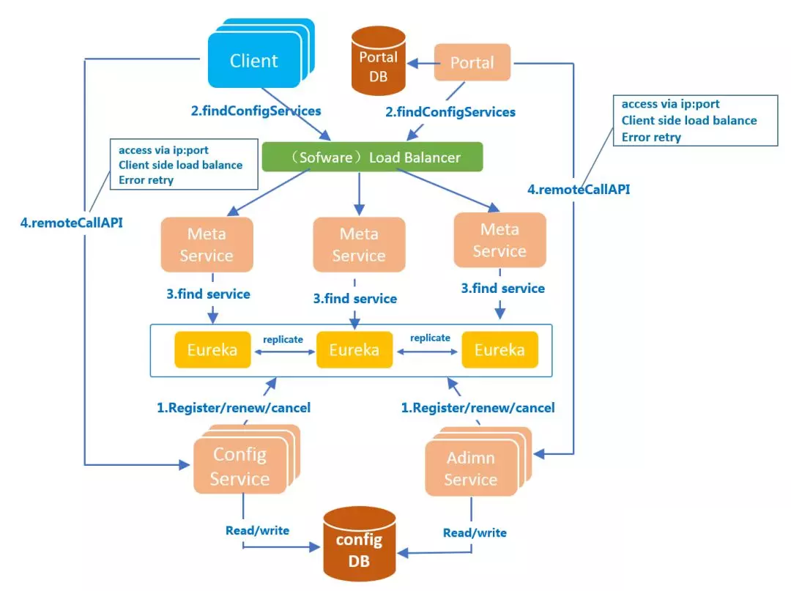
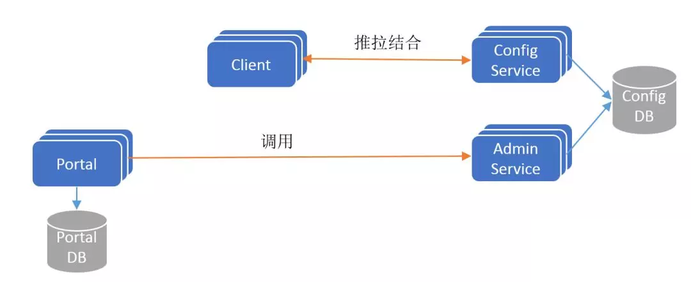

实验文档3：在kubernetes集群里集成Apollo配置中心

------

# 使用ConfigMap管理应用配置

## 拆分环境

| 主机名 | 角色                    | ip        |
| :----- | :---------------------- | :-------- |
| m1     | zk1.wzxmt.com(Test环境) | 10.0.0.31 |
| m2     | zk2.wzxmt.com(Prod环境) | 10.0.0.32 |

## 重配zookeeper

m1与2：

```bash
cat << EOF >/opt/zookeeper/zookeeper/conf/zoo.cfg
tickTime=2000
initLimit=10
syncLimit=5
dataDir=/data/zookeeper/data
dataLogDir=/data/zookeeper/logs
clientPort=2181
admin.serverPort=9099
EOF
```

停掉m3 zk

```bash
/opt/zookeeper/zookeeper/bin/zkServer.sh stop
```

重启m1与m2 zk(删除数据文件)

```bash
rm -fr /data/zookeeper/{data,logs}
/opt/zookeeper/bin/zkServer.sh restart && /opt/zookeeper/bin/zkServer.sh status
```

## 准备资源配置清单(dubbo-monitor)

在运维主机`HDSS7-200.host.com`上：

configmap

```yaml
cd /data/software/yaml/dubbo-monitor/
cat << EOF >cm.yaml
apiVersion: v1
kind: ConfigMap
metadata:
  name: dubbo-monitor-cm
  namespace: infra
data:
  dubbo.properties: |
    dubbo.container=log4j,spring,registry,jetty
    dubbo.application.name=simple-monitor
    dubbo.application.owner=
    dubbo.registry.address=zookeeper://zk1.wzxmt.com:2181
    dubbo.protocol.port=20880
    dubbo.jetty.port=8080
    dubbo.jetty.directory=/dubbo-monitor-simple/monitor
    dubbo.charts.directory=/dubbo-monitor-simple/charts
    dubbo.statistics.directory=/dubbo-monitor-simple/statistics
    dubbo.log4j.file=/dubbo-monitor-simple/logs/dubbo-monitor.log
    dubbo.log4j.level=WARN
EOF
```

Deployment

```yaml
cat << EOF >dp.yaml
kind: Deployment
apiVersion: apps/v1
metadata:
  name: dubbo-monitor
  namespace: infra
  labels: 
    name: dubbo-monitor
spec:
  replicas: 1
  selector:
    matchLabels: 
      name: dubbo-monitor
  template:
    metadata:
      labels: 
        app: dubbo-monitor
        name: dubbo-monitor
    spec:
      containers:
      - name: dubbo-monitor
        image: harbor.wzxmt.com/infra/dubbo-monitor:latest
        ports:
        - containerPort: 8080
          protocol: TCP
        - containerPort: 20880
          protocol: TCP
        imagePullPolicy: IfNotPresent
        volumeMounts:
          - name: configmap-volume
            mountPath: /dubbo-monitor-simple/conf
      volumes:
        - name: configmap-volume
          configMap:
            name: dubbo-monitor-cm
      imagePullSecrets:
      - name: harborlogin
      restartPolicy: Always
      terminationGracePeriodSeconds: 30
      securityContext: 
        runAsUser: 0
      schedulerName: default-scheduler
  strategy:
    type: RollingUpdate
    rollingUpdate: 
      maxUnavailable: 1
      maxSurge: 1
  revisionHistoryLimit: 7
  progressDeadlineSeconds: 600
EOF
```

## 应用资源配置清单

在任意一台k8s运算节点执行：

```bash
kubectl apply -f ./
```

## 重新发版，修改dubbo项目的配置文件

### 修改项目源代码

- duboo-demo-service

  ```bash
  dubbo-server/src/main/java/config.properties
  dubbo.registry=zookeeper://zk1.wzxmt.com:2181
  dubbo.port=28080
  ```

- dubbo-demo-web

  ```bash
  dubbo-client/src/main/java/config.properties
  dubbo.registry=zookeeper://zk1.wzxmt.com:2181
  ```

### 使用Jenkins进行CI

略

### 修改/应用资源配置清单

k8s的dashboard上，修改deployment使用的容器版本，提交应用

## 验证configmap的配置

在K8S的dashboard上，修改dubbo-monitor的configmap配置为不同的zk，重启POD，浏览器打开http://dubbo-monitor.wzxmt.com观察效果

# 交付Apollo至Kubernetes集群

## Apollo简介

Apollo（阿波罗）是携程框架部门研发的分布式配置中心，能够集中化管理应用不同环境、不同集群的配置，配置修改后能够实时推送到应用端，并且具备规范的权限、流程治理等特性，适用于微服务配置管理场景。

### 官方GitHub地址

[Apollo官方地址](https://github.com/ctripcorp/apollo)
[官方release包](https://github.com/ctripcorp/apollo/releases)
[官方启动脚本](https://github.com/ctripcorp/apollo/tree/master/scripts/apollo-on-kubernetes)

### 基础架构



### 简化模型



## 交付apollo-configservice

### 准备软件包

在运维主机上：
[下载官方release包](https://github.com/ctripcorp/apollo/releases/download/v1.6.1/apollo-configservice-1.6.1-github.zip)

```bash
mkdir -p apollo-configservice
unzip -o apollo-configservice-1.6.1-github.zip -d apollo-configservice
cd apollo-configservice
rm -f apollo-configservice-1.6.1-sources.jar
mv apollo-configservice-1.6.1.jar apollo-configservice.jar
```

### 执行数据库脚本

在数据库主机上：
**注意：**MySQL版本应为5.6或以上！

- 更新yum源

```bash
cat << EOF >/etc/yum.repos.d/MariaDB.repo
[mariadb]
name = MariaDB
baseurl = https://mirrors.ustc.edu.cn/mariadb/yum/10.1/centos7-amd64/
gpgkey=https://mirrors.ustc.edu.cn/mariadb/yum/RPM-GPG-KEY-MariaDB
gpgcheck=1
EOF
```

- 导入GPG-KEY

  ```bash
rpm --import https://mirrors.ustc.edu.cn/mariadb/yum/RPM-GPG-KEY-MariaDB
  ```
  
- 更新数据库版本

  ```bash
yum install MariaDB-server -y
  ```

[数据库脚本地址](https://github.com/ctripcorp/apollo/tree/master/scripts/sql)

### 导入数据

```bash
source ./apolloconfigdb.sql;
```

### 数据库用户授权

```bash
grant INSERT,DELETE,UPDATE,SELECT on ApolloConfigDB.* to "apolloconfig"@"%" identified by "admin123";
```

### 修改初始数据

```bash
update ApolloConfigDB.ServerConfig set ServerConfig.Value="http://config.wzxmt.com/eureka" where ServerConfig.Key="eureka.service.url";
#查询已修改数据
select * from ServerConfig where Id=1;
```

### 制作Docker镜像

在运维主机上：

- 更新startup.sh

  ```bash
cat << 'EOF' >scripts/startup.sh
  #!/bin/bash
  SERVICE_NAME=apollo-configservice
  ## Adjust log dir if necessary
  LOG_DIR=/apollo-configservice/logs
  ## Adjust server port if necessary
  SERVER_PORT=8080
  SERVER_URL="http://${APOLLO_CONFIG_SERVICE_NAME}:${SERVER_PORT}"
  
  ## Adjust memory settings if necessary
  #export JAVA_OPTS="-Xms6144m -Xmx6144m -Xss256k -XX:MetaspaceSize=128m -XX:MaxMetaspaceSize=384m -XX:NewSize=4096m -XX:MaxNewSize=4096m -XX:SurvivorRatio=8"
  
  ## Only uncomment the following when you are using server jvm
  #export JAVA_OPTS="$JAVA_OPTS -server -XX:-ReduceInitialCardMarks"
  
  ########### The following is the same for configservice, adminservice, portal ###########
  export JAVA_OPTS="$JAVA_OPTS -XX:ParallelGCThreads=4 -XX:MaxTenuringThreshold=9 -XX:+DisableExplicitGC -XX:+ScavengeBeforeFullGC -XX:SoftRefLRUPolicyMSPerMB=0 -XX:+ExplicitGCInvokesConcurrent -XX:+HeapDumpOnOutOfMemoryError -XX:-OmitStackTraceInFastThrow -Duser.timezone=Asia/Shanghai -Dclient.encoding.override=UTF-8 -Dfile.encoding=UTF-8 -Djava.security.egd=file:/dev/./urandom"
  export JAVA_OPTS="$JAVA_OPTS -Dserver.port=$SERVER_PORT -Dlogging.file=$LOG_DIR/$SERVICE_NAME.log -XX:HeapDumpPath=$LOG_DIR/HeapDumpOnOutOfMemoryError/"
  
  # Find Java
  if [[ -n "$JAVA_HOME" ]] && [[ -x "$JAVA_HOME/bin/java" ]]; then
      javaexe="$JAVA_HOME/bin/java"
  elif type -p java > /dev/null 2>&1; then
      javaexe=$(type -p java)
  elif [[ -x "/usr/bin/java" ]];  then
      javaexe="/usr/bin/java"
  else
      echo "Unable to find Java"
      exit 1
  fi
  
  if [[ "$javaexe" ]]; then
      version=$("$javaexe" -version 2>&1 | awk -F '"' '/version/ {print $2}')
      version=$(echo "$version" | awk -F. '{printf("%03d%03d",$1,$2);}')
      # now version is of format 009003 (9.3.x)
      if [ $version -ge 011000 ]; then
          JAVA_OPTS="$JAVA_OPTS -Xlog:gc*:$LOG_DIR/gc.log:time,level,tags -Xlog:safepoint -Xlog:gc+heap=trace"
      elif [ $version -ge 010000 ]; then
          JAVA_OPTS="$JAVA_OPTS -Xlog:gc*:$LOG_DIR/gc.log:time,level,tags -Xlog:safepoint -Xlog:gc+heap=trace"
      elif [ $version -ge 009000 ]; then
          JAVA_OPTS="$JAVA_OPTS -Xlog:gc*:$LOG_DIR/gc.log:time,level,tags -Xlog:safepoint -Xlog:gc+heap=trace"
      else
          JAVA_OPTS="$JAVA_OPTS -XX:+UseParNewGC"
          JAVA_OPTS="$JAVA_OPTS -Xloggc:$LOG_DIR/gc.log -XX:+PrintGCDetails"
          JAVA_OPTS="$JAVA_OPTS -XX:+UseConcMarkSweepGC -XX:+UseCMSCompactAtFullCollection -XX:+UseCMSInitiatingOccupancyOnly -XX:CMSInitiatingOccupancyFraction=60 -XX:+CMSClassUnloadingEnabled -XX:+CMSParallelRemarkEnabled -XX:CMSFullGCsBeforeCompaction=9 -XX:+CMSClassUnloadingEnabled  -XX:+PrintGCDateStamps -XX:+PrintGCApplicationConcurrentTime -XX:+PrintHeapAtGC -XX:+UseGCLogFileRotation -XX:NumberOfGCLogFiles=5 -XX:GCLogFileSize=5M"
      fi
  fi
  
  printf "$(date) ==== Starting ==== \n"
  
  cd `dirname $0`/..
  chmod 755 $SERVICE_NAME".jar"
  ./$SERVICE_NAME".jar" start
  
  rc=$?;
  
  if [[ $rc != 0 ]];
  then
      echo "$(date) Failed to start $SERVICE_NAME.jar, return code: $rc"
      exit $rc;
  fi
  
  tail -f /dev/null
  EOF
  ```
  
- 写Dockerfile

  ```bash
  cat << 'EOF' >Dockerfile
  FROM openjdk:8-jre-alpine3.8
  RUN \
      echo "http://mirrors.aliyun.com/alpine/v3.8/main" > /etc/apk/repositories && \
      echo "http://mirrors.aliyun.com/alpine/v3.8/community" >> /etc/apk/repositories && \
      apk update upgrade && \
      apk add --no-cache procps curl bash tzdata && \
      ln -sf /usr/share/zoneinfo/Asia/Shanghai /etc/localtime && \
      echo "Asia/Shanghai" > /etc/timezone && \
      mkdir -p /apollo-configservice
  ADD . /apollo-configservice
  ENV APOLLO_CONFIG_SERVICE_NAME="config.wzxmt.com"
  EXPOSE 8080
  CMD ["/apollo-configservice/scripts/startup.sh"]
  EOF
  ```
  
- 制作镜像并推送

  ```bash
docker build . -t harbor.wzxmt.com/infra/apollo-configservice:v1.6.1
  docker push harbor.wzxmt.com/infra/apollo-configservice:v1.6.1
  ```

### 解析域名

DNS主机上：

```bash
mysql   60 IN A 10.0.0.20
config	60 IN A 10.0.0.50
```

### 准备资源配置清单

在运维主机上

```bash
mkdir /data/software/yaml/apollo-configservice 
cd /data/software/yaml/apollo-configservice
```

deployment

```yaml
cat << EOF >dp.yaml
kind: Deployment
apiVersion: apps/v1
metadata:
  name: apollo-configservice
  namespace: infra
  labels: 
    name: apollo-configservice
spec:
  replicas: 1
  selector:
    matchLabels: 
      name: apollo-configservice
  template:
    metadata:
      labels: 
        app: apollo-configservice 
        name: apollo-configservice
    spec:
      volumes:
      - name: configmap-volume
        configMap:
          name: apollo-configservice-cm
      containers:
      - name: apollo-configservice
        image: harbor.wzxmt.com/infra/apollo-configservice:v1.6.1
        ports:
        - containerPort: 8080
          protocol: TCP
        volumeMounts:
        - name: configmap-volume
          mountPath: /apollo-configservice/config
        terminationMessagePath: /dev/termination-log
        terminationMessagePolicy: File
        imagePullPolicy: IfNotPresent
      imagePullSecrets:
      - name: harborlogin
      restartPolicy: Always
      terminationGracePeriodSeconds: 30
      securityContext: 
        runAsUser: 0
      schedulerName: default-scheduler
  strategy:
    type: RollingUpdate
    rollingUpdate: 
      maxUnavailable: 1
      maxSurge: 1
  revisionHistoryLimit: 7
  progressDeadlineSeconds: 600
EOF
```

Service

```yaml
cat << EOF >svc.yaml
kind: Service
apiVersion: v1
metadata: 
  name: apollo-configservice
  namespace: infra
spec:
  ports:
  - protocol: TCP
    port: 8080
    targetPort: 8080
  selector: 
    app: apollo-configservice
  clusterIP: None
  type: ClusterIP
  sessionAffinity: None
EOF
```

Ingress

```yaml
cat << EOF >ingress.yaml
apiVersion: extensions/v1beta1
kind: Ingress
metadata:  
  name: apollo-configservice
  namespace: infra
  annotations:
    traefik.ingress.kubernetes.io/router.entrypoints: web
spec:  
  rules:    
    - host: config.wzxmt.com     
      http:        
        paths:        
        - path: /          
          backend:            
            serviceName: apollo-configservice            
            servicePort: 8080
EOF
```

ConfigMap

```yaml
cat << EOF >cm.yaml
apiVersion: v1
kind: ConfigMap
metadata:
  name: apollo-configservice-cm
  namespace: infra
data:
  application-github.properties: |
    # DataSource
    spring.datasource.url = jdbc:mysql://mysql.wzxmt.com:3306/ApolloConfigDB?characterEncoding=utf8mb4
    spring.datasource.username = apolloconfig
    spring.datasource.password = admin123
    eureka.service.url = http://config.wzxmt.com/eureka
  app.properties: |
    appId=100003171
EOF
```

### 应用资源配置清单

在任意一台k8s运算节点执行：

```bash
kubectl apply -f ./
```

### 浏览器访问

[http://config.wzxmt.com](http://config.wzxmt.com/)

## 交付apollo-adminservice

### 准备软件包

在运维主机上：
[下载官方release包](https://github.com/ctripcorp/apollo/releases/download/v1.6.1/apollo-adminservice-1.6.1-github.zip)

```bash
mkdir apollo-adminservice -p
unzip -o apollo-adminservice-1.6.1-github.zip -d apollo-adminservice
cd apollo-adminservice
rm -f  apollo-adminservice-1.6.1-sources.jar
mv apollo-adminservice-1.6.1.jar apollo-adminservice.jar
```

### 制作Docker镜像

在运维主机上：

- 更新starup.sh

  ```bash
cat << 'EOF' >scripts/startup.sh
  #!/bin/bash
  SERVICE_NAME=apollo-adminservice
  ## Adjust log dir if necessary
  LOG_DIR=/apollo-adminservice/logs
  ## Adjust server port if necessary
  SERVER_PORT=8080
  APOLLO_ADMIN_SERVICE_NAME=$(hostname -i)
  # SERVER_URL="http://localhost:${SERVER_PORT}"
  SERVER_URL="http://${APOLLO_ADMIN_SERVICE_NAME}:${SERVER_PORT}"
  
  ## Adjust memory settings if necessary
  #export JAVA_OPTS="-Xms2560m -Xmx2560m -Xss256k -XX:MetaspaceSize=128m -XX:MaxMetaspaceSize=384m -XX:NewSize=1536m -XX:MaxNewSize=1536m -XX:SurvivorRatio=8"
  
  ## Only uncomment the following when you are using server jvm
  #export JAVA_OPTS="$JAVA_OPTS -server -XX:-ReduceInitialCardMarks"
  
  ########### The following is the same for configservice, adminservice, portal ###########
  export JAVA_OPTS="$JAVA_OPTS -XX:ParallelGCThreads=4 -XX:MaxTenuringThreshold=9 -XX:+DisableExplicitGC -XX:+ScavengeBeforeFullGC -XX:SoftRefLRUPolicyMSPerMB=0 -XX:+ExplicitGCInvokesConcurrent -XX:+HeapDumpOnOutOfMemoryError -XX:-OmitStackTraceInFastThrow -Duser.timezone=Asia/Shanghai -Dclient.encoding.override=UTF-8 -Dfile.encoding=UTF-8 -Djava.security.egd=file:/dev/./urandom"
  export JAVA_OPTS="$JAVA_OPTS -Dserver.port=$SERVER_PORT -Dlogging.file=$LOG_DIR/$SERVICE_NAME.log -XX:HeapDumpPath=$LOG_DIR/HeapDumpOnOutOfMemoryError/"
  
  # Find Java
  if [[ -n "$JAVA_HOME" ]] && [[ -x "$JAVA_HOME/bin/java" ]]; then
      javaexe="$JAVA_HOME/bin/java"
  elif type -p java > /dev/null 2>&1; then
      javaexe=$(type -p java)
  elif [[ -x "/usr/bin/java" ]];  then
      javaexe="/usr/bin/java"
  else
      echo "Unable to find Java"
      exit 1
  fi
  
  if [[ "$javaexe" ]]; then
      version=$("$javaexe" -version 2>&1 | awk -F '"' '/version/ {print $2}')
      version=$(echo "$version" | awk -F. '{printf("%03d%03d",$1,$2);}')
      # now version is of format 009003 (9.3.x)
      if [ $version -ge 011000 ]; then
          JAVA_OPTS="$JAVA_OPTS -Xlog:gc*:$LOG_DIR/gc.log:time,level,tags -Xlog:safepoint -Xlog:gc+heap=trace"
      elif [ $version -ge 010000 ]; then
          JAVA_OPTS="$JAVA_OPTS -Xlog:gc*:$LOG_DIR/gc.log:time,level,tags -Xlog:safepoint -Xlog:gc+heap=trace"
      elif [ $version -ge 009000 ]; then
          JAVA_OPTS="$JAVA_OPTS -Xlog:gc*:$LOG_DIR/gc.log:time,level,tags -Xlog:safepoint -Xlog:gc+heap=trace"
      else
          JAVA_OPTS="$JAVA_OPTS -XX:+UseParNewGC"
          JAVA_OPTS="$JAVA_OPTS -Xloggc:$LOG_DIR/gc.log -XX:+PrintGCDetails"
          JAVA_OPTS="$JAVA_OPTS -XX:+UseConcMarkSweepGC -XX:+UseCMSCompactAtFullCollection -XX:+UseCMSInitiatingOccupancyOnly -XX:CMSInitiatingOccupancyFraction=60 -XX:+CMSClassUnloadingEnabled -XX:+CMSParallelRemarkEnabled -XX:CMSFullGCsBeforeCompaction=9 -XX:+CMSClassUnloadingEnabled  -XX:+PrintGCDateStamps -XX:+PrintGCApplicationConcurrentTime -XX:+PrintHeapAtGC -XX:+UseGCLogFileRotation -XX:NumberOfGCLogFiles=5 -XX:GCLogFileSize=5M"
      fi
  fi
  
  printf "$(date) ==== Starting ==== \n"
  
  cd `dirname $0`/..
  chmod 755 $SERVICE_NAME".jar"
  ./$SERVICE_NAME".jar" start
  
  rc=$?;
  
  if [[ $rc != 0 ]];
  then
      echo "$(date) Failed to start $SERVICE_NAME.jar, return code: $rc"
      exit $rc;
  fi
  
  tail -f /dev/null
  EOF
  ```
  
- 写Dockerfile

  ```bash
  cat << 'EOF' >Dockerfile
  FROM openjdk:8-jre-alpine3.8
  RUN \
      echo "http://mirrors.aliyun.com/alpine/v3.8/main" > /etc/apk/repositories && \
      echo "http://mirrors.aliyun.com/alpine/v3.8/community" >> /etc/apk/repositories && \
      apk update upgrade && \
      apk add --no-cache procps curl bash tzdata && \
      ln -sf /usr/share/zoneinfo/Asia/Shanghai /etc/localtime && \
      echo "Asia/Shanghai" > /etc/timezone && \
      mkdir -p /apollo-adminservice
  ADD . /apollo-adminservice/
  ENV APOLLO_ADMIN_SERVICE_NAME="config.wzxmt.com"
  EXPOSE 8090
  CMD ["/apollo-adminservice/scripts/startup.sh"]
  EOF
  ```

- 制作镜像并推送

  ```bash
docker build . -t harbor.wzxmt.com/infra/apollo-adminservice:v1.6.1
  docker push harbor.wzxmt.com/infra/apollo-adminservice:v1.6.1
  ```

### 准备资源配置清单

在运维主机上

```bash
mkdir apollo-adminservice
cd apollo-adminservice
```

deployment

```yaml
cat << 'EOF' >dp.yaml
kind: Deployment
apiVersion: apps/v1
metadata:
  name: apollo-adminservice
  namespace: infra
  labels: 
    name: apollo-adminservice
spec:
  replicas: 1
  selector:
    matchLabels: 
      name: apollo-adminservice
  template:
    metadata:
      labels: 
        app: apollo-adminservice 
        name: apollo-adminservice
    spec:
      volumes:
      - name: configmap-volume
        configMap:
          name: apollo-adminservice-cm
      containers:
      - name: apollo-adminservice
        image: harbor.wzxmt.com/infra/apollo-adminservice:v1.6.1
        ports:
        - containerPort: 8090
          protocol: TCP
        volumeMounts:
        - name: configmap-volume
          mountPath: /apollo-adminservice/config
        terminationMessagePath: /dev/termination-log
        terminationMessagePolicy: File
        imagePullPolicy: IfNotPresent
      imagePullSecrets:
      - name: harborlogin
      restartPolicy: Always
      terminationGracePeriodSeconds: 30
      securityContext: 
        runAsUser: 0
      schedulerName: default-scheduler
  strategy:
    type: RollingUpdate
    rollingUpdate: 
      maxUnavailable: 1
      maxSurge: 1
  revisionHistoryLimit: 7
  progressDeadlineSeconds: 600
EOF
```

ConfigMap

```yaml
cat << 'EOF' >cm.yaml
apiVersion: v1
kind: ConfigMap
metadata:
  name: apollo-adminservice-cm
  namespace: infra
data:
  application-github.properties: |
    # DataSource
    spring.datasource.url = jdbc:mysql://mysql.wzxmt.com:3306/ApolloConfigDB?characterEncoding=utf8
    spring.datasource.username = apolloconfig
    spring.datasource.password = admin123
    eureka.service.url = http://config.wzxmt.com/eureka
  app.properties: |
    appId=100003172
EOF
```

### 应用资源配置清单

在任意一台k8s运算节点执行：

```
kubectl apply -f ./
```

### 浏览器访问

[http://config.wzxmt.com](http://config.wzxmt.com/)


## 交付apollo-portal

### 准备软件包

在运维主机上：
[下载官方release包](https://github.com/ctripcorp/apollo/releases/download/v1.6.1/apollo-portal-1.6.1-github.zip)

```bash
mkdir apollo-portal
unzip -o apollo-portal-1.6.1-github.zip -d apollo-portal
cd apollo-portal
rm -f apollo-portal-1.6.1-sources.jar
mv apollo-portal-1.6.1.jar  apollo-portal.jar
```

### 执行数据库脚本

在数据库主机上：
[数据库脚本地址](https://github.com/ctripcorp/apollo/blob/master/scripts/sql/apolloportaldb.sql)

```
source ./apolloportal.sql
```

### 数据库用户授权

```
grant INSERT,DELETE,UPDATE,SELECT on ApolloPortalDB.* to "apolloportal"@"%" identified by "admin123";
```

### 修改样板

```
update ServerConfig set Value='[{"orgId":"wzxmt01","orgName":"开发部门"},{"orgId":"wzxmt02","orgName":"测试部门"},{"orgId":"wzxmt03","orgName":"客户部门"}]' where Id=2;
```

### 制作Docker镜像

在运维主机上：

- 更新starup.sh

  ```bash
cat << 'EOF' >scripts/startup.sh
  #!/bin/bash
  SERVICE_NAME=apollo-portal
  ## Adjust log dir if necessary
  LOG_DIR=/apollo-portal/logs
  ## Adjust server port if necessary
  SERVER_PORT=8070
  
  # SERVER_URL="http://localhost:$SERVER_PORT"
  SERVER_URL="http://${APOLLO_PORTAL_SERVICE_NAME}:${SERVER_PORT}"
  
  ## Adjust memory settings if necessary
  #export JAVA_OPTS="-Xms2560m -Xmx2560m -Xss256k -XX:MetaspaceSize=128m -XX:MaxMetaspaceSize=384m -XX:NewSize=1536m -XX:MaxNewSize=1536m -XX:SurvivorRatio=8"
  
  ## Only uncomment the following when you are using server jvm
  #export JAVA_OPTS="$JAVA_OPTS -server -XX:-ReduceInitialCardMarks"
  
  ########### The following is the same for configservice, adminservice, portal ###########
  export JAVA_OPTS="$JAVA_OPTS -XX:ParallelGCThreads=4 -XX:MaxTenuringThreshold=9 -XX:+DisableExplicitGC -XX:+ScavengeBeforeFullGC -XX:SoftRefLRUPolicyMSPerMB=0 -XX:+ExplicitGCInvokesConcurrent -XX:+HeapDumpOnOutOfMemoryError -XX:-OmitStackTraceInFastThrow -Duser.timezone=Asia/Shanghai -Dclient.encoding.override=UTF-8 -Dfile.encoding=UTF-8 -Djava.security.egd=file:/dev/./urandom"
  export JAVA_OPTS="$JAVA_OPTS -Dserver.port=$SERVER_PORT -Dlogging.file=$LOG_DIR/$SERVICE_NAME.log -XX:HeapDumpPath=$LOG_DIR/HeapDumpOnOutOfMemoryError/"
  
  # Find Java
  if [[ -n "$JAVA_HOME" ]] && [[ -x "$JAVA_HOME/bin/java" ]]; then
      javaexe="$JAVA_HOME/bin/java"
  elif type -p java > /dev/null 2>&1; then
      javaexe=$(type -p java)
  elif [[ -x "/usr/bin/java" ]];  then
      javaexe="/usr/bin/java"
  else
      echo "Unable to find Java"
      exit 1
  fi
  
  if [[ "$javaexe" ]]; then
      version=$("$javaexe" -version 2>&1 | awk -F '"' '/version/ {print $2}')
      version=$(echo "$version" | awk -F. '{printf("%03d%03d",$1,$2);}')
      # now version is of format 009003 (9.3.x)
      if [ $version -ge 011000 ]; then
          JAVA_OPTS="$JAVA_OPTS -Xlog:gc*:$LOG_DIR/gc.log:time,level,tags -Xlog:safepoint -Xlog:gc+heap=trace"
      elif [ $version -ge 010000 ]; then
          JAVA_OPTS="$JAVA_OPTS -Xlog:gc*:$LOG_DIR/gc.log:time,level,tags -Xlog:safepoint -Xlog:gc+heap=trace"
      elif [ $version -ge 009000 ]; then
          JAVA_OPTS="$JAVA_OPTS -Xlog:gc*:$LOG_DIR/gc.log:time,level,tags -Xlog:safepoint -Xlog:gc+heap=trace"
      else
          JAVA_OPTS="$JAVA_OPTS -XX:+UseParNewGC"
          JAVA_OPTS="$JAVA_OPTS -Xloggc:$LOG_DIR/gc.log -XX:+PrintGCDetails"
          JAVA_OPTS="$JAVA_OPTS -XX:+UseConcMarkSweepGC -XX:+UseCMSCompactAtFullCollection -XX:+UseCMSInitiatingOccupancyOnly -XX:CMSInitiatingOccupancyFraction=60 -XX:+CMSClassUnloadingEnabled -XX:+CMSParallelRemarkEnabled -XX:CMSFullGCsBeforeCompaction=9 -XX:+CMSClassUnloadingEnabled  -XX:+PrintGCDateStamps -XX:+PrintGCApplicationConcurrentTime -XX:+PrintHeapAtGC -XX:+UseGCLogFileRotation -XX:NumberOfGCLogFiles=5 -XX:GCLogFileSize=5M"
      fi
  fi
  
  printf "$(date) ==== Starting ==== \n"
  
  cd `dirname $0`/..
  chmod 755 $SERVICE_NAME".jar"
  ./$SERVICE_NAME".jar" start
  
  rc=$?;
  
  if [[ $rc != 0 ]];
  then
      echo "$(date) Failed to start $SERVICE_NAME.jar, return code: $rc"
      exit $rc;
  fi
  
  tail -f /dev/null
  EOF
  ```
  
- 写Dockerfile

```bash
cat << 'EOF' >Dockerfile
FROM openjdk:8-jre-alpine3.8
RUN \
    echo "http://mirrors.aliyun.com/alpine/v3.8/main" > /etc/apk/repositories && \
    echo "http://mirrors.aliyun.com/alpine/v3.8/community" >> /etc/apk/repositories  && \
    apk update upgrade && \
    apk add --no-cache procps curl bash tzdata && \
    ln -sf /usr/share/zoneinfo/Asia/Shanghai /etc/localtime && \
    echo "Asia/Shanghai" > /etc/timezone && \
    mkdir -p /apollo-portal

ADD . /apollo-portal/
ENV APOLLO_PORTAL_SERVICE_NAME="portal.wzxmt.com"
EXPOSE 8070
CMD ["/apollo-portal/scripts/startup.sh"]
EOF
```

- 制作镜像并推送

```bash
docker build . -t harbor.wzxmt.com/infra/apollo-portal:v1.6.1
docker push harbor.wzxmt.com/infra/apollo-portal:v1.6.1
```

### 解析域名

DNS主机上：

```bash
portal	60 IN A 10.0.0.50
```

### 准备资源配置清单

在运维主机`HDSS7-200.host.com`上

```bash
mkdir /data/software/yaml/apollo-portal
cd /data/software/yaml/apollo-portal
```

deployment

```yaml
cat << 'EOF' >dp.yaml
kind: Deployment
apiVersion: apps/v1
metadata:
  name: apollo-portal
  namespace: infra
  labels: 
    name: apollo-portal
spec:
  replicas: 1
  selector:
    matchLabels: 
      name: apollo-portal
  template:
    metadata:
      labels: 
        app: apollo-portal 
        name: apollo-portal
    spec:
      volumes:
      - name: configmap-volume
        configMap:
          name: apollo-portal-cm
      containers:
      - name: apollo-portal
        image: harbor.wzxmt.com/infra/apollo-portal:v1.6.1
        ports:
        - containerPort: 8070
          protocol: TCP
        volumeMounts:
        - name: configmap-volume
          mountPath: /apollo-portal/config
        terminationMessagePath: /dev/termination-log
        terminationMessagePolicy: File
        imagePullPolicy: IfNotPresent
      imagePullSecrets:
      - name: harborlogin
      restartPolicy: Always
      terminationGracePeriodSeconds: 30
      securityContext: 
        runAsUser: 0
      schedulerName: default-scheduler
  strategy:
    type: RollingUpdate
    rollingUpdate: 
      maxUnavailable: 1
      maxSurge: 1
  revisionHistoryLimit: 7
  progressDeadlineSeconds: 600
EOF
```

Service

```yaml
cat << 'EOF' >svc.yaml
kind: Service
apiVersion: v1
metadata: 
  name: apollo-portal
  namespace: infra
spec:
  ports:
  - protocol: TCP
    port: 8070
    targetPort: 8070
  selector: 
    app: apollo-portal
  clusterIP: None
  type: ClusterIP
  sessionAffinity: None
EOF
```

ingress

```yaml
cat << EOF >ingress.yaml
apiVersion: extensions/v1beta1
kind: Ingress
metadata:  
  name: apollo-portal
  namespace: infra
  annotations:
    traefik.ingress.kubernetes.io/router.entrypoints: web
spec:  
  rules:    
    - host: portal.wzxmt.com     
      http:        
        paths:        
        - path: /          
          backend:            
            serviceName: apollo-portal            
            servicePort: 8070
EOF
```

ConfigMap

```yaml
cat << 'EOF' >cm.yaml
apiVersion: v1
kind: ConfigMap
metadata:
  name: apollo-portal-cm
  namespace: infra
data:
  application-github.properties: |
    # DataSource
    spring.datasource.url = jdbc:mysql://mysql.wzxmt.com:3306/ApolloPortalDB?characterEncoding=utf8
    spring.datasource.username = apolloportal
    spring.datasource.password = admin123
  app.properties: |
    appId=100003173
  apollo-env.properties: |
    dev.meta=http://config.wzxmt.com
EOF
```

### 应用资源配置清单

在任意一台k8s运算节点执行：

```bash
kubectl apply -f http://harbor.wzxmt.com/yaml/apollo-portal/cm.yaml
kubectl apply -f http://harbor.wzxmt.com/yaml/apollo-portal/dp.yaml
kubectl apply -f http://harbor.wzxmt.com/yaml/apollo-portal/svc.yaml
kubectl apply -f http://harbor.wzxmt.com/yaml/apollo-portal/ingress.yaml
```

### 浏览器访问

[http://portal.wzxmt.com](http://portal.wzxmt.com/)

- 用户名：apollo
- 密码： admin


### 创建项目


# 实战dubbo微服务接入Apollo配置中心

## 改造dubbo-demo-service项目

### 使用IDE拉取项目（这里使用git bash作为范例）

```bash
git clone https://gitee.com/wzxmt/dubbo-demo-service.git
```

### 切到apollo分支

```bash
cd dubbo-demo-service
git checkout -b apollo
```

### 修改pom.xml

- 加入apollo客户端jar包的依赖

```
dubbo-server/pom.xml
<dependency>
  <groupId>com.ctrip.framework.apollo</groupId>
  <artifactId>apollo-client</artifactId>
  <version>1.1.0</version>
</dependency>
```

- 修改resource段

```
dubbo-server/pom.xml
<resource>
  <directory>src/main/resources</directory>
  <includes>
  <include>**/*</include>
  </includes>
  <filtering>false</filtering>
</resource>
```

### 增加resources目录

```
/d/workspace/dubbo-demo-service/dubbo-server/src/main
$ mkdir -pv resources/META-INF
mkdir: created directory 'resources'
mkdir: created directory 'resources/META-INF'
```

### 修改config.properties文件

```
/d/workspace/dubbo-demo-service/dubbo-server/src/main/resources/config.properties
dubbo.registry=${dubbo.registry}
dubbo.port=${dubbo.port}
```

### 修改srping-config.xml文件

- beans段新增属性

```
/d/workspace/dubbo-demo-service/dubbo-server/src/main/resources/spring-config.xml
xmlns:apollo="http://www.ctrip.com/schema/apollo"
```

- xsi:schemaLocation段内新增属性

```
/d/workspace/dubbo-demo-service/dubbo-server/src/main/resources/spring-config.xml
http://www.ctrip.com/schema/apollo http://www.ctrip.com/schema/apollo.xsd
```

- 新增配置项

```
/d/workspace/dubbo-demo-service/dubbo-server/src/main/resources/spring-config.xml
<apollo:config/>
```

- 删除配置项（注释）

```
/d/workspace/dubbo-demo-service/dubbo-server/src/main/resources/spring-config.xml
<!-- <context:property-placeholder location="classpath:config.properties"/> -->
```

### 增加app.properties文件

```
/d/workspace/dubbo-demo-service/dubbo-server/src/main/resources/META-INF/app.properties
app.id=dubbo-demo-service
```

### 提交git中心仓库（gitee）

```
git push origin apollo
```

## 配置apollo-portal

### 创建项目

- 部门

  > wzxmt01

- **应用id**

  > dubbo-demo-service

- 应用名称

  > dubbo服务提供者

- 应用负责人

  > apollo|apollo

- 项目管理员

  > apollo|apollo

**提交**

### 进入配置页面

#### 新增配置项1

- Key

  > dubbo.registry

- Value

  > zookeeper://zk1.wzxmt.com:2181

- 选择集群

  > DEV

**提交**

#### 新增配置项2

- Key

  > dubbo.port

- Value

  > 20880

- 选择集群

  > DEV

**提交**

### 发布配置

点击**发布**，配置生效


## 使用jenkins进行CI

依次填入/选择：

- app_name

  > dubbo-demo-service

- image_name

  > app/dubbo-demo-service

- git_repo

  > https://gitee.com/wzxmt/dubbo-demo-service.git

- git_ver

  > apollo

- add_tag

  > 200531_2130

- mvn_dir

  > /

- target_dir

  > ./dubbo-server/target

- mvn_cmd

  > mvn clean package -Dmaven.test.skip=true

- base_image

  > base/jre8:8u112

- maven

  > 3.6.0-8u181

点击`Build`进行构建，等待构建完成。

## 上线新构建的项目

### 准备资源配置清单

运维主机上：

```yaml
cd /data/software/yaml/dubbo-demo-service
cat << 'EOF' >dp.yaml
kind: Deployment
apiVersion: apps/v1
metadata:
  name: dubbo-demo-service
  namespace: app
  labels: 
    name: dubbo-demo-service
spec:
  replicas: 1
  selector:
    matchLabels: 
      name: dubbo-demo-service
  template:
    metadata:
      labels: 
        app: dubbo-demo-service
        name: dubbo-demo-service
    spec:
      containers:
      - name: dubbo-demo-service
        image: harbor.wzxmt.com/app/dubbo-demo-service:apollo_200531_2130
        ports:
        - containerPort: 20880
          protocol: TCP
        env:
        - name: C_OPTS
          value: -Denv=dev -Dapollo.meta=http://config.wzxmt.com
        - name: JAR_BALL
          value: dubbo-server.jar
        imagePullPolicy: Always
      imagePullSecrets:
      - name: harborlogin
      restartPolicy: Always
      terminationGracePeriodSeconds: 30
      securityContext: 
        runAsUser: 0
      schedulerName: default-scheduler
  strategy:
    type: RollingUpdate
    rollingUpdate: 
      maxUnavailable: 1
      maxSurge: 1
  revisionHistoryLimit: 7
  progressDeadlineSeconds: 600
EOF
```

**注意：**增加了env段配置
**注意：**docker镜像新版的tag

### 应用资源配置清单

在任意一台k8s运算节点上执行：

```
kubectl apply -f http://k8s-yaml.od.com/dubbo-demo-service/deployment.yaml
```

### 观察项目运行情况

[http://dubbo-monitor.wzxmt.com](http://dubbo-monitor.wzxmt.com/)

## 改造dubbo-demo-web

略

## 配置apollo-portal

### 创建项目

- 部门

  > wzxmt01

- **应用id**

  > dubbo-demo-web

- 应用名称

  > dubbo服务消费者

- 应用负责人

  > apollo|apollo

- 项目管理员

  > apollo|apollo

**提交**

### 进入配置页面

#### 新增配置项1

- Key

  > dubbo.registry

- Value

  > zookeeper://zk1.wzxmt.com:2181

- 选择集群

  > DEV

**提交**

### 发布配置

点击**发布**，配置生效

## 使用jenkins进行CI

依次填入/选择：

- app_name

  > dubbo-demo-consumer

- image_name

  > app/dubbo-demo-consumer

- git_repo

  > https://gitee.com/wzxmt/dubbo-demo-web.git

- git_ver

  > apollo

- add_tag

  > 200531_2350

- mvn_dir

  > ./

- target_dir

  > ./dubbo-client/target

- mvn_cmd

  > mvn clean package -Dmaven.test.skip=true

- base_image

  > base/jre8:8u112

- maven

  > 3.6.0-8u181

点击`Build`进行构建，等待构建完成。

## 上线新构建的项目

### 准备资源配置清单

运维主机上：

```yaml
cd /data/software/yaml/dubbo-demo-consumer/
cat << 'EOF' >dp.yaml
kind: Deployment
apiVersion: apps/v1
metadata:
  name: dubbo-demo-consumer
  namespace: app
  labels: 
    name: dubbo-demo-consumer
spec:
  replicas: 1
  selector:
    matchLabels: 
      name: dubbo-demo-consumer
  template:
    metadata:
      labels: 
        app: dubbo-demo-consumer
        name: dubbo-demo-consumer
    spec:
      containers:
      - name: dubbo-demo-consumer
        image: harbor.wzxmt.com/app/dubbo-demo-consumer:apollo_200531_2350
        ports:
        - containerPort: 20880
          protocol: TCP
        - containerPort: 8080
          protocol: TCP
        env:
        - name: C_OPTS
          value: -Denv=dev -Dapollo.meta=http://config.wzxmt.com
        - name: JAR_BALL
          value: dubbo-client.jar
        imagePullPolicy: Always
      imagePullSecrets:
      - name: harborlogin
      restartPolicy: Always
      terminationGracePeriodSeconds: 30
      securityContext: 
        runAsUser: 0
      schedulerName: default-scheduler
  strategy:
    type: RollingUpdate
    rollingUpdate: 
      maxUnavailable: 1
      maxSurge: 1
  revisionHistoryLimit: 7
  progressDeadlineSeconds: 600
EOF
```

**注意：**增加了env段配置
**注意：**docker镜像新版的tag

### 应用资源配置清单

在任意一台k8s运算节点上执行：

```bash
kubectl apply -f http://harbor.wzxmt.com/yaml/dubbo-demo-consumer/dp.yaml
```

## 通过Apollo配置中心动态维护项目的配置

以dubbo-demo-service项目为例，不用修改代码

- 在[http://portal.wzxmt.com](http://portal.wzxmt.com/) 里修改dubbo.port配置项
- 重启dubbo-demo-service项目
- 配置生效

# 实战维护多套dubbo微服务环境

## 生产实践

1. 迭代新需求/修复BUG（编码->提GIT）
2. 测试环境发版，测试（应用通过编译打包发布至TEST命名空间）
3. 测试通过，上线（应用镜像直接发布至PROD命名空间）

## 系统架构

- 物理架构

| 主机名 | 角色                               | ip        |
| :----- | :--------------------------------- | :-------- |
| m1     | zk-test(测试环境Test)              | 10.0.0.31 |
| m2     | zk-prod(生产环境Prod)              | 10.0.0.32 |
| n1     | kubernetes运算节点                 | 10.0.0.41 |
| n2     | kubernetes运算节点                 | 10.0.0.42 |
| manege | 运维主机，harbor仓库，mysql，named | 10.0.0.20 |

- K8S内系统架构

| 环境             | 命名空间 | 应用                                  |
| :--------------- | :------- | :------------------------------------ |
| 测试环境（TEST） | test     | apollo-config，apollo-admin           |
| 测试环境（TEST） | test     | dubbo-demo-service，dubbo-demo-web    |
| 生产环境（PROD） | prod     | apollo-config，apollo-admin           |
| 生产环境（PROD） | prod     | dubbo-demo-service，dubbo-demo-web    |
| ops环境（infra） | infra    | jenkins，dubbo-monitor，apollo-portal |

## 修改/添加域名解析

DNS主机上：

```bash
zk-test     60 IN A 10.0.0.31
zk-prod     60 IN A 10.0.0.32
config-test	60 IN A 10.0.0.50
config-prod	60 IN A 10.0.0.50
demo-test   60 IN A 10.0.0.50
demo-prod   60 IN A 10.0.0.50
```

## Apollo的k8s应用配置

修改apolloconfig.sql的数据库为ApolloConfigTestDB

```bash
source ./apolloconfig.sql
update ApolloConfigTestDB.ServerConfig set ServerConfig.Value="http://config-test.wzxmt.com/eureka" where ServerConfig.Key="eureka.service.url";
grant INSERT,DELETE,UPDATE,SELECT on ApolloConfigTestDB.* to "apolloconfig"@"%" identified by "admin123";
select * from ServerConfig where Id=1;
```

修改apolloconfig.sql的数据库为ApolloConfigProdDB

```bash
source ./apolloconfig.sql
update ApolloConfigProdDB.ServerConfig set ServerConfig.Value="http://config-prod.wzxmt.com/eureka" where ServerConfig.Key="eureka.service.url";
grant INSERT,DELETE,UPDATE,SELECT on ApolloConfigProdDB.* to "apolloconfig"@"%" identified by "admin123";
select * from ServerConfig where Id=1;
```

修改apolloportaldb.sql

```bash
source ./apolloportal.sql
grant INSERT,DELETE,UPDATE,SELECT on ApolloPortalDB.* to "apolloportal"@"%" identified by "admin123";
update ServerConfig set Value='[{"orgId":"wzxmt01","orgName":"开发部门"},{"orgId":"wzxmt02","orgName":"测试部门"},{"orgId":"wzxmt03","orgName":"客户部门"}]' where Id=2;
```

修改环境列表(多环境)

```bash
use ApolloPortalDB;
update ServerConfig set Value='fat,pro' where Id=1;
select * from ServerConfig\G
```

- 准备apollo-config，apollo-admin的资源配置清单（各2套）

**注：**apollo-config/apollo-admin的configmap配置要点

- Test环境

```yaml
application-github.properties: |
  # DataSource
  spring.datasource.url = jdbc:mysql://mysql.wzxmt.com:3306/ApolloConfigTestDB?characterEncoding=utf8
  spring.datasource.username = apolloconfig
  spring.datasource.password = admin123
  eureka.service.url = http://config-test.wzxmt.com/eureka
```

- Prod环境

```yaml
application-github.properties: |
  # DataSource
  spring.datasource.url = jdbc:mysql://mysql.wzxmt.com:3306/ApolloConfigProdDB?characterEncoding=utf8
  spring.datasource.username = apolloconfig
  spring.datasource.password = admin123
  eureka.service.url = http://config-prod.wzxmt.com/eureka
```

- 依次应用，分别发布在test和prod命名空间
- 修改apollo-portal的configmap并重启portal

```yaml
apollo-env.properties: |
  fat.meta=http://config-test.wzxmt.com
  pro.meta=http://config-prod.wzxmt.com
```

## 环境配置文件：

#### apollo-configserviceProd

```yaml
cat<< 'EOF' >apollo-configserviceProd.yaml
apiVersion: v1
kind: ConfigMap
metadata:
  name: apollo-configservice-cm-prod
  namespace: prod
data:
  application-github.properties: |
    # DataSource
    spring.datasource.url = jdbc:mysql://mysql.wzxmt.com:3306/ApolloConfigProdDB?characterEncoding=utf8
    spring.datasource.username = apolloconfig
    spring.datasource.password = admin123
    eureka.service.url = http://config-prod.wzxmt.com/eureka
  app.properties: |
    appId=100003171
---
kind: Deployment
apiVersion: apps/v1
metadata:
  name: apollo-configservice
  namespace: prod
  labels: 
    name: apollo-configservice
spec:
  replicas: 1
  selector:
    matchLabels: 
      name: apollo-configservice
  template:
    metadata:
      labels: 
        app: apollo-configservice 
        name: apollo-configservice
    spec:
      volumes:
      - name: configmap-volume
        configMap:
          name: apollo-configservice-cm-prod
      containers:
      - name: apollo-configservice
        image: harbor.wzxmt.com/infra/apollo-configservice:v1.6.1
        ports:
        - containerPort: 8080
          protocol: TCP
        volumeMounts:
        - name: configmap-volume
          mountPath: /apollo-configservice/config
        terminationMessagePath: /dev/termination-log
        terminationMessagePolicy: File
        imagePullPolicy: IfNotPresent
      imagePullSecrets:
      - name: harborlogin
      restartPolicy: Always
      terminationGracePeriodSeconds: 30
      securityContext: 
        runAsUser: 0
      schedulerName: default-scheduler
  strategy:
    type: RollingUpdate
    rollingUpdate: 
      maxUnavailable: 1
      maxSurge: 1
  revisionHistoryLimit: 7
  progressDeadlineSeconds: 600
---
kind: Service
apiVersion: v1
metadata: 
  name: apollo-configservice
  namespace: prod
spec:
  ports:
  - protocol: TCP
    port: 8080
    targetPort: 8080
  selector: 
    app: apollo-configservice
  clusterIP: None
  type: ClusterIP
  sessionAffinity: None
---
apiVersion: extensions/v1beta1
kind: Ingress
metadata:  
  name: apollo-configservice
  namespace: prod
  annotations:
    traefik.ingress.kubernetes.io/router.entrypoints: web
spec:  
  rules:    
    - host: config-prod.wzxmt.com 
      http:        
        paths:        
        - path: /          
          backend:            
            serviceName: apollo-configservice            
            servicePort: 8080
EOF
```

#### apollo-configserviceTest

```yaml
cat<< EOF >apollo-configserviceTest.yaml
apiVersion: v1
kind: ConfigMap
metadata:
  name: apollo-configservice-cm-test
  namespace: test
data:
  application-github.properties: |
    # DataSource
    spring.datasource.url = jdbc:mysql://mysql.wzxmt.com:3306/ApolloConfigTestDB?characterEncoding=utf8
    spring.datasource.username = apolloconfig
    spring.datasource.password = admin123
    eureka.service.url = http://config-test.wzxmt.com/eureka
  app.properties: |
    appId=100003171
---
kind: Deployment
apiVersion: apps/v1
metadata:
  name: apollo-configservice
  namespace: test
  labels: 
    name: apollo-configservice
spec:
  replicas: 1
  selector:
    matchLabels: 
      name: apollo-configservice
  template:
    metadata:
      labels: 
        app: apollo-configservice 
        name: apollo-configservice
    spec:
      volumes:
      - name: configmap-volume
        configMap:
          name: apollo-configservice-cm-test
      containers:
      - name: apollo-configservice
        image: harbor.wzxmt.com/infra/apollo-configservice:v1.6.1
        ports:
        - containerPort: 8080
          protocol: TCP
        volumeMounts:
        - name: configmap-volume
          mountPath: /apollo-configservice/config
        terminationMessagePath: /dev/termination-log
        terminationMessagePolicy: File
        imagePullPolicy: IfNotPresent
      imagePullSecrets:
      - name: harborlogin
      restartPolicy: Always
      terminationGracePeriodSeconds: 30
      securityContext: 
        runAsUser: 0
      schedulerName: default-scheduler
  strategy:
    type: RollingUpdate
    rollingUpdate: 
      maxUnavailable: 1
      maxSurge: 1
  revisionHistoryLimit: 7
  progressDeadlineSeconds: 600
---
kind: Service
apiVersion: v1
metadata: 
  name: apollo-configservice
  namespace: test
spec:
  ports:
  - protocol: TCP
    port: 8080
    targetPort: 8080
  selector: 
    app: apollo-configservice
  clusterIP: None
  type: ClusterIP
  sessionAffinity: None
---
apiVersion: extensions/v1beta1
kind: Ingress
metadata:  
  name: apollo-configservice
  namespace: test
  annotations:
    traefik.ingress.kubernetes.io/router.entrypoints: web
spec:  
  rules:    
    - host: config-test.wzxmt.com     
      http:        
        paths:        
        - path: /          
          backend:            
            serviceName: apollo-configservice            
            servicePort: 8080
EOF
```

#### apollo-adminserviceProd

```yaml
cat<< 'EOF' >apollo-adminserviceProd.yaml
apiVersion: v1
kind: ConfigMap
metadata:
  name: apollo-adminservice-cm-prod
  namespace: prod
data:
  application-github.properties: |
    # DataSource
    spring.datasource.url = jdbc:mysql://mysql.wzxmt.com:3306/ApolloConfigProdDB?characterEncoding=utf8
    spring.datasource.username = apolloconfig
    spring.datasource.password = admin123
    eureka.service.url = http://config-prod.wzxmt.com/eureka
  app.properties: |
    appId=100003172
---
kind: Deployment
apiVersion: apps/v1
metadata:
  name: apollo-adminservice
  namespace: prod
  labels: 
    name: apollo-adminservice
spec:
  replicas: 1
  selector:
    matchLabels: 
      name: apollo-adminservice
  template:
    metadata:
      labels: 
        app: apollo-adminservice 
        name: apollo-adminservice
    spec:
      volumes:
      - name: configmap-volume
        configMap:
          name: apollo-adminservice-cm-prod
      containers:
      - name: apollo-adminservice
        image: harbor.wzxmt.com/infra/apollo-adminservice:v1.6.1
        ports:
        - containerPort: 8090
          protocol: TCP
        volumeMounts:
        - name: configmap-volume
          mountPath: /apollo-adminservice/config
        terminationMessagePath: /dev/termination-log
        terminationMessagePolicy: File
        imagePullPolicy: IfNotPresent
      imagePullSecrets:
      - name: harborlogin
      restartPolicy: Always
      terminationGracePeriodSeconds: 30
      securityContext: 
        runAsUser: 0
      schedulerName: default-scheduler
  strategy:
    type: RollingUpdate
    rollingUpdate: 
      maxUnavailable: 1
      maxSurge: 1
  revisionHistoryLimit: 7
  progressDeadlineSeconds: 600
EOF
```

#### apollo-adminserviceTest

```yaml
cat<< 'EOF' >apollo-adminserviceTest.yaml
apiVersion: v1
kind: ConfigMap
metadata:
  name: apollo-adminservice-cm-test
  namespace: test
data:
  application-github.properties: |
    # DataSource
    spring.datasource.url = jdbc:mysql://mysql.wzxmt.com:3306/ApolloConfigTestDB?characterEncoding=utf8
    spring.datasource.username = apolloconfig
    spring.datasource.password = admin123
    eureka.service.url = http://config-test.wzxmt.com/eureka
  app.properties: |
    appId=100003172
---
kind: Deployment
apiVersion: apps/v1
metadata:
  name: apollo-adminservice
  namespace: test
  labels: 
    name: apollo-adminservice
spec:
  replicas: 1
  selector:
    matchLabels: 
      name: apollo-adminservice
  template:
    metadata:
      labels: 
        app: apollo-adminservice 
        name: apollo-adminservice
    spec:
      volumes:
      - name: configmap-volume
        configMap:
          name: apollo-adminservice-cm-test
      containers:
      - name: apollo-adminservice
        image: harbor.wzxmt.com/infra/apollo-adminservice:v1.6.1
        ports:
        - containerPort: 8090
          protocol: TCP
        volumeMounts:
        - name: configmap-volume
          mountPath: /apollo-adminservice/config
        terminationMessagePath: /dev/termination-log
        terminationMessagePolicy: File
        imagePullPolicy: IfNotPresent
      imagePullSecrets:
      - name: harborlogin
      restartPolicy: Always
      terminationGracePeriodSeconds: 30
      securityContext: 
        runAsUser: 0
      schedulerName: default-scheduler
  strategy:
    type: RollingUpdate
    rollingUpdate: 
      maxUnavailable: 1
      maxSurge: 1
  revisionHistoryLimit: 7
  progressDeadlineSeconds: 600
EOF
```

#### apollo-portal

```yaml
cat<< 'EOF' >apollo-portal.yaml 
apiVersion: v1
kind: ConfigMap
metadata:
  name: apollo-portal-cm-tp
  namespace: infra
data:
  application-github.properties: |
    # DataSource
    spring.datasource.url = jdbc:mysql://mysql.wzxmt.com:3306/ApolloPortalDB?characterEncoding=utf8
    spring.datasource.username = apolloportal
    spring.datasource.password = admin123
  app.properties: |
    appId=100003175
  apollo-env.properties: |
    fat.meta=http://config-test.wzxmt.com
    pro.meta=http://config-prod.wzxmt.com
---
kind: Deployment
apiVersion: apps/v1
metadata:
  name: apollo-portal
  namespace: infra
  labels: 
    name: apollo-portal
spec:
  replicas: 1
  selector:
    matchLabels: 
      name: apollo-portal
  template:
    metadata:
      labels: 
        app: apollo-portal 
        name: apollo-portal
    spec:
      volumes:
      - name: configmap-volume
        configMap:
          name: apollo-portal-cm-tp
      containers:
      - name: apollo-portal
        image: harbor.wzxmt.com/infra/apollo-portal:v1.6.1
        ports:
        - containerPort: 8070
          protocol: TCP
        volumeMounts:
        - name: configmap-volume
          mountPath: /apollo-portal/config
        terminationMessagePath: /dev/termination-log
        terminationMessagePolicy: File
        imagePullPolicy: Always
      imagePullSecrets:
      - name: harborlogin
      restartPolicy: Always
      terminationGracePeriodSeconds: 30
      securityContext: 
        runAsUser: 0
      schedulerName: default-scheduler
  strategy:
    type: RollingUpdate
    rollingUpdate: 
      maxUnavailable: 1
      maxSurge: 1
  revisionHistoryLimit: 7
  progressDeadlineSeconds: 600
---
kind: Service
apiVersion: v1
metadata: 
  name: apollo-portal
  namespace: infra
spec:
  ports:
  - protocol: TCP
    port: 8070
    targetPort: 8070
  selector: 
    app: apollo-portal
  clusterIP: None
  type: ClusterIP
  sessionAffinity: None
---
apiVersion: extensions/v1beta1
kind: Ingress
metadata:  
  name: apollo-portal
  namespace: infra
  annotations:
    traefik.ingress.kubernetes.io/router.entrypoints: web
spec:  
  rules:    
    - host: portal.wzxmt.com     
      http:        
        paths:        
        - path: /          
          backend:            
            serviceName: apollo-portal            
            servicePort: 8070
EOF
```

### 应用资源配置清单

```bash
kubectl create ns test
kubectl create ns prod
kubectl create secret docker-registry harborlogin --namespace=prod  --docker-server=https://harbor.wzxmt.com --docker-username=admin --docker-password=admin
kubectl create secret docker-registry harborlogin --namespace=test  --docker-server=https://harbor.wzxmt.com --docker-username=admin --docker-password=admin
```

在任意一台k8s运算节点上执行：

```bash
kubectl apply -f apollo-configserviceProd.yaml
kubectl apply -f apollo-configserviceTest.yaml
kubectl apply -f apollo-adminserviceProd.yaml
kubectl apply -f apollo-adminserviceTest.yaml
kubectl apply -f apollo-portal.yaml
```

## Apollo的portal配置

### 管理员工具

删除应用、集群、AppNamespace，将已配置应用删除

### 系统参数

- Key

  > apollo.portal.envs

- Value

  > fat,pro

**查询**

- Value

  > fat,pro

**保存**

## 新建dubbo-demo-service和dubbo-demo-web项目

在fat/pro环境分别增加配置项并发布

## 发布dubbo微服务

- 准备dubbo-demo-service和dubbo-demo-web的资源配置清单（各2套）
- 依次应用，分别发布至app-test和app-prod命名空间
- 使用dubbo-monitor查验

# 互联网公司技术部的日常

- 产品经理整理需求，需求评审，出产品原型
- 开发同学夜以继日的开发，提测
- 测试同学使用Jenkins持续集成，并发布至测试环境
- 验证功能，通过->待上线or打回->修改代码
- 提交发版申请，运维同学将测试后的包发往生产环境
- 无尽的BUG修复（笑cry）
