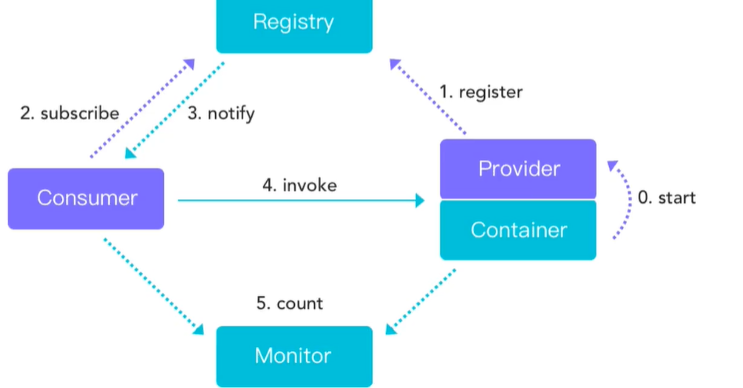
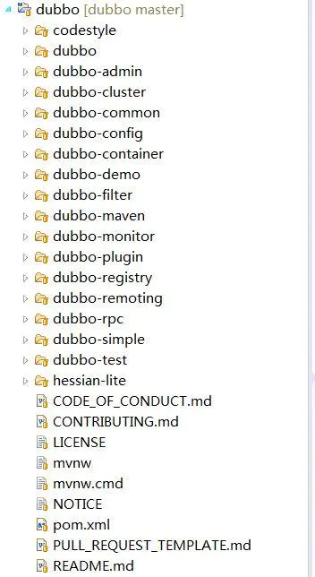

## 1、Dubbo简介

   Dubbo是阿里巴巴公司开源的一个高性能优秀的服务框架，使得应用可通过高性能的 RPC 实现服务的输出和输入功能，可以和 Spring框架无缝集成。

  Dubbo 包含如下核心内容：

1. RPC 远程调用： 封装了长连接NIO 框架，如Netty 、Mina 等，采用的是多线程模式
2. 集群容错： 提供了基于接口方法的远程调用的功能， 并实现了负载均衡策略、失败容错等功能
3. 服务发现：集成了Apache 的Zookeeper 组件，用于服务的注册和发现

## 2、Dubbo的框架

dubbo 依赖于反射和代理去实现;dubbo 消费方服务是不停监听注册中心的注册服务， 如果服务数据改变，将注册的服务数据从注册中心 给拿到消费者服务里面。

基于RPC层，服务提供方和服务消费方之间的调用关系。 Registry 不是只能用 zookeeper， 可以使用 redis 或者其他 的

- Provider: 暴露服务的服务提供方。

- Consumer: 调用远程服务的服务消费方。
- Registry: 服务注册与发现的注册中心。
- Monitor: 统计服务的调用次数和调用时间的监控中心。

**调用流程**

0. 服务容器负责启动，加载，运行服务提供者。

1. 服务提供者在启动时，向注册中心注册自己提供的服务。

2. 服务消费者在启动时，向注册中心订阅自己所需的服务。

3. 注册中心返回服务提供者地址列表给消费者，如果有变更，注册中心将基于长连接推送变更数据给消费者。

4. 服务消费者，从提供者地址列表中，基于软负载均衡算法，选一台提供者进行调用，如果调用失败，再选另一台调用。

5. 服务消费者和提供者，在内存中累计调用次数和调用时间，定时每分钟发送一次统计数据到监控中心

## 3、Dubbo的注册中心

   注册中心需要服务的提供者和消费者在启动和停止时自动注册，消费者在选择提供者也先通过在注册中心根据集群的选择策略来确定服务者。Dubbo的注册中心支持Zookeeper注册中心、Multicast注册中心、Redis注册中心等。其中，Zookeeper使用较为普遍。

## 4、Dubbo项目

Dubbo项目可以在 [http://dubbo.io/](https://link.jianshu.com?t=http%3A%2F%2Fdubbo.io%2F) 下载，目前版本是2.5.8。目录结构如下图：

可以通过Dubbo的代码（使用Maven管理）组织，与上面的模块进行比较。简单说明各个包的情况：

- dubbo-common 公共逻辑模块，包括Util类和通用模型。
- dubbo-remoting 远程通讯模块，相当于Dubbo协议的实现，如果RPC用RMI协议则不需要使用此包。
- dubbo-rpc 远程调用模块，抽象各种协议，以及动态代理，只包含一对一的调用，不关心集群的管理。
- dubbo-cluster 集群模块，将多个服务提供方伪装为一个提供方，包括：负载均衡、容错、路由等，集群的地址列表可以是静态配置的，也可以是由注册中心下发。
- dubbo-registry 注册中心模块，基于注册中心下发地址的集群方式，以及对各种注册中心的抽象。
- dubbo-monitor 监控模块，统计服务调用次数，调用时间的，调用链跟踪的服务。
- dubbo-config 配置模块，是Dubbo对外的API，用户通过Config使用Dubbo，隐藏Dubbo所有细节。
- dubbo-container 容器模块，是一个Standalone的容器，以简单的Main加载Spring启动，因为服务通常不需要Tomcat/JBoss等Web容器的特性，没必要用Web容器去加载服务。

## 5、Dubbo 具有以下特性：

1. 连通性： 注册中心负责服务的注册，监控中心负责收集调用次数、调用时间；注册中心、服务提供者、服务消费者为长连接
2. 健壮性：监控中心宕机不影响其他服务的使用；注册中心集群，任意一个实例宕机自动切换到另一个注册中心实例；服务实例集群， 任意一个实例宕机，自动切换到另外一个可用的实例
3. 伸缩性：可以动态增减注册中心和服务的实例数量
4. 升级性：服务集群升级，不会对现有架构造成压力