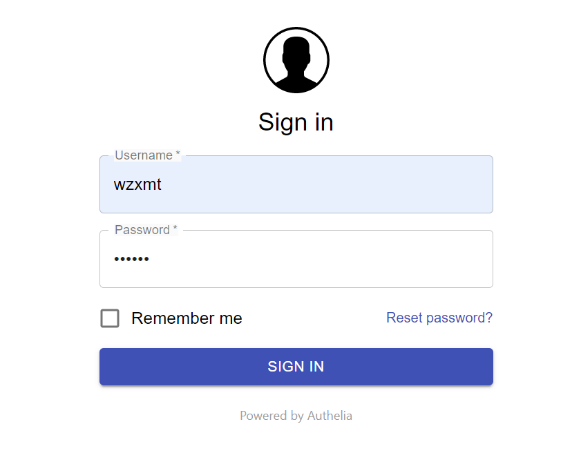

# 开源sso单点登录验证Authelia docker部署

**Authelia** 是一个开源的认证系统，目前支持双因素认证和单点登陆 SSO 认证，SSO 登陆是有 Web 界面支持的。它可以很好的与反向代理进行集成，比如 nginx，Traefik，HAProxy 等，对于通过这些反向代理的服务，如果没有通过认证将会把页面重定向到登陆页面。

**HTTP/HTTPS**

Authelia仅适用于通过HTTPS服务的网站，因为会话cookie只能通过安全连接进行传输。请注意，我们已决定我们将不支持通过HTTP服务的网站，以避免由于配置错误而造成的任何风险。

如果需要自签名证书，则可以使用以下命令来生成一个证书：

```bash
docker run -v /tmp/certs:/tmp/certs authelia/authelia authelia certificates generate --host wzxmt.com --dir /tmp/certs
```

**Authelia** 项目的架构如下：


Docker方式部署

```bash
git clone https://github.com/authelia/authelia.git
cd authelia/compose/localsudo 
./setup.sh #执行此命令需要sudo来修改/etc/hosts文件
```

执行后显示如下：

```bash
[root@supper local]# ./setup.sh
Checking for pre-requisites
Pulling Authelia docker image for setup
What root domain would you like to protect? (default/no selection is example.com): wzxmt.com
Generating SSL certificate for *.wzxmt.com
Enter your username for Authelia: wzxmt.com
Enter your display name for Authelia (eg. John Doe): wzxmt
Enter a password for wzxmt.com:
......
Setup completed successfully.

You can now visit the following locations:
- https://public.wzxmt.com - Bypasses Authelia
- https://traefik.wzxmt.com - Secured with Authelia one-factor authentication
- https://secure.wzxmt.com - Secured with Authelia two-factor authentication (see note below)

You will need to authorize the self-signed certificate upon visiting each domain.
To visit https://secure.wzxmt.com you will need to register a device for second factor authentication and confirm by clicking on a link sent by email. Since this is a demo with a fake email address, the content of the email will be stored in './authelia/notification.txt'.
Upon registering, you can grab this link easily by running the following command: 'grep -Eo '"https://.*" ' ./authelia/notification.txt'.
```

将要访问的域名都映射到本地hosts

```
10.0.0.20	public.wzxmt.com  #绕过Authelia
10.0.0.20	traefik.wzxmt.com #通过Authelia身份验证进行保护
10.0.0.20	secure.wzxmt.com  #通过Authelia两因素身份验证进行安全保护
10.0.0.20	authelia.wzxmt.com #authelia身份验证地址
```

工作流程：

```
配置了反向代理，以便每个传入请求都生成发送到Authelia(authelia.wzxmt.com)的身份验证请求。Authelia做出响应，并指示反向代理允许传入的请求通过，或者由于用户未经过身份验证或没有足够的授权而阻止该请求。当未经身份验证的用户的第一个请求命中反向代理时，由于没有将会话cookie与请求一起发送，因此Authelia确定用户未通过身份验证。因此，Austhelia将用户重定向到Authelia本身提供的身份验证门户。然后，用户可以使用该门户网站执行身份验证工作流，以获取对Authelia保护的域的所有子域均有效的会话cookie。当用户再次访问初始网站时，查询将与会话cookie一起发送，该会话cookie在身份验证请求中转发给Authelia。这次，Austhelia可以验证用户的身份，并订购反向代理以使查询通过。
```

配置文件解读：

```yaml
###############################################################
#                   Authelia configuration                    #
###############################################################
host: 0.0.0.0
port: 9091
log_level: debug
jwt_secret: a_very_important_secret
default_redirection_url: https://public.wzxmt.com  #默认重定向url
totp:
  issuer: authelia.com
 
authentication_backend:
  file:
    path: /config/users_database.yml #Authelia验证账户存放文件可接入ldap
 
access_control:
  default_policy: deny
  rules:
    - domain: public.wzxmt.com
      policy: bypass   #其实是bypassed绕过验证，一般生产这个不会用
    - domain: traefik.wzxmt.com
      policy: one_factor #需要一个验证条件
    - domain: secure.wzxmt.com
      policy: two_factor #需要两个验证条件
 
session:
  name: authelia_session
  secret: unsecure_session_secret
  expiration: 3600 # 1 hour
  inactivity: 300 # 5 minutes
  domain: wzxmt.com # 被保护的域名
 
regulation:
  max_retries: 3
  find_time: 120
  ban_time: 300
 
storage:
  local:
    path: /config/db.sqlite3
 
notifier:
  filesystem:
    filename: /config/notification.txt  #发送邮件存放地点
```

测试：

1.public.wzxmt.com #绕过Authelia（直接可访问）


**2.traefik.wzxmt.com #通过Authelia身份验证进行保护**


输入你执行setup时候设置的验证账户登录

```
wzxmt
wzxmt
```

验证通过后进入traefik dashboard


**3. secure.wzxmt.com #通过Authelia两因素身份验证进行安全保护**

继续进入验证页面



点击Not registered yet 他会向你邮箱发送一个链接邀请你加入一个类似网易将军令的东西
APP名称叫做：Authenticator 应用商店搜索下载

去notification.txt查看邮件内容


打开链接


然后使用 Authenticator 扫码加入，点击进入你就可以看到一次性密码啦

二次认证输入app上的一次性密码(这个密码大约30秒更新一次)


前提啊，前提你的这个域名要在公网可以访问，不能是像我一样写入到hosts文件的。否则这个一次性密码，你本地是无法使用的。