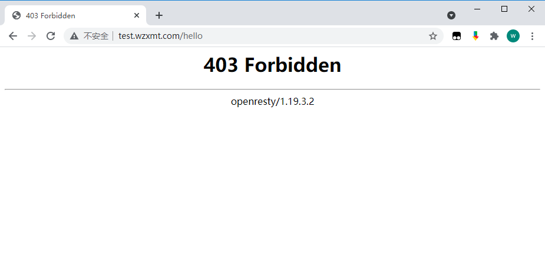
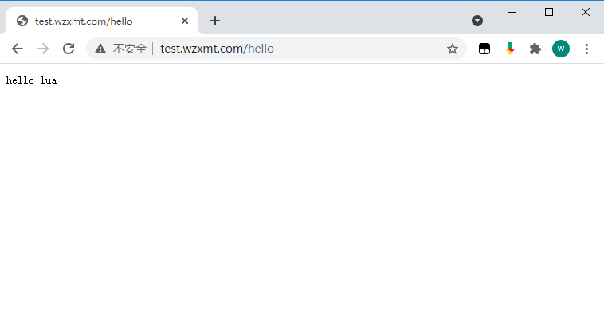
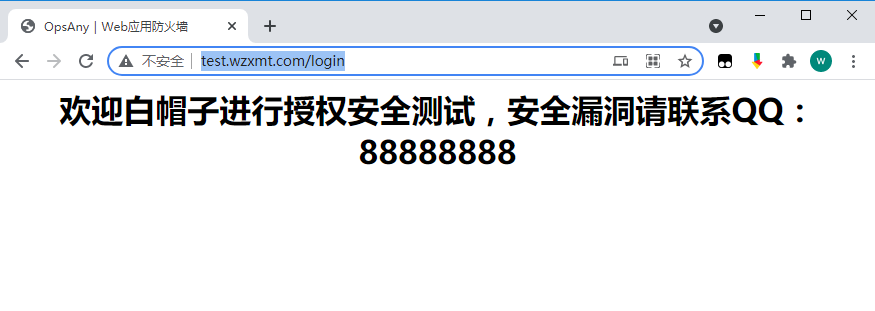
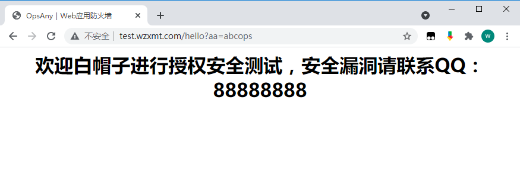

 ## Openresty简介

OpenResty® 是一个结合了 Nginx 与 Lua 的高性能 Web 平台，其内部集成了大量精良的 Lua 库、第三方模块以及大多数的依赖项。用于方便地搭建能够处理超高并发、扩展性极高的动态 Web 应用、Web 服务和动态网关。
OpenResty® 通过汇聚各种设计精良的 Nginx 模块（主要由 OpenResty 团队自主开发），从而将 Nginx 有效地变成一个强大的通用 Web 应用平台。这样，Web 开发人员和系统工程师可以使用 Lua 脚本语言调动 Nginx 支持的各种 C 以及 Lua 模块，快速构造出足以胜任 10K 乃至 1000K 以上单机并发连接的高性能 Web 应用系统。
OpenResty® 的目标是让你的Web服务直接跑在 Nginx 服务内部，充分利用 Nginx 的非阻塞 I/O 模型，不仅仅对 HTTP 客户端请求,甚至于对远程后端诸如 MySQL、PostgreSQL、Memcached 以及 Redis 等都进行一致的高性能响应。

 ## Openresty安装

 以下采用CentOS 7进行部署

###  1、安装依赖开发组件

 - pcre-devel： 扩展的正则表达式引擎
 - openssl-devel：openssl库，实现http支持https协议
 - zlib-devel：zlib库是网络通信压缩库
 - readline-devel：readline是安装Openresty所必须的依赖包

 ```bash
 yum install -y gcc-c++ gmake libtool pcre pcre-devel openssl openssl-devel zlib zlib-devel readline readline-devel
 ```

### 2、创建nginx用户组

 Nginx的Master主进程以root用户身份运行，而worker子进程我们指定它为nginx用户运行

 ```bash
 groupadd  nginx
 useradd -M  -s /sbin/nologin  -g  nginx  nginx
 ```

###  3、下载Openresty

```bash
cd /usr/local/src
wget https://openresty.org/download/openresty-1.19.3.2.tar.gz
tar xf openresty-1.19.3.2.tar.gz
cd openresty-1.19.3.2
```

### 4、编译Openresty配置过程

 ```bash
 ./configure --prefix=/usr/local/openresty \
 --user=nginx \
 --group=nginx \
 --with-pcre \
 --with-stream \
 --with-threads \
 --with-file-aio \
 --with-http_v2_module \
 --with-http_ssl_module \
 --with-http_realip_module \
 --with-http_gzip_static_module \
 --with-http_stub_status_module
 ```

### 5、编译安装

```bash
gmake && gmake install
```

### 6、添加环境变量

 ```bash
 echo 'export PATH=$PATH:/usr/local/openresty/bin:/usr/local/openresty/nginx/sbin' >>/etc/profile
 source /etc/profile
 ```

### 7、修改nginx配置

```nginx
cat << 'EOF' >/usr/local/openresty/nginx/conf/nginx.conf
user  nginx;
worker_processes  auto;

error_log  logs/error.log;
pid        logs/nginx.pid;

events {
    worker_connections  1024;
}

http {
    include       mime.types;
    default_type  application/octet-stream;
    log_format  main  '$remote_addr - $remote_user [$time_local] "$request" '
                      '$status $body_bytes_sent "$http_referer" '
                      '"$http_user_agent" "$http_x_forwarded_for"';

    access_log  logs/access.log  main;
    sendfile       on;
    tcp_nopush     on;
    keepalive_timeout  65;
    gzip  on;
    include /usr/local/openresty/nginx/conf/vhost/*.conf;
}
EOF
```

配置分离

```bash
mkdir -p /usr/local/openresty/nginx/conf/vhost
```

### 8.测试Lua配置

 ```nginx
 cat << 'EOF' >/usr/local/openresty/nginx/conf/vhost/test.conf
 server {
     listen       80;
     server_name  test.wzxmt.com;
 
     location / {
         root   html;
         index  index.html index.htm;
     }
     # 测试Nginx Lua
     location /hello {
         default_type 'text/plain';
         content_by_lua 'ngx.say("hello lua")';
     }
     # 测试获取客户端ip
     location /myip {
         default_type 'text/plain';
         content_by_lua '
         clientIP = ngx.req.get_headers()["x_forwarded_for"]
         ngx.say("IP:",clientIP)';  
     }
 }
 EOF
 ```

### 9、授权并启动

```
chown -R nginx. /usr/local/openresty
nginx 
```

### 10、测试访问

http://test.wzxmt.com/hello

 ## 什么是WAF

 Web应用防护系统（也称为：网站应用级入侵防御系统。英文：Web Application Firewall，简称： WAF）。利用国际上公认的一种说法：Web应用防火墙是通过执行一系列针对HTTP/HTTPS的安全策略来专门为Web应用提供保护的一款产品。

 ## 实现WAF

 **实现WAF的方式有两种：**

 1. 使用nginx+lua来实现WAF,须在编译nginx的时候配置上lua
 2. 部署OpenResty,不需要在编译nginx的时候指定lua

 WAF一句话描述，就是解析HTTP请求（协议解析模块），规则检测（规则模块），做不同的防御动作（动作模块），并将防御过程（日志模块）记录下来。所以本文中的WAF的实现由五个模块(配置模块、协议解析模块、规则模块、动作模块、错误处理模块）组成。

 ## WAF的功能

 1. 支持IP白名单和黑名单功能，直接将黑名单的IP访问拒绝。
 2. 支持URL白名单，将不需要过滤的URL进行定义。
 3. 支持User-Agent的过滤，匹配自定义规则中的条目，然后进行处理（返回403）。
 4. 支持CC攻击防护，单个URL指定时间的访问次数，超过设定值，直接返回403。
 5. 支持Cookie过滤，匹配自定义规则中的条目，然后进行处理（返回403）。
 6. 支持URL过滤，匹配自定义规则中的条目，如果用户请求的URL包含这些，返回403。
 7. 支持URL参数过滤，原理同上。
 8. 支持日志记录，将所有拒绝的操作，记录到日志中去。
 9. 日志记录为JSON格式，便于日志分析，例如使用ELKStack进行攻击日志收集、存储、搜索和展示。

 ## 部署WAF

 WAF已经有人通过lua写出了这个开源的功能，在此直接拿来用即可。
 GitHub地址：https://github.com/unixhot/waf

### 1、下载waf模块

 ```bash
 git clone https://github.com/unixhot/waf.git
 cp -a ./waf/waf /usr/local/openresty/nginx/conf
 chown -R nginx. /usr/local/openresty
 ```

###  2、waf文件介绍

 ```bash
 cookie.rule             #Cookie策略文件
 args.rule               #异常Get参数策略文件
 whiteurl.rule           #白名单URL策略文件
 whiteip.rule            #IP白名单策略文件
 useragent.rule          #异常UserAgent策略文件
 url.rule                #异常URL策略文件
 post.rule               #异常POST参数策略文件
 blackip.rule            #IP黑名单策略文件
 ```

 ## Openresty引入WAF模块

### 1、http配置下引入WAF模块

 ```nginx
     lua_shared_dict limit 10m;
     lua_package_path "/usr/local/openresty/nginx/conf/waf/?.lua";
     init_by_lua_file "/usr/local/openresty/nginx/conf/waf/init.lua";
     access_by_lua_file "/usr/local/openresty/nginx/conf/waf/access.lua";
 ```

###  2、重启Openrestyd

 ```bash
 openresty -t
 openresty -s reload
 ```

###  3、查看nginx error.log

 警告如下：`failed to load the 'resty.core' module` 加载 resty.core 核心模块失败，然后下面还有十几行找不到文件的日志

 ```json
 cat /usr/local/openresty/nginx/logs/error.log
 2021/09/29 15:57:43 [alert] 53318#53318: failed to load the 'resty.core' module (https://github.com/openresty/lua-resty-core); ensure you are using an OpenResty release from https://openresty.org/en/download.html (reason: module 'resty.core' not found:
 	no field package.preload['resty.core']
 	no file '/usr/local/openresty/nginx/conf/waf/resty/core.lua'
 	no file '/usr/local/openresty/site/lualib/resty/core.so'
 	no file '/usr/local/openresty/lualib/resty/core.so'
 	no file './resty/core.so'
 	no file '/usr/local/lib/lua/5.1/resty/core.so'
 	no file '/usr/local/openresty/luajit/lib/lua/5.1/resty/core.so'
 	no file '/usr/local/lib/lua/5.1/loadall.so'
 	no file '/usr/local/openresty/site/lualib/resty.so'
 	no file '/usr/local/openresty/lualib/resty.so'
 	no file './resty.so'
 	no file '/usr/local/lib/lua/5.1/resty.so'
 	no file '/usr/local/openresty/luajit/lib/lua/5.1/resty.so'
 	no file '/usr/local/lib/lua/5.1/loadall.so') in /usr/local/openresty/nginx/conf/nginx.conf:30
 ```

###  4、解决办法如下

 上面告警是缺少 `lua-resty-core` 模块，从而找不到这些信息，所以我们要下载lua-resty-core模块然后引入到Openresty

 ```bash
 git clone https://github.com/openresty/lua-resty-core.git
 mv lua-resty-core /usr/local/openresty
 ```

 然后修改nginx配置文件来引入此模块,如下格式添加到第二行的后面

 ```nginx
     lua_shared_dict limit 10m;
     lua_package_path "/usr/local/openresty/nginx/conf/waf/?.lua;/usr/local/openresty/lua-resty-core/lib/?.lua;;";
     init_by_lua_file "/usr/local/openresty/nginx/conf/waf/init.lua";
     access_by_lua_file "/usr/local/openresty/nginx/conf/waf/access.lua";
 ```

###  5、然后保存退出重启看日志

 ```bash
 openresty -t && openresty -s reload
 ```

 确保日志无异常后则成功引入WAF模块

 ## WAF模块配置文件详解

 来学习一下waf/config.lua配置文件中的内容

 ```json
 cat /usr/local/openresty/nginx/conf/waf/config.lua
 --lua文件中，--为行注释，
 --[[ 
 这是块注释
 --]]
 config_waf_enable = "on"        --是否启用waf模块，值为 on 或 off
 config_log_dir = "/tmp"         --waf的日志位置，日志格式默认为json
 config_rule_dir = "/usr/local/openresty/nginx/conf/waf/rule-config" --策略规则目录位置，可根据情况变动
 config_white_url_check = "on"   --是否开启URL检测
 config_white_ip_check = "on"    --是否开启IP白名单检测
 config_black_ip_check = "on"    --是否开启IP黑名单检测
 config_url_check = "on"         --是否开启URL过滤
 config_url_args_check = "on"    --是否开启Get参数过滤
 config_user_agent_check = "on"  --是否开启UserAgent客户端过滤
 config_cookie_check = "on"      --是否开启cookie过滤
 config_cc_check = "on"          --是否开启cc攻击过滤
 config_cc_rate = "10/60"        --cc攻击的速率/时间，单位为秒；默认示例中为单个IP地址在60秒内访问同一个页面次数超过10次则认为是cc攻击，则自动禁止此IP地址访问此页面60秒，60秒后解封(封禁过程中此IP地址依然可以访问其它页面，如果同一个页面访问次数超过10次依然会被禁止)
 config_post_check = "on"        --是否开启POST检测
 config_waf_output = "html"      --对于违反规则的请求则跳转到一个自定义html页面还是指定页面，值为 html 和 redirect
 config_waf_redirect_url = "https://www.unixhot.com"     --指定违反请求后跳转的指定html页面
 --指定违反规则后跳转的自定义html页面
 config_output_html=[[
 <html>
 <head>
 <meta http-equiv="Content-Type" content="text/html; charset=utf-8" />
 <meta http-equiv="Content-Language" content="zh-cn" />
 <title>网站防火墙</title>
 </head>
 <body>
 <h1 align="center"> 欢迎白帽子进行授权安全测试，安全漏洞请联系QQ：88888888
 </body>
 </html>
 ]]
 ```

 ### IP黑名单配置

 需要在config.lua中开启`config_black_ip_check = "on"`参数
 IP黑名单配置非常简单，这个与Nginx的`ngx_http_access_module`模块原理是一致的，只需要把拒绝的地址加入到 waf/rule-config/blackip.rule文件中即可

 然后访问Openresty地址，如下已返回403被禁止



 ### IP白名单配置

 需要在config.lua中开启`config_white_ip_check = "on"`参数
 IP白名单与黑名单相反，**添加到IP白名单中的IP不受WAF限制**,具体请自行测试

 ```bash
 cat /usr/local/openresty/nginx/conf/waf/rule-config/whiteip.rule
 ```

 ### CC攻击过滤

 需要在config.lua中开启`config_cc_check = "on"`参数，然后指定`config_cc_rate = "10/60"`速率和时间
 CC攻击只需要在config.lua配置文件中指定上面的两个参数即可

 如下指定在60秒内对于单个IP地址访问单个页面的次数最大10次，超过10次则自动拉入黑名单，60秒后自动解除

 ```bash
 cat /usr/local/openresty/nginx/conf/waf/config.luaconfig
 ```

 然后进行测试,如下刷新10次以后就变为来403


 

 我们换个页面再次刷新，如下换个页面可以正常访问，不过连续对一个页面60秒内刷新10次以后将也被拉入黑名单



  注：以上的请求速率和时间只能作为参考，大家线上使用具体还要根据相应环境进行调整

 ### 异常URL策略配置

 需要在config.lua中开启`config_url_check = "on"`参数
 然后定义`rule-config/url.rule`文件，url.rule文件默认为如下，如果匹配到规则的将跳转到由config.lua中`config_waf_output = "html"`参数指定的页面

 1. 禁止URL访问 `.htaccess|.bash_history` 的文件
 2. 禁止URL访问包含带有`phpmyadmin|jmx-console|admin-console|jmxinvokerservlet`地址
 3. 禁止URL访问包含 `java.lang` 的地址
 4. 禁止URL访问包含 `.svn/` 的地址

 ```nginx
 \.(htaccess|bash_history)
 \.(bak|inc|old|mdb|sql|backup|java|class|tgz|gz|tar|zip)$
 (phpmyadmin|jmx-console|admin-console|jmxinvokerservlet)
 java\.lang
 \.svn\/
 /(attachments|upimg|images|css|uploadfiles|html|uploads|templets|static|template|data|inc|forumdata|upload|includes|cache|avatar)/(\\w+).(php|jsp)
 ```

 假如你不想让别人访问根下的/login，那么就可以写入到配置中

 ```nginx
 \.(htaccess|bash_history)
 \.(bak|inc|old|mdb|sql|backup|java|class|tgz|gz|tar|zip)$
 (phpmyadmin|jmx-console|admin-console|jmxinvokerservlet)
 java\.lang
 \.svn\/
 /(attachments|upimg|images|css|uploadfiles|html|uploads|templets|static|template|data|inc|forumdata|upload|includes|cache|avatar)/(\\w+).(php|jsp)
 /login
 ```

 然后进行重启后访问,如下就跳转到了我们在config.lua中指定的页面，此页面可根据需求进行修改。如果上面默认的url规则匹配到了你的地址，那么你就可以把相应配置去掉



 ### 异常UserAgent策略配置

 需要在config.lua中开启`config_user_agent_check = "on"`参数

 WAF模块中默认封锁了以下UserAgent，如
 HTTrack网站下载
 namp网络扫描
 audit网络审计
 dirbuster网站目录扫描
 pangolin SQL注入工具
 scan网络扫描
 hydra密码暴力破解
 libwww漏洞工具
 sqlmap自动SQL注入工具
 w3af网络扫描
 Nikto Web漏洞扫描
 …
 等等

 ```nginx
 (HTTrack|harvest|audit|dirbuster|pangolin|nmap|sqln|-scan|hydra|Parser|libwww|BBBike|sqlmap|w3af|owasp|Nikto|fimap|havij|PycURL|zmeu|BabyKrokodil|netsparker|httperf|bench)
 ```

 我们正常访问URL是没问题的，下面来模拟一个非法的UserAgent进行访问

 ```html
 #模拟网站下载
 curl http://test.wzxmt.com/ --user-agent 'HTTrack'
 <html>
 <head>
 <meta http-equiv="Content-Type" content="text/html; charset=utf-8" />
 <meta http-equiv="Content-Language" content="zh-cn" />
 <title>OpsAny｜Web应用防火墙</title>
 </head>
 <body>
 <h1 align="center"> 欢迎白帽子进行授权安全测试，安全漏洞请联系QQ：88888888
 </body>
 </html>
 #模拟nmap网络扫描
 curl http://test.wzxmt.com/ --user-agent 'nmap'
 <html>
 <head>
 <meta http-equiv="Content-Type" content="text/html; charset=utf-8" />
 <meta http-equiv="Content-Language" content="zh-cn" />
 <title>OpsAny｜Web应用防火墙</title>
 </head>
 <body>
 <h1 align="center"> 欢迎白帽子进行授权安全测试，安全漏洞请联系QQ：88888888
 </body>
 </html>
 ```

 添加禁止Chrome浏览器访问的UserAgent

 ```nginx
 (HTTrack|harvest|audit|dirbuster|pangolin|nmap|sqln|-scan|hydra|Parser|libwww|BBBike|sqlmap|w3af|owasp|Nikto|fimap|havij|PycURL|zmeu|BabyKrokodil|netsparker|httperf|bench|Chrome)
 ```

 然后重启Openrestry，通过Chrome浏览器进行访问


 

 如上所示全部命中了WAF的规则

 ### 异常Get参数策略配置

 需要在config.lua配置中开启`config_url_args_check = "on"`参数

 默认封锁了如下：

 ```nginx
 \.\./
 \:\$
 \$\{
 select.+(from|limit)
 (?:(union(.*?)select))
 having|rongjitest
 sleep\((\s*)(\d*)(\s*)\)
 benchmark\((.*)\,(.*)\)
 base64_decode\(
 (?:from\W+information_schema\W)
 (?:(?:current_)user|database|schema|connection_id)\s*\(
 (?:etc\/\W*passwd)
 into(\s+)+(?:dump|out)file\s*
 group\s+by.+\(
 xwork.MethodAccessor
 (?:define|eval|file_get_contents|include|require|require_once|shell_exec|phpinfo|system|passthru|preg_\w+|execute|echo|print|print_r|var_dump|(fp)open|alert|showmodaldialog)\(
 xwork\.MethodAccessor
 (gopher|doc|php|glob|file|phar|zlib|ftp|ldap|dict|ogg|data)\:\/
 java\.lang
 \$_(GET|post|cookie|files|session|env|phplib|GLOBALS|SERVER)\[
 \<(iframe|script|body|img|layer|div|meta|style|base|object|input)
 (onmouseover|onerror|onload)\=
 ```

 我们进行访问 `http://test.wzxmt.com/hello?aa=select id from mysql`,得到如下，进行匹配

 ```html
 curl 'http://test.wzxmt.com/hello?aa=select id from mysql'
 <html>
 <head>
 <meta http-equiv="Content-Type" content="text/html; charset=utf-8" />
 <meta http-equiv="Content-Language" content="zh-cn" />
 <title>网站防火墙</title>
 </head>
 <body>
 <h1 align="center"> 欢迎白帽子进行授权安全测试，安全漏洞请联系QQ：88888888
 </body>
 </html>
 ```

 我们也可以根据自己需求去配置，如下最后添加abcops

 ```nginx
 \.\./
 \:\$
 \$\{
 select.+(from|limit)
 (?:(union(.*?)select))
 having|rongjitest
 sleep\((\s*)(\d*)(\s*)\)
 benchmark\((.*)\,(.*)\)
 base64_decode\(
 (?:from\W+information_schema\W)
 (?:(?:current_)user|database|schema|connection_id)\s*\(
 (?:etc\/\W*passwd)
 into(\s+)+(?:dump|out)file\s*
 group\s+by.+\(
 xwork.MethodAccessor
 (?:define|eval|file_get_contents|include|require|require_once|shell_exec|phpinfo|system|passthru|preg_\w+|execute|echo|print|print_r|var_dump|(fp)open|alert|showmodaldialog)\(
 xwork\.MethodAccessor
 (gopher|doc|php|glob|file|phar|zlib|ftp|ldap|dict|ogg|data)\:\/
 java\.lang
 \$_(GET|post|cookie|files|session|env|phplib|GLOBALS|SERVER)\[
 \<(iframe|script|body|img|layer|div|meta|style|base|object|input)
 (onmouseover|onerror|onload)\=
 abcops      
 ```

 然后我们进行访问`http://test.wzxmt.com/hello?aa=abcops`也会匹配到规则



 ### 异常POST参数策略配置

 需要在config.lua中开启`config_post_check = "on"`选项

 默认POST请求封禁如下，POST封禁内容与GET相似

 ```nginx
 \.\./
 select.+(from|limit)
 (?:(union(.*?)select))
 having|rongjitest
 sleep\((\s*)(\d*)(\s*)\)
 benchmark\((.*)\,(.*)\)
 base64_decode\(
 (?:from\W+information_schema\W)
 (?:(?:current_)user|database|schema|connection_id)\s*\(
 (?:etc\/\W*passwd)
 into(\s+)+(?:dump|out)file\s*
 group\s+by.+\(
 xwork.MethodAccessor
 (?:define|eval|file_get_contents|include|require|require_once|shell_exec|phpinfo|system|passthru|preg_\w+|execute|echo|print|print_r|var_dump|(fp)open|alert|showmodaldialog)\(
 xwork\.MethodAccessor
 (gopher|doc|php|glob|file|phar|zlib|ftp|ldap|dict|ogg|data)\:\/
 java\.lang
 \$_(GET|post|cookie|files|session|env|phplib|GLOBALS|SERVER)\[
 \<(iframe|script|body|img|layer|div|meta|style|base|object|input)
 (onmouseover|onerror|onload)\=
 ```

 直接对POST策略进行提交请求，通过curl -XPOST来进行提交POST请求

 ```html
 [root@k8s ~]# curl -X POST 'http://test.wzxmt.com/hello?aa=select id from mysql'
 <html>
 <head>
 <meta http-equiv="Content-Type" content="text/html; charset=utf-8" />
 <meta http-equiv="Content-Language" content="zh-cn" />
 <title>OpsAny｜Web应用防火墙</title>
 </head>
 <body>
 <h1 align="center"> 欢迎白帽子进行授权安全测试，安全漏洞请联系QQ：88888888
 </body>
 </html>
 ```

 如上命中规则，我们查看Openrestry日志，查看是否为POST请求

 ```nginx
 [root@k8s ~]# tail -1 /usr/local/openresty/nginx/logs/access.log
 127.0.0.1 - - [29/Sep/2021:16:54:26 +0800] "POST /hello?aa=select id from mysql HTTP/1.1" 403 323 "-" "curl/7.29.0" "-"
 ```

