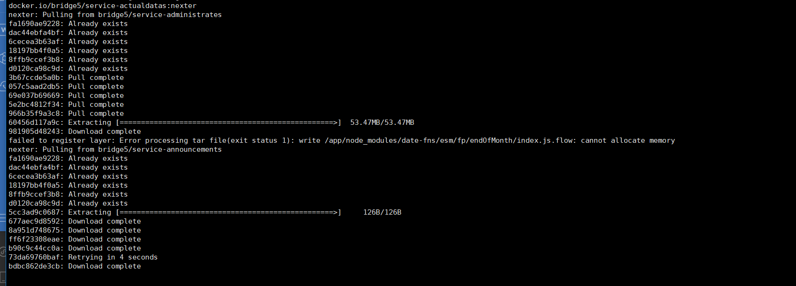

#### 1、k8s集群环境，docker拉取镜像: Cannot allocate memory

**问题**

测试环境拉取镜像cannot allocate memory

**排查过程**：

进程数并没满，然后排查相关组键问题，k8s采用的二进制部署，因而与docker相关的组件有kubelet与flanld以及docker版本有关，测试发现更换版本并未解决问题；测试发现停掉flanld服务，重启主机，还是不能拉取镜像，关闭kubelet服务，重启主机，发现可以正常拉取镜像，因此排查出kubelet影响了镜像的拉取，经排查相应配置时发现一些久配置（已弃用），怀疑与这些旧配置影响镜像拉取

**解决**

剔除旧配置，重启服务，可以正常拉取。




#### 2、非443端口启用https

需要添加以下配置，否则应用访问不了

```
ssl on;
```

#### 3、kubelet报错

**问题**

通过 journalctl -u kubelet -f 命令看kubelet日志,就没有 Orphaned pod found - but volume paths are still present on disk报错

**排查**

通过`journalctl -u kubelet -f`发现一直在报以上错误，从错误信息可以推测出，这台节点存在一个孤立的Pod，并且该Pod挂载了数据卷(volume)，阻碍了Kubelet对孤立的Pod正常回收清理.kubelet 默认把一些数据信息存放在 `/var/lib/kubelet` 目录下，通过 `Pod Id`能查找到pod 挂载的数据。

**解决**

通过查看 `etc-hosts` 文件的 `pod name` 名称，查看集群中是否还有相关实例在运行，如果没有直接删除

或者重启kubelet

#### 4、docker-compose起不来

Cannot start service backup-beta: OCI runtime create failed: container_linux.go:367: starting container process caused: process_linux.go:352: getting the final child's pid from pipe caused: EOF: unknown

根据报错，查看版本号无差异

free -m 查看发现free较少，buff较多，因资源限定，导致起不来，清除buff，重新启动可以正常运行

#### 5、1 node(s) had taint {node.kubernetes.io/disk-pressure: }, that the pod didn‘t tolerate

基于污点的驱逐 ：   

当某种条件为真时，节点控制器会自动给节点添加一个污点。当前内置的污点包括：

node.kubernetes.io/not-ready：节点未准备好。这相当于节点状态 Ready 的值为 "False"。
node.kubernetes.io/unreachable：节点控制器访问不到节点. 这相当于节点状态 Ready 的值为 "Unknown"。
node.kubernetes.io/memory-pressure：节点存在内存压力。
node.kubernetes.io/disk-pressure：节点存在磁盘压力。
node.kubernetes.io/pid-pressure: 节点的 PID 压力。
node.kubernetes.io/network-unavailable：节点网络不可用。
node.kubernetes.io/unschedulable: 节点不可调度。
node.cloudprovider.kubernetes.io/uninitialized：如果 kubelet 启动时指定了一个 "外部" 云平台驱动， 它将给当前节点添加一个污点将其标志为不可用。在 cloud-controller-manager 的一个控制器初始化这个节点后，kubelet 将删除这个污点。

**解决方法：**

​    node上的kubelet负责采集资源占用数据，并和预先设置的threshold值进行比较，如果超过threshold值，kubelet会杀掉一些Pod来回收相关资源。

​    清除磁盘，重启pod，发现并不能创建pod，该节点的污点并不会自动取消，重启kubelet，可以看到pod启动。

#### 6、journal -f -u kub自动补全特别慢

原因：随着时间的增长，journal日志越来越大的问题

查看journal占用磁盘空间大小

```
journalctl --disk-usage
```

通过指定日志大小来解决问题

```
journalctl --vacuum-size=1G
```

#### 7、k8s删除Terminating状态的命名空间

查看ingress-system的namespace描述

```
kubectl get ns ingress-system  -o json > namespace-delete.json
```


编辑json文件，删除spec字段的内存，因为k8s集群时需要认证的。

namespace-delete.json
将

```
"spec": {
        "finalizers": [
            "kubernetes"
        ]
    },
```

更改为：

```
"spec": {
    
  },
```


新开一个窗口运行kubectl proxy跑一个API代理在本地的8081端口

```
kubectl proxy --port=8081
Starting to serve on 127.0.0.1:8081
```


最后运行curl命令进行删除

```
curl -k -H "Content-Type:application/json" -X PUT --data-binary @namespace-delete.json http://127.0.0.1:8081/api/v1/namespaces/ingress-system/finalize
```

#### 8、docker-compose起不来

ERROR: for alpha-reformdatas-server  Cannot start service server: driver failed programming external connectivity on endpoint alpha-reformdatas-server (884ea4e681a0eb8164eac04c68edb48cc97b65b221adb329f3bf635742477d49): Error starting userland proxy: listen tcp4 0.0.0.0:54004: bind: address already in use


排查： docker ps|grep 54004 发现端口并未占用，停掉服务一段时间，启动服务还是报端口被占用，其他功能正常，猜想可能是docker服务运行时间长，导致了一些bug，重启docker服务，解决问题

#### 9、failed to allocate for range 0: no IP addresses available in range set: 172.20.xx.1-172.20.xx.254

今天遇到一个机器上的Pod 在创建以后一直处于IContainerCreating的状态，通过describe pod发现no IP addresses available。

排查： 查看所有pod kubectl get pod -A |wc -l 只有70个，查看kubelet配置最大运行pod为150个，这不应该。经查阅资料，排查发现flannle给pod分配IP时，会将/var/lib/cni/flannel/下的文件名信息写入/var/lib/cni/networks/cbr0/下IP文件中，pod清除后，因为异常导致目录下的部分文件不会自动清除，时间久，就会造成ip地址不够用的这种现象发生。

解决

```
rm -f  /var/lib/cni/networks/cbr0/*
```

重新部署应用
